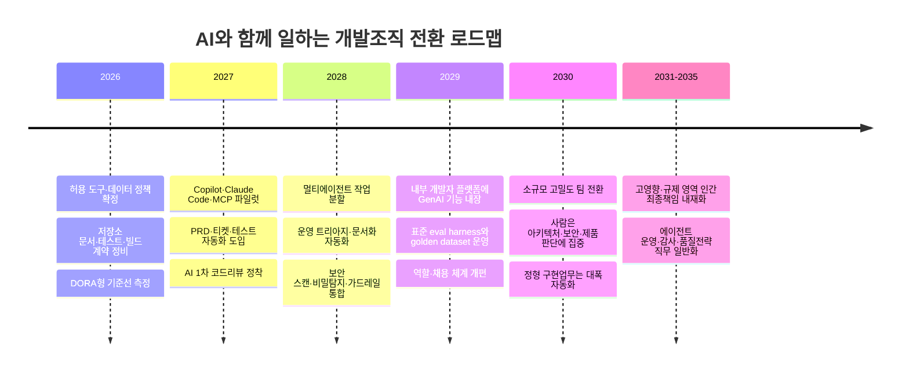

# 02. 개발자의 핵심 업무가 코딩에서 오케스트레이터로 바뀌는 이유

## Executive Summary

실리콘밸리 인터뷰와 Stanford course 자료가 공통으로 보여주는 변화는 분명하다. **개발자의 희소성은 이제 “얼마나 많은 코드를 직접 쓰는가”보다 “무엇을 만들어야 하는지 명확히 정의하고, 여러 AI 에이전트를 적절히 분할·통제하며, 결과물의 품질을 판별할 수 있는가”로 이동하고 있다.** 한국어 번역 저장소는 Stanford University 강좌 자료의 공식 허가 번역본이며, 원저자 미하일 에릭의 허가 아래 운영된다. 해당 강좌의 주차 구성은 LLM 기초, 코딩 에이전트 구조, AI IDE, 에이전트 패턴, 테스팅·보안, 코드 리뷰·문서화, 자동 UI 구축, 배포 후 운영, 미래 전망까지 SDLC 전범위를 포괄한다. 인터뷰에서 미하일 에릭은 사람의 역할을 “AI 에이전트 인턴들의 테크 리드이자 PM”에 가깝게 설명했고, 한 번에 많은 에이전트를 돌리기보다 작은 작업부터 점진적으로 확장하라고 조언했다.

하지만 **현재 AI의 성능은 균일하지 않다. 제한된 과제에서는 빠르고 강력하지만, 익숙한 대규모 코드베이스의 실제 업무에서는 오히려 속도를 떨어뜨릴 수도 있다.** 통제 실험에서는 GitHub Copilot 사용자가 제한된 JavaScript 과제를 55.8% 더 빨리 끝냈고, McKinsey 연구에서는 코드 작성·리팩터링·문서화 시간이 큰 폭으로 줄었다. **반면 METR의 무작위 대조 실험에서는 숙련된 오픈소스 개발자들이 자신이 잘 아는 저장소에서 AI를 쓸 때 평균 19% 더 오래 걸렸다.** 또 SWE-Lancer는 1,400개 이상의 실제 프리랜서 소프트웨어 엔지니어링 업무를 평가한 결과, 당시 frontier 모델들이 여전히 과반수 업무를 해결하지 못한다고 보고했다. **즉 “로컬 최적화된 부분 자동화”는 강하지만, “맥락이 깊은 전체 책임 업무”는 아직 인간 중심이다.**

따라서 가장 먼저 줄여야 할 영역은 보일러플레이트 구현, 반복적인 CRUD 작성, 1차 문서 초안, PR 설명/이슈 정리, 기계적 코드 스타일 리뷰, 단순 테스트 생성, 반복형 CI 스크립팅 같은 저판단·고반복 업무다. 반대로 가장 크게 키워야 할 영역은 문제 프레이밍, 평가 가능한 명세 작성, 아키텍처 trade-off 판단, 테스트 오라클 설계, 코드 리뷰의 안목, 보안·데이터 거버넌스, 관측성·장애 지휘, 그리고 여러 에이전트를 안전하게 운영하는 컨텍스트 엔지니어링 역량이다. Stanford 강의가 “에이전트 친화적 코드베이스”, “PRD 작성”, “테스팅과 보안”, “배포 후 에이전트 운영”을 핵심 모듈로 둔 이유가 바로 여기에 있다.

향후 3–5년의 승자는 **도구를 산 조직이 아니라 워크플로와 운영체계를 다시 설계한 조직일 가능성이 높다.** McKinsey & Company는 상위 성과 기업들이 단순 도입이 아니라 역할, 프로세스, 측정, 보상체계를 AI-네이티브하게 재설계한다고 정리했고, Gartner는 2028년까지 엔터프라이즈 소프트웨어 엔지니어의 90%가 AI 코드 어시스턴트를 쓰게 되며, 개발자의 역할이 구현에서 오케스트레이션으로 이동할 것이라고 전망했다. 동시에 한국에서는 2026년 1월 22일부터 시행 중인 AI 기본법, 개인정보 처리 안내서, 금융권 AI 가이드라인 개정 방향이 인간 개입, 투명성, 영향평가, 개인정보 전주기 관리, 보안성 검증을 더 중요하게 만들고 있다. **즉 기술 역량만이 아니라 규제 대응력과 운영 거버넌스가 개발자의 핵심 경쟁력으로 편입**되고 있다.

## 분석의 출발점과 가정

첫째, GitHub에 공개된 stanford-cs146s-kr 저장소는 Stanford course의 한국어 번역 프로젝트이며, 원저자의 공식 허가와 원본 강좌 링크를 명시한다. 둘째, 그 저장소의 syllabus는 이 과정이 단순한 “코드 생성” 강의가 아니라, LLM 이해부터 에이전트 구조, AI IDE, 멀티에이전트 운영, 테스트·보안, 코드 리뷰, 운영·트리아지까지 개발 생애주기 전체를 AI와 함께 재구성하는 수업임을 보여준다. 이 점 때문에 본 보고서는 “개발자 업무를 세분화한 뒤, 어떤 역할이 먼저 자동화되고 어떤 역할이 오히려 더 비싸지는가”라는 프레임으로 분석했다.

이 두 자료에서 반복적으로 등장하는 원칙은 네 가지다. **첫째, 생산 환경에서 “순수 vibe coding”은 아직 충분한 방법론이 아니며, 사람은 여전히 시스템·아키텍처·비즈니스 맥락을 제공해야 한다. 둘째, 멀티에이전트 활용은 처음부터 크게 시작하는 것이 아니라, 하나의 에이전트 워크플로를 안정화한 뒤 점진적으로 늘려야 한다. 셋째, 좋은 결과의 전제는 agent-friendly codebase인데, 여기에는 테스트 커버리지, README와 코드의 정합성, 일관된 설계 패턴이 포함된다. 넷째, 마지막 품질 차이는 결국 taste와 experiment discipline에서 나온다.** 이 네 가지 원칙은 이후 역할별 점수와 권고안의 기준선이 된다.

이 보고서의 “AI 위임 가능 비중 0–100%”는 직무 전체가 아니라, **해당 역할 안의 반복적이고 명시적이며 검증 가능한 하위작업 중 현재 AI에 위임할 수 있는 비중**을 뜻한다. 또한 이 수치는 2026년 시점의 일반적인 제품개발 조직을 가정한 종합 추정치이며, 사람의 승인·검토를 제거한 완전자율 비율이 아니다. 이렇게 정의한 이유는, 동일한 “코딩” 역할도 제한된 과제에서는 크게 빨라질 수 있지만, 익숙한 대규모 저장소의 실제 업무에서는 느려질 수 있다는 근거가 이미 혼재하기 때문이다.

가정도 분명히 둔다. 테스트·문서·빌드 파이프라인이 정비된 제품팀에서는 아래 표의 수치가 비교적 현실적일 수 있다. *반대로 테스트 계약이 약하고, README와 코드가 자주 어긋나며, 설계 패턴이 일정하지 않은 레거시 코드베이스에서는 구현·테스트·운영 영역의 수치를 표보다 10–20포인트 낮게 봐야 한다.* 또한 금융·공공·의료처럼 고영향 의사결정 또는 민감정보를 다루는 영역은 같은 기술 수준이라도 인간 승인과 책임 추적 요구가 더 크므로 자동화 허용 폭이 좁다.

## 왜 개발자의 핵심 업무가 코딩에서 오케스트레이터로 바뀌는가

앞의 전제와 가정을 모두 받아들이면 자연히 한 가지 질문이 남는다. 
“왜 하필 지금, 구현 중심의 개발자 역할이 오케스트레이터 중심으로 이동하는가?” 이 전환은 유행이나 마케팅 언어가 아니라, 세 가지 힘—**한계비용의 이동, 병목의 재배치, 책임 구조의 재편**—이 같은 방향으로 동시에 작용한 결과다. 뒤에 이어지는 역할별 표의 점수들은 이 세 힘의 귀결로 해석할 때 가장 정확하게 읽힌다. 이 절에서는 그 메커니즘을 하나씩 풀어본다.

### 구현의 한계비용이 0에 수렴하며 병목이 이동한다

소프트웨어 산업은 오랫동안 **구현 능력이 병목**인 업계였다. 한 줄의 코드를 얼마나 빨리, 정확히 쓰는가가 조직의 속도를 결정했고, 따라서 “코드를 많이 쓰는 사람”이 곧 “생산성이 높은 사람”으로 간주됐다. 그러나 GitHub Copilot 문서가 보여주듯 이슈 작성, PR 요약, 단위테스트 생성, API 문서화, cloud agent 기반 작업까지 이미 **제품화된 기능**으로 출시돼 있고, Playwright의 planner/generator/healer 에이전트는 테스트 계획·생성·자동 복구까지 상용으로 제공한다. 구현과 그 주변 반복업무의 한계비용은 빠르게 0에 수렴 중이다.

경제학적으로 한계비용이 0에 수렴하는 재화의 가치는 소멸하고, 병목은 다른 곳으로 이동한다. 구현 자체는 값이 싸지지만, 대신 “**무엇을 구현할지 결정하는 능력**”과 “**구현된 것이 옳은지 판별하는 능력**”이 새 병목이 된다. 개발자의 핵심 업무가 이 새 병목을 향해 이동하는 것은 기술적 선호가 아니라 경제학적 불가피성에 가깝다.

### AI 성능의 비대칭성이 “분할과 조정”을 필수로 만든다

두 번째 힘은 현재 AI의 성능이 과제 유형에 따라 극단적으로 비대칭이라는 사실이다. GitHub Copilot 통제 실험에서는 제한된 JavaScript 과제를 55.8% 더 빠르게 끝냈고, McKinsey 실험실 연구에서도 신규 코드·리팩터링·문서화에서 큰 시간 절감이 관찰됐다. 반면 METR의 무작위 대조 실험은 숙련된 개발자가 자신이 잘 아는 대형 저장소의 실제 이슈를 처리할 때 AI 사용이 평균 19% 더 느리게 만들었다고 보고했고, OpenAI의 SWE-Lancer는 실제 프리랜서 업무 1,400여 건 가운데 frontier 모델도 과반수를 해결하지 못했다고 정리했다.

이 근거가 전하는 메시지는 분명하다. **AI는 “범위가 좁고 검증 가능한 과제”에서는 초인적이지만, “범위가 넓고 맥락이 깊은 과제”에서는 오히려 사람의 발목을 잡는다.** 그런데 실제 제품개발 업무의 대부분은 후자에 가깝다. 따라서 사람이 AI로부터 실제 이득을 얻으려면, 넓은 문제를 AI가 잘할 수 있는 크기로 쪼개고, 컨텍스트를 공급하고, 결과를 합치는 역할이 필수가 된다. 이것이 바로 오케스트레이션의 정의다.

### “AI 인턴들의 테크 리드 + PM” 프레임

미하일 에릭이 인터뷰에서 사람의 역할을 “AI 에이전트 인턴들의 테크 리드이자 PM”으로 묘사한 이유가 여기에 있다. 인턴을 떠올려보면, 테크 리드가 실제로 하는 일이 곧 오케스트레이터의 일이다.

- **작업 정의**: 인턴에게 “이 기능 만들어”라고 하면 망한다 → 명세를 쪼개 줘야 한다
- **컨텍스트 주입**: 저장소 구조, 기존 패턴, 제약을 설명해야 한다
- **검증 계약**: 어떤 테스트가 통과하면 “됐다”고 판정할지 미리 정의해야 한다
- **품질 게이트**: 인턴의 코드를 리뷰하고, 수락할지 되돌릴지 판단해야 한다
- **병렬 조정**: 여러 인턴이 같은 영역을 건드리지 않게 분할해야 한다
- **에스컬레이션**: 인턴이 막혔을 때 판단을 대신 내려줘야 한다

차이는 단 하나다. **“인턴”이 5분에 한 명씩 동시에 20명도 붙일 수 있다.** 이 차이가 일의 본질을 바꾼다.

### 병렬화가 생산성 함수의 변수를 교체한다

한 사람이 한 에디터 창에서 한 줄씩 쓸 때는 “깊이”가 경쟁력이었다. 반면 한 사람이 동시에 여러 에이전트에게 서로 다른 작업을 맡길 수 있게 되면, 경쟁력은 “깊이”에서 “**얼마나 많은 작업을 안전하게 동시 진행시키는가**”로 이동한다. 이때 개인의 생산성 함수 자체가 달라진다.

- 과거: `생산성 = 코드 작성 속도 × 정확도`
- 현재: `생산성 = 병렬 에이전트 수 × 각 작업 성공률 × 검증 속도 − (롤백 비용 × 실패율)`

이 공식에서 “코드 작성 속도”는 사라지고, 대신 네 가지 새 변수가 등장한다.

1. **병렬성**: 동시에 몇 개의 작업을 맡길 수 있는가 — 컨텍스트 엔지니어링 역량
2. **성공률**: 각 작업이 한 번에 올바르게 끝나는 비율 — 명세 품질
3. **검증 속도**: 결과가 옳은지 얼마나 빨리 판별하는가 — 테스트 오라클, 리뷰 안목
4. **롤백 비용**: 잘못된 결과를 감지하고 되돌리는 비용 — 가드레일, CI, 보안

네 변수 전부 개별 코드 라인을 치는 기술과는 다른 역량이다. 모두 “**여러 작업자를 조율해 전체 흐름의 처리량을 올리는 능력**”, 곧 오케스트레이션의 구성 요소다.

### 새로운 병목은 명세·테스트·컨텍스트·판단으로 이동한다

Stanford 강의가 꼽은 다섯 역량—spec-driven development, eval-driven development, context engineering, quality judgment/taste, security/data governance—는 모두 한 문장으로 수렴한다. **AI가 실행하기 전에 사람이 무엇을 할지, 어떻게 검증할지, 어떤 조건에서 멈출지를 먼저 설계해야 한다.**

과거에는 사람이 직접 구현했기 때문에 명세와 구현 사이의 간극을 머릿속에서 암묵적으로 메웠다. 반면 에이전트는 그 암묵지를 읽지 못한다. 모호한 명세를 주면 모호한 구현을 **빠르게 대량 생산**한다. 미하일 에릭이 경고한 “첫 오해의 확대 재생산”이 이것이다. 즉 AI 시대의 버그는 타이핑 오류가 아니라 **명세 오류**에서 시작된다.

따라서 개발자의 시간 배분이 다음 표처럼 이동한다. 수치는 조직마다 다르지만, 시간이 “손으로 만드는 일”에서 “판단·설계·검증”으로 이동하는 방향은 일관된다.

| 구분 | 과거(구현 중심) | 현재(오케스트레이션 중심) |
|---|---:|---:|
| 코드 작성 | ~60% | ~15% |
| 디버깅 | ~20% | ~10% |
| 명세·AC 작성 | ~5% | ~25% |
| 테스트/eval 설계 | ~5% | ~20% |
| 컨텍스트 엔지니어링 | 0% | ~15% |
| 리뷰·판단 | ~10% | ~25% |
| 아키텍처·trade-off | 암묵적 | 명시적(~15%) |

### Agent-friendly codebase가 새로운 자산이 된다

에이전트의 성능은 모델 자체보다 **저장소가 얼마나 기계 친화적인가**에 더 크게 좌우된다. 구체적으로는 테스트 커버리지(판정 계약), README와 코드의 정합성(컨텍스트 지도), 일관된 설계 패턴(추론 가능한 규칙), 커스텀 인스트럭션과 prompt file(저장소 지침의 기계화), audit trail과 권한 경계(폭주 방지 가드레일)가 그 자산이다. Anthropic의 Claude Code 가이드와 GitHub Copilot 커스텀 인스트럭션 문서가 반복적으로 강조하는 지점이기도 하다.

이 자산들은 개별 기능 구현이 아니라 **“AI가 일할 수 있는 공장 자체를 설계하는 일”**이다. 오케스트레이터의 업무는 단지 작업을 분배하는 데 그치지 않고, 이 공장을 지속적으로 강화하는 일로 확장된다. 이 지점이 단순 구현자와 가장 명확히 갈리는 구간이다.

### 규제와 책임이 “실행자”와 “책임자”를 강제로 분리한다

한국의 AI 기본법(2026-01-22 시행), 개인정보위의 생성형 AI 개인정보 처리 안내서, 금융위의 금융분야 AI 가이드라인 7대 원칙은 모두 하나의 구조를 공유한다. **“최종 책임은 사람에게 있고, 사람은 영향평가·투명성·인간개입·보안성 검증의 증거를 남겨야 한다.”**

이 규제는 AI 성능이 오를수록 완화되는 것이 아니라 오히려 강화된다. AI가 더 많은 결정을 “제안”할수록 “**누가 최종 승인했고, 어떤 근거로, 어떤 데이터로, 어떤 로그를 남겼는가**”의 감사 트레일 중요도가 함께 올라가기 때문이다. 규제는 이렇게 **기술과 무관하게 “실행자 역할”과 “책임자 역할”을 분리**시키고, 개발자를 구조적으로 후자로 밀어낸다. 이것이 기술과 독립된 외부 동력이다.

### 조직 재설계의 힘: Gartner와 McKinsey가 가리키는 방향

마지막 힘은 조직 차원에서 온다. Gartner는 2028년까지 엔터프라이즈 엔지니어의 90%가 AI 어시스턴트를 쓰며, 역할이 구현에서 오케스트레이션·문제해결·시스템 설계로 이동한다고 전망한다. McKinsey는 상위 성과 기업이 단순 도구 도입이 아니라 역할·프로세스·측정·보상체계를 AI-네이티브로 재설계한다고 정리하며, 소수 인력이 AI 에이전트로 과거 대규모 부서의 산출을 내는 시나리오를 제시한다.

시장이 이 방향으로 수렴하는 이유는 단순하다. **같은 AI 도구를 사는 것만으로는 경쟁사와 차별화되지 않는다.** 차별화는 “AI를 포함한 인력 시스템을 어떻게 재설계했는가”에서 나오고, 그 중심에 오케스트레이터가 있다. 즉 거시 시장은 오케스트레이터 인력을 **구조적으로 더 요구하는 방향**으로 움직이고 있다.

### 오케스트레이터의 실제 업무 정의

세 힘을 종합하면 오케스트레이터 개발자의 하루는 아래 9가지로 채워진다.

1. **문제 프레이밍**: 이해관계자의 요구를 평가 가능한 명세로 번역
2. **작업 분해**: 에이전트가 한 번에 처리 가능한 크기로 업무 쪼개기
3. **컨텍스트 패키징**: 관련 파일·관례·제약·예시를 기계 판독 가능한 형태로 정리
4. **병렬 실행 관리**: 2–5개 에이전트 동시 운영, 작업 간 충돌 회피
5. **검증 계약 설계**: 테스트·eval harness·수용 기준 작성
6. **게이트 판정**: PR·변경의 수락/반려 판단, taste 기반 품질 통제
7. **장애 지휘**: 관측 신호 해석, 근본원인 분석, 롤백/재시도 결정
8. **거버넌스**: 보안·규제·데이터 리스크 평가, 감사 흔적 보존
9. **시스템 개선**: 저장소 문서·인스트럭션·개발자 플랫폼을 지속 강화

이 9항목은 뒤에 이어지는 역할별 표에서 “5–10년에도 남는 인간 가치” 칸과 정확히 대응된다. 반대로 표의 왼쪽 칸(“지금 위임·축소할 것”)은 한 번에 50–80%가 AI에 넘어가는 영역이며, 여기에 시간을 많이 쓰는 개발자일수록 전환의 손실이 크다.

### 정리: 왜 바뀌는가, 한 문장으로

세 가지 힘이 동시에 같은 방향을 가리킨다.

1. **기술적 힘** — 구현의 한계비용이 0에 수렴하며 병목이 명세·검증·판단으로 이동
2. **경제적 힘** — 병렬 에이전트 운영이 개인 생산성을 수십 배로 곱하는 새 함수를 만들어냄
3. **제도적 힘** — 규제와 조직 재설계가 “실행자”와 “책임자”의 분리를 강제

이 세 힘의 결과를 한 문장으로 요약하면 다음과 같다. **“코딩 → 오케스트레이션” 전환은 유행이 아니라, 한계비용·병목·책임이 동시에 이동한 결과로 나타난 구조적 변화다.** 이 변화를 받아들이는 개발자에게는 “더 적은 코드로 더 큰 영향”을 만드는 레버리지가, 거부하는 개발자에게는 “빠르게 희석되는 스킬에 시간을 계속 투자”하는 기회비용이 발생한다. 아래 역할별 표는 바로 이 변화가 각 직무에 얼마나 빠르게 도달하는지를 2026년 기준으로 보정한 결과물이다.

## 역할별 업무 분해와 대체가능성

아래 표는 2026년 현재 기준의 **종합 추정치**다. 기준은 “테스트·문서·CI가 어느 정도 갖춰진 일반적인 웹/백엔드 제품 팀”이며, AI가 작업을 제안·초안 작성·실행할 수 있어도 최종 품질, 책임, 규제 판단은 인간에게 남는다고 본다.

| 역할 | 2026 AI 위임 가능 비중 | 지금 위임·축소할 것 | 3–5년 강화 우선순위 | 5–10년에도 남는 인간 가치 |
|---|---:|---|---|---|
| 요구사항 탐색·정의 | 30% | 회의록 정리, 1차 조사 요약 | 문제 프레이밍, 이해관계자 질문 설계, 규제 맥락 이해 | 책임 있는 우선순위화와 의사결정 |
| 명세화·작업 분해 | 60% | PRD 초안, 티켓/AC 초안 | 평가 가능한 명세, edge case 설계, traceability | 명세의 품질과 명확성 |
| 시스템 설계·아키텍처 | 35% | 템플릿 다이어그램, 옵션 나열 | trade-off, failure mode, cost/security/perf 설계 | 원칙·품질속성 결정 |
| 구현·리팩터링 | 65% | boilerplate, CRUD, 변환·마이그레이션 초안 | 복합 통합, repo context 제공, 검증 루프 | 복잡한 통합에 대한 판단 |
| 프론트엔드·UI 프로토타이핑 | 75% | 초기 화면, 데모 앱, 단순 CRUD UI | UX taste, 접근성, 성능, 상태 관리 | 제품 감각과 채택률 판단 |
| 테스트·QA | 70% | 단위/E2E 초안, 회귀 테스트 갱신 | test oracle, 위험기반 시나리오, 품질전략 | 신뢰 기준 설계 |
| 코드 리뷰·품질관리 | 60% | 스타일 점검, 1차 코멘트 | 예외 판단, 교육적 리뷰, 품질 bar 설정 | 조직의 안목과 기준 |
| 배포·CI/CD·개발환경 | 60% | 파이프라인 초안, 반복 스크립트 | 품질 게이트, 승인 흐름, 플랫폼 표준화 | 변경관리와 릴리즈 책임 |
| 운영·유지보수·트리아지 | 55% | 로그 요약, 알림 분류, runbook 초안 | 관측성 설계, incident command, root cause 분석 | 신뢰성 리더십 |
| 문서화·지식관리·온보딩 | 80% | README/API 문서 초안, 릴리즈노트 | source-of-truth 설계, 문서 정합성, 내부 검색성 | 조직 기억 구조 설계 |
| 보안·컴플라이언스 | 50% | 기초 스캔, 시그니처 룰 실행 | threat modeling, data lineage, 법규 해석 | 책임·감사 가능성 |
| 협업·커뮤니케이션·리더십 | 20% | 회의록, 상태보고, PR/이슈 요약 | 갈등조정, 채용, 코칭, cross-functional alignment | 조직 설계와 신뢰 구축 |

낮은 점수를 받은 역할은 요구사항 탐색, 아키텍처, 리더십이다. 요구사항 엔지니어링에 대한 최근 SLR은 LLM이 요구사항 도출·검증·명세화를 지원하는 연구가 빠르게 늘었지만, 많은 연구가 통제된 환경에 머물고 산업 워크플로에 깊게 통합되지 못했다고 정리한다. 소프트웨어 아키텍처 SLR도 설계 생성과 패턴 탐지 등은 유망하지만, 아키텍처 적합성 검증, 클라우드 네이티브 아키텍처, 운영 연계 같은 현실적 문제는 여전히 덜 탐구됐다고 본다. 그래서 AI는 **옵션 생성기**로는 유용하지만, trade-off를 책임지는 **결정자**로 보기는 이르다.

반대로 명세화, 문서화, 테스트, 반복적 코드 구현의 점수가 높은 이유는 이미 도구가 넓게 제품화됐기 때문이다. GitHub 문서는 Copilot이 이슈 작성, PR 요약, 코드 리뷰, 단위테스트 생성, API 문서화, cloud agent 기반 작업 수행, Actions와 결합한 자동화까지 지원한다고 밝힌다. Anthropic의 Claude Code 가이드는 효과적인 agentic coding을 위해 저장소별 컨텍스트, 명확한 지침, 작은 배치 작업이 중요하다고 설명한다. Playwright는 테스트 codegen을 제공하고, planner/generator/healer 에이전트로 테스트 계획 작성, 테스트 파일 생성, 실패 테스트 자동 복구까지 지원한다. 즉 초안 생성과 반복업무 자동화는 이미 “가능성”이 아니라 “운영 가능한 기능”이 된 상태다.

다만 구현 역할의 점수를 65%에서 멈춘 이유는 실측 결과가 양면적이기 때문이다. GitHub Copilot의 통제 실험은 제한된 구현 과제에서 큰 속도 향상을 보여줬고, McKinsey의 실험실 연구도 문서화·신규 코드 작성·리팩터링에서 유의미한 시간 절감을 관찰했다. 그러나 같은 McKinsey 연구는 고복잡도 과제에서는 시간 절감이 10% 미만으로 줄어들고, 1년 미만 경력 개발자는 오히려 7–10% 느려진 경우가 있었다고 적었다. METR 연구는 더 강하게, 숙련된 개발자가 자신이 잘 아는 대형 저장소의 실제 이슈를 처리할 때는 AI 사용이 평균 19% 느리게 만들었다고 보고했다. 즉 현재 AI는 “bounded work accelerator”에 가깝지, “universal coding replacement”는 아니다.

벤치마크도 이 해석을 뒷받침한다. SWE-bench는 실제 GitHub 이슈를 풀도록 설계된 현실성 높은 벤치마크이고, SWE-bench Verified와 공식 리더보드는 코딩 에이전트 성능이 빠르게 올라가고 있음을 보여준다. 그러나 OpenAI의 SWE-Lancer는 Upwork 기반 1,400개 이상의 실제 프리랜서 소프트웨어 엔지니어링 과업을 평가한 결과, 당시 frontier 모델들이 여전히 과반수 업무를 해결하지 못한다고 정리했다. 이 차이는 “테스트로 정의된 문제를 통과하는 역량”과 “문맥이 깊고 모호한 실제 업무를 안전하게 완수하는 역량”이 아직 같지 않다는 뜻이다.

운영·보안·품질 영역이 중간 점수에 머무는 이유도 같다. AI 기반 코드 리뷰는 산업 환경에 대규모 배포 가능한 수준까지 진전했고, GitHub Copilot code review는 ready-to-apply 변경 제안까지 제공한다. 하지만 SRE 관점에서는 여전히 사람의 핵심 역할이 남는다. Google의 SRE 원칙은 반복 운영업무를 자동화하되, 신뢰성과 변경의 균형을 잡는 것은 엔지니어링 책임이라고 본다. 보안도 마찬가지다. GitHub Advanced Security, CodeQL, secret scanning, Semgrep 류의 도구는 취약점·비밀유출·의존성 문제를 빠르게 찾게 해주지만, 어떤 위험을 수용할지, 어떤 데이터가 AI에 들어가면 안 되는지, 규제에 맞게 감사 가능성을 어떻게 확보할지는 여전히 인간의 일이다.

## 시간대별 강화·축소 전략

향후 3–5년은 “사람이 AI를 참고하는 단계”에서 “사람이 여러 AI 작업자를 운영하는 단계”로 넘어가는 과도기다. 이 과도기에서는 개별 툴 숙련보다 **워크플로 재설계**가 더 중요하다. McKinsey는 상위 성과 기업이 AI를 코딩 한 단계가 아니라 전체 개발수명주기에 깊게 심고, 역할·측정·보상까지 바꾼다고 분석한다. Gartner도 개발자의 역할이 구현에서 오케스트레이션, 문제 해결, 시스템 설계로 이동한다고 본다. 따라서 지금의 학습 우선순위는 “새 모델 이름 외우기”가 아니라 “AI가 일하기 쉬운 개발 시스템을 어떻게 만드는가”여야 한다.

우선순위는 다섯 가지로 정리된다. 첫째, **spec-driven development** 역량이다. Stanford course는 AI IDE 주차에서 “에이전트를 위한 PRD 작성”을 별도 주제로 다루고, 관련 읽기 자료는 “Specs Are the New Source Code”를 포함한다. DORA도 내부 문서 품질과 AI 활용의 상관을 강조한다. 둘째, **eval-driven development** 역량이다. 테스트 커버리지가 계약이고, 계약이 있어야 에이전트가 안전하게 일한다는 미하일 에릭의 설명은 곧 “명세와 테스트가 새 소스코드가 된다”는 뜻이다. 셋째, **context engineering** 역량이다. 저장소 지침, 커스텀 인스트럭션, 작은 배치 분할, 툴 연결 방식을 설계하는 능력이다. 넷째, **quality judgment와 taste**다. passing code와 좋은 제품은 다르기 때문이다. 다섯째, **security/data governance**다. 실제 기업 적용은 이제 기술보다 데이터와 책임 추적에서 막히는 경우가 더 많다.

반대로 줄여야 할 역량 투자도 있다. 첫째, 손으로만 CRUD와 boilerplate를 빠르게 치는 능력에 대한 프리미엄은 줄어든다. 둘째, “코드를 많이 쓰는 사람”이 곧 “생산성이 높은 사람”이라는 가정도 약해진다. 셋째, 문서 없이 머릿속 맥락만으로 일하는 습관은 가치가 떨어진다. DORA가 말하듯 AI-accessible internal data와 고품질 문서는 AI 채택의 핵심 전제이고, GitHub 문서 역시 커스텀 인스트럭션과 prompt file로 저장소 맥락을 기계적으로 제공하는 방식을 권장한다. 즉 앞으로는 개인의 암묵지가 아니라 **조직의 기계가 읽을 수 있는 명시지**가 경쟁력이 된다.

향후 5–10년은 더 불확실하지만 방향성은 비교적 명확하다. McKinsey는 2026년 시점에서 end-to-end에 가까운 Level 4 자동화는 아직 실험적이라고 보면서도, 소수 인력이 AI 에이전트를 통해 과거 대규모 부서의 산출을 내는 시나리오를 제시한다. Gartner는 2030년까지 AI-native development platform이 대규모 엔지니어링 조직을 더 작고 민첩한 AI-증강 팀으로 재편할 것이라고 전망한다. 따라서 장기적으로는 “순수 구현자”의 비중이 내려가고, **제품 판단자, 아키텍처 설계자, 품질 전략가, 보안·리스크 관리자, 에이전트 운영자**의 비중이 올라갈 가능성이 크다. 다만 이 변화의 속도는 모델 성능보다도 규제, 데이터 접근, 레거시 구조, 조직 문화에 의해 좌우될 것이다.

## 산업·조직 규모·한국 시장 관점

산업과 조직 규모에 따라 자동화의 모양은 크게 달라진다. 같은 AI 도구를 도입해도 스타트업은 UI 실험과 제품 반복 속도에서 먼저 이득을 보고, 대기업은 문서, 리뷰, 테스트, 개발자 플랫폼, 운영표준화에서 먼저 이득을 본다. 한국 시장도 마찬가지다. NIA의 2026 전망 자료는 2024년의 생성형 AI 확산이 2025년 들어 기업 운영 전반의 전면 도입 단계로 넘어가고 있다고 평가했고, 제조업 AI 활용 보고서는 실증 기반 확대, 맞춤형 컨설팅, 인력 양성, 책임 체계 정비를 핵심 과제로 제시했다. 즉 한국은 “기술 데모”를 넘어 “업무 내재화와 책임 구조”가 관건인 단계에 들어왔다.

| 맥락 | 자동화가 빨리 커지는 영역 | 더 크게 키워야 하는 인간 역량 | 핵심 리스크 |
|---|---|---|---|
| 스타트업 | UI 프로토타입, CRUD, 빠른 실험, 문서 초안 | 제품 감각, 우선순위, 검증 속도 | 테스트 없이 agent sprawl |
| 중견기업 | 레거시 리팩터링 보조, 리뷰, 테스트, CI 표준화 | 공통 규약, 플랫폼화, 측정 | 팀별 편차와 shadow AI |
| 대기업 | 문서/온보딩, 코드 리뷰, 보안 스캔, 운영 triage | 거버넌스, 내부 개발자 플랫폼, 감사 가능성 | 레거시·조직 사일로·규제 |
| 금융·공공·헬스케어 | 보고서/문서 자동화, 보조적 의사결정, 운영 모니터링 | 설명가능성, 인간개입, 데이터 통제 | 규제 위반, 책임소재 불명확 |
| 제조·임베디드 | 테스트 자동화, 로그 분석, 장애 진단 보조 | 물리적 안전, 신뢰성 검증, 현장 도메인 이해 | 실제 환경 검증 부족 |

스타트업과 중견기업은 먼저 **속도**에서 성과를 낼 수 있다. McKinsey가 설명하듯 AI는 작은 팀의 idea-to-impact 사이클을 크게 단축시키고, 제품 매니저와 엔지니어가 더 많은 시간을 고가치 작업에 쓰게 한다. 다만 이 구간에서 가장 흔한 실패는 “정책 없는 빠른 확산”이다. 반대로 대기업은 속도보다 **표준화와 내부 플랫폼화**가 더 중요하다. Gartner가 말한 GenAI platform engineering이 필요한 이유다. 조직 단위의 공통 인스트럭션, prompt asset, golden dataset, 승인 흐름이 없으면 팀별로 실험은 많아져도 성과가 누적되지 않는다.

한국의 고규제 산업에서는 사람의 역할이 더 오래 남는다. 대한민국의 AI 기본법은 2026년 1월 22일부터 시행되며, 고영향 AI의 경우 영향평가를 요구하고, 생성형 AI 결과물 표시에 관한 투명성 의무도 둔다. 개인정보보호위원회는 생성형 AI 개발·활용 전주기에서의 개인정보 처리 기준을 안내하고 있고, 금융위원회는 금융분야 통합 AI 가이드라인 개정 방향에서 거버넌스, 합법성, 보조수단성, 신뢰성, 금융안정성, 신의성실, 보안성의 7대 원칙을 제시했다. 이 맥락에서는 “AI가 추천한다”는 사실 자체보다 **누가 최종 승인했고, 어떤 근거로, 어떤 데이터로, 어떤 로그를 남겼는가**가 훨씬 중요해진다.

공공과 보안 민감 영역은 개발자 역량 재편의 방향이 더 선명하다. 행정기관 등은 이미 SW 개발보안 가이드와 시큐어코딩 가이드를 오랫동안 활용해 왔고, 이제 여기에 AI 거버넌스가 추가되는 구조가 되고 있다. 따라서 한국의 공공·금융 개발자에게는 단순 코딩 능력보다 **정책 해석, 보안 설계, 데이터 분류, 로그와 증적 관리, 인간개입 설계** 능력이 더 중요해진다. 반대로 소비자향 SaaS나 내부업무 자동화 제품은 UI·문서·리팩터링 쪽에서 더 빠른 자동화 수익을 얻을 수 있다.

## 전환 리스크와 실행 로드맵

가장 큰 리스크는 세 가지다. 첫째는 **오판의 증폭**이다. 미하일 에릭이 지적했듯 에이전트는 첫 번째 오해를 빠르게 확대 재생산하는 경향이 있어, 처음 설계·테스트·빌드가 단단하지 않으면 spaghetti code를 더 빨리 만들 수 있다. 둘째는 **벤치마크-현실 격차**다. 높은 SWE-bench 성적이 실제 제품팀의 생산성 향상을 자동으로 보장하지 않는다. 셋째는 **보안과 데이터 리스크**다. prompt injection과 권한 남용은 이제 이론이 아니라 실제 CVE와 보안사례로 나타나고 있다.

이 리스크를 줄이는 전환 전략도 역할별로 다르게 설계해야 한다. 교육 측면에서는 “프롬프트 잘 쓰기”보다 **문제 분해, 명세 작성, 테스트 계약, 리뷰 기준, 데이터 보안**을 묶은 훈련이 우선이다. 조직 측면에서는 AI 챔피언 몇 명이 각 팀에서 개별적으로 싸우게 두기보다, 플랫폼·보안·개발생산성 팀이 함께 정책과 도구를 제공하는 **중앙 enablement 구조**가 유리하다. 측정은 seat 수나 prompt 수가 아니라 릴리즈 빈도, 결함률, 리드타임, 리뷰 속도, 고객 지표로 해야 한다. McKinsey와 DORA가 공통으로 강조하는 것도 바로 이 운영모델 전환이다.

채용 전략도 바뀐다. 앞으로 주니어 채용을 완전히 줄이는 조직은 단기적으로 효율을 얻을 수 있어도, 중장기적으로는 taste와 시스템 이해를 전수할 파이프라인을 잃을 수 있다. 더 현실적인 방향은 “순수 CRUD 인력”을 줄이고, **기초 CS + 테스트/리뷰 + 제품 이해 + AI 운영 역량**을 함께 배우는 apprenticeship 모델로 주니어 역할을 재정의하는 것이다. 도구 도입도 마찬가지다. 저장소 커스텀 인스트럭션, 승인이 필요한 실행 경계, CI 보안 스캔, 비밀탐지, audit trail이 없는 상태에서 agent autonomy만 키우면 성과보다 사고가 먼저 난다.

이 로드맵의 핵심은 도입 순서다. 먼저 문서·테스트·정책·측정을 고치고, 그 다음에 agent autonomy를 키워야 한다. Gartner가 말한 internal platform화, McKinsey가 말한 outcome tracking, 한국 규제가 요구하는 영향평가·투명성·보안성 검증은 모두 같은 방향을 가리킨다. 결국 AI 시대 전환은 “AI를 붙이는 프로젝트”가 아니라 **개발조직의 운영체제를 다시 설계하는 프로그램**이다.

## 주요 도구·리소스와 참고 근거

아래 목록은 실제 학습과 도입에 바로 도움이 되는 자료만 골라 정리한 것이다. 공식 문서, 1차 연구, 한국어 자료를 우선했다.

- **Stanford course 한국어 번역 저장소와 원본 강좌**: 공식 허가된 한국어 번역본, 원본 강좌 링크, syllabus 구조를 한 번에 볼 수 있어 본 보고서의 기준선으로 가장 적합하다.
- **사용자가 준 인터뷰의 전사/요약 자료**: 주니어 개발자 시장 변화, 멀티에이전트 오케스트레이션, agent-friendly codebase, taste, experimentation을 이해하는 데 가장 직접적이다.
- **GitHub Copilot 문서**: issue manager, PR assistant, review code, generate unit tests, custom instructions, cloud agent, Actions 통합까지 현재 상용 도구가 어디까지 제품화됐는지 보여준다.
- **Anthropic Claude Code best practices와 MCP 문서**: 에이전트 코딩의 실제 운영 패턴, 컨텍스트 설계, 툴 연결 방식을 이해하는 데 가장 실무적이다.
- **Playwright codegen과 test agents**: 테스트 생성이 어느 수준까지 자동화됐는지, 그리고 왜 test oracle 설계가 여전히 인간 역량인지 이해하는 데 유용하다.
- **SWE-bench, SWE-Lancer, METR 실험**: “AI가 코딩을 잘한다”는 말을 벤치마크, 실제 프리랜서 업무, 실제 저장소 실험으로 나눠 검증할 수 있는 핵심 자료다.
- **DORA의 gen AI 가이드와 코드 리뷰·문서 관련 인사이트**: 문서 품질, 빠른 코드 리뷰, 작은 배치, outcome measurement를 AI 도입과 연결해 설명하는 데 뛰어나다.
- **McKinsey와 Gartner 자료**: bounded task 속도 향상, 운영모델 재설계, 소규모 고밀도 팀, 구현에서 오케스트레이션으로의 역할 이동을 경영 관점에서 정리한다.
- **보안 도구와 기준선**: GitHub Advanced Security, CodeQL, secret scanning, Semgrep, NIST AI RMF·SSDF, OWASP Top 10은 “AI가 코드를 쓰는 시대”의 최소 안전장치다.
- **한국 규제와 한국어 실무 자료**: AI 기본법, 생성형 AI 개인정보 처리 안내서, 금융분야 AI 가이드라인 개정 방향, 한국인터넷진흥원 시큐어코딩 가이드는 한국 조직이 실제로 넘어서야 하는 운영·감사·보안 기준이다.

최종적으로, AI 시대의 개발자에게 남는 일은 “손으로 많이 만드는 일”이 아니라 “무엇을, 어떤 기준으로, 어떤 책임 구조 안에서 만들지 정하는 일”이다. 구현 자체는 점점 값이 싸지지만, **명세·검증·리뷰·보안·운영·리더십**은 오히려 더 비싸진다. 이 보고서의 결론을 한 문장으로 줄이면 다음과 같다. **앞으로 개발자는 코드를 생산하는 직업에서, AI가 안전하게 코드를 생산하도록 시스템을 설계하는 직업으로 이동한다.**