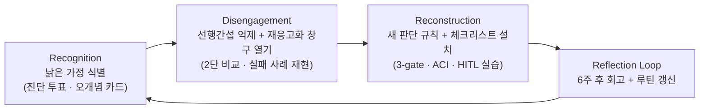

# Learning ↔ Un-Learning ↔ Re-Learning 보고서

## Executive Summary

AI Agent와 Harness 같은 에이전틱 개발 플랫폼이 실무에 들어오면서, “새 도구를 어떻게 배울 것인가”보다 “기존 판단 습관을 어떻게 갱신할 것인가”가 더 큰 병목이 되었다. 본 보고서는 이 병목을 **learning ↔ un-learning ↔ re-learning의 닫힌 루프**로 정의하고, 조직학습·인지과학·에이전트 실무·국내 규제를 하나의 교육 설계 체계로 통합한다.

본 보고서가 주장하는 핵심은 세 가지다. **첫째, 언러닝은 단발 이벤트가 아니라 인식(Recognition) → 해제(Disengagement) → 재구성(Reconstruction) → 반복(Reflection)의 프로세스**다. 이것은 2024년 *Management Review Quarterly* 리뷰와 2025년 *Management Learning* 논문에서 반복 확인된 구조이며, 전략적 망각이 없으면 조직 병리가 반복된다는 임상·경영 연구가 이를 뒷받침한다. **둘째, 언러닝을 실제로 가능하게 하는 것은 “의지”가 아니라 실행기능**이다. 2025년 *Psychology and Aging*과 *Scientific Reports*의 실험은 높은 선행간섭 조건에서 전문가의 작업기억 이점이 붕괴하며, 이를 이기는 메커니즘이 억제(inhibition)와 예측표상 갱신(updating)이라는 인지 시스템의 직접 개입임을 보였다. 따라서 교육 개입은 “선언”이 아니라 **실행기능 훈련 + 기억 재응고화 시점 설계 + 메타인지 넛지**라는 세 축으로 구체화돼야 한다. **셋째, 자동화 편향은 설명가능성(XAI)만으로 막히지 않는다.** 2025년 *AI & Society* 체계적 리뷰와 *Procedia CS* 실험은 XAI 단독 효과가 제한적이며, UI 단의 경고 넛지만으로도 결함 있는 AI 조건에서 성능이 거의 2배 개선됨을 보였다.

실무 지형도 달라졌다. 에이전트에 대해 “답변기의 확장”, “프롬프트만 잘 쓰면 통제”, “모델이 최신 상태를 안다” 같은 근본 오개념에 더해, 2025년 이후 **MCP만능주의, 자기교정 신화, “실행되면 맞다” 착각, 긴 컨텍스트 숭배, 벤치마크·실무 등치, 책임 외주화, 단계 수 = 정확도 오해, 프레임워크 쇼핑, 도구 설명서 과신, 자율성 숭배**라는 2차 오개념군이 급속히 확산했다. ICLR 2024의 자기교정 실패 실증, METR의 장기 과업 성공률 <10% 보고, *arXiv:2604.12311*의 **45% 조용한 실패율(silent failure rate)**, Invariant Labs의 MCP 도구 오염 공격이 이 오개념들의 위험을 구체화한다. 본 보고서는 이 오개념들을 2계층(A-세트 8종 + B-세트 10종 = 총 18종)으로 체계화해 교육 설계에 배치한다.

한국 맥락은 이 루프를 규제 요건 수준으로 끌어올렸다. **2026년 1월 22일 시행된 인공지능 기본법**(법률 제20344호)은 고영향 AI 영향평가, 투명성 표시, 안전 의무를 의무화했고, 금융위원회의 금융 AI 7대 원칙, 개인정보보호위원회의 생성형 AI 개인정보 처리 안내서, 식품의약품안전처의 의료기기 AI 가이드라인이 부문별 규제 밀도를 만들어 낸다. 우아한형제들(배달의민족)의 MCP stdio 중앙관리, 토스의 Software 3.0 하네스 엔지니어링 같은 국내 사례는 “되돌리기 어려운 작업 · 다수 유효 옵션 · 고위험 결정”에서 Human-in-the-Loop(HITL)을 명문화한 실무 전환을 이미 보여 주고 있다. 따라서 본 보고서는 이론적 프레임에 머물지 않고, 한국 실무·규제 환경에 바로 이식 가능한 **강사용·학습자용 이중 체크리스트와 6주 회고 루프**까지 제공한다.

결론적으로, 언러닝은 더 이상 “도입부 이벤트”가 아니라 **커리큘럼 전체를 지탱하는 운영 리듬(operating rhythm)**이다. 본 보고서는 그 리듬의 정의·근거·설계·평가를 한 문서 안에서 완결 지으며, 교육 운영자와 학습자 모두에게 즉시 사용 가능한 참조점을 제공하는 것을 목적으로 한다.

## 1. 개념 정의와 프레임

### 1.1 세 개념의 구분

언러닝(un-learning)은 **삭제가 아니라 우선순위 조정**이다. 즉 기존 지식을 없애는 연산이 아니라, 지금 맥락에서 새 판단을 방해하는 가정의 지배력을 낮추는 과정이다. 이 정의는 조직학습 연구에서 Hedberg의 초기 정의 이후 일관되게 유지돼 왔으며, 인지과학에서도 “망각(forgetting)”과 구분되는 선택적 억제·갱신 과정으로 모형화된다. 한편 러닝(learning)은 기존 이해 틀로 새 정보를 통합하거나(동화, assimilation) 틀 자체를 재조직하는(조절, accommodation) 과정이고, 리러닝(re-learning)은 언러닝으로 비워진 자리에 **새 판단 규칙을 설치하고 숙련화**하는 과정이다. 세 개념은 독립적으로 작동하지 않고 서로를 조건짓는다.

| 구분 | 정의 | 주요 메커니즘 | 교육 설계 함의 |
|---|---|---|---|
| Learning | 새 정보를 기존 틀에 통합하거나 틀 자체를 재조직하는 과정 | 동화·조절, 이해가능성·개연성·생산성 | “기능 학습”은 learning의 일부일 뿐. 판단 규칙 재조직이 동반돼야 진짜 학습이 일어난다 |
| Un-Learning | 방해가 되는 가정의 우선권을 낮추는 과정 | 선행간섭 억제, 재응고화 창구, 인지갈등 | 단발 이벤트 아님. recognition·disengagement의 2단계 설계 필요 |
| Re-Learning | 비워진 자리에 새 판단 규칙을 설치·숙련화하는 과정 | 예측표상 갱신, 숙의적 연습, 피드백 루프 | 구체적 체크리스트·의사결정 룰이 필요. “원칙”만으로는 전이 안 됨 |
| Responsible Forgetting | 전략적·의도적 정보 우선순위 조정으로 기억 활성화 강도를 하향시키는 과정 | 메타인지적 주의 배분, 인출 제한 | 개인 수준에서 “무엇을 덜 중요하게 다룰 것인가”를 명시적으로 훈련 |
| Strategic Forgetting | 조직 차원에서 병리 패턴을 반복시키지 않도록 의도적으로 지식을 폐기·비활성화하는 운영 | 회고·감사·아카이빙 정책 | 포스트모템 루틴, 규칙 카드 철회 절차와 함께 설계해야 함 |
| Flexpertise | 영역·맥락을 넘나들며 전문성의 가치를 지속 가능하게 유지하는 능력 | domain/boundary/context 등 6가지 적응 범주 | “전문성 상실”이 아니라 “전문성 전이·적응”이라는 긍정 프레임 제공 |
| Paradox Cognition | 모순된 요구를 동시에 인지·수용하는 사고 양식 | 양극 긴장의 유지·조율 | “자율성 vs 통제”, “속도 vs 안전” 같은 에이전트 설계 긴장을 정면으로 다룸 |

언러닝은 이제 단일 개념이 아니라 위와 같이 최소 7개의 파생 개념으로 분화돼 있다. 교육 설계 시 어떤 개념을 전면에 두느냐가 개입 전략을 결정한다. 개인 학습자에게는 responsible forgetting과 flexpertise를, 조직 단위에는 strategic forgetting과 paradox cognition을 무게중심으로 두는 것이 실증 연구와 부합한다.

### 1.2 왜 언러닝 단독이 아니라 루프인가

언러닝만을 강조하는 프레임은 세 가지 이유로 절반짜리 설계가 된다.

**첫째, 언러닝은 “무엇을 내려놓을 것인가”만 정의한다.** 낡은 가정을 비운 자리에 어떤 새 판단규칙을 넣을지는 언러닝 개념 안에서 도출되지 않는다. 따라서 “에이전트는 챗봇이 아니다”라고 해제했다면, 곧바로 “그렇다면 에이전트는 구체적으로 어떤 instructions / tools / guardrails / evals 층 구조로 재정의되는가?”라는 재구성 질문이 이어져야 한다. 이것이 re-learning의 역할이다.

**둘째, 언러닝은 단발적 깨달음이 아니라 반복적 갱신이다.** “학습이 일어나면 망각은 자동으로 따라온다”는 전통적 가정은 2025년 관리학습 연구에서 명시적으로 반박되었다. 전략적 망각은 별도의 의도·설계·성찰 루틴을 요구한다. 실무에서 이는 “한 번 언러닝했다”가 아니라 “어떤 주기로, 어떤 트리거(규제 개정, 모델 교체, 사고 회고)에 맞춰 언러닝 루틴을 재기동할 것인가”라는 운영 리듬 설계로 이어진다.

**셋째, 언러닝은 정체성 방어 반응을 필연적으로 동반한다.** deep unlearning은 단순 습관이 아니라 세계관·가치 전제(worldviews, value premises)를 흔들며, 이 과정은 정서적 저항과 위기 경험을 동반한다. 이를 완충하려면 “버리는 것”만 보여 줘서는 안 되고, **그 자리에 무엇이 들어오는지**를 같은 화면 안에서 제시해야 한다. re-learning 약속이 함께 있어야 학습자의 방어가 낮아진다.

결국 언러닝은 단방향 삭제 연산이 아니라 **learning ↔ unlearning ↔ relearning이 서로 조건이 되는 순환**이다. 본 보고서가 프레임 자체를 루프로 설정하는 이유다.

## 2. 인지과학·조직학습 근거 (2024–2026)

### 2.1 선행간섭 — “전문가일수록 더 위험하다”

2025년 *Psychology and Aging*에 실린 실험 연구는 **높은 선행간섭 조건에서 전문가의 작업기억 이점이 붕괴**함을 보고했다. 즉 deterministic system에 능숙한 시니어 개발자일수록, 에이전틱 시스템이라는 새 맥락에서 과거 성공 패턴이 작업기억을 점유해 오판을 유도한다. 같은 해 *Scientific Reports*의 후속 연구는 이 간섭을 이기는 메커니즘이 단순 노출이 아니라 **억제(inhibition)와 예측표상 갱신(updating)이라는 실행기능의 직접 개입**임을 실험으로 확인했다.

**설계 함의.** “새 개념 소개 → 반복 학습”만으로는 간섭이 해소되지 않는다. 학습자가 낡은 가정을 명시적으로 억제하고 예측표상을 갱신하는 메타인지 훈련이 병행돼야 한다. 예: “이 상황에서 나는 몇 년 전이라면 어떻게 판단했는가? 그 판단이 왜 지금은 실패하는가?”라는 **2단 비교 프롬프트**를 본교육 전반에 삽입한다.

### 2.2 기억 재응고화 — 임상까지 도달한 “갱신 창구”

기억은 한 번 응고되면 고정되는 것이 아니라, **회상된 기억은 재응고화 창구에서 수정 가능한 상태로 다시 열린다**. 2024년 *Translational Psychiatry*는 MEK 억제제와 예측오류를 결합한 프로토콜이 PTSD 공포 기억의 재응고화를 임상적으로 교란시킬 수 있음을 보였고, 2024년 *Oxford Handbook of Human Memory*의 종합 리뷰는 재응고화가 공포 기억뿐 아니라 운동기억·일화기억으로 일반화됨을 정리했다. 이는 교육 상황에서도 **학습자가 낡은 가정을 먼저 회상·활성화한 뒤 새 규칙을 덮어쓰는 순서**가 유효함을 뒷받침한다.

**설계 함의.** 언러닝 수업은 “새로운 옳은 답”만 보여주는 것이 아니라, 학습자가 낡은 가정을 먼저 회상해서 활성화(reactivation)시킨 뒤 그 위에 새 규칙을 덮어쓰도록 순서를 맞춰야 한다. 예: 사례 분석에서 “과거의 방식”을 먼저 2분간 이야기하게 한 뒤, 새 판단 규칙을 그 위에 올리는 구성이다.

### 2.3 자동화 편향 — XAI 신화와 UI 넛지의 의외성

2025년 *AI & Society*의 체계적 리뷰는 설명가능성(XAI) 기능이 **자동화 편향을 자동으로 줄여 주지 않음**을 보고했다. 편향 저감은 사용자의 능동적 검증 행동 훈련이 있을 때만 발생한다. 반면 2025년 *Procedia Computer Science*에 실린 실험은 **UI 안에 경고 넛지를 넣는 것만으로도 결함 있는 AI 조건에서 성능이 거의 2배로 개선**됨을 보였고, 넛지가 없으면 오히려 대조군보다 성능이 낮았다. 같은 해 *Acta Psychologica*는 **인지피로가 AI 의존성을 매개**하며 **AI 리터러시가 보호 변수**임을 확인했다.

**설계 함의.** “자동화 편향을 조심하세요”라는 구두 경고는 효과가 제한적이다. 효과적인 것은 (a) 능동적 검증 루틴을 절차화하고, (b) 그 루틴을 IDE/플랫폼 UI에 기본 넛지로 내장하며, (c) 피로 관리·휴식 리듬을 함께 설계하는 것이다.

### 2.4 조직 언러닝의 프로세스화와 역설 인지

2024년 *Management Review Quarterly*의 통합 리뷰는 조직 언러닝을 단발 사건이 아니라 recognition → disengagement → reconstruction의 **프로세스**로 재정의했고, 2024년 *The Learning Organization*의 분류 체계는 언러닝을 깊이·범위에 따라 유형화했다. 특히 2024년 *IEEE Transactions on Engineering Management*의 실증은 중요하다: **최고경영팀(TMT)의 인지갈등이 조직 언러닝을 거쳐 디지털 전환 역량으로 전이**되며, CEO의 agile leadership과 전략적 합의가 이 경로를 조절한다. 같은 해 *Operations Management Research*는 역설 인지(paradox cognition)와 언러닝이 공급망 회복탄력성에 공동으로 작용함을 보였다. 2025년 *Global Journal of Flexible Systems Management*는 이 경로가 신흥국 혁신 성과에서도 재현됨을 확인했다.

**설계 함의.** “개인의 깨달음”에만 의존하지 않고, 리더십 차원의 인지갈등을 의도적으로 유발하고 조직 루틴으로 전환해야 한다. 본 보고서가 Reflection Loop 단계에 팀 단위 회고 템플릿과 리더용 별도 체크리스트를 배치하는 이유다.

## 3. 2026 오개념 지도: A-세트 8종 + B-세트 10종 = 총 18종

에이전트와 하네스 플랫폼 도입에서 언러닝 대상이 되는 오개념은 두 계층으로 나뉜다. **A-세트(8종)**는 “에이전트 개념 자체”에 관한 근본 오개념이고, **B-세트(10종)**는 2025년 이후 MCP·자기교정 에이전트·바이브 코딩 확산과 함께 새롭게 관찰된 “운영·확장 방식”에 관한 오개념이다. 18종을 한 번에 쏟으면 피상화 리스크가 크므로, 교육 타임라인상 A-세트는 입문 1–2주차, B-세트는 3–6주차에 배치하는 것이 자연스럽다.

### 3.1 A-세트 — 에이전트 개념의 근본 오개념

| # | 낡은 가정 | 왜 위험한가 | 새 규칙 |
|---|---|---|---|
| A1 | 에이전트 = 챗봇 확장판 | 에이전트는 답변기가 아니라 도구를 사용해 워크플로를 실행·조정하는 시스템. 평가·권한·종료조건 설계를 생략하게 됨 | 에이전트 = instructions/tools/guardrails/evals를 갖춘 실행 시스템 |
| A2 | 멀티에이전트가 더 고급·더 낫다 | 복잡성이 성능을 보장하지 않음. 공식 가이드는 단일 에이전트·단순 패턴에서 시작하라고 권고 | 단일 에이전트 + 검증 먼저, 복잡성은 증거 있을 때만 증가 |
| A3 | 프롬프트만 잘 쓰면 통제된다 | 간접 prompt injection, 시스템 프롬프트 유출, 도구 오남용이 프롬프트 단 통제로 막히지 않음 | 통제는 프롬프트 바깥에서 — 권한·정책·승인·검증 계층 |
| A4 | 모델은 최신 정책·운영 상태를 대체로 안다 | 만료된 정책, 폐기된 runbook, 구식 feature flag 규칙을 그대로 따르게 됨 | 최신성은 기억이 아니라 조회에서 — data tools, 실제 플랫폼 상태 참조 |
| A5 | 데모 되면 운영도 된다 | 운영 신뢰성은 평가 기준, 사전 테스트, 적응형 red teaming, 실패 임계값에서 나옴 | baseline eval → pre-deploy test → 운영 중 모니터링 |
| A6 | 정확도만 높으면 공정하다 | demographic group별 성능 차이와 harmful bias는 정확도와 별도 축 | 정확도와 별개로 demographic fairness를 별도 측정 |
| A7 | 완전자율 = 효율 | 고위험·비가역 행동은 인간 승인·최소권한이 필요. 2026년 AI 기본법 고영향 AI 영향평가 의무와도 직결 | 고위험·비가역 = 승인 경계, least privilege, HITL |
| A8 | 자연어로 말하면 스키마도 맞다 | 필드 추정, 없는 connector 참조, 잘못된 namespace, 누락 secret로 파이프라인 실패 | scope → dependency → schema → permission 확인이 선행 |

### 3.2 B-세트 — 2025년 이후 새로 등장한 오개념

| # | 낡은 가정 | 왜 위험한가 (핵심 근거) | 새 규칙 |
|---|---|---|---|
| B1 | MCP만 연결하면 에이전트가 만능이 된다 | Invariant Labs의 tool poisoning·rug pull 공격 실증, MCP 창시자가 “설명 중첩 시 도구 선택 실패” 인정, arXiv:2504.03767 MCPSafetyScanner | MCP는 배관일 뿐 지능이 아니다. 도구는 적게·명확히·검증된 것만, 모든 서버는 공격면으로 간주 |
| B2 | 에이전트는 실수해도 스스로 교정한다 | Huang & Zhou(ICLR 2024): 자기교정 후 성능이 오히려 저하, arXiv:2310.12397: 개선의 대부분은 top-k 샘플링 아티팩트, SCoRe(arXiv:2409.12917)의 distribution mismatch | 교정은 외부 신호로 — tests, types, linters, 사람, 구조적으로 다른 검증 모델 |
| B3 | 실행되면 맞는 코드다 | arXiv:2604.12311: ~45% silent failure rate (GPT-4o-Mini ~56%). 실행 성공이 논리 결함을 은폐 | 3-gate 검증: syntax → semantic(알려진 입력·출력) → robustness(엣지·적대·도메인 제약) |
| B4 | 바이브 코딩이면 프로덕션도 가능 | silent failures + 비기능 요건(동시성·오류처리·보안 경계) 누락 | 바이브 코딩 = 프로토타이핑 기법. 프로덕션 코드는 사람이 읽고 이해·방어할 수 있을 때만 커밋 |
| B5 | 컨텍스트 윈도우가 길수록 좋다 | Liu et al.(2023) *Lost in the Middle*: 중간 위치 정보가 사실상 무시됨, 긴 컨텍스트 설계 모델도 동일 | 컨텍스트는 엔지니어링 문제 — RAG, 전략적 배치, 계층적 요약 |
| B6 | 벤치마크 점수가 높으면 실무도 잘한다 | METR(2025): frontier 모델도 4시간+ 과제 성공률 <10%, SWE-Lancer에서 과반수 미해결 | 벤치마크는 잠재력일 뿐. 자기 조직의 대표 태스크로 내부 평가셋 구축 |
| B7 | AI가 쓴 코드는 내 책임이 아니다 | Copilot 집단소송, 라이선스 출처 추적 불가, 커미터가 법적·운영적 책임자 | sign-off rule — 설명할 수 없는 코드는 커밋하지 않는다 |
| B8 | 단계가 많은 에이전트일수록 정확하다 | 복합 확률(0.9¹⁰ ≈ 0.35), METR: 장기 과업에서 성공률 붕괴, smolagents의 premature `final_answer()` 사례 | checkpoint-and-verify. 각 단계에 독립 검증 게이트, 체인은 짧게 |
| B9 | 프레임워크를 쓰면 개발이 쉬워진다 | Anthropic 공식 가이드: 프레임워크가 디버깅을 가리고 불필요한 복잡성을 조장, 직접 API 호출이 더 투명 | 먼저 직접 호출로 시작. 프레임워크는 “어떤 기능이 왜 필요한지” 말할 수 있을 때만 도입 |
| B10 | 도구 설명서만 잘 쓰면 에이전트가 도구를 올바르게 쓴다 | Anthropic SWE-bench 팀: 도구 최적화 > 프롬프트 최적화. 설명이 유사하면 선택 실패 | ACI(Agent-Computer Interface) 설계 — poka-yoke 스키마, 사용 예시, 경험적 도구선택 테스트 |

★ Insight — A-세트는 “에이전트가 무엇인가”에 대한 **정체성 오해**이고, B-세트는 “에이전트를 어떻게 키우고 돌릴 것인가”에 대한 **운영 오해**다. 전자는 첫 주차의 개념 재정의로, 후자는 중반 이후 실습·평가·거버넌스 설계로 다뤄야 학습자의 인지 부하가 분산된다.

## 4. Learning ↔ Un-Learning ↔ Re-Learning 루프 설계

### 4.1 4단 프로세스 모델

### 4.2 단계별 설계 원칙

| 단계 | 핵심 목표 | 교수법 | 위험 신호 |
|---|---|---|---|
| Recognition | 낡은 가정을 **학습자 스스로** 언어화 | 진단 투표, 짝 고백, 오개념 카드 분류 | 학습자가 방어적·냉소적으로 반응 |
| Disengagement | 가정의 우선권 낮추기 (inhibition + updating) | 2단 비교 프롬프트, 실패 사례 재현, “과거의 나 vs 지금의 나” 역할극 | 새 규칙을 **이해는 하는데 적용을 못 하는** 상태 |
| Reconstruction | 새 판단 규칙의 **실행 수준 내재화** | 체크리스트화, 페어 코딩, ACI 실습, HITL 시뮬레이션 | 체크리스트가 **의식적 노력 없이도 튀어나오는지** 확인 전까지 미완 |
| Reflection Loop | 6주 주기로 가정 갱신 | 팀 회고 템플릿, 실수 카드 교체 의식, 외부 사건 트리거 검토 | 6주 후 여전히 동일 오판 |

### 4.3 도입 클립(6분 10초)과 본교육 배치

루프의 첫 단계(Recognition)는 **6분 10초 도입 클립**으로 집약한다. 이 클립은 “강의 전에 심는 인지 프레임 설치 장치”이며, 다음 9단 시퀀스로 구성한다.

| 시간 | 장면 | 핵심 메시지 |
|---|---|---|
| 0:00–0:35 | 실패 훅 | “문제는 AI가 틀린 게 아니라, 우리가 낡은 가정으로 AI를 해석한 것이다.” |
| 0:35–1:15 | 낡은 가정 질문 | “당신이 지금 버려야 할 확신은 무엇인가?” (3개 투표) |
| 1:15–2:00 | 언러닝 정의 | “언러닝은 삭제가 아니라 우선순위 조정이다.” |
| 2:00–2:45 | 왜 어려운가 | “오래된 규칙은 새 규칙보다 먼저 튀어나온다.” (선행간섭·재응고화·인지유연성) |
| 2:45–3:40 | Agent 재프레이밍 | “Agent는 답변기가 아니라 도구를 가진 실행 시스템이다.” |
| 3:40–4:40 | Harness 재프레이밍 | “자연어는 마법 명령이 아니라 문맥·스키마·권한이 연결된 요청이다.” |
| 4:40–5:35 | 행동 원칙 | “최신 상태 조회 → 권한 최소화 → 평가 선행 → 고위험 승인.” |
| 5:35–6:10 | 전환 멘트 | “이제부터는 더 많이 맡기는 법이 아니라, 더 안전하게 맡기는 법이다.” |

클립 뒤에는 Disengagement와 Reconstruction이 이어진다. 본교육 전체 배치는 다음과 같다.

| 구간 | 길이 | 역할 |
|---|---|---|
| T+0 — 도입 클립 | 6분 10초 | Recognition — 낡은 가정 4종 식별 |
| T+1 — Disengagement 워크숍 | 45분 | 실패 사례 2건(Agent 1 + Harness 1) 재현 + 2단 비교 프롬프트 |
| T+2 — Reconstruction 실습 | 60–90분 | 3-gate 검증, ACI 설계, HITL 승인 경계 시뮬레이션 |
| T+3 — 본교육 배치 | 주차 전반 | A-세트(1–2주차), B-세트(3–6주차) 오개념을 학습 주제와 짝지어 배치 |
| T+4 — 6주 회고 | 90분 | 팀 회고 템플릿으로 실제 현업 적용 사례·실패 공유, 규칙 카드 갱신 |

## 5. 한국 규제 맥락에서의 루프 적용

### 5.1 AI 기본법의 규범 효과

2026년 1월 22일 시행된 **인공지능 기본법(법률 제20344호)**은 고영향 AI 사업자에게 사전 영향평가 의무, 투명성 표시 의무, 안전 의무를 부과한다. 이 법은 교육 설계에 세 가지 규범 효과를 만든다.

**첫째, HITL이 권고에서 규제 요건으로 격상되었다.** A7(“완전자율 = 효율”)의 해제는 이제 “해도 좋다”가 아니라 “안 하면 위반 가능”이라는 언어로 설명돼야 한다.

**둘째, 투명성 의무는 “AI 생성 표시”를 기본값으로 바꾼다.** 커밋 메시지 규약, PR 템플릿, 감사 추적(audit trail)이 설계 단계부터 포함돼야 한다. 이는 “기록은 나중에 붙여도 된다”는 가정을 언러닝 대상에 추가한다.

**셋째, 영향평가가 “설계 후 문서화”가 아닌 “설계와 병행”으로 이동한다.** 에이전트의 의사결정 로직, 학습 데이터, 편향 가능성, 오류 영향 범위를 사전에 평가할 수 있는 산출물 체계가 필요하다.

### 5.2 부문별 규제 밀도와 직군별 맞춤 루프

| 직군 | 규제 기둥 | 추가 unlearning 대상 | 추가 relearning 규칙 |
|---|---|---|---|
| 금융 AI 엔지니어 | 금융위 7대 원칙(거버넌스·합법성·보조수단성·신뢰성·금융안정성·신의성실·보안성) | “보조수단성·신뢰성은 디자인 단계가 아니라 사후 검증으로 충분” | 설계 초기부터 보조수단성·신뢰성·보안성 **증거 산출물** 함께 설계 |
| 의료 AI 엔지니어 | 식약처 의료기기 AI/SaMD 가이드라인 | “성능 검증은 배포 전 1회로 충분” | 지속 모니터링 + 변경관리 기반 재승인 루프 |
| 공공·행정 AI 담당 | 공공부문 AI 활용 가이드·SW 개발보안 | “내부용이라 공개 설명은 불필요” | 설명가능성·영향평가 문서화가 운영 기본값 |
| 개인정보 담당·컴플라이언스 | PIPC 생성형 AI 개인정보 처리 안내서 | “학습 데이터 수집은 동의만 받으면 충분” | 수집→처리→서비스→이용자 권리 전주기 설계 |
| 교육 현장 AI 활용 교사 | 경기도교육청 생성형 AI 활용교육 가이드 | “학생 과의존은 지도로 충분히 막힌다” | AI 리터러시 + 비판적 사고 + 사전 안전교육이 선행 조건 |

### 5.3 국내 실무 전환 사례

한국 실무 현장에서는 이미 루프가 자생적으로 돌기 시작했다. 우아한형제들(배달의민족)은 2026년 공개한 기술 블로그에서 **MCP stdio 중앙관리**로 흩어진 AI 자산을 통합해 B1(MCP 만능주의)을 해제하고 “도구 집합을 관리 가능한 최소 단위로 모으는 것”을 새 규칙으로 정착시켰다. 같은 해 5년 동안 해결되지 못한 다국어 과제를 LLM + 조직의 빠른 실행 문화로 1개월 만에 끝낸 사례는 re-learning 속도의 조직 효과를 보여 준다.

토스는 Software 3.0 하네스 엔지니어링에서 **기존 아키텍처 패턴을 에이전트 설계에 매핑**(Slash commands = Controller, Sub-agents = Service, Skills = Domain, MCP = Adapter)함으로써 B9(프레임워크 쇼핑)에 대응한 relearning 사례를 공개했고, HITL 원칙을 “되돌리기 어려운 작업 · 다수 유효 옵션 · 고위험 결정”의 세 조건으로 명문화했다. 금융 규제가 엄격한 환경에서 A7의 실무 해법을 제시한 사례로 인용할 가치가 크다.

## 6. 측정과 평가 프레임워크

### 6.1 평가 설계 원칙

본 보고서의 평가는 “지식 확인”이 아니라 **가정 수정과 행동 전이**를 측정한다. 세 차원을 동시에 본다: (a) 태도 전환(역문항 점수의 변화), (b) 행동 의도(5점 척도 자가보고), (c) 실제 전이(6주 후 follow-up에서 수집한 적용 사례).

### 6.2 12문항 진단 (사전·사후 동일 적용)

| 차원 | 문항 예시 | 측정 대상 |
|---|---|---|
| 오개념 해제 (A-세트) | “에이전트는 챗봇의 확장 UI일 뿐이다”, “프롬프트를 잘 쓰면 외부 가드레일 없이도 충분히 안전하다”, “최신 정책·운영 상태는 모델 기본 지식이 대체할 수 있다”, “멀티에이전트는 단일 에이전트보다 대체로 낫다”, “AI가 만든 YAML은 schema 확인 없이도 바로 적용 가능하다” (5문항) | 근본 오개념 태도 전환 |
| 오개념 해제 (B-세트) | “실행만 되면 올바른 코드다”, “MCP만 붙이면 기능이 완성된다”, “에이전트는 스스로 교정한다” (3문항) | 운영 오개념 태도 전환 |
| 행동 의도 | “나는 AI 산출물 수락 전 3-gate 검증을 수행하겠다”, “고위험 작업에 HITL을 넣겠다” (2문항) | Reconstruction 확신도 |
| 실행기능 기술 | 짧은 케이스에서 “과거라면 어떻게 판단했고 지금은 무엇을 바꿨는가”를 30초 안에 기술 (1문항) | inhibition + updating |
| 조직 지표 | 6주 후 “팀 회고에서 제거한 낡은 규칙 수 / 추가한 새 규칙 수” (1문항) | strategic forgetting |

### 6.3 성공 기준

| 기준 | 역치 |
|---|---|
| A/B-세트 역문항 점수 | 평균 20% 이상 하락 |
| 행동 의도 | 평균 4점 이상 (5점 척도) |
| 실행기능 기술문 | 평가자 2인 평균 “가정 식별 + 대체 규칙 + 적용 조건”의 3요소 모두 충족 비율 60% 이상 |
| 조직 지표(6주 후) | 팀당 제거 규칙 1개 이상 **그리고** 추가 규칙 1개 이상 |
| 자동화 편향 검증 행동 | 1주 후 follow-up에서 3-gate를 실제 적용한 사례 1건 이상 제출 |

## 7. 리스크 관리

루프 도입에는 고유한 리스크가 있다. 설계자는 다음 7가지를 선제적으로 완화해야 한다.

| 리스크 | 왜 심화되는가 | 완화 전략 |
|---|---|---|
| 인지 과부하 | 오개념 18종을 한꺼번에 다루면 피상화 | A/B-세트 시간 분리(1–2주차 vs 3–6주차), 한 회차에 3종 이상 동시 언급 금지 |
| 언어 미확립 | 한국어 학술·실무에서 “언러닝”이 독자 용어로 정착되지 않아 machine unlearning과 혼동되기 쉬움 | 첫 15초에 “언러닝 ≠ machine unlearning ≠ 단순 망각”을 도식 1장으로 명시 |
| 정체성 위협 | deep unlearning은 세계관·가치 전제를 흔들어 정서 비용이 큼 | “버릴 것 vs 남길 것” 이중 프레임, flexpertise 언어로 “전문성 전이” 메시지 강조 |
| 과도한 규제 프레이밍 | 위험 메시지가 많으면 adoption paralysis 유발 | 위험 1개당 행동 규칙 1개 대응, 정부 지원 R&D·혁신금융서비스 샌드박스 등 기회 측면도 병렬 배치 |
| 자동화 편향 완화 실패 | XAI 단독으로는 편향이 줄지 않음 | UI 단 경고 넛지 + 능동 검증 루틴 절차화를 **동시에** 설계 |
| 도구 중심 교육으로 회귀 | 바이브 코딩·Claude Code·Cursor 열풍이 “도구 사용법” 수업으로 흐를 위험 | 모든 도구 회차 끝에 **“이 도구가 해제해야 할 낡은 가정은 무엇인가?”** 성찰 프롬프트 고정 삽입 |
| 규제 시행령 변동성 | AI 기본법 시행령이 2026년 Q2 기준 단계적 제정 중 | 교재에 시점 명시 + 6개월 주기 리비전 플랜 동봉 |

## 8. 실행 체크리스트 (즉시 사용 가능)

### 8.1 강사용 체크리스트

- [ ] 도입 클립 전에 “언러닝 ≠ machine unlearning ≠ 단순 망각” 15초 분리 슬라이드를 삽입했는가
- [ ] A-세트(8종)를 1–2주차, B-세트(10종)를 3–6주차에 분배했는가
- [ ] 각 오개념마다 한국 사례(우아한형제들·토스·네이버 등) 1건이 연결돼 있는가
- [ ] Disengagement 단계에서 “과거의 나 vs 지금의 나” 2단 비교 프롬프트를 포함했는가
- [ ] Reconstruction 단계에 3-gate 검증, ACI 설계, HITL 승인 경계 실습이 있는가
- [ ] 자동화 편향 대응에 구두 경고 + UI 넛지 + 피로 관리가 함께 있는가
- [ ] 평가에 실행기능 기술문 문항과 조직 지표(팀 회고 결과)가 포함됐는가
- [ ] 6주 후 follow-up 세션이 일정에 잡혀 있는가
- [ ] AI 기본법·PIPC·금융위·식약처 중 학습자 직군에 맞는 규제 기둥이 사례와 함께 연결돼 있는가

### 8.2 학습자용 6단계 루프

1. **Recognize** — 지금 내가 가장 자주 의존하는 낡은 가정 1개를 적는다
2. **Reactivate** — 그 가정이 성공했던 과거 사례 1개를 30초간 떠올린다
3. **Compare** — 같은 가정이 지금 맥락에서 실패한/실패할 시나리오 1개를 적는다
4. **Replace** — 대체 규칙 1문장을 체크리스트에 추가한다 (3-gate, HITL, ACI 중 해당)
5. **Practice** — 다음 48시간 안에 그 규칙을 실제 작업에 1회 적용한다
6. **Reflect** — 6주 후 팀 회고에 “제거한 규칙 / 추가한 규칙”을 제출한다

## 9. 한 문장 요약

언러닝은 “도입부 이벤트”가 아니라 **커리큘럼 전체를 지탱하는 운영 리듬**이며, learning ↔ un-learning ↔ re-learning의 닫힌 루프와 실행기능 훈련, 한국 AI 기본법 맥락의 거버넌스 규칙이 함께 설계될 때에만 진짜 언러닝으로 기능한다.

---

## 참고 문헌

### 조직학습·인지과학 (2024–2026)

- Klammer, A., Grisold, T., Nguyen, N., & Hsu, S.-W. (2024). *Management Review Quarterly*, 75(3), 2147-2171. DOI: 10.1007/s11301-024-00430-3
- Kociatkiewicz, J. & Kostera, M. (2025). *Management Learning*. DOI: 10.1177/13505076241289120
- Maccioni, S. et al. (2024). *The Learning Organization*. DOI: 10.1108/tlo-02-2023-0025
- Zhang, F., Zhu, L., Wang, J., & Gao, R. (2024). *IEEE Transactions on Engineering Management*, 71, 14214-14227. DOI: 10.1109/tem.2024.3446529
- Zhang, Q., Zhang, Y., & Feng, T. (2024). *Operations Management Research*. DOI: 10.1007/s12063-024-00494-0
- Ranjan, P. & Narwal, P. (2025). *Global Journal of Flexible Systems Management*, 26(3), 601-623. DOI: 10.1007/s40171-025-00457-9
- Frie, L. S. et al. (2024). *International Journal of Management Reviews*, 26(3), 458-489. DOI: 10.1111/ijmr.12362
- Murphy, D. H. (2024). *Psychonomic Bulletin & Review*. DOI: 10.3758/s13423-024-02554-9
- van Oers, L. M. (2024). "Unlearning Unsustainability." Utrecht University doctoral dissertation. DOI: 10.33540/2379
- Chen, L. (2024). *The EUrASEANs*, 2(45), 223-234. DOI: 10.35678/2539-5645.2(45).2024.223-234
- Loaiza et al. (2025). *Psychology and Aging*. DOI: 10.1037/pag0000952
- Pedraza et al. (2025). *Scientific Reports*. DOI: 10.1038/s41598-025-14876-2
- Raut et al. (2024). *Translational Psychiatry*. DOI: 10.1038/s41398-024-03190-6
- Nadel & Sederberg (2024). *Oxford Handbook of Human Memory*. DOI: 10.1093/oxfordhb/9780190917982.013.44
- Romeo & Conti (2025). *AI & Society*. DOI: 10.1007/s00146-025-02422-7
- Wingerter et al. (2025). *Procedia Computer Science*. DOI: 10.1016/j.procs.2025.09.331
- Tian & Zhang (2025). *Acta Psychologica*. DOI: 10.1016/j.actpsy.2025.105725
- Yu, M. & Yu, M. H. (2024). *Asia Counseling and Coaching Society*. DOI: 10.47018/accr.2024.6.1.1

### AI 에이전트·안전 근거

- Huang & Zhou (ICLR 2024). "Large Language Models Cannot Self-Correct Reasoning Yet." arXiv:2310.01798
- arXiv:2310.12397 — graph coloring 자기교정 연구
- arXiv:2409.12917 — SCoRe: Training Self-Correction via RL
- arXiv:2604.12311 — AI 생성 코드의 ~45% silent failure rate
- arXiv:2504.03767 — MCPSafetyScanner (ICSE 2025)
- Liu et al. (2023). *Lost in the Middle*. arXiv:2307.03172
- METR (2025). *Measuring AI Ability to Complete Long Tasks*
- Anthropic. *Building Effective Agents* (2024)
- OpenAI. *A Practical Guide to Building Agents* (2024)
- Invariant Labs (2025). *MCP Tool Poisoning Attacks*

### 한국 규제·실무

- 인공지능 발전과 신뢰 기반 조성 등에 관한 기본법 (법률 제20344호, 2026.1.22 시행)
- 금융위원회. 금융분야 AI 가이드라인(7대 원칙), 생성형 AI 혁신금융서비스 절차 간소화 (2026.4)
- 개인정보보호위원회. 생성형 AI 개인정보 처리 안내서
- 식품의약품안전처. 의료기기 AI/SaMD 규제 가이드라인
- 문화체육관광부. 생성형 AI 공정이용 가이드라인 (2026.2)
- 경기도교육청. 생성형 인공지능 활용교육 교사용 가이드라인
- 우아한형제들 기술 블로그(2026.3–4): 하네스 엔지니어링, MCP stdio, AI 교육 프로그램
- 토스 기술 블로그: Software 3.0 하네스 엔지니어링, HITL 설계 원칙, LLM 기반 보안 취약점 분석
