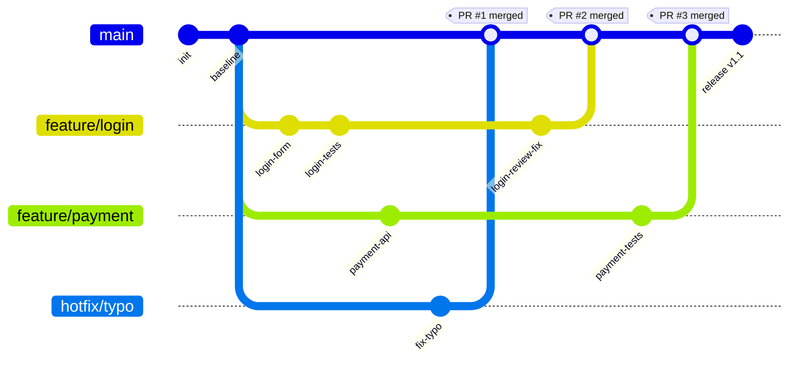
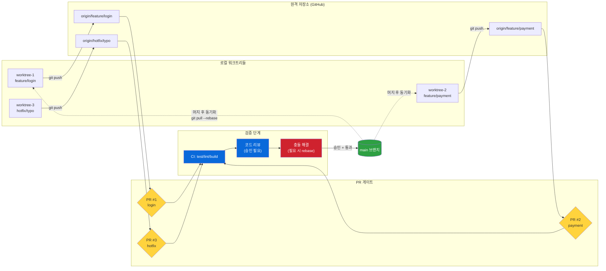
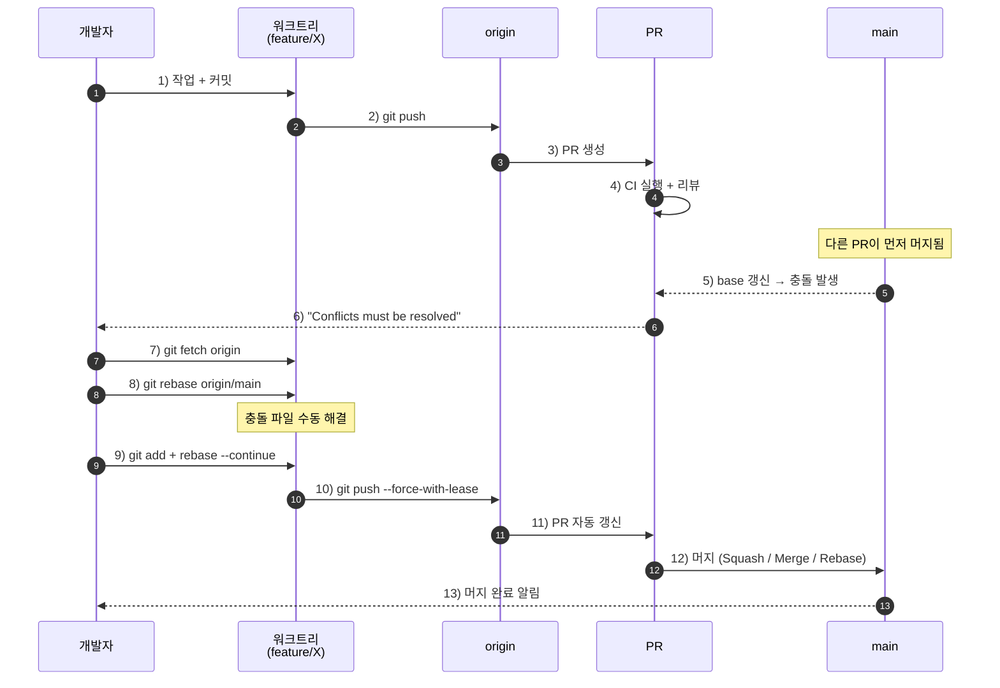

# Session 2-3. PR 생성, 코멘트 반영, 충돌 해결까지 한번에 이어가기

## 목표

AI 작업을 로컬 수정에서 끝내지 않고 
PR 생성, 리뷰 코멘트 반영, 충돌 해결 흐름까지 연결한다.

1. PR을 품질 게이트로 설명한다.
   - PR은 AI 결과물을 팀의 기존 리뷰와 CI 시스템에 올리는 장치다.
   - PR 설명에는 변경 의도, 검증 결과, 위험 요소가 있어야 한다.

2. PR 생성 전 체크리스트를 만든다.
   - 브랜치 이름
   - diff 확인
   - 테스트 결과
   - 관련 이슈
   - 남은 리스크

3. 리뷰 코멘트를 AI에게 전달하는 법을 보여준다.
   - 코멘트를 그대로 던지지 않는다.
   - 의도, 적용 범위, 검증 기준을 함께 전달한다.

4. 충돌 해결을 설명한다.
   - 충돌 해결은 둘 중 하나를 고르는 일이 아니다.
   - 양쪽 변경 의도를 보존하는 것이 핵심이다.

5. 반영 후 **다시 검증**한다.
   - 리뷰 반영 diff 확인
   - 테스트 재실행
   - PR 설명 업데이트

[클로드코드 결과물]

---

## 다이어그램 1. Git 히스토리 관점 (gitGraph)

여러 브랜치가 동시에 진행되다가 PR 단위로 main에 머지되는 모습을 커밋 그래프로 본 모습이다.
머지 커밋에 붙은 태그가 곧 "PR이 닫힌 시점"이다.

**관찰 포인트**
- `hotfix/typo`가 가장 늦게 생겼지만 가장 먼저 머지됨 → PR 머지 순서는 브랜치 생성 순서와 무관하다.
- `feature/login`은 머지 직전 `login-review-fix` 커밋이 하나 더 붙음 → 리뷰 코멘트 반영 결과다.
- 머지 후에도 main은 계속 전진(`release v1.1`) → 머지가 끝이 아니라 다음 작업의 base가 된다.

---

## 다이어그램 2. 프로세스 흐름 관점 (flowchart)

워크트리(로컬 작업 공간) → 원격 브랜치 → PR 게이트 → main으로 이어지는 데이터 흐름이다.
PR 게이트에서 **CI / 코드 리뷰 / 충돌 해결** 세 가지 검증을 통과해야만 main으로 진입한다.

**관찰 포인트**
- 실선(`-->`)은 "변경이 main을 향해 흘러가는 방향", 점선(`-.->`)은 "머지된 main을 다시 로컬로 당겨와 동기화하는 방향"이다.
- 워크트리를 쓰면 `feature/login` 작업을 멈추지 않고도 `hotfix/typo`를 별도 디렉터리에서 즉시 처리해 PR을 띄울 수 있다.
- PR 게이트가 빨강(`충돌 해결`)에서 막히면 개발자가 손으로 풀어야 하는 영역 → 이 강의 세션 4번 항목의 핵심 주제다.

---

## 다이어그램 3. 충돌 발생 시나리오 (sequenceDiagram)

세션 목표 4번("충돌 해결은 양쪽 변경 의도를 보존하는 것")에 직접 대응되는 흐름이다.
다른 PR이 먼저 머지되어 내 PR의 base가 어긋났을 때, rebase로 푸는 과정을 시간순으로 본 모습이다.

**관찰 포인트**
- 5번 단계의 점선 화살표(`-->>`)는 "main이 PR에게 영향을 주는" 비동기적 변화다 → 내가 아무것도 안 했는데 PR 상태가 바뀐다.
- 7~9번이 사람의 판단이 필요한 영역이고, AI에게 위임할 때 가장 사고가 잘 나는 구간이다 → 양쪽 의도를 모두 설명해주지 않으면 한쪽을 통째로 버린다.
- 10번 `--force-with-lease`는 rebase 후 푸시의 사실상 표준 → 일반 `--force`와 달리 다른 사람의 커밋을 덮어쓰는 사고를 막는다.

---

## 세 다이어그램의 역할 구분

| 다이어그램 | 보여주는 것 | 강의에서의 용도 |
|------------|-------------|-----------------|
| 1. gitGraph | 커밋 히스토리의 "결과" | "머지된 후 main이 어떻게 보이는가" 설명 |
| 2. flowchart | 단계와 검증 게이트의 "구조" | PR이 품질 게이트임을 시각화 (목표 1번) |
| 3. sequenceDiagram | 시간 흐름과 행위자의 "상호작용" | 충돌 해결의 실제 손동작 시연 (목표 4번) |
