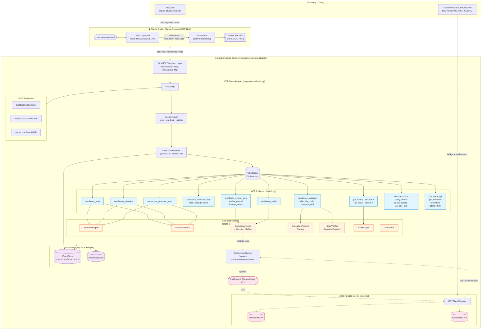

# Session 3-2. Claude Code에서 Codex 호출 등 MCP 도구 직접 만들어서 연결 실습

이 MCP 서버는 이 시스템 전체에서 사용되나요? (범용)
아니면, 프로젝트 에서만 사용이 되나요? (전용)

작업 완료의 정확한 기준(Creteria) 을 제시하기, 기준에 대한 테스트 필요성 강조. 

```prompt 
# 구현하고자 하는 내용

---

https://github.com/Q00/ouroboros

이 프로젝트를 기반으로, MCP 서버를 직접 구축하고 싶습니다. 

이 프로젝트에서 사용한 MCP 서버 구성의 장-단점을 먼저 분석하고 그 뒤에, 내가 구현하고 싶어하는 내용을 MCP 서버로 적절하게 구현할 수 있는지 검토를 요청드립니다. 
```

=====

[Ouroboros 프로젝트 해설: Opus 4.7]
1. Question:
Task:  https://github.com/Q00/ouroboros
이 프로젝트에서 MCP 서버를 어떻게 활용했는지를 꼼꼼하게 코드 기반으로 조사해서 답변해주세요.

MCP 서버의 구성에 대한 아키텍처 도식을 Mermaid Diagram 으로 그려주면서 상세한 설명을 덧붙여주면 좋습니다.

2. Answer: 
프로젝트를 클론한 뒤 구조를 병렬로 살펴보겠습니다.

`.mcp.json` 파일과 핵심 MCP 관련 코드를 병렬로 살펴보겠습니다.

핵심 진입점들과 도구 정의 파일들을 병렬로 읽어보겠습니다.

좋은 진척입니다. 이제 server adapter, tool definitions, registry, bridge 부분을 병렬로 읽어보겠습니다.

마지막으로 client manager, auto_handler 핵심 부분, 그리고 skill 통합 패턴을 확인하겠습니다.

충분한 정보를 얻었습니다. 마지막으로 resource handler들, subagent.py 일부, 그리고 SKILL.md ↔ MCP 매핑 흐름을 확인하겠습니다.

코드를 충분히 확인했으니 이제 결과를 정리해 답변하겠습니다.

---

# Q00/ouroboros 의 MCP 서버 활용 분석

Ouroboros 는 "Spec-First AI Workflow Engine" — Claude/Codex/OpenCode 같은 에이전트 호스트에게 **소크라테스식 인터뷰 → Seed 생성 → 실행 → 평가 → 진화** 루프를 제공하기 위해 **MCP 서버를 1급 시민으로 채택**한 프로젝트입니다. 단순히 MCP 를 "사용"하는 것이 아니라, **Plugin 패키징(`.claude-plugin/`) + 자체 MCP 서버(서빙) + 외부 MCP 서버 브리지(클라이언트) + Skill ↔ MCP 매핑**의 4계층 구조로 활용합니다.

`★ Insight ─────────────────────────────────────`
- Ouroboros 는 **MCP 의 양방향성**(서버이자 클라이언트) 을 적극 활용합니다. Claude 입장에서는 서버이지만, 실행 단계에서 사용자가 별도 설정한 다른 MCP 서버를 *upstream* 으로 흡수하는 `MCPBridge` 가 존재합니다.
- "Skill = 얇은 디스패처, MCP tool = 실제 로직" 이라는 **명확한 책임 분리** 가 있습니다. SKILL.md 의 YAML frontmatter (`mcp_tool:`, `mcp_args:`) 가 일종의 라우팅 테이블 역할을 합니다.
- 하나의 코드베이스에서 stdio / SSE / streamable-http 세 transport 와 7개 런타임 백엔드(claude, codex, opencode, hermes, gemini, kiro, copilot) 를 모두 지원하기 위해 **Composition Root 패턴 + Protocol 기반 추상화** 를 도입했습니다.
`─────────────────────────────────────────────────`

---

## 1. 진입점: 어떻게 MCP 서버로 등록되나

플러그인 매니페스트가 두 군데에 있고, 둘 다 동일한 `uvx` 명령을 가리킵니다.

[.mcp.json](.mcp.json) (저장소 루트):
```json
{
  "mcpServers": {
    "ouroboros": {
      "command": "uvx",
      "args": ["--from", "ouroboros-ai[mcp,claude]", "ouroboros", "mcp", "serve"]
    }
  }
}
```

[.claude-plugin/.mcp.json](.claude-plugin/.mcp.json) — `timeout: 600` 만 추가됩니다.

[.claude-plugin/plugin.json](.claude-plugin/plugin.json):
```json
{ "name": "ouroboros", "skills": "./skills/", "mcpServers": "./.mcp.json" }
```

`★ Insight ─────────────────────────────────────`
- `uvx --from ouroboros-ai[mcp,claude]` 는 PyPI 패키지의 *extras* 를 끌어와 MCP SDK(`mcp` 패키지) + claude-code SDK 만 부분 설치하는 깔끔한 방식입니다. 호스트는 Python 환경을 더럽히지 않고 서버를 띄울 수 있습니다.
- `timeout: 600` 은 Claude Code 가 MCP 서버 시작 시 기다리는 한계입니다. Ouroboros 의 startup 이 EventStore 마이그레이션 + 브리지 연결을 동반하므로 디폴트(60s)로는 부족했던 흔적입니다.
`─────────────────────────────────────────────────`

---

## 2. CLI → MCP 서버 부팅 흐름

[src/ouroboros/cli/commands/mcp.py:181-331](src/ouroboros/cli/commands/mcp.py:181) `_run_mcp_server` 의 책임:

1. `_ensure_shell_env()` — Claude Desktop/Code 가 자식 프로세스로 띄우면 `ANTHROPIC_API_KEY` / `PATH` 가 비어 있을 수 있어 **`zsh -l` 으로 로그인 셸 환경을 강제 로드**합니다 ([mcp.py:112](src/ouroboros/cli/commands/mcp.py:112)).
2. `validate_transport()` — `stdio | sse | streamable-http` 검증.
3. EventStore + BrownfieldStore (SQLite + aiosqlite) 초기화.
4. **백그라운드** `cancel_orphaned_sessions` — 큰 SQLite 히스토리가 stdio handshake 를 막지 않게 분리됨 ([mcp.py:236-253](src/ouroboros/cli/commands/mcp.py:236)).
5. `create_bridge_from_env()` — 외부 MCP 서버 자동 발견.
6. `create_ouroboros_server()` — DI 컨테이너 격 composition root 호출.
7. PID 파일 (`~/.ouroboros/mcp-server.pid`) 로 stale 인스턴스 감지.
8. `_OUROBOROS_NESTED` 환경변수 가드 — Ouroboros 가 Claude 를 실행하고 그 Claude 가 다시 Ouroboros MCP 를 띄우려는 **재귀 폭주를 방지** ([mcp.py:420](src/ouroboros/cli/commands/mcp.py:420)).

---

## 3. 서버 추상화: Protocol → Adapter

[src/ouroboros/mcp/server/protocol.py:165-293](src/ouroboros/mcp/server/protocol.py:165) 는 `MCPServer`, `ToolHandler`, `ResourceHandler`, `PromptHandler` **Protocol** 만 선언합니다 (PEP 544, duck-typed 인터페이스).

[src/ouroboros/mcp/server/adapter.py:541-1004](src/ouroboros/mcp/server/adapter.py:541) `MCPServerAdapter` 가 실제 구현:
- 내부적으로 `mcp.server.fastmcp.FastMCP` 를 감쌉니다 ([adapter.py:872](src/ouroboros/mcp/server/adapter.py:872)).
- **흥미로운 부분**: FastMCP 는 함수 시그니처로 JSON Schema 를 추론합니다. 그런데 핸들러는 `**kwargs` 로 받기 때문에 그대로 두면 클라이언트가 `{"kwargs": {...}}` 로 감싸야 합니다. 이를 해결하기 위해 [`_build_tool_signature`](src/ouroboros/mcp/server/adapter.py:150) 에서 `MCPToolParameter` 정의로부터 `inspect.Signature` 를 **합성**해 `tool_wrapper.__signature__` 에 주입합니다 ([adapter.py:931](src/ouroboros/mcp/server/adapter.py:931)).
- `call_tool()` 은 단순 디스패치가 아니라 ① `SecurityLayer.check_request` (auth + rate limit + 입력 검증) ② `IOJournalRecorder` 컨텍스트 매니저로 LLM I/O 를 `EventStore` 에 영구 저장 ③ `TIMEOUT_SECONDS` 가 있으면 `asyncio.wait_for` 로 감쌈 — 3단계 데코레이터 체인이 들어 있습니다 ([adapter.py:694-758](src/ouroboros/mcp/server/adapter.py:694)).

`★ Insight ─────────────────────────────────────`
- `IOJournalRecorder` 는 매 MCP tool 호출이 어떤 `session_id`/`execution_id`/`lineage_id` 에 속하는지 인자에서 자동 추론합니다 ([adapter.py:1018-1059](src/ouroboros/mcp/server/adapter.py:1018)). 이로써 분리된 도구 호출들이 사후에 "이 진화 generation 의 모든 LLM 통신" 처럼 그래프 조회 가능해집니다.
- FastMCP transport 는 client identity 를 안 줘서 인증/Rate-limit 이 강제될 수 없습니다. 이를 `serve()` 첫머리에서 ValueError 로 일찍 막아버립니다 ([adapter.py:854-869](src/ouroboros/mcp/server/adapter.py:854)) — *fail fast*.
`─────────────────────────────────────────────────`

---

## 4. Composition Root: `create_ouroboros_server`

[src/ouroboros/mcp/server/adapter.py:1084-1867](src/ouroboros/mcp/server/adapter.py:1084) 한 함수에서 거의 모든 의존성이 와이어링됩니다:

- LLM adapter (LiteLLM/Claude/Codex/OpenCode 선택 가능) — `max_turns=1, allowed_tools=[]` 로 도구 사용 금지 ([adapter.py:1231](src/ouroboros/mcp/server/adapter.py:1231)).
- `InterviewEngine`, `SeedGenerator`, `EvolutionaryLoop`, `WonderEngine`, `ReflectEngine`, `EvaluationPipeline`, `SpecVerifier`, `ArtifactCollector`, `JobManager`, `ControlBus` … 모두 생성 후 핸들러에 주입.
- `evolution_executor` 라는 **클로저**가 매 진화 step 에서 새 `OrchestratorRunner` 를 만들고 그 안에 *MCPBridge.manager + tool_prefix* 를 전달 — 즉 Claude/Codex CLI 자식 프로세스가 외부 MCP 서버 도구를 prefix 붙은 이름으로 호출할 수 있게 합니다 ([adapter.py:1328-1361](src/ouroboros/mcp/server/adapter.py:1328)).
- 25개+ 의 ToolHandler 가 한 번에 인스턴스화·등록됩니다 ([adapter.py:1659-1794](src/ouroboros/mcp/server/adapter.py:1659)).
- `AgentRuntimeContext` 로 `event_store + runtime_backend + llm_backend + mcp_bridge + control_bus` 가 묶여 각 핸들러의 `BridgeAwareMixin` 으로 주입됩니다 ([adapter.py:1815-1848](src/ouroboros/mcp/server/adapter.py:1815)).

---

## 5. 노출되는 도구 카탈로그 (코드 기준)

실제 코드(`grep "name=\"ouroboros_"`)에서 확인된 정식 MCP 도구들:

| 카테고리 | 도구 이름 | 핸들러 위치 |
|---|---|---|
| **오케스트레이션** | `ouroboros_auto` | [auto_handler.py:74](src/ouroboros/mcp/tools/auto_handler.py:74) |
| **인터뷰/Seed** | `ouroboros_interview`, `ouroboros_generate_seed` | [authoring_handlers.py:609,1124](src/ouroboros/mcp/tools/authoring_handlers.py:609) |
| **실행** | `ouroboros_execute_seed`, `ouroboros_start_execute_seed` | execution_handlers.py |
| **평가** | `ouroboros_evaluate`, `ouroboros_measure_drift`, `ouroboros_checklist_verify`, `ouroboros_lateral_think` | [evaluation_handlers.py:277, 82, 1024, 1223](src/ouroboros/mcp/tools/evaluation_handlers.py:82) |
| **진화 루프** | `ouroboros_evolve_step`, `ouroboros_start_evolve_step`, `ouroboros_evolve_rewind`, `ouroboros_lineage_status` | [evolution_handlers.py:157+](src/ouroboros/mcp/tools/evolution_handlers.py:157) |
| **자기지속 루프** | `ouroboros_ralph` | [ralph_handlers.py:79](src/ouroboros/mcp/tools/ralph_handlers.py:79) |
| **작업/세션 조회** | `ouroboros_session_status`, `ouroboros_query_events`, `ouroboros_ac_dashboard`, `ouroboros_ac_tree_hud` | query_handlers.py, ac_tree_hud_handler.py |
| **잡 관리** | `ouroboros_job_status`, `ouroboros_job_wait`, `ouroboros_job_result`, `ouroboros_cancel_job`, `ouroboros_cancel_execution` | job_handlers.py |
| **PM/Brownfield/QA** | `ouroboros_pm_interview`, `ouroboros_brownfield`, `ouroboros_qa` | pm_handler.py, brownfield_handler.py, qa.py |

추가로 **MCP Resources** 도 노출됩니다 ([resources/handlers.py](src/ouroboros/mcp/resources/handlers.py)):
- `ouroboros://seeds`, `ouroboros://seeds/{seed_id}`
- `ouroboros://sessions`, `ouroboros://sessions/current`, `ouroboros://sessions/{session_id}`
- `ouroboros://events`, `ouroboros://events/{session_id}`

---

## 6. Skill ↔ MCP 매핑: 라우팅의 진실

SKILL.md frontmatter 가 dispatch 테이블입니다. 예 [skills/auto/SKILL.md](skills/auto/SKILL.md):

```yaml
---
name: auto
mcp_tool: ouroboros_auto
mcp_args:
  goal: "$goal"
  resume: "$resume"
  cwd: "$CWD"
  max_interview_rounds: "$max_interview_rounds"
  ...
---
```

[skills/run/SKILL.md](skills/run/SKILL.md), [skills/status/SKILL.md](skills/status/SKILL.md) 등도 모두 같은 패턴. `grep "^mcp_tool:" skills/*/SKILL.md` 로 확인되는 매핑:

| Skill 명령 | MCP tool |
|---|---|
| `ooo auto` | `ouroboros_auto` |
| `ooo interview` | `ouroboros_interview` |
| `ooo seed` | `ouroboros_generate_seed` |
| `ooo run` | `ouroboros_execute_seed` |
| `ooo status` | `ouroboros_session_status` |
| `ooo ralph` | `ouroboros_ralph` |

SKILL.md 의 본문은 Claude 에게 **"`ToolSearch query: '+ouroboros execute'` 로 deferred tool 을 먼저 로드한 뒤 실제 MCP 도구를 호출하라"** 고 지시합니다 ([skills/run/SKILL.md:34-46](skills/run/SKILL.md:34)). 즉, **Claude 가 도구 스키마를 lazy-load 하는 메커니즘까지 Skill 안에 명문화**되어 있습니다.

`★ Insight ─────────────────────────────────────`
- Skill 파일은 "natural-language API spec" 입니다. 사람도 LLM 도 동일한 문서를 읽고 같은 결론(어떤 MCP tool 을 호출할지)에 도달합니다. 코드 한 줄 없이 routing 이 가능해지므로 SDK 가 바뀌어도 Skill 만 살아남습니다.
- `mcp_args` 의 `$goal` 같은 변수 보간(`$1`, `$CWD`, `$ENV`)은 host(Claude Code) 가 처리합니다 — Ouroboros 는 보간된 결과만 받습니다. *권한 분리* 효과.
`─────────────────────────────────────────────────`

---

## 7. MCPBridge: 자기 자신이 클라이언트가 되는 순간

[src/ouroboros/mcp/bridge/bridge.py:18-89](src/ouroboros/mcp/bridge/bridge.py:18) — Ouroboros 서버 부팅 시 *다른* MCP 서버에 클라이언트로 접속할 수 있습니다:

[src/ouroboros/mcp/bridge/config.py:31-50](src/ouroboros/mcp/bridge/config.py:31) 설정 자동탐색 순서:
1. `$OUROBOROS_MCP_CONFIG` 환경변수 경로
2. `~/.ouroboros/mcp_servers.yaml`
3. `<cwd>/.ouroboros/mcp_servers.yaml`

연결된 외부 MCP 서버의 도구들은 `tool_prefix` 가 붙여진 채 [OrchestratorRunner](src/ouroboros/orchestrator/runner.py) 로 전달되고, 결국 진화 step 안에서 Claude/Codex 자식 프로세스가 **Ouroboros 의 도구 + 외부 도구를 동시에** 사용할 수 있게 됩니다 ([adapter.py:1340-1361](src/ouroboros/mcp/server/adapter.py:1340)).

이것이 "Ouroboros (자기 꼬리를 무는 뱀)" 이라는 이름값을 합니다 — MCP 서버이면서 동시에 클라이언트로서 자기 자신과 통신하는 fixed-point 가 가능해지기 때문입니다 (`_OUROBOROS_NESTED` 가드가 무한루프만 막아줍니다).

---

## 8. 아키텍처 도식 (Mermaid)



---

## 9. 도식 해설 — 위에서 아래로 따라가기

**(1) 사용자가 `ooo auto "build a habit tracker"` 를 입력**
호스트(Claude Code)는 CLAUDE.md 의 명령 테이블([CLAUDE.md:12-37](CLAUDE.md:12)) 을 보고 `skills/auto/SKILL.md` 를 읽습니다. frontmatter 의 `mcp_tool: ouroboros_auto` 가 라우팅 결정을 내립니다.

**(2) `ToolSearch` 로 deferred tool 로드**
대부분의 호스트는 25+ 개 도구를 전부 미리 로드하면 컨텍스트가 폭발하므로 lazy-load 합니다. SKILL.md 본문이 정확한 쿼리를 지정합니다.

**(3) stdio JSON-RPC 로 호출이 서버에 도달**
`MCPServerAdapter.call_tool()` 진입 — 보안 → I/O 저널링 → 핸들러 dispatch 의 3단 처리.

**(4) `ouroboros_auto` 핸들러가 다른 핸들러들을 in-process 합성**
[auto_handler.py:41-45](src/ouroboros/mcp/tools/auto_handler.py:41) 를 보면 `InterviewHandler`, `GenerateSeedHandler`, `StartExecuteSeedHandler`, `RalphHandler` 등을 **직접 임포트해서 객체 단위로 합성**합니다. 즉 `ouroboros_auto` 는 외부에서 보면 한 개 tool 이지만 내부적으로는 여러 MCP tool 의 파이프라인입니다.

**(5) 실행 단계에서 자식 LLM 프로세스가 분리됨**
`EvolutionaryLoop` 의 executor 클로저가 `OrchestratorRunner` 를 만들고, 그 안에서 `claude`/`codex`/`opencode` CLI 가 **별도 프로세스**로 떠 실제 코드를 짭니다. 이때 `_OUROBOROS_NESTED=1` 이 설정되므로, 자식이 다시 Ouroboros MCP 를 띄우려 해도 즉시 종료됩니다.

**(6) MCPBridge 가 외부 도구를 자식 LLM 에 주입**
자식 LLM 의 시스템 프롬프트에 prefix 가 붙은 외부 MCP 도구 목록이 함께 들어가므로, 한 진화 step 안에서 "Ouroboros 의 평가 + 외부 도구의 검색/실행" 이 결합됩니다.

**(7) 모든 행동이 EventStore 에 기록됨**
각 호출은 `IOJournalRecorder` 가 `target_type ∈ {execution, lineage, session, mcp_tool}` 로 분류해 SQLite 에 적재합니다. 이 덕분에 `ouroboros_query_events`, `ouroboros_ac_dashboard`, `ouroboros://events/{session_id}` 리소스 같은 사후 분석이 가능해집니다.

**(8) 결과가 다시 호스트로**
`MCPToolResult.text_content` 가 FastMCP 응답으로 직렬화되어 Claude UI 에 표시되거나, `meta._subagent` 가 있으면 OpenCode plugin 모드에서 서브에이전트 envelope 으로 변환됩니다 ([adapter.py:893-927](src/ouroboros/mcp/server/adapter.py:893)).

---

## 10. 정리: 왜 이 설계가 흥미로운가

1. **Protocol-first**: `MCPServer`/`ToolHandler` 가 추상이라 FastMCP 외의 SDK 로도 교체 가능 (테스트에서 in-memory adapter 사용).
2. **Composition root 단일화**: `create_ouroboros_server()` 한 곳에서 DI 가 모두 일어나 부팅 실패를 일찍 감지.
3. **Skill = 라우팅 매니페스트**: 코드 수정 없이 SKILL.md frontmatter 만 바꾸면 동일 MCP 도구를 다른 명령으로 노출 가능.
4. **양방향 MCP**: 자체 서버이자 브리지 클라이언트 — Ouroboros 가 만들어내는 자식 에이전트가 자기를 포함한 모든 MCP 서버를 사용 가능.
5. **Observability 내장**: 모든 도구 호출이 자동으로 EventStore 에 들어가 진화 lineage 그래프로 재구성됨.

[Ouroboros 프로젝트 해설: GPT 5.5]
