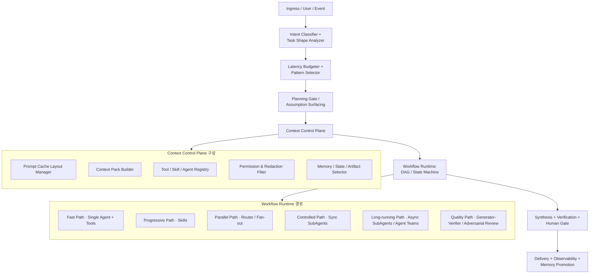
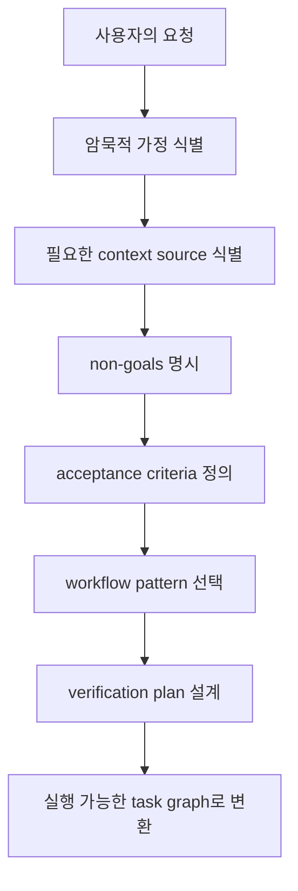
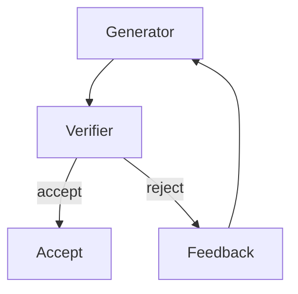
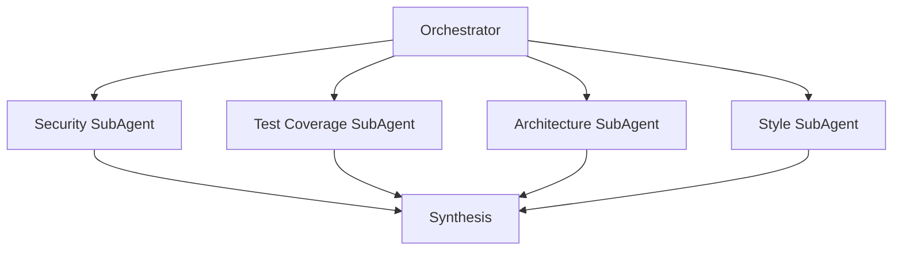
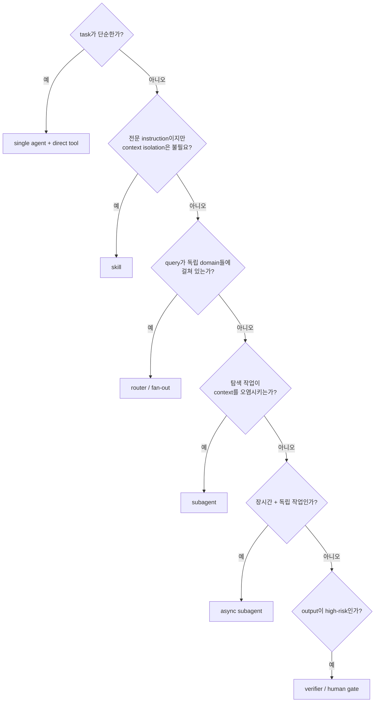
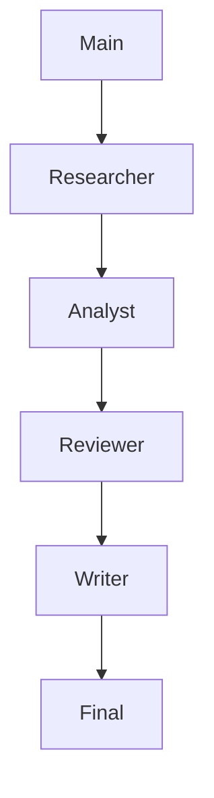
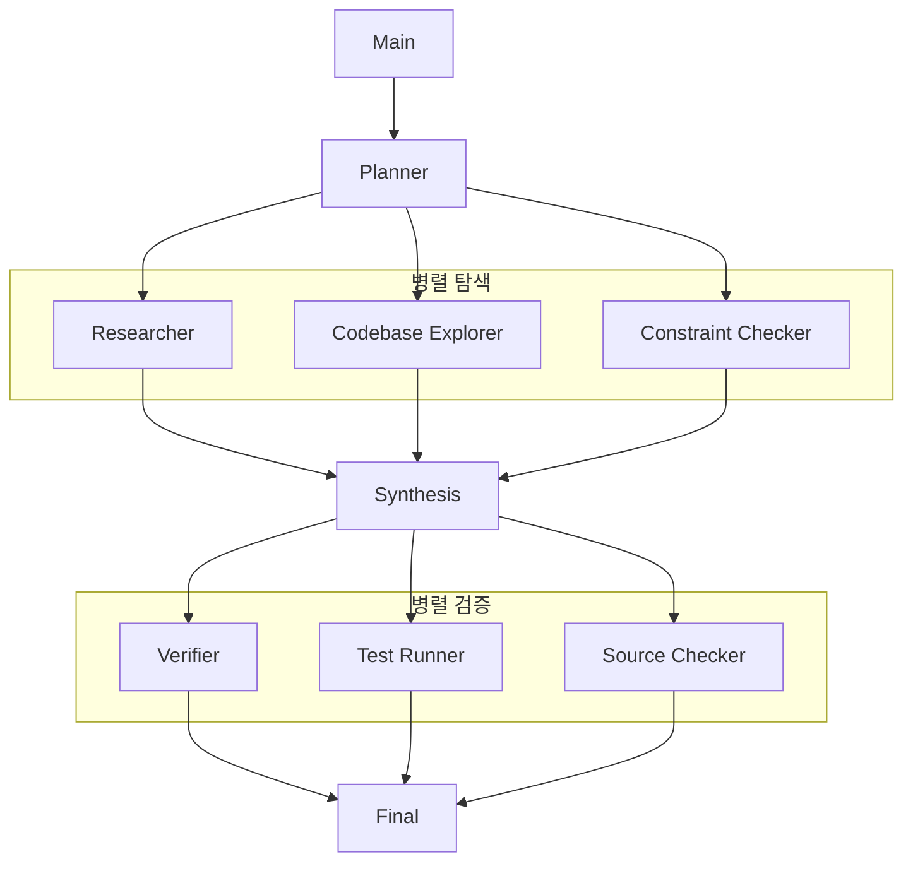
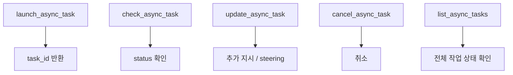
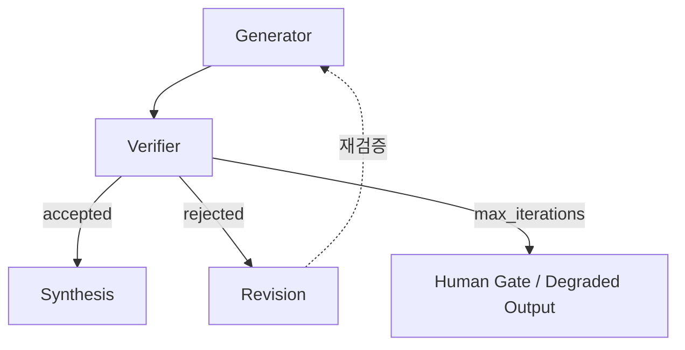

# Multi-Agent / SubAgents / Workflow Architecture의 현재 방향과 Context 한계 극복, Latency 대응 전략

---

## Executive Summary

현재 AI Agent 시스템의 설계 방향은 “LLM을 여러 개 호출하는 구조”에서 **Context Engineering, Workflow Runtime, SubAgent Isolation, Verification, Latency Control**을 결합한 종합 아키텍처로 이동하고 있습니다. Anthropic의 Claude Code 관련 자료들은 agentic system이 실제 제품 수준으로 동작하려면 prompt caching, compaction, dynamic workflow, adversarial verification, shared state, agent teams 같은 운영·아키텍처 요소가 필요하다는 점을 보여줍니다. LangChain 자료는 같은 문제를 Subagents, Skills, Handoffs, Router, Custom Workflow라는 구현 패턴으로 체계화합니다. 두 흐름을 통합하면 결론은 명확합니다. **좋은 Multi-Agent System은 “Agent를 많이 둔 시스템”이 아니라, Context를 정확히 분배하고, Workflow를 명시적으로 통제하며, Latency와 품질을 동시에 관리하는 시스템**입니다. Claude Code 팀은 prompt caching을 장시간 agentic product의 비용·지연시간을 낮추는 핵심 전제로 보고, cache hit rate를 uptime처럼 모니터링한다고 설명합니다. LangChain도 agent 실패의 주요 원인이 모델 성능 부족보다 “올바른 context가 LLM에 전달되지 않은 것”인 경우가 많다고 설명합니다. ([Claude][1])

SubAgents의 핵심 가치는 “역할 분담”보다 **context isolation**입니다. LangChain Deep Agents 문서는 subagent가 별도 context window에서 web search, file read, database query 같은 탐색 작업을 수행하고, main agent에는 최종 요약만 반환함으로써 context bloat를 방지한다고 설명합니다. Claude의 multi-agent coordination 자료도 orchestrator-subagent가 명확히 분해된 bounded subtask에 적합하지만, orchestrator가 정보 병목이 될 수 있고 병렬화하지 않으면 multi-agent 비용만 증가한다고 지적합니다. 즉 SubAgent는 context를 깨끗하게 유지하는 강력한 도구이지만, 설계가 부실하면 latency와 coordination overhead를 키웁니다. ([LangChain][2])

Workflow 시스템의 방향은 **DAG / state machine**으로 수렴하고 있습니다. Anthropic은 dynamic workflows가 task별 harness를 생성해 subagents를 spawn하고 coordinate할 수 있으며, fan-out search, adversarial verification, tournament, loop-until-done 같은 패턴을 활용한다고 설명합니다. LangChain은 custom workflow에서 deterministic logic과 agentic behavior를 섞고, sequential step, conditional branch, loop, parallel execution을 graph로 제어할 수 있다고 설명합니다. 이는 “agent에게 모든 control flow를 맡기는 방식”에서 “deterministic workflow가 control plane이 되고 agent는 필요한 node에서 reasoning을 수행하는 방식”으로의 전환입니다. ([Claude][3])

Latency는 SubAgents 시스템에서 필연적으로 발생합니다. LangChain의 성능 비교에 따르면 one-shot 요청에서 Subagents는 결과가 main agent를 통해 되돌아오기 때문에 4 model calls가 필요하고, Skills/Handoffs/Router는 3 calls로 처리될 수 있습니다. 반복 요청에서도 stateless subagent는 같은 flow를 반복하기 때문에 총 call 수가 커집니다. 그러나 multi-domain 작업에서는 Subagents와 Router가 parallel execution과 context isolation 덕분에 Skills보다 token 효율이 좋을 수 있습니다. 즉 SubAgents는 항상 빠른 구조가 아니라, **큰 context·복수 domain·병렬 탐색·검증 필요성이 있는 경우 total quality/cost/latency trade-off가 좋아지는 구조**입니다. ([LangChain Docs][4])

권장하는 SubAgents 아키텍처는 다음과 같습니다.



---

# 1. 문제 정의: 현재 AI Agent 시스템의 본질적 한계

## 1.1 Context Window 한계는 단순한 “크기” 문제가 아니다

AI Agent의 context 문제는 “몇 token까지 넣을 수 있는가”보다 복잡합니다. 실제 문제는 다음 네 가지입니다.

| 문제               | 설명                                                                                  |
| ---------------- | ----------------------------------------------------------------------------------- |
| Context bloat    | tool call, search result, file read, intermediate reasoning이 누적되어 main context가 오염됨 |
| Context loss     | compaction, summarization, handoff 과정에서 edge case, constraint, non-goal이 손실됨        |
| Context mismatch | agent가 실제로 필요한 정보가 아니라 과하거나 부족한 정보를 받음                                              |
| Context drift    | 긴 작업 중 원래 목표, 품질 기준, 금지사항이 희미해짐                                                     |

LangChain은 agent 실패의 원인이 LLM 자체의 능력 부족보다 “right context”가 전달되지 않은 것인 경우가 많고, context engineering은 올바른 정보와 tool을 올바른 format으로 제공하는 일이라고 설명합니다. 이 관점은 Multi-Agent Architecture 전체의 출발점입니다. ([LangChain Docs][5])

## 1.2 SubAgent는 context window 확대의 대안이 아니라 context 오염 방지 장치다

LangChain Deep Agents 자료는 subagent가 context bloat 문제를 해결하기 위한 isolated worker라고 설명합니다. main agent가 수십 번의 web search나 file read를 직접 수행하면 context window가 중간 결과로 가득 차지만, subagent가 별도 context window에서 탐색하고 final result만 main agent에 반환하면 main context는 훨씬 깨끗하게 유지됩니다. ([LangChain][2])

이 의미는 중요합니다. SubAgent는 “전문가 agent”라기보다 **context quarantine unit**입니다. 즉, 큰 탐색·불확실한 조사·대량 tool output·반복 실험·codebase exploration 같은 작업을 main conversation에서 격리하는 장치입니다.

## 1.3 Planning 부재는 context 부족보다 더 근본적인 실패 원인이다

CodeRabbit 사례는 AI coding에서 “코드가 컴파일되고 테스트를 통과하지만 팀이 의도한 것을 만들지 않는” 문제가 발생한다고 설명합니다. CodeRabbit은 이를 해결하기 위해 coding request와 coding agent 사이에 planning orchestration layer를 두고, 코드 생성 전에 구조화된 coding plan을 팀이 검토할 수 있게 했습니다. ([Claude][6])

이 사례가 주는 교훈은 명확합니다. 많은 AI Agent 실패는 모델이 “못해서”가 아니라 **사용자·팀·조직이 가지고 있는 암묵지가 plan으로 명시되지 않았기 때문에** 발생합니다. CodeRabbit은 계획의 상세도가 너무 낮으면 agent가 가정을 채워버리고, 너무 높으면 코드베이스 변화에 stale해지므로 적절한 abstraction level을 eval harness로 찾아야 했다고 설명합니다. 또한 plan 자체가 quality gate가 되면 downstream code quality가 좋아진다고 설명합니다. ([Claude][6])

---

# 2. 자료들을 통합해서 본 현재 방향성

## 2.1 “Agent 여러 개”에서 “Context + Workflow Runtime”으로 이동

Anthropic의 dynamic workflows 자료는 Claude Code가 task에 맞는 harness를 on the fly로 만들고, subagents를 spawn하고 coordinate할 수 있다고 설명합니다. 특히 dynamic workflows는 complex, high-value tasks에 적합하지만 더 많은 token을 사용할 수 있다고 언급합니다. ([Claude][3])

LangChain의 custom workflow 문서는 LangGraph를 통해 sequential steps, conditional branches, loops, parallel execution을 직접 정의할 수 있고, deterministic logic과 agentic behavior를 섞을 수 있다고 설명합니다. 각 node는 function, LLM call, tool-using agent, 또는 다른 multi-agent architecture 전체가 될 수 있습니다. ([LangChain Docs][7])

이를 통합하면 현재 방향은 다음과 같습니다.

| 과거식 접근                      | 현재/미래형 접근                                                     |
| --------------------------- | ------------------------------------------------------------- |
| 하나의 거대한 prompt              | Context pack + lazy loading                                   |
| 단일 long-running agent       | workflow graph + subagents                                    |
| 역할명 기반 agent 분리             | context boundary 기반 분리                                        |
| agent가 control flow까지 모두 판단 | DAG/state machine이 control flow 관리                            |
| 마지막에만 검증                    | workflow 내부 verifier / adversarial review                     |
| 모든 tool을 항상 제공              | tool search / deferred loading / skill progressive disclosure |
| 단순 로그                       | trace, cache hit, token, latency, verification metrics        |

## 2.2 Multi-Agent 패턴은 “복잡한 시스템 이름”이 아니라 workload shape에 맞춰 선택해야 한다

Anthropic은 다섯 가지 coordination pattern을 제시합니다. generator-verifier는 명시적 평가 기준이 있는 quality-critical output에, orchestrator-subagent는 명확히 분해되는 bounded subtask에, agent teams는 독립적이고 장시간 지속되는 병렬 subtask에, message bus는 event-driven pipeline과 growing agent ecosystem에, shared state는 agents가 서로의 findings를 기반으로 협업해야 하는 작업에 적합하다고 설명합니다. ([Claude][8])

LangChain은 Subagents, Skills, Handoffs, Router, Custom Workflow를 주요 패턴으로 제시합니다. Subagents는 main agent가 subagents를 tool처럼 호출하는 구조이고, Skills는 single agent가 필요한 specialized prompt와 knowledge를 on-demand로 로딩하는 구조이며, Handoffs는 state에 따라 active behavior가 바뀌는 sequential flow이고, Router는 input을 분류해 하나 이상의 specialized agent로 보내고 결과를 합성하는 구조입니다. Custom Workflow는 이 패턴들을 graph node로 섞을 수 있는 상위 구조입니다. ([LangChain Docs][4])

따라서 architecture 선택은 다음 질문에서 시작해야 합니다.

| 질문                            | 설계 판단                          |
| ----------------------------- | ------------------------------ |
| 단일 agent로 해결 가능한가?            | 가능하면 multi-agent로 가지 않는다       |
| context가 너무 커지는가?             | SubAgent 또는 Router로 isolation  |
| instruction이 많지만 항상 필요하지 않은가? | Skills로 progressive disclosure |
| 순서와 precondition이 중요한가?       | Handoffs 또는 Custom Workflow    |
| 여러 domain을 병렬 조회해야 하는가?       | Router / Fan-out               |
| 장시간 독립 작업인가?                  | Async SubAgent / Agent Teams   |
| agents가 서로 발견을 즉시 공유해야 하는가?   | Shared State                   |
| 이벤트가 workflow를 만든는가?          | Message Bus                    |
| 품질 기준이 명확한가?                  | Generator-Verifier             |

## 2.3 “단순하게 시작하고, 한계가 드러날 때 진화”가 공통된 권장 방향이다

LangChain은 많은 경우 single agent와 좋은 prompt engineering, tools만으로도 충분하며, 명확한 한계에 부딪힐 때 multi-agent pattern으로 확장하라고 권합니다. Anthropic도 sophistication이 아니라 문제 적합성을 기준으로 가장 단순한 pattern에서 시작하고, 한계가 드러나는 지점에서 진화하라고 설명합니다. ([LangChain][9])

이 원칙은 실무적으로 매우 중요합니다. Multi-Agent는 품질을 자동으로 올리는 마법이 아닙니다. agent 수를 늘리면 context isolation, specialization, parallelism은 얻을 수 있지만, 동시에 latency, cost, tracing complexity, state consistency, conflict resolution 문제가 생깁니다.

---

# 3. 통합 Reference Architecture

## 3.1 전체 구조

```mermaid
flowchart TD
    L1["<b>Ingress Layer</b><br/>User request / API event / scheduled job / webhook"]
    L2["<b>Intent Classifier + Task Shape Analyzer</b><br/>• task complexity<br/>• context size<br/>• risk level<br/>• parallelizability<br/>• user-visible latency requirement"]
    L3["<b>Latency Budgeter + Pattern Selector</b><br/>• single agent / skill / router / subagent / async / verifier<br/>• max critical path calls<br/>• timeout / quorum / partial-result policy"]
    L4["<b>Planning Gate / Spec Layer</b><br/>• objective, non-goals, assumptions<br/>• acceptance criteria<br/>• context inventory<br/>• verification plan"]
    L5["<b>Context Control Plane</b><br/>• prompt cache layout<br/>• context pack builder<br/>• skill / tool / subagent discovery<br/>• permission filtering<br/>• compaction and memory policy<br/>• artifact pointer selection"]
    L6["<b>Workflow Runtime / State Graph</b><br/>• deterministic nodes<br/>• LLM nodes<br/>• tool nodes<br/>• subagent nodes<br/>• verifier nodes<br/>• async background jobs"]
    L7["<b>State / Memory / Artifact Layer</b><br/>• short-term state<br/>• long-term memory<br/>• shared state / blackboard<br/>• decision log<br/>• constraint ledger<br/>• async task registry<br/>• raw artifact store"]
    L8["<b>Synthesis + Verification + Human Gate</b><br/>• conflict resolution<br/>• source checking<br/>• rubric evaluation<br/>• test execution<br/>• escalation"]
    L9["<b>Delivery + Observability + Learning</b><br/>• final answer / artifact<br/>• trace<br/>• latency / token / cache metrics<br/>• eval results<br/>• memory promotion"]

    L1 --> L2 --> L3 --> L4 --> L5 --> L6 --> L7 --> L8 --> L9
```



## 3.2 이 구조의 핵심 철학

이 아키텍처는 agent를 중심에 두지 않습니다. 중심에는 다음 네 가지 control plane이 있습니다.

| Control Plane              | 역할                                                             |
| -------------------------- | -------------------------------------------------------------- |
| Context Control Plane      | 어떤 정보를 누구에게, 어떤 형식으로, 어느 시점에 줄지 결정                             |
| Workflow Control Plane     | 어떤 node를 어떤 순서·조건·병렬성으로 실행할지 결정                                |
| Latency Control Plane      | synchronous/async, timeout, quorum, model routing, cache 전략 결정 |
| Verification Control Plane | 어떤 결과를 어떤 기준으로 검증하고, 실패 시 어떻게 반복·중단·승격할지 결정                    |

즉, agent는 이 control plane들이 호출하는 execution unit입니다. 이 관점이 없으면 multi-agent system은 금방 “agent soup”가 됩니다.

---

# 4. Context Control Plane: Multi-Agent Architecture의 중심

## 4.1 Context를 text가 아니라 typed object로 관리해야 한다

Context는 단순 prompt 문자열이 아니라 metadata를 가진 자산으로 관리되어야 합니다.

```text
ContextObject
- id
- type: system_policy | tool_schema | project_rule | source_doc | memory |
        task_state | tool_result | decision | constraint | open_issue
- scope: global | organization | project | session | task | subtask
- owner
- source_of_truth
- freshness
- permission_level
- token_cost
- cacheability: stable_prefix | project_cache | session_cache | dynamic
- evidence_quality
- raw_pointer
- distilled_summary
- dependencies
```

LangChain은 context를 model context, tool context, life-cycle context로 나누고, model context는 한 call에 들어가는 transient context이며, state/store/runtime context는 persistent context와 연결된다고 설명합니다. 또한 state는 short-term memory, store는 long-term memory, runtime context는 user ID, API key, permission, environment 같은 conversation-scoped static configuration으로 설명합니다. ([LangChain Docs][5])

이 구분은 설계상 매우 중요합니다.

| 구분                 | 잘못된 처리            | 권장 처리                                |
| ------------------ | ----------------- | ------------------------------------ |
| Tool result        | 모두 prompt에 누적     | raw artifact store에 저장하고 pointer만 전달 |
| Decision           | 대화 속 자연어로 방치      | decision log에 구조화                    |
| Constraint         | 요약 중 손실           | constraint ledger에 별도 보존             |
| User preference    | 매번 추론             | verified memory로 승격                  |
| Runtime permission | agent prompt에만 서술 | tool/runtime layer에서 enforce         |
| Long context       | 한 agent에 모두 주입    | context pack으로 분배                    |

## 4.2 Prompt caching은 성능 최적화가 아니라 아키텍처 제약이다

Claude Code 자료는 prompt caching이 prefix matching 기반이며, static content를 먼저 두고 dynamic content를 뒤에 배치해야 cache hit를 극대화할 수 있다고 설명합니다. Claude Code의 구조는 static system prompt와 tools, CLAUDE.md, session context, conversation messages 순서이며, timestamp를 static prompt에 넣거나 tool order가 비결정적으로 바뀌는 것만으로도 cache가 깨질 수 있다고 설명합니다. ([Claude][1])

권장 prompt layout은 다음과 같습니다.

```text
1. Stable global system instruction
2. Stable tool stubs / tool schemas
3. Stable organization policy
4. Project rules / project memory
5. Session plan / constraint ledger
6. Recent task state
7. Dynamic messages / tool results
```

중요한 원칙은 다음입니다.

| 원칙                            | 이유                                   |
| ----------------------------- | ------------------------------------ |
| static first, dynamic last    | prefix cache hit 극대화                 |
| system prompt를 자주 바꾸지 않기      | cache invalidation 방지                |
| tool set을 turn마다 바꾸지 않기       | tool schema가 cached prefix에 포함되기 때문  |
| 상태 전환은 tool/message로 표현       | prompt 변경 없이 behavior 전환             |
| tool 제거 대신 deferred loading   | prefix 안정성 유지                        |
| compaction도 parent prefix를 공유 | 긴 history를 uncached로 다시 보내는 비용 함정 방지 |

Claude Code는 tool을 중간에 추가·제거하지 않고 lightweight stub과 deferred loading을 사용해 full tool schema를 필요할 때만 로딩한다고 설명합니다. 또한 compaction 시 별도 system prompt로 summarization call을 만들면 cache prefix가 달라져 비용 함정이 생기므로, parent conversation과 동일한 system prompt/tool/history prefix를 공유하는 cache-safe forking을 사용한다고 설명합니다. ([Claude][1])

## 4.3 Compaction은 “요약”이 아니라 손실 관리다

LangChain은 conversation이 token limit을 넘으면 summarization middleware가 오래된 messages를 별도 LLM call로 요약하고, summary message로 state를 영구적으로 대체한다고 설명합니다. Anthropic은 compaction이 prompt caching과 상호작용하며, 별도 system prompt로 요약하면 cache가 깨질 수 있다고 설명합니다. ([LangChain Docs][5])

따라서 compaction은 단순 대화 요약이어서는 안 됩니다. 다음 네 개 artifact로 나누어야 합니다.

| Artifact          | 보존할 내용                                |
| ----------------- | ------------------------------------- |
| Decision Log      | 이미 결정된 사항과 rationale                  |
| Constraint Ledger | 반드시 지킬 요구사항, 금지사항, edge case          |
| Open Issue List   | 아직 해결되지 않은 질문과 불확실성                   |
| Evidence Index    | 중요한 source, file, tool result pointer |

이 구조가 있어야 compaction 후에도 “무엇을 하려 했는지”, “무엇을 하면 안 되는지”, “무엇이 아직 불확실한지”가 유지됩니다.

---

# 5. Planning Gate: 실행 전에 의도를 구조화하는 계층

## 5.1 Planning은 downstream risk를 줄이는 quality gate다

CodeRabbit은 coding request와 coding agent 사이에 agent orchestration layer를 두고, code generation 전에 structured coding plan을 생성한다고 설명합니다. 또한 plan이 팀 단위 quality gate가 되어 downstream code quality에 큰 영향을 준다고 설명합니다. ([Claude][6])

Planning Gate의 목표는 다음입니다.



## 5.2 Planning Output Schema

```text
PlanningArtifact
- objective
- user_intent
- expected_output
- non_goals
- assumptions_to_validate[]
- required_context_sources[]
- source_of_truth[]
- constraints[]
- edge_cases[]
- acceptance_criteria[]
- risk_register[]
- recommended_pattern:
    single_agent | skills | handoffs | router | subagents |
    async_subagents | agent_teams | message_bus | shared_state | custom_workflow
- latency_budget
- verification_plan
- human_gate_points[]
```

이 planning artifact는 단지 중간 문서가 아니라 이후 모든 subagent context pack, verifier rubric, final synthesis 기준으로 쓰여야 합니다.

---

# 6. Workflow Runtime: Agentic Behavior를 Graph에 배치하기

## 6.1 Workflow는 deterministic node와 agentic node의 조합이다

LangChain custom workflow 문서는 graph 구조를 직접 정의하고, 각 node가 simple function, LLM call, agent with tools, 또는 다른 multi-agent architecture가 될 수 있다고 설명합니다. RAG 예시에서도 query rewrite는 model node, retrieval은 deterministic vector search node, answer generation은 agent node로 분리합니다. ([LangChain Docs][7])

권장 설계 원칙은 다음입니다.

| Node 유형            | 예시                                           | 장점               |
| ------------------ | -------------------------------------------- | ---------------- |
| Deterministic node | validation, dedupe, retrieval, merge         | 빠르고 재현 가능        |
| LLM node           | classification, query rewrite, summarization | 자연어 판단 가능        |
| Agent node         | tool use + reasoning                         | 복잡한 실행 가능        |
| SubAgent node      | isolated exploration                         | context bloat 방지 |
| Verifier node      | rubric/test/source check                     | 품질 통제            |
| Human gate         | approval, ambiguous decision                 | 위험 제어            |

## 6.2 Workflow Pattern Decision Matrix

| Task Shape               | 권장 Pattern           | 이유                              |
| ------------------------ | -------------------- | ------------------------------- |
| 단순 one-shot              | Single Agent + Tools | agent overhead 불필요              |
| 전문 절차가 있지만 독립 agent 불필요  | Skills               | instruction을 on-demand로 로딩      |
| 단계적 precondition 필요      | Handoffs             | state-driven sequential control |
| distinct verticals 병렬 조회 | Router               | parallel fan-out + synthesis    |
| main context 보존 필요       | SubAgents            | context isolation               |
| 장시간 독립 작업                | Async SubAgents      | user-visible latency 분리         |
| 독립 partition 대량 처리       | Agent Teams          | worker context 축적               |
| event-driven pipeline    | Message Bus          | agent ecosystem 확장              |
| 협업형 research             | Shared State         | findings를 실시간 공유                |
| 품질 기준 명확                 | Generator-Verifier   | explicit rubric 기반 검증           |
| 복합 엔터프라이즈 workflow       | Custom Workflow      | deterministic + agentic 혼합      |

Anthropic은 generator-verifier에서 verifier가 explicit criteria에 따라 accept/reject하고, 실패하면 feedback을 generator에 반환하며, 최대 iteration까지 반복한다고 설명합니다. 하지만 verifier 기준이 모호하면 rubber stamp가 된다고 경고합니다. ([Claude][8])

## 6.3 Dynamic Workflow는 고가치 작업에만 사용한다

Anthropic은 dynamic workflows가 fan-out searches, adversarial verification, synthesis, tournament 같은 복잡한 task-specific harness를 가능하게 하지만, 더 많은 token을 사용할 수 있어 complex, high-value tasks에 적합하다고 설명합니다. ([Claude][3])

따라서 권장 기준은 다음입니다.

| 상황                | Workflow 방식                              |
| ----------------- | ---------------------------------------- |
| 반복 업무, 규칙 안정      | Static workflow template                 |
| task마다 구조가 조금씩 다름 | Parameterized workflow                   |
| 고가치·비정형·복잡        | Dynamic workflow generation              |
| 실패 비용이 큼          | Dynamic workflow + verifier + human gate |

---

# 7. SubAgents Architecture

## 7.1 SubAgent의 본질: Context Isolation + Specialized Execution

LangChain의 subagents 문서는 supervisor가 subagents를 tools로 호출하고, main agent가 어떤 subagent를 호출할지, 어떤 input을 줄지, 결과를 어떻게 합칠지 결정한다고 설명합니다. subagents는 stateless이며, conversation memory는 main agent가 유지합니다. 이 구조는 각 subagent invocation이 clean context window에서 수행되게 하여 main conversation의 context bloat를 막습니다. ([LangChain Docs][10])

### 권장 SubAgent Runtime 구조

```text
SubAgentRuntime
- isolated context window
- agent-specific system prompt
- restricted tools
- model profile
- context pack
- output schema
- timeout
- retry policy
- artifact writer
- trace id
```

## 7.2 SubAgent는 작고 뾰족해야 한다

나쁜 SubAgent:

```text
helper-agent:
- 여러 가지를 도와준다
- web, database, email, file, code execution 모두 가능
- output 자유 형식
```

좋은 SubAgent:

```text
security-pr-reviewer:
- PR diff에서 authentication, authorization, secret exposure만 검토
- allowed tools: read_diff, search_code, run_static_security_check
- forbidden: write_file, deploy, send_email
- output schema:
  - findings[]
  - severity
  - affected_files[]
  - evidence_refs[]
  - recommended_fix
  - confidence
```

Deep Agents 자료도 subagent description을 명확히 쓰고, system prompt에 tool usage guidance와 output format requirement를 포함하며, subagent tool set은 필요한 것만 최소화하라고 권합니다. ([LangChain][2])

## 7.3 SubAgent Input Policy

LangChain subagents 문서는 subagent input을 query only, full context, prior result, task metadata 등으로 customize할 수 있다고 설명합니다. ([LangChain Docs][10])

권장 기본값은 **Query + Context Pack**입니다.

```text
SubAgentContextPack
- task_goal
- relevant_facts
- source_snippets
- prior_decisions
- constraints
- non_goals
- allowed_tools
- forbidden_actions
- expected_output_schema
- verification_rubric
- artifact_store_location
```

| Input 방식              | 적합한 상황                 | 위험              |
| --------------------- | ---------------------- | --------------- |
| Query-only            | 독립 research, 단순 lookup | 배경 부족           |
| Query + Context Pack  | 대부분의 전문 subtask        | pack 생성 필요      |
| Full filtered history | 대화 맥락이 결정적인 경우         | context bloat   |
| Full history          | 거의 마지막 선택              | isolation 효과 약화 |

## 7.4 SubAgent Output Policy

SubAgent output은 parent가 바로 사용할 수 있도록 짧고 구조화해야 합니다.

```text
SubAgentResult
- task_id
- agent_name
- summary
- key_findings[]
- evidence_refs[]
- assumptions[]
- risks[]
- open_questions[]
- confidence
- recommended_next_action
- raw_artifact_pointer
```

LangChain subagents 문서는 subagent가 tool calls나 reasoning을 수행하더라도 supervisor는 final output만 보므로, 무엇을 반환해야 하는지 명확히 prompt하거나 code에서 format해야 한다고 설명합니다. ([LangChain Docs][10])

권장 분리:

| Parent context에 반환 | Artifact store에 저장        |
| ------------------ | ------------------------- |
| concise summary    | raw search results        |
| key findings       | full logs                 |
| evidence pointers  | full documents            |
| confidence         | intermediate calculations |
| open questions     | generated files           |
| next action        | trace                     |

## 7.5 SubAgent Registry

작은 시스템에서는 subagent 목록을 system prompt에 나열할 수 있습니다. 그러나 LangChain 문서는 agent 수가 많거나 registry가 자주 바뀌면 `list_agents`나 `search_agents` 같은 tool-based discovery가 적합하다고 설명합니다. ([LangChain Docs][10])

권장 AgentSpec:

```text
AgentSpec
- name
- description
- capability_tags[]
- input_schema
- output_schema
- required_context_types[]
- forbidden_context_types[]
- allowed_tools[]
- expected_latency_class: fast | normal | slow | background
- model_profile
- cost_profile
- permission_scope
- owner_team
- version
- health_status
```

Registry는 단순 catalog가 아니라 **orchestrator가 pattern selection, permission filtering, latency budgeting을 할 수 있게 하는 metadata layer**여야 합니다.

---

# 8. Skills, Handoffs, Router와 SubAgents의 통합적 위치

## 8.1 Skills: 가벼운 progressive disclosure

Deep Agents 자료는 Skills를 “progressive disclosure” 패턴으로 설명합니다. agent는 skill 이름과 description만 먼저 보고, 필요하다고 판단할 때 full `SKILL.md` instruction을 읽습니다. ([LangChain][2])

Skills는 SubAgent보다 가볍습니다. 별도의 model call이나 isolated worker가 아니라, single agent가 필요한 instruction을 on-demand로 로딩하는 방식이기 때문입니다.

| Skills가 적합한 경우                            | 설명                                   |
| ----------------------------------------- | ------------------------------------ |
| 전문 절차·템플릿이 필요                             | deploy, PR review, report generation |
| 사용자와 single agent가 계속 대화                  | direct interaction 유지                |
| context isolation보다 instruction reuse가 중요 | 간단한 전문 capability                    |
| latency가 민감                               | subagent call 회피                     |
| team별 skill packaging 필요                  | SKILL.md 기반 배포                       |

하지만 multi-domain 병렬 작업에서는 skill을 여러 개 로딩한 context가 계속 누적되어 token bloat가 커질 수 있습니다. LangChain 성능 비교에서도 multi-domain scenario에서 Skills는 model call 수는 적지만 token 사용량이 커지고, Subagents는 context isolation 덕분에 더 적은 token을 처리할 수 있다고 설명합니다. ([LangChain Docs][4])

## 8.2 Handoffs: state-driven sequential workflow

LangChain handoffs 문서는 tool이 `current_step` 또는 `active_agent` 같은 state variable을 업데이트하고, system이 이 state를 읽어 prompt/tools 또는 active agent를 바꾸는 방식이라고 설명합니다. state는 conversation turns를 넘어 유지됩니다. ([LangChain Docs][11])

Handoffs는 다음 상황에 적합합니다.

| 상황                       | 이유                               |
| ------------------------ | -------------------------------- |
| 순서 강제 필요                 | warranty ID 확인 후 refund 처리       |
| multi-stage conversation | triage → specialist → resolution |
| 각 단계가 user와 직접 대화        | direct user interaction          |
| 반복 요청에서 state reuse      | handoff overhead 감소              |

LangChain 성능 비교는 repeat request에서 stateful patterns인 Handoffs와 Skills가 call 수를 줄일 수 있다고 설명합니다. ([LangChain Docs][4])

## 8.3 Router: stateless parallel dispatch + synthesis

LangChain router 문서는 router가 query를 분해하고 zero or more specialized agents를 parallel로 호출한 뒤 결과를 coherent response로 synthesis한다고 설명합니다. distinct verticals가 있고, 여러 source를 병렬 조회해야 할 때 적합합니다. ([LangChain Docs][12])

Router는 다음에 강합니다.

| 상황                          | 이유                            |
| --------------------------- | ----------------------------- |
| enterprise knowledge search | GitHub, Slack, Notion 등 병렬 조회 |
| multi-domain comparison     | domain별 agent fan-out         |
| stateless query routing     | 매 요청 독립 처리                    |
| latency critical            | 병렬 실행으로 critical path 단축      |

Router와 supervisor-subagent의 차이는 state입니다. LangChain subagents 문서는 supervisor는 conversation context를 유지하며 multi-turn으로 subagents 호출을 동적으로 결정하지만, router는 보통 single classification step으로 dispatch한다고 설명합니다. ([LangChain Docs][10])

---

# 9. Coordination Pattern의 통합 해석

## 9.1 Generator-Verifier



적합한 경우:

| 사용처               | 이유                              |
| ----------------- | ------------------------------- |
| code generation   | tests / lint / compile 기준 명확    |
| factual report    | source checking 가능              |
| compliance        | policy rubric 가능                |
| customer response | tone, policy, knowledge base 검증 |

주의점: verifier rubric이 모호하면 품질 통제가 아니라 승인 도장만 찍는 구조가 됩니다. Anthropic은 verifier 기준이 불명확하면 generator output을 rubber-stamp할 수 있다고 경고합니다. ([Claude][8])

## 9.2 Orchestrator-SubAgent



적합한 경우:

| 사용처              | 이유                            |
| ---------------- | ----------------------------- |
| code review      | check별 context와 output이 분명    |
| document review  | legal, style, factuality 분리   |
| product analysis | UX, market, technical risk 분리 |

주의점: orchestrator가 정보 병목이 될 수 있습니다. 한 subagent가 발견한 내용이 다른 subagent에게 중요해도 orchestrator가 이를 인식하고 전달하지 못하면 critical detail이 소실됩니다. 또한 병렬화하지 않으면 multi-agent token cost는 지불하면서 속도 이점은 얻지 못합니다. ([Claude][8])

## 9.3 Agent Teams

Agent Teams는 persistent worker가 독립 task를 여러 단계에 걸쳐 수행하며, context와 domain familiarity를 축적하는 구조입니다. Anthropic은 one-shot subagent와 달리 teammate는 여러 assignment를 처리하면서 context를 유지한다고 설명합니다. ([Claude][8])

적합한 경우:

| 사용처                       | 이유                               |
| ------------------------- | -------------------------------- |
| 대규모 codebase migration    | service별 long-running context 필요 |
| batch document processing | worker별 partition 처리             |
| multi-service refactor    | 각 service의 dependency/context 축적 |

SubAgent가 매번 stateless로 시작해서 같은 정보를 다시 배워야 한다면 Agent Teams로 진화하는 것이 맞습니다.

## 9.4 Message Bus

Message Bus는 agents가 publish/subscribe 방식으로 event를 주고받는 구조입니다. Anthropic은 agent count가 늘고 interaction pattern이 복잡해지면 direct coordination이 어려워지고, message bus가 shared communication layer로 agents를 연결한다고 설명합니다. event-driven pipeline, security operations automation처럼 workflow가 사전에 고정되지 않고 event에 따라 생겨나는 경우에 적합합니다. ([Claude][8])

주의점은 tracing과 routing입니다. event cascade가 여러 agent를 거치면 어떤 일이 일어났는지 추적하기 어렵고, router가 event를 잘못 분류하거나 drop하면 조용히 실패할 수 있습니다. ([Claude][8])

## 9.5 Shared State

Shared State는 agents가 중앙 coordinator 없이 shared database, file system, document, blackboard에 직접 읽고 쓰는 구조입니다. Anthropic은 shared state가 agents의 findings를 즉시 공유하고 evolving knowledge base를 만들 수 있지만, termination condition이 필요하다고 설명합니다. ([Claude][8])

적합한 경우:

| 사용처                    | 이유                            |
| ---------------------- | ----------------------------- |
| collaborative research | 한 agent의 발견이 다른 agent에게 즉시 유용 |
| investigative analysis | evidence graph를 지속적으로 확장      |
| product intelligence   | 여러 source의 findings를 축적       |

필수 장치:

```text
- lock / ownership
- versioning
- duplicate detection
- conflict log
- convergence threshold
- designated termination agent
- no-new-findings-for-N-cycles rule
```

---

# 10. Latency Architecture

## 10.1 SubAgents는 필연적으로 latency를 만든다

SubAgent latency는 다음 원인에서 발생합니다.

| 원인                      | 설명                                       |
| ----------------------- | ---------------------------------------- |
| 추가 model calls          | supervisor → subagent → supervisor 흐름    |
| sequential dependency   | A 결과 후 B 실행 구조                           |
| barrier synchronization | fan-out 후 가장 느린 agent를 기다림               |
| context serialization   | context pack 구성·전송                       |
| network overhead        | remote subagent 호출                       |
| cache miss              | prompt/tool/model 변경으로 cached prefix 무효화 |
| verifier loop           | 품질 검증 반복                                 |
| worker queue            | concurrent run 대비 worker 부족              |

LangChain의 performance comparison은 one-shot 요청에서 Subagents가 4 calls로, Handoffs/Skills/Router의 3 calls보다 overhead가 있음을 보여줍니다. 반복 요청에서도 stateless Subagents는 매번 같은 flow를 반복하므로 총 8 calls가 되며, Handoffs와 Skills는 state나 loaded skill을 재사용해 call 수를 줄일 수 있습니다. ([LangChain Docs][4])

## 10.2 그러나 Multi-domain에서는 SubAgents가 더 효율적일 수 있다

LangChain의 multi-domain scenario에서는 Subagents와 Router가 parallel execution과 context isolation 덕분에 효율적입니다. 각 domain agent가 관련 context만 처리하므로, Skills처럼 여러 skill 문서를 한 conversation에 누적하는 방식보다 token bloat가 줄어듭니다. LangChain은 해당 예시에서 Subagents가 Skills 대비 전체 token을 67% 적게 처리한다고 설명합니다. ([LangChain Docs][4])

즉 latency와 cost는 단순 call 수만으로 판단하면 안 됩니다.

| 구조              |    Call 수 |                 Token | 적합                  |
| --------------- | --------: | --------------------: | ------------------- |
| Skills          |        적음 |   누적 context로 커질 수 있음 | 단일 domain, 반복 작업    |
| SubAgents       |        많음 |     agent별 context 작음 | multi-domain, 탐색 격리 |
| Router          |        중간 |  context isolation 가능 | 병렬 source/domain 조회 |
| Handoffs        |    반복에 강함 | sequential history 누적 | 단계형 대화              |
| Custom Workflow | 설계에 따라 다름 |                최적화 가능 | 복합 enterprise flow  |

## 10.3 Latency를 네 종류로 분리하라

| Latency 유형            | 의미                                   | 설계 목표                           |
| --------------------- | ------------------------------------ | ------------------------------- |
| User-visible latency  | 사용자가 첫 응답 또는 최종 응답을 받기까지 걸리는 시간      | streaming, async, fast path     |
| Critical path latency | dependency chain 위 model/tool call 합 | DAG 병렬화, call 수 축소              |
| Total compute latency | 전체 agent들이 소비한 총 시간                  | pruning, model routing, cache   |
| Tail latency          | 가장 느린 subagent 때문에 synthesis 지연      | timeout, quorum, partial result |

SubAgent 시스템에서 가장 중요한 것은 **total compute가 늘어도 user-visible latency와 critical path latency를 통제하는 것**입니다.

---

# 11. Latency 대응 전략

## 11.1 Fast Path-first Architecture

모든 요청을 multi-agent workflow로 보내지 않습니다.



LangChain도 multi-agent pattern으로 가기 전 single agent와 tools를 먼저 고려하라고 권합니다. ([LangChain][9])

## 11.2 Latency Budgeter를 명시적으로 둔다

```text
LatencyBudget
- user_visible_budget_ms
- final_answer_budget_ms
- max_model_calls_on_critical_path
- max_parallel_subagents
- max_total_tokens
- timeout_per_subagent
- async_allowed
- partial_result_policy
- quality_floor
```

Latency Budgeter는 Pattern Selector와 함께 동작합니다.

| 조건               | 선택                                 |
| ---------------- | ---------------------------------- |
| 2초 이내 응답 필요      | single agent, cached answer, skill |
| 10~20초 고품질 응답    | router 또는 parallel sync subagents  |
| 긴 research       | async subagents                    |
| high-risk action | verifier + human gate              |
| 반복 요청            | handoff/skill state reuse          |
| 대형 multi-domain  | subagent/router context isolation  |

## 11.3 DAG 병렬화

나쁜 구조:



좋은 구조:



Anthropic은 dynamic workflows에서 fan-out web searches, source fetching, adversarial verification, cited synthesis를 활용하는 deep research workflow를 설명합니다. 또한 migration/refactor에서는 fix별 subagent를 worktree에서 실행하고 다른 agent가 adversarial review하는 방식도 제안합니다. ([Claude][3])

## 11.4 Sync SubAgent와 Async SubAgent를 구분한다

LangChain subagents 문서는 sync와 async를 명확히 구분합니다. sync는 main agent가 subagent 결과를 기다리는 방식이고, async는 background job을 시작하고 job ID를 반환해 main agent가 계속 사용자와 상호작용할 수 있게 합니다. ([LangChain Docs][10])

LangChain Deep Agents async subagents 문서는 supervisor가 background task를 launch하고 즉시 return하며, 이후 progress check, follow-up instruction, cancellation이 가능하다고 설명합니다. async subagents는 long-running, parallelizable, mid-flight steering이 필요한 작업에 적합합니다. ([LangChain Docs][13])

권장 기준:

| 작업                      | Sync | Async  |
| ----------------------- | ---- | ------ |
| 현재 응답 생성에 반드시 필요        | 적합   | 부적합    |
| long-running research   | 부적합  | 적합     |
| batch report generation | 부적합  | 적합     |
| user가 기다리지 않아도 됨        | 부적합  | 적합     |
| 중간 취소·수정 필요             | 제한적  | 적합     |
| verifier가 즉시 필요         | 적합   | 경우에 따라 |

Async lifecycle:



LangChain은 async task metadata를 message history가 아니라 `async_tasks`라는 dedicated state channel에 저장한다고 설명합니다. 이는 compaction으로 message history가 요약되어도 task ID를 잃지 않게 하기 위해 중요합니다. ([LangChain Docs][13])

## 11.5 Co-deploy와 Remote Deployment를 구분한다

LangChain async subagents 문서는 같은 deployment에 등록된 subagent는 ASGI transport로 in-process function call을 사용해 network latency를 제거할 수 있고, remote HTTP transport는 별도 scaling이나 resource profile이 필요할 때 사용한다고 설명합니다. ASGI transport는 network latency를 제거하고 별도 auth 설정도 필요 없으므로 recommended default라고 설명합니다. ([LangChain Docs][13])

권장 배치:

| Agent 유형                    | 배치                     |
| --------------------------- | ---------------------- |
| hot path classifier         | same process           |
| hot path sync subagent      | co-deployed / ASGI     |
| heavy research agent        | async remote worker 가능 |
| GPU/large-context agent     | 별도 resource pool       |
| external SaaS connector     | async + cache          |
| low-risk deterministic tool | local function         |

## 11.6 Worker Pool과 Concurrency Control

LangChain async subagents 문서는 supervisor 1개와 concurrent subagent 3개를 실행하려면 최소 4 worker slots가 필요하며, 부족하면 subagent launch가 queue된다고 설명합니다. ([LangChain Docs][13])

필수 제어:

```text
- max_parallel_subagents
- per_user_concurrency_limit
- per_workflow_concurrency_limit
- worker_pool_size
- priority_queue
- cancellation_token
- backpressure
- circuit_breaker
- timeout_policy
```

## 11.7 Prompt Caching을 Latency SLO로 관리한다

Claude Code 팀은 prompt cache hit rate를 uptime처럼 모니터링하고 cache break를 incident로 취급한다고 설명합니다. ([Claude][1])

운영 지표:

| Metric                       | 의미               |
| ---------------------------- | ---------------- |
| prompt cache hit rate        | latency/cost 안정성 |
| critical path model calls    | 구조적 latency      |
| p50/p95 user-visible latency | UX               |
| subagent timeout rate        | tail latency     |
| async queue wait time        | capacity         |
| tokens per successful task   | 효율               |
| model switch rate            | cache/cost 영향    |
| tool schema churn            | cache 안정성        |
| compaction frequency         | context pressure |

## 11.8 Timeout, Quorum, Partial Synthesis

모든 subagent를 기다리는 `wait-all`은 high-stakes report에는 적합하지만 일반 사용자-facing workflow에는 느릴 수 있습니다.

| Policy                | 설명                           | 사용처                    |
| --------------------- | ---------------------------- | ---------------------- |
| Wait-all              | 모든 결과를 기다림                   | high-stakes compliance |
| Quorum                | N개 중 K개 완료 시 synthesis       | broad research         |
| Timeout + partial     | timeout 후 partial answer     | interactive assistant  |
| Critical-only         | 필수 agent만 기다림                | latency-sensitive      |
| Progressive synthesis | 결과 도착 순서대로 업데이트              | dashboard/report       |
| Cancel-laggards       | 충분한 confidence 후 느린 agent 취소 | exploratory tasks      |

---

# 12. Verification Architecture

## 12.1 Verifier는 반드시 rubric을 가져야 한다

Verifier에게 “좋은지 확인해”라고 하면 의미 있는 품질 통제가 되지 않습니다. Anthropic은 verifier criteria가 명확하지 않으면 generator output을 rubber-stamp할 수 있다고 경고합니다. ([Claude][8])

VerifierSpec:

```text
VerifierSpec
- target_artifact
- rubric[]
- source_of_truth[]
- required_tests[]
- failure_examples[]
- severity_scale
- max_iterations
- escalation_policy
- output_schema
```

## 12.2 Verification을 workflow 안에 넣는다



Verification 유형:

| 유형                  | 적용                                   |
| ------------------- | ------------------------------------ |
| Source checking     | factual report, research             |
| Test execution      | code generation                      |
| Policy compliance   | legal, finance, healthcare           |
| Adversarial review  | planning, strategy, security         |
| Pairwise comparison | ranking, creative option selection   |
| Regression eval     | workflow/model/prompt 변경 검증          |
| Human gate          | high-risk action, ambiguous decision |

Dynamic workflows 자료는 factual claim을 identify한 뒤 각 claim마다 subagent를 띄워 상세 검증하고, 또 다른 verification agent가 source quality를 확인할 수 있다고 설명합니다. ([Claude][3])

---

# 13. State, Memory, Artifact Store

## 13.1 State와 Context를 분리하라

| 개념       | 의미                            | 예시                                     |
| -------- | ----------------------------- | -------------------------------------- |
| State    | 현재 workflow의 지속 상태            | task status, current_step, auth status |
| Context  | 특정 model call에 들어가는 snapshot  | relevant snippets, recent decisions    |
| Memory   | 여러 session을 넘어 재사용되는 지식       | preferences, project rules             |
| Artifact | context window 밖에 저장되는 원본 산출물 | logs, search results, code diff        |
| Prompt   | model call에 직렬화된 최종 input     | system + tools + context + messages    |

LangChain은 model context는 single call에 들어가는 transient context이고, state/store/runtime context는 persistent data source로 작동한다고 설명합니다. 또한 tools는 state, store, runtime context를 읽고 쓸 수 있다고 설명합니다. ([LangChain Docs][5])

## 13.2 Memory Promotion Rule

모든 것을 memory에 저장하면 memory pollution이 발생합니다. 다음 기준을 통과한 정보만 장기 memory로 승격해야 합니다.

| 기준    | 질문                                  |
| ----- | ----------------------------------- |
| 반복성   | 앞으로 다시 쓰일 가능성이 높은가?                 |
| 검증성   | source/test/human approval로 검증되었는가? |
| 안정성   | 자주 바뀌지 않는가?                         |
| 소유권   | 누가 관리하는 정보인가?                       |
| 권한    | 저장해도 되는 정보인가?                       |
| 충돌 여부 | 기존 memory와 모순되지 않는가?                |

## 13.3 Shared State Schema

```text
SharedState
- task_board
- findings_board
- verified_facts
- decision_log
- constraint_ledger
- open_questions
- artifact_registry
- conflict_log
- agent_heartbeats
- termination_status
```

Shared state는 collaborative research와 multi-agent synthesis에 강력하지만, duplicate work와 reactive loop를 막기 위해 locking, versioning, termination rule이 필요합니다.

---

# 14. Enterprise 관점: Agent 시스템은 조직 지식 시스템이다

Anthropic의 enterprise 자료는 앞서가는 기업들이 agentic AI를 직원의 일하는 방식, process, product capability에 embedding하고, institutional knowledge를 시간이 지날수록 compound되는 system으로 encode한다고 설명합니다. 또한 information-dense process를 압축하되 human-in-the-loop judgement와 expertise를 희생하지 않는 것이 중요하다고 설명합니다. ([Claude][14])

Product development 자료도 Claude Managed Agents를 cloud-hosted agents를 scale 있게 build/deploy하기 위한 composable APIs로 설명하며, product manager가 open-ended research와 discovery에는 Claude/Cowork를 사용하고, job-to-be-done이 명확해지면 Claude Code와 Managed Agents로 custom agent를 만든다고 설명합니다. ([Claude][15])

엔터프라이즈 아키텍처에서 중요한 것은 다음입니다.

| 관심사   | 설계 요소                                                |
| ----- | ---------------------------------------------------- |
| 권한    | runtime context, tool permission, redaction          |
| 감사    | trace, source provenance, decision log               |
| 지식 축적 | memory promotion, skill creation, workflow templates |
| 품질    | eval harness, verifier, human gate                   |
| 확장    | agent registry, message bus, shared state            |
| 운영    | SLO, cache hit, latency, cost, worker pool           |
| 보안    | least privilege, sandbox, approval workflows         |
| 조직화   | owner team, versioning, deployment lifecycle         |

---

# 15. 권장 Implementation Roadmap

## Phase 1. Single Agent + Context Discipline

목표는 multi-agent 이전에 context hygiene을 확보하는 것입니다.

```text
- static prompt 정리
- tool schema 명확화
- structured output 도입
- state / memory / artifact 분리
- prompt cache layout 고정
- basic observability 수집
```

## Phase 2. Skills + Planning Gate

```text
- 반복 업무를 skill로 패키징
- SKILL.md frontmatter / body 분리
- planning artifact schema 도입
- assumption / non-goal / acceptance criteria 명시화
- plan quality eval 시작
```

Skills는 specialized prompt와 knowledge를 on-demand로 로딩하는 구조이므로, 처음부터 SubAgent를 늘리기 전에 가벼운 capability packaging으로 적합합니다. ([LangChain][2])

## Phase 3. Supervisor + 3~5 SubAgents

```text
- research-agent
- code-review-agent
- verifier-agent
- data-analysis-agent
- source-check-agent
```

각 subagent는 다음을 반드시 가져야 합니다.

```text
- clear description
- minimal tool set
- context pack
- output schema
- timeout
- artifact pointer
- trace id
```

## Phase 4. Router / Parallel Fan-out

```text
- multi-source search
- multi-domain comparison
- independent evidence collection
- source-specific subagents
```

Router는 distinct verticals를 parallel로 query하고 synthesis하는 데 적합합니다. ([LangChain Docs][12])

## Phase 5. Async SubAgents

```text
- long-running research
- background report generation
- batch document review
- codebase exploration
- migration assistant
```

Async task registry, status check, cancel, update, notification을 반드시 포함해야 합니다. ([LangChain Docs][13])

## Phase 6. Custom Workflow / Agent Teams / Shared State

다음 증상이 있으면 고급 패턴으로 진화합니다.

| 증상                              | 진화                          |
| ------------------------------- | --------------------------- |
| orchestrator 조건문이 비대해짐          | custom workflow / router    |
| subagent가 매번 같은 context를 다시 학습  | agent teams                 |
| agents가 서로 findings를 실시간 공유해야 함 | shared state                |
| event source가 많아짐               | message bus                 |
| workflow가 반복적으로 안정화됨            | static template             |
| task마다 graph가 달라짐               | dynamic workflow generation |

---

# 16. 운영 지표와 Eval Harness

## 16.1 Latency / Cost Metrics

| Metric                         | 설명            |
| ------------------------------ | ------------- |
| p50 / p95 user-visible latency | 사용자 경험        |
| critical path model calls      | 구조적 병목        |
| total model calls per task     | 비용            |
| tokens per successful task     | 효율            |
| prompt cache hit rate          | cache 안정성     |
| model switch rate              | cache/cost 영향 |
| subagent timeout rate          | tail latency  |
| async queue wait time          | capacity      |
| worker utilization             | scaling 기준    |

## 16.2 Quality Metrics

| Metric                   | 설명                |
| ------------------------ | ----------------- |
| plan acceptance rate     | planning quality  |
| assumption defect rate   | 암묵 가정 누락          |
| verifier rejection rate  | generator 품질      |
| false pass rate          | verifier 신뢰성      |
| rework rate              | downstream 수정량    |
| source coverage          | factual grounding |
| hallucinated source rate | research 품질       |
| human escalation rate    | 자동화 적합성           |
| memory pollution rate    | memory governance |

## 16.3 Workflow Metrics

| Metric                       | 설명                      |
| ---------------------------- | ----------------------- |
| pattern distribution         | 어떤 요청이 어떤 pattern으로 가는지 |
| fast path hit rate           | multi-agent 과사용 여부      |
| fan-out width                | 병렬도                     |
| quorum completion rate       | partial synthesis 정책    |
| termination failures         | loop runaway            |
| shared-state conflict rate   | collaboration 품질        |
| message bus dead-letter rate | routing failure         |

---

# 17. Anti-patterns

| Anti-pattern                        | 문제                      | 대안                                |
| ----------------------------------- | ----------------------- | --------------------------------- |
| 모든 요청을 SubAgent로 보냄                 | latency/cost 증가         | fast path-first                   |
| agent role만 나누고 context boundary 없음 | 정보 중복·혼선                | context-centric decomposition     |
| subagent output이 장문 raw text        | parent context bloat    | concise structured output         |
| tool set이 너무 큼                      | tool confusion, 보안 위험   | least privilege                   |
| verifier rubric 없음                  | rubber stamp            | explicit criteria                 |
| shared state에 모든 생각 저장              | memory pollution        | findings/verified facts 분리        |
| compaction을 단순 요약으로 처리              | constraint 손실           | decision/constraint/open issue 분리 |
| prompt/tool schema 자주 변경            | cache miss              | stable prefix, deferred loading   |
| sync subagent로 장시간 작업 처리            | user-visible latency 악화 | async subagents                   |
| remote subagent를 hot path에 배치       | network latency         | co-deploy / ASGI                  |
| no timeout fan-out                  | tail latency            | timeout/quorum                    |
| workflow loop에 stop condition 없음    | token burn              | max iteration / convergence rule  |
| subagent registry를 prompt에 계속 나열    | prompt bloat            | tool-based discovery              |
| 모든 중간 산출물을 prompt에 넣음               | context bloat           | artifact store + pointer          |

---

# 18. 최종 설계 원칙

이 보고서의 통합 결론은 다음입니다.

> **Multi-Agent System은 Agent의 집합이 아니라, Context를 분배하고 Workflow를 제어하며 Latency와 품질을 운영하는 Architecture다.**

구체적인 설계 원칙은 다음과 같습니다.

1. **Single agent로 되는 일은 single agent로 처리한다.**
   Multi-agent는 기본값이 아니라 명확한 한계가 드러났을 때 도입한다.

2. **Instruction이 큰 일은 Skills로 지연 로딩한다.**
   항상 필요하지 않은 절차·템플릿·domain rule은 progressive disclosure로 처리한다.

3. **Context가 오염되는 일은 SubAgent로 격리한다.**
   web search, file read, codebase exploration, database query처럼 중간 결과가 많은 작업은 isolated context window에서 수행한다.

4. **여러 domain을 병렬 조회해야 하면 Router/Fan-out을 사용한다.**
   병렬화 가능한 작업을 sequential chain으로 만들지 않는다.

5. **오래 걸리는 일은 Async SubAgent로 critical path 밖으로 뺀다.**
   user-visible latency를 줄이고, background task state를 message history와 분리한다.

6. **반복적이고 stateful한 사용자 흐름은 Handoffs로 처리한다.**
   단계와 precondition이 중요한 customer support, onboarding, approval flow에 적합하다.

7. **장기 독립 partition 작업은 Agent Teams로 진화한다.**
   worker가 context를 축적해야 하는 대규모 migration, batch processing에 적합하다.

8. **agents가 서로의 findings를 실시간 활용해야 하면 Shared State를 사용한다.**
   단, duplicate work, conflict, termination condition을 반드시 설계한다.

9. **품질이 중요한 결과에는 Generator-Verifier를 넣는다.**
   verifier는 rubric, source of truth, max iteration, escalation policy를 가져야 한다.

10. **Prompt caching은 설계 초기에 고정한다.**
    static prefix, stable tools, deferred loading, cache-safe compaction을 architecture constraint로 둔다.

11. **모든 workflow에는 latency budget이 있어야 한다.**
    max critical path calls, timeout, quorum, partial result, async allowed 여부를 명시한다.

12. **State, Context, Memory, Artifact를 분리한다.**
    prompt는 실행 snapshot일 뿐이며, 시스템의 진실은 state/memory/artifact layer에 있어야 한다.

13. **Observability와 Eval 없이 production으로 가지 않는다.**
    trace, latency, token, cache hit, verifier result, rework rate를 측정한다.

---

# 19. 결론

현재 SubAgents 및 Workflow 시스템의 방향은 매우 분명합니다. Agent가 더 똑똑해지는 것만으로는 production-grade agent system이 되지 않습니다. 실제 시스템은 context window 한계, prompt cache 안정성, 암묵 가정, planning quality, workflow branching, tool permission, state persistence, latency, verification, observability를 모두 다뤄야 합니다.

Anthropic 자료는 agentic system이 실제 제품이 되려면 prompt caching, compaction, dynamic workflow, adversarial verification, coordination pattern을 architecture 수준에서 다뤄야 한다는 것을 보여줍니다. LangChain 자료는 이를 Subagents, Skills, Handoffs, Router, Custom Workflow라는 구현 가능한 선택지로 정리하고, 각 패턴의 latency/cost/context trade-off를 비교합니다. 두 흐름을 통합하면, 앞으로의 Multi-Agent Architecture는 다음 형태로 수렴합니다.

```text
Context Engineering
    + Workflow Runtime
    + SubAgent Isolation
    + Skills Progressive Disclosure
    + Async Background Execution
    + Verification Loop
    + Prompt Cache Discipline
    + State / Memory / Artifact Governance
    + Observability / Eval
```

최종적으로 좋은 시스템은 다음 질문에 답할 수 있어야 합니다.

```text
- 이 요청은 single agent로 충분한가?
- 어떤 context가 필요한가?
- 어떤 context는 주면 안 되는가?
- 어떤 정보는 prompt가 아니라 state/store/artifact에 있어야 하는가?
- 어떤 작업은 병렬화할 수 있는가?
- 어떤 작업은 background로 빼야 하는가?
- 어떤 결과는 검증이 필요한가?
- verifier의 기준은 무엇인가?
- cache를 깨는 변경은 없는가?
- 이 workflow의 latency budget은 얼마인가?
- 실패하면 어디서 멈추고 누구에게 escalate하는가?
```

이 질문들에 답하는 시스템이 바로 실질적인 Multi-Agent System Architecture입니다.

[1]: https://claude.com/blog/lessons-from-building-claude-code-prompt-caching-is-everything "Lessons from building Claude Code: Prompt caching is everything | Claude"
[2]: https://www.langchain.com/blog/building-multi-agent-applications-with-deep-agents "Building Multi-Agent Applications with Deep Agents"
[3]: https://claude.com/blog/a-harness-for-every-task-dynamic-workflows-in-claude-code "A harness for every task: dynamic workflows in Claude Code  | Claude"
[4]: https://docs.langchain.com/oss/python/langchain/multi-agent "Multi-agent - Docs by LangChain"
[5]: https://docs.langchain.com/oss/python/langchain/context-engineering "Context engineering in agents - Docs by LangChain"
[6]: https://claude.com/blog/how-coderabbit-used-claude-to-build-an-agent-orchestration-system "How CodeRabbit used Claude to build an agent orchestration system | Claude"
[7]: https://docs.langchain.com/oss/python/langchain/multi-agent/custom-workflow "Custom workflow - Docs by LangChain"
[8]: https://claude.com/blog/multi-agent-coordination-patterns "Multi-agent coordination patterns: Five approaches and when to use them | Claude"
[9]: https://www.langchain.com/blog/choosing-the-right-multi-agent-architecture "Choosing the Right Multi-Agent Architecture"
[10]: https://docs.langchain.com/oss/python/langchain/multi-agent/subagents "Subagents - Docs by LangChain"
[11]: https://docs.langchain.com/oss/python/langchain/multi-agent/handoffs "Handoffs - Docs by LangChain"
[12]: https://docs.langchain.com/oss/python/langchain/multi-agent/router "Router - Docs by LangChain"
[13]: https://docs.langchain.com/oss/python/deepagents/async-subagents "Async subagents - Docs by LangChain"
[14]: https://claude.com/blog/building-ai-agents-for-the-enterprise "Building AI agents for the enterprise | Claude"
[15]: https://claude.com/blog/product-development-in-the-agentic-era "Product development in the agentic era | Claude"
