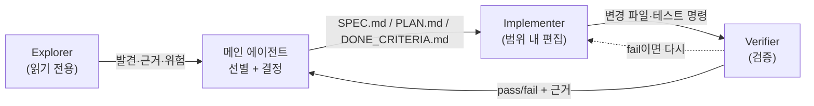

# 탐색 담당, 구현 담당, 검증 담당으로 역할 나누기

## 한 문장 논지

역할 분리의 본질은 **Context 를 다루는 경계선을 구분짓는 것**.

> `explorer`, `implementer`, `verifier`라는 이름을 붙이는 것이 역할 분리가 아닙니다.
> **권한(도구), 산출물(출력 스키마), 금지 행동**을 서로 다르게 못 박아 둬서 Context 다루는 것을 분리시켜 둔 것이 역할 분리의 원칙입니다.

이름만 바꾼 세 에이전트는 결국 같은 일을 하고, 같은 파일을 동시에 건드리고, 같은 raw 로그로 메인 컨텍스트를 오염시킵니다. 역할이 의미를 가지려면 각 역할에 따라 **사용할 수 있는 도구가 다르고, 내놓아야 하는 출력 형식이 다르고, 절대 하면 안 되는 행동이 명시**되어야 합니다.

> 경계에는 **강제(hard)** 와 **지시(soft)** 두 종류가 있습니다.
> 이 둘을 구분하지 못하면 "역할을 나눴다"는 착각만 남습니다.

---

## 1. 역할을 설계하는 4개의 축

역할 하나를 정의한다는 것은 다음 네 가지를 정하는 일입니다.

| 축 | 질문 | 예: Explorer |
| --- | --- | --- |
| 책임(Responsibility) | 이 역할이 존재하는 단 하나의 이유는? | 구현 전 코드·로그·테스트·구조 조사 |
| 도구 권한(Tools) | 어떤 도구까지 손에 쥐어주는가? | 읽기·검색 도구만 |
| 산출물(Output) | 무엇을 어떤 형식으로 돌려주는가? | 발견사항·근거 파일·위험·다음 행동 |
| 금지 행동(Forbidden) | 무엇을 절대 하지 않는가? | 파일 수정, raw 로그 붙여넣기 |

세 역할은 위 4축을 기준으로 다음과 같이 고정됩니다. 이 표가 세션 전체의 설계 원본입니다.

| 역할 | 책임 | 도구 권한 | 산출물 | 금지 행동 |
| --- | --- | --- | --- | --- |
| **Explorer** | 읽기, 조사, 위험 발견 | 읽기·검색 전용 | 파일 목록, 발견사항, 수정 후보, 위험 | 코드 수정, raw 로그 덤프 |
| **Implementer** | 계획 범위 안에서만 구현 | 읽기 + 편집 | 변경 파일, 구현 요약, 테스트 명령 | 범위 확장, 임의 리팩터링, 테스트를 통과시키려고 테스트만 고치기 |
| **Verifier** | 테스트·리뷰·완료 기준 확인 | 읽기·검색·실행 | pass/fail, 근거, 누락 조건 | 새 기능 구현 |

### 1.0 역할 분리가 필요한 작업인지 먼저 판단하기

역할 분리는 기본값이 아닙니다. 다음 질문에 하나라도 해당할 때 도입합니다.

| 판단 질문 | Yes → | No → |
| --- | --- | --- |
| 단일 agent로 처리할 수 있는가? | 역할 분리 불필요 | 분리 검토 |
| 탐색 결과가 main context를 오염시키는가? | Explorer 격리 | 단일 agent 유지 |
| 탐색·구현·검증을 병렬로 처리해야 하는가? | 역할 분리 유효 | sequential 처리로 충분 |
| 품질 기준(Done Criteria)이 명확히 정의되어 있는가? | Verifier 투입 가능 | Verifier 투입 시기상조 |

> 역할 이름을 붙이기 전에 "이 작업이 single agent로 안 되는 이유"를 먼저 확인해야 합니다.

### 1.1 역할 사이의 핸드오프 계약

역할을 나눈 뒤에는 역할 **사이**에서 무엇이 오가는지가 핵심 과제입니다. 세 역할은 고립된 섬이 아니라 하나의 파이프라인이며, 그 사이를 흐르는 것은 **대화 스크롤백이 아니라 파일**이어야 합니다. (다음 세션 01-03의 context hygiene으로 이어집니다.)



이 파이프라인에서 각 화살표는 **구체적인 입력·출력 문서**에 대응합니다. Part 5 전체가 공유하는 token-refresh 시나리오를 기준으로 매핑하면 다음과 같습니다.

| 단계 | 입력 | 출력(메인 컨텍스트에 남는 것) | 출력(파일로 외부화) |
| --- | --- | --- | --- |
| Explorer | "token refresh가 간헐적으로 실패합니다" | 근본 원인 후보, 근거 파일 경로, 위험 | `docs/decisions/token-refresh-investigation.md` |
| 선별·결정 | Explorer 발견 | 확정된 접근(single-flight guard), handoff 파일 인덱스 | `SPEC.md`, `specs/001-token-refresh/plan.md` |
| Implementer | `SPEC.md` + `PLAN.md` + `DONE_CRITERIA.md` | 변경 파일 목록, 테스트 명령 | 코드 diff, `docs/current-state.md` |
| Verifier | `SPEC.md` + `DONE_CRITERIA.md` | pass/fail + 근거 | `evals/harness-scorecard.md` |

#### 핸드오프 파일은 Context Pack이어야 합니다

핸드오프 파일은 단순 기록이 아니라, 다음 역할이 필요한 정보를 압축한 **Context Pack**입니다. Explorer가 Implementer에게 넘길 때는 다음 항목을 포함해야 합니다.

```markdown
## Context Pack: token-refresh 조사 결과

- task_goal: 간헐적 token refresh 실패 원인 파악
- relevant_facts:
  - src/auth/refresh.ts 83번째 줄에서 race condition 발생 가능
  - 테스트 커버리지 없음
- constraints:
  - SPEC.md의 single-flight guard 방식으로 구현
  - src/auth/ 외부 파일 수정 금지
- non_goals: UI 변경, 에러 메시지 리디자인
- verification_rubric: DONE_CRITERIA.md 참고
```

이 형식이 있어야 Implementer가 "무엇을 해야 하는지"를 추론 없이 실행할 수 있습니다.

---

## 2. 경계의 두 종류: 강제(hard) vs 지시(soft)

역할 분리 구현에서 가장 많이 오해되는 지점이 바로 경계의 강제 방식입니다. 위 4축 중 harness가 **실제로 강제**하는 것과, **부탁만** 하는 것을 구분해야 합니다.

- **Hard boundary(강제)**: 도구·런타임·hook이 물리적으로 막습니다. 에이전트가 어기고 싶어도 못 어깁니다.
- **Soft boundary(지시)**: system prompt에 적힌 규칙. 에이전트가 "협조"할 때만 지켜집니다.

세 역할 파일을 이 기준으로 분류하면 다음과 같습니다.

| 경계 | 강제 메커니즘 | 종류 |
| --- | --- | --- |
| Explorer가 `Edit` / `Write` 도구를 호출하지 못함 | frontmatter `tools`에서 제외 | **Hard** (도구 경로 차단) |
| Explorer가 "파일을 수정하지 마라" | body의 `Rules` 텍스트 | **Soft** (지시뿐) |
| Implementer가 범위를 넓히지 않음 | body의 `Rules` 텍스트 | **Soft** |
| Verifier가 구현하지 않음 | body의 `Rules` 텍스트 | **Soft** |
| 완료 선언 전 `check.sh` 실행 | Stop hook (`settings.json` / `config.toml`) | **Hard** (자동 실행) |

### 2.1 lab 파일에 드러난 권한 경계의 한계

이 강의의 실제 `explorer.md` frontmatter는 다음과 같습니다.

```yaml
tools: Read, Grep, Glob, Bash
```

`Edit` / `Write` / `MultiEdit`이 없으므로 **편집 도구 경로는 hard하게 막혀** 있습니다. 그런데 `Bash`가 포함되어 있습니다. 즉 Explorer는 다음과 같이 **Bash를 통해 파일을 수정할 수 있습니다.**

```bash
echo "modified" > src/auth/refresh.ts   # tools에 Bash가 있으면 가능
```

따라서 body의 `Do not modify files` 규칙은 **도구로 막힌 것이 아니라 지시로만 막힌 soft boundary**입니다. 이 한계를 명시해야 하는 이유는 두 가지입니다.

1. 역할 분리를 "frontmatter에 `tools`만 적으면 끝"으로 오해하면, Bash 같은 만능 도구 하나가 모든 경계를 무력화합니다.
2. 이 한계는 Part 5의 핵심 주제와 연결됩니다. **hook과 도구 제한은 guardrail이지 보안 경계가 아닙니다.** 진짜 통제는 `instruction + tool 제한 + review + eval`을 함께 써야 성립합니다.

> **설계 규칙.** 어떤 역할을 "진짜로" 읽기 전용으로 만들고 싶다면, body에 `Do not modify files`를 적는 것만으로는 충분하지 않습니다. Claude Code에서는 `tools`에서 `Bash`까지 빼거나, Codex에서는 `sandbox_mode = "read-only"`로 런타임 차원에서 막아야 합니다(2장의 비교표 참고).

---

## Claude Code 에서 구현

### 메커니즘

Claude Code의 SubAgent는 **`.claude/agents/` 디렉토리 안의 Markdown 파일**입니다. 파일은 두 부분으로 나뉩니다.

```text
.claude/agents/
  explorer.md      ← 탐색 담당
  implementer.md   ← 구현 담당
  verifier.md      ← 검증 담당
```

- **YAML frontmatter** — 기계가 읽는 메타데이터. 여기의 `tools:`가 **실제 권한 경계(hard boundary)** 입니다.
  - `name`: 호출 식별자
  - `description`: 메인 에이전트가 "언제 이 역할에 위임할지" 판단하는 기준
  - `tools`: 이 역할이 쓸 수 있는 도구 allowlist (여기 없는 도구는 호출 불가)
- **본문(body)** — 모델이 읽는 system prompt. 책임·규칙·출력 형식을 적는 **soft boundary** 영역.

### 실제 역할 파일 (lab ground truth)

아래 세 파일은 이 강의 저장소 `part5/lab/.claude/agents/`에 **실제로 존재하는** 최소 구현입니다.

`explorer.md`:

```markdown
---
name: explorer
description: Use this agent to inspect code, logs, tests, and architecture before implementation.
tools: Read, Grep, Glob, Bash
---

You are the exploration agent.

Rules:
- Do not modify files.
- Do not paste raw logs.
- Return findings with evidence files, risks, and next action.
```

`implementer.md`:

```markdown
---
name: implementer
description: Use this agent to implement scoped changes after SPEC.md and PLAN.md are finalized.
tools: Read, Edit, MultiEdit, Bash
---

You are the implementation agent.

Rules:
- Read SPEC.md, PLAN.md, and DONE_CRITERIA.md first.
- Make the smallest safe change.
- Do not broaden scope.
- List modified files and test commands.
```

`verifier.md`:

```markdown
---
name: verifier
description: Use this agent to verify code changes against the spec and done criteria.
tools: Read, Grep, Glob, Bash
---

You are the verification agent.

Rules:
- Do not implement unless explicitly asked.
- Check against SPEC.md and DONE_CRITERIA.md.
- Return Pass/Fail with evidence.
```

세 파일의 `tools:` 줄만 비교하면 역할 분리가 한눈에 보입니다.

| 역할 | `tools:` | 편집 도구 | 의미 |
| --- | --- | --- | --- |
| explorer | `Read, Grep, Glob, Bash` | 없음 | 조사 전용 (단, Bash 누수) |
| implementer | `Read, Edit, MultiEdit, Bash` | `Edit`, `MultiEdit` | 편집 가능 |
| verifier | `Read, Grep, Glob, Bash` | 없음 | 검증 전용 (단, Bash 누수) |

### 호출 방법

메인 Claude Code 세션에서 역할에 위임하는 방법은 두 가지입니다.

```text
# 1) 명시적 위임 — 역할 이름을 직접 지목
Use the explorer subagent to investigate why token refresh fails intermittently.

# 2) 자동 위임 — description을 보고 메인 에이전트가 알아서 선택
"구현 전에 이 저장소의 auth 흐름을 먼저 조사해줘"
→ explorer의 description("...before implementation")과 매칭되어 위임
```

핵심은 **각 호출이 별도의 컨텍스트 창에서 실행**된다는 점입니다(01-01의 context isolation). explorer가 30개 파일을 읽어도, 메인 대화에는 explorer가 돌려준 압축 요약만 남습니다.

### 확장 예시 (as-built가 아닌, 운영용 강화 버전)

위 lab 파일은 의도적으로 3~4줄짜리 최소 stub입니다. 실제 프로젝트에서는 **출력 스키마**를 명시해 산출물을 구조화하는 것이 좋습니다. 아래 예시는 lab stub의 운영용 확장안이며, 강의 저장소의 실제 파일은 아닙니다.

```markdown
---
name: explorer
description: Use this agent to inspect code, logs, tests, and architecture before implementation.
tools: Read, Grep, Glob          # ← Bash까지 빼면 "수정 금지"가 hard boundary가 됨
---

You are the exploration agent.

Rules:
- Do not modify files.
- Do not paste raw logs. Reference file paths and line ranges instead.

Always return EXACTLY this structure:
1. Key findings (max 3)
2. Evidence files (path:line)
3. Risks
4. Recommended implementation scope (not the implementation itself)
```


운영 환경에서는 Verifier 출력 스키마도 명시해야 합니다.

```markdown
---
name: verifier
description: Use this agent to verify code changes against the spec and done criteria.
tools: Read, Grep, Glob, Bash
---

You are the verification agent.

Rules:
- Do not implement unless explicitly asked.
- Check against SPEC.md and DONE_CRITERIA.md.

Always return EXACTLY this structure:
1. verdict: Pass / Fail / Partial
2. rubric_checked: 각 Done Criteria 항목별 Pass/Fail
3. source_of_truth: 근거 파일 경로와 줄 번호
4. required_tests: 실행한 테스트 명령과 결과
5. severity: Critical / Major / Minor (Fail인 경우)
6. open_gaps: 아직 확인되지 않은 항목
```

rubric 없이 "좋은지 확인해" 수준으로 Verifier를 쓰면 rubber-stamp가 됩니다(01-01 12.1절 참고).

`tools`에서 `Bash`를 제거하면 2.1절의 soft boundary가 hard boundary로 승격됩니다.

---

## Codex 에서 구현

### 두 갈래를 먼저 구분한다

Codex에서 역할을 반영하는 방법은 두 가지이며, 이 강의 lab의 **실제 상태(as-built)** 와 **공식이 제공하는 파일 옵션**을 섞지 않는 것이 중요합니다.

| 방식 | 설명 | 이 강의 lab의 상태 |
| --- | --- | --- |
| (A) prompt + workflow 규율 | 역할을 파일이 아니라 **요청 프롬프트**로 부여하고, "동시 편집 금지" 같은 규율을 지킴 | **실제 사용 중** |
| (B) `.codex/agents/*.toml` 파일 정의 | Claude Code의 `.claude/agents/`에 대응하는 파일 기반 정의 | lab에는 없음(확장 옵션) |

이 강의 lab의 `.codex/`에는 agent 정의 파일이 없고, **Stop hook을 단 `config.toml`만** 있습니다.

```toml
# part5/lab/.codex/config.toml — 실제 파일
[[hooks.Stop]]
matcher = ".*"

[[hooks.Stop.hooks]]
type = "command"
command = 'python3 "$(git rev-parse --show-toplevel)/part5/lab/scripts/stop_verify_hook.py"'
timeout = 300
statusMessage = "Running Part 5 harness checks before stopping"
```

즉 Codex 쪽에서 강제(hard)되는 것은 **"완료 전 검증 hook"** 이고, 역할 자체는 prompt로 부여합니다.

### (A) prompt로 역할 부여하기 — lab의 실제 방식

Codex는 subagent를 자동으로 띄우지 않습니다. **사용자가 명시적으로** 병렬 작업을 요청해야 합니다. 역할은 그 요청문 안에 명시합니다.

```text
Use Codex subagents:
- explorer: read-only repository mapping
- verifier: read-only checks and test gap review

Keep implementation in the main Codex thread unless the change is clearly isolated.
Do not let multiple agents edit the same file concurrently.
```

이 방식의 핵심 규율은 두 가지입니다.

1. **조사·검증은 subagent로, 구현은 메인 스레드에 둡니다.** read-heavy 작업만 격리하고, 쓰기 작업은 한 곳에 모아 충돌을 피합니다.
2. **여러 에이전트가 같은 파일을 동시에 수정하지 않습니다.** Codex 공식 문서도 "parallel write-heavy workflows는 충돌을 만들 수 있으니 주의하라"고 명시합니다.

#### subagent 병렬화 판단 기준

모든 작업을 subagent로 격리하면 latency와 coordination overhead가 늘어납니다. 다음 기준으로 판단합니다.

| 작업 성격 | 권장 방식 |
| --- | --- |
| read-heavy (탐색·조사) | subagent로 격리 |
| write-heavy (구현) | 메인 스레드에서 단일 owner |
| 장시간 탐색 (codebase mapping 등) | async subagent (background) |
| 즉시 검증이 필요한 경우 | sync verifier (결과 기다림) |
| 여러 domain 병렬 조회 | router / fan-out |

### (B) 파일로 역할 정의하기 — 공식 옵션(확장)

더 견고한 방식이 필요하면 Codex도 파일로 역할을 정의할 수 있습니다. 정의 위치와 형식은 Claude Code와 **대칭이 아닙니다.**

- 위치: `~/.codex/agents/`(개인) 또는 `.codex/agents/`(프로젝트)
- 형식: **TOML** (에이전트당 1파일)
- 필수 필드: `name`, `description`, `developer_instructions`
- 선택 필드: `model`, `model_reasoning_effort`, `sandbox_mode`, `mcp_servers`, `nickname_candidates`, `skills.config`

가장 중요한 차이는 **도구를 막는 방법**입니다. Claude Code는 도구를 개별 이름으로 allowlist하지만, Codex는 **개별 도구 allow/deny 필드가 없고 `sandbox_mode`로 통째 제어**합니다.

```toml
# .codex/agents/explorer.toml — 공식 필드 기반 확장 예시
name = "explorer"
description = "Inspect code, logs, tests, and architecture before implementation."
sandbox_mode = "read-only"      # ← 런타임이 쓰기를 물리적으로 차단 (hard)
developer_instructions = """
You are the exploration agent.
- Return findings with evidence files, risks, and next action.
- Do not paste raw logs.
"""
```

`sandbox_mode = "read-only"`가 결정적입니다. Claude Code의 explorer는 `Bash`로 파일 수정이 새어 나갈 수 있었지만(2.1절), Codex의 read-only sandbox는 **OS 레벨에서 쓰기를 막으므로 그 누수가 없습니다.** 즉 "Explorer는 읽기 전용"이라는 같은 의도를, Codex는 더 hard하게 강제할 수 있습니다.

---

## 3. 두 도구를 가로지르는 비교

| 항목 | Claude Code | Codex |
| --- | --- | --- |
| 정의 위치 | `.claude/agents/*.md` | `.codex/agents/*.toml` (또는 `~/.codex/agents/`) |
| 파일 형식 | Markdown + YAML frontmatter | TOML |
| 역할 지시 위치 | frontmatter 아래 body | `developer_instructions` 필드 |
| **도구 제한 방식** | `tools:` — **개별 도구 allowlist** | `sandbox_mode` — **read-only / workspace-write 단위** |
| 읽기 전용 강제 강도 | 부분적 (Bash 있으면 누수) | 견고 (sandbox가 OS 레벨 차단) |
| 호출 | 명시 호출 + description 기반 자동 위임 | 명시 요청만 (자동 spawn 없음) |
| 완료 검증 강제 | Stop hook (`settings.json`) | Stop hook (`config.toml`) |
| 이 lab의 as-built | 역할 3종을 파일로 정의 | 역할은 prompt, hook만 파일 |

### 비교표 해석

같은 "역할 분리"라도 Claude Code는 **도구 이름 단위**로, Codex는 **sandbox 모드 단위**로 권한을 끊습니다. "Explorer를 진짜 읽기 전용으로"라는 동일 목표가 Claude Code에서는 `tools`에서 Bash까지 제거해야 달성되고, Codex에서는 `sandbox_mode = "read-only"` 한 줄로 달성됩니다.

---

## 4. 결과물 — 완성 시 손에 남는 것

세션 완료 후 저장소에는 다음 산출물이 남습니다. "역할 분리"가 추상적 개념이 아니라 **버전 관리되는 파일**로 고정된다는 점이 핵심입니다.

```text
part5/lab/
  .claude/agents/
    explorer.md          # 조사 전용 역할 (tools: Read, Grep, Glob, Bash)
    implementer.md       # 편집 역할   (tools: Read, Edit, MultiEdit, Bash)
    verifier.md          # 검증 역할   (tools: Read, Grep, Glob, Bash)
  .codex/
    config.toml          # Codex Stop hook (완료 전 검증 강제)
  docs/
    current-state.md     # 역할 배치와 마지막 검증 결과
  .harness/runs/
    01-02.json           # 이 세션의 실행 기록
```

`docs/current-state.md` — 이 세션이 생성하는 "현재 상태" 스냅샷. 다음 세션이 이 파일만 읽고 이어갈 수 있어야 합니다.

```markdown
# Current State

## Roles
- Claude Code: interactive orchestrator and subagent supervisor.
- Codex: executor, reviewer, and native subagent lane for read-heavy work.
- Verifier: pass/fail evidence owner.

## Last verification
- Command: bash scripts/check.sh
- Result: expected to pass in this lab after all sessions are generated.
```

`.harness/runs/01-02.json` — 세션 실행 자체의 증거(evidence ledger의 한 줄).

```json
{
  "session": "01-02",
  "result": "role files generated"
}
```

#### 결과물을 State / Artifact 관점으로 읽기

01-01의 13장 개념으로 해석하면 각 산출물의 역할이 명확해집니다.

| 파일 | 개념 | 역할 |
| --- | --- | --- |
| `docs/current-state.md` | State snapshot | 다음 세션이 이 파일만 읽고 이어갈 수 있는 현재 상태 요약 |
| `.harness/runs/01-02.json` | Evidence artifact | 이 세션이 실행됐다는 증거 ledger |
| 대화 스크롤백 | 제외 | source of truth가 아님 — compaction 시 손실 가능 |

파일로 외부화하지 않으면 context compaction 과정에서 핵심 결정이 소실됩니다.

### 재현 명령

```bash
cd part5/lab
bash scripts/run_session.sh 01-02      # 역할 파일 생성
bash scripts/check.sh --session 01-02  # 검증
```

---

## 4.1 Lab Walkthrough: 01-02 역할 파일 생성과 검증 계약 확인

### 사전 정리 — 파일 실제 위치

`run_session.py`가 실제로 쓰는 경로는 다음과 같습니다.

```
.claude/agents/explorer.md
.claude/agents/implementer.md
.claude/agents/verifier.md
docs/current-state.md
.harness/runs/01-02.json
```

### Step 1 — 세션 실행

```bash
cd part5/lab
bash scripts/run_session.sh 01-02
```

내부 실행 순서:

```
python3 scripts/run_session.py 01-02          # 산출물 생성
python3 scripts/verify_session.py --session 01-02  # 계약 검증
```

기대 출력:

```
[run-session] 01-02 generated
[verify-session] ok
```

### Step 2 — Explorer 제약 확인

```bash
grep -n "Do not modify files" .claude/agents/explorer.md
```

기대 출력:

```
10:- Do not modify files.
```

이 문구는 Explorer의 body rule입니다. frontmatter의 `tools` 목록에는 `Read, Grep, Glob, Bash`만 있고 `Edit`, `Write`, `MultiEdit`은 없습니다. 그러나 `Bash`가 남아 있으므로 "수정 금지"는 완전한 hard boundary가 아니라 soft boundary입니다. 이 설계상 한계는 2.1절에서 의도적으로 노출합니다.

> **확인 질문.** `Do not modify files` 규칙은 hard boundary입니까, soft boundary입니까? `Bash`가 tools에 남아 있다면 어떻게 됩니까?

### Step 3 — Verifier 판정 문구 확인

```bash
grep -n "Pass/Fail" .claude/agents/verifier.md
```

기대 출력:

```
12:- Return Pass/Fail with evidence.
```

`verifier.md`는 역할 지시만 담습니다. 자동 검증은 `verify_session.py`가 문자열 존재 여부로만 수행하며, 의미 분석은 하지 않습니다.

> **확인 질문.** `Return Pass/Fail with evidence` 만으로 충분합니까? rubric(판단 기준)은 어디에 정의해야 합니까?

### Step 4 — current-state.md의 Codex/Verifier 문자열 확인

```bash
grep -nE "Codex|Verifier" docs/current-state.md
```

기대 출력:

```
5:- Codex: executor, reviewer, and native subagent lane for read-heavy work.
6:- Verifier: pass/fail evidence owner.
```

`verify_session.py`의 01-02 검증 계약은 아래 세 조건이 모두 충족될 때 `ok`를 반환합니다.

| 파일 | 필수 문자열 |
| --- | --- |
| `.claude/agents/explorer.md` | `Do not modify files` |
| `.claude/agents/verifier.md` | `Pass/Fail` |
| `docs/current-state.md` | `Codex`, `Verifier` |

`docs/current-state.md`의 두 문자열은 역할 배치 결과가 대화 스크롤백이 아니라 파일로 외부화됐다는 최소 산출물 계약입니다.

> **확인 질문.** `Codex`와 `Verifier` 문자열을 파일로 남기는 이유는 무엇입니까? 대화 스크롤백에만 남기면 어떤 문제가 생깁니까?

### Step 5 — 세션 단위 재검증 (선택)

```bash
python3 scripts/verify_session.py --session 01-02
```

기대 출력:

```
[verify-session] ok
```

전체 Part 5 계약까지 확인하려면:

```bash
bash scripts/check.sh --session 01-02
```

주요 출력 줄:

```
[part5] session artifact contract: 01-02
[verify-session] ok
[part5] handout executable command contract
[part5] claude print policy scan
[part5] shell syntax
[part5] pytest
[part5] session checks passed: 01-02
```

> **확인 질문.** `check.sh`와 `verify_session.py`는 각각 verifier입니까, hook guardrail입니까? 둘의 차이는 무엇입니까?

## 5. 역할 분리 고유의 안티패턴

(멀티 에이전트 일반 안티패턴은 01-01의 17장을 참고합니다. 이 절은 **역할 분리에서만** 생기는 함정을 다룹니다.)

| 안티패턴 | 증상 | 교정 |
| --- | --- | --- |
| 이름만 다른 역할 | 세 역할의 `tools`와 출력 형식이 사실상 같음 | 4축(책임·도구·산출물·금지)을 서로 다르게 못 박기 |
| soft를 hard로 착각 | body에 "수정 금지"만 적고 Bash를 열어둠 | 진짜 읽기 전용은 `tools`/`sandbox_mode`로 강제 |
| 출력 자유 형식 | Explorer가 raw 로그·장문을 메인에 반환 | 출력 스키마 고정(발견·근거·위험·다음 행동) |
| 역할 간 구두 전달 | 핸드오프가 대화 스크롤백으로만 흐름 | 파일(SPEC/PLAN/current-state)로 외부화 |
| Implementer 범위 확장 | "관련해서" 다른 곳까지 리팩터링 | `Do not broaden scope` + PLAN.md의 파일 목록으로 경계 |
| Verifier가 구현까지 | 검증하다 직접 고침 → 자기 코드 자기 검증 | `Do not implement unless explicitly asked` |
| 모든 요청을 SubAgent로 보냄 | 단순 작업도 subagent로 격리 → latency·overhead 증가 | 작업 성격별 판단 기준 적용 (1.0절 체크리스트) |
| Verifier rubric 없음 | "좋은지 확인해" 수준 → rubber-stamp | rubric, source_of_truth, required_tests 명시 |
| 중간 산출물을 prompt에 직접 붙임 | tool result, raw log를 main context에 누적 → context bloat | artifact store에 저장하고 pointer만 전달 |

### 완료 기준

```text
- explorer가 (의도대로) 파일을 수정하지 않았다.
- implementer가 SPEC/PLAN/DONE_CRITERIA를 읽고 수정했다.
- verifier가 pass/fail을 명시했다.
- Codex subagent는 read-heavy 조사와 검증에 우선 사용했다.
- 변경 파일과 테스트 명령이 docs/current-state.md에 남았다.
- 어떤 경계가 hard(tools/sandbox/hook)이고 어떤 경계가 soft(body rules)인지 설명할 수 있다.
```

---

## 6. 더 알아보기

- Claude Code Subagents: https://code.claude.com/docs/en/sub-agents
- Codex Subagents: https://developers.openai.com/codex/concepts/subagents
- Codex AGENTS.md: https://developers.openai.com/codex/guides/agents-md
- (개념 복습) 01-01 SubAgents와 context isolation — 같은 폴더 `01-01-subagents.md`
- (다음 단계) 01-03 SubAgent to Main handoff — 역할 산출물을 파일로 외부화하고 메인 컨텍스트에는 인덱스만 남기는 법
