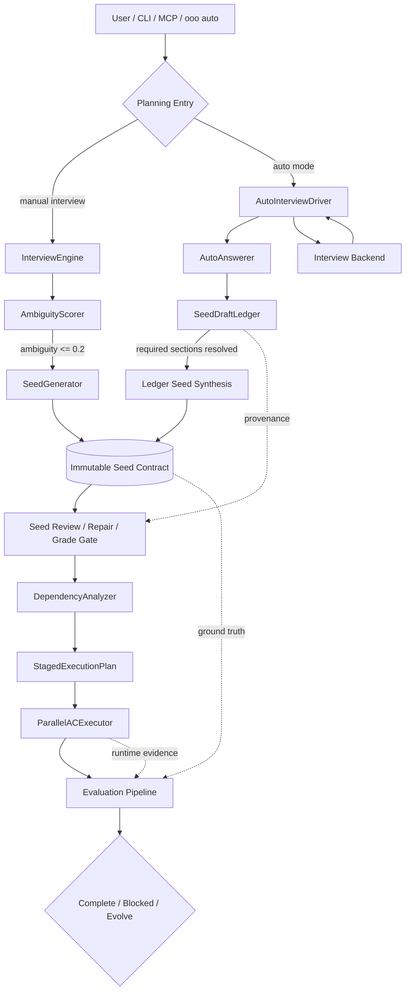
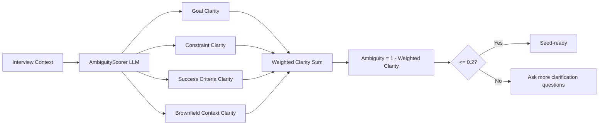
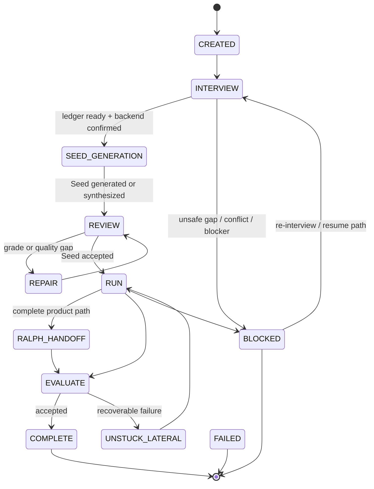
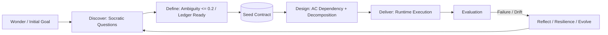
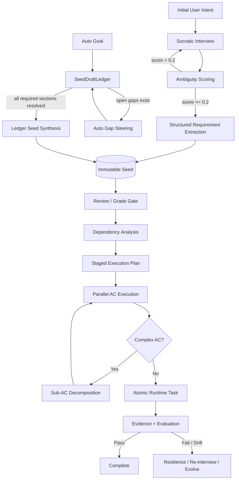

# Ouroboros “작업 계획 수립” 로직

## 1. 핵심 결론

Ouroboros에서 “작업 계획을 세우는 과정”은 일반적인 `Planner` 클래스 하나가 할 일을 분해하는 방식이 아닙니다. 이 프로젝트의 계획 수립은 **요구사항을 명확화하고, 이를 변경 불가능한 실행 계약인 Seed로 고정한 뒤, Acceptance Criteria를 의존성·원자성·증거 기반 실행 단위로 변환하는 전 과정**입니다. README도 이 프로젝트를 “ad-hoc prompting”을 대체하는 “specification-first workflow”로 설명하며, 흐름을 `interview → crystallize → execute → evaluate → evolve`로 제시합니다. 

핵심은 다음 네 가지입니다.

1. **계획의 시작은 질문이다.**
   사용자의 애매한 요청을 바로 실행하지 않고 Socratic interview로 목표, 제약, 성공 기준, 비목표, 검증 방법을 좁힙니다. 프로젝트 문서는 “AI coding 실패는 출력보다 입력의 불명확성에서 온다”고 보고, vague prompt를 Socratic interview로, no spec 문제를 immutable Seed로, manual QA 문제를 automated evaluation gate로 해결한다고 설명합니다. 

2. **계획의 중심 산출물은 Seed다.**
   Seed는 goal, constraints, acceptance criteria, ontology, evaluation principles, exit conditions를 담는 **불변 실행 헌법**입니다. 코드상 `Seed`는 frozen Pydantic model이며, goal/constraints/acceptance_criteria는 workflow의 ground truth로 평가에 사용됩니다.  

3. **자동 모드에서는 Ledger가 Seed 이전의 계획 초안 역할을 한다.**
   `ooo auto` 흐름에서는 `SeedDraftLedger`가 goal, actors, inputs, outputs, constraints, non_goals, acceptance_criteria, verification_plan, failure_modes, runtime_context 같은 필수 섹션을 채웁니다. Ledger는 외부 I/O나 모델 호출 없이 동작하도록 설계되어, 반복 루프 안에서도 안전하게 수정될 수 있습니다.  

4. **실행 계획은 Seed 이후에도 다시 만들어진다.**
   Seed의 Acceptance Criteria는 dependency analysis, staged execution planning, recursive decomposition, parallel batch execution, evidence verification을 거치며 실제 실행 가능한 계획으로 재구성됩니다. `DependencyAnalyzer`는 AC 간 의존성을 구조적 신호와 LLM pass로 분석하고, `ParallelACExecutor`는 staged plan에 따라 실행합니다.  

---

## 2. 전체 아키텍처 관점

Ouroboros는 문서상 “specification-first AI workflow engine”입니다. 즉, 막연한 아이디어를 실행 전에 검증 가능한 사양으로 바꾼 뒤 event sourcing과 TUI를 통해 요구사항부터 평가까지의 생명주기를 관리합니다. 

프로젝트는 OS 관점으로 자기 구조를 설명합니다. `ouroboros` 저장소는 Agent OS core로서 Seed, Ledger, Runtime, MCP, safety boundaries를 담당하고, 모든 action을 Seed-bound, ledger-recorded, replayable event로 만든다는 계약을 가집니다.  



이 다이어그램에서 중요한 점은 **계획이 한 번만 만들어지는 것이 아니라 단계별로 점점 구체화된다는 것**입니다.

| 단계                  | 계획 산출물                                   | 역할                  |
| ------------------- | ---------------------------------------- | ------------------- |
| Interview           | `InterviewState`, Q/A rounds             | 사용자의 의도를 명확화        |
| Ambiguity scoring   | `AmbiguityScore`, breakdown              | Seed 생성 가능 여부 판단    |
| Auto mode           | `SeedDraftLedger`                        | 자동 답변과 근거를 구조화      |
| Seed generation     | `Seed`                                   | 불변 실행 계약 생성         |
| Dependency analysis | `DependencyGraph`, `StagedExecutionPlan` | AC 실행 순서와 병렬 가능성 결정 |
| Runtime execution   | `ACExecutionResult`, evidence            | 계획이 실제로 충족되었는지 검증   |

---

## 3. Phase 관점의 계획 수립 흐름

Architecture 문서는 전체 파이프라인을 다음처럼 설명합니다.

```text
Phase 0: Big Bang       -> requirements를 Seed로 결정화
Phase 1: PAL Router     -> 적절한 모델 tier 선택
Phase 2: Double Diamond -> task decomposition 및 execution
Phase 3: Resilience     -> stagnation 처리
Phase 4: Evaluation     -> 3-stage verification
Phase 5: Secondary Loop -> deferred TODO 처리
```

문서에는 이 단계가 명시되어 있으며, Phase 0은 Big Bang, Phase 1은 PAL Router, Phase 2는 Double Diamond, Phase 3은 Resilience, Phase 4는 Evaluation, Phase 5는 Secondary Loop로 정의됩니다. 

계획 수립의 본질은 Phase 0과 Phase 2에 특히 집중됩니다. Phase 0에서는 애매한 요구를 질문을 통해 Seed로 만들고, Phase 2에서는 Seed의 Acceptance Criteria를 실제 실행 단위로 쪼개고 순서를 정합니다. Phase 0 문서는 Big Bang이 vague idea를 crystallized specification으로 바꾸며, ambiguity score가 0.2 이하일 때 Seed가 생성된다고 설명합니다. 

---

## 4. Manual Interview 기반 계획 수립

### 4.1 InterviewEngine의 역할

`bigbang/interview.py`는 “vague ideas”를 반복 질문으로 clear requirements로 정제하는 interview protocol을 구현합니다. 주석상으로도 이 모듈은 사용자가 언제 멈출지 통제하는 구조라고 되어 있습니다. 

`InterviewEngine`은 다음 네 가지 책임을 가집니다.

* 현재 맥락과 ambiguity를 기반으로 질문 생성
* 사용자 응답 수집
* session state 지속 저장
* round 진행 추적

이 책임은 코드의 class docstring에 직접 명시되어 있습니다. 

### 4.2 질문 생성의 정책

Interview 질문은 “도구를 쓰지 않는 질문자” 역할로 제한됩니다. 시스템 프롬프트는 정확히 하나의 Socratic question을 만들고, 파일·명령·저장소·API·외부 시스템을 탐색하지 않으며, 가장 큰 미해결 결정을 겨냥하라고 지시합니다. 또한 scope, non-goal, success criteria, ownership, risk, verification 질문을 선호하도록 되어 있습니다. 

내부적으로는 질문의 관점을 다변화하기 위해 `InterviewPerspective`가 정의되어 있습니다. 여기에는 researcher, simplifier, architect, breadth-keeper, seed-closer가 포함됩니다. 

즉, 이 프로젝트의 계획 수립은 단순한 “할 일 목록 작성”이 아니라 다음 질문들을 통해 계획의 기준을 먼저 세우는 방식입니다.

```text
무엇을 만들 것인가?
무엇을 만들지 않을 것인가?
성공은 무엇으로 판단할 것인가?
기존 코드베이스가 있다면 어떤 맥락을 보존해야 하는가?
어떤 실패 모드를 배제해야 하는가?
어떤 검증 결과가 있어야 완료라고 볼 수 있는가?
```

### 4.3 상태 저장과 재개 가능성

`InterviewState`는 interview_id, status, rounds, initial_context, brownfield 여부, codebase context, ambiguity score, ambiguity breakdown, completion candidate streak 등을 보관합니다. 

`start_interview()`는 initial context를 검증하고, interview_id를 생성하며, cwd가 주어진 경우 brownfield project를 감지하고, 즉시 state를 저장합니다. 코드 주석은 첫 질문 생성 실패 같은 downstream failure가 발생해도 resumable handle이 남아야 하므로, freshly-created state를 즉시 persist한다고 설명합니다. 

`record_response()`는 응답을 검증하고, completed interview가 다시 열릴 경우 이전 ambiguity snapshot과 completion streak를 무효화합니다. 이는 이미 닫힌 인터뷰에 새 답변이 들어오면 기존 closure decision을 더 이상 신뢰할 수 없기 때문입니다. 

중요한 구현상 차이가 하나 있습니다. 문서에는 Phase 0에서 “up to MAX_INTERVIEW_ROUNDS”라고 되어 있지만, 실제 interview code는 `DEFAULT_INTERVIEW_ROUNDS`를 “reference value for prompts, not enforced”로 두고, `InterviewRound.round_number`도 no upper limit이며 user가 결정한다고 정의합니다.   

---

## 5. Ambiguity Score: 계획 수립의 수학적 Gate

Ouroboros는 “감으로 충분히 명확하다”고 판단하지 않습니다. 명확도를 점수화하고, 이 점수가 충분히 낮을 때만 Seed를 만들 수 있습니다.

README는 ambiguity를 다음 식으로 설명합니다.

```text
Ambiguity = 1 - Sum(clarity_i * weight_i)
```

Greenfield 기준의 weight는 Goal Clarity 40%, Constraint Clarity 30%, Success Criteria 30%이며, Brownfield에서는 Context Clarity 15%가 추가되고 각 weight가 조정됩니다. Seed 생성 threshold는 `ambiguity <= 0.2`입니다.  

코드에서도 `AMBIGUITY_THRESHOLD = 0.2`로 정의되어 있고, scoring temperature는 reproducible scoring을 위해 0.1입니다. 또한 자동 완료에는 단순 전체 점수뿐 아니라 goal, constraint, success criteria, brownfield context의 개별 floor가 있습니다. 



`AmbiguityScore.is_ready_for_seed`는 `overall_score <= AMBIGUITY_THRESHOLD`일 때 true를 반환합니다. 

다만 자동 완료 품질을 더 높이기 위해 `qualifies_for_seed_completion()`은 ambiguity threshold뿐 아니라 component floor까지 만족해야 true를 반환합니다. 즉, 전체 평균이 좋아도 핵심 축 하나가 너무 약하면 자동 완료는 막힐 수 있습니다. 

---

## 6. SeedGenerator: 인터뷰를 실행 계약으로 변환

`SeedGenerator`는 `InterviewState`를 immutable Seed로 변환합니다. 모듈 docstring은 이 과정이 ambiguity score gate, LLM 기반 structured requirements extraction, metadata 생성, YAML 저장을 포함한다고 설명합니다. 

Seed 생성은 두 가지 경로를 가집니다.

1. **Gen 1**: interview에서 직접 추출하며 ambiguity gate 적용
2. **Gen 2+**: Reflect output을 이용해 refined AC와 ontology mutation을 반영하며 ambiguity gate를 건너뜀

또한 `force=True`일 때 ambiguity threshold는 우회하지만, 실제 ambiguity score는 metadata에 기록됩니다. 

기본 경로에서는 ambiguity가 threshold를 넘으면 `ValidationError`를 반환하고 Seed를 생성하지 않습니다. 

Seed 추출 프롬프트는 다음 구조화된 필드를 요구합니다.

```text
GOAL
CONSTRAINTS
ACCEPTANCE_CRITERIA
ONTOLOGY_NAME
ONTOLOGY_DESCRIPTION
ONTOLOGY_FIELDS
EVALUATION_PRINCIPLES
EXIT_CONDITIONS
PROJECT_TYPE
```

이 형식은 `_build_extraction_user_prompt()`에 명시되어 있습니다. 

Seed 자체는 다음을 담습니다.

* `goal`
* `task_type`
* `brownfield_context`
* `constraints`
* `acceptance_criteria`
* `ontology_schema`
* `evaluation_principles`
* `exit_conditions`
* `metadata`

이 구조는 `Seed` 모델의 필드 정의에서 확인됩니다. 

### Seed의 의미

Seed는 “계획서”라기보다 **실행과 평가의 헌법**입니다. 실행자는 Seed의 goal과 acceptance criteria를 받아 작업하고, 평가자는 동일 Seed를 기준으로 성공 여부를 판단합니다. 이 때문에 Seed는 변경 불가능해야 합니다. 만약 실행 중 요구사항을 임의로 바꾸면 “작업 완료”가 아니라 “기준 완화 후 성공 선언”이 될 수 있기 때문입니다.

---

## 7. Auto Mode: SeedDraftLedger 기반 계획 수립

Manual interview가 사용자 응답을 기반으로 Seed를 만든다면, `ooo auto`는 자동 응답 정책과 Ledger를 통해 Seed를 만듭니다.

### 7.1 AutoPipeline 상태기계

`AutoPhase`는 auto pipeline의 단계 집합입니다. 주요 phase는 `CREATED`, `INTERVIEW`, `SEED_GENERATION`, `REVIEW`, `REPAIR`, `RUN`, `RALPH_HANDOFF`, `EVALUATE`, `UNSTUCK_LATERAL`, `COMPLETE`, `BLOCKED`, `FAILED`입니다. 



중요한 설계 결정은 자동으로 Seed를 다시 써서 성공 기준을 낮추는 phase를 의도적으로 넣지 않았다는 점입니다. 코드 주석은 `SEED_REGENERATE` 같은 자동 AC rewrite가 reward-hacking surface이며, 사용자가 동의한 spec을 조용히 downgrade한 뒤 성공을 선언할 위험이 있다고 설명합니다. 따라서 자동 수정을 하지 않고 BLOCKED 상태에서 re-interview 또는 abandon 같은 선택을 드러내는 쪽을 택합니다. 

### 7.2 SeedDraftLedger의 구조

`SeedDraftLedger`는 auto mode의 계획 초안입니다. 필수 섹션은 다음과 같습니다.

```text
goal
actors
inputs
outputs
constraints
non_goals
acceptance_criteria
verification_plan
failure_modes
runtime_context
```

이 필수 섹션들은 `REQUIRED_SECTIONS`에 정의되어 있습니다. 

Ledger entry는 key, value, source, confidence, status, reversible, rationale, evidence를 가집니다. 즉, “무엇을 계획했는가”뿐 아니라 “어디서 나온 정보인가”, “얼마나 신뢰할 수 있는가”, “증거가 무엇인가”를 함께 저장합니다. 

Source는 `USER_GOAL`, `REPO_FACT`, `EXISTING_CONVENTION`, `USER_PREFERENCE`, `CONSERVATIVE_DEFAULT`, `ASSUMPTION`, `NON_GOAL`, `INFERENCE`, `AUTO_FILL_INFERENCE`, `BLOCKER` 등으로 나뉩니다. 

Status는 `MISSING`, `WEAK`, `DEFAULTED`, `INFERRED`, `CONFIRMED`, `CONFLICTING`, `BLOCKED`로 정의됩니다. 

### 7.3 충돌 해결 정책

Ledger는 같은 key에 서로 다른 값이 들어올 때 모델 판단에 맡기지 않고 deterministic policy로 처리합니다. Source priority가 먼저이고, 같은 priority에서는 confidence가 높은 쪽이 이기며, 완전히 동률이면 conflicting으로 남깁니다. 

`resolve_conflict()`도 같은 정책을 따릅니다. 값이 같으면 same value, incoming이 blocker면 blocked, source priority와 confidence를 비교하고, 최종 동률이면 conflicting입니다. 

이 구조는 계획 수립에서 매우 중요합니다. Auto mode는 사람의 직접 답변 없이 진행될 수 있기 때문에, “모델이 말한 그럴듯한 내용”과 “사용자·repo·기존 convention에서 온 사실”을 분리해야 합니다. 코드 주석도 inference entry는 evidence-backed가 아니며 speculative content로 취급되어야 한다고 명시합니다. 

### 7.4 Ledger readiness

`open_gaps()`는 required section 중 `MISSING`, `WEAK`, `CONFLICTING`, `BLOCKED` 상태인 섹션을 반환합니다. `is_seed_ready()`는 open gap이 없을 때만 true입니다. 

즉, auto mode의 Seed-ready 조건은 “LLM이 완료라고 말했다”가 아니라, **필수 계획 섹션이 모두 resolved 상태인지**입니다.

---

## 8. AutoInterviewDriver와 AutoAnswerer의 계획 생성 루프

`AutoInterviewDriver`는 backend interview를 conservative auto answer로 구동합니다. docstring은 backend가 스스로 종료한다고 믿지 않고, 모든 backend call을 timeout-bound로 감싸며, loop를 `max_rounds`로 제한한다고 설명합니다. 

### 8.1 Backend closure를 그대로 믿지 않음

핵심 invariant가 있습니다.

> backend가 `seed_ready` 또는 `completed`라고 보고하더라도 Ledger에 open gap이 있으면 backend-only closure를 거부한다.

코드 주석은 이를 “premature-closure invariant”라고 설명하며, backend가 완료를 보고했지만 ledger에 required gap이 있으면 다음 답변을 그 gap을 채우도록 유도한다고 되어 있습니다. 

반대로 ledger가 ready이고 backend도 확인했을 때만 `mutual_agreement` closure로 닫힙니다. 

### 8.2 Gap steering

backend가 완료라고 했는데 ledger가 아직 ready가 아니면, driver는 gap detector로 첫 번째 gap을 찾고, 그 gap에 맞는 답변을 생성합니다. 만약 gap이 goal이거나 conflicting/blocked 상태라면 자동으로 꾸며내지 않고 blocker로 멈춥니다. 

### 8.3 Transcript-Ledger sync

자동 답변을 생성한 뒤에도 바로 disk state에 ledger를 저장하지 않습니다. 먼저 in-memory ledger에 answer를 적용하고, backend.answer가 성공적으로 acknowledge한 다음에야 state.ledger, current_round, pending_question, auto_answer_log를 persist합니다. 주석은 이 순서가 깨지면 resume 시 ledger는 완성됐지만 backend transcript는 마지막 답변을 반영하지 못하는 “transcript-sync gap”이 생긴다고 설명합니다. 

이 설계는 auto planning에서 매우 중요한 안전장치입니다. 계획의 출처가 backend transcript인지 ledger인지 불일치하면, 나중에 SeedGenerator가 stale transcript에서 Seed를 만들 수 있기 때문입니다.

### 8.4 AutoAnswerer

`AutoAnswerer`는 conservative source-tagged auto answers를 생성합니다. 

`AutoAnswer`는 text, source, confidence, ledger_updates, assumptions, non_goals, blocker를 포함하며, backend로 보낼 때 `[from-auto][source]` prefix를 붙입니다. 

또한 `AutoAnswerer`는 deterministic하고 unbounded repository/network exploration을 하지 않습니다. 외부 repo fact가 필요하면 caller가 bounded fact로 전달해야 합니다.  

---

## 9. AutoPipeline에서 Seed 생성으로 넘어가는 방식

`AutoPipeline`은 `AutoInterviewDriver`, `AutoAnswerer`, `SeedDraftLedger`, `SeedReviewer`, `SeedRepairer`, `GradeGate`, `synthesize_seed_from_ledger`, `partial_seed_from_evidence` 등을 결합합니다.  

Interview phase에서 completed interview가 있더라도 ledger가 seed-ready가 아니면 blocked 처리됩니다. 반대로 ledger가 ready이면 Seed generation phase로 전환됩니다. 

Seed generation phase에서는 여러 fallback 경로가 있습니다.

* persisted seed artifact가 있으면 그것을 복원해 review로 이동
* ledger-only no-backend closure이고 ledger가 ready이면 ledger에서 Seed를 합성
* interview_session_id가 없지만 ledger가 ready이면 ledger에서 Seed를 합성
* seed generator timeout 또는 authoring backend unavailable이고 ledger가 ready이면 ledger에서 Seed를 합성
* 그렇지 않으면 blocked 또는 failed

이 흐름은 `pipeline.py`의 seed generation 구간에 구현되어 있습니다.   

특히 ledger-only / safe-default closure에서는 backend ambiguity score가 stale일 수 있으므로, ledger structural completeness를 acceptance signal로 삼고 seed generation을 force할 수 있습니다. 

---

## 10. Seed 이후: 실행 계획 생성 로직

Seed가 만들어졌다고 해서 “작업 계획”이 끝나는 것은 아닙니다. 그때부터는 Seed의 Acceptance Criteria를 실제 실행 가능한 계획으로 바꾸는 두 번째 계획 단계가 시작됩니다.

### 10.1 Runner: Seed를 실행 프롬프트로 변환

`orchestrator/runner.py`는 Seed를 prompt로 변환하고 adapter를 통해 실행하며 progress를 추적합니다. 모듈 docstring은 `OrchestratorRunner`가 Seed → prompt 변환, adapter 실행, progress tracking을 담당한다고 설명합니다. 

`build_system_prompt()`는 Seed contract, AC tracking prompt, recovery protocol을 포함합니다. 

`build_task_prompt()`는 goal과 acceptance criteria를 번호 목록으로 구성합니다. 

즉, Seed는 실행자에게 단순한 지시문으로 전달되는 것이 아니라, Seed contract와 AC tracking, recovery protocol이 결합된 runtime control prompt로 렌더링됩니다.

### 10.2 DependencyAnalyzer: AC 간 순서 결정

`dependency_analyzer.py`는 “Hybrid AC dependency analysis and staged execution planning”을 담당합니다. 

`ACNode`는 index, content, depends_on, can_run_independently, requires_serial_stage, serialization_reasons를 가집니다. 

`ExecutionStage`와 `StagedExecutionPlan`은 serial stage와 해당 stage에 속한 AC들을 표현합니다. stage 안의 AC들은 동시에 실행될 수 있고, stage 간에는 순서가 있습니다. 

`DependencyAnalyzer.analyze()`는 다음 절차를 따릅니다.

1. 입력 Acceptance Criteria를 `ACDependencySpec`으로 정규화
2. 1개 이하이면 단일 level 반환
3. structured dependency 분석
4. LLM adapter가 있으면 LLM으로 추가 dependency edge 분석
5. node 생성
6. topological execution levels 계산
7. serial-only constraints 적용
8. DependencyGraph 반환

이 절차는 코드에 직접 구현되어 있습니다. 

Structured dependency는 prerequisites, metadata, context, shared runtime resources를 이용합니다. 

LLM dependency analysis는 temperature 0.0으로 호출하며, AC별 `depends_on` JSON을 요구합니다.  

Topological walk는 in-degree가 0인 AC들을 ready set으로 묶어 execution level을 만듭니다. circular dependency가 감지되면 warning을 남기고 remaining을 ready로 처리하는 안전장치도 있습니다. 

### 10.3 ParallelACExecutor: staged plan 실행

`parallel_executor.py`는 AC를 dependency analysis에 따라 parallel group으로 실행하고, 복잡한 AC를 Sub-AC로 분해합니다. 파일 docstring은 parallel execution, Claude-driven decomposition, Sub-AC execution, event emission을 주요 기능으로 적고 있습니다. 

`execute_parallel()`은 Seed, session_id, execution_id, tools, system_prompt, dependency_graph 또는 execution_plan을 받아 실행합니다. execution_plan이 없으면 dependency_graph에서 plan을 만듭니다. 

실행 시 각 stage에서 다음 분류가 발생합니다.

```text
blocked: dependency가 실패/차단되어 실행 불가
externally_satisfied: 이미 현재 working tree에서 만족된 AC
executable: 현재 stage에서 실행할 AC
```

코드는 dependency를 항상 먼저 검증하고, 그다음 externally satisfied와 executable을 나눕니다. 

실행 가능한 AC들은 batch로 묶여 `_execute_ac_batch()`를 통해 병렬 실행됩니다. 

### 10.4 Recursive decomposition

각 AC는 `_execute_single_ac()`에서 먼저 복잡도 분석을 받습니다. decomposition이 활성화되어 있고 max depth보다 낮으면 `_try_decompose_ac()`를 호출합니다. 

`_try_decompose_ac()`는 decomposition expert prompt를 사용해 AC가 atomic인지, 아니면 2~5개의 Sub-AC로 분해해야 하는지 판단합니다. Sub-AC는 independently executable, specific and focused, parent AC 달성의 일부, distinct files/sections를 목표로 해야 한다고 지시합니다. 

여기서 코드와 문서 사이에 현재 구현상 차이가 있습니다.

* Architecture 문서는 recursive decomposition에서 `MAX_DEPTH = 5`, child AC를 dependency-sorted 후 parallel 실행한다고 설명합니다. 
* 현재 `parallel_executor.py`의 code constant는 `DEFAULT_MAX_DECOMPOSITION_DEPTH = 2`, `MIN_SUB_ACS = 2`, `MAX_SUB_ACS = 5`입니다. 
* 또한 Sub-AC 분해 후 실제 구현은 “memory optimization”을 이유로 Sub-AC를 sequentially 실행한다고 되어 있습니다. top-level AC batch는 parallel이지만, decomposed children은 현재 코드상 순차 재귀 실행입니다. 

이 차이는 보고서에서 반드시 지적할 만합니다. 문서의 설계 방향은 “recursive parallel decomposition”이지만, 현재 코드의 실행 안전성·메모리 최적화 정책은 “top-level parallel + child sequential recursion”에 가깝습니다.

---

## 11. Double Diamond 관점에서 본 계획 수립

문서상 Double Diamond는 다음 네 단계입니다.

1. Discover: 문제 공간을 넓게 탐색
2. Define: 핵심 문제로 수렴
3. Design: solution approach 탐색
4. Deliver: 구현으로 수렴

문서에 이 네 단계가 명시되어 있습니다. 

Ouroboros의 계획 수립은 Double Diamond를 다음과 같이 코드 구조에 매핑합니다.



첫 번째 다이아몬드는 “무엇을 만들 것인가”를 정하고, 두 번째 다이아몬드는 “어떻게 실행 가능한 단위로 만들 것인가”를 정합니다. README도 첫 번째 다이아몬드를 Socratic, 두 번째 다이아몬드를 pragmatic으로 설명하며, 이해하지 못한 것을 설계할 수 없다고 표현합니다. 

---

## 12. 평가와 Evolution까지 포함한 계획 안정화

계획은 실행 후 평가를 통해 다시 안정화됩니다. Architecture 문서는 Evaluation을 mechanical, semantic, consensus의 3-stage progressive evaluation으로 설명합니다. 

Evaluation 단계는 단순히 “테스트 통과 여부”를 보는 것이 아니라 다음을 포함합니다.

* Mechanical: lint, build, test, static analysis, coverage
* Semantic: AC compliance, goal alignment, drift, uncertainty scoring
* Consensus: trigger 조건이 있을 때 multi-model voting 또는 deliberative mode

Consensus trigger에는 seed modification, ontology evolution, goal reinterpretation, seed drift > 0.3, uncertainty > 0.3, lateral thinking adoption 등이 포함됩니다. 

README는 ontology convergence도 별도의 수학적 gate로 설명합니다. ontology similarity가 0.95 이상이면 convergence로 보고, stagnation, oscillation, repetitive feedback, hard cap 같은 중단 조건도 둡니다. 

따라서 Ouroboros에서 “계획”은 실행 전 정적 문서가 아니라, 실행·검증·회고를 거치며 안정화되는 계약입니다. 다만 핵심 방향인 Seed의 goal/constraints/acceptance criteria는 임의로 바꾸지 않는 것이 spec-first invariant입니다.

---

## 13. 로직의 강점

### 13.1 Spec-first invariant가 강하다

Seed를 immutable ground truth로 두기 때문에, 실행 중 agent가 기준을 바꾸며 성공을 선언하는 문제를 줄입니다. 특히 auto phase에서 자동 AC rewrite를 reward-hacking surface로 보고 넣지 않은 결정은 매우 중요한 안전 설계입니다. 

### 13.2 LLM 판단을 구조화된 gate로 감싼다

Ambiguity scoring은 LLM 판단을 쓰지만, threshold, weights, floor, retry, structured output으로 감쌉니다. Dependency analysis도 LLM pass가 있지만 structured signal과 병합되고, JSON parse와 deterministic topological planning으로 이어집니다.  

### 13.3 Provenance가 풍부하다

Auto Ledger는 source, confidence, status, rationale, evidence를 보존합니다. 또한 assumption-class entry의 provenance를 별도 surface로 제공하여, 무엇이 사실이고 무엇이 추론·가정인지 구분합니다. 

### 13.4 Resume와 crash recovery를 고려한다

Interview state를 즉시 저장하고, auto driver는 backend transcript와 ledger persistence 순서를 신중히 관리합니다. 이는 장기 실행 agent workflow에서 매우 중요한 안정성 포인트입니다.  

---

## 14. 리스크와 주의점

### 14.1 Ambiguity score는 여전히 LLM 기반이다

0.2 threshold와 component floor가 있어도, clarity score 자체는 LLM 판단입니다. scoring temperature를 낮추고 retry를 두었지만, 요구사항 판단의 본질적 불확실성은 남습니다. 이 때문에 중요한 업무에서는 score breakdown과 interview transcript를 함께 검토해야 합니다.  

### 14.2 문서와 코드의 일부 차이가 존재한다

앞서 언급했듯, 문서는 interview round 상한과 recursive depth/parallel child execution을 다소 이상화된 형태로 설명하지만, 현재 코드는 사용자 제어 round, default decomposition depth 2, child Sub-AC sequential execution을 사용합니다. 이 프로젝트는 활발하게 진화하는 구조로 보이며, 분석 보고서에서는 “문서상 설계”와 “현재 구현”을 분리해서 다루는 것이 안전합니다.    

### 14.3 Structured extraction format 의존성이 있다

SeedGenerator는 structured line format을 요구합니다. parse 실패 시 retry prompt가 있지만, 계획 산출물이 LLM text parsing에 의존하는 부분은 여전히 취약점입니다. 

### 14.4 Auto mode의 conservative default는 안전하지만 과소 명세 위험이 있다

AutoAnswerer는 conservative MVP, existing convention, observable verification 등을 선호합니다. 이는 안전하지만, 사용자가 실제로 원하는 고급 요구사항이 초기 goal에 드러나지 않으면 자동 계획이 보수적으로 축소될 수 있습니다. 다만 Ledger가 assumption source와 confidence를 기록하므로, 이 위험은 어느 정도 audit 가능합니다.  

---

## 15. 최종 정리

Ouroboros의 작업 계획 수립 로직은 다음 한 문장으로 요약할 수 있습니다.

> **사용자의 모호한 의도를 질문으로 줄이고, ambiguity gate와 ledger completeness gate를 통과한 내용만 immutable Seed로 고정한 뒤, 그 Seed의 Acceptance Criteria를 dependency-aware staged execution plan과 recursive AC decomposition으로 변환해 실행·검증하는 구조다.**

이 구조는 일반적인 “LLM이 todo list를 만들어 실행”하는 방식보다 훨씬 엄격합니다. 계획 수립의 핵심 검문소는 다음입니다.



보고서 관점에서 가장 중요한 분석 포인트는 다음입니다.

1. **계획의 1차 산출물은 Seed이고, Seed는 불변 계약이다.**
2. **Manual flow는 AmbiguityScore 중심, Auto flow는 SeedDraftLedger completeness 중심이다.**
3. **Auto flow는 backend가 완료라고 해도 ledger gap이 있으면 닫지 않는다.**
4. **Seed 이후의 실행 계획은 DependencyAnalyzer와 ParallelACExecutor에서 다시 만들어진다.**
5. **현재 구현은 문서상 recursive parallel design보다 보수적이며, decomposed Sub-AC는 순차 실행된다.**
6. **자동으로 성공 기준을 낮추는 Seed rewrite는 의도적으로 배제되어 있다.**

따라서 Ouroboros의 “작업 계획”은 단순한 planning output이 아니라, **명확화 → 계약화 → 실행 계획화 → 증거 기반 검증**으로 이어지는 다층적 control contract입니다.
