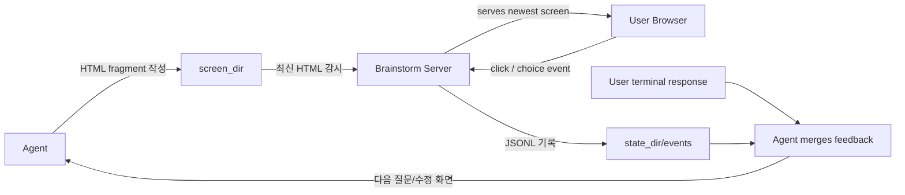

## 핵심 요약

`brainstorming`은 Superpowers 개발 방법론에서 **“사용자의 거친 아이디어를 승인 가능한 설계 스펙으로 바꾸는 선행 게이트”**입니다. 이 skill의 책임은 코드를 쓰는 것이 아니라, **프로젝트 맥락 파악 → 질문을 통한 요구사항 정제 → 대안 비교 → 설계안 제시 → 사용자 승인 → spec 문서화 → 구현 계획 skill로 인계**까지입니다. Superpowers README도 기본 워크플로의 첫 단계로 `brainstorming`을 두고, 그 다음 `writing-plans`, `subagent-driven-development` 또는 `executing-plans`로 이어지는 구조를 설명합니다. ([GitHub][1])

가장 중요한 특징은 **“간단해 보여도 설계 없이 구현하지 말라”**는 강한 제약입니다. `SKILL.md`는 기능 생성, 컴포넌트 구축, 기능 추가, 동작 변경 같은 창의적/구현성 작업 전에 이 skill을 사용하라고 정의하고, 설계를 제시하고 사용자가 승인하기 전에는 코드 작성, 스캐폴딩, 구현 skill 호출을 금지합니다. ([GitHub][2])

---

## 이 skill의 역할 정의

`brainstorming`은 이름만 보면 아이디어 발산 도구처럼 보이지만, 실제 문서상 역할은 **요구사항 분석가 + 소프트웨어 아키텍트 + UX/제품 질문자 + 스펙 작성자 + 구현 인계자**에 가깝습니다.

공식 설명은 “아이디어를 완성된 디자인과 스펙으로 바꾸는 것”이며, 시작점은 현재 프로젝트 맥락을 이해한 뒤 질문을 하나씩 던져 아이디어를 정제하는 것입니다. 이후 무엇을 만들지 충분히 이해했다고 판단되면 설계를 제시하고 사용자 승인을 받아야 합니다. ([GitHub][2])

제가 보기에는 이 skill의 본질은 다음 한 문장으로 정리됩니다.

> **구현 이전의 불확실성을 최대한 제거하고, 사용자가 승인한 design spec을 만들어 `writing-plans`로 넘기는 gatekeeper skill.**

즉, `writing-plans`가 “승인된 스펙을 구현 계획으로 쪼개는 skill”이라면, `brainstorming`은 그 앞단에서 **무엇을 만들 것인지, 왜 그렇게 만들 것인지, 어떤 경계 안에서 만들 것인지**를 확정하는 skill입니다.

---

## Architecture Diagram — 전체 책임 흐름

```mermaid
flowchart TD
    A["User Request<br/>아이디어, 기능 요청, 동작 변경 요청"] --> G["Skill Gate<br/>using-superpowers"]
    G --> B{"창작/기능/컴포넌트/<br/>동작 변경 작업인가?"}

    B -->|Yes| BS["brainstorming skill"]
    B -->|No| X["다른 적절한 skill 또는 일반 응답"]

    BS --> C["1. Project Context Explorer<br/>파일, 문서, 최근 커밋 확인"]
    C --> D{"범위가 너무 큰가?<br/>여러 독립 서브시스템인가?"}

    D -->|Yes| E["Scope Decomposer<br/>서브프로젝트로 분해<br/>첫 번째 spec 대상 선택"]
    D -->|No| F{"시각적 질문이 예상되는가?"}
    E --> F

    F -->|Yes| VC["Visual Companion Offer<br/>별도 메시지로 동의 요청"]
    F -->|No| Q["Clarifying Question Loop"]

    VC --> VQ{"각 질문별 판단<br/>보는 것이 읽는 것보다 나은가?"}
    VQ -->|Yes| VB["Browser Visual Companion<br/>mockup / diagram / comparison"]
    VQ -->|No| Q
    VB --> Q

    Q --> Q1["Socratic Requirements Analyst<br/>한 번에 하나의 질문<br/>목적, 제약, 성공 기준 파악"]
    Q1 --> QR{"설계 가능할 만큼<br/>충분히 명확한가?"}
    QR -->|No| Q1

    QR -->|Yes| AP["Approach Architect<br/>2-3개 접근안 제시<br/>trade-off + 추천안"]
    AP --> DS["Design Presenter<br/>architecture, components,<br/>data flow, error handling, testing"]
    DS --> UAD{"사용자가 설계 섹션을<br/>승인했는가?"}

    UAD -->|No, revise| Q1
    UAD -->|Yes| SPEC["Spec Writer<br/>docs/superpowers/specs/<br/>YYYY-MM-DD-topic-design.md"]
    SPEC --> COMMIT["Commit Spec<br/>design 문서 git commit"]
    COMMIT --> SR["Spec Self-Review<br/>placeholder, contradiction,<br/>scope, ambiguity 점검"]

    SR -. optional .-> RV["Spec Reviewer Subagent<br/>completeness, consistency,<br/>clarity, scope, YAGNI"]
    RV -. findings .-> SR

    SR --> UR{"User Review Gate<br/>사용자가 written spec 승인?"}
    UR -->|Changes requested| SPEC
    UR -->|Approved| WP["writing-plans skill<br/>구현 계획 작성으로 인계"]

    WP --> END["brainstorming 종료<br/>구현은 다음 skill의 책임"]
```



---

## 단계별 담당 작업

| 단계                 | 담당 역할                 | 구체적 동작                                                                | 산출물                               |
| ------------------ | --------------------- | --------------------------------------------------------------------- | --------------------------------- |
| 1. 프로젝트 맥락 탐색      | Context Explorer      | 파일, 문서, 최근 커밋을 확인하고 기존 구조를 이해                                         | 현재 코드베이스/문서 구조에 맞는 질문 기반          |
| 2. 범위 판정           | Scope Decomposer      | 요청이 여러 독립 서브시스템을 포함하면 즉시 분해                                           | 단일 spec으로 다룰 수 있는 하위 프로젝트         |
| 3. 시각 도구 판단        | Visual Facilitator    | UI, 다이어그램, layout 비교 등 시각 질문이 예상되면 companion 사용 여부를 별도 메시지로 확인        | text-only 또는 browser companion 흐름 |
| 4. 질문 루프           | Requirements Analyst  | 한 메시지에 한 질문, 가능하면 객관식, 목적/제약/성공 기준 확인                                 | 명확해진 요구사항                         |
| 5. 접근안 비교          | Solution Architect    | 2-3개 접근안을 trade-off와 함께 제시하고 추천안 설명                                   | 선택 가능한 설계 방향                      |
| 6. 설계 제시           | Design Presenter      | architecture, components, data flow, error handling, testing을 섹션별로 제시 | 사용자 승인 가능한 design                 |
| 7. spec 문서화        | Spec Writer           | 승인된 설계를 `docs/superpowers/specs/...`에 저장하고 commit                     | design spec 파일                    |
| 8. self-review     | Quality Gatekeeper    | TBD/TODO, 모순, scope 과대, 모호성 점검 후 inline 수정                            | planning-ready spec               |
| 9. 사용자 review gate | Human Approval Gate   | 사용자가 spec 파일을 검토하고 변경 요청 또는 승인                                        | 최종 승인된 spec                       |
| 10. 구현 계획 인계       | Workflow Orchestrator | `writing-plans` skill만 호출                                             | 구현 계획 작성 단계로 전환                   |

공식 체크리스트도 이 순서를 거의 그대로 강제합니다. 프로젝트 맥락 탐색, visual companion 제안, clarifying questions, 2-3개 접근안, 설계 제시, design doc 작성/commit, spec self-review, 사용자 spec review, 마지막으로 `writing-plans` 전환이 순서대로 명시되어 있습니다. ([GitHub][2])

---

## 핵심 제어 구조: “대화형 설계 → 문서화 → 인계”

`brainstorming`은 conversation-first 방식입니다. 사용자의 첫 요청을 곧바로 구현 명령으로 보지 않고, **대화형 요구사항 정제**로 전환합니다. 질문은 한 번에 하나씩 해야 하며, 가능하면 multiple-choice 질문을 선호하고, 목적·제약·성공 기준을 이해하는 데 집중하도록 되어 있습니다. ([GitHub][2])

충분히 이해했다고 판단되면 바로 단일 설계를 밀어붙이는 것이 아니라, **2-3개의 접근안**을 제시하고 각 접근안의 trade-off와 추천안을 설명합니다. 이 점은 일반적인 “요구사항 받아쓰기”가 아니라, 설계 선택지를 비교하는 architect 역할을 skill 안에 포함한 것으로 볼 수 있습니다. ([GitHub][2])

설계 제시는 섹션 단위로 이루어집니다. 문서에는 설계 섹션의 복잡도에 따라 몇 문장부터 200-300단어 수준까지 조절하고, 각 섹션 뒤에 사용자에게 “지금까지 맞는지” 확인하라고 되어 있습니다. 다뤄야 할 항목은 architecture, components, data flow, error handling, testing입니다. ([GitHub][2])

---

## “간단한 작업도 설계 필요”라는 강한 정책

이 skill의 눈에 띄는 설계 철학은 **작은 작업일수록 설계를 생략하지 말라**는 것입니다. `SKILL.md`는 todo list, 단일 함수 utility, config change 같은 단순 작업도 이 프로세스를 거쳐야 한다고 설명합니다. 단, 단순 작업의 design은 짧아도 된다고 되어 있습니다. ([GitHub][2])

이 정책은 LLM coding agent의 전형적인 실패 모드, 즉 **“작아 보이는 요청을 과소해석하고 바로 구현하다가 숨은 요구사항을 놓치는 문제”**를 막기 위한 장치입니다. 실제로 이 skill은 “설계와 사용자 승인 전 구현 금지”를 반복해서 강조하고, brainstorming의 terminal state를 `writing-plans` 호출로 고정합니다. ([GitHub][2])

---

## 범위 관리: 너무 큰 요청은 먼저 쪼갠다

`brainstorming`은 요구사항을 정제하기 전에 먼저 scope를 평가합니다. 요청이 chat, file storage, billing, analytics처럼 여러 독립 서브시스템을 포함하면 세부 질문으로 들어가지 말고 즉시 scope 문제를 지적하라고 되어 있습니다. 너무 큰 프로젝트는 독립된 sub-project로 분해하고, 각 sub-project가 별도의 spec → plan → implementation cycle을 갖도록 설계되어 있습니다. ([GitHub][2])

이 부분은 매우 실무적입니다. 단일 spec에 여러 제품/시스템 경계를 억지로 넣으면 이후 `writing-plans`가 거대한 monolithic plan을 만들 가능성이 높습니다. `brainstorming`은 그 이전 단계에서 **계획 가능한 단위로 문제를 자르는 responsibility**를 가집니다.

---

## 설계 원칙: isolation, clarity, 기존 패턴 존중

`brainstorming`은 기능 요구사항만 정리하지 않습니다. 설계 자체에 대한 품질 기준도 포함합니다.

핵심 원칙은 작은 단위로 시스템을 나누고, 각 단위가 하나의 명확한 목적을 가지며, 잘 정의된 인터페이스로 소통하고, 독립적으로 이해·테스트 가능해야 한다는 것입니다. 각 unit에 대해 “무엇을 하는가, 어떻게 쓰는가, 무엇에 의존하는가”를 설명할 수 있어야 한다고 되어 있습니다. ([GitHub][2])

기존 코드베이스에서는 먼저 현재 구조를 탐색하고 기존 패턴을 따르라고 되어 있습니다. 다만 기존 코드에 작업과 직접 관련된 문제가 있으면 targeted improvement를 설계에 포함할 수 있지만, 현재 목표와 무관한 refactoring은 제안하지 말라고 제한합니다. ([GitHub][2])

즉, 이 skill은 “새 기능 설계”뿐 아니라 **변경이 들어갈 코드 경계와 리팩토링 범위까지 조율하는 역할**도 맡습니다.

---

## Visual Companion: 선택적 시각 협업 도구

`brainstorming`에는 browser-based visual companion이 포함되어 있습니다. 이 도구는 mockup, diagram, visual option을 보여줄 수 있는 보조 수단이지, brainstorming 전체를 browser mode로 바꾸는 기능은 아닙니다. 문서는 visual companion 사용 여부를 먼저 별도 메시지로 물어야 하며, 그 메시지에는 다른 질문이나 요약을 섞지 말라고 규정합니다. ([GitHub][2])

visual companion은 **세션 단위가 아니라 질문 단위로 판단**합니다. 사용 기준은 “사용자가 읽는 것보다 보는 것으로 더 잘 이해할 수 있는가”입니다. browser는 UI mockup, architecture diagram, side-by-side visual comparison, layout, spatial relationship 같은 시각적 사안에 쓰고, scope 질문, trade-off list, API 설계, 데이터 모델링 같은 텍스트/표 기반 의사결정은 terminal에서 처리하라고 되어 있습니다. ([GitHub][3])

내부 동작도 비교적 명확합니다. server가 `screen_dir`의 HTML 파일을 감시하고 최신 HTML을 browser에 보여주며, 사용자의 click/selection은 `state_dir/events`에 기록되어 다음 turn에서 agent가 읽어 terminal feedback과 합칩니다. ([GitHub][3])

이 구조를 따로 보면 다음과 같습니다.



---

## 산출물: conversation 결과가 아니라 versioned spec

이 skill의 최종 산출물은 단순 대화 요약이 아닙니다. 승인된 설계를 `docs/superpowers/specs/YYYY-MM-DD-<topic>-design.md`에 저장하고, git에 commit하라고 되어 있습니다. 사용자가 spec 위치 선호를 갖고 있으면 그 선호가 기본 경로보다 우선합니다. ([GitHub][2])

그 다음 spec self-review를 수행합니다. 점검 항목은 placeholder/TBD/TODO, 내부 모순, scope 적합성, ambiguity입니다. 문제가 있으면 별도 재검토 없이 inline으로 수정하고 넘어가라고 되어 있습니다. ([GitHub][2])

또한 별도의 `spec-document-reviewer-prompt.md`가 제공되어 있습니다. 이 reviewer prompt는 spec이 implementation planning으로 넘어갈 준비가 되었는지 검토하며, completeness, consistency, clarity, scope, YAGNI를 점검하도록 구성되어 있습니다. 단, 사소한 문체 개선이 아니라 실제 planning 실패로 이어질 문제만 flag하도록 calibration되어 있습니다. ([GitHub][4])

---

## 사용자 승인 게이트

`brainstorming`은 두 번의 승인 게이트를 둡니다.

첫째, 설계 섹션을 사용자에게 보여주고 승인받는 gate입니다. 사용자가 승인하지 않으면 다시 설계 섹션을 수정합니다. 공식 process flow도 “User approves design?”에서 “no, revise”면 다시 design sections로 돌아가도록 되어 있습니다. ([GitHub][2])

둘째, spec 문서를 작성하고 self-review까지 마친 뒤, 사용자가 실제 spec 파일을 검토하도록 요청하는 gate입니다. 사용자가 변경을 요청하면 spec을 수정하고 self-review loop를 다시 실행하며, 사용자가 승인해야만 다음 단계로 넘어갑니다. ([GitHub][2])

이 설계는 매우 중요합니다. LLM이 “내가 이해한 바로는…” 수준으로 구현에 들어가지 못하게 하고, **사용자 승인된 문서 artifact**를 워크플로의 기준점으로 삼습니다.

---

## 다른 Superpowers skill과의 연결

`brainstorming`은 Superpowers 전체 skill chain의 선두에 있습니다. README 기준 기본 워크플로는 `brainstorming`으로 rough idea를 정제하고 design document를 저장한 뒤, `writing-plans`가 승인된 design을 아주 작은 구현 task로 분해하며, 이후 `subagent-driven-development` 또는 `executing-plans`가 plan을 실행합니다. ([GitHub][1])

`using-superpowers` 문서에서도 process skill이 implementation skill보다 우선한다고 되어 있고, “Let’s build X” 같은 요청은 brainstorming을 먼저 사용한 뒤 구현 관련 skill로 넘어가는 예시가 제시됩니다. ([GitHub][5])

특히 `brainstorming` 문서 자체는 brainstorming 후 terminal state가 `writing-plans` 호출이라고 못박습니다. `frontend-design`, `mcp-builder` 같은 다른 implementation skill을 직접 호출하지 말고, brainstorming 직후에는 오직 `writing-plans`만 호출하라고 되어 있습니다. ([GitHub][2])

---

## 담당하지 않는 것

`brainstorming`은 다음을 담당하지 않습니다.

첫째, **코드 작성**을 담당하지 않습니다. 설계 승인 전에는 코드 작성, 프로젝트 스캐폴딩, 구현 action을 금지합니다. ([GitHub][2])

둘째, **상세 구현 계획 작성**을 담당하지 않습니다. 그 역할은 `writing-plans`가 맡습니다. brainstorming의 마지막 책임은 승인된 spec을 만들고 `writing-plans`로 넘기는 것입니다. ([GitHub][2])

셋째, **구현 중 TDD 실행**을 직접 담당하지 않습니다. Superpowers README 기준 TDD는 implementation 단계에서 `test-driven-development` skill이 담당합니다. ([GitHub][1])

넷째, **모든 UI/시각 사안을 browser로 처리하지 않습니다.** visual companion은 도구일 뿐이며, 질문마다 browser가 더 적합한지 판단해야 합니다. ([GitHub][2])

---

## 품질 보증 메커니즘

이 skill의 품질 보증은 크게 네 겹입니다.

1. **대화형 요구사항 정제**: 한 번에 하나의 질문으로 scope, constraint, success criteria를 명확히 합니다. ([GitHub][2])
2. **대안 비교**: 2-3개 접근안을 비교하고 추천안을 설명하게 하여 단일 해법으로 조기 수렴하는 것을 막습니다. ([GitHub][2])
3. **사용자 승인**: 설계 섹션별 승인과 spec 파일 review gate를 둡니다. ([GitHub][2])
4. **spec review**: self-review와 optional reviewer prompt를 통해 placeholder, ambiguity, scope creep, over-engineering을 점검합니다. ([GitHub][2])

여기에 YAGNI 원칙도 명시되어 있습니다. key principles에는 unnecessary feature를 제거하라는 “YAGNI ruthlessly”, 2-3개 approach 탐색, incremental validation이 포함되어 있습니다. ([GitHub][2])

---

## 장점

가장 큰 장점은 **구현 전 불확실성 제거**입니다. LLM coding agent가 요구사항을 과소해석하거나, 사용자의 암묵적 기대를 놓치거나, “간단하니 바로 하겠다”는 방식으로 들어가는 것을 구조적으로 막습니다.

두 번째 장점은 **문서화된 합의**입니다. 대화 중 합의가 휘발되지 않고 spec 파일로 저장되고 commit됩니다. 이후 `writing-plans`와 구현 subagent들은 이 spec을 기준으로 움직일 수 있습니다.

세 번째 장점은 **scope control**입니다. 너무 큰 요청은 sub-project로 분해하고, 각 sub-project가 별도 spec-plan-implementation cycle을 갖도록 안내합니다. 이 방식은 agentic workflow에서 context overflow와 monolithic plan을 줄이는 데 유리합니다. ([GitHub][2])

네 번째 장점은 **설계 품질 기준이 내장되어 있다는 점**입니다. isolation, clear interfaces, independent testability, existing pattern adherence 같은 기준이 명시되어 있어, 단순 기능 목록이 아니라 구조적 설계를 유도합니다. ([GitHub][2])

---

## 한계와 주의점

첫 번째 한계는 **이미 주어진 프로젝트 맥락을 제대로 활용하지 못할 위험**입니다. 실제 GitHub issue #849에서는 상세한 `CLAUDE.md`와 memory context가 있는데도 brainstorming skill이 generic discovery question을 던지는 문제가 보고되었고, 원인으로 “현재 대화에 이미 로드된 CLAUDE.md, memory, git status 등을 사용하라”는 명시가 부족하다는 지적이 있었습니다. 해당 issue는 closed as not planned 상태입니다. ([GitHub][6])

두 번째 한계는 **제품 가정 검증이 명시적 mandatory step은 아니라는 점**입니다. issue #530에서는 brainstorming skill이 요구사항과 설계를 잘 탐색하지만 사용자의 제품 가정을 적극적으로 challenge하지는 않는다는 feature request가 제기되었습니다. 예를 들어 “모든 사용자에게 public page를 주자”는 요청에 대해 “누가 왜 방문하는가, 실제로 무엇을 올리는가”를 먼저 물어야 한다는 제안이 있었지만, 이 issue도 closed as not planned입니다. ([GitHub][7])

세 번째 한계는 **Visual Companion의 운영 복잡성**입니다. browser companion은 local server, `screen_dir`, `state_dir`, HTML 파일, click event merge라는 별도 루프를 갖습니다. 시각적 선택에는 강력하지만, 모든 brainstorming 질문에 쓰면 오히려 느리고 무거워질 수 있습니다. 공식 문서도 question-by-question으로 판단하라고 제한합니다. ([GitHub][3])

네 번째 한계는 **skill 호출/alias 혼동 가능성**입니다. 과거 issue #833에서는 deprecated command aliases가 실제 skill invocation을 막는 문제가 보고되었고, `/superpowers:brainstorm`이 `superpowers:brainstorming`으로 forwarding되지 않는 문제가 지적되었습니다. 해당 issue는 closed 상태지만, 실무적으로는 정확한 skill name을 쓰는 것이 안전합니다. ([GitHub][8])

---

## 실무적으로 사용할 때의 좋은 운영 방식

`brainstorming`을 제대로 쓰려면 첫 질문부터 generic하게 시작하지 않는 것이 좋습니다. 먼저 repo 구조, docs, 최근 commit, 이미 주어진 project memory를 확인한 뒤, “제가 보기에 이 요청은 기존 X 구조의 Y 경계에 영향을 줍니다. 우선 A와 B 중 어느 쪽이 목표인가요?”처럼 **맥락을 반영한 질문**을 던지는 편이 skill의 의도에 더 맞습니다.

또한 제품/UX 성격의 기능에서는 공식 checklist에 없더라도 다음 질문을 초기에 끼워 넣는 것이 좋습니다.

```text
이 기능이 해결하는 사용자 문제는 무엇인가?
사용자는 이 기능을 실제로 언제, 왜 쓰는가?
더 작은 변경으로 같은 효과를 얻을 수 있는가?
현재 제품 단계에서 반드시 필요한가?
```

이는 issue #530에서 지적된 “product assumptions challenge” 공백을 보완하는 방식입니다. ([GitHub][7])

마지막으로 spec 문서는 너무 길게 쓰기보다, 이후 `writing-plans`가 구현 단위로 쪼갤 수 있을 만큼 **명확한 architecture, component boundary, data flow, error handling, testing criteria**를 포함하는 것이 좋습니다. brainstorming 문서도 design presentation에서 이 항목들을 다루라고 명시합니다. ([GitHub][2])

---

## 최종 평가

`brainstorming`은 Superpowers 체계에서 **“아이디어를 구현 가능한 design spec으로 정제하는 설계 게이트”**입니다. 구현 능력을 높이는 skill이라기보다, 구현 전에 잘못된 작업을 시작하지 않도록 막는 skill입니다.

가장 강한 설계 의도는 다음입니다.

```text
요청을 바로 구현하지 않는다.
먼저 맥락을 파악한다.
질문으로 의도를 좁힌다.
대안을 비교한다.
설계를 섹션별로 승인받는다.
spec 문서로 고정한다.
review gate를 통과한 뒤 writing-plans로 넘긴다.
```

따라서 이 skill은 단독으로 보면 “brainstorming”이지만, 전체 시스템 안에서는 **Requirements → Architecture → Spec Approval → Planning Handoff**를 담당하는 upstream orchestration skill로 보는 것이 가장 정확합니다.

[1]: https://raw.githubusercontent.com/obra/superpowers/main/README.md "raw.githubusercontent.com"
[2]: https://github.com/obra/superpowers/blob/main/skills/brainstorming/SKILL.md "superpowers/skills/brainstorming/SKILL.md at main · obra/superpowers · GitHub"
[3]: https://github.com/obra/superpowers/blob/main/skills/brainstorming/visual-companion.md "superpowers/skills/brainstorming/visual-companion.md at main · obra/superpowers · GitHub"
[4]: https://github.com/obra/superpowers/blob/main/skills/brainstorming/spec-document-reviewer-prompt.md "superpowers/skills/brainstorming/spec-document-reviewer-prompt.md at main · obra/superpowers · GitHub"
[5]: https://github.com/obra/superpowers/blob/main/skills/using-superpowers/SKILL.md "superpowers/skills/using-superpowers/SKILL.md at main · obra/superpowers · GitHub"
[6]: https://github.com/obra/superpowers/issues/849 "Brainstorming skill asks generic questions despite rich project context · Issue #849 · obra/superpowers · GitHub"
[7]: https://github.com/obra/superpowers/issues/530 "Feature Request: brainstorming skill should proactively challenge product assumptions · Issue #530 · obra/superpowers · GitHub"
[8]: https://github.com/obra/superpowers/issues/833 "Deprecated command aliases block skill invocation instead of forwarding · Issue #833 · obra/superpowers · GitHub"

=====

## 결론

`writing-plans`는 **코드를 바로 쓰기 전에, 승인된 스펙/요구사항을 매우 구체적인 구현 계획서로 바꾸는 Agent Skill**입니다. 단순한 “할 일 목록”이 아니라, 에이전트나 개발자가 그대로 따라 실행할 수 있도록 **파일 경로, 테스트 코드, 구현 코드, 실행 명령, 기대 결과, 커밋 단위**까지 포함한 계획서를 만들게 강제합니다. Superpowers 전체 워크플로에서는 `brainstorming`으로 설계를 확정하고, 필요하면 `using-git-worktrees`로 격리된 작업공간을 만든 뒤, `writing-plans`가 구현 계획을 작성하는 단계로 배치되어 있습니다. ([GitHub][1])

## 이 Skill이 쓰이는 시점

`writing-plans`의 메타 설명은 “멀티스텝 작업에 대한 스펙이나 요구사항이 있을 때, 코드를 건드리기 전에 사용”하는 것입니다. 즉, 요구사항이 어느 정도 정리되어 있고 구현이 여러 단계로 나뉘는 경우에 활성화되는 계획 수립용 skill입니다. ([GitHub][2])

Superpowers의 기본 흐름 안에서는 다음 위치입니다.

1. `brainstorming`: 아이디어를 질문과 검토를 통해 스펙으로 정리
2. `using-git-worktrees`: 승인된 설계 후 격리 브랜치/작업공간 준비
3. **`writing-plans`: 승인된 설계를 2~5분 단위의 구현 태스크로 분해**
4. `subagent-driven-development` 또는 `executing-plans`: 계획을 실제로 실행
5. `test-driven-development`, `requesting-code-review`, `finishing-a-development-branch` 등으로 이어짐 ([GitHub][1])

따라서 이 skill은 “구현자”라기보다 **구현 오케스트레이터/플래너**에 가깝습니다.

## 핵심 목적

이 skill의 핵심 목적은 다음입니다.

**승인된 스펙을, 프로젝트 맥락을 거의 모르는 숙련 개발자도 막히지 않고 구현할 수 있는 수준의 실행 가능한 계획서로 변환하는 것**입니다.

SKILL.md는 계획서에 “어떤 파일을 수정할지, 각 태스크별 코드, 테스트, 확인해야 할 문서, 테스트 방법”을 모두 담으라고 지시합니다. 또한 계획은 작은 태스크로 나뉘어야 하며, DRY, YAGNI, TDD, 잦은 커밋을 원칙으로 삼습니다. ([GitHub][2])

## 산출물

기본 산출물은 Markdown 구현 계획서입니다.

기본 저장 위치는 다음 형식입니다.

```text
docs/superpowers/plans/YYYY-MM-DD-<feature-name>.md
```

단, 사용자가 다른 저장 위치를 선호하면 그 선호가 우선됩니다. ([GitHub][2])

계획 문서는 반드시 다음 헤더 구조를 포함해야 합니다.

```markdown
# [Feature Name] Implementation Plan

> **For agentic workers:** REQUIRED SUB-SKILL: Use superpowers:subagent-driven-development (recommended) or superpowers:executing-plans to implement this plan task-by-task. Steps use checkbox (`- [ ]`) syntax for tracking.

**Goal:** [One sentence describing what this builds]

**Architecture:** [2-3 sentences about approach]

**Tech Stack:** [Key technologies/libraries]

---
```

즉, 계획서 자체가 사람이 읽는 문서인 동시에, 후속 agentic worker가 실행할 수 있는 **작업 지시서** 역할을 하도록 설계되어 있습니다. ([GitHub][2])

## 계획서 작성 방식

이 skill은 계획을 작성하기 전에 먼저 **파일 구조를 매핑**하라고 지시합니다. 어떤 파일을 만들고, 어떤 파일을 수정하며, 각 파일의 책임이 무엇인지 먼저 정리합니다. 이때 “각 파일은 하나의 명확한 책임을 가져야 한다”, “작고 집중된 파일을 선호한다”, “함께 바뀌는 파일은 함께 둔다”, “기존 코드베이스의 패턴을 따른다”는 원칙을 사용합니다. ([GitHub][2])

그다음 각 태스크는 다음과 같은 구조를 가집니다.

```markdown
### Task N: [Component Name]

**Files:**
- Create: `exact/path/to/file.py`
- Modify: `exact/path/to/existing.py:123-145`
- Test: `tests/exact/path/to/test.py`

- [ ] **Step 1: Write the failing test**
- [ ] **Step 2: Run test to verify it fails**
- [ ] **Step 3: Write minimal implementation**
- [ ] **Step 4: Run test to verify it passes**
- [ ] **Step 5: Commit**
```

여기서 중요한 점은 “테스트를 작성하라” 같은 추상적 문장이 아니라, 실제 테스트 코드, 실행 명령, 기대 실패/성공 결과, 구현 코드, 커밋 명령까지 적어야 한다는 것입니다. ([GitHub][2])

## 태스크 단위 철학

이 skill은 각 step을 **2~5분 안에 수행 가능한 단일 행동**으로 쪼개라고 요구합니다. 예를 들면 “실패하는 테스트 작성”, “실패 확인”, “최소 구현”, “성공 확인”, “커밋”이 각각 별도 step입니다. ([GitHub][2])

이 접근의 의도는 명확합니다.

* LLM 에이전트가 한 번에 너무 큰 변경을 하지 않게 한다.
* 테스트 주도 개발의 red-green 흐름을 강제한다.
* 각 변경을 검증 가능한 최소 단위로 만든다.
* 리뷰와 롤백이 쉬운 커밋 단위를 만든다.

## 금지하는 계획서 패턴

`writing-plans`는 모호한 계획을 실패로 간주합니다. 예를 들어 `TBD`, `TODO`, “나중에 구현”, “적절한 에러 처리 추가”, “위 내용에 대한 테스트 작성”, “Task N과 유사하게” 같은 표현은 금지됩니다. 또한 코드 변경 step에는 실제 코드 블록이 있어야 하며, 나중 태스크에서 아직 정의되지 않은 타입, 함수, 메서드를 참조해서도 안 됩니다. ([GitHub][2])

이 부분이 이 skill의 가장 강한 특징입니다. 일반적인 구현 계획서는 “무엇을 할지”를 적는 데 그치지만, 이 skill은 **어떻게 할지까지 계획 단계에서 구체화**하게 만듭니다.

## 자체 리뷰 절차

계획서를 작성한 뒤에는 self-review를 수행합니다. 확인 항목은 크게 세 가지입니다.

첫째, 스펙의 각 요구사항이 계획의 어느 태스크에서 구현되는지 확인합니다. 둘째, placeholder나 모호한 문구가 남아 있는지 검사합니다. 셋째, 타입명, 메서드명, 속성명이 앞뒤 태스크에서 일관되게 쓰였는지 확인합니다. 문제가 있으면 별도 재검토 없이 계획서 안에서 바로 수정하라고 되어 있습니다. ([GitHub][2])

## 별도 reviewer prompt

이 디렉터리에는 `SKILL.md` 외에 `plan-document-reviewer-prompt.md`도 있습니다. 이 파일은 계획서 작성 후 별도 subagent에게 계획서를 검토시킬 때 사용하는 프롬프트 템플릿입니다. 검토 목적은 계획이 완전한지, 스펙과 맞는지, 태스크 분해가 적절한지 확인하는 것입니다. ([GitHub][3])

reviewer는 다음 네 가지를 봅니다.

* 완전성: TODO, placeholder, 누락 step 여부
* 스펙 정렬: 요구사항을 빠짐없이 커버하는지, 과도한 scope creep이 없는지
* 태스크 분해: 경계가 명확하고 실행 가능한지
* 빌드 가능성: 구현자가 막히지 않고 따라갈 수 있는지

단, reviewer는 사소한 문체나 nice-to-have 제안은 blocking issue로 보지 않고, 실제 구현 실패를 유발할 수 있는 문제만 flag하도록 되어 있습니다. ([GitHub][4])

## 실행 인계 방식

계획서 저장 후에는 사용자에게 두 가지 실행 방식을 제안하게 되어 있습니다.

첫 번째는 **Subagent-Driven 방식**입니다. 각 태스크마다 새 subagent를 투입하고, 태스크 사이에 리뷰를 수행하는 방식입니다. 이 skill에서는 이 방식을 추천합니다.

두 번째는 **Inline Execution 방식**입니다. 같은 세션에서 `executing-plans` skill을 사용해 배치 단위로 실행하고 checkpoint를 둡니다. ([GitHub][2])

즉, `writing-plans`는 계획을 만드는 데서 끝나지 않고, 후속 실행 skill까지 명시적으로 연결합니다.

## 좋은 점

이 skill의 장점은 매우 분명합니다.

첫째, LLM coding agent의 가장 흔한 실패인 “대충 이해하고 바로 구현하기”를 막습니다. 코드를 수정하기 전에 파일 구조, 테스트 전략, 구현 순서, 커밋 단위를 먼저 확정하게 합니다.

둘째, TDD를 형식적으로가 아니라 실행 절차로 강제합니다. 각 태스크가 실패 테스트 → 실패 확인 → 최소 구현 → 성공 확인 → 커밋 순서로 구성됩니다.

셋째, 후속 subagent 실행에 적합합니다. 각 태스크가 독립적이고 체크박스로 추적 가능하며, 파일 경로와 명령이 정확히 적혀 있어 병렬/순차 agent 실행의 입력으로 쓰기 좋습니다.

넷째, 계획서 품질 기준이 명확합니다. “모호하면 실패”라는 태도가 강해서, 실제 implementation handoff 문서로서 신뢰성이 높습니다.

## 주의할 점

다만 이 skill은 모든 작업에 적합하지는 않습니다.

작은 버그 수정이나 1~2파일짜리 단순 변경에는 과도할 수 있습니다. 또한 계획 단계에서 실제 코드와 테스트 코드까지 상세히 쓰게 하므로, 코드베이스 이해가 부족한 상태에서 사용하면 그럴듯하지만 틀린 파일 경로나 API를 계획서에 고정할 위험이 있습니다. 이 위험을 줄이려면 계획 작성 전 repository 탐색, 기존 패턴 확인, 테스트 실행 기준 확인이 반드시 선행되어야 합니다.

또 하나의 주의점은, 이 skill이 “구현 계획”을 상세하게 만들도록 설계되어 있기 때문에 탐색적 설계나 요구사항이 불명확한 상태에는 적합하지 않다는 것입니다. 그런 경우에는 먼저 `brainstorming`이나 별도 discovery 과정을 거친 뒤 사용해야 합니다. Superpowers README도 기본 흐름에서 `brainstorming`으로 스펙을 정리하고 승인받은 뒤 `writing-plans`로 넘어가는 구조를 설명합니다. ([GitHub][1])

## 한 줄 평가

`writing-plans`는 **LLM/agent 기반 소프트웨어 개발에서 “계획의 해상도”를 매우 높여, 후속 구현 agent가 테스트 주도 방식으로 안정적으로 실행하도록 만드는 planning skill**입니다.
실무적으로는 “스펙 → 실행 가능한 TDD 구현 플레이북” 변환기라고 보면 됩니다.

[1]: https://github.com/obra/superpowers "GitHub - obra/superpowers: An agentic skills framework & software development methodology that works. · GitHub"
[2]: https://github.com/obra/superpowers/blob/main/skills/writing-plans/SKILL.md "superpowers/skills/writing-plans/SKILL.md at main · obra/superpowers · GitHub"
[3]: https://github.com/obra/superpowers/tree/main/skills/writing-plans "superpowers/skills/writing-plans at main · obra/superpowers · GitHub"
[4]: https://github.com/obra/superpowers/blob/main/skills/writing-plans/plan-document-reviewer-prompt.md "superpowers/skills/writing-plans/plan-document-reviewer-prompt.md at main · obra/superpowers · GitHub"
