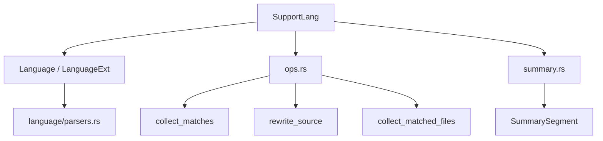

# AST Parsing and Rewriting

# AST Parsing and Rewriting

`crates/pi-ast` provides the repository’s AST-powered language layer, structural search/rewrite operations, file matching, and source summarization. It is built on `ast_grep_core` and tree-sitter grammars, with `SupportLang` as the shared language enum used by parsing, pattern compilation, rewriting, and summaries.



## Public Surface

`crates/pi-ast/src/lib.rs` exports:

```rust
pub mod language;
pub mod ops;
pub mod summary;

pub use language::SupportLang;
```

Most callers enter through one of three surfaces:

- `SupportLang` for language resolution and tree-sitter integration.
- `ops` for AST search, rewrite, and matched-file collection.
- `summary` for structure-aware source elision.

## Language Registry

`language/mod.rs` defines every language supported by the module. The central type is:

```rust
pub enum SupportLang { ... }
```

`SupportLang` implements both `ast_grep_core::Language` and `LanguageExt`, so callers can pass it directly to ast-grep APIs such as:

```rust
let ast = language.ast_grep(source);
```

The enum is backed by concrete zero-sized language structs like `TypeScript`, `Rust`, `Python`, `Html`, and others. Dispatch from `SupportLang` to those concrete implementations is generated through `execute_lang_method!` and `impl_lang_method!`.

The default build includes the core language set:

- TypeScript, TSX, JavaScript
- Python, Rust, Go, Java
- C, C++, C#
- Ruby, PHP, Bash
- JSON, YAML, TOML, Markdown
- HTML, CSS

When the `full-langs` feature is enabled, `ALL_LANGS_FULL` expands support to additional grammars such as Swift, Kotlin, Scala, Starlark, Dockerfile, Vue, XML, Zig, and others.

## Parser Binding

`language/parsers.rs` maps each supported language to its tree-sitter grammar function:

```rust
pub fn language_typescript() -> TSLanguage {
    tree_sitter_typescript::LANGUAGE_TYPESCRIPT.into()
}

pub fn language_rust() -> TSLanguage {
    tree_sitter_rust::LANGUAGE.into()
}
```

The language structs call these parser functions through `LanguageExt::get_ts_language()`.

For example, the generated Rust implementation follows this pattern:

```rust
impl LanguageExt for Rust {
    fn get_ts_language(&self) -> TSLanguage {
        parsers::language_rust().into()
    }
}
```

`kind_to_id()` and `field_to_id()` are thin wrappers around the underlying tree-sitter language:

```rust
fn kind_to_id(&self, kind: &str) -> u16 {
    self.get_ts_language().id_for_node_kind(kind, true)
}

fn field_to_id(&self, field: &str) -> Option<u16> {
    self.get_ts_language()
        .field_id_for_name(field)
        .map(|f| f.get())
}
```

## Pattern Expando Handling

Ast-grep patterns use meta variables like `$VAR` and variadic meta variables like `$$$ARGS`. Some tree-sitter grammars do not accept `$` as an identifier character, so `language/mod.rs` separates languages into two implementation styles.

`impl_lang!` is used when the grammar accepts `$` directly:

```rust
impl_lang!(TypeScript, language_typescript);
impl_lang!(JavaScript, language_javascript);
impl_lang!(Json, language_json);
```

`impl_lang_expando!` is used when the grammar needs a replacement character:

```rust
impl_lang_expando!(Rust, language_rust, 'µ');
impl_lang_expando!(Python, language_python, 'µ');
impl_lang_expando!(C, language_c, '𐀀');
```

These languages override:

```rust
fn expando_char(&self) -> char
fn pre_process_pattern<'q>(&self, query: &'q str) -> Cow<'q, str>
```

`pre_process_pattern()` rewrites only ast-grep meta-variable sigils that need to parse as identifiers. For example, `$VAR` and `$$$ARGS` can be rewritten with the language’s expando character before ast-grep builds the pattern, while ordinary non-meta `$` usage is preserved.

## Language Resolution

There are two main resolution paths:

```rust
SupportLang::from_alias(value)
SupportLang::from_path(path)
```

`from_alias()` normalizes user-provided language names through static `phf` maps:

```rust
static CORE_LANG_ALIASES: phf::Map<&'static str, SupportLang>
```

For full-language builds, `LONG_TAIL_LANG_ALIASES` adds aliases such as `swift`, `dockerfile`, `starlark`, `vue`, and `zig`.

`from_path()` delegates to `from_extension()`, which checks special filenames first in full-language builds:

- `Makefile`, `makefile`, `GNUmakefile`
- `Justfile`, `justfile`
- `CMakeLists.txt`
- `Dockerfile`, `Containerfile`, and prefixed Dockerfile names

It then falls back to extension matching through `extensions(lang)`.

The higher-level operation helpers in `ops.rs` expose this as:

```rust
pub fn resolve_supported_lang(value: &str) -> Result<SupportLang>
pub fn resolve_language(lang: Option<&str>, file_path: &Path) -> Result<SupportLang>
pub fn is_supported_file(file_path: &Path, explicit_lang: Option<&str>) -> bool
```

If a requested alias is known but only available behind `full-langs`, `resolve_supported_lang()` returns a targeted error explaining that the default build does not include that language.

## HTML Injection Support

`Html` has a custom `LanguageExt` implementation because HTML can contain embedded script and style languages.

It declares injectable languages:

```rust
fn injectable_languages(&self) -> Option<&'static [&'static str]> {
    Some(&["css", "js", "ts", "tsx", "scss", "less", "stylus", "coffee"])
}
```

`extract_injections()` scans the HTML AST for:

- `script_element`
- `style_element`

For each element, it looks for a `lang` attribute through `find_html_lang()`. If no language attribute is present, scripts default to `js` and styles default to `css`.

The extracted ranges are produced by `node_to_range()` and returned as:

```rust
HashMap<String, Vec<TSRange>>
```

The test `html_script_injection_range_is_available_in_default_registry` verifies that a `<script>` block exposes the raw JavaScript text range.

## AST Search

`ops.rs` provides the search-oriented types:

```rust
pub enum AstMatchStrictness {
    Cst,
    Smart,
    Ast,
    Relaxed,
    Signature,
    Template,
}

pub struct AstMatch {
    pub line: usize,
    pub column: usize,
    pub end_line: usize,
    pub end_column: usize,
    pub byte_start: usize,
    pub byte_end: usize,
    pub text: String,
}
```

`resolve_strictness()` maps the local enum to `ast_grep_core::MatchStrictness`, defaulting to `Smart`.

Patterns are compiled through:

```rust
pub fn compile_pattern(
    pattern: &str,
    selector: Option<&str>,
    strictness: &MatchStrictness,
    lang: SupportLang,
) -> Result<Pattern>
```

If `selector` is provided, the function builds a contextual pattern:

```rust
Pattern::contextual(pattern, selector, lang)
```

Otherwise it uses:

```rust
Pattern::try_new(pattern, lang)
```

`collect_matches()` parses source with `language.ast_grep(source)` and runs every compiled `Pattern` against the root node:

```rust
for matched in ast.root().find_all(pattern.clone()) {
    ...
}
```

Matches include 1-based line and column positions, byte ranges, and matched text. Character columns are calculated with ast-grep’s `Position::column()` through the local `char_column()` helper.

## Rewrite Compilation and Application

Rewrite support is centered on:

```rust
pub struct CompiledRewrite {
    pub out: String,
    pub patterns: Vec<Pattern>,
}
```

`compile_rewrite_rules()` accepts `(pattern, replacement)` pairs and compiles each pattern with `compile_search_patterns()`.

```rust
pub fn compile_rewrite_rules(
    rules: &[(String, String)],
    language: SupportLang,
) -> Result<Vec<CompiledRewrite>, (usize, PatternError)>
```

For most languages, `compile_search_patterns()` produces one `Pattern::try_new()` result. Rust gets one additional fallback path:

```rust
fn compile_rust_contextual_pattern(pattern: &str) -> Option<Pattern>
```

This wraps the pattern inside:

```rust
fn __rwp_wrapper() { {pattern}; }
```

Then it extracts an `expression_statement` selector and builds a contextual pattern. This helps expression-shaped Rust rewrite patterns compile in contexts where the raw fragment is not accepted as a complete pattern.

`rewrite_source()` applies compiled rewrite operations sequentially:

```rust
pub fn rewrite_source(
    source: &str,
    language: SupportLang,
    ops: &[CompiledRewrite],
) -> Result<(String, u32), String>
```

For each operation and pattern, it calls:

```rust
ast.root().replace_all(pattern.clone(), op.out.as_str())
```

When edits are produced, `apply_edits()` applies them to the current source, then the source is reparsed before the next pattern runs. This is important: later rewrite operations see the updated AST, not the original tree.

`apply_edits()` sorts edits by byte position, rejects overlapping replacements, validates bounds, converts inserted bytes to UTF-8, and applies edits in reverse order so byte offsets remain stable:

```rust
output.replace_range(start..end, &replacement);
```

The overlap check is covered by `apply_edits_rejects_overlaps`.

## File Collection

`collect_matched_files()` finds files under a working directory using `ignore::WalkBuilder` and optional glob matching:

```rust
pub fn collect_matched_files(
    cwd: &Path,
    patterns: &[String],
) -> Result<Vec<MatchedFile>, std::io::Error>
```

It respects ignore configuration:

```rust
builder
    .hidden(false)
    .git_ignore(true)
    .git_global(true)
    .git_exclude(true);
```

Patterns with glob syntax are compiled by `build_globset()`. Syntax detection is intentionally simple:

```rust
pub fn has_glob_syntax(pattern: &str) -> bool {
    pattern.contains('*') || pattern.contains('?') || pattern.contains('[')
}
```

A file is included when either the glob set matches its normalized relative path or one of the raw patterns exactly equals the relative path. Results are sorted by `relative_path` for deterministic output.

## Structural Summaries

`summary.rs` builds compact, parse-aware summaries of source files. The public input and output types are:

```rust
pub struct SummaryOptions {
    pub code: String,
    pub lang: Option<String>,
    pub path: Option<String>,
    pub min_body_lines: Option<u32>,
    pub min_comment_lines: Option<u32>,
}

pub struct SummaryResult {
    pub language: Option<String>,
    pub parsed: bool,
    pub elided: bool,
    pub total_lines: u32,
    pub segments: Vec<SummarySegment>,
}

pub struct SummarySegment {
    pub kind: String,
    pub start_line: u32,
    pub end_line: u32,
    pub text: Option<String>,
}
```

The entry point is:

```rust
pub fn summarize_code(options: SummaryOptions) -> Result<SummaryResult>
```

The summary pipeline is:

1. Count source lines.
2. Resolve language from `lang` or `path`.
3. Parse source with tree-sitter.
4. Return an unparsed result if parsing fails or the root has syntax errors.
5. Walk the tree and collect elidable line spans.
6. Normalize overlapping or adjacent spans.
7. Build ordered `kept` and `elided` segments.

When parsing is unavailable, unsupported, or invalid, `unparsed_result()` returns the whole source as one `kept` segment with `parsed: false`.

## Elision Rules

`collect_elisions()` recursively walks tree-sitter nodes and identifies regions that can be safely collapsed while preserving structural boundaries.

Three categories are handled:

1. Long comments, detected by `is_comment_kind()`.
2. Large body-like nodes, detected by `is_elidable_kind()`.
3. Consecutive import/include/use runs, detected by `is_groupable_kind()` and collapsed by `flush_groupable_run()`.

Defaults are:

```rust
const DEFAULT_MIN_BODY_LINES: u32 = 4;
const DEFAULT_MIN_COMMENT_LINES: u32 = 6;
```

Both thresholds are clamped upward in `summarize_code()`:

```rust
let min_body_lines = options.min_body_lines.unwrap_or(DEFAULT_MIN_BODY_LINES).max(2);
let min_comment_lines = options.min_comment_lines.unwrap_or(DEFAULT_MIN_COMMENT_LINES).max(4);
```

For body-like nodes, the module usually elides the interior lines and leaves the opening and closing boundary visible. For example, a TypeScript function body can become:

```text
export function greet(name: string): string {
...
}
```

Language-specific elidable kinds include examples such as:

- TypeScript: `statement_block`, `class_body`, `interface_body`, `object`, `array`
- Rust: `block`, `declaration_list`, `match_block`, `use_list`
- Python: `block`, `dictionary`, `list`, `argument_list`
- Go: `block`, `composite_literal`, `import_spec_list`
- HTML: `element`, `script_element`, `style_element`
- JSON: `object`, `array`

Some formats intentionally do not elide content because their inner lines are the meaningful content:

```rust
SupportLang::Yaml | SupportLang::Toml => false
```

With `full-langs`, `Ini`, `Diff`, and `Regex` are also skipped for the same reason.

## Import and Include Runs

Import-like statements are treated separately from body elision. `collect_elisions()` scans consecutive sibling nodes and calls `flush_groupable_run()` when a run ends.

Examples of groupable kinds:

- TypeScript, TSX, JavaScript: `import_statement`
- Rust: `use_declaration`, `extern_crate_declaration`
- Python: `import_statement`, `import_from_statement`, `future_import_statement`
- C and C++: `preproc_include`
- Java: `import_declaration`
- C#: `using_directive`

The run elision keeps the first and last statement visible and collapses only the middle lines. `node_content_end_line()` handles grammars whose `end_position` lands at column 0 of the next row because a node includes a trailing newline. This is specifically covered by the C include test `summarizes_c_preproc_include_run`.

## Error and Fallback Behavior

The module favors safe fallback over partial AST output.

- `resolve_supported_lang()` reports unsupported aliases and gives a special `full-langs` message for known long-tail languages omitted from the default build.
- `resolve_language()` requires an explicit language when extension inference fails.
- `compile_pattern()` wraps ast-grep pattern failures as `Invalid pattern: ...`.
- `rewrite_source()` returns an error string when edit application fails.
- `apply_edits()` rejects overlapping or out-of-bounds edits before mutating output.
- `summarize_code()` returns `parsed: false` instead of throwing when parsing fails or the tree contains syntax errors.

## Tests as Contracts

The tests in `language/mod.rs`, `ops.rs`, and `summary.rs` define important behavioral contracts:

- `all_langs_matches_locked_registry` locks the default language order and the full-language count.
- `bzl_extension_inference_matches_language_set` verifies `.bzl` only resolves when `full-langs` is enabled.
- `html_script_injection_range_is_available_in_default_registry` verifies HTML injection ranges.
- `compile_search_patterns_compiles_rust_patterns` verifies Rust contextual fallback compilation.
- `resolves_core_aliases_and_reports_default_long_tail` verifies default-vs-full language error behavior.
- `apply_edits_rejects_overlaps` prevents ambiguous rewrite output.
- Summary tests verify body elision, import-run elision, parse-failure fallback, unsupported-language fallback, and threshold behavior.

## Adding or Changing a Language

A new supported language usually requires coordinated updates in several places:

1. Add a parser function in `language/parsers.rs`.
2. Add a concrete language implementation with either `impl_lang!` or `impl_lang_expando!`.
3. Add a `SupportLang` variant.
4. Add the variant to `ALL_LANGS_DEFAULT` or `ALL_LANGS_FULL`.
5. Add `canonical_name()` mapping.
6. Add dispatch entries in `execute_lang_method!`.
7. Add file extensions in `extensions()`.
8. Add aliases in `CORE_LANG_ALIASES` or `LONG_TAIL_LANG_ALIASES`.
9. Add summary behavior in `is_comment_kind()`, `is_elidable_kind()`, and `is_groupable_kind()` if structural summaries should support the language.
10. Update tests that lock registry shape or language inference behavior.

Use `impl_lang!` only if the grammar accepts ast-grep’s `$` meta-variable syntax as valid source. Otherwise use `impl_lang_expando!` with an expando character that parses safely in that grammar.