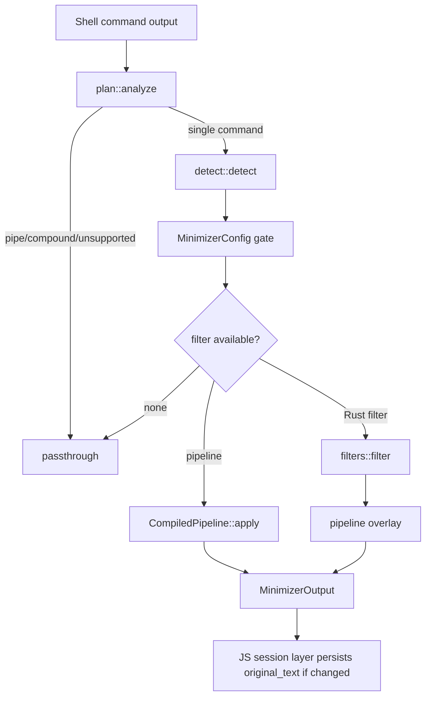

# Command Output Minimizer

# Command Output Minimizer

The Command Output Minimizer is an opt-in shell-output compression layer for `Shell::run` and `execute_shell`. It rewrites captured stdout/stderr before the result reaches the JavaScript caller, while preserving raw output when minimization is disabled, unsafe, too large, unsupported, or when a filter fails.

The public entry point is:

```rust
pub fn apply(
	command: &str,
	captured: &str,
	exit_code: i32,
	config: &MinimizerConfig,
) -> MinimizerOutput
```

`crates/pi-shell/src/minimizer.rs` exports `MinimizerConfig`, `MinimizerOptions`, `MinimizerCtx`, and `MinimizerOutput`, then delegates actual execution to `engine::apply`.



## Core Contract

The minimizer is intentionally conservative:

- `MinimizerConfig::default()` disables minimization.
- `MinimizerConfig::is_program_enabled()` must allow the detected program.
- `engine::mode_for()` only returns `MinimizerMode::WholeCommand` for a single simple command with a known built-in filter or matching pipeline.
- Pipes, compound commands, malformed commands, and unknown commands pass through unchanged.
- Captures larger than `max_capture_bytes` pass through with the `"too-large"` label.
- Panics inside filters or pipelines are caught and converted to passthrough behavior.
- If a successful command minimizes to an empty string, `ensure_success_visible()` returns `OK\n`; failed commands do not receive synthetic success text.

## Public Data Types

`MinimizerOptions` is the N-API-facing opt-in handle used by shell options:

```rust
pub struct MinimizerOptions {
	pub enabled: Option<bool>,
	pub settings_path: Option<String>,
	pub settings_hash: Option<String>,
	pub only: Option<Vec<String>>,
	pub except: Option<Vec<String>>,
	pub max_capture_bytes: Option<u32>,
}
```

`MinimizerConfig` is the resolved internal form:

```rust
pub struct MinimizerConfig {
	pub enabled: bool,
	pub only: HashSet<String>,
	pub except: HashSet<String>,
	pub max_capture_bytes: u32,
	pub per_command: HashMap<String, toml::Value>,
	pub user_pipelines: Option<Arc<PipelineRegistry>>,
}
```

`MinimizerOutput` carries both visible output and telemetry:

```rust
pub struct MinimizerOutput {
	pub text: String,
	pub changed: bool,
	pub input_bytes: usize,
	pub output_bytes: usize,
	pub filter: &'static str,
	pub original_text: Option<String>,
}
```

Use `MinimizerOutput::passthrough()` when a filter leaves text unchanged, and `MinimizerOutput::transformed()` when it rewrites output. `with_original()` attaches the raw capture only when `changed == true`; the JavaScript session layer is expected to persist that text through its `ArtifactManager` and add an `artifact://<id>` reference before presenting output to the agent.

## Configuration Resolution

`MinimizerConfig::from_options()` merges field-level options with an optional TOML settings file.

Resolution order:

1. Start from disabled defaults.
2. Apply direct `MinimizerOptions` values.
3. Expand `settings_path` with `~` support.
4. If `settings_hash` is present, compute xxHash64 over the settings file and reject mismatches.
5. Parse settings into `SettingsFile`.
6. Merge top-level settings into `MinimizerConfig`.
7. Parse user-defined pipelines with `pipeline::parse_file()`.

The settings file supports:

- `schema_version`
- `enabled`
- `only`
- `except`
- `max_capture_bytes`
- per-command TOML tables, stored in `per_command`
- `[filters.*]` declarative pipelines
- `[[tests.*]]` inline pipeline tests

Tables named `filters` and `tests` are reserved for pipeline definitions and are not inserted into `per_command`.

## Command Shape Analysis

`plan::analyze()` uses `brush-parser` to classify the full shell command before any output rewrite happens.

`CommandPlan` has four cases:

```rust
pub enum CommandPlan {
	Single { program: String },
	Piped,
	Compound,
	Unsupported,
}
```

Only `Single` commands are eligible for whole-buffer minimization. This prevents the minimizer from corrupting output that a downstream command may parse.

Examples:

- `git status --short` -> `Single`
- `FOO=1 git status` -> `Single`
- `git status | cat` -> `Piped`
- `cd foo && cargo test` -> `Compound`
- `sleep 1 &` -> `Compound`
- malformed or empty commands -> `Unsupported`

`engine::apply()` repeats this structural check even if a caller already asked `mode_for()`, so the safety guard is enforced at the rewrite boundary.

## Command Detection

`detect::detect()` converts a raw command string into a `CommandIdentity`:

```rust
pub struct CommandIdentity {
	pub program: String,
	pub subcommand: Option<String>,
}
```

Detection is best-effort and intentionally handles common interactive shell shapes rather than implementing a full shell parser. `tokenize()` splits the first command segment, respecting simple quotes and backslash escapes, and stops at `;`, `|`, or `&`.

`detect_tokens()` then strips launch wrappers and global options before normalizing the program name:

- environment assignments, such as `FOO=1`
- `env`
- `sudo`
- `command`
- `builtin`
- `noglob`
- `exec`
- `time`

Program-specific subcommand detection is implemented in `detect_subcommand()`. Known programs such as `git`, `cargo`, `docker`, `gh`, `gt`, `npm`, `pnpm`, `yarn`, `bun`, `pip`, and `bundle` skip their global flags before selecting the first real subcommand.

For unknown programs, the detector uses the first non-flag argument as the subcommand.

## Engine Dispatch

`engine::apply()` is the main runtime path:

1. Reject oversized captures.
2. Reject non-single command plans.
3. Detect `CommandIdentity`.
4. Check `MinimizerConfig::is_program_enabled()`.
5. Prefer Rust-native filters when `filters::supports()` returns true.
6. Otherwise resolve a user or built-in declarative pipeline.
7. Attach labels and original text when output changed.

Rust-native filters receive a `MinimizerCtx`:

```rust
pub struct MinimizerCtx<'a> {
	pub program: &'a str,
	pub subcommand: Option<&'a str>,
	pub command: &'a str,
	pub config: &'a MinimizerConfig,
}
```

The dispatch order matters. Built-in Rust filters win over normal pipeline dispatch, but `apply_pipeline_overlay()` can still apply a matching pipeline as an overlay to the Rust filter result. This lets users tune a built-in filter’s output without replacing its Rust implementation.

Pipeline lookup uses `resolve_pipeline()`:

1. `config.user_pipelines`
2. built-in pipelines loaded from `builtin_filters.toml`

User pipelines therefore take priority over built-in pipeline definitions.

## Pipeline Filters

`pipeline.rs` implements declarative TOML filters compiled into `CompiledPipeline`.

A pipeline definition is represented by `PipelineDef` and matched against `(program, subcommand)` using:

```rust
pub match_command: String
pub match_subcommand: Option<String>
```

Runtime stages are applied in this order by `CompiledPipeline::apply()`:

1. `strip_ansi`
2. ordered `replace` rules, line by line
3. `match_output` short-circuit summaries
4. `strip_lines_matching` or `keep_lines_matching`
5. `truncate_lines_at`
6. `head_lines` / `tail_lines`
7. `max_lines`
8. `on_empty`

`strip_lines_matching` and `keep_lines_matching` are mutually exclusive; `compile()` rejects definitions that set both. Regex syntax errors are caught at load time and returned as descriptive `Err(String)` values.

Exit-code gates are handled by `CompiledPipeline::skipped_by_exit()`:

```rust
pub only_on_exit: Vec<i32>
pub except_on_exit: Vec<i32>
```

If a pipeline is skipped for the current exit code, `engine::apply_identity()` returns passthrough output labeled `"exit-skip"`.

Inline tests are loaded with each `PipelineRegistry` and exercised by `pipeline::run_tests()`. Built-in pipeline tests are exposed through `engine::verify_builtin_filters()`.

## Text Primitives

`primitives.rs` contains reusable transforms shared by Rust-native filters and declarative pipelines:

- `strip_ansi()` removes ANSI CSI escapes and converts carriage returns to newlines.
- `dedup_consecutive_lines()` collapses repeated adjacent lines into `line (×N)`.
- `head_tail_lines()` keeps the first and last lines with an omission marker.
- `head_lines_only()` and `tail_lines_only()` keep one side with a marker.
- `max_lines()` hard-caps output length.
- `strip_lines()` removes lines matched by predicate functions.
- `strip_lines_regex()` and `keep_lines_regex()` apply `RegexSet` line filters.
- `group_by_file()` groups `file:line:message` diagnostics under file headings.
- `compact_listing()` summarizes long plain listings.
- `truncate_line()` truncates by Unicode scalar count and appends `…[+N]`.

`truncate_line()` deliberately reports the number of dropped characters so callers can distinguish minimizer truncation from source text that already contained an ellipsis.

## Telemetry Labels

`MinimizerOutput::filter` identifies the dispatch path. Labels are static strings so they can cross the N-API boundary without allocation concerns.

Common labels include:

- `"passthrough"`
- `"too-large"`
- `"piped"`
- `"compound"`
- `"parse-error"`
- `"unknown"`
- `"disabled"`
- `"unsupported"`
- `"pipeline"`
- `"pipeline-noop"`
- `"pipeline+builtin"`
- built-in program labels such as `"git"`, `"cargo"`, `"bun"`, `"pytest"`, `"tsc"`, `"eslint"`, `"docker"`, and `"gtest"`

Unknown commands that reach `engine::apply()` increment an atomic counter via `record_unknown_command()`. Tests can inspect and reset this through `unknown_command_count()` and `reset_unknown_command_count()`.

## Built-In Filters and Integration Points

The minimizer module sits between the shell execution layer and JavaScript-facing shell results. It does not execute commands; it only decides whether captured output should be rewritten.

Native filters live under `minimizer/filters/*` and call shared primitives plus `MinimizerOutput` constructors. For example, cargo and bun filters use helpers such as `strip_ansi()`, `dedup_consecutive_lines()`, `head_tail_lines()`, `group_by_file()`, `passthrough()`, and `transformed()`.

The engine also recognizes C++ test binaries through:

```rust
filters::cpp::is_gtest_binary_name(program)
```

That check lets `program_label()` label matching test executables as `"gtest"` even when the binary name is not literally `gtest`.

Built-in declarative filters are embedded at compile time:

```rust
const BUILTIN_FILTERS_TOML: &str =
	include_str!(concat!(env!("OUT_DIR"), "/builtin_filters.toml"));
```

They are parsed lazily into a `PipelineRegistry` using `LazyLock`.

## Adding or Changing Minimization Behavior

Use a Rust-native filter when behavior needs command-specific parsing, structured interpretation, or special integration with existing filter code. The filter should expose support through `filters::supports()` and return `MinimizerOutput::passthrough()` or `MinimizerOutput::transformed()`.

Use a declarative pipeline when the minimization is mostly text shaping:

- remove noisy lines
- keep only diagnostic lines
- truncate long lines
- summarize known success output
- cap head/tail output
- replace empty output with a sentinel

When adding a pipeline:

1. Define `[filters.NAME]` with `match_command`.
2. Add `match_subcommand` if the filter should only apply to a specific subcommand.
3. Prefer `match_output.unless` when success summaries could accidentally hide failures.
4. Add inline `[[tests.NAME]]` cases.
5. Validate with `pipeline::run_tests()` or the built-in verification surface.

When adding a Rust filter, preserve these engine invariants:

- never panic for expected command output
- return passthrough when unsure
- keep failures visible
- do not assume pipes or compound commands reach the filter
- keep `original_text` handling in the engine, not inside the filter
- prefer shared primitives over duplicating text operations

## Safety Model

The minimizer is designed to improve agent readability without becoming part of command correctness. Its safety boundaries are:

- opt-in configuration
- program allow/deny gates
- whole-command-only rewriting
- maximum capture size
- conservative command parsing
- panic containment
- passthrough defaults
- raw-output preservation through `original_text`

A contributor should treat minimization as presentation logic. It must never be required for a command to succeed, and it must never hide information that changes the meaning of a failed command.