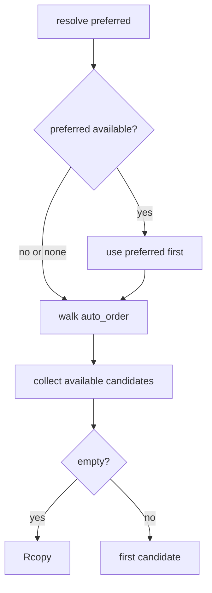

# Filesystem Isolation Backends

# Filesystem Isolation Backends

`crates/pi-iso` provides the platform abstraction layer for creating an isolated writable filesystem view from a read-only source tree.

The central contract is `IsolationBackend`:

```rust
pub trait IsolationBackend: Send + Sync {
    fn kind(&self) -> BackendKind;
    fn probe(&self) -> ProbeResult;
    fn start(&self, lower: &Path, merged: &Path) -> IsoResult<()>;
    fn stop(&self, merged: &Path) -> IsoResult<()>;
    async fn diff(&self, lower: &Path, merged: &Path) -> IsoResult<Diff>;
}
```

`lower` is the baseline tree. `merged` is the writable view where the workload runs. Backends differ in how they materialize that view: APFS clones, btrfs snapshots, ZFS clones, Linux reflinks, overlay mounts, Windows block clones, ProjFS projection, or recursive copy fallback.

## Backend Selection

`BackendKind` is the stable identifier exposed to callers and the N-API shim:

- `Apfs`
- `Btrfs`
- `Zfs`
- `LinuxReflink`
- `Overlayfs`
- `WindowsBlockClone`
- `Projfs`
- `Rcopy`

`backend(kind)` returns a static backend object for any kind on any build. Unsupported platform implementations still exist as stubs: `probe()` returns `ProbeResult::unavailable(...)`, `start()` returns `IsoError::Unavailable`, and `stop()` is a no-op.

`default_backend()` uses `BackendKind::native()`:

- macOS: `Apfs`
- Linux: `Overlayfs`
- Windows: `Projfs`
- other targets: `Rcopy`

`resolve(preferred)` is the higher-level selector. It checks host-level availability and returns a `Resolution` with:

- `kind`: first available backend
- `candidates`: all available candidates in fallback order
- `fell_back`: whether preferred/native first choice was unavailable
- `reason`: first unavailable probe reason, when present

Automatic fallback order is broader than the native default:



Platform order:

- macOS: `Apfs`, `Zfs`, `Rcopy`
- Linux: `Btrfs`, `Zfs`, `LinuxReflink`, `Overlayfs`, `Rcopy`
- Windows: `WindowsBlockClone`, `Projfs`, `Rcopy`
- other: `Rcopy`

`resolve()` is only a host prerequisite check. A backend can still reject a specific path pair at `start()` time, for example cross-device reflinks, non-btrfs paths, or a ZFS path that is not exactly a dataset mountpoint. Callers that can recover should retry later `Resolution::candidates` when `start()` returns `IsoError::Unavailable`.

## Error Model

All operations return `IsoResult<T> = Result<T, IsoError>`.

`IsoError` has two variants:

```rust
pub enum IsoError {
    Unavailable(String),
    Other(String),
}
```

Use `IsoError::Unavailable` for missing platform support or path-specific filesystem incompatibility where fallback is reasonable:

- no `btrfs` CLI
- APFS `clonefile` unsupported on a volume
- Linux `FICLONE` unsupported for a file pair
- ProjFS DLL missing or unsupported Windows version
- ZFS dataset not available
- overlay mount denied and no usable fallback

Use `IsoError::Other` for operational failures that should usually surface as hard errors:

- invalid source path
- permission errors outside known fallback cases
- failed cleanup
- malformed command output
- unsupported filesystem entry type

Callers can branch on `IsoError::is_unavailable()`.

## Lifecycle Contract

Every backend implements the same observable lifecycle:

1. `probe()` checks host-level prerequisites.
2. `start(lower, merged)` materializes `merged`.
3. The caller runs the workload in `merged`.
4. `diff(lower, merged)` captures changes.
5. `stop(merged)` tears down backend state and removes transient files.

`start()` and `stop()` are synchronous because they wrap blocking filesystem primitives such as `mount`, `clonefile`, `DeviceIoControl`, and `PrjStartVirtualizing`. Callers are expected to run them from a blocking context.

`diff()` is async because it may spawn `git`, walk trees, and read file contents.

## Diff Capture

The default `IsolationBackend::diff()` delegates to `diff::default_diff(lower, merged)`.

`Diff` contains sorted `FileChange` entries:

```rust
pub struct Diff {
    pub files: Vec<FileChange>,
}

pub struct FileChange {
    pub path: PathBuf,
    pub op: ChangeKind,
    pub diff: Option<String>,
}

pub enum ChangeKind {
    Added,
    Modified,
    Removed,
}
```

`Diff::unified_text()` concatenates text diffs and skips binary entries.

### Git Mode

If `merged/.git` exists, `default_diff()` uses `git_diff(merged)`.

Tracked changes come from:

```text
git -C merged -c core.quotepath=off diff --no-color HEAD
```

Untracked files are discovered with:

```text
git -C merged -c core.quotepath=off ls-files --others --exclude-standard -z
```

Each untracked path is diffed against `/dev/null` or `NUL` through `git diff --no-index`.

`parse_git_diff()` splits the resulting patch on `diff --git` headers and emits one `FileChange` per file. It preserves text patch slices unchanged so downstream `git apply` can consume byte-identical patch text. Binary patch markers such as `Binary files ...` and `GIT binary patch` produce `diff: None`.

### Plain Mode

If `merged` is not a git tree, `walk_diff(lower, merged)` runs a blocking tree walk.

`walk_diff_blocking()` indexes both trees with `index_tree()`, compares relative paths, and creates changes through `plain_change()`:

- present only in `merged`: `Added`
- present only in `lower`: `Removed`
- present in both with changed metadata: `Modified`

`metas_equal()` short-circuits content work when file size and mtime match. `systime_eq()` compares mtimes at second granularity to avoid false positives across filesystems with different timestamp precision.

`plain_change()` reads file contents and uses `looks_binary()` to reject binary files when the first 8 KiB contains NUL. Text changes are rendered through `render_unified()` using `similar::TextDiff`.

Binary files are intentionally represented as `diff: None`; callers that need bytes should read them directly from `merged` for added/modified files or `lower` for removed files.

## APFS Backend

File: `apfs.rs`  
Kind: `BackendKind::Apfs`  
Platform: macOS

`ApfsBackend` uses `clonefile(2)` to clone an entire directory tree in one syscall. The clone is copy-on-write: source and destination share disk blocks until either side is modified.

`start(lower, merged)` on macOS:

1. Resolves and validates `lower` with `canonical_existing_dir()`.
2. Creates `merged`’s parent directory.
3. Removes stale `merged` because `clonefile` refuses to overwrite.
4. Converts paths with `to_cstring()`.
5. Calls `libc::clonefile(src, dst, 0)`.

`ENOTSUP`, `EOPNOTSUPP`, and `EXDEV` become `IsoError::Unavailable`, allowing fallback when the volume does not support APFS clonefile semantics.

`stop(merged)` removes the cloned tree with `fs::remove_dir_all()`. Missing paths are treated as already stopped.

## btrfs Backend

File: `btrfs.rs`  
Kind: `BackendKind::Btrfs`  
Platform: Linux

`BtrfsBackend` uses `btrfs subvolume snapshot` to create a writable snapshot when `lower` is a btrfs subvolume.

`probe()` runs:

```text
btrfs version
```

`start(lower, merged)`:

1. Resolves and validates `lower`.
2. Calls `prepare_destination(merged)`.
3. Runs `btrfs subvolume snapshot lower merged`.
4. On failure, attempts cleanup through `delete_subvolume_or_tree(merged)`.
5. Classifies unsupported filesystem errors with `is_unsupported_btrfs_failure()`.

`prepare_destination()` creates the parent directory and clears stale destination content. Clearing uses `delete_subvolume_or_tree()` because an existing destination may be either a btrfs subvolume or a normal directory.

`delete_subvolume_or_tree()` first tries:

```text
btrfs subvolume delete path
```

If that fails because the path is not a subvolume, not on btrfs, or the command is unavailable, it falls back to `remove_tree_if_present()`.

`command_message(stderr, stdout)` normalizes subprocess diagnostics. Most command paths use `Stdio::null()` for stdin and capture stdout/stderr for precise errors.

## ZFS Backend

File: `zfs.rs`  
Kind: `BackendKind::Zfs`  
Platform: Unix

`ZfsBackend` creates a writable ZFS clone from a temporary snapshot. It only accepts a `lower` path that exactly matches a mounted ZFS dataset mountpoint.

`probe()` checks whether the `zfs` CLI can run either:

```text
zfs version
zfs list -H
```

`start(lower, merged)`:

1. Verifies the ZFS CLI with `ensure_zfs_available()`.
2. Resolves `lower`.
3. Finds the dataset mounted at `lower` with `dataset_for_mountpoint()`.
4. Stops/removes any existing destination with `stop(merged)`.
5. Builds a deterministic snapshot and clone name using `dataset_suffix(merged)`.
6. Clears stale own clone state with `clear_stale_clone()`.
7. Runs `zfs snapshot`.
8. Runs `zfs clone -o mountpoint=<merged> snapshot clone`.

If clone creation fails after snapshot creation, `start()` destroys the snapshot before returning.

`stop(merged)` checks whether `merged` is a ZFS mountpoint. If it is, it refuses to destroy unrelated datasets; `is_own_clone()` and `is_own_snapshot()` require the `pi-iso-` prefix before destruction. If `merged` is not a ZFS dataset, `stop()` falls back to `remove_dir_all()`.

## Linux Reflink Backend

File: `linux_reflink.rs`  
Kind: `BackendKind::LinuxReflink`  
Platform: Linux

`LinuxReflinkBackend` recursively materializes a directory tree and clones regular files with the Linux `FICLONE` ioctl. This supports filesystems such as btrfs, XFS with reflink, OCFS2, and bcachefs.

`start(lower, merged)`:

1. Resolves `lower` with `canonical_existing_dir()`.
2. Clears `merged` through `prepare_destination()`.
3. Calls `recursive_reflink(lower, merged)`.
4. Removes partial output if cloning fails.

`recursive_reflink()`:

- creates destination directories
- recreates symlinks with `clone_symlink()`
- clones regular files with `clone_file()`
- rejects unsupported file types
- preserves permissions with `preserve_permissions()`
- best-effort preserves timestamps with `set_times_nofollow()`

`clone_file()` opens source and destination files and calls:

```rust
libc::ioctl(dst_fd, FICLONE, src_fd)
```

`map_clone_error()` maps `EXDEV`, `EOPNOTSUPP`, `ENOTTY`, `EINVAL`, and `ENOSYS` to `IsoError::Unavailable`.

`stop(merged)` recursively removes the materialized tree.

## Overlayfs Backend

File: `overlayfs.rs`  
Kind: `BackendKind::Overlayfs`  
Platform: Linux

`OverlayfsBackend` mounts a writable overlay at `merged` over the read-only `lower` tree. It creates sibling `upper` and `work` directories next to `merged`.

`probe()` succeeds when either:

- `/proc/filesystems` contains `overlay`
- `fuse-overlayfs --version` can run

`start(lower, merged)`:

1. Resolves `lower`.
2. Absolutizes `merged`.
3. Derives `upper = merged.parent()/upper` and `work = merged.parent()/work`.
4. Removes stale `upper`, `work`, and `merged`.
5. Creates all three directories.
6. Attempts `kernel_mount()`.
7. If kernel mount returns `IsoError::Unavailable`, falls back to `fuse_mount()`.
8. Records the chosen `MountFlavor` in `ACTIVE_MOUNTS`.

`kernel_mount()` calls `libc::mount()` with:

```text
lowerdir=<lower>,upperdir=<upper>,workdir=<work>
```

`EPERM`, `EACCES`, `ENODEV`, `ENOENT`, and `EINVAL` are treated as unavailable so `fuse-overlayfs` can be tried.

`stop(merged)` removes the recorded mount flavor from `ACTIVE_MOUNTS` and dispatches teardown:

- `MountFlavor::Kernel`: `kernel_umount()`
- `MountFlavor::Fuse`: `fuse_umount()`
- unknown path: try kernel lazy unmount, then fuse unmount on unavailable errors

After unmounting, it removes `upper`, `work`, and `merged`.

The active mount registry matters because kernel overlay and FUSE overlay require different unmount paths.

## Windows Block Clone Backend

File: `windows_block_clone.rs`  
Kind: `BackendKind::WindowsBlockClone`  
Platform: Windows

`WindowsBlockCloneBackend` recursively creates a destination tree and block-clones regular files with `FSCTL_DUPLICATE_EXTENTS_TO_FILE`. NTFS/ReFS can then share file extents copy-on-write.

`start(lower, merged)`:

1. Resolves and validates `lower`.
2. Clears `merged` with `prepare_destination()`.
3. Calls `recursive_block_clone(lower, merged)`.
4. Removes partial output on failure.

`clone_dir_contents()` handles entries by type:

- symlink: `clone_symlink()`
- directory: create and recurse
- file: `clone_regular_file()`
- other: error

`clone_regular_file()` creates the destination file, sets its length, and calls `duplicate_extents()` for non-empty files.

`duplicate_extents()` builds `DUPLICATE_EXTENTS_DATA` and calls `DeviceIoControl()` with `FSCTL_DUPLICATE_EXTENTS_TO_FILE`.

`is_unavailable_error()` maps Windows block clone incompatibilities to `IsoError::Unavailable`, including unsupported filesystem, cross-device clone, invalid parameter, and access denied.

`remove_path()` handles recursive teardown and clears readonly attributes before deleting files or directories.

## ProjFS Backend

File: `projfs.rs`  
Kind: `BackendKind::Projfs`  
Platform: Windows

`ProjfsBackend` projects the `lower` tree into a Windows Projected File System virtualization root at `merged`. Unlike block clone and recursive copy, file data is supplied lazily through callbacks.

`probe()` loads `ProjectedFSLib.dll` through `ProjfsApi::load()`. On x64 builds running under Windows ARM64 emulation, `x64_under_arm64_emulation()` disables ProjFS early because native callbacks are unsafe in that mode.

`ProjfsApi::load()` dynamically loads all required ProjFS symbols, including:

- `PrjMarkDirectoryAsPlaceholder`
- `PrjStartVirtualizing`
- `PrjStopVirtualizing`
- `PrjFillDirEntryBuffer2`
- `PrjWriteFileData`
- `PrjWritePlaceholderInfo2`

`start(lower, merged)`:

1. Loads the ProjFS API.
2. Resolves `lower` with `resolve_existing_dir()`.
3. Creates/resolves `merged` with `resolve_projection_root()`.
4. Normalizes the session key with `normalize_session_key()`.
5. Inserts `ProjfsSessionState::Starting` into `PROJFS_SESSIONS`.
6. Creates an instance GUID.
7. Marks `merged` as a placeholder root.
8. Allocates `ProviderContext`.
9. Registers `PRJ_CALLBACKS`.
10. Calls `PrjStartVirtualizing`.
11. Stores `ProjfsSessionState::Active`.

Session state prevents starting two ProjFS providers for the same projection root. Failed starts remove the session entry and free owned pointers.

`stop(merged)` resolves the session key, removes the active session, and calls `stop_projfs_session()`. That invokes `PrjStopVirtualizing` and drops the provider context.

### ProjFS callbacks

`start_directory_enumeration_callback()` creates an enumeration by calling `list_directory_entries()` for the requested relative path.

`get_directory_enumeration_callback()` streams sorted entries into the ProjFS buffer, honoring restart and search-expression flags.

`get_placeholder_info_callback()` maps source metadata into `PRJ_PLACEHOLDER_INFO` and writes placeholder metadata through `PrjWritePlaceholderInfo2`.

`get_file_data_callback()` reads data from the source file and writes chunks back with `PrjWriteFileData`. Chunks are bounded by `MAX_READ_CHUNK`.

`callback_context()` validates callback data and recovers the `ProviderContext`. `callback_relative_path()` converts ProjFS callback paths into `PathBuf`.

Error conversion is centralized:

- `classify_start_error()` maps start HRESULTs into `IsoError`
- `is_unavailable_hresult()` identifies platform/prerequisite failures
- `io_error_to_hresult()` maps Rust I/O errors back into callback HRESULTs

## Rcopy Backend

File: `rcopy.rs`  
Kind: `BackendKind::Rcopy`  
Platform: all

`RcopyBackend` is the universal fallback. It has two modes:

1. If `lower` is a git working tree, create `merged` with `git worktree`.
2. Otherwise, recursively copy the tree.

`probe()` always returns available. It intentionally does not check for `git`, because non-git recursive copy does not need it.

`start(lower, merged)`:

1. Resolves and validates `lower`.
2. Absolutizes and clears `merged`.
3. If `is_git_worktree(lower)`, calls `git_worktree_add()` and `seed_dirty_state()`.
4. Otherwise calls `recursive_copy()`.

### Git worktree mode

`git_worktree_add()` runs:

```text
git -C lower worktree add --detach merged HEAD
```

A clean detached worktree is not enough, because the isolation contract says `merged` must mirror the live working tree state of `lower`. `seed_dirty_state()` therefore applies three passes:

1. Staged changes: `git diff --binary --no-color --cached`, applied to both index and working tree.
2. Unstaged changes: `git diff --binary --no-color`, applied to the working tree.
3. Untracked files: `git ls-files --others --exclude-standard -z`, copied path by path.

Patch application uses `git_apply()` with:

```text
git apply --binary --whitespace=nowarn
```

This preserves the dirty set visible to `git status` inside `merged`, and keeps later `diff()` on the git-mode path.

`stop(merged)` tries `git_worktree_remove()` when `merged` itself looks like a git worktree, then removes the directory tree regardless.

### Plain recursive copy mode

`recursive_copy()` creates `merged` and delegates to `copy_dir_contents()`.

`copy_path()` and `copy_dir_contents()` handle regular files, directories, and symlinks. File and directory mtimes are copied best-effort through `copy_file_mtime()` and `copy_dir_mtime()` so plain-mode diff can skip unchanged files cheaply.

Unix timestamp preservation uses `utimensat`. Windows timestamp preservation uses `SetFileTime`.

## How It Connects to the Rest of the Codebase

The `pi-iso` crate is consumed through native bindings in `pi-natives/src/iso.rs`.

Incoming call paths include:

- `iso_backend` → `BackendKind::native()`
- `iso_probe` → `backend(kind).probe()`
- `iso_resolve` → `resolve(preferred)`
- `iso_start` → `backend(kind).start(lower, merged)`
- `iso_diff` → `backend(kind).diff(lower, merged)`
- `iso_stop` → `backend(kind).stop(merged)`

This keeps platform-specific filesystem behavior behind a small stable Rust API. Higher layers can select, start, diff, and stop isolation without duplicating OS checks or filesystem-specific cleanup logic.

The important caller-facing guarantee is consistent:

- `start()` produces a writable `merged` tree that begins equivalent to `lower`.
- workload changes are isolated to `merged` or backend-owned scratch state.
- `diff()` reports changes in a patch-oriented format.
- `stop()` removes mounts, projections, snapshots, clones, worktrees, or copied trees as appropriate.

## Contributor Notes

When adding or changing a backend, preserve these conventions:

- Return `IsoError::Unavailable` for fallback-worthy platform or filesystem incompatibility.
- Return `IsoError::Other` for real operational failures.
- Keep unsupported-platform stubs dispatchable through `backend(kind)`.
- Make `stop()` idempotent where practical; missing paths should usually be success.
- Clean up partial `start()` output before returning an error.
- Do not assume `probe()` proves a specific path pair will work.
- Preserve the default `diff()` contract unless the backend has a cheaper correct implementation.
- Keep binary diff entries as `diff: None`; do not materialize binary bytes into patch text.
- Avoid shell invocation; subprocess backends use `Command` with explicit args and null stdin.