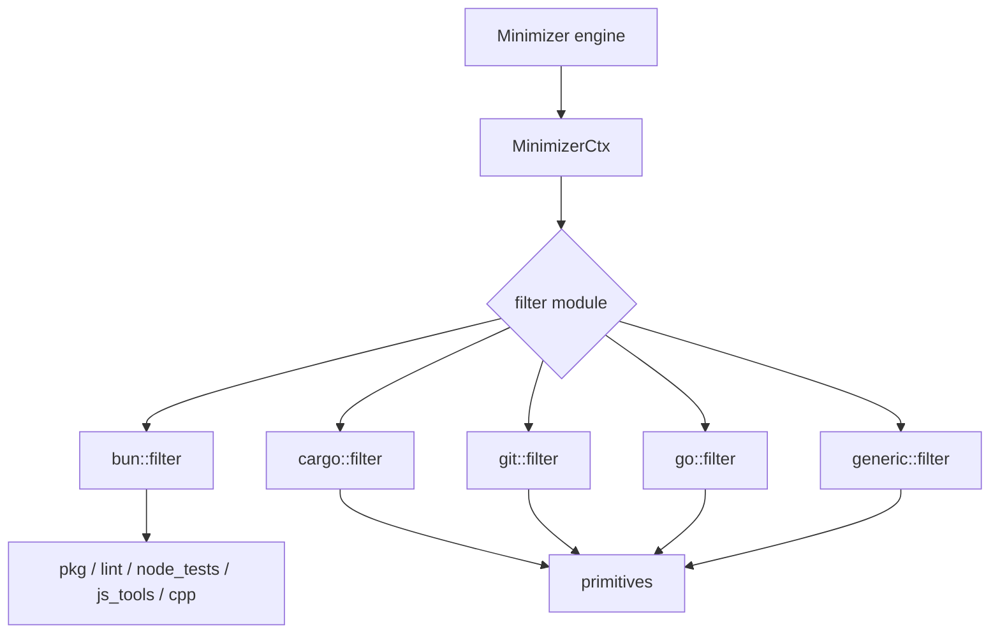

# Minimizer Filters

# Minimizer Filters

The `crates/pi-shell/src/minimizer/filters` module reduces noisy command output into developer-useful summaries while preserving diagnostics, failure context, and command results that must remain raw.

Each filter targets a command family such as `bun`, `cargo`, `git`, `go`, Docker/Kubernetes/Helm, cloud tools, or JavaScript tooling. The common pattern is:

- decide whether the command is supported with `supports(...)`
- route `filter(ctx, input, exit_code)` by `ctx.program`, `ctx.subcommand`, and sometimes `ctx.command`
- strip ANSI escape sequences with `primitives::strip_ansi`
- remove known progress or success noise
- preserve errors, warnings, failures, summaries, and relevant tables
- cap long output with `primitives::head_tail_lines`
- return either `MinimizerOutput::passthrough(input)` or `MinimizerOutput::transformed(text, input.len())`



## Core Contracts

Every command-specific filter works with the shared minimizer types:

- `MinimizerCtx<'_>` carries `program`, `subcommand`, `command`, and `config`.
- `MinimizerOutput` records the filtered text and whether output changed.
- `primitives` supplies reusable transforms such as:
  - `strip_ansi`
  - `strip_lines`
  - `dedup_consecutive_lines`
  - `head_tail_lines`
  - `group_by_file`
  - `compact_listing`
  - `truncate_line`

A filter should return passthrough when it makes no semantic change. Most filters compare the final `text` against `input` and choose `MinimizerOutput::passthrough` or `MinimizerOutput::transformed`.

## Routing Model

Filters use two routing layers:

1. A `supports(...)` function decides whether a command family should be buffered and minimized.
2. The module-local `filter(...)` function applies command-specific rules.

Some filters only inspect a subcommand:

```rust
pub fn supports(subcommand: Option<&str>) -> bool
```

Examples include `cargo::supports`, `docker::supports`, `git::supports`, and `gh::supports`.

Other filters need the executable name too:

```rust
pub fn supports(program: &str, subcommand: Option<&str>) -> bool
```

Examples include `bun::supports`, `cloud::supports`, `cpp::supports`, `dotnet::supports`, `go::supports`, `gt::supports`, and `js_tools::supports`.

The `bun` filter is the main cross-router. It recognizes package-manager commands, test commands, JavaScript tools, lint tools, and C++ tools, then delegates to the specialized module:

- `pkg::filter` for `bun install`, `bun add`, `bun update`, and other non-`run` / non-`exec` package subcommands
- `node_tests::filter` for `bun test`, `bunx jest`, `bunx vitest`, `bunx playwright`, and `bun run` commands containing those tools
- `lint::filter` for `tsc`, `eslint`, and `biome`
- `cpp::filter` for `cmake`, `ctest`, `ninja`, GoogleTest binaries, and wrapped C++ invocations
- `js_tools::filter` for `next`, `prettier`, and `prisma`
- `filter_bun_build` for direct `bun build`
- `generic::filter` as a fallback

## Bun Filters

`bun.rs` handles Bun as a package manager, test runner, build tool, and launcher for other tools.

Supported command groups are defined as constants:

- `BUN_PACKAGE_SUBCOMMANDS`
- `BUN_TEST_SUBCOMMANDS`
- `BUN_BUILD_SUBCOMMANDS`
- `BUN_TOOL_SUBCOMMANDS`
- `BUN_CPP_TOOL_SUBCOMMANDS`

`supports(program, subcommand)` returns true for:

- `bun install`, `bun add`, `bun run`, `bun exec`, `bun test`, `bun build`
- direct Bun tool forms such as `bun tsc`, `bun eslint`, `bun next`, `bun prisma`
- `bunx` tool forms such as `bunx vitest`, `bunx playwright`, `bunx cmake`

The key helper functions are:

- `is_non_exec_package_subcommand`
- `is_exec_package_subcommand`
- `is_test_invocation`
- `is_lint_invocation`
- `is_js_tool_invocation`
- `is_cpp_invocation`
- `command_contains_tool`
- `filter_bun_build`

`filter_bun_build` strips ANSI, removes Bun build progress lines, deduplicates consecutive output, and truncates with `head_tail_lines`. It keeps important lines on failure through `is_bun_build_noise` and `is_important`, where important lines contain terms such as `error`, `failed`, `warning`, or `panic`.

A direct `bun add eslint` still uses package filtering, not lint filtering. This avoids misclassifying package names as tool invocations.

## Cargo Filters

`cargo.rs` handles Rust build, test, formatting, metadata, and package-management output.

`cargo::supports` recognizes subcommands including:

- `build`
- `check`
- `test`
- `clippy`
- `nextest`
- `fmt`
- `doc`
- `bench`
- `run`
- `metadata`
- `tree`
- `update`
- `install`
- `publish`

`filter(ctx, input, exit_code)` dispatches by `ctx.subcommand`:

- `metadata` is raw passthrough because consumers often expect JSON.
- `test` and `bench` use `failures_only`.
- `nextest` uses `filter_nextest`.
- build-like commands use `condense_build`.
- `fmt` uses `condense_fmt`.
- package/listing commands use `compact_general`.

`condense_build` removes compile progress via `is_compiling_noise`, groups diagnostics by file with `group_by_file`, deduplicates lines, then applies a head/tail cap.

Successful `cargo test` output is summarized by `summarize_successful_test_run`, which parses `test result: ok.` lines into `CargoTestTotals`. It reports totals such as passed tests, suite count, warnings, filtered tests, and duration:

```text
cargo test: 262 passed (1 suite, 17 warnings)
```

Failed tests preserve failure blocks, `running` lines, `error:` diagnostics, thread panic lines, and `test result: FAILED` summaries.

`filter_nextest` removes pass noise and compile noise, keeps `FAIL ...` blocks, preserves cancellation status, and appends the `Summary [...]` line when present.

## Cloud and Data Filters

`cloud.rs` handles `aws`, `curl`, `wget`, and `psql`.

`cloud::supports(program, _)` accepts:

- `aws`
- `curl`
- `wget`
- `psql`

Transfer-heavy tools use `strip_transfer_progress`, which removes curl and wget progress indicators while preserving actual response bodies. Detection is handled by `is_transfer_progress_line` and `looks_like_wget_transfer_progress`.

`filter_psql` supports three output shapes:

- standard psql tables via `looks_like_psql_table` and `compact_psql_table`
- expanded records via `looks_like_psql_expanded` and `compact_psql_expanded`
- JSON-like or plain text via `compact_jsonish_or_text`

Important database diagnostics are preserved by `preserve_important_lines`. `is_important_line` keeps lines beginning with signals such as `ERROR`, `FATAL`, `PANIC`, `DETAIL`, `HINT`, `LINE`, `SQLSTATE`, and `AN ERROR OCCURRED`.

Tables are normalized with `normalize_pipe_row`, converting pipe-delimited rows into tab-separated rows. Long psql tables keep the header, up to `MAX_PSQL_ROWS`, row-count footers, and an omission count.

## C++ Tool Filters

`cpp.rs` handles CMake, CTest, Ninja, and GoogleTest-style output.

The internal enum `CppTool` identifies the active tool:

- `CppTool::CMake`
- `CppTool::CTest`
- `CppTool::Ninja`
- `CppTool::GTest`

Routing starts with `direct_tool(ctx.program)` and falls back to `invocation_tool(ctx.command)`. This allows wrapped commands such as:

```text
bun run ctest --output-on-failure
bun run ./build/foo_test --gtest_filter=Foo.*
```

Important functions:

- `supports`
- `supports_invocation`
- `is_gtest_binary_name`
- `filter_cmake`
- `filter_ctest`
- `filter_ninja`
- `filter_gtest`
- `finish_filtered`

`is_gtest_binary_name` recognizes direct names like `gtest` and `gtest-parallel`, plus binaries ending in `_test`, `_tests`, `-test`, `-tests`, or a `.test` extension.

Each tool strips success/progress noise but keeps diagnostics when `exit_code != 0`. `finish_filtered` deduplicates filtered output, returns a success message such as `cmake: ok` or `ctest: ok` when output is empty and the command succeeded, and falls back to head/tail output when a failed command produced no recognized diagnostics.

## Docker, Kubernetes, and Helm Filters

`docker.rs` handles container and cluster command output for `docker`, `kubectl`, and `helm`.

Supported subcommands include:

- `ps`
- `images`
- `logs`
- `compose`
- `build`
- `pull`
- `push`
- `get`
- `describe`
- `status`
- `list`
- `ls`
- `install`
- `upgrade`
- `template`
- `lint`

`filter_docker` preserves full output for failing non-log commands. Successful table commands use `compact_table`, build/progress commands use `compact_build_or_progress`, and log commands use `filter_logs`.

`filter_kubectl` preserves full diagnostics for failing non-log commands. `kubectl logs` is still compacted through `filter_logs`, `kubectl get` uses table compaction, and `kubectl describe` gets deduplication plus head/tail truncation.

`filter_helm` preserves full failed output. Successful `helm list`, `helm ls`, and `helm status` compact tables, while install/upgrade/template/lint commands strip build/progress noise.

`filter_logs` collapses repeated blank lines, deduplicates consecutive log lines, then applies a head/tail cap.

## Generic Filter

`generic.rs` is the fallback for commands without specialized logic.

`generic::filter`:

1. strips ANSI
2. deduplicates consecutive repeated lines
3. truncates only when the output has more than 200 lines

It uses a conservative strategy because it does not know the command’s semantics.

## GitHub CLI Filter

`gh.rs` handles GitHub CLI output.

`gh::supports` recognizes subcommands such as:

- `pr`
- `issue`
- `run`
- `workflow`
- `repo`
- `api`
- `search`
- `release`
- `codespace`
- `gist`

Some command shapes intentionally preserve raw output through `preserves_raw_mode`:

- `gh api ...`
- `gh run view ... --log`
- `gh run view ... --log-failed`
- `gh run view ... --json`
- `gh pr diff ...`
- `gh pr status --web`
- `gh pr status --jq`
- `gh pr status --template`
- `gh pr view ... --json`
- `gh pr view ... --jq`
- `gh pr view ... --comments`
- equivalent `issue view` JSON/comment modes

For PR and issue text, `filter_pr_issue` removes markdown template noise with `filter_markdown_noise`, including HTML comments, badges/images, and horizontal rules.

For runs and workflows, `filter_run` deduplicates output and keeps a larger tail when the command failed or contains failure signals.

## Git Filter

`git.rs` handles common Git commands while protecting raw content paths.

Supported subcommands include:

- `diff`
- `show`
- `log`
- `add`
- `commit`
- `push`
- `pull`
- `branch`
- `fetch`
- `stash`
- `worktree`
- `merge`
- `rebase`
- `checkout`
- `switch`
- `restore`
- `clean`
- `reset`
- `tag`

Raw passthrough is used for content-sensitive commands:

- `git show HEAD:path/to/file`
- `git stash show -p`

`condense_log` parses commit entries into short hashes and subjects. It removes author/date/stat noise and emits omission counts for long histories.

`condense_diff` parses unified diffs with `parse_unified_diff`, builds a compact file stat section, then includes sampled hunks and changed lines. It tracks additions and deletions in `DiffFile` and `DiffHunk`, truncating individual changed lines with `primitives::truncate_line`.

For branch, stash, and tag listings, the filter uses `primitives::compact_listing`. Noisy command output such as fetch/push/pull is deduplicated and truncated with `condense_noisy_output`.

## Go Toolchain Filters

`go.rs` handles `go`, `go tool golangci-lint`, and direct `golangci-lint`.

`go::supports` recognizes:

- `go test`
- `go build`
- `go vet`
- `go tool`
- `golangci-lint`
- `golangci-lint run`

`filter` routes `golangci-lint` first, including the wrapped form detected by `is_go_tool_golangci_lint`.

`filter_go_test` handles both regular test output and `go test -json` output. JSON lines are rendered by `render_go_test_json_line`, which converts events into normal test lines such as:

```text
--- FAIL: TestBad
FAIL	example.com/app
ok	example.com/app
```

On success, `should_keep_go_test_line` keeps pass, skip, `ok`, and `?` package summary lines. On failure, it keeps failing tests, panic lines, package build headers, Go file locations, expected/actual assertions, timeout/signal lines, and nearby follow-up context after location lines.

`filter_go_build` and `filter_go_vet` preserve Go diagnostics, module errors, and file-location lines, grouping by file before truncation.

`filter_golangci_lint` supports JSON and text output. JSON summaries are produced by `summarize_golangci_json`, which emits issue count and rows in this shape:

```text
main.go:7:2: unreachable code (govet)
```

## Graphite Filter

`gt.rs` handles Graphite CLI output and reuses the Git filter for Git-like subcommands.

Supported `gt` subcommands include:

- `log`
- `submit`
- `sync`
- `restack`
- `create`
- `branch`
- `diff`
- `show`
- `add`
- `push`
- `pull`
- `fetch`
- `stash`
- `worktree`

`gt log short` is passthrough because it is already compact. Other `gt log` output is compacted by `compact_log`, which:

- detects graph nodes with `is_graph_node`
- removes email fragments with `remove_email_fragments`
- truncates long graph lines with `trim_line`
- limits graph entries and reports omitted entries

For Git-like subcommands, `gt::filter` constructs a `MinimizerCtx` with `program: "git"` and delegates to `git::filter`.

Submit/sync/restack/create commands use `compact_noisy_command`, which removes Git transport progress noise via `is_progress_noise`, drops low-value success status lines through `is_low_value_status`, and keeps meaningful summaries or errors.

## JavaScript Tool Filters

`js_tools.rs` handles JavaScript framework/tool output that is not already covered by package, test, or lint filters.

Supported direct tools:

- `next`
- `prettier`
- `prisma`

`effective_tool(program, subcommand)` also recognizes routed invocations through:

- `bun next`
- `bun prettier`
- `bun prisma`
- `npx prettier`
- `npx prisma`
- `npx tsc`
- `npx eslint`
- `bunx` equivalents
- `pnpm dlx` equivalents

For `bun run` and `bun exec`, `effective_tool_from_command` scans the full command for supported tools.

`filter_next` removes spinner/progress/build noise while preserving:

- errors and warnings
- build summaries
- route table headers
- route rows and legends
- failure output on non-zero exit codes

`filter_prettier` summarizes check and write modes. It reports files needing formatting, files written, or Prettier errors. It recognizes file paths through `looks_like_file` and write lines through `looks_like_prettier_write_line`.

`filter_prisma` strips Prisma banners, schema-load messages, tips, generated box art, and import suggestions. It preserves migration status, generated client results, schema-change sections, drift/errors/warnings, and non-spinner failure details.

## Lint Filters

`lint.rs` handles type-checker and linter output.

The visible public entry points are:

- `supports`
- `supports_program`
- `filter`
- `condense_lint_output`

`supports_program` recognizes explicit programs such as `ruff`, `mypy`, and `rubocop`, plus generic lint-like subcommands such as `check`, `lint`, `run`, `format`, `fmt`, and `typecheck`.

`condense_lint_output` strips ANSI, removes linter success/progress noise with `strip_lint_noise`, groups diagnostics with `group_diagnostics`, and caps the result.

`is_lint_noise` is careful not to drop diagnostic lines on failure. When `exit_code != 0` and `contains_diagnostic_signal(line)` is true, the line is preserved even if it resembles a normally noisy line.

## Cross-Module Reuse

The filters are intentionally composable:

- `bun::filter` delegates to `pkg`, `node_tests`, `lint`, `cpp`, and `js_tools`.
- `bun::is_cpp_invocation` calls `cpp::supports_invocation`.
- `gt::filter` delegates Git-like Graphite commands to `git::filter`.
- `js_tools::effective_tool_from_command` supports wrapped Bun script execution.
- `go::filter` detects `go tool golangci-lint` and routes it to `filter_golangci_lint`.
- `cpp::filter` detects direct tools and wrapped invocations using `direct_tool`, `invocation_tool`, and `command_tokens`.

This keeps command-family knowledge local while allowing wrappers like `bun run`, `bunx`, `go tool`, and `gt diff` to still reach the most specific filter.

## Preservation Rules

The module prioritizes useful failure information over maximum compression.

Common preservation patterns:

- raw JSON-like contract output is passed through when consumers may parse it, such as `cargo metadata` and `gh api`
- diffs and patch content remain raw for `gh pr diff`, `git stash show -p`, and file-content `git show`
- failing Docker/Kubernetes/Helm table commands preserve full diagnostics
- failed build/test filters keep lines containing errors, warnings, failures, panic/fatal signals, source locations, summaries, and nearby context
- psql output preserves row-count footers and database diagnostic lines
- successful noisy commands are aggressively compacted into summaries or important tables

When adding a new filter, first decide what output is machine-readable or content-sensitive and should remain passthrough. Then add the narrowest noise removal needed for the command’s human-facing progress output.