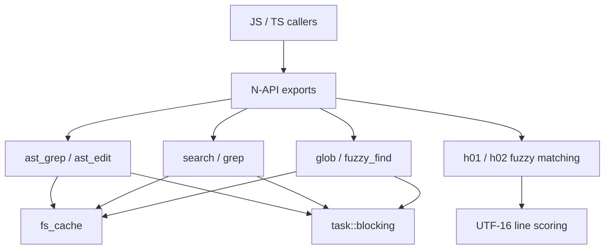

# Native Code Intelligence and Text Processing

# Native Code Intelligence and Text Processing

This module is the Rust/N-API native layer behind fast code discovery, structural search, fuzzy matching, and text-oriented search operations. It lives under `crates/pi-natives/src/` and exposes async JavaScript-facing functions through `#[napi]`, while keeping CPU-heavy work off the JS event loop through `task::blocking`.

The main responsibilities are:

- AST-aware structural search and rewrite via `ast_grep` and `ast_edit`
- Filesystem discovery via `glob` and `fuzzy_find`
- Shared directory scan caching through `fs_cache`
- Regex content search through `search` / `grep`
- Fuzzy text block matching for edit application through `h01_find_best_fuzzy_match` and `h02_score_sequence_fuzzy`
- Shared glob normalization through `glob_util`



## Execution Model

Native entrypoints are exported with `#[napi]` and return either direct result objects or `task::Promise<T>`.

Long-running filesystem and parsing operations use:

- `task::CancelToken::new(timeout_ms, signal)`
- `task::blocking("operation_name", ct, move |ct| { ... })`
- periodic `ct.heartbeat()?` checks inside loops

This pattern is used by:

- `ast_grep`
- `ast_edit`
- `glob`
- `fuzzy_find`
- `grep`

The cancellation token is checked during candidate collection, filesystem walking, pattern compilation, parsing, matching, and rewrite application. Timeout and abort behavior therefore propagates through the native worker rather than being handled only at the JS boundary.

## Shared Filesystem Scan Cache

`fs_cache.rs` is the shared directory discovery layer used by `glob`, `fuzzy_find`, `grep`, and `ast` candidate collection.

### Core Types

`FileType` represents normalized filesystem kinds:

- `File`
- `Dir`
- `Symlink`

`GlobMatch` is the shared entry shape:

```rust
pub struct GlobMatch {
	pub path:      String,
	pub file_type: FileType,
	pub mtime:     Option<f64>,
	pub size:      Option<f64>,
}
```

Paths are relative to the search root and normalized to `/` separators by `normalize_relative_path`.

### Scan Options

`ScanOptions` controls traversal:

```rust
pub struct ScanOptions {
	pub include_hidden:    bool,
	pub use_gitignore:     bool,
	pub skip_node_modules: bool,
	pub follow_links:      bool,
	pub detail:            ScanDetail,
}
```

`ScanDetail::Minimal` collects only path and file type. `ScanDetail::Full` also collects `mtime` and `size`. Callers choose `Full` only when needed, such as `glob` with `sort_by_mtime`.

### Cache Policy

The cache is a process-global `DashMap<CacheKey, CacheEntry>` keyed by root and scan options. It is controlled by environment-backed constants:

- `FS_SCAN_CACHE_TTL_MS`, default `1000`
- `FS_SCAN_EMPTY_RECHECK_MS`, default `200`
- `FS_SCAN_CACHE_MAX_ENTRIES`, default `16`
- `PI_GREP_WORKERS`, default `4`

`get_or_scan` returns cached entries when the entry is still inside the TTL. It also reports `cache_age_ms`, allowing callers to retry stale empty results.

`force_rescan` bypasses the cache and optionally stores the fresh result.

`invalidate_fs_scan_cache` is the N-API invalidation hook. With a path, it removes cache entries whose root contains the changed file. Without a path, it clears the full cache. It is intended to run after agent file mutations such as write, edit, rename, or delete.

### Traversal Semantics

`build_walker` uses `ignore::WalkBuilder` and always skips `.git`. It skips `node_modules` when `skip_node_modules` is true. This pruning happens during traversal, not only after collection.

`collect_entries` runs the walker in parallel, collects entries from `EntryVisitor`, sorts them deterministically by path, and checks cancellation every 128 visited entries.

## Glob Discovery

`glob.rs` exposes filesystem glob matching through `glob`.

### Public API Shape

`GlobOptions` includes:

- `pattern`
- `path`
- `file_type`
- `recursive`
- `hidden`
- `max_results`
- `gitignore`
- `cache`
- `sort_by_mtime`
- `include_node_modules`
- `signal`
- `timeout_ms`

`GlobResult` returns:

```rust
pub struct GlobResult {
	pub matches:       Vec<GlobMatch>,
	pub total_matches: u32,
}
```

### How `glob` Works

`glob` normalizes an empty pattern to `"*"`, builds a cancellation token, and runs `run_glob` on a blocking worker.

`run_glob`:

1. Compiles the pattern with `glob_util::compile_glob`.
2. Builds `fs_cache::ScanOptions`.
3. Uses `fs_cache::get_or_scan` when `cache` is true, otherwise `force_rescan`.
4. Filters entries with `filter_entries`.
5. Optionally retries with `force_rescan` when cached results are empty and stale.
6. Sorts by descending `mtime` if `sort_by_mtime` is enabled.
7. Truncates to `max_results`.

`filter_entries` applies:

- `.git` / `node_modules` policy through `fs_cache::should_skip_path`
- glob matching through `GlobSet`
- optional file type filtering
- optional streaming callback through `ThreadsafeFunction<GlobMatch>`

Symlinks are handled carefully. If a caller filters for files or directories, `apply_file_type_filter` resolves symlink targets with `resolve_symlink_target_type` and reports the effective type when the target matches.

## Glob Pattern Utilities

`glob_util.rs` centralizes glob normalization for both `glob` and AST candidate filtering.

`build_glob_pattern` performs three transformations:

1. Replaces `\` with `/`.
2. Adds a `**/` prefix for recursive simple patterns.
3. Repairs unclosed brace groups through `fix_unclosed_braces`.

Examples from the behavior:

```rust
build_glob_pattern("*.ts", true)        // "**/*.ts"
build_glob_pattern("src/*.ts", true)    // "src/*.ts"
build_glob_pattern("**/*.rs", true)     // "**/*.rs"
build_glob_pattern("*.{ts,tsx,js", true) // "**/*.{ts,tsx,js}"
```

`compile_glob` returns a `GlobSet`.

`try_compile_glob` accepts `Option<&str>` and returns `Ok(None)` for missing or blank input. `ast.rs` uses this form for optional path filters.

## Fuzzy File Discovery

`fd.rs` exposes `fuzzy_find` to support autocomplete and file mention resolution.

The JavaScript export name is `fuzzyFind`:

```rust
#[napi(js_name = "fuzzyFind")]
pub fn fuzzy_find(options: FuzzyFindOptions<'_>) -> task::Promise<FuzzyFindResult>
```

### Matching Strategy

`normalize_fuzzy_text` lowercases text and removes whitespace plus path punctuation:

- `/`
- `\`
- `.`
- `_`
- `-`

`score_fuzzy_path` prefers basename matches for plain queries. This avoids broad ancestor-directory matches, so a query like `plan` does not surface every file under a directory containing `plan`.

Scoring priority is:

1. Exact basename match: `120`
2. Basename prefix: `100`
3. Basename contains query: `80`
4. Basename fuzzy subsequence: `50 + fuzzy score`
5. Path contains query, only when query includes `/`: `60`
6. Full-path fuzzy fallback for path-style queries: `30 + fuzzy score`
7. Directory bonus: `+10`

`fuzzy_subsequence_score` requires all query characters to appear in order and penalizes gaps.

### Cache Behavior

`fuzzy_find_sync` uses `fs_cache` with:

```rust
ScanOptions {
	include_hidden,
	use_gitignore: respect_gitignore,
	skip_node_modules: true,
	follow_links: true,
	detail: fs_cache::ScanDetail::Minimal,
}
```

If `cache` is true and a cached scan produces no matches for a non-empty query, it performs the same stale-empty recheck pattern as `glob`.

Results are sorted by descending score and then ascending path.

## AST Structural Search and Rewrite

`ast.rs` provides AST-aware code intelligence through ast-grep and the shared `pi_ast` language support layer.

### Language and Strictness

`AstMatchStrictness` maps directly to `ast_grep_core::MatchStrictness`:

- `Cst`
- `Smart`
- `Ast`
- `Relaxed`
- `Signature`
- `Template`

`resolve_strictness` defaults to `MatchStrictness::Smart`.

Language handling delegates to `pi_ast::ops`:

- `resolve_supported_lang`
- `resolve_language`
- `is_supported_file`
- `compile_pattern`
- `apply_edits`

This keeps language aliases, extension inference, ast-grep compilation, and edit application consistent with the shared AST package.

### Candidate Collection

`collect_candidates` accepts an optional `path` and optional `glob`.

For a single file, it returns one `FileCandidate`.

For a directory, it:

1. Resolves and canonicalizes the root.
2. Compiles the optional glob with `glob_util::try_compile_glob`.
3. Scans with `fs_cache::get_or_scan`.
4. Skips `.git` and `node_modules` unless the glob mentions `node_modules`.
5. Applies the glob filter.
6. Retries with `force_rescan` when the cached scan produced no files and is old enough.
7. Sorts candidates by display path.

The resulting `FileCandidate` stores both the absolute filesystem path and the display path returned to callers.

### `ast_grep`

`ast_grep` searches files using one or more ast-grep patterns.

`AstFindOptions` includes:

- `patterns`
- `lang`
- `path`
- `glob`
- `selector`
- `strictness`
- `limit`
- `offset`
- `include_meta`
- `context`
- `signal`
- `timeout_ms`

`normalize_pattern_list` trims, deduplicates, and rejects empty pattern lists.

The find flow is:

1. Normalize patterns.
2. Resolve strictness.
3. Validate explicit language if provided.
4. Collect filesystem candidates.
5. Filter unsupported files with `is_supported_file`.
6. Resolve candidate languages through `resolve_candidates_for_find`.
7. Compile each pattern per language through `compile_find_patterns`.
8. Parse each file with `language.ast_grep(source)`.
9. Run each compiled pattern with `find_all`.
10. Collect ranges, line/column coordinates, text, and optional meta-variable bindings.
11. Sort results deterministically.
12. Apply `offset` and `limit`.

`AstFindResult` reports both the visible page and aggregate statistics:

```rust
pub struct AstFindResult {
	pub matches:            Vec<AstFindMatch>,
	pub total_matches:      u32,
	pub files_with_matches: u32,
	pub files_searched:     u32,
	pub limit_reached:      bool,
	pub parse_errors:       Option<Vec<String>>,
}
```

Parse errors and pattern compile errors are non-fatal. They are accumulated in `parse_errors` so callers can show partial results with diagnostics.

When `include_meta` is true, `ast_grep` returns `matched.get_env()` as `meta_variables`.

### `ast_edit`

`ast_edit` applies ast-grep rewrite rules.

`AstReplaceOptions` includes:

- `rewrites`
- `lang`
- `path`
- `glob`
- `selector`
- `strictness`
- `dry_run`
- `max_replacements`
- `max_files`
- `fail_on_parse_error`
- `signal`
- `timeout_ms`

`normalize_rewrite_map` rejects empty pattern keys and sorts rewrite rules by pattern string for deterministic behavior.

Unlike `ast_grep`, `ast_edit` requires a single effective language. If `lang` is omitted, `infer_single_replace_lang` checks all candidates and fails when:

- no files match
- any file language cannot be inferred
- candidates contain multiple languages

This prevents applying rewrite templates across mixed syntax trees.

The rewrite flow is:

1. Normalize rewrite rules.
2. Resolve strictness.
3. Normalize `dry_run`, `max_replacements`, `max_files`, and `fail_on_parse_error`.
4. Collect and language-filter candidates.
5. Resolve one effective language.
6. Compile rewrite patterns.
7. Parse each file.
8. Find matches for each compiled rule.
9. Build `PendingFileChange` records with ast-grep `Edit<String>`.
10. Stop when replacement or file limits are reached.
11. If `dry_run` is false, call `apply_edits` and write changed files.
12. Return replacement records and per-file counts.

`dry_run` defaults to true, so callers must explicitly opt into writes.

`AstReplaceResult.applied` is `false` for dry runs and `true` when disk writes were allowed. It does not mean every candidate changed; the actual changed count is in `total_replacements` and `file_changes`.

## Regex Search and Grep

`grep.rs` provides two layers:

- `search` for in-memory content search
- `grep` for filesystem search

Both use `grep_regex` and `grep_searcher`.

### Output Modes

`GrepOutputMode` maps JS string values to native behavior:

- `"content"`: return matching lines and optional context
- `"count"`: return counts
- `"filesWithMatches"`: return one row per matching file

Internally this is converted to `OutputMode` by `parse_output_mode`.

### Search Collection

`MatchCollector` implements `grep_searcher::Sink`.

It tracks:

- total match count
- skipped matches for global `offset`
- collected matches after offset
- optional `max_count`
- before/after context
- line truncation state
- whether collection is enabled for the selected output mode

`run_search_slice` builds a `Searcher`, attaches a `MatchCollector`, and returns `SearchResultInternal`.

`truncate_line` truncates long lines at a valid UTF-8 boundary and appends `...`.

`bytes_to_trimmed_string` accepts UTF-8 when possible and falls back to lossy decoding.

### Filesystem Grep

Filesystem grep uses the same scan cache and glob utilities as the rest of the module.

Relevant internal pieces include:

- `GrepConfig`
- `collect_files`
- `resolve_type_filter`
- `matches_type_filter`
- `read_file_bytes`
- `push_content_matches`
- `to_grep_match`

`resolve_type_filter` supports common language aliases such as:

- `js` / `javascript`
- `ts` / `typescript`
- `json`
- `yaml` / `yml`
- `md` / `markdown`
- `py` / `python`
- `rs` / `rust`
- `go`
- `java`
- `kt` / `kotlin`
- `c`
- `cpp`
- `cs` / `csharp`
- `php`
- `rb` / `ruby`
- `sh` / `bash`
- `docker` / `dockerfile`
- `make` / `makefile`

Unknown type filters are treated as custom extensions.

`read_file_bytes` skips non-files, inaccessible files, and files larger than `MAX_FILE_BYTES` (`4 MiB`). Small files up to `SMALL_FILE_READ_BYTES` (`128 KiB`) are read into memory. Larger accepted files are memory-mapped with `memmap2` when possible, falling back to owned bytes.

### Regex Pattern Tolerance

The grep layer includes helpers that make literal-ish user input less fragile:

- `sanitize_braces`
- `escape_unescaped_parentheses`

`sanitize_braces` preserves valid repetition quantifiers such as `a{2,4}` and Unicode/hex brace escapes such as `\p{Greek}` or `\x{41}`. Non-quantifier braces like `${platform}` are escaped so they search as literals rather than failing regex compilation.

`escape_unescaped_parentheses` is used after invalid group syntax errors to preserve common literal searches such as `fetchAnthropicProvider(`.

## Fuzzy Edit Matching

`edit_fuzzy.rs` contains native fuzzy matching used for locating edit targets in text.

It operates on UTF-16 units because the exported N-API functions accept `JsString` and because JS string indexing is UTF-16 based.

### Public Result Types

`H01BestFuzzyMatch` returns:

```rust
pub struct H01BestFuzzyMatch {
	pub actual_text: String,
	pub start_index: u32,
	pub start_line:  u32,
	pub confidence:  f64,
}
```

`H01BestFuzzyMatchResult` adds ambiguity metadata:

```rust
pub struct H01BestFuzzyMatchResult {
	pub best:                  Option<H01BestFuzzyMatch>,
	pub above_threshold_count: u32,
	pub second_best_score:     f64,
}
```

`H02SequenceFuzzyResult` is line-sequence oriented:

```rust
pub struct H02SequenceFuzzyResult {
	pub index:             Option<u32>,
	pub confidence:        f64,
	pub match_count:       u32,
	pub match_indices:     Vec<u32>,
	pub second_best_score: f64,
}
```

### Normalization

A `Line<'a>` wraps a UTF-16 slice and provides:

- `is_empty_trim`
- `leading_indent`
- `trimmed_bounds`

Whitespace detection uses `is_js_trim_whitespace`, which mirrors JavaScript trim whitespace rather than only ASCII whitespace.

`normalize_line` trims, collapses spaces/tabs, and maps only selected quote and dash variants. The implementation intentionally mirrors the TypeScript fuzzy normalizer:

- maps `U+201E`, `U+201F`, `«`, `»` to `"`
- maps `U+201A`, `U+201B`, `` ` ``, `´` to `'`
- maps dash variants to `-`
- does not lowercase
- does not map curly single or double quotes outside the listed set

For block matching, `normalize_block_lines` can prefix each line with relative indentation depth. This helps distinguish structurally similar code at different nesting levels.

### Similarity Algorithms

`FuzzyPattern` chooses between:

- `MyersPattern` for patterns up to 128 UTF-16 units
- dynamic-programming Levenshtein for empty or longer patterns

`MyersPattern` uses a bit-parallel edit distance implementation over `u128` masks. This keeps common short-line comparisons fast.

`similarity` returns:

```rust
1.0 - distance / max_len
```

### `h01_find_best_fuzzy_match`

`h01_find_best_fuzzy_match` searches a full content string for the best matching block.

The function:

1. Converts `content` and `target` to UTF-16.
2. Removes trailing NUL units from N-API string conversion.
3. Enforces `PI_NATIVE_MAX_FUZZY_UNITS`, default `16 MiB` worth of UTF-16 units.
4. Splits content and target into lines.
5. Rejects empty targets or targets longer than content.
6. Scores either one-line windows with `best_core_one_line` or multi-line windows with `best_core`.
7. Uses indentation-aware normalization first.
8. If the best indentation-aware score is below the requested threshold but at least `FALLBACK_THRESHOLD` (`0.8`), retries without depth prefixes.
9. Returns the best match, threshold count, and second-best score.

This two-pass strategy keeps indentation sensitivity for code edits while still recovering when indentation changed but text is otherwise a good match.

### `h02_score_sequence_fuzzy`

`h02_score_sequence_fuzzy` scores a sequence of lines against a pattern.

Inputs:

- `lines`
- `pattern`
- `start`
- `eof`

When `eof` is true, it starts from the last possible index, then wraps back to `start`. This supports edit matching near end-of-file while still finding earlier candidates if needed.

A window counts as a match when its average confidence is at least `SEQUENCE_FUZZY_THRESHOLD` (`0.92`). The function records up to `MAX_RECORDED_MATCHES` (`5`) indices.

## Structural Relationships

The module is intentionally layered around shared primitives:

- `fs_cache` owns filesystem traversal, ignore behavior, cache TTLs, metadata collection, and invalidation.
- `glob_util` owns glob pattern normalization and compilation.
- `glob`, `fd`, `grep`, and `ast` consume `fs_cache` instead of each implementing their own walkers.
- `ast` delegates language resolution and edit application to `pi_ast::ops`.
- `grep` delegates regex search mechanics to `grep_searcher` and `grep_regex`.
- exported async operations use `task::blocking` and cancellation tokens consistently.
- numeric counts exposed over N-API are clamped with helpers such as `crate::utils::clamp_u32` or local `to_u32`.

This keeps behavior consistent across user-facing tools. For example, `glob`, `fuzzy_find`, `grep`, and `ast_grep` all share the same default bias toward skipping `.git` and avoiding `node_modules` unless explicitly requested.

## Error Handling and Partial Results

The module distinguishes between fatal setup errors and non-fatal per-file errors.

Fatal errors include:

- invalid search root
- invalid glob pattern
- invalid or unsupported explicit language
- missing required `patterns` or `rewrites`
- mixed-language `ast_edit` without explicit `lang`
- cancellation or timeout

Non-fatal errors are accumulated where partial results are still useful:

- `ast_grep` collects language, file read, pattern compile, and parse issues in `parse_errors`.
- `ast_edit` collects compile, read, and parse issues when `fail_on_parse_error` is false.
- `grep` skips inaccessible or oversized files where appropriate.

`ast_edit` exposes `fail_on_parse_error` so callers can choose between best-effort rewrite previews and strict all-or-nothing behavior.

## Contributor Notes

When adding or changing a discovery feature, prefer reusing `fs_cache` and `glob_util` instead of adding a new walker or glob parser. This preserves ignore semantics, cache invalidation, path normalization, and cancellation behavior.

When adding a native async operation, follow the existing shape:

```rust
let ct = task::CancelToken::new(timeout_ms, signal);
task::blocking("operation_name", ct, move |ct| {
	ct.heartbeat()?;
	// work
})
```

When returning counts to JS, clamp to `u32` using the existing helpers. Avoid exposing `usize` or unchecked casts in public N-API result objects.

When matching or rewriting source code structurally, route through `pi_ast::ops` for language support and ast-grep compilation. `ast_edit` deliberately requires a single effective language unless the caller provides `lang`; keep that constraint unless the rewrite engine is changed to compile and apply rules per language.

When changing fuzzy matching, preserve the UTF-16 indexing contract. `h01_find_best_fuzzy_match.start_index` and related scoring behavior are designed to match JavaScript string semantics, not Rust byte offsets.