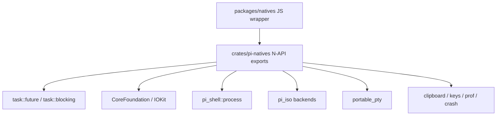

# Native OS Integration

# Native OS Integration

The native OS integration layer lives in `crates/pi-natives` and exports Rust-backed system capabilities to JavaScript through N-API. It is the bridge between `packages/natives` and platform APIs for clipboard access, macOS appearance and power state, process control, PTY execution, filesystem isolation, terminal key decoding, crash diagnostics, and lightweight profiling.

This module keeps OS-specific work behind small N-API surfaces. JavaScript callers get typed functions, classes, promises, and callback handles; Rust owns the unsafe FFI, blocking syscalls, process-tree handling, and platform fallbacks.



## Public Export Boundary

`src/lib.rs` is the native package root. It exports the modules used by the JavaScript loader and includes a release sentinel:

```rust
#[napi(js_name = "__piNativesV0_5_3")]
pub const fn pi_natives_version_sentinel() {}
```

The sentinel is intentionally versioned. The JS loader computes the expected symbol from `package.json#version` and rejects a stale `.node` binary if the symbol is missing. This prevents silent runtime crashes after partial or locked-file updates.

The module also exposes `native_build_info()` from `build_info.rs`, returning:

```rust
pub struct BuildInfo {
  pub version: String,
  pub language_set: String,
}
```

`language_set` reports `"full"` when the Rust crate is built with the `full-langs` feature, otherwise `"default"`.

## Build-Time Native Data

`build.rs` performs two setup tasks:

1. Calls `napi_build::setup()` so the crate builds correctly as a N-API addon.
2. Runs `generate_minimizer_builtin_filters()`.

`generate_minimizer_builtin_filters()` reads all `.toml` files from:

```text
src/shell/minimizer/defs
```

It sorts them, strips duplicate `schema_version` lines from individual files, and writes one generated `builtin_filters.toml` into Cargo `OUT_DIR`. It also emits `cargo:rerun-if-changed` directives for the definition directory and each source file, so Cargo rebuilds the generated data when filter definitions change.

## macOS Appearance Detection

`appearance.rs` exports two related APIs:

```rust
detect_macos_appearance() -> Option<MacOSAppearance>
MacAppearanceObserver::start(callback) -> Result<MacAppearanceObserver>
```

The JavaScript name for synchronous detection is `detectMacOSAppearance`.

`MacOSAppearance` is a N-API string enum:

```rust
pub enum MacOSAppearance {
  Dark,
  Light,
}
```

On macOS, `detect_appearance()` calls CoreFoundation directly:

1. Creates the `AppleInterfaceStyle` key with `CFStringCreateWithCString`.
2. Reads the value with `CFPreferencesCopyAppValue`.
3. Treats a missing key as light mode.
4. Type-checks the result with `CFGetTypeID`.
5. Converts a `CFStringRef` with `cf_string_to_string`.
6. Returns `Dark` only when the native value is exactly `"Dark"`.

On non-macOS platforms, `detect_macos_appearance()` returns `None`.

`MacAppearanceObserver` is a long-lived handle. On macOS, `MacAppearanceObserver::start()` creates an `ObserverInner` that owns a background thread and CoreFoundation run loop. The thread registers for `AppleInterfaceThemeChangedNotification` through `CFNotificationCenterGetDistributedCenter`, installs a fallback `CFRunLoopTimer`, and immediately reports the initial appearance.

The observer uses `CallbackCtx::report_if_changed()` to deduplicate events. Both the notification callback and the 2-second polling timer call the same method, so JavaScript receives one callback per actual appearance value, not one callback per native signal.

Stopping is explicit and automatic:

```rust
MacAppearanceObserver::stop()
Drop for ObserverInner
```

`ObserverInner::stop()` calls `CFRunLoopStop()` through a `SendableRunLoop` wrapper, then joins the background thread. Cleanup removes the distributed notification observer, invalidates the timer, releases CoreFoundation objects, and reclaims the boxed callback context.

## Clipboard Integration

`clipboard.rs` wraps `arboard` for system clipboard access.

```rust
copy_to_clipboard(text: String) -> Result<()>
read_image_from_clipboard() -> task::Promise<Option<ClipboardImage>>
```

`copy_to_clipboard()` is synchronous. This is deliberate: on macOS, pasteboard writes should happen on the caller thread to avoid AppKit pasteboard warnings in CLI contexts.

`read_image_from_clipboard()` uses `task::blocking("clipboard.read_image", ...)` because image retrieval and PNG encoding can block. It returns:

```rust
pub struct ClipboardImage {
  pub data: Uint8Array,
  pub mime_type: String,
}
```

When an image is available, `encode_png()` converts `arboard::ImageData` into an `image::RgbaImage`, wraps it as `DynamicImage::ImageRgba8`, and writes PNG bytes into memory. `ClipboardError::ContentNotAvailable` is mapped to `Ok(None)`; access and encoding failures become N-API errors.

## macOS Power Assertions

`power.rs` exposes `MacOSPowerAssertion`, a cross-platform handle for preventing sleep. On macOS it uses IOKit; elsewhere it is a no-op.

```rust
MacOSPowerAssertion::start(options) -> Result<MacOSPowerAssertion>
MacOSPowerAssertion::stop(&mut self) -> Result<()>
```

Options are provided through `MacOSPowerAssertionOptions`:

```rust
pub struct MacOSPowerAssertionOptions {
  pub reason: Option<String>,
  pub idle: Option<bool>,
  pub system: Option<bool>,
  pub user: Option<bool>,
  pub display: Option<bool>,
}
```

Each boolean maps to a `caffeinate(8)`-style assertion:

| Option | Native assertion | Meaning |
| --- | --- | --- |
| `idle` | `PreventUserIdleSystemSleep` | Prevent idle system sleep |
| `system` | `PreventSystemSleep` | Prevent system sleep on AC power |
| `user` | `UserIsActive` | Declare user activity |
| `display` | `PreventUserIdleDisplaySleep` | Prevent display idle sleep |

If every flag is omitted or false, `start()` defaults to idle sleep prevention, preserving the historical `caffeinate -i` behavior.

The macOS implementation wraps CoreFoundation strings in `CfString`, releases them in `Drop`, and creates assertions with `IOPMAssertionCreateWithName`. Each successful assertion is stored as an `AssertionInner`; `MacOSPowerAssertion::stop()` drains all inners and releases them with `IOPMAssertionRelease`. Repeated `stop()` calls are safe.

## Process Tree Management

`ps.rs` is a thin N-API shim over `pi_shell::process`.

The exported `Process` class wraps `core_process::Process` and exposes stable process references:

```rust
Process::from_pid(pid: i32) -> Option<Process>
Process::from_path(path: String) -> Vec<Process>
process.pid -> i32
process.ppid() -> Option<i32>
process.args() -> Vec<String>
process.children() -> Vec<Process>
process.group_id() -> Option<i32>
process.status() -> ProcessStatus
```

Termination APIs include:

```rust
process.kill_tree(signal: Option<i32>) -> u32
process.terminate(env, options) -> Promise<bool>
process.wait_for_exit(env, options) -> Promise<bool>
```

`ProcessTerminateOptions` supports process-group signaling, graceful timeout, hard-kill timeout, and an abort signal. `terminate()` creates a `task::CancelToken`, clones the core process handle, and runs `terminate_tree()` through `task::future("process.terminate", ...)`.

`wait_for_exit()` follows the same pattern and optionally applies a timeout. Both methods map core errors into `napi::Error`.

The module re-exports lower-level process primitives used by PTY code:

```rust
pub use pi_shell::process::{
  KILL_SIGNAL,
  TERM_SIGNAL,
  TerminationTargets,
  kill_process_group,
};
```

## PTY Sessions

`pty.rs` implements interactive command execution through `portable_pty`.

The main class is:

```rust
pub struct PtySession
```

It supports:

```rust
PtySession::new()
PtySession::start(env, options, on_chunk) -> Promise<PtyRunResult>
PtySession::write(data: String) -> Result<()>
PtySession::resize(cols: u16, rows: u16) -> Result<()>
PtySession::kill() -> Result<()>
```

`PtyStartOptions` includes command text, cwd, environment, timeout, abort signal, PTY size, and shell. `PtyRunResult` reports `exit_code`, `cancelled`, and `timed_out`.

`start()` registers a control channel synchronously before spawning the blocking PTY worker. That allows `write()`, `resize()`, and `kill()` to work immediately after `start()` returns its promise.

Execution flows through `run_pty_sync()`:

1. Open a PTY with `native_pty_system().openpty()`.
2. Build a shell command using `CommandBuilder`.
3. Spawn the child into the PTY slave.
4. Create writer and reader handles from the master.
5. Start a reader thread that converts output bytes to UTF-8 chunks.
6. Poll cancellation, control messages, reader events, and child exit.
7. Drain output briefly after exit or cancellation.
8. Return `PtyRunResult`.

The reader path uses a bounded `SyncSender<ReaderEvent>` with capacity `READER_EVENT_QUEUE_CAPACITY`. If output outruns the consumer, chunks are dropped and later represented by a loss marker:

```text
[PTY output truncated: N chunks / M bytes dropped]
```

This prevents unbounded memory growth during high-output commands while preserving evidence that truncation happened.

The PTY lifecycle is guarded carefully. `PostSpawnSetupGuard` owns partially initialized PTY resources until setup succeeds. If setup fails after spawning, its `Drop` implementation terminates and reaps the child. Once setup is complete, `disarm()` transfers ownership to the main run loop.

`PtySessionCore` and `PtySession` both send `ControlMessage::Kill` on drop. This ensures a dropped JavaScript session does not leave the child process running.

On Unix-like platforms, PTY termination uses `TerminationTargets` to signal both the process group and child PID when available. On Windows, ConPTY startup is protected by a process-wide single-flight gate because `openpty()` can hang on systems with broken console initialization.

## Filesystem Isolation

`iso.rs` exposes the `pi_iso` platform abstraction layer to JavaScript.

The core backend enum is mirrored as a numeric N-API enum:

```rust
pub enum IsoBackendKind {
  Apfs,
  Btrfs,
  Zfs,
  LinuxReflink,
  Overlayfs,
  WindowsBlockClone,
  Projfs,
  Rcopy,
}
```

The public API is:

```rust
iso_backend() -> IsoBackendKind
iso_probe(kind: Option<IsoBackendKind>) -> IsoProbeResult
iso_resolve(preferred: Option<IsoBackendKind>) -> IsoResolveResult
iso_start(kind, lower, merged) -> Promise<void>
iso_stop(kind, merged) -> Promise<void>
iso_diff(lower, merged) -> Promise<IsoDiff>
iso_is_unavailable_error(message: String) -> bool
```

`iso_backend()` returns the default native backend for the current build target.

`iso_probe()` checks whether a specific backend can run on the current host. If `kind` is omitted, it probes `BackendKind::native()`.

`iso_resolve()` delegates backend selection to `pi_iso::resolve()`. It returns the selected backend, retry candidates, whether fallback occurred, and an optional fallback reason.

`iso_start()` and `iso_stop()` run backend lifecycle operations inside `tokio::task::spawn_blocking()`, because mounting, cloning, overlay setup, and teardown may block.

`iso_diff()` always uses the `Rcopy` backend object because diff behavior is backend-agnostic. The lifecycle backend controls how `merged` is materialized; diff capture uses the shared `IsolationBackend::diff()` default implementation.

Errors from `pi_iso` are normalized by `to_napi_error()`:

```rust
IsoError::Unavailable(msg) -> "ISO_UNAVAILABLE: {msg}"
IsoError::Other(msg) -> "{msg}"
```

`iso_is_unavailable_error()` checks for that prefix so JS callers can distinguish missing backend prerequisites from hard failures.

## Terminal Key Parsing

`keys.rs` normalizes terminal input into key identifiers and matching predicates. It supports legacy escape sequences, Kitty keyboard protocol, xterm `modifyOtherKeys`, keypad behavior, and modifier combinations.

Public exports:

```rust
matches_kitty_sequence(data, expected_codepoint, expected_modifier) -> bool
parse_key(data, kitty_protocol_active) -> Option<String>
matches_legacy_sequence(data, key_name) -> bool
matches_key(data, key_id, kitty_protocol_active) -> bool
parse_kitty_sequence(data) -> Option<ParsedKittyResult>
```

The main parser path is `parse_key_inner()`:

1. Single-byte inputs use `parse_single_byte()`.
2. Known escape sequences are resolved through `LEGACY_SEQUENCES`, a `phf::Map`.
3. xterm `modifyOtherKeys` sequences are parsed by `parse_modify_other_keys()`.
4. Kitty protocol sequences are parsed by `parse_kitty_sequence_bytes()`.
5. Two-byte ESC-prefixed inputs are handled by `parse_esc_pair()`.
6. A few fixed CSI / SS3 sequences are matched directly.

`matches_key_inner()` is the main predicate engine. It first parses a key identifier like `"ctrl+alt+a"` with `parse_key_id()`, then compares the input against the relevant encoding forms.

The module intentionally handles legacy ambiguity conservatively. For example, `\r` can mean Enter or legacy Ctrl+M. In legacy mode, `matches_key_inner(b"\r", "enter", false)` returns true, while `matches_key_inner(b"\r", "ctrl+m", false)` returns false. Enhanced encodings such as Kitty CSI-u and `modifyOtherKeys` are required to distinguish Ctrl+M from Enter.

Kitty release events are ignored by high-level parsing and matching. `parse_key_inner()` returns `None` for event type `3`, and `matches_key_inner()` refuses release events. Press and repeat events can match.

Keypad handling accounts for Num Lock:

- With Num Lock and no modifiers, keypad digits remain text (`"1"`, `"2"`, etc.).
- With modifiers, keypad keys can map back to navigation (`ctrl+end`, `ctrl+down`, etc.).
- Keypad operators such as divide and plus are treated as text keys.

## Crash Diagnostics

`crash.rs` provides opt-in native panic reporting:

```rust
init_native_crash_diagnostics() -> bool
```

The JavaScript export name is `initNativeCrashDiagnostics`.

Diagnostics activate only when:

```text
GJC_NATIVE_CRASH_DIAGNOSTICS=1
GJC_NATIVE_CRASH_DIAGNOSTICS=true
GJC_NATIVE_CRASH_DIAGNOSTICS=yes
```

When enabled, `init_native_crash_diagnostics()` installs a Rust panic hook once using `std::sync::Once`. The hook writes a JSON report before delegating to the previous panic hook.

Reports are written to `GJC_CRASH_DIAGNOSTICS_DIR` when set, otherwise to:

```text
$TMPDIR/gjc-crash-diagnostics
```

Each report includes schema version, kind, class, PID, panic payload, and source location when available. This is not a signal handler or minidump system; it is structured panic reporting for Rust panics that reach the hook.

## Work Profiling

`prof.rs` implements an always-on circular-buffer profiler for Rust work regions.

Rust code records regions with:

```rust
let _guard = profile_region("region.name");
```

`ProfileGuard` pushes the region onto a thread-local stack when created and records a `ProfileSample` when dropped. Samples include the region stack, duration in microseconds, and timestamp relative to process start.

Samples are stored in a global `CircularBuffer` protected by `parking_lot::Mutex`. The buffer keeps up to `MAX_SAMPLES` entries.

JavaScript retrieves recent data with:

```rust
get_work_profile(last_seconds: f64) -> WorkProfile
```

`WorkProfile` includes:

```rust
pub struct WorkProfile {
  pub folded: String,
  pub summary: String,
  pub svg: Option<String>,
  pub total_ms: f64,
  pub sample_count: u32,
}
```

`generate_folded()` aggregates samples into folded-stack format for flamegraph tools. `generate_summary()` returns a Markdown table grouped by leaf region. `generate_svg()` uses `inferno::flamegraph` and returns `None` if SVG generation fails or no samples exist.

## Async and Blocking Work Pattern

Native methods use two common execution helpers from `task.rs`:

```rust
task::blocking(...)
task::future(...)
```

The OS integration modules use these helpers whenever work may block or needs JavaScript-facing cancellation:

- `read_image_from_clipboard()` uses `task::blocking`.
- `Process::terminate()` and `Process::wait_for_exit()` use `task::future`.
- `PtySession::start()` uses `task::future` plus `tokio::task::spawn_blocking`.
- `iso_start()` and `iso_stop()` use `tokio::task::spawn_blocking` directly.

This keeps the JavaScript surface promise-based while preventing long-running native work from blocking the event loop.

## Platform Fallbacks

Most OS-specific APIs degrade safely outside their target platform:

| API | macOS behavior | Non-macOS behavior |
| --- | --- | --- |
| `detectMacOSAppearance()` | Returns `"dark"` or `"light"` | Returns `null` |
| `MacAppearanceObserver.start()` | Starts CoreFoundation observer thread | Returns no-op observer |
| `MacOSPowerAssertion.start()` | Acquires IOKit assertions | Returns no-op handle |
| `copy_to_clipboard()` | Uses system clipboard through `arboard` | Uses `arboard` platform support |
| `read_image_from_clipboard()` | Reads and PNG-encodes image clipboard | Uses `arboard` platform support |
| `Process` | Uses `pi_shell::process` platform implementation | Same API through platform implementation |
| `PtySession` | Uses native PTY | Uses platform PTY or ConPTY on Windows |
| `iso_*` | Uses native or resolved isolation backend | Uses available `pi_iso` backend |

Contributors should preserve this pattern: platform-specific behavior belongs behind the same exported API, with no-op or explicit unavailable behavior when the host cannot support it.

## Error Mapping

The module prefers explicit N-API errors with actionable messages. Examples include:

- Clipboard access: `"Failed to access clipboard: ..."`
- Clipboard image encoding: `"Failed to encode clipboard image: ..."`
- PTY setup: `"Failed to open PTY: ..."` or `"Failed to spawn PTY command: ..."`
- Process operations: core process errors converted with `err.to_string()`
- Isolation backend unavailability: `"ISO_UNAVAILABLE: ..."`
- Power assertion failures: includes the assertion kind or IOKit return code

When adding new native APIs, follow the same pattern: preserve the failing operation in the message, avoid leaking internal-only types, and keep expected unavailable states distinguishable from hard failures.

## Ownership and Safety Patterns

Several modules wrap unsafe or long-lived native resources. The common pattern is:

1. Create native resources in a small platform module.
2. Store them in an exported handle class.
3. Provide an explicit `stop()` / `kill()` / `terminate()` method.
4. Also release resources in `Drop`.

Examples:

- `MacAppearanceObserver` stops its run loop and joins the observer thread.
- `MacOSPowerAssertion` releases every IOKit assertion on `stop()` or drop.
- `PtySession` sends `ControlMessage::Kill` when the session or core is dropped.
- `PostSpawnSetupGuard` terminates partially spawned PTY children if setup fails.
- `CfString` releases CoreFoundation strings in `Drop`.

Unsafe FFI code is localized to platform-specific modules and accompanied by narrow safety comments. New native integrations should keep that boundary: export safe Rust types to the rest of the crate, and isolate raw pointers, ownership transfer, and callback lifetimes near the FFI declarations.

## How This Connects to the Rest of the Codebase

`crates/pi-natives` is consumed by the JavaScript native package and higher-level GJC CLI code. Its exports provide the low-level primitives used by agent runtime features:

- Clipboard commands call `copy_to_clipboard()` and `read_image_from_clipboard()`.
- UI/theme code can call `detectMacOSAppearance()` or keep a `MacAppearanceObserver`.
- Long-running agent sessions can hold `MacOSPowerAssertion`.
- Shell and terminal features use `PtySession` for interactive command execution.
- Process cleanup uses `Process`, `kill_tree()`, and termination helpers.
- Filesystem sandbox or copy-on-write workflows use `iso_resolve()`, `iso_start()`, `iso_stop()`, and `iso_diff()`.
- Keyboard input handling uses `parse_key()`, `matches_key()`, and `parse_kitty_sequence()`.
- Diagnostics use `initNativeCrashDiagnostics()` and `get_work_profile()`.

The Rust side should remain a focused native boundary. Product policy, command routing, UI behavior, and user-facing workflow decisions belong in the TypeScript packages; platform syscalls, FFI safety, blocking execution, and native performance-sensitive parsing belong here.