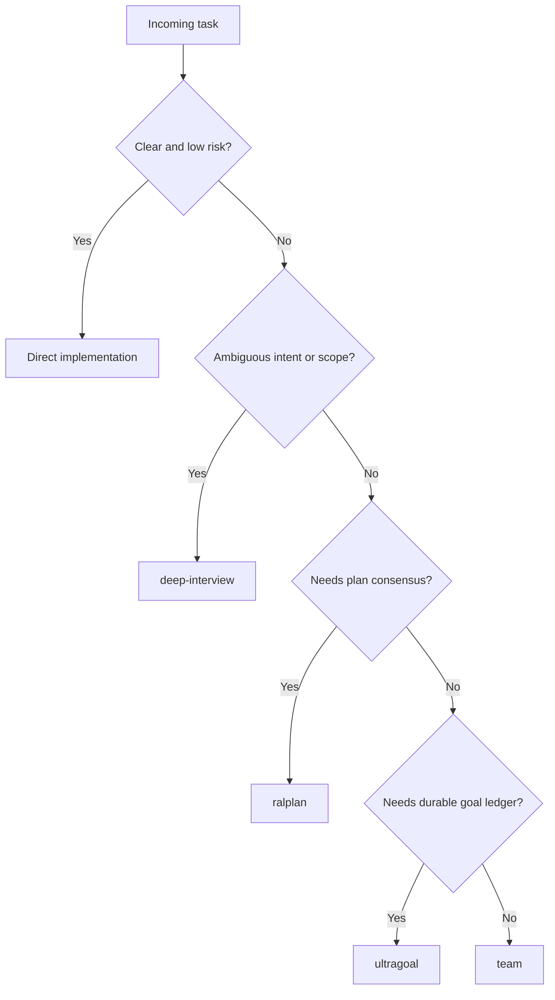

# Other — AGENTS.md

# Other — AGENTS.md

`AGENTS.md` is the repository-local operating contract for Gajae-Code contributors and automated coding agents. It defines the public workflow surface, allowed role agents, repository focus, coding conventions, verification gates, and release expectations for this tree.

This module has no runtime call graph: it is a Markdown policy file, not executable code. Its effect comes from being read by contributors and agent tooling before work begins.

## Purpose

`AGENTS.md` answers three questions for anyone working in this repository:

1. Which GJC workflows and role agents are part of the supported product surface.
2. Which package should be treated as the default target for agent-related work.
3. Which implementation, testing, logging, and release rules must be followed.

The file is especially important because Gajae-Code exposes workflow and role definitions from source-controlled files, while runtime state and user overrides live under `.gjc/`.

## Public Workflow Surface

GJC intentionally exposes exactly four default workflow skills:

| Skill | Source |
| --- | --- |
| `deep-interview` | `packages/coding-agent/src/defaults/gjc/skills/deep-interview/SKILL.md` |
| `ralplan` | `packages/coding-agent/src/defaults/gjc/skills/ralplan/SKILL.md` |
| `ultragoal` | `packages/coding-agent/src/defaults/gjc/skills/ultragoal/SKILL.md` |
| `team` | `packages/coding-agent/src/defaults/gjc/skills/team/SKILL.md` |

Do not add or document additional default workflow skills unless there is an explicit product decision and the related gates are updated.

GJC also bundles exactly four source-defined role agents:

| Agent | Source |
| --- | --- |
| `executor` | `packages/coding-agent/src/prompts/agents/executor.md` |
| `architect` | `packages/coding-agent/src/prompts/agents/architect.md` |
| `planner` | `packages/coding-agent/src/prompts/agents/planner.md` |
| `critic` | `packages/coding-agent/src/prompts/agents/critic.md` |

These role agents are not workflow skills and should not be committed as repo-visible `.gjc` defaults.

## Workflow Selection

Use the smallest workflow that satisfies the request:



`deep-interview` and `ralplan` are planning surfaces. They must not execute implementation work unless the user explicitly approves execution. Their artifacts remain pending until approval exists.

`subagent await` timeouts are observation windows. A timeout does not mean failure; inspect the subagent state before deciding whether to continue, wait, or cancel.

## Repository Scope

The repository contains several packages, but `packages/coding-agent/` is the primary product surface. When a task says “agent” without more detail, treat it as referring to the coding-agent CLI implementation, not the assistant currently operating on the repository.

Key package boundaries:

| Package | Responsibility |
| --- | --- |
| `packages/ai` | Multi-provider LLM client and streaming support |
| `packages/agent` | Agent runtime, tool calling, and state management |
| `packages/coding-agent` | Main `gjc` CLI application |
| `packages/tui` | Terminal UI with differential rendering |
| `packages/natives` | Native text, image, and grep bindings |
| `packages/stats` | Local observability dashboard exposed by `gjc stats` |
| `packages/utils` | Shared utilities |
| `crates/pi-natives` | Rust native helpers |

## Source Defaults and Runtime State

Bundled workflow definitions live in source:

- `packages/coding-agent/src/defaults/gjc/skills`
- `packages/coding-agent/src/prompts/agents`

Runtime files belong under `.gjc/`:

- Specs: `.gjc/specs/`
- Plans: `.gjc/plans/`
- Ultragoal ledgers: `.gjc/ultragoal/`
- Team state: `.gjc/state/team/`

Do not commit repo-visible `.gjc` default definitions. Local user and project `.gjc` discovery remains supported for overrides and installed configs, but source-bundled defaults are the canonical product surface.

## Role Agent Restrictions

`executor` is the bounded implementation, fix, and refactor role.

`architect`, `planner`, and `critic` are read-only for product files. They may use their restricted `bash` tool only for sanctioned workflow persistence and state commands, including:

- `gjc ralplan --write ...`
- `gjc state ...`

Their restricted `bash` access blocks environment overrides, direct handoffs, state clears, artifact file-path ingestion, and unsupported command shapes.

## TypeScript and Code Style

The codebase expects strict, explicit TypeScript:

- Avoid `any` unless there is no practical alternative.
- Do not use `ReturnType<>`; write the concrete type name.
- Do not use inline or dynamic imports such as `await import()`, `import("pkg").Type`, or dynamic type imports.
- Use top-level imports.
- Check `node_modules` for external API types instead of guessing.
- Prefer `export * from "./module"` in barrel files unless star exports create ambiguity.
- Use ES `#private` fields instead of TypeScript `private`, `protected`, or `public`, except for constructor parameter properties.
- Use `Promise.withResolvers()` instead of manually constructing resolver promises.
- Keep prompts in static `.md` files imported with `with { type: "text" }`; do not build prompts inline in code.

Never edit `packages/ai/src/models.json` directly. Change the generator, descriptors, or resolvers, then regenerate with:

```bash
bun --cwd=packages/ai run generate-models
```

## Bun and Filesystem Conventions

Prefer Bun APIs where they make the code simpler and more consistent:

| Operation | Preferred | Avoid |
| --- | --- | --- |
| File read/write | `Bun.file()`, `Bun.write()` | `readFileSync`, `writeFileSync` |
| Simple command spawning | Bun Shell | `child_process` |
| Sleep | `Bun.sleep(ms)` | timeout promise wrappers |
| JSON5/JSONL | `Bun.JSON5`, `Bun.JSONL` | ad hoc parsers |
| String width and wrapping | `Bun.stringWidth`, `Bun.wrapAnsi` | custom ANSI wrapping |

Use namespace imports for Node modules:

```ts
import * as fs from "node:fs/promises";
import * as path from "node:path";
import * as os from "node:os";
```

Use `node:fs/promises` for directory operations. Avoid redundant parent-directory creation before `Bun.write()`.

## Worker Scripts

Worker entries must support both compiled binary execution and source execution. Use the hybrid pattern:

```ts
import { isCompiledBinary } from "@gajae-code/pi-utils";

const worker = isCompiledBinary()
	? new Worker("./packages/<pkg>/src/<worker>.ts", { type: "module" })
	: new Worker(new URL("./<worker>.ts", import.meta.url).href, { type: "module" });
```

Every worker entry must also be listed as an extra compile entrypoint in:

```text
packages/coding-agent/scripts/build-binary.ts
```

Validate new worker paths with the relevant smoke test. `gjc --smoke-test` covers the stats sync worker.

## Logging and TUI Safety

Do not use these APIs in `packages/coding-agent/`:

```ts
console.log(...)
console.warn(...)
console.error(...)
```

They can corrupt terminal UI rendering. Use the centralized logger from `@gajae-code/pi-utils`.

All tool renderer text must be sanitized before display:

- Replace tabs with `replaceTabs()`.
- Truncate using `truncateToWidth()` or `ui.truncate()`.
- Shorten home paths with `shortenPath()`.
- Keep previews within shared preview constants.

Apply these rules to success output, errors, diffs, and streaming render paths.

## Verification Commands

Do not commit unless explicitly asked.

Do not run `tsc` or `npx tsc`. Use the repository-supported commands instead:

```bash
bun check
bun run check:ts
```

For focused package changes, run targeted tests first, then type, lint, or build checks as needed.

After workflow-definition changes, run the required rebrand and default-surface gates:

```bash
bun scripts/check-visible-definitions.ts
bun scripts/verify-g002-gates.ts
bun scripts/rebrand-inventory.ts --strict
bun test packages/coding-agent/test/default-gjc-definitions.test.ts
```

## Testing Expectations

Tests should cover externally observable contracts:

- Behavior
- Output shape
- State transitions
- Error mapping
- Regression-prone parsing boundaries

Avoid tests that only prove implementation details or language guarantees:

- Placeholder tests
- Tautologies
- Broad `not.toThrow()` assertions
- Duplicated coverage
- Long-lived global mutations
- `mock.module()`

Prefer `vi.spyOn(...)` with cleanup for mocks and spies. Compile-time guarantees belong in type checks, not placeholder runtime tests.

## Changelog and Release

Package changelogs live under:

```text
packages/*/CHANGELOG.md
```

Add new entries under:

```markdown
## [Unreleased]
```

Do not edit released changelog sections.

The release command is:

```bash
bun run release
```

Run it only after changelog updates and verification are complete.