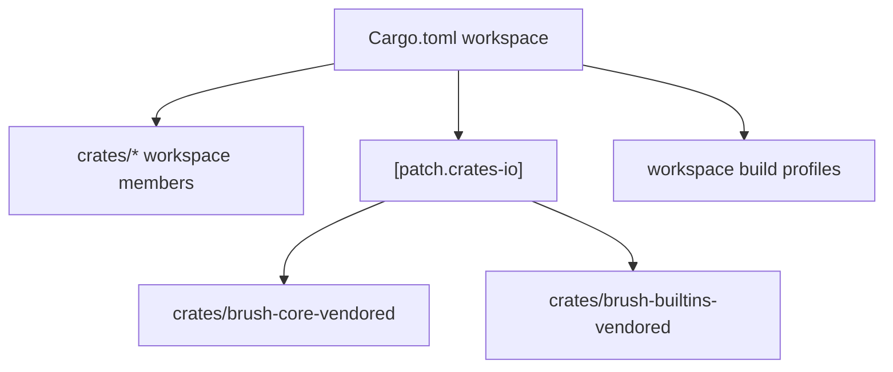

# Other — Cargo.toml

# Other — Cargo.toml

`Cargo.toml` is the Rust workspace manifest for the native crates under `crates/*`. It centralizes package metadata, build profiles, lint policy, dependency versions, and local crate patching for the Rust side of the project.

This file does not define runtime functions or execution flows directly. Instead, it shapes how the Rust crates are compiled, checked, linked, and consumed by the rest of the codebase, especially the native/NAPI package surface exposed through `crates/pi-natives`.

## Workspace Scope

```toml
[workspace]
members = ["crates/*"]
exclude = ["crates/brush-core-vendored", "crates/brush-builtins-vendored"]
resolver = "3"
```

The workspace includes all direct crates under `crates/*`, except the vendored Brush crates. Those vendored crates are excluded from normal workspace membership but still used through `[patch.crates-io]`.

The resolver is set to Cargo resolver version `3`, matching the Rust 2024 edition workspace. This improves feature resolution behavior across workspace crates.

## Shared Package Metadata

```toml
[workspace.package]
version = "0.5.3"
edition = "2024"
license = "MIT"
authors = ["Yeachan-Heo"]
homepage = "https://gaebal-gajae.dev/"
repository = "https://github.com/can1357/gajae-code"
```

Workspace crates can inherit these values instead of duplicating them in each crate manifest. The important shared contract is:

- Rust edition: `2024`
- Package version: `0.5.3`
- License: `MIT`
- Repository: `https://github.com/can1357/gajae-code`

When adding a new workspace crate, prefer inheriting these fields from `[workspace.package]` unless the crate has a real reason to diverge.

## Vendored Brush Overrides

```toml
[patch.crates-io]
brush-core = { path = "crates/brush-core-vendored" }
brush-builtins = { path = "crates/brush-builtins-vendored" }
```

The workspace replaces the crates.io versions of `brush-core` and `brush-builtins` with local vendored copies.

This means any dependency on `brush-core` or `brush-builtins` resolves to:

- `crates/brush-core-vendored`
- `crates/brush-builtins-vendored`

These crates are intentionally excluded from `[workspace].members`, so they are patched into dependency resolution without becoming first-class workspace crates.



## Build Profiles

The workspace defines several profiles for different build surfaces.

### `release`

```toml
[profile.release]
opt-level = 3
lto = "fat"
codegen-units = 1
strip = true
panic = "abort"
```

The release profile prioritizes smallest, fastest shipped binaries:

- maximum optimization
- fat LTO
- single codegen unit
- stripped symbols
- `panic = "abort"`

This is appropriate for production binaries, but it is not suitable for native code paths that need panic recovery through `catch_unwind`.

### `ci`

```toml
[profile.ci]
inherits = "release"
panic = "unwind"
lto = "thin"
codegen-units = 16
debug = "line-tables-only"
strip = "none"
split-debuginfo = "off"
```

The CI profile inherits from release but changes panic and debug behavior.

The key difference is:

```toml
panic = "unwind"
```

The comment explains the reason: the `pi-natives` blocking-task guard in `crates/pi-natives/src/task.rs` relies on `catch_unwind` to convert Rust panics into `napi::Error`. If the profile uses `panic = "abort"`, that guard cannot run because the process aborts instead of unwinding.

Cargo only allows `panic` at the profile root, not per package, so every profile used by `build-native.ts` must set `panic = "unwind"` when panic-to-`napi::Error` conversion needs to work.

### `local`

```toml
[profile.local]
inherits = "release"
panic = "unwind"
lto = "thin"
codegen-units = 16
incremental = true
strip = false
```

The local profile is optimized enough to resemble release behavior while keeping iteration practical:

- panic unwinding remains enabled for `pi-natives`
- thin LTO is used instead of fat LTO
- more codegen units improve build speed
- incremental compilation is enabled
- symbols are not stripped

Use this for local native builds where realistic behavior matters but full release build cost is unnecessary.

### `dev`

```toml
[profile.dev]
opt-level = 0
lto = false
codegen-units = 256
incremental = true
debug = "line-tables-only"
split-debuginfo = "unpacked"
```

The dev profile optimizes for fast edit-build cycles. Workspace crates compile with no optimization, many codegen units, and incremental compilation.

Dependencies use a different setting:

```toml
[profile.dev.package."*"]
opt-level = 2
debug = false
```

This compiles dependencies with optimization once and lets Cargo cache them, while keeping local crates quick to rebuild.

## Workspace Lints

The workspace sets shared Rust and Clippy lint behavior.

### Rust Lints

```toml
[workspace.lints.rust]
mismatched_lifetime_syntaxes = "allow"
```

The only explicit Rust compiler lint override allows `mismatched_lifetime_syntaxes`.

### Clippy Baseline

```toml
[workspace.lints.clippy]
all = { level = "warn", priority = -1 }
correctness = { level = "deny", priority = -1 }
suspicious = { level = "deny", priority = -1 }
```

The lint policy is strict by default:

- most Clippy groups warn
- `correctness` denies
- `suspicious` denies

This means correctness and suspicious-code findings should be treated as blocking failures in normal checks.

### Intentional Allowances

The manifest also documents broad categories where the project intentionally relaxes Clippy:

- unsafe pointer conversion patterns such as `borrow_as_ptr`, `ptr_as_ptr`, and `ref_as_ptr`
- numeric casts such as `cast_possible_truncation`, `cast_sign_loss`, and `cast_precision_loss`
- floating-point equality through `float_cmp`
- builder-style APIs through `return_self_not_must_use`
- large functions and argument lists through `too_many_lines` and `too_many_arguments`
- wildcard imports for preludes and tests
- missing error and panic docs

These allowances are part of the workspace style. Do not “fix” them globally unless the project intentionally changes its lint policy.

The lint that most directly affects day-to-day code changes is:

```toml
allow_attributes_without_reason = "warn"
```

New `#[allow(...)]` attributes should include a reason.

## Shared Dependencies

`[workspace.dependencies]` is the dependency catalog for Rust crates. Workspace crates should depend on these entries with `workspace = true` where possible so versions stay centralized.

### Internal Libraries

```toml
pi-ast = { path = "crates/pi-ast" }
pi-iso = { path = "crates/pi-iso" }
pi-shell = { path = "crates/pi-shell" }
brush-core = { path = "crates/brush-core-vendored" }
brush-builtins = { path = "crates/brush-builtins-vendored" }
```

These are the internal Rust libraries shared across native functionality.

`brush-core` and `brush-builtins` point directly at vendored paths here as well as being patched in `[patch.crates-io]`.

### Runtime and Concurrency

Important shared dependencies include:

- `tokio` with `full` features
- `tokio-util` with `full` features
- `async-trait`
- `dashmap`
- `parking_lot`
- `rayon`

Use these existing dependencies before adding a new async, locking, or parallelism library.

### Serialization and Configuration

The workspace standardizes on:

- `serde` with `derive`
- `serde_json` with `preserve_order`
- `toml`
- `clap` with `derive`

For Rust CLI/config surfaces, this is the expected stack.

### NAPI Integration

```toml
napi = { version = "3", features = ["napi10", "tokio_rt", "tokio_time"] }
napi-build = "2"
napi-derive = "3"
```

These dependencies support Node.js bindings from Rust. The `napi` crate is configured with Tokio runtime/time support and N-API 10.

This connects directly to the build-profile panic policy: native tasks that cross the NAPI boundary need unwinding enabled in shipped native profiles when they rely on `catch_unwind` guards.

### Terminal, Search, Parsing, and Syntax Support

The dependency catalog includes native support for:

- terminal and PTY behavior: `portable-pty`, `arboard`, `icy_sixel`
- file walking and search: `ignore`, `globset`, `grep-searcher`, `grep-regex`, `grep-matcher`
- text width and Unicode handling: `unicode-width`, `unicode-segmentation`
- syntax parsing: `ast-grep-core`, `tree-sitter`, and many `tree-sitter-*` grammars
- shell parsing: `brush-parser`, `brush-core`, `brush-builtins`

The large tree-sitter section is intentional: the native layer supports many source languages through a centralized parser dependency set.

## Adding or Changing Dependencies

When adding a dependency used by more than one Rust crate, add it under `[workspace.dependencies]` rather than pinning separate versions in crate-local manifests.

Use the existing section structure:

- Internal Libraries
- Async Runtime & Concurrency
- Serialization & Data Formats
- Error Handling
- CLI & Configuration
- Text Processing & Parsing
- System & Platform
- Node.js Bindings
- Terminal & PTY
- Search & File Walking
- Image Processing & Syntax Highlighting
- Markup Conversion
- Tokenization
- Shell Parsing
- AST & Tree-Sitter

The final `Unsorted` section exists as a temporary landing area for dependencies added by `cargo add`. Move entries into the appropriate section instead of leaving them there.

## Contribution Notes

When changing this manifest, consider the affected surface:

- Profile changes can alter native error behavior, especially panic handling in `pi-natives`.
- Lint changes affect every Rust crate in the workspace.
- Dependency changes can impact both Rust crates and Node-facing native bindings.
- Tree-sitter dependency changes may affect language parsing support.
- Brush crate changes must account for the vendored override model.

For native build behavior, preserve the distinction between `release` and the shipped/unwinding profiles. `panic = "abort"` is valid for pure release optimization, but profiles used for NAPI panic conversion must keep `panic = "unwind"`.