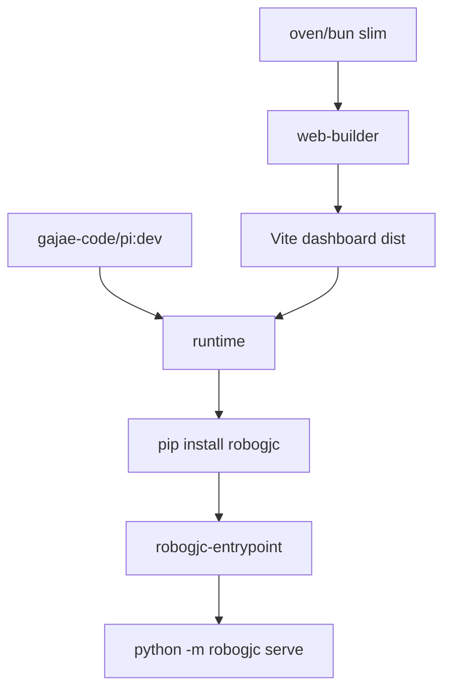

# Other — Dockerfile.robogjc

# Dockerfile.robogjc

`Dockerfile.robogjc` builds the container image for `robogjc`, the GitHub triage and fix bot orchestrator. It layers the Python `robogjc` service and its SolidJS dashboard on top of the existing `pi-base` image, reusing the shared PI toolchain instead of rebuilding it here.

The Dockerfile has two stages:

1. `web-builder`: installs the `robogjc-web` workspace dependencies with Bun and builds the Vite/SolidJS dashboard.
2. `runtime`: starts from `gajae-code/pi:dev`, copies the Python package and built dashboard assets, installs runtime dependencies, and configures the container entrypoint.



## Purpose

`Dockerfile.robogjc` produces a runtime image for the `robogjc` service. The image is intended to run the bot service, serve its FastAPI backend, and include the prebuilt dashboard static assets inside the installed Python package.

It does not define any application logic directly. There are no functions, classes, or execution-flow edges in this module because it is a Docker build recipe. Its behavior is expressed through image stages, copied files, environment variables, installed packages, exposed ports, and the final process command.

## Base Image Contract

The runtime stage starts from:

```dockerfile
ARG PI_BASE=gajae-code/pi:dev
FROM ${PI_BASE} AS runtime
```

`PI_BASE` is expected to come from the root `Dockerfile`, usually built with:

```sh
bun run pi:image
```

The comments document that `PI_BASE` already provides the shared PI runtime pieces:

- Python
- Bun
- Rustup launcher
- `pi-natives`
- `gjc_rpc` wheel
- `/usr/local/bin/gjc` shim

This Dockerfile deliberately avoids rebuilding those shared tools. It only adds the `robogjc` package, dashboard bundle, entrypoint, runtime dependency set, and container filesystem layout.

## Build Arguments

### `PI_BASE`

```dockerfile
ARG PI_BASE=gajae-code/pi:dev
```

Controls the image used by the `runtime` stage. Override this when building against a different PI base image tag.

### `BUN_VERSION`

```dockerfile
ARG BUN_VERSION=1.3.14
```

Controls the Bun image used by the `web-builder` stage:

```dockerfile
FROM oven/bun:${BUN_VERSION}-slim AS web-builder
```

This affects dashboard dependency installation and Vite build behavior, but not the final runtime base image.

## Stage 1: `web-builder`

The `web-builder` stage builds the SolidJS dashboard under `python/robogjc/web`.

```dockerfile
FROM oven/bun:${BUN_VERSION}-slim AS web-builder
WORKDIR /work
```

It copies only the manifests needed to hydrate the dashboard workspace first:

```dockerfile
COPY package.json bun.lock ./
COPY python/robogjc/web/package.json ./python/robogjc/web/package.json
RUN bun install --filter robogjc-web
```

This pattern keeps dependency installation cacheable. Source files are copied only after dependency installation:

```dockerfile
COPY --exclude=node_modules --exclude=dist python/robogjc/web/ ./python/robogjc/web/
RUN bun --cwd=python/robogjc/web run build
```

The build output is expected at:

```text
/work/python/robogjc/web/dist/
```

That directory is later copied into the Python package as static package data.

## Stage 2: `runtime`

The `runtime` stage installs and configures the Python service.

```dockerfile
FROM ${PI_BASE} AS runtime
ENV PI_ROOT=/work/pi
WORKDIR /app
```

`PI_ROOT=/work/pi` tells `robogjc` where the host PI checkout is mounted. The comments state that the checkout is expected to be mounted read-only at runtime.

## Python Package Layout

The Dockerfile copies the Python package metadata and source into `/app`:

```dockerfile
COPY python/robogjc/pyproject.toml ./
COPY python/robogjc/src/ ./src/
```

Then it copies the built dashboard bundle into the package tree:

```dockerfile
COPY --from=web-builder /work/python/robogjc/web/dist/ ./src/static/
```

This order matters. The dashboard bundle must exist under `src/static/` before `pip install .` runs so that it is included in the installed wheel. The comment notes that `static/**/*` is declared as package data in `pyproject.toml`.

## Runtime Dependencies

The image installs a focused Python dependency set before installing the local package:

```dockerfile
RUN pip install --no-cache-dir \
        "fastapi>=0.112" "uvicorn[standard]>=0.30" "httpx>=0.27" \
        "pydantic>=2.6" "pydantic-settings>=2.2" "python-dotenv>=1.0" \
        "click>=8.1" \
    && pip install --no-cache-dir --no-deps .
```

The explicitly installed dependencies indicate the runtime surface:

- `fastapi`: HTTP API service
- `uvicorn[standard]`: ASGI server
- `httpx`: outbound HTTP client
- `pydantic` and `pydantic-settings`: data validation and configuration
- `python-dotenv`: environment file support
- `click`: CLI entrypoint support

The package itself is installed with `--no-deps`, so dependency resolution for the runtime image is controlled directly by this Dockerfile.

## Agent Home and Host Config Staging

The image creates two related directory trees:

```dockerfile
RUN mkdir -p /srv/agent-home/.agent /srv/agent-home/.gjc/agent \
    && mkdir -p /srv/agent-home-stage/.agent /srv/agent-home-stage/.gjc/agent \
    && printf '[install]\nbackend = "copyfile"\n' > /srv/agent-home/.bunfig.toml
```

The intended runtime model is:

- Host agent config is mounted read-only under `/srv/agent-home-stage`.
- `robogjc-entrypoint` copies staged config into `/srv/agent-home`.
- Agent subprocesses run with `HOME=/srv/agent-home`.
- `~/.gjc` and `~/.agent` resolve inside the container-owned home directory.

This avoids exposing mutable host mounts to the agent subprocess while still allowing host-controlled configuration to be provided at startup.

The `.bunfig.toml` file sets:

```toml
[install]
backend = "copyfile"
```

This configures Bun installs under `/srv/agent-home` to use copyfile semantics.

## Entrypoint

The Dockerfile installs `python/robogjc/entrypoint.sh` as the executable container entrypoint:

```dockerfile
COPY python/robogjc/entrypoint.sh /usr/local/bin/robogjc-entrypoint
RUN chmod +x /usr/local/bin/robogjc-entrypoint
```

The final entrypoint uses `tini` as PID 1:

```dockerfile
ENTRYPOINT ["/usr/bin/tini", "--", "/usr/local/bin/robogjc-entrypoint"]
CMD ["python", "-m", "robogjc", "serve"]
```

At runtime, Docker starts:

```sh
/usr/bin/tini -- /usr/local/bin/robogjc-entrypoint python -m robogjc serve
```

`tini` handles signal forwarding and process reaping. `robogjc-entrypoint` prepares the container environment, then launches the default command unless a different command is supplied.

## Ports and Volumes

The image declares one data volume:

```dockerfile
VOLUME ["/data"]
```

Use `/data` for persistent runtime state managed outside the image filesystem.

The image exposes two ports:

```dockerfile
EXPOSE 8080
EXPOSE 8081
```

The Dockerfile does not assign meanings to the ports directly, but they are part of the public container contract for the `robogjc` service and dashboard/runtime interfaces.

## Build Commands

The documented direct build path is:

```sh
bun run pi:image
docker build -f Dockerfile.robogjc -t robogjc:dev .
```

The first command builds the default PI base image expected by `PI_BASE`. The second command builds the `robogjc` image from this Dockerfile.

The recommended Compose path is:

```sh
docker compose --project-directory python/robogjc build
```

That route lets the Compose configuration under `python/robogjc` define build context, mounts, environment, and service-level runtime details.

## Connection to the Codebase

`Dockerfile.robogjc` connects these codebase areas:

- Root package manifests:
  - `package.json`
  - `bun.lock`

- Dashboard workspace:
  - `python/robogjc/web/package.json`
  - `python/robogjc/web/`
  - Vite build output copied from `python/robogjc/web/dist/`

- Python service package:
  - `python/robogjc/pyproject.toml`
  - `python/robogjc/src/`
  - installed with `pip install --no-deps .`

- Runtime entrypoint:
  - `python/robogjc/entrypoint.sh`
  - installed as `/usr/local/bin/robogjc-entrypoint`

- Shared PI base image:
  - default tag `gajae-code/pi:dev`
  - provides the broader toolchain used by the bot

The module is therefore mostly an integration boundary: it assembles existing Python, frontend, and PI runtime components into a single deployable image.

## Important Maintenance Notes

Keep the dashboard build output path aligned with the copy step:

```dockerfile
COPY --from=web-builder /work/python/robogjc/web/dist/ ./src/static/
```

If the Vite output directory changes, update this path and confirm that `pyproject.toml` still includes the static files as package data.

Keep Python runtime dependencies explicit in this Dockerfile when the image intentionally installs the package with:

```dockerfile
pip install --no-cache-dir --no-deps .
```

If `robogjc` gains a new required runtime dependency, add it to the first `pip install` command or change the dependency installation strategy intentionally.

Do not move host-mounted agent config directly into the runtime `HOME`. The current staged-copy model separates read-only host config under `/srv/agent-home-stage` from container-owned runtime files under `/srv/agent-home`.

The final command surface is `python -m robogjc serve`. Changes to the Python module entrypoint or CLI command names need to be reflected here and in any Compose configuration that relies on the default command.