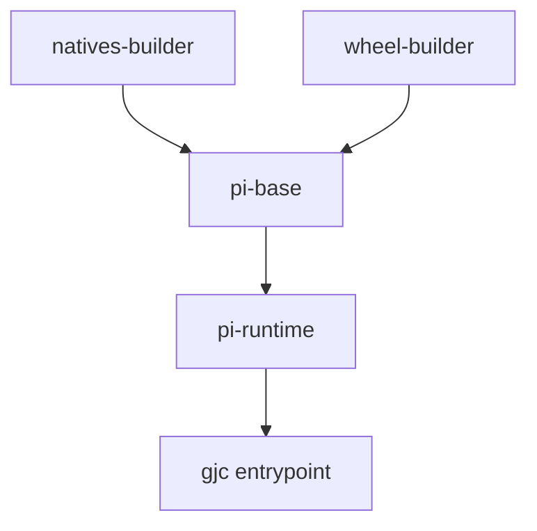

# Other — Dockerfile

# Other — Dockerfile

This Dockerfile builds the container image for the `gjc` coding-agent runtime. It packages the TypeScript CLI, Bun dependencies, the Rust-backed native addon, and the `gjc_rpc` Python wheel into a runnable Linux image.

The default target is `pi-runtime`, which produces a self-contained image that can run:

```bash
docker run --rm gajae-code/pi:dev --help
```

It also exposes a reusable `pi-base` target for derived images that want the runtime tooling without baking in this repository’s source tree.

## Build Architecture



The Dockerfile is organized into four stages:

| Stage | Purpose |
| --- | --- |
| `natives-builder` | Builds `pi_natives.linux-<arch>.node` from `packages/natives`. |
| `wheel-builder` | Builds the `gjc_rpc` Python wheel from `python/gjc-rpc`. |
| `pi-base` | Installs Python, Bun, Rustup launcher, native addon, `gjc_rpc`, and the `/usr/local/bin/gjc` shim. |
| `pi-runtime` | Adds this repository’s source code, installs Bun dependencies, regenerates docs index, and sets the `gjc` entrypoint. |

## `natives-builder`

`natives-builder` starts from `rust:1.86-slim-bookworm` and produces the Linux N-API native addon used by the codebase.

Key setup:

```dockerfile
FROM rust:1.86-slim-bookworm AS natives-builder

ENV BUN_INSTALL=/opt/bun \
    PATH=/opt/bun/bin:/usr/local/cargo/bin:/usr/local/bin:/usr/bin:/bin \
    CARGO_TERM_COLOR=never
```

It installs system build dependencies, installs Bun using `BUN_VERSION`, then works from `/pi`.

The build uses a layered dependency pattern:

1. Copy only manifests and lockfiles with `COPY --parents`.
2. Run `bun install --frozen-lockfile --ignore-scripts`.
3. Copy the full source tree.
4. Build native bindings with:

```dockerfile
bun --cwd=packages/natives run build
```

The resulting artifact is copied to `/out`:

```dockerfile
cp packages/natives/native/pi_natives.linux-*.node /out/
```

This stage uses Docker cache mounts for Cargo registry, Cargo Git dependencies, and the workspace `target` directory:

```dockerfile
RUN --mount=type=cache,target=/root/.cargo/registry \
    --mount=type=cache,target=/root/.cargo/git \
    --mount=type=cache,target=/pi/target \
    ...
```

That keeps repeated native builds incremental without baking cache state into the image.

## `wheel-builder`

`wheel-builder` builds the Python RPC package used by the runtime.

```dockerfile
FROM python:3.12-slim-bookworm AS wheel-builder
```

It installs `pip`, `build`, and `git`, copies `python/gjc-rpc` into `/src`, then runs:

```dockerfile
python -m build --wheel --outdir /out
```

The produced wheel is consumed later by `pi-base`.

## `pi-base`

`pi-base` is the reusable runtime foundation. It contains the tools required to run `gjc`, but does not include the repository source by default.

Important environment values:

```dockerfile
ENV PYTHONDONTWRITEBYTECODE=1 \
    PYTHONUNBUFFERED=1 \
    PIP_NO_CACHE_DIR=1 \
    PIP_DISABLE_PIP_VERSION_CHECK=1 \
    BUN_INSTALL=/opt/bun \
    PI_ROOT=/work/pi \
    CARGO_HOME=/data/cache/cargo \
    CARGO_TARGET_DIR=/data/cache/cargo-target \
    RUSTUP_HOME=/data/cache/rustup \
    PATH=/opt/bun/bin:/usr/local/cargo/bin:/usr/local/bin:/usr/bin:/bin
```

`PI_ROOT` is the source checkout location used by the `gjc` shim. In `pi-base`, it defaults to `/work/pi`, which is suitable for derived images or mounted host checkouts. The `pi-runtime` stage overrides it to `/pi`.

### Runtime Dependencies

`pi-base` installs:

- Python 3.12 runtime
- Bun
- `git`, `curl`, `openssh-client`
- `tini`
- `sqlite3`
- build tooling for native rebuilds
- Rustup launcher

Rustup is installed with no default toolchain:

```dockerfile
sh /tmp/rustup-init.sh -y --no-modify-path --default-toolchain none --profile minimal
```

The actual Rust toolchain is fetched lazily into `/data/cache/rustup` when needed, based on `rust-toolchain.toml`.

### Native Addon Placement

The native addon produced by `natives-builder` is copied into `/opt/bun/bin`:

```dockerfile
COPY --from=natives-builder /out/pi_natives.linux-*.node /opt/bun/bin/
```

This matches the loader fallback path used by the codebase for `pi_natives.linux-*.node`.

### Python Wheel Installation

The `gjc_rpc` wheel from `wheel-builder` is installed with pip:

```dockerfile
COPY --from=wheel-builder /out/*.whl /tmp/wheels/
RUN pip install /tmp/wheels/gjc_rpc-*.whl && rm -rf /tmp/wheels
```

### `gjc` Shim

`pi-base` creates `/usr/local/bin/gjc`, a Bash wrapper around the TypeScript CLI:

```bash
exec bun "$PI_ROOT/packages/coding-agent/src/cli.ts" "$@"
```

Before launching, the shim validates that `$PI_ROOT/packages/coding-agent` exists. If not, it exits with status `127` and prints:

```text
pi: PI_ROOT=$PI_ROOT does not look like a pi checkout
```

This keeps derived images flexible: they can provide their own source tree by setting `PI_ROOT`.

## `pi-runtime`

`pi-runtime` is the default build target and the runnable image.

```dockerfile
FROM pi-base AS pi-runtime

ENV PI_ROOT=/pi
WORKDIR /pi
```

It repeats the manifest-first install pattern used by `natives-builder`:

```dockerfile
COPY --parents \
    package.json bun.lock bunfig.toml \
    tsconfig.base.json tsconfig.json \
    packages/*/package.json \
    packages/tsconfig.workspace.json \
    python/robogjc/web/package.json \
    /pi/

RUN bun install --frozen-lockfile --ignore-scripts
```

Then it copies the full source tree:

```dockerfile
COPY . /pi/
```

Because `Dockerfile.dockerignore` excludes `node_modules`, the image keeps the clean hoisted dependency tree produced inside Docker instead of inheriting host-specific symlinks or install artifacts.

The final setup step regenerates the coding-agent docs index:

```dockerfile
RUN bun --cwd=packages/coding-agent run generate-docs-index
```

This compensates for `--ignore-scripts`, which skips the root `prepare` script during install.

The runtime entrypoint is:

```dockerfile
ENTRYPOINT ["/usr/bin/tini", "--", "/usr/local/bin/gjc"]
CMD ["--help"]
```

`tini` handles process reaping and signal forwarding, while `/usr/local/bin/gjc` launches the Bun-based CLI.

## Dependency Layering Pattern

Both `natives-builder` and `pi-runtime` use the same cache-friendly install strategy:

1. Copy package manifests and lockfiles only.
2. Run `bun install --frozen-lockfile --ignore-scripts`.
3. Copy the full source tree.

This avoids invalidating `bun install` when only implementation files change under `packages/*/src`, `crates/*/src`, or similar source directories.

The Dockerfile requires Dockerfile syntax `1.7-labs` because it uses:

```dockerfile
COPY --parents ...
```

That preserves directory structure when copying matched manifest files into `/pi`.

## Connection to the Codebase

This Dockerfile ties together several repository surfaces:

- `packages/coding-agent/src/cli.ts` is the executable launched by the `gjc` shim.
- `packages/natives` builds `pi_natives.linux-*.node`, the native addon copied into the runtime image.
- `python/gjc-rpc` builds the `gjc_rpc` wheel installed into Python.
- `packages/coding-agent` provides the `generate-docs-index` script run during image assembly.
- `python/robogjc/web/package.json` is included in dependency-layer manifests so Bun workspace installation sees that package metadata.

The Dockerfile itself has no internal function or class call graph. Its execution flow is Docker’s stage graph: native addon build, Python wheel build, runtime base assembly, then final source-backed CLI image assembly.

## Build Targets

Build the default runtime image:

```bash
docker build -t gajae-code/pi:dev .
```

Build only the reusable base image:

```bash
docker build --target pi-base -t gajae-code/pi-base:dev .
```

Run the self-contained CLI image:

```bash
docker run --rm gajae-code/pi:dev --help
```

Run interactively against the baked-in source:

```bash
docker run --rm -it gajae-code/pi:dev cli
```

Use `pi-base` from another Dockerfile:

```dockerfile
ARG PI_BASE=gajae-code/pi:dev
FROM ${PI_BASE} AS pi-base
```

Derived images that use `pi-base` should either mount or copy a valid checkout and set `PI_ROOT` so that this path exists:

```text
$PI_ROOT/packages/coding-agent
```

## Operational Notes

`BUN_VERSION` defaults to `1.3.14` and is shared across build stages.

`pi-base` keeps Rust toolchains outside the immutable image layer by using:

```text
/data/cache/rustup
/data/cache/cargo
/data/cache/cargo-target
```

Mounting `/data` in long-lived environments allows Rust dependencies and toolchains to survive container restarts.

`pi-runtime` is the only stage that bakes in repository source. Use `pi-base` when another image needs to provide or override the source tree.