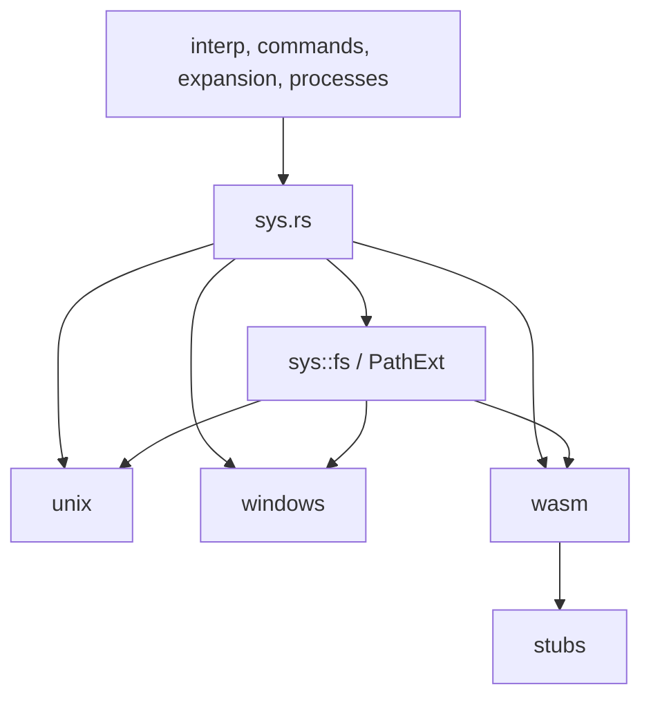

# Platform System Abstraction

# Platform System Abstraction

The `sys` module centralizes OS-specific behavior behind a stable internal interface. Higher-level shell code imports `crate::sys::*` instead of branching directly on Unix, Windows, WASM, or unsupported targets.

At the top level, `sys.rs` selects one platform module with `cfg`:

```rust
#[cfg(unix)]
pub(crate) use unix as platform;

#[cfg(windows)]
pub(crate) use windows as platform;

#[cfg(target_family = "wasm")]
pub(crate) use wasm as platform;
```

It then re-exports the common surface:

```rust
pub use platform::{
    PlatformError, async_pipe, commands, fd, input, poll, process, resource, signal, terminal,
};
pub(crate) use platform::{env, network, users};

pub mod fs;
```

This keeps most call sites platform-neutral while allowing each backend to use native APIs where available.



## Platform Selection

`sys.rs` exposes different modules depending on the target:

- Unix targets load `sys/unix.rs`.
- Windows targets load `sys/windows.rs`.
- WASM targets load `sys/wasm/mod.rs`.
- Non-Unix targets also compile `sys/stubs`, which provides fallback implementations used by Windows and WASM where no native implementation exists.

The public shape is intentionally similar across targets. For example, `sys::process::spawn`, `sys::terminal::Config`, `sys::signal::kill_process`, and `sys::fs::PathExt` exist as concepts regardless of platform, even when a platform can only provide a limited or stubbed behavior.

## Filesystem Abstraction

`sys/fs.rs` defines the shared filesystem extension trait:

```rust
pub trait PathExt {
    fn readable(&self) -> bool;
    fn writable(&self) -> bool;
    fn executable(&self) -> bool;

    fn exists_and_is_block_device(&self) -> bool;
    fn exists_and_is_char_device(&self) -> bool;
    fn exists_and_is_fifo(&self) -> bool;
    fn exists_and_is_socket(&self) -> bool;
    fn exists_and_is_setgid(&self) -> bool;
    fn exists_and_is_setuid(&self) -> bool;
    fn exists_and_is_sticky_bit(&self) -> bool;

    fn get_device_and_inode(&self) -> Result<(u64, u64), crate::error::Error>;
}
```

`PathExt` is implemented for `std::path::Path` in the platform-specific filesystem modules.

On Unix, `PathExt` uses native filesystem metadata and access checks:

- `readable`, `writable`, and `executable` call `nix::unistd::access`.
- file type checks use `std::os::unix::fs::FileTypeExt`.
- mode-bit checks use `std::os::unix::fs::MetadataExt::mode`.
- `get_device_and_inode` returns `metadata.dev()` and `metadata.ino()`.

On Windows, `PathExt` adapts shell behavior to Windows filesystem rules:

- `readable` and `writable` try opening the path with the corresponding access.
- `executable` uses `PATHEXT`.
- `get_device_and_inode` calls `GetFileInformationByHandle` and returns volume serial number plus file index.
- Unix-only file kinds and mode bits return `false`.

On WASM, `PathExt` is permissive and synthetic:

- `readable`, `writable`, and `executable` return `true`.
- special file types and mode bits return `false`.
- `get_device_and_inode` returns `(0, 0)`.

## Executable Resolution

The shared executable-search code depends on two platform functions:

```rust
pub fn resolve_executable(path: PathBuf) -> Option<PathBuf>;
pub fn split_paths<T: AsRef<OsStr> + ?Sized>(s: &T) -> impl Iterator<Item = PathBuf>;
```

Unix `resolve_executable` is a no-allocation pass-through when the path already has executable permissions:

```rust
if path.as_path().executable() {
    Some(path)
} else {
    None
}
```

Windows `resolve_executable` first accepts files whose extension appears in `PATHEXT`, then tries appending each cached `PATHEXT` extension. This is why `PathExt::executable` can return true for `foo` when `foo.exe` exists. Use `resolve_executable` when the caller needs the actual on-disk path.

`split_paths` also differs by platform:

- Unix delegates to `std::env::split_paths`.
- Windows delegates to `std::env::split_paths` and trims surrounding double quotes.
- WASM splits UTF-8 strings on `:` because `std::env::split_paths` is unavailable.

## Path Pattern Helpers

The filesystem modules also define helpers used by pathname expansion and shell output formatting:

```rust
contains_path_separator(s)
ends_with_path_separator(s)
strip_path_separator_suffix(s)
rfind_path_separator(s)
split_path_for_pattern(s)
pattern_path_root(first_component)
push_path_for_pattern(path, component)
normalize_path_separators(s)
default_case_insensitive_path_expansion()
```

Unix treats only `/` as a separator and keeps output unchanged. Windows treats both `/` and `\` as separators, recognizes drive-letter roots like `C:`, appends pattern components without invoking `PathBuf::push` root-replacement behavior, and normalizes display output by replacing backslashes with forward slashes.

The Windows implementation intentionally notes an unresolved limitation: UNC paths are not yet handled specially by `pattern_path_root`.

## Command Extensions

`sys::commands` extends `std::process::Command` with shell-specific process setup behavior.

Unix re-exports standard Unix traits:

```rust
pub use std::os::unix::process::{CommandExt, ExitStatusExt};
```

It also implements:

- `CommandFdInjectionExt::inject_fds`
- `CommandFgControlExt::take_foreground`
- `CommandFgControlExt::lead_session`
- `CommandSessionExt::detach_session`

`inject_fds` converts `(ShellFd, OpenFile)` pairs into `command_fds::FdMapping` values. Foreground/session behavior is installed through `pre_exec` hooks:

- `pre_exec_take_foreground` calls `sys::terminal::move_self_to_foreground`.
- `pre_exec_lead_session` calls `setsid` and then sets the controlling terminal with `ioctl(TIOCSCTTY)`.
- `pre_exec_detach_session` calls `setsid`, accepting `EPERM` as already-detached behavior.

Windows provides analogous traits with Windows semantics:

- `arg0` is a no-op because Windows does not support overriding `argv[0]` directly.
- `process_group(0)`, `take_foreground`, and `lead_session` set `CREATE_NEW_PROCESS_GROUP`.
- `inject_fds` rejects non-standard descriptor redirections.
- `detach_session` is a no-op because Windows has no `setsid`.

Stub command extensions preserve the same trait names but mostly no-op. Stub `inject_fds` fails if any descriptors are provided.

## Process Spawning

For Unix and Windows, `sys::process` is backed by `tokio_process.rs`:

```rust
pub(crate) type ProcessId = i32;
pub(crate) use tokio::process::Child;

pub(crate) fn spawn(command: std::process::Command) -> std::io::Result<Child> {
    let mut command = tokio::process::Command::from(command);
    command.kill_on_drop(true);
    command.spawn()
}
```

This converts a prepared `std::process::Command` into a Tokio child and enables `kill_on_drop(true)`, so dropped child handles do not leave unmanaged subprocesses behind.

The stub `process` module wraps `std::process::Child` and exposes:

- `Child::id`
- `Child::wait`
- `Child::wait_with_output`
- `spawn`

Stub `Child::id` returns `None`, which affects callers that use process IDs for tracking, well-known shell variables, or descendant bookkeeping.

## Pipes and Async Pipe Reading

`sys::async_pipe::AsyncPipeReader` abstracts reading pipe output asynchronously.

Unix converts a `std::io::PipeReader` into a Tokio Unix pipe receiver:

```rust
pipe::Receiver::from_file(std::fs::File::from(OwnedFd::from(reader)))
```

`read_to_string` then uses `tokio::io::AsyncReadExt`.

The stub implementation stores the pipe reader in an `Option` and reads it with `tokio::task::spawn_blocking`. Taking the reader ensures the pipe is consumed once; later reads return an empty string.

`sys::stubs::pipes` supplies synthetic `PipeReader`, `PipeWriter`, and `pipe()` for targets without real pipe support. The stub reader returns EOF, the writer accepts writes without preserving data, and both convert to `Stdio::null()`.

Higher-level code uses these pipe APIs from execution paths such as `interp::spawn_pipeline_processes`, `interp::setup_open_file_with_contents`, `commands::invoke_command_in_subshell_and_get_output`, and process substitution setup.

## File Descriptor Access

`sys::fd` provides best-effort access to already-open descriptors:

```rust
try_iter_open_fds()
try_get_file_for_open_fd(fd)
```

Unix enumerates descriptor directories where supported:

- `/proc/self/fd` on Linux and Android.
- `/dev/fd` on BSD-like targets and macOS.

It clones descriptors through `BorrowedFd::borrow_raw(fd)` and `try_clone_to_owned()`. The contract explicitly allows races: a descriptor may close or be reused between enumeration and cloning, so failures are skipped and callers must not assume identity is guaranteed.

Windows exposes only the standard streams:

- stdin
- stdout
- stderr

The stub implementation returns no descriptors and cannot resolve arbitrary open fds.

## Terminal Handling

`sys::terminal::Config` captures and applies terminal settings.

Unix `Config` wraps `nix::sys::termios::Termios`:

- `Config::from_term` calls `tcgetattr`.
- `Config::apply_to_term` calls `tcsetattr`.
- `Config::update` maps high-level `terminal::Settings` fields to termios flags:
  - `echo_input` -> `ECHO`
  - `line_input` -> `ICANON`
  - `interrupt_signals` -> `ISIG`
  - `output_nl_as_nlcr` -> `OPOST | ONLCR`

Windows `Config` stores console input and output mode bitsets:

- `from_term` reads `GetConsoleMode` from standard input and output handles.
- `apply_to_term` calls `SetConsoleMode`.
- `update` maps settings to Win32 console flags:
  - `echo_input` -> `ENABLE_ECHO_INPUT`
  - `line_input` -> `ENABLE_LINE_INPUT`
  - `interrupt_signals` -> `ENABLE_PROCESSED_INPUT`
  - `output_nl_as_nlcr` -> `ENABLE_PROCESSED_OUTPUT`

Terminal process helpers also vary by platform:

- Unix uses `getppid`, `getpgrp`, `tcgetpgrp`, `tcsetpgrp`, and `ttyname`.
- Windows uses ToolHelp process snapshots for parent lookup, current process ID as process group ID, foreground-window inspection for foreground pid, and console-window activation for foreground movement.
- Stubs return `None` or success without changing terminal state.

## Signal Handling

`sys::signal` handles process signaling, signal listeners, and job-control support.

Unix uses `nix::sys::signal::Signal` directly. Important functions include:

- `continue_process(pid)` sends `SIGCONT`.
- `kill_process(pid, signal)` sends a real `traps::TrapSignal::Signal`.
- `lead_new_process_group()` calls `setpgid(0, 0)`.
- `tstp_signal_listener()` listens for `SIGTSTP`.
- `chld_signal_listener()` listens for child status changes.
- `await_ctrl_c` re-exports `tokio::signal::ctrl_c`.
- `mask_sigttou()` ignores `SIGTTOU`.
- `poll_for_stopped_children()` loops over `waitid_all` with `WUNTRACED | WNOHANG`.

macOS has a custom `waitid_all` implementation because the needed `waitid` wrapper is not exposed by `nix` there. It converts raw `siginfo_t` values into `nix::sys::wait::WaitStatus` with `siginfo_to_wait_status`.

Windows signal support is split:

- `windows.rs` re-exports `tokio::signal::ctrl_c` as `await_ctrl_c`.
- It also reuses the stub signal module.
- Stub `kill_process` has a Windows-specific implementation that opens the target process with `PROCESS_TERMINATE` and calls `TerminateProcess`.

Unsupported stub targets provide a minimal `Signal` type, mostly return `NotSupportedOnThisPlatform`, and expose fake async listeners that never resolve.

## Polling for Input

Unix `poll_for_input(file, timeout)` supports shell timeout behavior:

1. Borrow the file descriptor from `OpenFile`.
2. Return `Ok(true)` immediately for regular files.
3. Use `nix::poll::poll` with a recalculated deadline.
4. Retry on `EINTR`.
5. Treat `POLLIN`, `POLLHUP`, and `POLLERR` as readable so callers can read and observe EOF or errors.

The stub implementation returns an `Unsupported` I/O error because timeout-based descriptor polling is not available.

## Environment Variables

`sys::env::get_host_env_vars` returns host environment variables in platform-specific form.

Unix is a direct passthrough to `std::env::vars()`.

Windows normalizes well-known variable names and synthesizes POSIX-friendly names:

- `Path`, `path`, and `PATH` normalize to `PATH`.
- `Home` normalizes to `HOME`.
- `TEMP` or `TMP` is copied to `TMPDIR` if `TMPDIR` is absent.
- `HOME` is synthesized from `USERPROFILE`, or from `HOMEDRIVE` plus `HOMEPATH`, if needed.

Windows uses a `BTreeMap`, so iteration order is deterministic. If multiple source names normalize to the same canonical name with different values, the last value wins and a warning is logged.

The stub implementation returns no variables.

## Users and Identity

`sys::users` exposes shell-facing identity helpers:

```rust
get_user_home_dir(username)
get_current_user_home_dir()
get_current_user_default_shell()
is_root()
get_current_uid()
get_current_gid()
get_effective_uid()
get_effective_gid()
get_current_username()
get_user_group_ids()
get_all_users()
get_all_groups()
```

Unix uses the `uzers` crate:

- `is_root` checks whether `get_current_uid() == 0`.
- home directories and default shell come from user records.
- uid/gid helpers return real Unix IDs.
- `get_all_users` currently returns only the current user.
- `get_all_groups` currently returns only the current user's groups.

Windows maps elevation to Unix-like sentinel IDs:

- elevated processes report uid/gid `0`.
- non-elevated processes report uid/gid `1000`.
- `is_root` means “is elevated”.
- username comes from `whoami::username`.
- arbitrary user home lookup, default shell, users, and groups are limited or empty.

Stubs return `std::env::home_dir()` for the current home directory where possible and unsupported errors for uid/gid/name lookups.

## Hostname and Network

`sys/hostname.rs` wraps `hostname::get()`.

Unix and Windows `network::get_hostname` delegate to `crate::sys::hostname::get()`. The stub network implementation returns an empty `OsString`.

This split lets internal code depend on `sys::network::get_hostname` while keeping the third-party hostname dependency isolated.

## Resource Usage

`sys::resource` reports process CPU usage.

Unix uses `nix::sys::resource::getrusage`:

- `get_self_user_and_system_time()` uses `RUSAGE_SELF`.
- `get_children_user_and_system_time()` uses `RUSAGE_CHILDREN`.
- `convert_rusage_time` converts `TimeVal` into `std::time::Duration`.

The stub implementation returns zero durations for both self and children.

## Input Key Translation

`sys::input::try_get_key_from_key_code` converts terminal byte sequences into `interfaces::Key`.

Unix builds a terminfo-backed key map once with `LazyLock`:

- function keys `F1` through `F12`
- arrows
- home/end
- page up/down
- enter
- backspace
- backtab

If a byte sequence is not in the terminfo map, a single non-control byte becomes `interfaces::Key::Character`.

The stub implementation only supports that single-byte non-control character fallback.

## Error Model

Each platform defines a `PlatformError` type.

Unix has one concrete variant:

```rust
pub enum PlatformError {
    ErrnoError(#[from] nix::errno::Errno),
}
```

It also implements conversion from `nix::errno::Errno` into `error::ErrorKind`, allowing platform errors to flow through the shared shell error type.

Windows and WASM currently define empty `PlatformError` enums because their platform-specific modules mostly return `std::io::Error`, shared `error::ErrorKind`, or stubbed unsupported errors.

## How Higher-Level Code Uses This Module

The rest of the codebase uses `sys` as the boundary for OS behavior. Examples from the call graph include:

- command execution and subshell capture using `pipes::pipe` and `AsyncPipeReader`
- pipeline setup through `interp::spawn_pipeline_processes`
- process substitution through `interp::setup_process_substitution`
- process tracking through `process::Child::id`
- special parameter expansion through process IDs
- terminal foreground control through `terminal::move_to_foreground` and `move_self_to_foreground`
- open file handling through `fd::try_iter_open_fds` and `OpenFile::try_borrow_as_fd`
- timeout reads through `poll::poll_for_input`
- shell startup and path search through filesystem helpers
- signal and job-control behavior through `signal::{kill_process, continue_process, chld_signal_listener}`

The module does not define a single linear execution flow. Instead, it provides cross-cutting services that shell execution, expansion, process management, builtins, and open-file code call as needed.

## Contribution Notes

When adding behavior to this module, preserve the shared surface first. Callers expect `sys::platform` modules to provide the same conceptual APIs even when implementation quality differs by target.

Prefer platform-specific implementation in this order:

1. Native implementation in `unix`, `windows`, or `wasm`.
2. Reuse of an existing `stubs` module when unsupported behavior is acceptable.
3. Explicit `NotSupportedOnThisPlatform` errors for behavior that must fail clearly.

Be careful with these patterns:

- Unix descriptor enumeration is inherently race-prone; document best-effort behavior.
- Unix `pre_exec` hooks run after fork and before exec; keep them minimal and async-signal-safe where possible.
- Windows path behavior must respect `PATHEXT`, quoted PATH entries, drive-letter roots, and backslash normalization.
- WASM currently relies heavily on stubs; do not assume filesystem, process, signal, or terminal behavior is real there.
- Any new terminal, signal, process, or fd behavior should be checked against both Unix and Windows semantics, even if one platform remains stubbed.