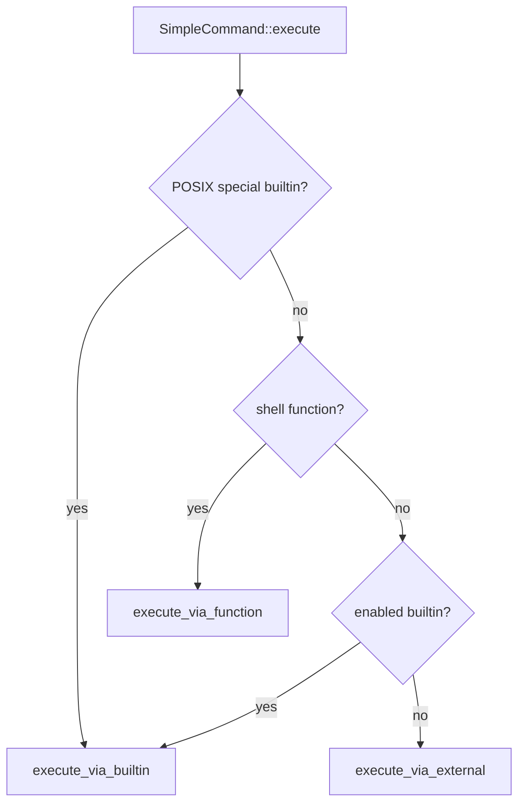

# Shell Core Runtime

# Shell Core Runtime

The Shell Core Runtime implements the execution layer behind a `brush_core::Shell`: command dispatch, builtins, functions, arithmetic evaluation, call-stack tracking, brace expansion, and programmable completion.

It is designed to be embedded. Callers create a shell with `Shell::builder().build().await?`, run source text with `Shell::run_string(...)`, invoke registered shell functions with `Shell::invoke_function(...)`, and customize behavior by registering builtins through `Shell::builder().builtin(...)`.

## Execution Model

A simple command is represented by `commands::SimpleCommand`. Its `execute` method resolves the command in this order:

1. POSIX special builtin, when POSIX mode is enabled.
2. Shell function, if `use_functions` is true.
3. Regular builtin, if registered and not disabled.
4. External command found through the shell PATH cache or an explicit path.



The dispatch path preserves shell behavior around `$_`: each builtin, function, external command, and command-not-found path computes the last argument with `SimpleCommand::take_last_arg` and updates the shell through `shell.update_last_arg_variable(...)`.

## Command Context and File Descriptors

`commands::ExecutionContext<'a, SE>` is the execution-time handle passed into builtins and command helpers. It contains:

- `shell: &'a mut Shell<SE>`
- `command_name: String`
- `params: ExecutionParameters`

The context exposes shell I/O through:

- `stdin()`
- `stdout()`
- `stderr()`
- `try_fd(fd)`
- `iter_fds()`
- `cancel_token()`
- `is_cancelled()`

Builtins should use these context methods instead of directly assuming process-level standard streams. This lets redirections, pipes, subshells, null output, and injected file descriptors behave consistently.

External commands are constructed by `compose_std_command(...)`. It sets:

- program path and `argv[0]`
- command arguments
- current working directory from `context.shell.working_dir()`
- exported shell variables
- exported shell functions as `BASH_FUNC_<name>%%`
- stdin, stdout, stderr, and extra file descriptors from `ExecutionParameters`

`execute_external_command(...)` then applies process-group/session behavior and spawns the process through `sys::process::spawn`.

## Builtin Registration

Builtin commands are registered through `builtins::Registration<SE>`. A registration stores:

- `execute_func`
- `content_func`
- `disabled`
- `special_builtin`
- `declaration_builtin`

There are several registration helpers:

- `builtins::builtin::<B, SE>()` for `Command` implementations.
- `builtins::simple_builtin::<B, SE>()` for `SimpleCommand` implementations.
- `builtins::decl_builtin::<B, SE>()` for declaration-aware commands.
- `builtins::raw_arg_builtin::<B, SE>()` for declaration commands that receive raw arguments.

The main trait for clap-backed builtins is `builtins::Command`:

```rust
pub trait Command: clap::Parser {
    type Error: BuiltinError + 'static;

    fn new<I>(args: I) -> Result<Self, clap::Error>
    where
        I: IntoIterator<Item = String>;

    fn execute<SE: extensions::ShellExtensions>(
        &self,
        context: commands::ExecutionContext<'_, SE>,
    ) -> impl Future<Output = Result<results::ExecutionResult, Self::Error>> + Send;
}
```

`Command::new` delegates to `clap::Parser`, with special handling for commands that opt into `+` options via `takes_plus_options()`. Since clap does not natively parse named options like `+x`, those are rewritten to internal `--+x` arguments before parsing.

`exec_builtin_impl` converts `CommandArg` values into strings, parses the command, writes clap usage errors to `context.stderr()`, and returns `ExecutionExitCode::InvalidUsage` on parse failure. Successful parses are executed through `call_builtin(...)`.

Declaration builtins use `DeclarationCommand::set_declarations(...)`. `exec_declaration_builtin_impl` separates option-like leading strings from declaration arguments, parses only the options, then passes the remaining `CommandArg` values to the command.

## Custom Builtins

The `examples/custom-builtin.rs` file shows the intended extension pattern:

1. Define a custom error type implementing `BuiltinError`.
2. Map errors to `ExecutionExitCode` with `From<&Error> for ExecutionExitCode`.
3. Define arguments with `clap::Parser`.
4. Implement `builtins::Command`.
5. Register with `Shell::builder().builtin("name", builtins::builtin::<Command, SE>())`.

The example command `GreetCommand` uses `context.shell.basic_expand_string(...)` and writes through `context.stdout()`, which keeps it integrated with shell expansion and redirection.

## Shell Functions

Shell functions are stored in the shell function registry and invoked either by command dispatch or directly with `Shell::invoke_function(...)`.

`commands::invoke_shell_function(...)` performs the runtime work:

1. Reads the function body and definition-time redirects from `functions::Registration`.
2. Applies redirects with `interp::setup_redirect(...)`.
3. Enters the function frame with `shell.enter_function(...)`.
4. Executes the body through `body.execute(shell, &params).await`.
5. Drops cloned execution parameters so owned files are closed.
6. Leaves the function with `shell.leave_function()`.
7. Converts `ReturnFromFunctionOrScript` back to normal control flow.

Function invocation strips the function name from the argument list before passing positional arguments into the function body.

The `examples/call-func.rs` example demonstrates the embedding surface:

- create a shell with `Shell::builder()`
- define a function by running source with `run_string`
- inspect registered functions through `shell.funcs().iter()`
- call the function with `invoke_function`

## Subshell Command Substitution

`invoke_command_in_subshell_and_get_output(...)` runs a string in a cloned shell and captures stdout through a pipe.

Important behavior:

- The parent shell is cloned, so variable mutations are isolated.
- `errexit` is disabled unless `command_subst_inherits_errexit` is enabled.
- command output marking is disabled.
- the subprocess uses `ProcessGroupPolicy::SameProcessGroup`.
- the parent shell receives the command substitution exit status through `shell.set_last_exit_status(...)`.

`run_substitution_command(...)` parses the command string and normally delegates to `shell.run_parsed_result(...)`. It has one special case: a command substitution that consists only of a bare input redirection, such as `< file`, is treated like copying stdin to stdout after `interp::setup_redirect(...)`.

## External Process Session Handling

External commands use `child_session_action(...)` to decide whether to detach, foreground, or leave the child session unchanged.

The decision is based on:

- whether a new process group is requested
- whether child stdin is a terminal
- whether the command belongs to a pipeline group

`ChildSessionAction::DetachSession` is used for non-interactive embedded hosts where the child inherits a controlling tty but is not part of an interactive job-control path. Pipeline commands are not detached because pipeline stages must remain in a compatible process-group/session relationship.

## Call Stack

`callstack.rs` tracks execution frames for scripts, functions, traps, eval, command strings, and interactive sessions.

The main types are:

- `CallStack`
- `Frame`
- `FrameType`
- `ScriptCall`
- `FunctionCall`
- `ScriptCallType`
- `FormatOptions`
- `FormatCallStack`

Frames are pushed with methods such as:

- `push_script(...)`
- `push_function(...)`
- `push_trap_handler(...)`
- `push_eval()`
- `push_command_string()`
- `push_interactive_session()`

`CallStack::pop()` removes the most recent frame and updates derived state:

- function call depth
- sourced-script depth
- active trap signal set

The stack also tracks trap delivery suppression with `acquire_trap_delivery_block()` and `release_trap_delivery_block()`. Completion functions use this to prevent trap delivery while completion state is temporarily installed.

Source locations are adjusted through `Frame::current_pos_as_source_info()` and `Frame::adjusted_source_info()`. These combine the frame’s `SourceInfo`, current AST-relative position, and line offset. This lets errors and diagnostics report positions relative to the script, function, eval, or command-string context that is currently executing.

## Arithmetic Evaluation

`arithmetic.rs` evaluates shell arithmetic expressions.

The high-level entry point is:

```rust
expand_and_eval(shell, params, expr, trace_if_needed).await
```

It performs three steps:

1. Shell-expand the raw arithmetic expression with `basic_expand_word_with_options`.
2. Parse the expanded expression with `brush_parser::arithmetic::parse`.
3. Evaluate the parsed `ast::ArithmeticExpr`.

Parsed expressions implement `Evaluatable` through `ast::ArithmeticExpr::eval`, which delegates to `eval_expr_impl(...)`.

Supported expression forms include:

- literals
- variable and array references
- unary operators
- binary operators
- conditional expressions
- assignments
- prefix/postfix increment and decrement
- compound assignment

Variable references are resolved by `deref_lvalue(...)`. Variable values are parsed as arithmetic expressions, so chained arithmetic references work. To prevent cycles such as `a=b`, `b=c`, `c=a`, evaluation is capped by `MAX_VARIABLE_DEREF_DEPTH`.

Assignments update the shell environment through:

- `env_mut().update_or_add(...)` for scalar variables
- `env_mut().update_or_add_array_element(...)` for array elements

Arithmetic operations intentionally use wrapping integer behavior for most operators. Division and modulo report `EvalError::DivideByZero`, and exponentiation rejects negative exponents with `EvalError::NegativeExponent`.

Logical `&&`, logical `||`, and conditional expressions short-circuit: only the necessary branch or operand is evaluated.

## Brace Expansion

`braceexpansion.rs` turns parsed brace expression pieces into generated strings.

The main entry point is:

```rust
generate_and_combine_brace_expansions(pieces)
```

It expands each `BraceExpressionOrText` into a list of strings, then combines the lists with `itertools::multi_cartesian_product()` and joins each product into one output string.

Supported member forms are:

- numeric sequences
- character sequences
- nested child brace expressions

Numeric and character sequences normalize an increment of `0` to `1`, support ascending and descending ranges, and use the absolute value of the requested increment.

This module is called from expansion through `brace_expand_if_needed(...)`, so it participates in normal word expansion rather than command execution directly.

## Programmable Completion

`completion.rs` stores and evaluates bash-like completion specifications.

The main configuration type is `completion::Config`, which contains:

- command-specific specs
- default spec
- empty-line spec
- initial-word spec
- current in-flight completion options
- fallback filename behavior

A completion policy is represented by `completion::Spec`. It can combine:

- action generators, such as `CompleteAction::Builtin`, `CompleteAction::Function`, `CompleteAction::File`, or `CompleteAction::Command`
- a `word_list`
- a `glob_pattern`
- a shell `function_name`
- an external completion `command`
- filter, prefix, and suffix transforms
- generation options from `GenerationOptions`

`Spec::get_completions(...)` is the central execution path. It stores current completion options on the shell, generates candidates, applies filters and transforms, adds directory/default fallbacks when requested, sorts candidates unless disabled, and returns `Answer::Candidates`.

Completion functions are invoked by `Spec::call_completion_function(...)`. This temporarily installs bash-compatible variables such as:

- `COMP_LINE`
- `COMP_POINT`
- `COMP_KEY`
- `COMP_TYPE`
- `COMP_WORDS`
- `COMP_CWORD`

It then calls the function with `shell.invoke_function(...)`. If the function returns `124`, completion restarts with `Answer::RestartCompletionProcess`. Otherwise, candidates are read from `COMPREPLY`.

Completion commands are invoked by `Spec::call_completion_command(...)`. That path clones the shell, exports completion variables, builds a quoted command line, runs it through `commands::invoke_command_in_subshell_and_get_output(...)`, and splits stdout into completion candidates.

## Expansion Connections

Several shell features depend on expansion before execution:

- arithmetic uses `basic_expand_word_with_options(...)` before parsing arithmetic
- completion `word_list` uses `full_expand_and_split_word_with_options(...)` with pathname expansion disabled
- brace expansion is reached through `brace_expand_if_needed(...)`
- completion command arguments are quoted through `escape::quote_if_needed(...)`

The runtime separates these responsibilities: command dispatch does not parse arithmetic or brace expressions directly, and completion delegates back to shell expansion where bash compatibility requires it.

## Error and Result Handling

Execution functions generally return either `error::Error` or `ExecutionResult`.

Builtins use `BuiltinError` so command-specific errors can map to shell exit codes. `execute_builtin_command(...)` also handles two shell-specific cases:

- broken pipe errors are converted into the appropriate exit code
- special builtin errors become fatal in POSIX mode

Command parsing errors from clap are written to stderr and mapped to `ExecutionExitCode::InvalidUsage`.

Function execution normalizes `ReturnFromFunctionOrScript` after the function body returns. `BreakLoop` or `ContinueLoop` escaping from a function currently returns an unimplemented error.

## Embedding Patterns

A minimal embedded shell creates a runtime, builds a shell, then drives async shell APIs:

```rust
let shell = brush_core::Shell::builder().build().await?;
```

A custom builtin is added at build time:

```rust
let mut shell = brush_core::Shell::builder()
    .builtin("greet", brush_core::builtins::builtin::<GreetCommand, SE>())
    .build()
    .await?;
```

A function can be defined by evaluating shell source:

```rust
shell
    .run_string(script, &brush_core::SourceInfo::default(), &shell.default_exec_params())
    .await?;
```

A function can then be invoked directly:

```rust
shell
    .invoke_function("hello", std::iter::once("arg"), &params)
    .await?;
```

These APIs all route through the same runtime state: builtins, functions, execution parameters, open files, environment, call stack, and shell options.