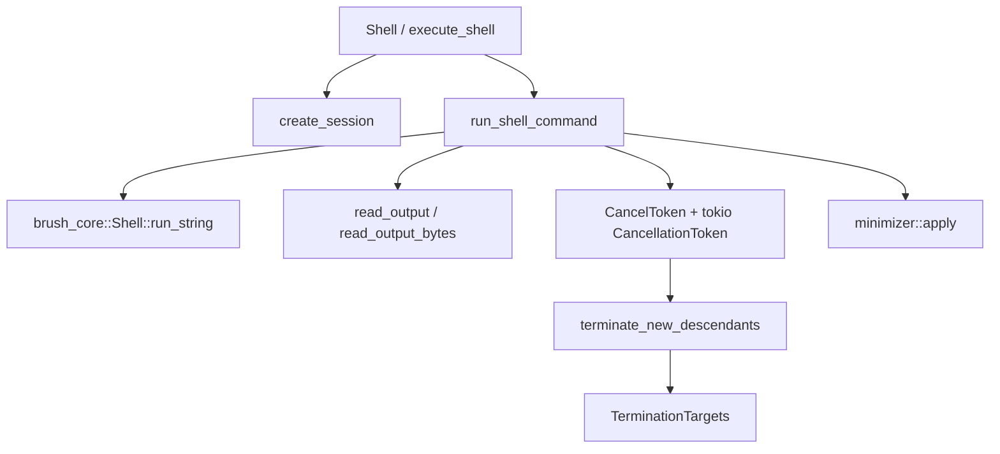

# Shell Execution Utilities

# Shell Execution Utilities

`crates/pi-shell` provides the shell execution layer used by the coding agent runtime. It wraps `brush_core` with agent-specific behavior for command execution, cancellation, output streaming, output minimization, command fixups, and cross-platform process cleanup.

The public surface is re-exported from `src/lib.rs`:

```rust
pub use shell::{
    execute_shell,
    execute_shell_streams,
    Shell,
    ShellExecuteOptions,
    ShellExecuteResult,
    ShellOptions,
    ShellRunOptions,
    ShellRunResult,
    StreamSinks,
    MinimizerResult,
};
```

## Architecture



At a high level:

1. Callers configure execution through `ShellOptions`, `ShellRunOptions`, or `ShellExecuteOptions`.
2. `create_session` builds an isolated `brush_core::Shell`.
3. `run_shell_command` or `run_shell_command_streams` runs the command with controlled stdin/stdout/stderr.
4. Cancellation is bridged into both `brush_core` cancellation and OS-level process cleanup.
5. Output is streamed, truncated, optionally minimized, and returned as `ShellRunResult`.

## Execution Modes

The module exposes two execution styles.

`Shell` is a reusable session wrapper. It stores a `BrushShell` inside:

```rust
pub struct Shell {
    session:     Arc<TokioMutex<Option<ShellSessionCore>>>,
    abort_state: ShellAbortState,
    config:      ShellConfig,
}
```

Use `Shell::run` when commands should share a shell session. The session survives while `session_keepalive` returns true, and is discarded if the command exits the shell or leaves non-normal control flow.

`execute_shell` is one-shot execution. It creates a fresh session for the command and drops it afterward. This path captures a baseline of current descendants before starting the task so cancellation can terminate only processes created by this command.

`execute_shell_streams` is also one-shot, but keeps stdout and stderr separate as raw `Bytes` chunks. It intentionally disables minimization because `MinimizerResult` is defined around one merged transcript.

## Session Creation

`create_session` builds a runtime-agnostic shell using `brush_core::Shell::builder()`:

```rust
let mut shell = BrushShell::builder()
    .do_not_inherit_env(true)
    .profile(ProfileLoadBehavior::Skip)
    .rc(RcLoadBehavior::Skip)
    .builtins(default_builtins(BuiltinSet::BashMode))
    .build()
    .await?;
```

The shell is deliberately isolated:

- User profile and rc files are skipped.
- The inherited environment is rebuilt manually.
- Dangerous or session-breaking builtins are disabled:
  - `exec`
  - `suspend`
- Local builtins are registered:
  - `sleep`
  - `timeout`

Environment handling is split between session-level and command-level state.

`ShellOptions.session_env` applies to the shell session itself. `ShellRunOptions.env` and `ShellExecuteOptions.env` are applied by `apply_command_env` using a temporary `EnvironmentScope::Command` scope, which is popped after execution.

`should_skip_env_var` filters shell-internal variables such as `BASH_ENV`, `SHELLOPTS`, `PWD`, `OLDPWD`, prompt variables, Bash function exports, and other values that would make brush behave like the host interactive shell rather than a controlled command runner.

On Windows, environment key normalization and PATH behavior are special:

- `normalize_env_key` canonicalizes `PATH`.
- `merge_path_values` combines path values without duplicate normalized segments.
- `configure_windows_path` adds Windows-specific PATH support after the base environment is installed.

`apply_env_fallback` defines a non-exported shell variable named `env` with the literal value `$env`. This prevents brush POSIX expansion from destroying PowerShell-style references such as `$env:NAME` when those commands are passed through brush to another subprocess.

## Command Execution

The core execution path is `run_shell_command`.

It prepares the shell by:

1. Applying `cwd` with `set_working_dir`.
2. Pushing command-scoped env vars through `apply_command_env`.
3. Determining minimizer mode with `minimizer::engine::mode_for`.
4. Creating output pipes with `pipe_to_files`.
5. Routing stdin to `null_file`.
6. Routing stdout and stderr to the same output pipe.
7. Setting `ProcessGroupPolicy::NewProcessGroup`.
8. Installing a `tokio_util::sync::CancellationToken` into brush execution params.

The actual shell call is:

```rust
session
    .shell
    .run_string(options.command.clone(), &source_info, &params)
    .await
```

`exit_code` converts `brush_core::ExecutionExitCode` into conventional process codes:

- `Success` -> `0`
- `GeneralError` -> `1`
- `InvalidUsage` -> `2`
- `CannotExecute` -> `126`
- `NotFound` -> `127`
- `Interrupted` -> `130`
- `BrokenPipe` -> `141`
- `Custom(code)` -> `code`

After brush returns, the runner gives output readers a bounded post-exit drain window. This matters because background jobs can keep the output pipe open even after the foreground command completes. The constants are intentionally short:

```rust
const POST_EXIT_IDLE: Duration = Duration::from_millis(250);
const POST_EXIT_MAX: Duration = Duration::from_secs(2);
const READER_SHUTDOWN_TIMEOUT: Duration = Duration::from_millis(250);
```

If the reader does not finish naturally, `shutdown_reader_task` or `shutdown_reader_unit_task` cancels it and aborts it after the timeout.

## Output Handling

Merged text output uses `read_output`.

It reads from a pipe in chunks, decodes UTF-8 incrementally, and emits replacement characters for invalid byte sequences. The buffer includes an extra four bytes so incomplete UTF-8 sequences can be carried across reads.

Output is bounded by `OutputBudget`:

```rust
struct OutputBudget {
    remaining: Arc<AtomicUsize>,
    truncated: Arc<AtomicUsize>,
}
```

The default limit is `8 * 1024 * 1024` bytes. Once the budget is exceeded, additional bytes are counted in `truncated`, and the result reports:

```rust
output_truncated: bool
output_truncated_bytes: u64
```

Separated raw-stream execution uses `read_output_bytes`. It drains stdout and stderr independently into optional `StreamSinks`:

```rust
pub struct StreamSinks {
    pub stdout: Option<mpsc::UnboundedSender<Bytes>>,
    pub stderr: Option<mpsc::UnboundedSender<Bytes>>,
}
```

If a sink is `None`, the stream is still drained to avoid blocking the child process, but its bytes are discarded. Separate stream mode reports `stdout_truncated`, `stderr_truncated`, and byte counts independently.

## Minimizer Integration

`run_shell_command` supports optional output minimization through `minimizer::MinimizerConfig`.

When minimization is enabled, output is still streamed live to `on_chunk`, but it is also buffered up to `max_capture_bytes`. After the command exits, the captured transcript can be transformed by:

```rust
minimizer::apply(&options.command, &output.text, exit_code(&result), config)
```

A changed minimizer result is returned as:

```rust
pub struct MinimizerResult {
    pub filter:        String,
    pub text:          String,
    pub original_text: String,
    pub input_bytes:   u32,
    pub output_bytes:  u32,
}
```

The caller can use this to replace the accumulated live transcript with the minimized text while still preserving responsive streaming during execution.

`build.rs` supports the minimizer by generating `builtin_filters.toml`. `generate_minimizer_builtin_filters` reads all TOML files under `src/minimizer/defs`, removes duplicate `schema_version` lines from individual definitions, concatenates them under one generated schema header, and writes the result into Cargo `OUT_DIR`.

## Cancellation Model

Cancellation uses two token types from `cancel.rs`.

`CancelToken` is passed into execution APIs. It can represent:

- no cancellation source,
- a timeout deadline,
- an abortable shared flag,
- or both a deadline and an abort flag.

`AbortToken` is the external handle that can trigger cancellation:

```rust
pub fn abort(&self, reason: AbortReason)
```

`AbortReason` distinguishes:

```rust
pub enum AbortReason {
    Unknown,
    Timeout,
    Signal,
    User,
}
```

`CancelToken::heartbeat` is used by polling loops such as `wait_for_exit` to fail early if a token was aborted or timed out. `CancelToken::wait` asynchronously resolves to either the flag reason or `AbortReason::Timeout`.

`Shell::abort` does not directly kill a process. It calls `ShellAbortState::abort`, which marks active command generations or records a pending abort if no command is active yet. This avoids losing a signal that arrives between token publication and command activation.

For each session run:

1. `ShellAbortState::publish` stores an `AbortToken`.
2. `ShellAbortState::activate` marks the generation active.
3. If an abort was pending, the active token receives `AbortReason::Signal`.
4. `ShellAbortState::clear` removes the generation after completion or cancellation.

## Process Cleanup

`process.rs` provides stable process references and tree termination across Linux, macOS, and Windows.

The public wrapper is:

```rust
pub struct Process {
    inner: platform::Process,
}
```

It exposes:

- `Process::from_pid`
- `Process::from_path`
- `pid`
- `ppid`
- `args`
- `children`
- `status`
- `group_id`
- `kill_tree`
- `terminate_tree`
- `wait_for_exit`

The implementation is platform-specific.

On Linux, `platform::Process` stores:

```rust
pid: i32
pidfd: Arc<OwnedFd>
start_time: u64
```

The pidfd gives a stable kernel handle, and `start_time` protects against PID reuse when reading `/proc`.

On macOS, there are no pidfds, so identity is pinned by `proc_bsdinfo` start time:

```rust
pid:          i32
start_tvsec:  u64
start_tvusec: u64
```

Descendant discovery uses `proc_listallpids` plus `pbi_ppid`, not `proc_listchildpids`, because the latter can fail when a process queries its own children on recent macOS kernels.

On Windows, `platform::Process` stores an owned process handle and creation time:

```rust
pid:           i32
handle:        Arc<OwnedHandle>
creation_time: u64
```

The handle pins the original process object, while creation time guards operations that must re-open a PID, such as reading the command line.

`terminate_tree` sends escalating waves:

1. Optional process group `TERM_SIGNAL`.
2. `TERM_SIGNAL` to live descendants.
3. `TERM_SIGNAL` to the root.
4. Optional grace wait.
5. Optional process group `KILL_SIGNAL`.
6. `KILL_SIGNAL` to a freshly walked descendant tree.
7. `KILL_SIGNAL` to the root.
8. Wait for exit up to `timeout_ms`.

`wait_for_exit` polls every 50ms and checks `CancelToken::heartbeat` between sleeps.

## Descendant Target Selection

One-shot command cancellation uses baseline descendant tracking.

Before a command starts, `run_shell_oneshot` and `run_shell_oneshot_streams` call:

```rust
let baseline_descendants = process::current_descendant_pids();
```

On cancellation, `terminate_new_descendants` rescans descendants and calls:

```rust
process::add_new_descendants(&mut targets, baseline)
```

`add_new_descendants` converts live descendants into `DescendantInfo` records and passes them to `select_termination_targets`.

`select_termination_targets` is intentionally conservative. It only adopts a process group when that process group leader is also a new descendant. This prevents a subprocess that inherited the harness process group from causing `kill(-harness_pgid, SIGTERM)`, which would terminate the agent itself.

The kill-set rule is:

- Always track new descendant PIDs individually.
- Track a PGID only if the PGID is positive and belongs to a new descendant that is also the group leader.
- Ignore baseline descendants.
- De-duplicate PGIDs.

`kill_process_group` has a second safety check: on Unix it refuses to signal the current process group, even if a future caller accidentally passes it.

## Command Fixups

`fixup.rs` contains conservative command rewrites applied before bash execution.

The public API is:

```rust
pub fn apply_bash_fixups(cmd: &str) -> BashFixupResult
```

It returns:

```rust
pub struct BashFixupResult {
    pub command:  String,
    pub stripped: Vec<String>,
}
```

Two rewrites are supported.

First, trailing `| head ...`, `| tail ...`, and `|& head ...` / `|& tail ...` are stripped from top-level pipeline segments. The harness already truncates output and preserves the full result elsewhere, so these pipes hide useful content without reducing execution cost.

Second, a redundant trailing `2>&1` is stripped when no pipe or other redirect remains. Since the harness already merges stderr into stdout for normal text execution, this redirect is cosmetic.

The implementation uses `brush_parser`, not handwritten shell parsing. `apply_bash_fixups` parses a `Program`, walks top-level `AndOrList` pipelines, and uses AST source locations to compute byte ranges. It deliberately avoids:

- multi-line commands,
- parse failures,
- nested compound bodies,
- `head` or `tail` commands with filenames,
- `tail -f`, `tail +N`, `--follow`, or other semantic options,
- commands with redirects on the `head` or `tail` segment,
- non-final `head` or `tail` stages.

`is_safe_head_tail` accepts only output-limiting argument shapes matched by `SAFE_ARG_RE`, such as `-n 5`, `-n5`, `--lines=20`, `-5`, `--bytes=200`, `--quiet`, and bare numeric values.

The `2>&1` pass depends on the head/tail pass. For a command like:

```bash
cargo build 2>&1 | head -50
```

the fixup first strips `| head -50`, then recognizes the now-trailing `2>&1` as redundant and strips it too.

## Background Jobs and Stragglers

The execution layer handles more than foreground process cancellation.

When a command is cancelled inside `run_shell_command`, `terminate_background_jobs` inspects `session.shell.jobs().jobs`, records each job process group and representative PID in `TerminationTargets`, sends `TERM_SIGNAL`, waits briefly, then sends `KILL_SIGNAL`.

Separately, `terminate_new_descendants` runs a three-wave rescan-and-signal loop. Each wave rebuilds `TerminationTargets` from the current process tree so descendants spawned during a prior grace period are still reached.

This is why cancellation has both a brush cancellation token and OS process cleanup:

- brush cancellation stops shell evaluation,
- descendant termination cleans up subprocesses that have already escaped into the OS process tree,
- background-job termination cleans up jobs tracked by the shell session.

## Result Shape

Both `Shell::run` and one-shot execution return `ShellRunResult` / `ShellExecuteResult`:

```rust
pub struct ShellRunResult {
    pub exit_code:              Option<i32>,
    pub cancelled:              bool,
    pub timed_out:              bool,
    pub minimized:              Option<MinimizerResult>,
    pub output_truncated:       bool,
    pub output_truncated_bytes: u64,
    pub stdout_truncated:       bool,
    pub stdout_truncated_bytes: u64,
    pub stderr_truncated:       bool,
    pub stderr_truncated_bytes: u64,
}
```

`exit_code` is `None` when execution is interrupted by timeout or cancellation before brush returns a normal result.

`cancelled` is set when the cancellation reason is `AbortReason::Signal`.

`timed_out` is set when the cancellation reason is `AbortReason::Timeout`.

The truncation fields distinguish merged-output execution from raw split-stream execution:

- `output_truncated` applies to merged stdout/stderr text.
- `stdout_truncated` and `stderr_truncated` apply to `execute_shell_streams`.

## Connections to the Rest of the Codebase

`pi-shell` sits between higher-level agent tools and lower-level process primitives.

It depends on `brush_core` for shell parsing and execution, including:

- `BrushShell`
- `ExecutionResult`
- `ExecutionExitCode`
- `ProcessGroupPolicy`
- `OpenFiles`
- shell variables and environment scopes

It uses `brush_parser` in `fixup.rs` to safely inspect shell syntax before execution.

It calls into the local minimizer through:

- `minimizer::engine::mode_for`
- `minimizer::apply`
- `minimizer::MinimizerConfig`

It exposes process cleanup utilities that can be reused outside direct shell execution:

- `Process::from_pid`
- `Process::from_path`
- `Process::terminate_tree`
- `TerminationTargets`
- `current_descendant_pids`
- `add_new_descendants`

The call graph also shows external users of process references and signaling in native/runtime layers, including task execution, terminal handling, signal handling, clipboard/image helpers, and project filesystem sessions. That makes `Process` safety important beyond shell commands: PID reuse protection and process-group filtering prevent cleanup code in one subsystem from accidentally targeting unrelated runtime processes.

## Contributor Notes

When changing command execution, preserve the separation between shell cancellation and process cleanup. A `tokio_util::sync::CancellationToken` stops brush execution, but it does not guarantee that spawned children exit. The descendant and job cleanup paths are part of the correctness contract.

When changing process cleanup, keep the `select_termination_targets` invariant intact: never add a PGID unless its leader is part of the new descendant set. This is the guard that prevents cancellation from killing the harness process group.

When changing output handling, maintain both live streaming and bounded memory behavior. Large outputs must remain capped by `OutputBudget`, and byte streams must be drained even when the caller does not request a sink.

When changing fixups, keep them AST-driven. Shell syntax edge cases such as quotes, command substitution, heredocs, and compound commands should remain delegated to `brush_parser`; textual scanning is only used in the narrow `2>&1` case because `IoRedirect` lacks a source span.