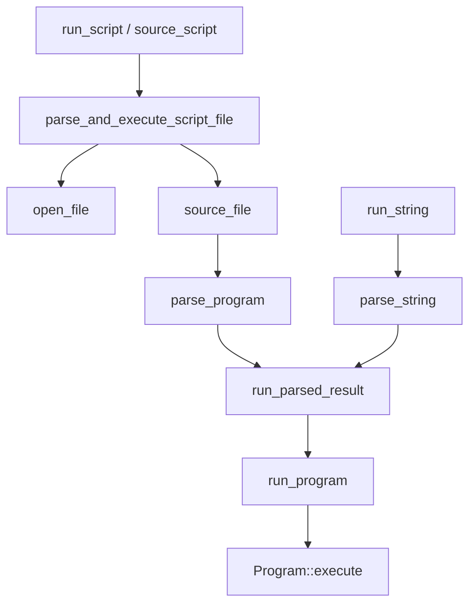

# Shell Session API

# Shell Session API

The Shell Session API is the public-facing control surface for constructing, configuring, and driving a `Shell<SE>` instance in `crates/brush-core-vendored/src/shell/`. It groups session lifecycle, parsing, execution, environment access, filesystem behavior, builtins, functions, prompts, completion, traps, history, and state access around the central `Shell<SE>` type.

`SE` is a `ShellExtensions` implementation. Most users use `Shell::builder()` with `DefaultShellExtensions`; embedders that need custom error formatting or extension behavior use `Shell::builder_with_extensions::<SE>()`.

## Construction

Shell instances are created through `ShellBuilder`, generated from `CreateOptions<SE>` by `bon::Builder`.

```rust
let mut shell = Shell::builder()
    .interactive(true)
    .login(false)
    .enable_option("errexit")
    .var("FOO", ShellVariable::new("bar"))
    .build()
    .await?;
```

The builder has two layers:

- Generated setters for `CreateOptions` fields, such as `interactive`, `login`, `working_dir`, `shell_name`, `shell_args`, `profile`, and `rc`.
- Hand-written collection helpers, such as `enable_option`, `disable_option`, `enable_shopt_option`, `builtin`, `builtins`, and `var`.

`ShellBuilder::build()` calls `build_settings()`, extracts profile and rc loading behavior, constructs the shell with `Shell::new(options)`, then calls `shell.load_config(&profile, &rc).await` unless both behaviors skip configuration loading.

The default shell state is defined by `impl Default for Shell<SE>`. It initializes the environment, options, jobs, call stack, open files, aliases, function environment, path cache, completion config, parser implementation, and history-related fields.

## Initialization Scripts

Configuration loading is controlled by two enums:

```rust
pub enum ProfileLoadBehavior {
    LoadDefault,
    Skip,
}

pub enum RcLoadBehavior {
    LoadDefault,
    LoadCustom(PathBuf),
    Skip,
}
```

`Shell::load_config()` uses current runtime options to choose what to source:

- Login shells load system profile, then user profile files.
- Interactive non-login shells load rc files unless `sh_mode` or `RcLoadBehavior::Skip` prevents it.
- `RcLoadBehavior::LoadCustom(path)` sources only that custom rc file.
- Non-interactive non-login shells check `ENV` in sh mode or `BASH_ENV` otherwise, but this path is currently unimplemented.

Configuration files are sourced through `source_if_exists()`, which calls `source_script()` only when the path exists.

## Execution Model

The execution API exposes three main entry points:

```rust
shell.run_string(command, &source_info, &params).await?;
shell.run_dash_c_command(command).await?;
shell.run_script(path, args).await?;
```

`default_exec_params()` derives an `ExecutionParameters` value from shell options. In particular, it sets `process_group_policy` to `NewProcessGroup` when job control is enabled, and `SameProcessGroup` otherwise.

The core execution path is:



`run_script()` and `run_dash_c_command()` are terminal-style entry points: after execution, they call `on_exit()` so EXIT traps and other exit handling can run.

`source_script()` uses the same parser and executor pipeline, but marks the call stack with `ScriptCallType::Source`. If a sourced script exits through `return`, `parse_and_execute_script_file()` consumes that boundary control flow by resetting `ExecutionControlFlow::ReturnFromFunctionOrScript` to `Normal`.

`run_parsed_result()` centralizes parse and execution error handling. Parse errors become fatal shell errors. Runtime errors are displayed through `display_error()`, converted into an `ExecutionResult`, and reflected into `last_exit_status`.

## Parsing

Parsing lives in `parsing.rs`:

- `parse(reader)` parses a reader into `brush_parser::ast::Program`.
- `parse_string(s)` parses a string and uses the cached `parse_string_impl()`.
- `parser_options()` derives `brush_parser::ParserOptions` from current shell options.

The parser configuration reflects mutable runtime state:

```rust
brush_parser::ParserOptions {
    enable_extended_globbing: self.options.extended_globbing,
    posix_mode: self.options.posix_mode,
    sh_mode: self.options.sh_mode,
    tilde_expansion_at_word_start: true,
    tilde_expansion_after_colon: false,
    parser_impl: self.parser_impl,
}
```

Several other modules reuse parsing directly. For example, prompt expansion parses prompt command substitutions through `parse()`, arithmetic code paths parse shell fragments, and `define_func_from_str()` parses a function body using `create_parser()`.

## Environment API

`env.rs` provides the narrow public API for shell variables:

```rust
shell.env_str("PATH");
shell.env_var("HOME");
shell.set_env_global("NAME", ShellVariable::new("value"))?;
```

`env_str()` converts a variable into string form using the current shell context, which matters for shell values whose display depends on state. `env_var()` returns the underlying `ShellVariable`. `set_env_global()` writes into the global environment scope.

The builder’s `var()` method adds initial variables before the shell is built. Those variables are applied after inherited or well-known variables when those initialization paths are active.

## Shell State Access

`ShellState` is a dyn-safe trait for constrained access to shell internals. It exposes state needed by builtins, expansion, prompt handling, execution, and embedding code without requiring direct field access.

Important groups include:

- Environment: `env()`, `env_mut()`
- Options: `options()`, `options_mut()`
- Aliases: `aliases()`, `aliases_mut()`
- Jobs: `jobs()`, `jobs_mut()`
- Traps: `traps()`, `traps_mut()`
- Open files: `open_files()`, `open_files_mut()`
- Call stack: `call_stack()`
- Current identity: `current_shell_name()`, `current_shell_args()`, `working_dir()`
- Status: `last_exit_status()`, `set_last_exit_status()`, `last_pipeline_statuses()`
- History and completion: `history()`, `history_mut()`, `completion_config()`

This trait is the shared read/write contract used by adjacent subsystems that need shell state but should not own the full `Shell<SE>` implementation surface.

## Call Stack and Positional Parameters

`callstack.rs` tracks execution context: interactive sessions, command-string mode, scripts, sourced scripts, functions, and trap handlers.

Public lifecycle helpers include:

```rust
shell.start_interactive_session()?;
shell.end_interactive_session()?;
shell.start_command_string_mode();
shell.end_command_string_mode()?;
shell.in_sourced_script();
shell.in_function();
```

Function execution uses crate-private helpers:

- `enter_function()` checks `options.max_function_call_depth`, logs function entry when tracing is enabled, pushes a function frame, and pushes a local environment scope.
- `leave_function()` pops the local environment scope and validates that the popped call stack frame was a function.

`current_shell_args()` and `current_shell_args_mut()` implement shell positional-parameter shadowing rules. Function calls and executed scripts always shadow base shell arguments. Sourced scripts shadow them only when invoked with arguments. If no call stack frame overrides arguments, the shell falls back to `self.args`.

## Builtins

`builtin_registry.rs` manages per-shell builtin registrations:

```rust
shell.register_builtin("name", registration);
shell.register_builtin_if_unset("name", registration);
shell.builtin_mut("name");
shell.builtins();
```

`register_builtin()` replaces existing registrations. `register_builtin_if_unset()` preserves an existing registration and only inserts when the name is absent.

The builder mirrors this API at construction time with `builtin()` and `builtins()`, allowing embedders to install custom builtins before configuration files or user commands execute.

## Functions

Function definitions are stored in `functions::FunctionEnv` and exposed through:

```rust
shell.funcs();
shell.funcs_mut();
shell.define_func(name, definition, source_info);
shell.define_func_from_str(name, body_text)?;
shell.undefine_func(name);
shell.func_mut(name);
shell.invoke_function(name, args, params).await?;
```

`define_func()` wraps a parsed `brush_parser::ast::FunctionDefinition` in `functions::Registration`. `define_func_from_str()` is a convenience parser for function bodies that start with `()`.

`invoke_function()` looks up the named function, builds a `commands::ExecutionContext`, converts string arguments into `commands::CommandArg::String`, and delegates execution to `commands::invoke_shell_function()`. It then waits with the caller’s cancellation token. Completed function calls return the function’s exit code as `u8`; stopped child handling is currently unimplemented.

## Filesystem and PATH Behavior

`fs.rs` contains shell-aware filesystem operations.

`set_working_dir()` validates that the target exists and is a directory, normalizes the absolute path without canonicalizing it, updates `PWD`, swaps `working_dir`, and writes the previous directory into `OLDPWD`.

Path lookup methods use the shell’s current `PATH`:

```rust
shell.find_executables_in_path("git");
shell.find_executables_in_path_with_prefix("gi", false);
shell.find_first_executable_in_path("git");
shell.find_first_executable_in_path_using_cache("git");
```

`find_first_executable_in_path_using_cache()` consults `program_location_cache` first, then falls back to PATH search and stores successful results.

`absolute_path()` resolves relative paths against `working_dir()`. Empty paths and already-absolute paths are returned unchanged.

`open_file()` is the central shell-aware file opener. It handles platform special files before path resolution, resolves relative paths against the shell working directory, and supports `/dev/fd/<n>` by consulting the active `ExecutionParameters` file table. This is important for redirection and script sourcing, where the shell’s logical file descriptors may not match host process paths.

## Open Files and I/O

`io.rs` exposes shell stdout and stderr as writable objects:

```rust
write!(shell.stdout(), "output")?;
write!(shell.stderr(), "error")?;
```

If the corresponding descriptor is not available, the API returns a failing reader/writer instead of panicking.

`display_error()` uses the configured `SE::ErrorFormatter` to render errors into a provided writer.

`trace_command()` implements `set -x` style tracing. It expands `PS4`, adds call-depth prefixes, chooses `BASH_XTRACEFD` when it names a valid open file descriptor, and otherwise writes to stderr. Trace write failures are intentionally ignored so tracing cannot alter command execution.

`replace_open_files()` swaps the shell’s persistent open-file table and is intended for exec-like builtins.

## Expansion

`expansion.rs` exposes shell expansion helpers:

```rust
shell.ifs();
shell.basic_expand_string(params, word).await?;
shell.full_expand_and_split_string(params, word).await?;
```

`ifs()` returns the current `IFS` value or the default `" \t\n"`. `basic_expand_string()` delegates to `expansion::basic_expand_word()`. `full_expand_and_split_string()` delegates to `expansion::full_expand_and_split_word()` and returns fields after expansion and splitting.

These helpers provide a stable shell-level entry point while keeping the expansion engine in `crate::expansion`.

## Prompts

Prompt composition is implemented through `expand_prompt_var()`:

```rust
shell.compose_precmd_prompt().await?;        // PS0
shell.compose_prompt().await?;               // PS1 or default
shell.compose_alt_side_prompt().await?;      // BRUSH_PS_ALT
shell.compose_continuation_prompt().await?;  // PS2
```

The default primary prompt is `"$ "` in sh mode and `"brush$ "` otherwise.

Prompt expansion preserves command status. `expand_prompt_var()` saves `last_exit_status` and `last_pipeline_statuses`, expands the prompt through `prompt::expand_prompt()`, restores the saved status, and strips readline non-printing markers `\x01` and `\x02`.

## Completion and Readline State

`complete(input, position)` clones the current `completion_config` and delegates to `completion_config.get_completions(self, input, position).await`. Cloning the config avoids borrowing conflicts while completion logic mutates the shell.

Readline buffer state is represented through shell variables:

```rust
shell.set_edit_buffer(contents, cursor)?;
let maybe_buffer = shell.pop_edit_buffer()?;
```

`set_edit_buffer()` writes `READLINE_LINE` and `READLINE_POINT`. `pop_edit_buffer()` removes both variables, parses the point as `usize`, defaults invalid or missing points to `0`, and returns `None` when no line was stored.

## History

History support is optional and depends on `self.history`.

`history_file_path()` reads `HISTFILE`. `history_time_format()` reads `HISTTIMEFORMAT`.

`load_history()` opens the configured history file through `open_file()`, rejects files larger than 1 GiB, ignores empty regular files, and imports history with `crate::history::History::import()`.

`save_history()` writes unsaved history items back to `HISTFILE` when both a path and history object exist. It currently always appends and writes only unsaved items. If `HISTTIMEFORMAT` is set, timestamps are written.

`add_to_history()` trims the command, ignores empty commands, and stores a timestamped dirty history item.

## Job Control

`check_for_completed_jobs()` polls the `JobManager`. When job control is enabled, completed job changes are written to shell stderr.

The default process-group behavior for future execution also depends on job control: `default_exec_params()` chooses `NewProcessGroup` when `options.enable_job_control` is true.

## Trap Handling

`on_exit()` invokes the `EXIT` trap when one is registered.

`invoke_trap_handler()` is crate-private and handles the detailed trap semantics:

- Per-signal recursion guard prevents a trap from re-entering itself.
- Trap delivery blocks suppress trap execution.
- Function and subshell inheritance is gated by shell options for `ERR`, `DEBUG`, and `RETURN`.
- `EXIT` and system signal traps are visible regardless of `errtrace` or `functrace`.
- Handler execution uses `ProcessGroupPolicy::SameProcessGroup`.
- `$?` is preserved by saving and restoring `last_exit_status`.

Trap handlers execute by calling `run_string(&handler.command, &handler.source_info, &params).await`, so they use the same parser and executor path as ordinary command strings.

## How This Module Connects to the Codebase

The Shell Session API is an integration layer over lower-level subsystems:

- Parsing is delegated to `brush_parser`.
- Program execution is delegated through `interp::Execute` and `Program::execute`.
- Expansion delegates to `crate::expansion`.
- Prompt expansion delegates to `crate::prompt`.
- Function invocation delegates to `crate::commands::invoke_shell_function`.
- PATH lookup delegates to `crate::pathsearch`.
- Open-file behavior relies on `crate::openfiles` and `ExecutionParameters`.
- Error rendering is extension-provided through `SE::ErrorFormatter`.
- Runtime state is exposed through `ShellState` for builtins and interpreter code.

The module is intentionally broad because a shell session is the place where these subsystems meet. Contributors should usually preserve that boundary: keep parsing, expansion, command execution, and platform-specific filesystem behavior in their dedicated modules, and add shell methods only when they coordinate session state or expose a developer-facing session operation.