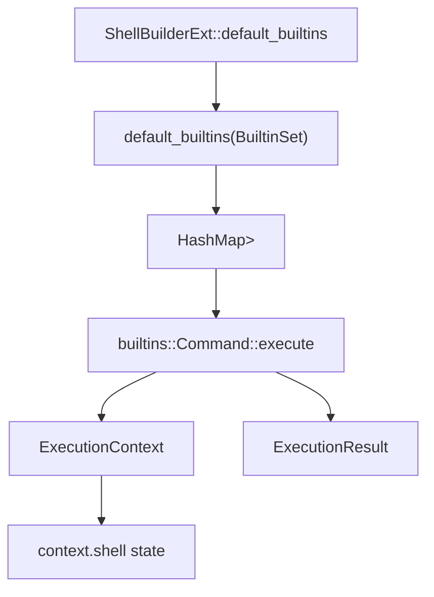

# Vendored Shell Builtins

# Vendored Shell Builtins

`crates/brush-builtins-vendored` provides the default shell builtin implementations used by the vendored Brush shell runtime. Each builtin is a small command adapter around `brush_core` shell state: it parses command-line flags with `clap`, reads or mutates the active `ExecutionContext`, writes to the context streams, and returns an `ExecutionResult`.

The module is registered through `default_builtins(set: BuiltinSet)`, which builds a `HashMap<String, builtins::Registration<SE>>` for either `BuiltinSet::ShMode` or `BuiltinSet::BashMode`. `ShellBuilderExt::default_builtins()` is the integration point for callers that configure a `brush_core::ShellBuilder`.



## Registration Model

`factory.rs` is the module index. It conditionally inserts builtin registrations based on Cargo features such as `builtin.cd`, `builtin.declare`, `builtin.complete`, and platform guards such as `unix`.

The factory uses several registration helpers from `brush_core::builtins`:

- `builtin::<T, SE>()` for normal parsed builtins implementing `builtins::Command`
- `decl_builtin::<T, SE>()` for declaration-style builtins that receive parsed assignment declarations
- `raw_arg_builtin::<T, SE>()` for commands like `builtin` that need raw command arguments
- `simple_builtin::<T, SE>()` for minimal commands implementing `builtins::SimpleCommand`

`BuiltinSet::ShMode` registers POSIX-oriented builtins and POSIX special builtins. `BuiltinSet::BashMode` extends that set with Bash-compatible commands such as `declare`, `echo`, `enable`, `complete`, `compgen`, `compopt`, `bind`, `history`, `caller`, `pushd`, `popd`, and `dirs`.

Special builtins are marked with `.special()`, which affects shell execution semantics in `brush_core`. Examples include `break`, `:`, `continue`, `.`, `eval`, `exec`, `exit`, `export`, `return`, `set`, `shift`, `trap`, `unset`, `readonly`, and `times`.

## Common Command Pattern

Most files define one command struct with `#[derive(Parser)]` and implement:

```rust
impl builtins::Command for SomeCommand {
    type Error = brush_core::Error;

    async fn execute<SE: brush_core::ShellExtensions>(
        &self,
        context: brush_core::ExecutionContext<'_, SE>,
    ) -> Result<brush_core::ExecutionResult, Self::Error> {
        ...
    }
}
```

The `ExecutionContext` is the command’s access point for:

- `context.shell`: aliases, jobs, variables, functions, builtins, completions, history, working directory, and options
- `context.stdout()` / `context.stderr()`: builtin output streams
- `context.params`: current shell parameters
- `context.command_name`: the invocation name, which matters for aliases like `local`, `readonly`, `typeset`, and `source`

Most commands return `ExecutionResult::success()` on success and `ExecutionResult::general_error()` for shell-level failure. Usage errors use `ExecutionExitCode::InvalidUsage.into()`. Some operations return `error::unimp(...)` for recognized but unsupported flags.

## Shell State Builtins

### Aliases

`AliasCommand` manages `context.shell.aliases()`.

- `alias` or `alias -p` prints all aliases as `alias name='value'`
- `alias name=value` inserts into `aliases_mut()`
- `alias name` prints one alias or reports `not found`

It accumulates a failure result if any requested alias is missing while still processing the rest.

### Variables and Attributes

`DeclareCommand` implements `declare`, `local`, `readonly`, and `typeset` behavior depending on `context.command_name`.

It also implements `builtins::DeclarationCommand`, so declaration arguments arrive as `Vec<brush_core::CommandArg>` rather than plain strings. `process_declaration()` handles both `CommandArg::String` and `CommandArg::Assignment`.

Important helpers:

- `declaration_to_name_and_value()` extracts the variable name, optional array index, initial `ShellValueLiteral`, and whether the declaration denotes an array
- `apply_attributes_before_update()` applies integer, case-transform, nameref, trace, and export attributes before assignment
- `apply_attributes_after_update()` applies readonly handling after assignment
- `display_matching_env_declarations()` prints matching variables from the environment
- `display_matching_functions()` prints registered functions

Scope is selected with `EnvironmentLookup` and `EnvironmentScope`. `local` is only valid inside a function. `declare` inside a function creates local variables unless `-g` is set. `readonly` forces `set_readonly()` after update.

`ExportCommand` also implements `DeclarationCommand`. It marks variables or functions exported, unexports with `-n`, and prints exported variables via `display_all_exported_vars()`. Assignment declarations are written with `env_mut().update_or_add(...)` and then exported.

### Directory State

`CdCommand` changes `context.shell`’s working directory with `set_working_dir()`.

Supported behavior includes:

- no argument: use `$HOME`
- `cd -`: use `$OLDPWD` and print the target
- `-P`: canonicalize the physical path
- shell option `do_not_resolve_symlinks_when_changing_dir`: also forces physical resolution

`cd -@` and `cd -e` are recognized but currently return unimplemented errors in the relevant branches.

`DirsCommand` reads `working_dir()` plus `directory_stack()` and supports:

- `-c` to clear the stack
- `-l` to avoid tilde shortening
- `-p` for one directory per line
- `-v` for indexed one-per-line output

`pushd` and `popd` are registered in Bash mode, and operate on the same directory stack.

## Command Dispatch Builtins

`CommandCommand` implements `command`.

With `-v` or `-V`, it resolves a command through `try_find_command()`:

1. Direct path lookup if the name contains a path separator
2. Enabled shell builtin lookup
3. Default utility paths when `-p` is set
4. Shell PATH cache via `find_first_executable_in_path_using_cache()`

Without description flags, `execute_command()` builds a `commands::SimpleCommand`, disables function lookup with `cmd.use_functions = false`, optionally overrides path directories for `-p`, executes it, waits for completion, and converts the wait result into `ExecutionResult`.

`BuiltinCommand` implements `builtin`. It receives raw args through `DeclarationCommand::set_declarations()`, skips the command name, looks up an enabled builtin in `context.shell.builtins()`, updates `context.command_name`, and directly invokes the stored `execute_func`.

`EnableCommand` toggles `builtin.disabled` through `context.shell.builtin_mut(name)`. With no names it lists builtins, optionally filtering disabled/enabled state and `special_builtin`.

## Control Flow Builtins

`BreakCommand` and `ContinueCommand` do not directly alter loop execution. They return successful `ExecutionResult`s with `next_control_flow` set:

- `ExecutionControlFlow::BreakLoop { levels }`
- `ExecutionControlFlow::ContinueLoop { levels }`

The parsed loop count is 1-based, so the stored `levels` value is `which_loop - 1`. Non-positive counts return `InvalidUsage`.

`ExitCommand` returns an `ExecutionResult` with the selected 8-bit exit status and `ExecutionControlFlow::ExitShell`. If no code is supplied, it uses `context.shell.last_exit_status()`.

`EvalCommand` joins its arguments with spaces, derives source information from the current call stack, and calls `context.shell.run_string(...)`. Its result is passed through directly so `return`, `exit`, `break`, and `continue` requested by the evaluated string propagate.

`DotCommand` implements `.` and `source` by calling `context.shell.source_script(...)` with the provided script path and positional arguments.

`ExecCommand` replaces the current process with an external command on Unix using `CommandExt::exec()`. With no arguments, it applies the builtin’s redirections to the current shell via `replace_open_files()`. In subshells, it delegates to `CommandCommand` unless unsupported options are present, because replacing the process would be unsafe.

## Completion Builtins

`complete.rs` contains `CompleteCommand`, `CompGenCommand`, `CompOptCommand`, and shared `CommonCompleteCommandArgs`.

`CommonCompleteCommandArgs::create_spec()` converts CLI flags into a `completion::Spec`. It resolves action flags with `resolve_actions()` and copies options into `completion::GenerationOptions`.

`CompleteCommand` manages registered completion specs:

- `process_global()` handles default (`-D`), empty-line (`-E`), and initial-word (`-I`) specs
- `try_process_for_command()` sets, removes, or displays specs for named commands
- `display_spec()` renders a reusable `complete ...` command using `escape::force_quote()`

`CompGenCommand` builds a temporary `Spec`, constructs a `completion::Context`, calls `spec.get_completions(...)`, and prints candidates. An empty candidate list returns `general_error()`.

`CompOptCommand` updates completion options on named specs, global specs, or the currently in-flight completion options. The actual option mutation happens in `set_options_for_spec()` and `set_options()`.

## Input Binding Builtin

`BindCommand` exposes readline-style key binding inspection and mutation. It only operates when `context.shell.key_bindings()` returns a bindings backend; otherwise it logs under `trace_categories::INPUT` and succeeds silently.

The main flow is `execute()` → `execute_impl()`:

- list functions with `InputFunction::iter()`
- list function bindings through `display_funcs_and_bindings()`
- list macros through `display_macros()`
- query function bindings with `find_key_seqs_bound_to_function()`
- remove bindings using `try_unbind()`
- bind shell commands with `parse_key_sequence_and_shell_command()` and `bind_key_sequence_to_shell_cmd()`
- bind readline targets with `parse_key_sequence_and_readline_target()` and `bind_key_sequence_to_readline_target()`

Key sequence parsing is delegated to `brush_parser::readline_binding`. `key_sequence_to_abstract_strokes()` converts parser-level key sequences into `interfaces::KeySequence`, preferring abstract `KeyStroke` values when possible and falling back to raw byte sequences when uninterpretable.

Vi keymaps are accepted by `BindKeyMap` but currently ignored for mutation paths. Binding `InputFunction::ViEditingMode` is also silently ignored.

## Option Parsing Builtin

`GetOptsCommand` implements shell `getopts`.

The implementation is split into pure parsing and shell variable updates:

- `parse_option_spec()` converts the optstring into `OptionSpec`
- `parse_next_option()` consumes the next option from explicit args or current positional parameters
- `resolve_option_argument()` handles required option arguments
- `report_unknown_option()` maps unknown options into `?` or silent-mode `OPTARG`
- `update_variables()` writes the target variable, `OPTARG`, `OPTIND`, and hidden internal state

Two hidden environment variables preserve cross-call parser state without appearing in normal enumeration:

- `__GETOPTS_NEXT_CHAR`
- `__GETOPTS_LAST_OPTIND`

`OPTIND` defaults to `1`. If the user modifies `OPTIND`, the command detects the change and clears the internal character index so combined flags restart correctly.

## History Builtins

`FcCommand` implements history listing and substitution execution.

`do_list()` resolves a range with `resolve_range()`, then prints history entries with optional line numbers and optional reverse order.

`do_execute()` implements `fc -s`:

1. Parse optional `pattern=replacement`
2. Resolve the target command with `find_command_by_specifier()`
3. Apply substitution
4. Echo the final command to stderr
5. Remove the `fc` command itself from history
6. Execute the final command with `shell.run_string(...)`
7. Add the executed command back to history

History lookup helpers include `resolve_position()`, `find_command_by_prefix()`, and `effective_history_count()`.

`history` is registered separately and uses `execute_with_history()` and `display_history()` according to the call graph.

## Job Control Builtins

`BgCommand` moves jobs to the background. It resolves explicit job specs with `jobs_mut().resolve_job_spec()` or falls back to `current_job_mut()`. Missing jobs report an error and set a general error result.

`FgCommand` moves a job to the foreground, prints its command line, waits for it, restores the shell to the foreground in interactive mode with `sys::terminal::move_self_to_foreground()`, and reports stopped jobs to stderr.

Both commands rely on the shell’s job table and the job methods `move_to_background()`, `move_to_foreground()`, and `wait()`.

## Output and Simple Builtins

`EchoCommand` supports `-n`, `-e`, and `-E`. It overrides `Command::new()` to use `builtins::try_parse_known()` so trailing arguments after `--` are preserved. Escape processing uses `escape::expand_backslash_escapes(..., EscapeExpansionMode::EchoBuiltin)`, including the early-stop behavior that suppresses the trailing newline.

`ColonCommand` is a `SimpleCommand` that always succeeds and provides short help content.

`FalseCommand` is a `SimpleCommand` that always returns `ExecutionResult::general_error()`. `true` is registered similarly in the factory.

## Error Handling

Most builtins use `brush_core::Error`, but some define local error enums when they need builtin-specific mapping:

- `BindError` covers unknown binding functions, binding parse failures, I/O errors, and unimplemented `bind -f`
- `DirError` maps directory stack and shell errors, though `DirsCommand` currently uses `brush_core::Error`
- `BindError` and `DirError` implement `brush_core::BuiltinError` and `From<&...> for ExecutionExitCode`

Unsupported but recognized behavior generally returns `error::unimp(...)`, which lets the shell distinguish missing implementation from parser failure or runtime failure.

## Integration Points

This crate is intentionally thin around `brush_core`. It does not own the shell model; it adapts builtin syntax into `brush_core` operations.

Major dependencies on the rest of the codebase include:

- `brush_core::ExecutionContext` and `ExecutionResult` for command execution
- `brush_core::env` and `brush_core::variables` for variable operations
- `brush_core::completion` for programmable completion specs and generation
- `brush_core::commands` for executing external commands and command bypass behavior
- `brush_core::jobs` and `brush_core::sys::terminal` for job control
- `brush_parser` for readline binding parsing and shell assignment ASTs
- `brush_core::builtins` registration helpers for wiring commands into the shell

When adding or changing a builtin, the usual pattern is to add a parser struct, implement `builtins::Command` or `builtins::SimpleCommand`, register it in `factory.rs` behind the correct feature gate, and return shell-compatible `ExecutionResult` values rather than handling control flow directly.