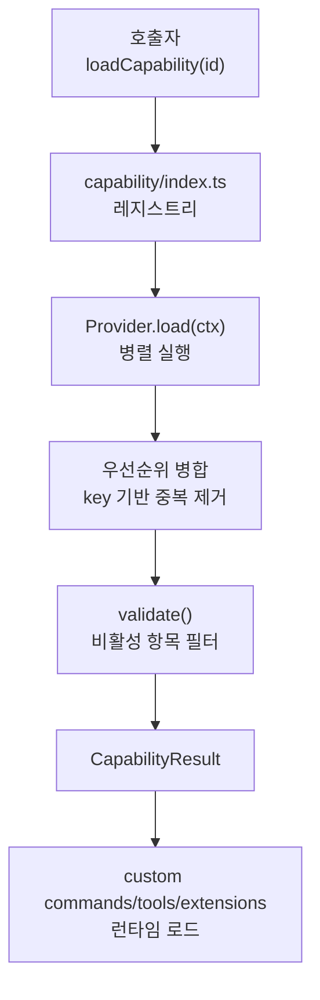

# Capabilities and Extensibility

## 모듈 개요

`Capabilities and Extensibility` 모듈은 GJC가 사용자/프로젝트/네이티브 설정에서 확장 요소를 발견하고, 우선순위와 비활성화 상태를 반영해 하나의 실행 표면으로 병합하는 계층입니다.

핵심은 두 축입니다.

- `packages/coding-agent/src/capability/*`: “무엇을 찾을 것인가”를 `Capability<T>`로 정의하고, 여러 `Provider<T>`가 가져온 결과를 병합합니다.
- `packages/coding-agent/src/extensibility/*`: 발견된 명령, 도구, 확장 모듈을 실제 런타임 객체로 로드하고 세션 이벤트, UI, 도구 호출, 메시지 흐름에 연결합니다.

이 모듈은 `.gjc`, 플러그인, 명시 설정, 사용자 홈 설정처럼 서로 다른 출처를 직접 호출자에게 노출하지 않습니다. 호출자는 `loadCapability("mcps")`, `loadCapability(toolCapability.id)`처럼 기능 단위로 요청하고, 로더는 우선순위, 중복 제거, 검증, 비활성화 설정을 적용한 결과를 반환합니다.



## Capability 레지스트리

Capability 레지스트리는 `packages/coding-agent/src/capability/index.ts`에 있습니다. 이 파일은 기능 정의, provider 등록, 로딩, provider 활성화 상태, 진단용 조회 API를 모두 관리합니다.

주요 전역 상태는 다음과 같습니다.

- `capabilities`: capability ID에서 `Capability<unknown>`으로 가는 중앙 맵입니다.
- `providerCapabilities`: provider ID가 어떤 capability에 등록되었는지 추적합니다.
- `providerMeta`: UI 표시용 provider 이름과 설명을 보관합니다.
- `disabledProviders`: 전역으로 비활성화된 provider ID 집합입니다.
- `settings`: `initializeWithSettings()`로 주입되는 설정 저장소입니다.

`defineCapability<T>()`는 새로운 capability를 등록합니다. 이미 같은 `id`가 있으면 예외를 던집니다. 각 capability 파일은 이 함수를 호출해 모듈 로드 시점에 capability 정의를 등록합니다.

```ts
export const toolCapability = defineCapability<CustomTool>({
	id: "tools",
	displayName: "Custom Tools",
	description: "User-defined tools that extend agent capabilities",
	key: tool => tool.name,
	toExtensionId: tool => `tool:${tool.name}`,
	validate: tool => {
		if (!tool.name) return "Missing name";
		if (!tool.path) return "Missing path";
		return undefined;
	},
});
```

`registerProvider<T>(capabilityId, provider)`는 특정 capability에 provider를 연결합니다. provider는 `priority`가 높은 순서로 삽입됩니다. 이 순서가 이후 중복 제거에서 “먼저 발견된 항목이 이긴다”는 규칙을 결정합니다.

## 로딩 흐름

`loadCapability<T>(capabilityId, options)`가 외부에서 사용하는 주 진입점입니다.

1. `capabilities`에서 capability 정의를 찾습니다.
2. `cwd`를 `options.cwd` 또는 `getProjectDir()`로 결정합니다.
3. `home`은 `os.homedir()`로, `repoRoot`는 `findRepoRoot(cwd)`로 구합니다.
4. `filterProviders()`로 비활성 provider, `options.providers`, `options.excludeProviders`를 반영합니다.
5. `loadImpl()`이 provider를 병렬 실행하고 결과를 병합합니다.

`loadImpl()`의 중요한 규칙은 다음과 같습니다.

- 모든 provider의 `load(ctx)`는 `Promise.all()`로 병렬 실행됩니다.
- provider 로드 실패는 전체 실패가 아니라 warning으로 수집됩니다.
- 각 item에는 `_source: SourceMeta`가 반드시 있어야 합니다. 없으면 건너뜁니다.
- `capability.toExtensionId()`가 있고 해당 ID가 비활성화 목록에 있으면 제외합니다.
- `capability.key(item)` 값으로 중복 제거합니다. `undefined`를 반환하면 중복 제거하지 않습니다.
- 중복 항목은 `items`에는 들어가지 않지만 `all`에는 남고 `_shadowed = true`가 붙습니다.
- `capability.validate()`가 실패하면 기본적으로 `items`에서 제거하고 warning을 남깁니다.
- `options.includeInvalid`가 있으면 검증 실패 항목도 유지합니다.
- `options.includeDisabled`가 있으면 비활성 확장 ID 필터를 적용하지 않습니다.

결과 타입은 `CapabilityResult<T>`입니다.

- `items`: 우선순위와 검증이 반영된 최종 항목입니다.
- `all`: shadowed 항목까지 포함한 전체 항목입니다.
- `warnings`: provider 실패, 파싱 문제, 검증 실패 메시지입니다.
- `providers`: 실제로 하나 이상의 항목을 기여한 provider ID 목록입니다.

## Capability 타입 계약

`packages/coding-agent/src/capability/types.ts`가 capability 시스템의 공통 타입을 정의합니다.

`Capability<T>`는 기능 단위의 규칙입니다.

- `id`: `"mcps"`, `"skills"`, `"context-files"` 같은 capability ID입니다.
- `displayName`, `description`: 설정 UI와 상태 표시용 메타데이터입니다.
- `key(item)`: 중복 제거 키를 반환합니다.
- `validate(item)`: 유효하지 않은 항목이면 에러 문자열을 반환합니다.
- `toExtensionId(item)`: 설정에서 개별 항목을 비활성화할 때 사용하는 ID를 반환합니다.
- `providers`: 등록된 provider 목록이며 우선순위 내림차순으로 정렬됩니다.

`Provider<T>`는 실제 검색/파싱 주체입니다.

- `id`: provider 고유 ID입니다.
- `priority`: 높을수록 먼저 적용되고 충돌 시 우선합니다.
- `load(ctx)`: `LoadContext`를 받아 `LoadResult<T>`를 반환합니다.

`SourceMeta`는 모든 로드 항목에 붙는 출처 정보입니다.

- `provider`: provider ID입니다.
- `providerName`: 표시 이름입니다.
- `path`: 항목이 나온 파일 경로입니다.
- `level`: `"user"`, `"project"`, `"native"` 중 하나입니다.

이 `_source` 필드는 provider가 제공해야 하며, `loadImpl()`은 `providerName`을 현재 provider의 표시 이름으로 보강합니다.

## 파일 시스템 캐시

`packages/coding-agent/src/capability/fs.ts`는 capability provider들이 반복적으로 파일과 디렉터리를 읽을 때 쓰는 얇은 캐시 계층입니다.

주요 함수는 다음과 같습니다.

- `readFile(filePath)`: 파일 내용을 읽고 `contentCache`에 저장합니다. 실패하면 `null`을 캐시합니다.
- `readDirEntries(dirPath)`: `fs.promises.readdir(..., { withFileTypes: true })` 결과를 `dirCache`에 저장합니다.
- `readDir(dirPath)`: 디렉터리 항목 이름만 반환합니다.
- `walkUp(startDir, name, opts)`: 시작 디렉터리부터 루트까지 올라가며 특정 파일/디렉터리를 찾습니다.
- `findRepoRoot(startDir)`: `.git` 항목이 있는 디렉터리를 찾아 git repo root로 반환합니다.
- `cacheStats()`: 파일 내용 캐시와 디렉터리 캐시 크기를 반환합니다.
- `clearCache()`: 모든 캐시를 지웁니다.
- `invalidate(filePath)`: 해당 경로의 파일 캐시, 디렉터리 캐시, 부모 디렉터리 캐시를 무효화합니다.

`capability/index.ts`의 `reset()`, `invalidate()`, `cacheStats()`는 이 파일 시스템 캐시 API를 다시 노출합니다. `chdir` 또는 설정 파일 변경 이후에는 `reset()`이나 `invalidate(filePath, cwd)`를 호출해야 stale discovery를 피할 수 있습니다.

## 기본 Capability 정의

각 capability 파일은 특정 확장 요소의 정규화된 shape를 정의하고 `defineCapability()`로 등록합니다.

### ContextFile

`context-file.ts`의 `ContextFile`은 `AGENTS.md`, `GEMINI.md` 같은 지속 instruction 파일을 나타냅니다.

중복 키는 다음 규칙을 씁니다.

- user level: `"user"`
- project level: `project:${depth}`

`depth`는 현재 작업 디렉터리에서 얼마나 떨어진 ancestor에서 온 파일인지 나타냅니다. `Math.max(0, file.depth ?? 0)`로 보정하기 때문에 `.github/`처럼 ancestor 내부 하위 설정 디렉터리에서 발견된 파일도 같은 project scope로 취급할 수 있습니다.

### MCPServer

`mcp.ts`의 `MCPServer`는 stdio, HTTP, SSE MCP 서버 설정을 하나의 canonical shape로 정규화합니다.

검증 규칙은 다음과 같습니다.

- `name`은 필수입니다.
- `command` 또는 `url` 중 하나는 있어야 합니다.
- `transport === "stdio"`이면 `command`가 필요합니다.
- `transport === "http"` 또는 `"sse"`이면 `url`이 필요합니다.

중복 키와 비활성화 ID는 모두 서버 이름 기반입니다.

- `key: server => server.name`
- `toExtensionId: server => "mcp:<name>"`

### Rule

`rule.ts`의 `Rule`은 Cursor MDC, Windsurf, Cline 형식의 프로젝트 규칙을 canonical shape로 변환한 항목입니다.

중요한 보조 함수는 `parseRuleConditionAndScope(frontmatter)`입니다. 이 함수는 TTSR 관련 frontmatter를 파싱합니다.

- `condition`, `ttsr_trigger`, `ttsrTrigger`를 condition 후보로 읽습니다.
- `scope`는 쉼표 분리를 지원하되 괄호, 대괄호, 중괄호, 따옴표 내부 쉼표는 보존합니다.
- `*.rs`처럼 파일 glob으로 보이는 condition은 condition이 아니라 scope shorthand로 해석합니다.
- glob shorthand는 `tool:edit(<glob>)`, `tool:write(<glob>)`로 확장됩니다.
- glob만 있고 명시 condition이 없으면 condition은 `".*"`로 설정됩니다.

`getActiveRules()`, `setActiveRules()`, `resetActiveRulesForTests()`는 현재 세션이 로드한 규칙 snapshot을 process-global로 보관합니다. 내부 `rule://` URL protocol handler는 이 snapshot을 읽습니다.

### Skill

`skill.ts`의 `Skill`은 `SKILL.md` 같은 전문 지식/워크플로 파일을 나타냅니다.

`SkillFrontmatter.hide`가 `true`이면 skill은 `skill://<name>`이나 `/skill:<name>`으로 접근 가능하지만, 시스템 프롬프트의 skill 목록에는 렌더링되지 않습니다. 즉, 명시 호출은 가능하지만 모델 자동 발견 대상에서는 제외됩니다.

### SlashCommand와 Prompt

`slash-command.ts`의 `SlashCommand`는 markdown 기반 slash command입니다. `level`은 `"user"`, `"project"`, `"native"`만 허용합니다.

`prompt.ts`의 `Prompt`는 `/prompts:` 메뉴에서 사용할 수 있는 재사용 prompt template입니다. 두 capability 모두 이름 기반으로 중복 제거하고, 내용이 `undefined`이면 검증 실패로 처리합니다.

### Tool

`tool.ts`의 `CustomTool` capability는 사용자 정의 도구 파일의 메타데이터를 나타냅니다. 실제 실행 가능한 TypeScript 도구 로딩은 `extensibility/custom-tools/loader.ts`가 담당합니다.

`toolCapability`는 이름 기반으로 중복 제거하고 `tool:<name>`을 비활성화 ID로 사용합니다.

### Extension과 ExtensionModule

`extension.ts`의 `Extension`은 Gemini-style extension manifest를 나타냅니다. manifest에는 `mcpServers`, `tools`, `context`가 포함될 수 있습니다.

`extension-module.ts`의 `ExtensionModule`은 TypeScript/JavaScript extension entrypoint를 나타냅니다. 실행 가능한 extension module discovery와 로딩은 `extensibility/extensions/loader.ts`에서 이어집니다.

### Settings, Hook, SSHHost, SystemPrompt

- `settings.ts`: 설정 파일은 병합 대상이므로 `key()`가 항상 `undefined`를 반환합니다.
- `hook.ts`: hook은 `type:tool:name` 조합으로 중복 제거합니다.
- `ssh.ts`: SSH host는 `name` 기반으로 중복 제거합니다.
- `system-prompt.ts`: system prompt는 `level` 기반으로 중복 제거합니다.

## Provider와 비활성화 모델

provider 자체는 전역으로 켜고 끌 수 있습니다.

- `initializeWithSettings(activeSettings)`: 설정에서 `disabledProviders`를 읽어 초기화합니다.
- `disableProvider(providerId)`: provider를 비활성화하고 설정에 저장합니다.
- `enableProvider(providerId)`: 비활성화 목록에서 제거하고 저장합니다.
- `isProviderEnabled(providerId)`: 현재 활성 상태를 반환합니다.
- `getDisabledProviders()`: 비활성 provider ID 목록을 반환합니다.
- `setDisabledProviders(providerIds)`: 전체 비활성 목록을 교체합니다.

개별 항목 비활성화는 provider 단위와 별개입니다. `loadImpl()`은 `capability.toExtensionId(item)`이 반환한 ID를 `options.disabledExtensions` 또는 설정의 `disabledExtensions`와 비교합니다. 예를 들어 MCP 서버는 `mcp:<name>`, skill은 `skill:<name>`, custom tool은 `tool:<name>`으로 숨길 수 있습니다.

## Introspection API

설정 UI나 확장 목록 화면은 레지스트리 상태를 직접 조회할 수 있습니다.

- `getCapability(id)`: capability 정의를 반환합니다.
- `listCapabilities()`: 등록된 capability ID 목록을 반환합니다.
- `getCapabilityInfo(capabilityId)`: capability와 provider 목록, provider 활성 상태를 반환합니다.
- `getAllCapabilitiesInfo()`: 모든 capability info를 반환합니다.
- `getProviderInfo(providerId)`: provider가 등록된 capability 목록과 우선순위, 활성 상태를 반환합니다.
- `getAllProvidersInfo()`: 모든 provider info를 priority 내림차순으로 반환합니다.

이 API들은 실행 로딩 결과가 아니라 “무엇이 등록되어 있고 어떤 provider가 연결되어 있는지”를 보여주는 introspection 계층입니다.

## Custom Commands

`packages/coding-agent/src/extensibility/custom-commands/loader.ts`는 TypeScript/JavaScript slash command module을 로드합니다. Markdown slash command는 별도 경로인 `extensibility/slash-commands.ts`에서 처리됩니다.

### 발견 규칙

`discoverCustomCommands(options)`는 다음 위치에서 command module을 찾습니다.

1. `agentDir/commands`
2. `getConfigDirs("commands", { cwd, existingOnly: true })`가 반환하는 사용자/프로젝트 설정 디렉터리

각 command는 `commands/<name>/index.ts`, `index.js`, `index.mjs`, `index.cjs` 형태의 하위 디렉터리 entrypoint로 발견됩니다. 같은 절대 경로는 `seen`으로 중복 제거됩니다.

### 로딩 규칙

`loadCustomCommands(options)`는 먼저 `discoverCustomCommands()`로 path를 찾고, shared API를 만든 뒤 명령을 로드합니다.

shared API는 `CustomCommandAPI`입니다.

- `cwd`
- `exec(command, args, options)`
- `typebox`
- `zod`
- `pi`

`loadBundledCommands(sharedApi)`는 `GreenCommand`, `ReviewCommand`를 bundled command로 먼저 추가합니다. 이후 사용자/프로젝트 command가 같은 이름을 쓰면 bundled command는 override됩니다. 반면 사용자/프로젝트 command끼리 이름이 충돌하면 error로 기록되고 기존 command를 유지합니다.

`loadCommandModule(commandPath, cwd, sharedApi)`는 Bun native dynamic import로 모듈을 로드합니다. default export 또는 모듈 자체가 `CustomCommandFactory`여야 합니다. factory는 단일 `CustomCommand` 또는 배열을 반환할 수 있습니다.

각 command는 다음 필드를 가져야 합니다.

- `name: string`
- `description: string`
- `execute(args, ctx)`

`execute()`가 문자열을 반환하면 그 문자열이 LLM prompt로 전달됩니다. `undefined`를 반환하면 fire-and-forget command로 동작합니다.

## Custom Tools

`packages/coding-agent/src/extensibility/custom-tools/loader.ts`는 실행 가능한 사용자 정의 tool module을 발견하고 로드합니다. tool metadata discovery는 capability 시스템을 통해 수행됩니다.

### 발견 순서

`discoverAndLoadCustomTools(configuredPaths, cwd, builtInToolNames, pushPendingAction)`는 세 종류의 경로를 합칩니다.

1. `loadCapability<CustomTool>(toolCapability.id, { cwd })`로 발견한 사용자/프로젝트 tool
2. `getAllPluginToolPaths(cwd)`가 반환하는 설치된 plugin tool
3. 설정 또는 CLI에서 명시된 `configuredPaths`

`addPath()`는 절대 경로 기준으로 중복을 제거합니다. source metadata는 provider, providerName, level을 포함합니다.

### 로딩과 충돌 처리

`loadCustomTools()`는 `CustomToolLoader`를 만들고 `loader.load(pathsWithSources)`를 호출합니다.

`CustomToolLoader`는 생성 시 built-in tool 이름을 `#seenNames`에 넣습니다. 로드된 custom tool 이름이 이미 있으면 `ToolLoadError`로 기록하고 건너뜁니다. 따라서 custom tool은 built-in tool과 이름이 충돌할 수 없습니다.

`loadTool()`은 `.md`, `.json` 파일을 실행 가능한 module로 로드하지 않습니다. 이런 declarative tool file은 metadata로만 취급되며, 실행 module로 들어오면 error가 됩니다.

실행 가능한 module은 default export 또는 모듈 자체가 `CustomToolFactory`여야 합니다. factory는 `CustomTool` 또는 배열을 반환할 수 있습니다.

### CustomToolAPI

tool factory에 전달되는 `CustomToolAPI`는 세션 시작 전에도 안정적으로 유지되는 shared object입니다.

- `cwd`
- `exec(command, args, options)`
- `ui`
- `hasUI`
- `logger`
- `typebox`
- `zod`
- `pi`
- `pushPendingAction(action)`

초기 UI는 `createNoOpUIContext()`입니다. TUI 또는 다른 mode가 준비되면 반환 객체의 `setUIContext(uiContext, hasUI)`가 호출되어 같은 shared API 객체의 UI context를 교체합니다.

`pushPendingAction()`은 deferrable tool이 변경 사항을 즉시 적용하지 않고 preview action으로 보류할 때 사용합니다. 런타임이 pending action store를 제공하지 않으면 예외를 던집니다.

### CustomToolAdapter

`custom-tools/wrapper.ts`의 `CustomToolAdapter`는 `CustomTool`을 agent runtime의 `AgentTool` 인터페이스로 감쌉니다.

생성자에서 `applyToolProxy(tool, this)`를 호출해 `name`, `label`, `description`, `parameters`, renderer 같은 필드를 adapter에 proxy합니다. `execute()`는 호출 시점의 context를 다음 우선순위로 전달합니다.

1. 호출자가 넘긴 `context`
2. 생성자에 주입된 `getContext()`

`CustomToolAdapter.wrap(tool, getContext)`는 기존 호출자를 위한 backward-compatible factory입니다. 새 코드는 생성자를 직접 사용할 수 있습니다.

## Extension Modules

`packages/coding-agent/src/extensibility/extensions/loader.ts`는 TypeScript/JavaScript extension module을 로드합니다. extension은 lifecycle event handler, tool, command, shortcut, flag, message renderer, provider registration을 등록할 수 있습니다.

### ExtensionRuntime

`ExtensionRuntime`은 extension loading 중에는 action method를 사용할 수 없도록 throwing stub을 제공합니다. 예를 들어 `sendMessage()`, `getActiveTools()`, `setModel()` 같은 메서드는 초기화 전 호출되면 `ExtensionRuntimeNotInitializedError`를 던집니다.

이 설계는 extension factory가 “등록”만 하고, 실제 세션 조작은 runner 초기화 후 event handler나 command handler에서 수행하도록 강제합니다.

### ConcreteExtensionAPI

`ConcreteExtensionAPI`는 extension factory에 전달되는 실제 API 구현입니다. 등록 계열 메서드는 현재 extension 객체에 데이터를 쌓고, action 계열 메서드는 shared runtime으로 위임합니다.

등록 메서드 예시는 다음과 같습니다.

- `on(event, handler)`
- `registerTool(tool)`
- `registerCommand(name, options)`
- `registerShortcut(shortcut, options)`
- `registerFlag(name, options)`
- `registerMessageRenderer(customType, renderer)`
- `registerProvider(name, config)`

action 메서드 예시는 다음과 같습니다.

- `sendMessage(message, options)`
- `sendUserMessage(content, options)`
- `appendEntry(customType, data)`
- `getActiveTools()`
- `setActiveTools(toolNames)`
- `setModel(model)`
- `setThinkingLevel(level, persist)`
- `setSessionName(name)`

`exec(command, args, options)`는 `execCommand()`를 호출하며, 별도 cwd가 없으면 extension loader의 `cwd`를 사용합니다.

### 발견 규칙

`discoverAndLoadExtensions(configuredPaths, cwd, eventBus, disabledExtensionIds)`는 다음 순서로 extension entrypoint를 수집합니다.

1. `loadCapability<ExtensionModule>(extensionModuleCapability.id, { cwd })`로 발견한 native extension module
2. `getAllPluginExtensionPaths(cwd)`가 반환하는 plugin extension
3. 명시 설정 경로

비활성화 ID는 `extension-module:<name>` 형태입니다. 이름은 `getExtensionNameFromPath(extPath)`로 계산합니다.

디렉터리 경로는 `resolveExtensionEntries(dir)`로 해석합니다.

- `package.json`의 `gjc.extensions` 또는 legacy `pi.extensions`
- `index.ts`
- `index.js`

해당 디렉터리 자체에 entry가 없으면 `discoverExtensionsInDir(dir)`가 한 단계 아래까지만 탐색합니다. 직접 파일은 `.ts`, `.js`만 extension file로 봅니다. 복잡한 패키지는 `package.json` manifest를 사용해야 합니다.

### 로딩 규칙

`loadExtension(extPath, cwd, eventBus, runtime)`은 다음 순서로 동작합니다.

1. `resolvePath(extPath, cwd)`로 entrypoint를 절대 경로화합니다.
2. `loadLegacyPiModule(resolvedPath)`로 legacy `pi` specifier 호환을 포함해 모듈을 로드합니다.
3. `getExtensionFactory(module)`로 default export 또는 모듈 자체가 factory인지 확인합니다.
4. `createExtension()`으로 빈 `Extension` 객체를 만듭니다.
5. `ConcreteExtensionAPI`를 factory에 전달해 등록을 수행합니다.

`loadExtensions(paths, cwd, eventBus)`는 여러 extension을 순차 로드하고, `extensions`, `errors`, `runtime`을 반환합니다.

## ExtensionRunner

`packages/coding-agent/src/extensibility/extensions/runner.ts`의 `ExtensionRunner`는 로드된 extension을 실제 세션 runtime에 연결합니다.

`initialize(actions, contextActions, commandContextActions, uiContext)`가 호출되기 전에는 runner가 no-op UI context와 기본 stub context를 갖습니다. 초기화 시점에는 다음을 연결합니다.

- runtime action: `sendMessage`, `sendUserMessage`, `appendEntry`, `setActiveTools`, `setModel`, `setSessionName` 등
- context action: `getModel`, `isIdle`, `abort`, `hasPendingMessages`, `shutdown`, `getSystemPrompt`
- command context action: `waitForIdle`, `newSession`, `branch`, `navigateTree`, `switchSession`, `reload`, `compact`
- UI context

### Context 생성

`createContext()`는 extension event handler에 전달되는 `ExtensionContext`를 만듭니다.

포함되는 주요 값은 다음과 같습니다.

- `ui`
- `hasUI`
- `cwd`
- `sessionManager`
- `modelRegistry`
- `model`
- `isIdle()`
- `abort()`
- `hasPendingMessages()`
- `shutdown()`
- `getSystemPrompt()`

`createCommandContext()`는 여기에 `waitForIdle()`, `newSession()`, `branch()`, `navigateTree()`, `switchSession()`, `reload()`, `compact()` 같은 interactive command 전용 기능을 추가합니다.

### Event emit 흐름

일반 event는 `emit(event)`가 처리합니다. 각 extension의 handler를 순서대로 실행하고, `#runHandlerWithTimeout()`으로 timeout과 예외를 격리합니다.

- 기본 timeout은 `EXTENSION_HANDLER_TIMEOUT_MS = 30_000`입니다.
- timeout 또는 예외는 `emitError()`를 통해 listener에 전달됩니다.
- session-before event에서 handler가 `cancel`을 반환하면 즉시 중단 결과를 반환합니다.

특정 event는 더 강한 타입과 특수 병합 규칙 때문에 전용 메서드를 사용합니다.

- `emitToolResult(event)`: handler가 반환한 `content`, `details`, `isError`를 누적 수정합니다.
- `emitToolCall(event)`: handler가 `block`을 반환하면 즉시 차단합니다. handler 예외도 tool call 차단 결과로 매핑됩니다.
- `emitUserBash(event)`, `emitUserPython(event)`: `emitUserEvent()`로 위임합니다.
- `emitResourcesDiscover(cwd, reason)`: extension이 제공한 skill, prompt, theme path를 수집합니다.
- `emitInput(text, images, source)`: 입력 text/images를 순차 변환하고 `handled`가 있으면 short-circuit합니다.
- `emitContext(messages)`: context handler가 있을 때만 메시지를 clone하고 순차 변환합니다.
- `emitBeforeProviderRequest(payload)`: provider request payload를 순차 변환합니다.
- `emitAfterProviderResponse(response, model)`: provider response metadata를 알립니다.
- `emitBeforeAgentStart(prompt, images, systemPrompt)`: 추가 message와 systemPrompt 변경을 병합합니다.

### credential_disabled buffering

`emitCredentialDisabled(event)`는 runner 초기화 전에도 호출될 수 있습니다. 이 경우 이벤트를 `#pendingCredentialDisabled`에 보관하고, `initialize()` 이후 microtask에서 `emit({ type: "credential_disabled", ...event })`로 재생합니다.

버퍼는 `MAX_PENDING_CREDENTIAL_DISABLED = 32`로 제한되며, 초과하면 가장 오래된 이벤트를 버립니다. 이 설계는 startup model probe 중 OAuth credential 문제가 발생해도 extension handler가 no-op runtime context가 아니라 초기화된 UI/runtime context에서 이벤트를 받도록 합니다.

### Command, shortcut, renderer 조회

`ExtensionRunner`는 로드된 extension의 등록 결과를 조회하는 API도 제공합니다.

- `getAllRegisteredTools()`: 모든 extension tool을 반환합니다.
- `getFlags()`, `getFlagValues()`, `setFlagValue()`: extension flag 정의와 값을 관리합니다.
- `getShortcuts()`: shortcut을 수집하되 reserved shortcut은 경고 후 제외합니다.
- `getMessageRenderer(customType)`: custom message renderer를 찾습니다.
- `getRegisteredCommands(reserved)`: built-in command와 충돌하는 extension command를 제외하고 diagnostic을 기록합니다.
- `getCommand(name)`: 뒤에 로드된 extension부터 역순으로 command를 찾아 override 동작을 제공합니다.

reserved shortcut에는 `ctrl+c`, `ctrl+d`, `ctrl+z`, `enter`, `escape` 등 핵심 TUI 키가 포함됩니다.

## Capability와 Extensibility의 연결 지점

이 모듈의 중요한 흐름은 discovery와 runtime loading이 분리되어 있다는 점입니다.

`toolCapability`는 tool 파일의 존재와 메타데이터만 발견합니다. 실제 module import, factory 실행, 이름 충돌 검사, UI context 주입은 `discoverAndLoadCustomTools()`와 `CustomToolLoader`가 담당합니다.

`extensionModuleCapability`도 extension entrypoint metadata만 제공합니다. 실제 extension factory 실행과 lifecycle event 연결은 `discoverAndLoadExtensions()`, `loadExtensions()`, `ExtensionRunner`가 담당합니다.

`slashCommandCapability`는 markdown slash command의 discovery 표면이고, TypeScript custom command는 `discoverCustomCommands()`가 별도로 디렉터리 구조를 탐색합니다.

이 분리는 호출자가 “어디서 왔는지”보다 “무엇이 필요한지”를 기준으로 코드를 작성하게 해 줍니다. 예를 들어 custom tool 로더는 `.gjc` provider, plugin, CLI 명시 경로를 모두 합친 뒤 동일한 `CustomToolFactory` 계약으로 처리합니다.

## 실행 흐름에서의 위치

제공된 call graph 기준으로 이 모듈은 여러 상위 기능에서 호출됩니다.

- `#executeSync → discoverAgents → listClaudePluginRoots → readFile → resolvePath` 흐름에서 capability 파일 시스템 캐시가 agent discovery의 하위 기반으로 쓰입니다.
- `#executeSync → discoverAgents → isProviderEnabled` 흐름에서 provider 활성화 상태가 discovery 결과에 영향을 줍니다.
- ACP mode와 input controller는 skill/slash command resolution을 통해 `buildSkillPromptMessage()`, `parseSkillInvocations()`, `loadSlashCommands()` 같은 extensibility API를 호출합니다.
- plugin extension 테스트와 multi-file extension 테스트는 `discoverAndLoadExtensions()`를 직접 검증합니다.
- TTSR 테스트는 `parseRuleConditionAndScope()`의 condition/scope 파싱 경계를 검증합니다.
- extension runner 테스트는 `emitAfterProviderResponse()`, `getCommand()` 등 event dispatch와 command lookup을 검증합니다.

따라서 capability 계층의 변경은 단순 설정 discovery에 그치지 않고 agent startup, command menu, tool registration, extension event 처리, rule protocol까지 영향을 줄 수 있습니다.

## 기여 시 주의점

새 capability를 추가할 때는 다음을 명확히 정해야 합니다.

- 항목의 canonical interface
- 중복 제거 기준인 `key(item)`
- 개별 비활성화가 필요하다면 `toExtensionId(item)`
- 검증 실패 시 사용자에게 의미 있는 `validate(item)` 메시지
- provider가 반드시 채워야 하는 `_source`

새 provider를 추가할 때는 priority가 충돌 해석을 결정한다는 점을 고려해야 합니다. 높은 priority provider의 항목이 같은 key를 가진 낮은 priority 항목을 shadow합니다.

custom command나 custom tool을 추가할 때는 factory export 형태를 지켜야 합니다.

- command module: `CustomCommandFactory`
- tool module: `CustomToolFactory`
- extension module: `ExtensionFactory`

extension event handler는 runner가 timeout과 예외를 격리하지만, handler 내부에서 오래 걸리는 작업은 사용자 입력 흐름과 도구 호출 흐름을 지연시킬 수 있습니다. 특히 `tool_call` handler는 예외가 발생하면 해당 tool call을 차단하는 결과로 이어집니다.

파일 변경이나 설정 변경 이후 discovery 결과가 바뀌어야 한다면 `invalidate(filePath, cwd)` 또는 `reset()`을 호출해 `capability/fs.ts`의 캐시를 무효화해야 합니다.