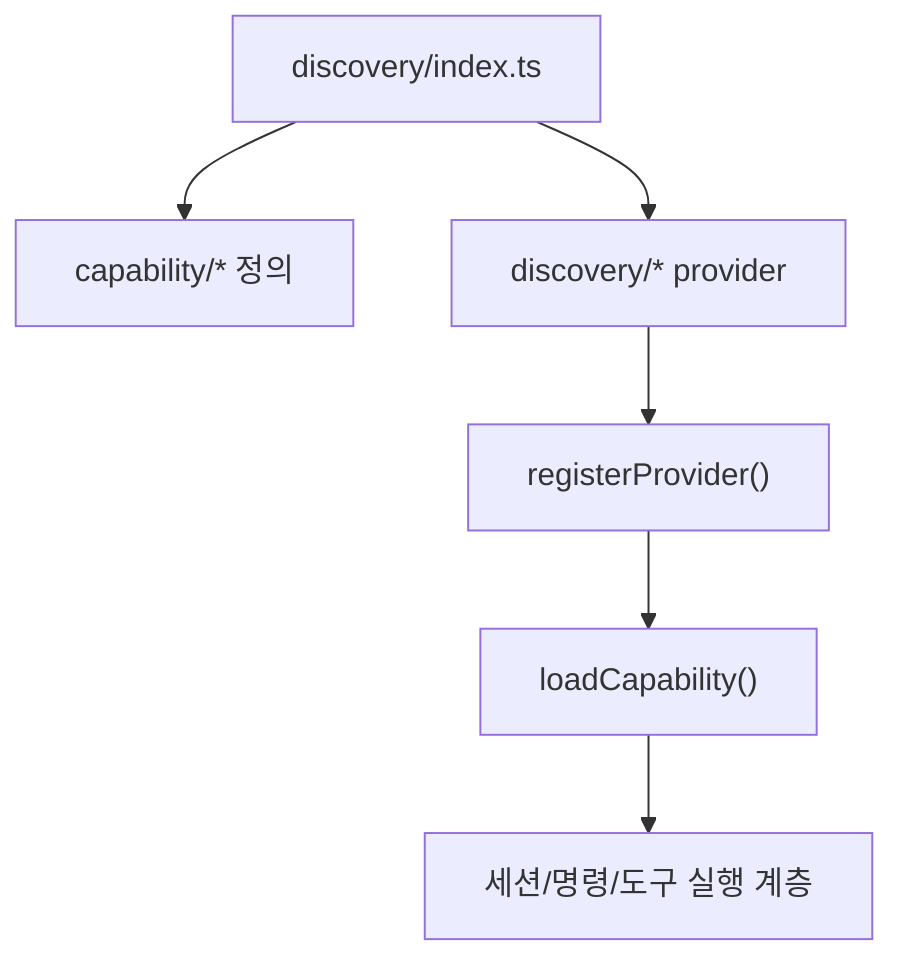
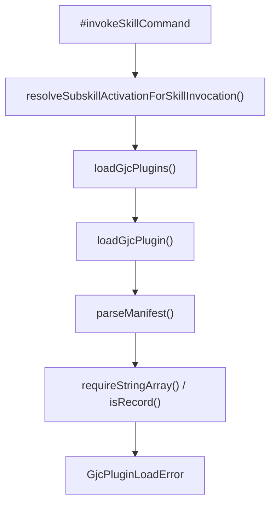

# Coding Agent — Capabilities, Discovery, Plugins, and Extensions

## 개요

이 모듈은 GJC가 세션 시작 시 사용할 수 있는 기능을 파일 시스템에서 발견해 `capability` 레지스트리에 등록하는 계층입니다. 대상은 컨텍스트 파일, 스킬, 슬래시 명령, MCP 서버, 훅, 설정, 시스템 프롬프트, 확장 모듈, 커스텀 도구, SSH 호스트입니다.

핵심 패턴은 단순합니다.

```ts
registerProvider(capability.id, {
	id: PROVIDER_ID,
	displayName: DISPLAY_NAME,
	priority,
	load,
});
```

각 provider 파일은 import되는 순간 `registerProvider()`를 호출합니다. `packages/coding-agent/src/discovery/index.ts`는 capability 정의를 먼저 import한 뒤 provider들을 import해 자동 등록을 완성하고, 외부에는 `loadCapability()`, `enableProvider()`, `disableProvider()`, `getAllProvidersInfo()` 같은 레지스트리 API를 다시 export합니다.



## 발견 모델

모든 provider는 `LoadContext`를 받아 `LoadResult<T>`를 반환합니다. 일반적인 `LoadContext` 사용 필드는 다음과 같습니다.

- `ctx.cwd`: 현재 작업 디렉터리
- `ctx.home`: 사용자 홈 디렉터리
- `ctx.repoRoot`: 탐색을 멈출 저장소 루트

반환값은 보통 다음 형태입니다.

```ts
{
	items: [...],
	warnings: [...]
}
```

각 항목에는 `_source: createSourceMeta(providerId, path, level)`가 붙습니다. 이 메타데이터는 나중에 어떤 provider와 파일에서 capability가 왔는지 추적하는 데 사용됩니다. `level`은 `"user"` 또는 `"project"`입니다.

대부분의 provider는 다음 helper를 공유합니다.

- `readFile()`, `readDirEntries()`: 안전한 파일 읽기와 디렉터리 열거
- `loadFilesFromDir()`: 특정 확장자의 파일을 capability 항목으로 변환
- `scanSkillsFromDir()`: `SKILL.md` 기반 스킬 디렉터리 스캔
- `createSourceMeta()`: capability 출처 메타데이터 생성
- `calculateDepth()`: 현재 디렉터리에서 컨텍스트 파일이 얼마나 위에 있는지 계산
- `expandEnvVarsDeep()`: MCP/SSH 설정 안의 환경변수 치환
- `buildRuleFromMarkdown()`: Markdown/frontmatter 기반 rule 생성

## Provider 등록과 우선순위

Provider 우선순위는 같은 capability를 여러 출처에서 읽을 때 정렬과 병합 정책의 기준이 됩니다. 코드상 주요 우선순위는 다음과 같습니다.

| Provider | 파일 | 우선순위 | 역할 |
| --- | --- | ---: | --- |
| `native` | `builtin.ts` | 100 | GJC 네이티브 `.gjc` / `~/.gjc/agent` 설정 |
| `claude` | `claude.ts` | 80 | 프로젝트 로컬 `.claude` 호환 설정 |
| `claude-plugins` | `claude-plugins.ts` | 70 | GJC marketplace plugin root에서 기능 로드 |
| `codex` | `codex.ts` | 70 | 프로젝트 로컬 `.codex` 호환 설정 |
| `gemini` | `gemini.ts` | 60 | `.gemini`, `~/.gemini` 설정 |
| `opencode` | `opencode.ts` | 55 | OpenCode 설정 |
| `cursor` | `cursor.ts` | 50 | Cursor 설정 |
| `cline` | `cline.ts` | 40 | `.clinerules` 규칙 |
| `github` | `github.ts` | 30 | GitHub Copilot instructions |
| `vscode` | `vscode.ts` | 20 | VS Code MCP 설정 |
| `mcp-json` | `mcp-json.ts` | 5 | 루트 `mcp.json` / `.mcp.json` fallback |
| `ssh-json` | `ssh.ts` | 5 | GJC/legacy SSH JSON 설정 |

`discovery/index.ts`는 이 provider들을 side-effect import합니다. 새 provider를 추가할 때는 capability 정의 import가 먼저 실행되는 구조를 유지해야 합니다.

## 네이티브 GJC provider

`builtin.ts`의 `native` provider는 GJC 고유 설정을 담당합니다. 기본 경로는 `SOURCE_PATHS.native`에서 오며, 현재 코드에서는 다음 helper로 접근합니다.

- `getUserAgentDirs()`: 사용자 설정 디렉터리 목록
- `getProjectConfigDirs()`: 프로젝트 설정 디렉터리 목록
- `getConfigDirs(ctx)`: 실제로 비어 있지 않은 user/project 설정 디렉터리 수집
- `findNearestProjectConfigDir(cwd, repoRoot)`: `cwd`에서 위로 올라가며 가장 가까운 프로젝트 `.gjc` 설정 디렉터리 탐색

`ifNonEmptyDir()`는 디렉터리가 존재하고 비어 있지 않을 때만 경로를 반환합니다. 이 때문에 빈 `.gjc` 디렉터리는 설정 출처로 취급되지 않습니다.

### MCP 서버

`loadMCPServers()`는 `.gjc/mcp.json`, `.gjc/.mcp.json`, 사용자 설정의 `mcp.json`, `.mcp.json`을 읽습니다. JSON은 `{ "mcpServers": { ... } }` 형태를 기대합니다.

`parseMcpServers()`는 다음 값을 정규화합니다.

- `enabled`: boolean 또는 `"true"`, `"false"`, `"1"`, `"0"`
- `timeout`: 양수 number 또는 숫자 문자열
- `command`, `args`, `env`, `cwd`, `url`, `headers`
- `auth`, `oauth`
- `type` → `transport`

잘못된 `enabled`나 `timeout`은 throw하지 않고 `logger.warn()` 후 무시합니다. 이는 사용자 설정 오류가 전체 discovery를 중단하지 않도록 하기 위한 설계입니다.

### 시스템 프롬프트와 컨텍스트 파일

`loadSystemPrompt()`는 사용자 `SYSTEM.md`와 가장 가까운 프로젝트 `.gjc/SYSTEM.md`를 읽습니다.

`loadContextFiles()`는 사용자 `AGENTS.md`를 먼저 추가하고, 가장 가까운 프로젝트 `.gjc/AGENTS.md`가 있으면 `depth`를 붙여 추가한 뒤 즉시 반환합니다. 이 동작은 조상 디렉터리의 여러 `.gjc/AGENTS.md`를 모두 쌓는 것이 아니라 “가장 가까운 프로젝트 설정”을 선택하는 방식입니다.

반면 `agents-md.ts`의 `loadAgentsMd()`는 standalone `AGENTS.md`를 `ctx.cwd`에서 위로 걸어 올라가며 찾습니다. 단, `AGENTS.md`의 부모 디렉터리 이름이 `.`으로 시작하면 제외합니다. `.codex/AGENTS.md`, `.gemini/GEMINI.md` 같은 도구별 설정 디렉터리 파일은 각 provider가 담당합니다.

### 스킬, 명령, 프롬프트, 규칙

`loadSkills()`는 프로젝트 조상 디렉터리의 `.gjc/skills`를 가까운 순서로 스캔하고, 사용자 `~/.gjc/agent/skills`도 함께 스캔합니다. `requireDescription: true`가 설정되어 있어 GJC 네이티브 스킬은 설명 메타데이터가 필요합니다.

`loadSlashCommands()`, `loadPrompts()`, `loadInstructions()`는 각각 `commands`, `prompts`, `instructions` 디렉터리의 Markdown 파일을 읽습니다.

`loadRules()`는 두 종류의 rule을 합칩니다.

- `.gjc/rules/*.md` 또는 `*.mdc`
- top-level `RULES.md`

`loadStickyRulesFile()`은 `RULES.md`를 `buildRuleFromMarkdown()`으로 변환한 뒤 `alwaysApply: true`를 강제로 설정합니다. 주석에도 적혀 있듯이 `RULES.md`는 긴 대화에서도 매 turn 근처에 다시 주입되어야 하는 “sticky rule”입니다.

### 확장과 확장 모듈

`loadExtensionModules()`는 두 경로에서 확장 모듈을 찾습니다.

1. 설정 디렉터리의 `extensions/` 하위에서 자동 발견
2. `settings.json`의 `extensions` 배열에 명시된 경로

`resolveExtensionPath()`는 `~`를 `ctx.home` 기준으로 확장하고, 상대 경로는 `ctx.cwd` 기준 절대 경로로 바꿉니다. 경로가 디렉터리면 `discoverExtensionModulePaths()`로 내부 모듈을 찾고, 파일이면 그 파일 자체를 `ExtensionModule`로 등록합니다. 찾을 수 없는 경로는 warning으로 남깁니다.

`loadExtensions()`는 `.gjc/extensions/*/gemini-extension.json` manifest를 읽어 `Extension` 항목을 만듭니다. manifest JSON 파싱 실패는 warning으로 처리됩니다.

### 훅과 커스텀 도구

`loadHooks()`는 `.gjc/hooks/pre/`, `.gjc/hooks/post/`를 읽습니다. 파일명에서 확장자를 제거한 값이 `tool`이 되며, 파일명이 `*`이면 모든 도구에 적용되는 훅으로 해석됩니다.

`loadTools()`는 두 형태를 지원합니다.

- `.gjc/tools/*.json`, `.md`, `.ts`, `.js`, `.sh`, `.bash`, `.py`
- `.gjc/tools/<name>/index.ts`

JSON 도구는 `name`과 `description`을 읽고, Markdown 도구는 frontmatter의 `name`, `description`을 읽습니다. 실행 파일형 도구는 파일명에서 확장자를 제거해 이름을 만듭니다.

## 호환 provider

이 모듈은 GJC 네이티브 설정만 읽지 않습니다. 기존 에이전트 도구 설정을 project/user 범위에 맞게 읽어 GJC capability로 변환합니다.

### Claude Code 호환

`claude.ts`는 프로젝트 로컬 `.claude`만 지원합니다. 파일 상단 주석처럼 사용자 홈의 `~/.claude`는 의도적으로 무시합니다. 이는 다른 도구의 사용자 전역 설정이 GJC 세션에 자동 주입되는 것을 막기 위한 경계입니다.

주요 loader는 다음과 같습니다.

- `loadMCPServers()`: `.claude/.mcp.json`, `.claude/mcp.json`
- `loadContextFiles()`: `.claude/CLAUDE.md`
- `loadSkills()`: 현재 디렉터리에서 `repoRoot`까지 조상 `.claude/skills`
- `loadExtensionModules()`: `.claude/extensions`
- `loadSlashCommands()`: `.claude/commands/*.md`
- `loadHooks()`: `.claude/hooks/pre`, `.claude/hooks/post`
- `loadTools()`: `.claude/tools`
- `loadSystemPrompts()`: `.claude/SYSTEM.md`
- `loadSettings()`: `.claude/settings.json`

`loadMCPServers()`는 `.claude/.mcp.json`을 먼저 보고, 서버를 하나라도 찾으면 `.claude/mcp.json`은 보지 않습니다.

### Codex 호환

`codex.ts`는 프로젝트 로컬 `.codex`만 읽습니다. 사용자 홈 `.codex`는 이 provider에서 다루지 않습니다.

특징적인 함수는 `extractMCPServersFromToml()`입니다. `.codex/config.toml`의 `[mcp_servers.*]` 설정을 `MCPServer`로 변환합니다.

- `env`와 `env_vars`를 합쳐 환경변수를 구성합니다.
- `http_headers`, `env_http_headers`, `bearer_token_env_var`를 합쳐 HTTP header를 구성합니다.
- `url`이 있으면 `transport: "http"`, `command`가 있으면 `transport: "stdio"`로 설정합니다.
- `tool_timeout_sec`는 millisecond 단위 `timeout`으로 변환됩니다.

`loadSlashCommands()`와 `loadPrompts()`는 Markdown frontmatter를 읽어 `name`, `description`을 반영합니다. `loadHooks()`는 `pre-<tool>.ts`, `post-<tool>.js` 같은 파일명을 hook type과 tool 이름으로 분해합니다.

### Gemini CLI 호환

`gemini.ts`는 user/project 범위를 모두 지원합니다.

- user: `~/.gemini`
- project: `.gemini`

지원 capability는 MCP 서버, `GEMINI.md` 컨텍스트 파일, `system.md` 시스템 프롬프트, `extensions/*/gemini-extension.json`, extension module, settings입니다.

`loadMCPFromSettings()`는 `settings.json`의 `mcpServers` 키를 읽고 `command`, `args`, `env`, `url`, `headers`, `type`, `timeout`을 `MCPServer`로 변환합니다.

### Cursor 호환

`cursor.ts`는 다음을 읽습니다.

- `~/.cursor/mcp.json`, `.cursor/mcp.json`
- `~/.cursor/rules`, `.cursor/rules`
- `~/.cursor/settings.json`, `.cursor/settings.json`

`parseMCPServers()`는 `mcpServers` 키가 없으면 warning을 반환합니다. rule 파일은 `transformMDCRule()`을 통해 `buildRuleFromMarkdown()`으로 변환되며, `.mdc`와 `.md`를 모두 지원합니다.

### OpenCode 호환

`opencode.ts`는 OpenCode의 `opencode.json`과 디렉터리 구조를 GJC capability로 변환합니다.

- user config: `~/.config/opencode/opencode.json`
- project config: `ctx.cwd/opencode.json`
- skills: `skills/`
- slash commands: `commands/`
- extension modules: `plugins/`
- user context file: `~/.config/opencode/AGENTS.md`

`extractMCPServers()`는 OpenCode의 `mcp` 키를 읽습니다. OpenCode의 `type: "local"`은 `transport: "stdio"`, `type: "remote"`는 `transport: "http"`로 바뀝니다. `type`이 없더라도 `url`이 있으면 HTTP, `command`가 있으면 stdio로 추론합니다.

`readOpencodeCommandToggles()`는 설정 초기화 전 테스트 환경에서도 안전하게 동작하도록 `settings.get()` 실패 시 user/project 명령 로딩을 기본 `true`로 처리합니다.

### GitHub Copilot, Cline, VS Code, Windsurf

`github.ts`는 project-only provider입니다.

- `.github/copilot-instructions.md` → `ContextFile`
- `.github/instructions/*.instructions.md` → `Instruction`

`transformInstruction()`은 `.instructions.md` 파일만 처리하고, frontmatter의 `applyTo`를 추출합니다.

`cline.ts`는 `.clinerules`를 찾기 위해 `findClinerules()`로 `startDir`에서 파일시스템 루트까지 올라갑니다. `.clinerules`가 디렉터리면 내부 Markdown 파일을 rule로 읽고, 파일이면 단일 rule로 변환합니다.

`vscode.ts`는 `.vscode/mcp.json`의 `{ "mcp": { "servers": { ... } } }` 구조만 읽습니다. provider는 project-only입니다.

`windsurf.ts`는 Windsurf/Codeium 설정을 읽는 provider입니다. 주석 기준으로 MCP 서버는 `mcp_config.json`, rule은 `.windsurf/rules/*.md`, 사용자 global rule은 `~/.codeium/windsurf/memories/global_rules.md`, legacy rule은 `.windsurfrules`에서 로드합니다.

## Marketplace plugin provider

`claude-plugins.ts`의 provider id는 `claude-plugins`이고 display name은 `GJC Marketplace`입니다. 이름은 Claude plugin 호환 포맷을 다루지만, 실제 역할은 GJC marketplace plugin root에서 skill, command, hook, custom tool, MCP server를 읽는 것입니다.

### Plugin root 필터링

진입점은 `listNonGjcPluginRoots(home, cwd)`입니다.

1. `listClaudePluginRoots(home, cwd)`로 plugin root 후보를 가져옵니다.
2. 각 root에 대해 `rootContainsGjcManifest(root.path)`를 확인합니다.
3. GJC manifest가 있는 root는 binding-only로 보고 건너뜁니다.
4. 나머지만 marketplace provider가 읽습니다.

이 분리는 중요합니다. GJC plugin manifest를 가진 plugin은 `extensibility/gjc-plugins/*` 경로의 loader와 activation 흐름에서 처리되고, `claude-plugins` provider는 Claude-style marketplace surface만 capability로 노출합니다.

### Manifest 기반 디렉터리 결정

`readPluginManifest()`는 `.claude-plugin/plugin.json`을 읽습니다. `resolvePluginDir()`는 manifest의 `skills`, `commands`, `slash-commands` 키를 우선 사용하고, 없으면 fallback 디렉터리를 사용합니다.

보안 경계는 `isWithinPluginRoot()`입니다. manifest가 plugin root 바깥 경로를 가리키면 해당 설정을 무시하고 fallback 디렉터리를 사용하며 warning을 남깁니다.

### 이름공간 처리

plugin root에 `root.plugin` 값이 있으면 skill과 slash command, MCP server 이름에 prefix를 붙입니다.

- skill: `pluginName:skillName`
- slash command: `pluginName:commandName`
- MCP server: `pluginName:serverName`

이름공간을 붙이는 이유는 여러 plugin이 같은 command나 MCP server 이름을 제공할 때 충돌을 줄이기 위해서입니다.

### MCP server 로딩

`loadMCPServers()`는 plugin root의 `.mcp.json`을 읽습니다. 두 가지 JSON 형태를 지원합니다.

```json
{
  "mcpServers": {
    "server-name": {}
  }
}
```

```json
{
  "server-name": {}
}
```

각 서버는 `command` 또는 `url` 중 하나가 있어야 합니다. 둘 다 없으면 runtime에서 연결 오류만 발생하는 무의미한 서버가 되므로 warning과 함께 skip합니다.

`substitutePluginRoot()`는 `command`, `args`, `env`, `cwd` 안의 plugin-root placeholder를 실제 root path로 치환합니다. 원격 URL, headers, auth, oauth는 그대로 보존됩니다.

## 독립 fallback provider

`mcp-json.ts`는 프로젝트 루트의 `mcp.json`, `.mcp.json`을 읽는 낮은 우선순위 fallback입니다. `transformMCPConfig()`는 `enabled`, `timeout`의 runtime type을 검증하고, 각 필드에 `expandEnvVarsDeep()`을 적용합니다.

`ssh.ts`는 GJC 관리 경로와 legacy root 파일을 모두 확인합니다.

- `getSSHConfigPath("project", ctx.cwd)`
- `getSSHConfigPath("user", ctx.cwd)`
- `ctx.cwd/ssh.json`
- `ctx.cwd/.ssh.json`

`normalizeHost()`는 `host`가 없는 항목을 버리고, `port`, `compat`, `key`/`keyPath`를 정규화합니다. `keyPath`는 `expandTilde()`로 홈 경로를 확장합니다.

## 확장 실행 계층과의 연결

Discovery provider가 찾은 extension module과 plugin surface는 실행 계층에서 다시 해석됩니다. call graph 기준으로 주요 연결은 다음 흐름입니다.

- `loadTestExtensions()` → `discoverAndLoadExtensions()`  
  테스트는 discovery 결과를 사용해 extension loader가 실제 extension을 로드하는지 검증합니다.

- `getCommands()` → `getSessionSlashCommands()`  
  ACP mode는 세션에서 사용할 slash command 목록을 extension command handler에서 가져옵니다.

- `constructor(extensibility/extensions/wrapper.ts)` → `applyToolProxy()`  
  extension wrapper는 tool proxy를 적용해 확장 도구 호출을 세션 도구 체계에 연결합니다.

- `constructor(extensibility/custom-tools/wrapper.ts)` → `applyToolProxy()`  
  custom tool도 같은 proxy 계층을 통과합니다.

- `constructor(extensibility/hooks/tool-wrapper.ts)` → `applyToolProxy()`  
  hook wrapper 역시 도구 호출 주변 동작을 proxy로 감쌉니다.

즉 discovery 모듈은 “파일을 찾아 capability 항목으로 정규화”하는 계층이고, extension runner/wrapper 계층은 “발견된 항목을 실제 실행 가능한 명령과 도구로 연결”하는 계층입니다.

## GJC plugin activation 흐름

Marketplace capability discovery와 별도로, GJC plugin manifest 기반 activation은 `extensibility/gjc-plugins` 아래에서 처리됩니다. 실행 흐름 데이터에서 스킬 호출은 다음 경로를 탑니다.



이 흐름에서 `discoverGjcPluginRoots()`와 `discoverGjcPluginRootsIn()`은 plugin root 후보를 찾고, `rootContainsGjcManifest()`로 GJC plugin 여부를 판별합니다. manifest 파싱 또는 schema 검증 실패는 `GjcPluginLoadError`로 표현됩니다.

`claude-plugins.ts`가 GJC manifest root를 건너뛰는 이유가 여기에 있습니다. GJC plugin은 단순 capability 파일 묶음이 아니라 subskill activation, parent-agent 검증, binding schema 같은 별도 계약을 갖습니다.

## 설정 범위와 주입 경계

이 모듈에서 가장 중요한 유지보수 포인트는 “어떤 사용자 전역 설정이 GJC 세션에 자동 주입되는가”입니다.

의도적으로 project-only인 provider가 있습니다.

- `claude.ts`: `~/.claude` 무시
- `codex.ts`: `~/.codex` 무시
- `github.ts`: `.github`만 사용
- `vscode.ts`: `.vscode`만 사용
- `cline.ts`: 프로젝트 조상 `.clinerules`만 사용

반대로 user/project를 모두 지원하는 provider도 있습니다.

- `native`
- `gemini`
- `cursor`
- `opencode`
- `ssh-json`

새 provider를 추가하거나 기존 provider 범위를 바꿀 때는 이 경계가 세션 주입량과 보안 모델에 직접 영향을 줍니다. 특히 사용자 홈의 다른 도구 설정을 자동으로 읽는 변경은 명시적인 제품 결정이 필요합니다.

## 오류 처리 원칙

Discovery loader는 사용자 설정 파일을 많이 읽기 때문에 “가능한 한 계속 진행”하는 구조입니다.

일반적인 패턴은 다음과 같습니다.

```ts
const content = await readFile(filePath);
if (!content) return { items, warnings };

const parsed = tryParseJson<Record<string, unknown>>(content);
if (!parsed) {
	warnings.push(`Invalid JSON in ${filePath}`);
	return { items, warnings };
}
```

잘못된 파일 하나 때문에 전체 discovery가 실패하지 않도록 warning을 수집하고 빈 item 목록을 반환합니다. 다만 `claude.ts`의 `loadSkills()`처럼 `Promise.allSettled()`를 사용해 디렉터리 누락은 조용히 넘기고, 예상하지 못한 오류만 warning으로 올리는 경우도 있습니다.

## 기여 시 주의할 점

새 capability provider를 추가할 때는 다음 순서를 따르는 것이 안전합니다.

1. capability 타입이 이미 있는지 확인합니다.
2. provider 파일에서 `PROVIDER_ID`, `DISPLAY_NAME`, `PRIORITY`를 정합니다.
3. `load(ctx)` 함수가 `LoadResult<T>`를 반환하도록 구현합니다.
4. 모든 item에 `_source: createSourceMeta(...)`를 붙입니다.
5. 파일 파싱 실패는 throw보다 warning을 우선 사용합니다.
6. `discovery/index.ts`에 provider import를 추가합니다.
7. user/project 범위를 주석과 테스트에 명확히 남깁니다.

새 파일 형식을 읽는 경우에는 ad-hoc parser보다 기존 helper를 우선 사용합니다.

- Markdown + frontmatter: `parseFrontmatter()`, `buildRuleFromMarkdown()`
- JSON: `tryParseJson()`
- TOML: `Bun.TOML.parse()`
- YAML: `YAML.parse()`
- 디렉터리 파일 로딩: `loadFilesFromDir()`
- 스킬 디렉터리: `scanSkillsFromDir()`

MCP 설정을 추가로 지원할 때는 `MCPServer`의 canonical 필드로 변환해야 합니다. 도구별 원본 필드명을 그대로 퍼뜨리지 말고, `transport`, `timeout`, `headers`, `env`, `_source`를 일관되게 정규화해야 합니다.

## 테스트 관점

이 모듈은 대부분 “파일 배치 → capability item 목록”의 외부 관찰 가능한 계약으로 테스트해야 합니다. 적절한 테스트 대상은 다음과 같습니다.

- provider가 올바른 경로를 스캔하는지
- user/project scope가 기대대로 분리되는지
- 잘못된 JSON/TOML/YAML이 warning으로 처리되는지
- plugin command와 skill 이름에 namespace가 붙는지
- GJC manifest root가 `claude-plugins` provider에서 skip되는지
- `RULES.md`가 `alwaysApply: true`로 강제되는지
- `.codex/config.toml`의 MCP timeout/header/env 변환이 맞는지
- OpenCode `type: "local" | "remote"`가 transport로 변환되는지
- SSH `port`, `compat`, `keyPath` 정규화가 맞는지

실행 흐름상 extension 관련 변경은 discovery 단위 테스트만으로 충분하지 않습니다. extension module discovery를 바꾸면 `discoverAndLoadExtensions()`, command wrapper, tool proxy, hook runner까지 이어지는 경로도 함께 확인해야 합니다.