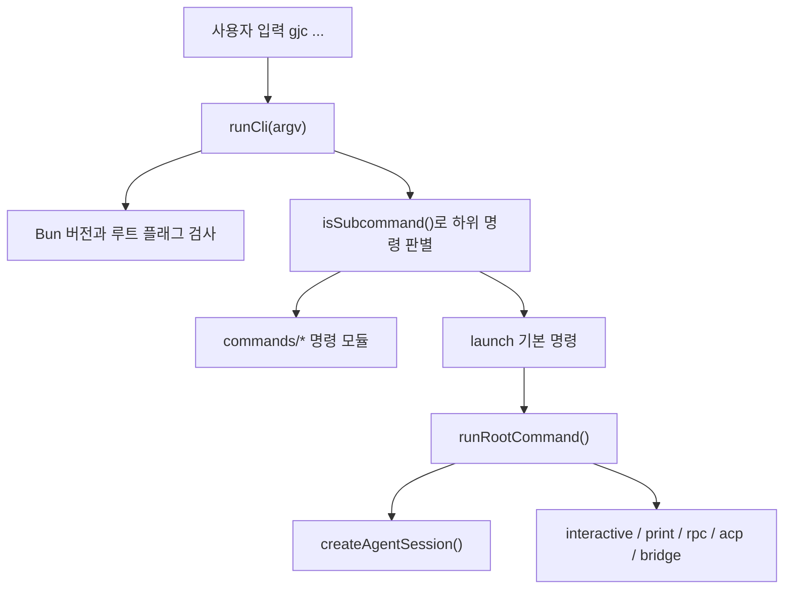

# Coding Agent CLI and Commands

## 역할과 범위

Coding Agent CLI and Commands 모듈은 `gjc` 실행 파일의 진입점, 루트 명령 라우팅, 세션 시작, 보조 CLI 명령 처리를 담당합니다. 핵심 경로는 `packages/coding-agent/src/cli.ts`의 `runCli()`에서 시작해, 일반 프롬프트는 기본 `launch` 명령으로 넘기고, 명시적 하위 명령은 `commands/*` 래퍼를 통해 각 `cli/*-cli.ts` 핸들러로 위임합니다.

이 모듈은 크게 세 층으로 나뉩니다.

- `cli.ts`: 실행 파일 진입점, Bun 버전 검사, 하위 명령 등록, 루트 도움말, smoke test, 런타임 전역 초기화
- `main.ts`: `launch` 명령의 본체로, 인자와 설정을 `createAgentSession()` 옵션으로 변환하고 실행 모드를 선택
- `cli/*.ts`: `config`, `auth-broker`, `auth-gateway`, `agents`, `grep`, `setup`, `plugin`, `update` 같은 세부 명령의 파서와 실행 핸들러



## CLI 진입점

`cli.ts`는 `#!/usr/bin/env bun` 실행 파일이며, 로드 직후 `Bun.version`을 `MIN_BUN_VERSION`과 비교합니다. 버전이 낮으면 `formatBunRuntimeError()` 결과를 stderr에 쓰고 `process.exit(1)`로 종료합니다.

`commands` 배열은 루트 명령 표면을 명시적으로 등록합니다. 각 항목은 `{ name, aliases?, load }` 형태이며, `load`는 동적 import로 실제 명령 모듈을 늦게 불러옵니다. 예를 들어 `state`, `setup`, `skills`, `session`, `team`, `ultragoal`, `ralplan`, `config`, `mcp-serve`, `deep-interview`, `update`, `launch`가 여기에 등록됩니다. `contribute-pr`은 `contribution-prep` 별칭을 함께 가집니다.

`runCli(argv)`는 세 가지 빠른 경로를 먼저 처리합니다.

- `--smoke-test`: `runSmokeTest()` 실행
- `--help`, `-h`, `help`: `renderRootHelp()`와 `getExtraHelpText()` 출력
- `--version`, `-v`: `${APP_NAME}/${VERSION}` 출력

그 외에는 `installRuntimeGlobals()`를 호출한 뒤 `run()`에 제어를 넘깁니다. `installRuntimeGlobals()`는 `@gajae-code/ai`의 `installH2Fetch()`로 전역 `fetch()`에 HTTP/2 우선 동작을 설치하고, `procmgr.scrubProcessEnv()`로 macOS malloc stack logging 환경 변수를 자식 프로세스 전에 제거합니다.

## 기본 명령 라우팅

`isSubcommand(first)`는 첫 번째 argv가 등록된 명령 이름이나 별칭이면 true를 반환합니다. 첫 번째 인자가 없거나 `-`, `@`로 시작하면 false입니다. false인 경우 전체 argv는 `["launch", ...argv]`로 재작성됩니다.

이 설계 때문에 다음 두 호출은 모두 `launch` 경로로 들어갑니다.

```bash
gjc "이 파일을 설명해줘"
gjc @README.md "요약해줘"
```

반대로 다음 호출은 명시적 하위 명령으로 처리됩니다.

```bash
gjc config list
gjc auth-broker status
gjc team list
```

`RootHelpCommand`는 루트 도움말 렌더링을 위한 숨김 명령입니다. 실제 에이전트 시작은 `launch` 명령이 `main.ts`의 `runRootCommand()`를 호출하는 방식으로 이뤄집니다.

## `main.ts`와 세션 시작 흐름

`main(args)`는 내부적으로 `runCli(args.length === 0 ? ["launch"] : args)`를 호출합니다. 실제 `launch` 실행 로직은 `runRootCommand(parsed, rawArgs, deps)`에 집중되어 있습니다.

`runRootCommand()`의 주요 단계는 다음과 같습니다.

1. `initTheme()`로 초기 테마와 로거 표시 환경을 준비합니다.
2. `maybeAutoChdir()`가 홈 디렉터리에서 시작된 경우 `~/tmp`, `/tmp`, `/var/tmp`, `os.tmpdir()` 순서로 작업 디렉터리를 옮깁니다. `--allow-home` 또는 `--cwd`가 있으면 건너뜁니다.
3. `discoverAuthStorage()`와 `ModelRegistry`를 초기화합니다.
4. `--version`, `--list-models`, `--export` 같은 즉시 종료형 옵션을 처리합니다.
5. `Settings.init({ cwd })`로 설정을 읽고, RPC 계열 모드에서는 `applyRpcDefaultSettingOverrides()`로 일부 기능을 기본값으로 되돌립니다.
6. `readPipedInput()`, `processFileArguments()`, `buildInitialMessage()`로 stdin, `@file`, 이미지 첨부, 일반 메시지를 하나의 초기 입력으로 합칩니다.
7. `createSessionManager()`로 새 세션, 이어가기, 재개, 포크, 인메모리 세션 중 하나를 선택합니다.
8. `buildSessionOptions()`가 모델, 도구, LSP, 규칙, 시스템 프롬프트, 세션 매니저를 `CreateAgentSessionOptions`로 변환합니다.
9. `createAgentSession()`을 호출하고 실행 모드별 루프로 진입합니다.

`runRootCommand()`는 실행 모드를 `parsedArgs.mode || "text"`로 계산합니다. `--print`가 있거나 stdin 입력이 들어온 비대화형 호출은 `runPrintMode()`로, `--mode rpc`와 `--mode rpc-ui`는 `runRpcMode()`로, `--mode acp`는 `runAcpMode()`로, `--mode bridge`는 `runBridgeMode()`로 이동합니다. 아무 모드도 없고 비대화형 조건도 아니면 `runInteractiveMode()`가 TUI를 시작합니다.

## 인자 파싱과 초기 메시지

`cli/args.ts`의 `parseArgs(args)`는 `launch` 계열 인자를 `Args` 구조체로 변환합니다. 주요 필드는 `model`, `mpreset`, `thinking`, `continue`, `resume`, `mode`, `sessionDir`, `tools`, `fileArgs`, `messages`입니다.

특이한 처리 규칙은 다음과 같습니다.

- `--flag=value`는 내부적으로 `--flag value`처럼 재작성됩니다.
- `/provider`, `/provider:*`, `/provicer`, `/provicer:*`는 시작 슬래시 명령으로 보고 남은 인자를 하나의 메시지로 합칩니다.
- `@path`는 `messages`가 아니라 `fileArgs`에 들어갑니다.
- `--tools`는 `BUILTIN_TOOLS`에 존재하는 이름만 통과시키고, 알 수 없는 이름은 `logger.warn()`으로 기록합니다.
- `--thinking`은 `parseEffort()`와 `THINKING_EFFORTS` 기준으로 검증합니다.
- `--default`는 `--mpreset <name>` 없이 사용할 수 없으며, 위반 시 예외를 던집니다.

`cli/file-processor.ts`의 `processFileArguments()`는 `@file` 입력을 텍스트 블록과 이미지 첨부로 나눕니다. 텍스트 파일은 `<file name="...">...</file>` 형식으로 초기 메시지에 포함됩니다. 이미지 파일은 `ImageContent` 배열에 들어가며, 기본적으로 `resizeImage()`를 통해 2000x2000 최대 크기로 자동 리사이즈를 시도합니다. 텍스트는 5MB, 이미지는 25MB 제한을 넘으면 내용 대신 경로 전용 `<file/>` 블록으로 대체합니다.

## 모델과 프로필 적용

`buildSessionOptions()`는 CLI 모델 선택과 설정 기반 모델 선택을 모두 처리합니다.

- `--model`은 `resolveCliModel()`로 해석됩니다.
- `--provider`와 `--model` 조합, 또는 `provider/model` 형태를 지원합니다.
- 내장 레지스트리에서 찾지 못한 모델 패턴은 확장 등록 모델을 고려해 `options.modelPattern`으로 지연 해석될 수 있습니다.
- `--models` 또는 `enabledModels` 설정은 `resolveModelScope()`로 Ctrl+P 모델 순환 범위를 만듭니다.
- `--thinking`은 `options.thinkingLevel`로 들어갑니다.

시작 후에는 `applyStartupModelProfiles()`가 모델 프로필을 적용합니다. 설정의 `modelProfile.default`가 먼저 적용되고, CLI의 `--mpreset`이 다음에 적용됩니다. 단, 명시적 `--model` 또는 `--thinking`은 프로필보다 우선합니다. 실패 시 `applyStartupModelProfilesOrExit()`가 에러를 출력하고 종료합니다.

## 세션 선택과 재개

`createSessionManager(parsed, cwd, settings)`는 세션 플래그를 해석합니다.

- `--fork <source>`: 기존 세션 파일 또는 세션 ID 접두사를 현재 cwd로 포크합니다.
- `--no-session`: `SessionManager.inMemory()`를 사용합니다.
- `--resume <id|path>`: 지정 세션을 엽니다.
- `--resume` 값 없음: `selectSession()`으로 세션 선택 UI를 띄웁니다.
- `--continue`: 현재 프로젝트의 최근 세션을 이어갑니다.
- `--session-dir`: 지정 디렉터리에 새 세션을 만듭니다.
- `autoResume` 설정이 켜져 있으면 최근 세션을 자동으로 이어가고 `parsed.continue = true`로 표시합니다.

전역 세션이 다른 프로젝트 cwd에 속하면 `promptForkSession()`이 현재 프로젝트로 포크할지 묻습니다. stdin이 TTY가 아니면 포크하지 않습니다.

## 실행 모드

`runInteractiveMode()`는 `InteractiveMode`를 동적으로 import해 TUI를 시작합니다. 시작 메시지, 알림, changelog, 새 버전 알림, 초기 프롬프트, 시작 slash command 처리를 모두 여기서 수행합니다. 사용자 입력은 반복적으로 `mode.getUserInput()`으로 받고 `submitInteractiveInput()`으로 세션에 제출합니다.

`submitInteractiveInput()`은 취소된 입력을 무시하고, 일반 입력은 `session.prompt()`, 커스텀 메시지는 `session.promptCustomMessage()`로 보냅니다. 예외는 `mode.showError()`로 표시하며, 항상 `finishPendingSubmission()`과 `checkShutdownRequested()`를 호출합니다.

ACP 모드는 `createAcpSessionFactory()`를 통해 `session/new`마다 독립 세션을 만듭니다. 이 factory는 `enableMCP: false`를 강제합니다. ACP 클라이언트가 공급한 MCP 서버가 세션 도구 레지스트리에서 호스트의 온디스크 MCP 발견 결과에 가려지지 않도록 하기 위한 격리입니다.

## 명령 핸들러 패턴

하위 명령은 보통 `src/commands/<name>.ts`에서 `@gajae-code/utils/cli`의 `Command` 클래스로 CLI 표면을 정의하고, 실제 로직은 `src/cli/<name>-cli.ts`의 `run<Name>Command()`로 위임합니다. call graph에서도 `run (src/commands/auth-broker.ts) → runAuthBrokerCommand()`나 `run (src/commands/ssh.ts) → runSSHCommand()` 같은 패턴이 반복됩니다.

이 구조의 장점은 명령 정의, 인자 파싱, 실행 로직을 분리한다는 점입니다. 테스트도 실행 핸들러를 직접 호출하는 방식이 많습니다. 예를 들어 `auth-broker-import.test.ts`는 `runAuthBrokerCommand()`, `config-cli.test.ts`는 `runConfigCommand()`, `cli-command-surface.test.ts`와 `cli-args-mpreset.test.ts`는 `parseArgs()`를 직접 검증합니다.

## `agents` 명령

`cli/agents-cli.ts`는 `gjc agents unpack`을 처리합니다. `runAgentsCommand()`는 현재 `unpack` 액션만 지원합니다.

`unpackBundledAgents()`는 `loadBundledAgents()` 결과를 이름순으로 정렬한 뒤 `serializeAgent()`로 frontmatter와 본문을 만들어 디스크에 씁니다. 대상 디렉터리는 `resolveTargetDir()`가 결정합니다.

- `--dir <path>`: 현재 프로젝트 기준 상대 경로나 절대 경로
- `--project`: `<cwd>/.gjc/agents`
- 기본값 또는 `--user`: `getAgentDir()/agents`
- `--user`와 `--project` 동시 사용은 에러

기존 파일은 기본적으로 건너뛰며, `--force`가 있으면 덮어씁니다. `--json`이 있으면 `UnpackResult`를 JSON으로 출력합니다.

## `config` 명령

`cli/config-cli.ts`는 `gjc config list|get|set|reset|path|init-xdg`를 처리합니다. 설정 키 목록은 `SETTINGS_SCHEMA`가 단일 출처입니다.

`parseConfigArgs()`는 `config` 명령인지 먼저 확인하고, 액션과 `--json` 여부, key/value 위치 인자를 파싱합니다. `runConfigCommand()`는 `Settings.init()` 후 액션별 핸들러로 분기합니다.

`parseAndSetValue()`는 설정 스키마 타입에 따라 문자열 값을 변환합니다.

- `boolean`: `true`, `false`, `yes`, `no`, `on`, `off`, `1`, `0`
- `number`: `Number()` 변환 후 schema `validate`가 있으면 추가 검증
- `enum`: `getEnumValues()` 결과 안에 있어야 함
- `array`: JSON 배열이어야 함
- `record`: JSON 객체여야 함
- 그 외: 문자열 그대로 저장

`handlePath()`는 설정 파일 자체가 아니라 `getAgentDir()` 결과, 즉 GJC 에이전트 설정 루트 경로를 출력합니다.

## `auth-broker` 명령

`cli/auth-broker-cli.ts`는 `gjc auth-broker serve|token|login|logout|import|migrate|status`를 처리합니다. 이 명령은 로컬 SQLite 인증 저장소와 원격 broker 사이의 인증 수명주기를 관리합니다.

`runServe()`는 `SqliteAuthCredentialStore.open(getAgentDbPath())`로 로컬 DB를 열고, `AuthStorage`를 reload한 뒤 `startAuthBroker()`를 시작합니다. bearer token은 `ensureToken()`으로 `auth-broker.token` 파일에서 읽거나 새로 생성합니다. 서비스는 `SIGINT`와 `SIGTERM`에서 broker handle과 storage를 닫습니다.

`runToken()`은 token 파일을 읽거나 생성하고, `--regenerate`가 있으면 새 토큰을 씁니다. `--json` 출력도 지원합니다.

`runLogin()`은 provider가 OAuth provider인지 확인하고, 로컬 로그인은 `runLocalLogin()`으로 `@gajae-code/ai/cli login <provider>`를 실행합니다. `--via=user@host`가 있으면 `runRemoteLogin()`이 OAuth callback port를 SSH `-L`로 포워딩한 뒤 원격에서 같은 명령을 실행합니다.

`runImport()`는 CLIProxyAPI 스타일 JSON credential 파일 또는 디렉터리를 읽어 GJC provider id로 매핑합니다. `loadImportPlan()`은 import 가능한 항목과 skip 사유를 분리하고, broker 설정이 있으면 `AuthBrokerClient.uploadCredential()`, 없으면 로컬 `SqliteAuthCredentialStore.upsertAuthCredentialForProvider()`를 사용합니다.

`runMigrate()`는 `--from-local`을 필수로 요구하며, 로컬 SQLite와 선택적 env API key를 broker로 업로드합니다. 먼저 `fetchSnapshot()`으로 broker의 기존 credential identity를 인덱싱해 재실행을 멱등적으로 만듭니다.

## `auth-gateway` 명령

`cli/auth-gateway-cli.ts`는 `gjc auth-gateway serve|token|status|check`를 처리합니다. gateway는 덜 신뢰되는 클라이언트가 provider API를 호출할 수 있게 해주는 forward proxy이며, 자체적으로는 broker client입니다.

`runServe()`는 `resolveAuthBrokerConfig()`로 broker URL과 token을 읽고, `AuthBrokerClient`와 `RemoteAuthCredentialStore`를 구성합니다. `AuthStorage.exportSnapshot()`의 credential provider 목록을 기준으로 `getBundledProviders()`와 `getBundledModels()`에서 제공 가능한 모델 catalog를 만듭니다. 이후 `startAuthGateway()`에 `resolveModel`과 `listModels` 콜백을 넘겨 `/v1/models`와 요청 모델 해석을 지원합니다.

gateway token은 `ensureToken()`으로 관리합니다. `createTokenExclusive()`는 `fs.writeFile(..., { flag: "wx" })`를 사용해 동시 실행에서 token 파일을 덮어쓰지 않습니다. `--no-auth`가 있으면 inbound bearer token 검사를 비활성화합니다.

`runStatus()`는 token 존재 여부와 broker snapshot 접근 가능 여부를 확인합니다. `runCheck()`는 broker가 공급한 credential 각각에 대해 `storage.checkCredentials()`를 실행하고 provider별 인증 건강 상태를 출력합니다.

## 설치 대상 분류

`cli/classify-install-target.ts`의 `classifyInstallTarget(spec, knownMarketplaces)`는 install spec을 marketplace plugin reference 또는 npm package spec으로 분류합니다.

규칙은 보수적입니다.

- `@scope/pkg`처럼 `@`로 시작하면 항상 npm입니다.
- 마지막 `@` 오른쪽이 `latest`, `beta`, `rc` 같은 npm dist-tag이거나 semver/range처럼 보이면 npm입니다.
- 오른쪽이 `knownMarketplaces`에 있으면 `{ type: "marketplace", name, marketplace }`입니다.
- 그 외는 npm입니다.

이 함수는 marketplace CLI 테스트에서 직접 호출되며, `pkg@1.2.3` 같은 npm spec을 marketplace로 오인하지 않도록 설계되어 있습니다.

## smoke test와 설치 검증

`runSmokeTest()`는 `--smoke-test` 전용 경로입니다. `@gajae-code/stats`의 `smokeTestSyncWorker()`를 실행해 stats sync worker가 실제로 로드되는지 확인합니다. 이어서 `../../natives/native/index.js`에서 `h06FormatHashLines`, `h02ScoreSequenceFuzzy`, `h01FindBestFuzzyMatch`를 import해 단일 바이너리에 포함된 native addon export가 해석되는지 확인합니다.

성공하면 `smoke-test: ok`를 stdout에 씁니다. 이 경로는 단순 `--version`으로 잡히지 않는 Worker 로딩 회귀와 embedded native addon 누락을 잡기 위한 최소 end-to-end 설치 검증입니다.

## 기여 시 주의점

이 모듈을 변경할 때는 명령 표면과 세션 시작 경로를 분리해서 생각해야 합니다. 새 루트 명령을 추가하려면 `cli.ts`의 `commands` 배열, `src/commands/<name>.ts`의 명령 정의, 필요 시 `src/cli/<name>-cli.ts` 실행 핸들러와 테스트를 함께 맞춰야 합니다. 일반 프롬프트 입력을 건드리는 변경은 `isSubcommand()`, `parseArgs()`, `buildInitialMessage()`, `runRootCommand()`의 상호작용을 반드시 확인해야 합니다.

출력 모드나 세션 생성 옵션을 바꾸는 변경은 `createAgentSession()` 호출 전의 `buildSessionOptions()`와 호출 후의 `interactive`, `print`, `rpc`, `acp`, `bridge` 분기까지 영향을 줍니다. 특히 ACP 경로는 `createAcpSessionFactory()`의 `enableMCP: false` 격리가 의도된 동작이므로, MCP 발견 로직을 공통화할 때 이 예외를 유지해야 합니다.