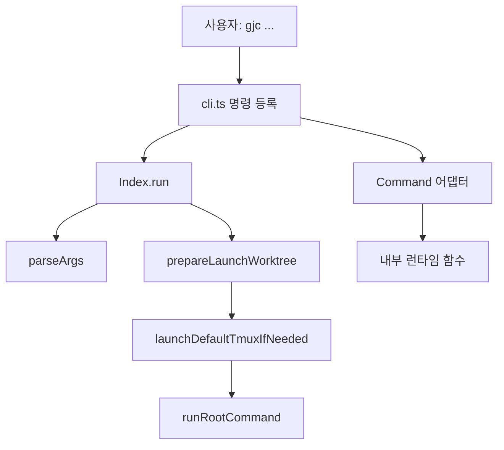

# Coding Agent — CLI Entrypoints and Command Adapters

# CLI 엔트리포인트와 명령 어댑터

이 모듈은 `gjc` 실행 파일의 공개 명령 표면을 정의하고, 각 CLI 명령을 실제 런타임 구현으로 연결하는 얇은 어댑터 계층입니다. 대부분의 클래스는 `@gajae-code/utils/cli`의 `Command`를 상속하며, 플래그와 인자를 파싱한 뒤 `main`, `gjc-runtime`, `harness-control-plane`, `coordinator-mcp`, `session` 같은 하위 모듈로 처리를 위임합니다.

핵심 역할은 세 가지입니다.

- 루트 실행 경로: `launch.ts`의 `Index.run()`이 일반 대화형/비대화형 에이전트 실행을 시작합니다.
- 명령 어댑터: `state`, `gc`, `contribute-pr`, `coordinator`, `mcp-serve`, `codex-native-hook` 등이 내부 런타임 함수로 CLI 입력을 전달합니다.
- 제어 평면: `harness.ts`가 세션, 런타임 owner, 이벤트, 복구, 종료 상태를 JSON 계약으로 노출합니다.

## 실행 구조



`launch.ts`의 `Index`는 루트 명령입니다. `run()`은 먼저 `prepareAcpTerminalAuthArgs()`로 ACP 터미널 인증 인자를 정리하고, `parseArgs()`로 원본 CLI 인자를 해석합니다. `--help`나 `--version`은 세션을 만들지 않고 곧바로 `runRootCommand(parsed, args)`로 전달합니다.

일반 실행에서는 `prepareLaunchWorktree(process.cwd(), args)`가 `--worktree` 계열 실행을 준비합니다. worktree가 활성화되면 `process.chdir(launch.cwd)`와 `setProjectDir(launch.cwd)`를 호출해 이후 실행 컨텍스트를 새 작업 디렉터리로 맞춥니다. 그 다음 `launchDefaultTmuxIfNeeded()`가 `--tmux` 실행을 처리하고, tmux로 넘겨졌다면 현재 프로세스는 종료됩니다. 그렇지 않으면 최종적으로 `runRootCommand(launchParsed, launch.args)`가 에이전트 세션을 시작합니다.

## 명령 어댑터 패턴

이 모듈의 명령 클래스들은 대체로 다음 패턴을 따릅니다.

```ts
export default class SomeCommand extends Command {
	static description = "...";
	static strict = false;

	static flags = {
		json: Flags.boolean({ char: "j", description: "Emit machine-readable JSON", default: false }),
	};

	async run(): Promise<void> {
		const { flags } = await this.parse(SomeCommand);
		const result = await runSomeRuntime(this.argv, process.cwd(), process.env);
		if (result.stdout) process.stdout.write(result.stdout);
		if (result.stderr) process.stderr.write(result.stderr);
		process.exitCode = result.status;
	}
}
```

`Gc`와 `State`가 이 형태에 가깝습니다. CLI 계층은 플래그 정의, 출력 연결, 종료 코드 반영만 맡고, 실제 정책은 각각 `runGjcGcCommand()`와 `runNativeStateCommand()`에 있습니다. 이 구조 덕분에 명령 표면은 안정적으로 유지하면서 런타임 구현을 별도 모듈에서 테스트할 수 있습니다.

`ContributionPrep`처럼 결과 객체를 사람이 읽을 수 있는 텍스트로 변환하는 명령도 있습니다. 이 경우 `prepareContributionPrep()`가 아티팩트 생성과 worker spawn 여부를 결정하고, CLI는 `Manifest`, `Worker prompt`, `Spawned worker` 경로만 출력합니다.

## 루트 실행: `Index`

`packages/coding-agent/src/commands/launch.ts`의 `Index`는 숨겨진 루트 명령이지만 실제 `gjc` 실행의 중심입니다.

주요 플래그는 모델 선택, 세션 복원, 실행 모드, 도구 활성화, 확장/스킬/규칙 로딩, tmux 실행을 포괄합니다.

- 모델 관련: `--model`, `--smol`, `--slow`, `--plan`, `--mpreset`, `--default`, `--thinking`
- 세션 관련: `--continue`, `--resume`, `--session-dir`, `--no-session`
- 실행 모드: `--mode text|json|rpc|acp|rpc-ui|bridge`, `--print`
- 도구/확장: `--no-tools`, `--tools`, `--hook`, `--extension`, `--no-extensions`, `--no-skills`, `--no-rules`
- 환경 실행: `--tmux`, `--allow-home`, `--no-pty`, `--export`, `--list-models`

`Index.run()`의 중요한 특징은 시작 전 경로와 인자를 한 번 더 정규화한다는 점입니다. `prepareLaunchWorktree()`가 반환한 `launch.args`를 다시 `parseArgs()`에 넣어, worktree 전환 후 실제 실행될 인자 기준으로 tmux와 root command를 판단합니다.

## 도움말과 환경 변수: `getExtraHelpText`

`packages/coding-agent/src/cli/fast-help.ts`의 `getExtraHelpText()`는 루트 도움말에 붙는 정적 도움말 문자열을 생성합니다. 여기에는 provider별 인증 환경 변수, 검색 도구 API 키, GJC 설정 변수, 기본 도구 목록, 유용한 명령이 포함됩니다.

이 함수는 런타임 provider나 모델 레지스트리를 초기화하지 않고 문자열만 반환합니다. `cli-help-load-order.test.ts`는 `gjc --help`가 오프라인 환경에서도 provider/model 경로를 건드리지 않고 렌더링되는지를 검증합니다.

## XDG 초기화: `initXdg`

`packages/coding-agent/src/cli/commands/init-xdg.ts`의 `initXdg()`는 Linux와 macOS에서 XDG 디렉터리를 준비합니다.

동작 순서는 단순합니다.

1. `process.platform`이 `linux` 또는 `darwin`인지 확인합니다.
2. `XDG_DATA_HOME`, `XDG_STATE_HOME`, `XDG_CACHE_HOME`을 읽고, 없으면 홈 디렉터리 아래 기본값을 사용합니다.
3. 각 경로 아래 `gjc` 디렉터리를 만듭니다.
4. 생성된 경로와 shell profile 안내를 출력합니다.

이 함수는 `runConfigCommand()` 쪽에서 호출되는 진입점으로 연결됩니다. XDG 초기화는 세션 실행이 아니라 로컬 환경 준비 명령에 가깝습니다.

## Coordinator와 MCP 브리지

`coordinator.ts`와 `mcp-serve.ts`는 GJC coordinator MCP 브리지의 계약을 CLI로 노출합니다.

### `Coordinator`

`Coordinator.run()`은 `check`, `tools`, `doctor` 세 가지 동작을 처리합니다.

- `check`: 서버 이름, MCP 프로토콜 버전, read-only 여부, 도구 개수를 출력합니다.
- `tools`: `COORDINATOR_MCP_TOOL_NAMES` 목록만 출력합니다.
- `doctor`: `buildCoordinatorMcpConfig(process.env)`로 환경 설정을 해석하고 `workdir_roots`, `session_mutations`, `session_command`, `namespace` 상태를 점검합니다.

JSON 출력은 `--json` 또는 `-j`로 활성화합니다. 알 수 없는 subcommand는 `unknown_coordinator_subcommand`를 반환하고 종료 코드 1을 설정합니다.

### `McpServe`

`McpServe`는 실제 MCP stdio 서버 실행 진입점입니다. `validateMcpServeSubcommandForTest()`는 `coordinator`와 `hermes` alias만 허용합니다. `--check`가 있으면 stdio 서버를 띄우지 않고 coordinator 계약 요약만 출력합니다. 그렇지 않으면 `runCoordinatorMcpStdio()`를 호출해 MCP 서버 루프를 시작합니다.

`mcp-serve`는 실행형 서버이고, `coordinator`는 계약 점검용 CLI입니다. 둘 다 같은 `COORDINATOR_MCP_SERVER_NAME`, `COORDINATOR_MCP_PROTOCOL_VERSION`, `COORDINATOR_MCP_TOOL_NAMES` 상수를 공유합니다.

## Harness 제어 평면

`packages/coding-agent/src/commands/harness.ts`는 `gjc harness <verb>`를 구현합니다. 이 명령은 대화형 CLI라기보다 AI-native 제어 평면에 가깝고, 모든 verb가 JSON 응답을 출력합니다. 응답은 `buildResponse()`를 통해 `{ ok, state, evidence, nextAllowedActions }` 형태의 공통 계약으로 정규화됩니다.

지원 verb는 다음 흐름으로 나뉩니다.

- 세션 생성과 점검: `start`, `preflight`
- 실행 관찰: `observe`, `events`, `monitor`
- 복구 판단: `classify`, `recover`
- owner 라우팅: `submit`, `validate`, `finalize`, `operate`, `retire`
- 내부 owner 프로세스: `__owner`

### 입력 파싱과 루트 해석

`Harness.run()`은 `--input` 문자열을 `parseInput()`으로 JSON 객체로 파싱합니다. `--prompt-file`은 `submit`에서만 허용되며, `input.prompt`와 동시에 사용할 수 없습니다. 세션이 필요한 verb는 `--session` 또는 `input.sessionId`에서 세션 ID를 읽습니다.

`start`가 아닌 verb에서 session ID가 있으면 `resolveHarnessSessionRoot()`로 실제 세션 루트를 다시 찾습니다. 이때 `input.workspace`가 있으면 예상 workspace도 같이 전달해 다른 root의 같은 session ID를 잘못 잡지 않도록 합니다.

### Preflight

`buildPreflight()`는 workspace와 Git 상태를 검증합니다.

- `resolveInputWorkspace()`로 workspace를 정규화합니다.
- `git rev-parse --show-toplevel`로 Git repo 여부를 확인합니다.
- `git rev-parse --abbrev-ref HEAD`로 현재 브랜치를 읽습니다.
- `normalizeIssueOrPr()`로 `issueOrPr`, `pr`, `issue` 값을 숫자 문자열로 정규화합니다.
- 선언된 branch와 실제 branch가 다르면 `branch-mismatch`를 blocker로 추가합니다.

`startFatalPreflightBlockers()`는 `start`에서 치명적인 blocker만 추립니다. `branch-mismatch`와 잘못된 issue/PR 값은 항상 치명적이고, `strictPreflight` 또는 branch가 명시된 경우에는 Git repo 아님과 detached HEAD도 치명적입니다.

### Start와 owner 생성

`#start()`는 harness 세션 상태를 만들고 저장합니다. 지원 harness는 `"gajae-code"` 하나뿐입니다. 세션 ID는 `input.sessionId`가 있으면 재사용하고, 없으면 `generateSessionId()`로 생성합니다.

생성되는 `SessionState`에는 다음 핸들이 포함됩니다.

- `processHandle`: runtime owner 정보
- `rpcHandle`: owner 내부 RPC session directory
- `ownerHandle`: lease path, endpoint, heartbeat
- `routerHandle`: owner 내부 기본 라우터와 events path
- `viewportHandle`: tmux event monitor 정보

`input.detach === true`이면 `#spawnDetachedOwner()`가 owner를 띄웁니다. 이 함수는 먼저 `#startTmuxResidentOwner()`로 tmux 세션 안에 owner를 만들고, `#waitForOwner()`로 endpoint 라우팅 가능 여부를 확인합니다. tmux가 없거나 endpoint가 준비되지 않으면 `Bun.spawn()`으로 detached owner를 띄우는 fallback을 시도합니다.

### Observe와 owner 소실 처리

`#observe()`는 먼저 `#tryOwnerRoute()`로 live owner에게 `observe`를 위임합니다. owner가 없으면 local state와 events를 읽어 관찰 결과를 만듭니다.

`buildObservation()`은 다음 정보를 조합합니다.

- `gitDeltaFor()`의 `clean`, `dirty`, `unknown`
- 최근 이벤트의 signal
- 마지막 이벤트 시간
- 완료 terminal event 여부
- owner live 여부
- `deleted-worktree`, `vanished-dirty`, `normal` risk

owner가 종료되었지만 완료 이벤트가 있고 worktree가 clean이면 `reconcileCompletedOwnerExited()`가 lifecycle을 `completed`로 바꿉니다. 반대로 prompt accepted, tool-call, streaming 같은 신호가 있는데 owner가 사라졌으면 `needsVanishedOwnerBlock()`와 `markVanishedOwnerBlocked()`가 `owner-vanished:<gitDelta>` blocker를 저장합니다.

`buildOwnerExitEvidence()`는 lease, heartbeat, endpoint, 마지막 이벤트, prompt acceptance, completion 여부를 모아 owner 종료 이유를 분류합니다. 특히 owner가 시작되었지만 첫 prompt 수락 전에 죽은 경우 `owner-died-before-first-prompt`를 startup blocker로 저장합니다.

### Submit과 owner 라우팅

`#submit()`은 세션 ID를 요구하고, 가능한 경우 live owner에게 `submit`을 라우팅합니다. 라우팅은 `#tryOwnerRoute()`가 담당합니다. 이 함수는 `resolveOwner()`로 lease와 socket을 찾고, `callEndpoint()`로 `{ verb, input }`을 보냅니다.

owner가 없으면 submit은 절대 accepted로 처리되지 않습니다. 대신 `buildOwnerExitEvidence()`로 이유와 복구 안내를 만들고, `buildResponse()`에 `accepted: false`, `submitted: false`, `reason`, `ownerExit`, `guidance`를 넣어 반환합니다.

### Recover

`#recoverWithoutOwner()`는 live owner 없이 복구를 수행하는 경로입니다. 먼저 기존 state를 읽고, `buildOwnerExitEvidence()`와 `buildObservation()`으로 vanish 여부를 판단합니다. `classifyRecovery()`는 observation과 retry budget을 받아 복구 결정을 만듭니다.

중요한 예외는 “owner가 한 번도 시작되지 않은 세션”입니다. lifecycle이 `started`이고 endpoint, prompt accepted, completion, event가 모두 없으면 vanish로 보지 않고 새 owner를 bootstrap합니다. 이 경우 vanish receipt를 만들지 않습니다.

실제 vanish로 판단되면 `writeVanishReceiptForDecision()`가 필요할 때 dirty worktree를 보존하고 `buildReceipt()`로 immutable receipt를 저장합니다. owner 복원이 성공하면 `updateStateWithRestoredOwner()`가 state를 `observing`으로 되돌리고 owner handle을 갱신합니다.

## 상태, GC, hook, contribution 명령

### `State`

`State.run()`은 `runNativeStateCommand(this.argv)`를 호출합니다. 이 명령은 `.gjc/state` 아래 workflow state receipt를 읽거나 씁니다. 예시는 `state.ts`의 `static examples`에 정의되어 있으며, `deep-interview`, `ralplan`, `team` 같은 workflow별 read/write/contract/doctor/handoff 명령을 지원합니다.

### `Gc`

`Gc.run()`은 `runGjcGcCommand(this.argv, process.cwd(), process.env)`로 stale session/PID record 정리를 위임합니다. 기본은 dry-run이며, `--prune` 또는 `--force`가 있어야 제거를 수행합니다. `--json`은 기계 판독 출력에 사용됩니다.

### `CodexNativeHook`

`CodexNativeHook.run()`은 `runGjcNativeSkillHookCli()`를 호출합니다. 설명 그대로 Codex native `UserPromptSubmit`/`Stop` skill-state hook을 실행하는 CLI 진입점입니다. `strict = false`이므로 hook 호출자가 전달하는 추가 인자를 그대로 받을 수 있습니다.

### `ContributionPrep`

`ContributionPrep.run()`은 현재 작업 디렉터리와 source session ID를 바탕으로 `prepareContributionPrep()`를 호출합니다. `--no-spawn`은 fresh worker를 띄우지 않고 아티팩트만 쓰도록 `spawnWorker: false`를 전달합니다. `--artifact-root`는 contribute-pr 아티팩트 출력 디렉터리를 바꿉니다.

출력은 고정된 텍스트 요약입니다.

```text
Contribution prep artifacts written.
Manifest: <manifest 경로>
Worker prompt: <worker prompt 경로>
Spawned worker: yes|no
```

## 패키지 공개 API: `index.ts`

`packages/coding-agent/src/index.ts`는 CLI 명령이라기보다 패키지 소비자를 위한 barrel export입니다. TUI 컴포넌트, 설정, 모델 레지스트리, 확장 타입, 스킬, slash command, main entry point, SDK, session manager, task executor, tools, git utility를 외부로 다시 내보냅니다.

특이한 부분은 `HookEditorComponent`, `HookInputComponent`, `HookSelectorComponent`를 각각 `ExtensionEditorComponent`, `ExtensionInputComponent`, `ExtensionSelectorComponent`라는 이름으로 재노출한다는 점입니다. 이는 extension author가 hook UI 컴포넌트를 extension UI 컴포넌트처럼 사용할 수 있게 하는 호환 계층입니다.

## 테스트가 고정하는 계약

이 모듈 주변 테스트는 CLI 표면과 도움말 동작을 계약으로 고정합니다.

`cli-command-surface.test.ts`는 등록 명령 순서를 검사합니다. 현재 공개 표면에는 `codex-native-hook`, `state`, `setup`, `skills`, `session`, `harness`, `coordinator`, `team`, `ultragoal`, `gc`, `ralplan`, `config`, `mcp-serve`, `contribute-pr`, `deep-interview`, `update`, `launch`가 포함됩니다.

같은 테스트는 startup slash command 파싱도 보호합니다. 예를 들어 `/provider add ... --model ...` 형태의 입력은 CLI 플래그로 분해되지 않고 하나의 initial message로 보존되어야 합니다.

`cli-help-load-order.test.ts`는 `gjc --help`가 provider 인증 정보나 네트워크 없이도 성공해야 한다는 계약을 검증합니다. 도움말 경로를 수정할 때는 provider/model registry 초기화가 섞이지 않도록 주의해야 합니다.

## 기여 시 주의할 점

이 모듈에 새 명령을 추가할 때는 CLI 클래스만 만드는 것으로 끝나지 않습니다. `cli.ts`의 command registration, 도움말 노출, public surface 테스트, 필요한 runtime 함수 테스트를 함께 맞춰야 합니다.

명령 어댑터는 가능한 얇게 유지하는 편이 좋습니다. 인자 파싱, 표준 출력/오류 출력, 종료 코드 반영은 CLI 계층에 두고, 상태 전이와 정책은 `gjc-runtime`, `harness-control-plane`, `coordinator-mcp`, `session` 같은 하위 모듈에 둡니다.

`harness.ts`를 수정할 때는 상태 전이와 owner liveness 판단을 특히 조심해야 합니다. `submit`은 live owner가 없을 때 prompt를 accepted로 처리하면 안 되고, `observe`와 `recover`는 완료된 owner 종료, vanished owner, startup blocker를 서로 다르게 보고해야 합니다. JSON 응답은 외부 제어 평면이 소비하는 계약이므로 `buildResponse()` 기반 shape를 유지해야 합니다.