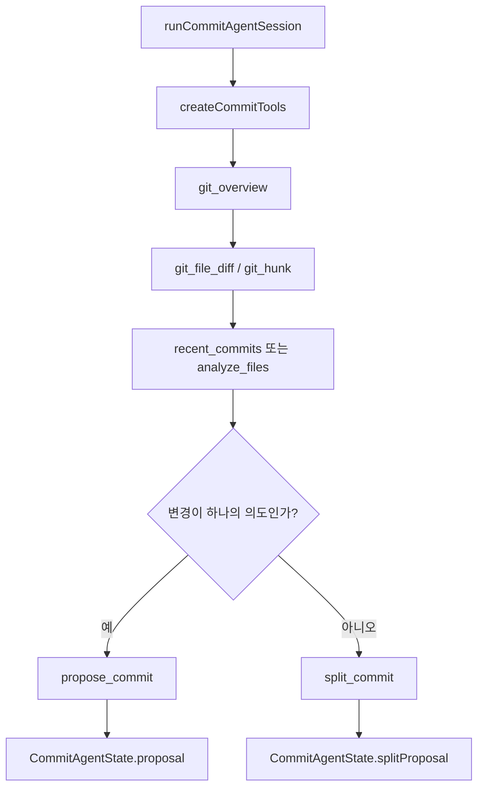
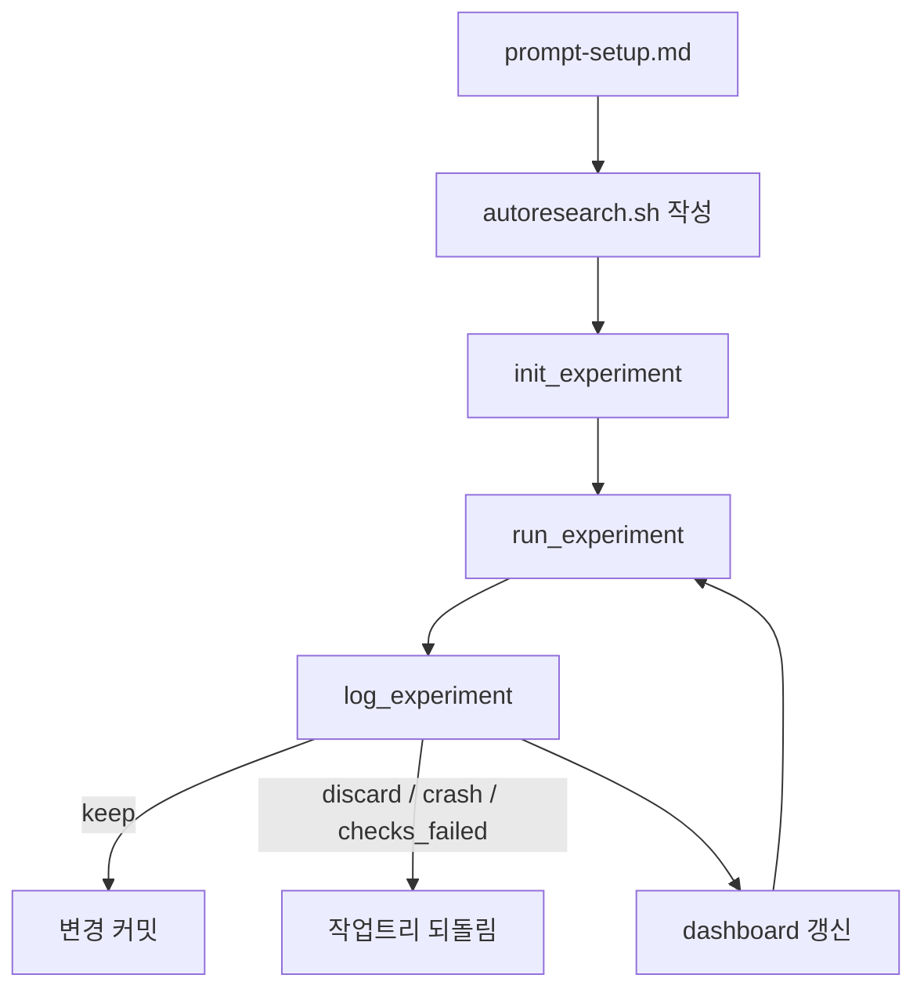

# Coding Agent — Commit, Changelog, and Autoresearch Workflows

## 개요

이 모듈은 GJC의 세 가지 개발 보조 워크플로를 담당합니다.

- 커밋 제안: staged diff를 읽고 Conventional Commit 형식의 단일 커밋 또는 분할 커밋 계획을 만듭니다.
- 변경 로그 제안: 커밋 대상 변경 중 사용자에게 보이는 변경만 Keep a Changelog 범주로 정리합니다.
- autoresearch: `autoresearch.sh` 벤치마크 하네스를 기준으로 실험을 반복 실행하고, 결과를 기록하며, 유지할 변경을 커밋하거나 실패한 변경을 되돌립니다.

주요 진입점은 다음과 같습니다.

- `runCommitCommand` (`packages/coding-agent/src/commit/index.ts`)
- `createCommitTools` (`packages/coding-agent/src/commit/agentic/tools/index.ts`)
- `createInitExperimentTool`
- `createRunExperimentTool`
- `createLogExperimentTool`
- `createUpdateNotesTool`
- `createDashboardController`

## 커밋 제안 워크플로

커밋 워크플로는 staged changes를 분석해 `propose_commit` 또는 `split_commit` 중 하나로 끝나는 agentic 세션입니다. 시스템 프롬프트(`commit/agentic/prompts/system.md`)는 에이전트에게 다음 순서를 강제합니다.

1. 항상 `git_overview`를 먼저 호출합니다.
2. 핵심 파일에 대해 `git_file_diff`를 1-2회만 사용합니다.
3. 큰 diff는 `git_hunk`로 특정 hunk만 조회합니다.
4. 스타일 맥락이 필요할 때만 `recent_commits`를 사용합니다.
5. diff가 너무 크거나 불명확할 때만 `analyze_files`를 사용합니다.
6. 마지막에는 정확히 하나의 `propose_commit` 또는 `split_commit`을 호출합니다.



### `createCommitTools`

`createCommitTools(options)`는 커밋 에이전트가 사용할 커스텀 도구 목록을 구성합니다.

항상 포함되는 도구:

- `createGitOverviewTool`
- `createGitFileDiffTool`
- `createGitHunkTool`
- `createRecentCommitsTool`
- `createProposeChangelogTool`
- `createProposeCommitTool`
- `createSplitCommitTool`

`enableAnalyzeFiles`가 `false`가 아니면 `createAnalyzeFileTool`도 포함됩니다. 이 도구는 `TaskTool`을 통해 `quick_task` 에이전트를 병렬 실행해 파일별 요약을 만듭니다.

### `git_overview`

`createGitOverviewTool(cwd, state)`는 staged diff의 개요를 JSON으로 반환하고 `state.overview`에 저장합니다.

반환 정보는 다음을 포함합니다.

- `files`: staged 변경 파일 목록
- `stat`: `git diff --stat` 결과
- `numstat`: 파일별 추가/삭제 줄 수
- `scopeCandidates`: `extractScopeCandidates()`로 계산한 scope 후보
- `isWideScope`: 변경 범위가 넓은지 여부
- `excludedFiles`: lock file처럼 커밋 분석에서 제외된 파일

`Cargo.lock`, `bun.lock`, `package-lock.json`, `go.sum` 같은 lock file은 `EXCLUDED_LOCK_FILES`에 의해 기본 분석 대상에서 빠집니다. 이 필터는 커밋 메시지가 의존성 lock noise에 끌려가지 않도록 합니다.

### `git_file_diff`

`createGitFileDiffTool(cwd, state)`는 지정한 파일 diff를 반환합니다. 기본값은 staged diff입니다.

중요한 동작:

- `getFilePriority()`로 구현 파일, 스크립트, manifest, 테스트, 문서, 바이너리의 우선순위를 나눕니다.
- 우선순위가 높은 파일부터 diff를 정렬합니다.
- 큰 diff는 `truncateDiffContent()`로 앞부분과 뒷부분만 남깁니다.
- 같은 파일 diff는 `state.diffCache`에 캐시합니다.

`getFilePriority()`는 확장자와 경로 패턴을 함께 봅니다.

- `.ts`, `.tsx`, `.rs`, `.go`, `.py` 등 구현 파일: 높은 우선순위
- `.sh`, `.sql`: 스크립트 우선순위
- `package.json`, `Cargo.toml`, `go.mod`: manifest 우선순위
- `/test/`, `.test.`, `.spec.` 등 테스트 경로: 낮은 우선순위
- 이미지, 폰트, 압축 파일 등: 바이너리로 처리

### `git_hunk`

`createGitHunkTool(cwd)`는 한 파일의 diff hunk를 선택적으로 반환합니다.

`hunks`가 없으면 전체 hunk를 반환하고, 값이 있으면 1-based hunk index만 골라 반환합니다. 바이너리 파일이면 `"Binary file diff; no hunks available."`를 반환합니다.

이 도구는 큰 diff 전체를 모델에 넣지 않고, 커밋 판단에 필요한 일부 hunk만 확인할 때 사용됩니다.

### `recent_commits`

`createRecentCommitsTool(cwd)`는 최근 commit subject와 스타일 통계를 반환합니다.

내부 helper:

- `extractSummary(subject)`: `type(scope): summary`에서 summary만 추출합니다.
- `extractScope(subject)`: Conventional Commit scope를 추출합니다.

통계에는 다음이 포함됩니다.

- `scopeUsagePercent`
- `commonVerbs`
- `summaryLength`
- `lowercaseSummaryPercent`
- `topScopes`

이 정보는 새 커밋 제안이 저장소의 기존 문체와 크게 어긋나지 않도록 돕습니다.

### `analyze_files`

`createAnalyzeFileTool(options)`는 `TaskTool.create()`로 `quick_task` 에이전트를 실행합니다. 각 파일에는 `commit/agentic/prompts/analyze-file.md`가 렌더링되어 전달됩니다.

요청 스키마:

- `files`: 분석할 파일 경로 배열
- `goal`: 선택적 분석 초점

출력 스키마는 다음 구조입니다.

```json
{
  "summary": "파일 역할 한 문장 요약",
  "highlights": ["주요 관찰"],
  "risks": ["주의할 위험"]
}
```

`formatRelatedFiles()`는 같은 변경에 포함된 다른 파일들을 함께 설명해, 파일별 분석이 전체 커밋 맥락에서 벗어나지 않도록 합니다.

## 커밋 제안 검증

### `propose_commit`

`createProposeCommitTool(cwd, state)`는 최종 단일 커밋 제안을 검증하고, 유효하면 `state.proposal`에 저장합니다.

입력 필드:

- `type`: `feat`, `fix`, `refactor`, `perf`, `docs`, `test`, `build`, `ci`, `chore`, `style`, `revert`
- `scope`: 문자열 또는 `null`
- `summary`
- `details`
- `issue_refs`

검증 흐름:

1. `normalizeSummary()`로 summary를 정규화합니다.
2. `normalizeDetails()`와 `capDetails()`로 detail 항목을 정리하고 최대 개수를 제한합니다.
3. `validateSummaryRules()`로 summary 길이와 형식을 검사합니다.
4. `validateAnalysis()`로 Conventional Commit 분석 구조를 검사합니다.
5. `validateTypeConsistency()`로 diff 내용과 commit type이 맞는지 검사합니다.

검증에 성공하면 다음 구조가 `state.proposal`에 저장됩니다.

- `analysis`
- `summary`
- `warnings`

### `split_commit`

`createSplitCommitTool(cwd, state, changelogTargets)`는 staged 변경을 여러 커밋으로 나누는 계획을 검증합니다.

각 커밋은 다음을 포함합니다.

- `changes`: 파일과 hunk selector
- `type`
- `scope`
- `summary`
- `details`
- `issue_refs`
- `rationale`
- `dependencies`

지원하는 hunk selector:

- `{ type: "all" }`
- `{ type: "indices", indices: [...] }`
- `{ type: "lines", start, end }`

검증 규칙:

- staged file 또는 changelog target이 아닌 파일은 사용할 수 없습니다.
- 같은 파일이 여러 커밋에 중복될 수 없습니다.
- staged file은 반드시 어느 커밋 하나에 포함되어야 합니다.
- `validateHunkSelectors()`가 hunk index와 line range를 검사합니다.
- `validateDependencies()`가 자기 자신 의존, 범위 밖 index, 정수가 아닌 index를 막습니다.
- `computeDependencyOrder()`가 커밋 간 의존성 순서를 검증합니다.

유효한 계획은 `state.splitProposal`에 저장됩니다.

## 변경 로그 워크플로

변경 로그는 커밋 워크플로 안에서 별도 도구와 프롬프트로 처리됩니다. `commit/agentic/prompts/system.md`는 `changelog_targets`가 제공되면 `propose_changelog`를 반드시 먼저 호출하도록 지시합니다.

### `propose_changelog`

`createProposeChangelogTool(state, changelogTargets)`는 대상 `CHANGELOG.md` 파일별 변경 로그 항목을 검증합니다.

허용 범주는 `CHANGELOG_CATEGORIES`입니다.

- `Added`
- `Changed`
- `Fixed`
- `Deprecated`
- `Removed`
- `Security`
- `Breaking Changes`

동작 방식:

1. 입력 항목의 category가 허용 범주인지 검사합니다.
2. 각 문자열을 trim하고 trailing period를 제거합니다.
3. 중복 항목을 제거합니다.
4. `deletions`가 있으면 삭제할 기존 Unreleased 항목도 같은 방식으로 정규화합니다.
5. `changelogTargets`가 있으면 모든 target이 정확히 한 번씩 포함됐는지 검사합니다.
6. 유효하면 `state.changelogProposal`에 저장합니다.

이 도구는 변경 로그 파일을 직접 수정하지 않습니다. 에이전트 세션에서 "제안"을 구조화하고 검증하는 역할입니다.

### 변경 로그 프롬프트

`commit/prompts/changelog-system.md`와 `commit/prompts/changelog-user.md`는 사용자에게 보이는 변경만 추출하도록 설계되어 있습니다.

명시적으로 제외되는 항목:

- 내부 refactor
- code style 변경
- test-only 변경
- 사소한 문서 변경

항목 형식은 마침표 없이 과거형 동사로 시작합니다.

좋은 예:

```text
Added --dry-run flag to preview changes without applying them
Fixed memory leak when processing large files
Changed default timeout from 30s to 60s for slow connections
```

나쁜 예:

```text
Refactored parser internals
Added new feature.
**cli**: Added dry-run flag
```

## Autoresearch 워크플로

Autoresearch는 반복 실험을 위한 코드 변경 루프입니다. 핵심 계약은 `autoresearch.sh`입니다.

`prompt-setup.md`는 Phase 1을 정의합니다.

- `./autoresearch.sh`를 작성합니다.
- 성공 시 exit code 0을 반환해야 합니다.
- 기본 metric을 `METRIC <name>=<value>` 한 줄로 출력해야 합니다.
- 보조 metric도 `METRIC <name>=<value>` 형식으로 출력할 수 있습니다.
- deterministic workload여야 하며 live network, time-of-day dependency, 불안정한 seed를 피해야 합니다.
- 검증 후 `init_experiment`를 호출해 baseline을 시작합니다.

`prompt.md`는 Phase 2 반복 루프를 정의합니다.

1. baseline을 실행합니다.
2. 한 번에 하나의 실험 변경을 만듭니다.
3. `run_experiment`로 `bash autoresearch.sh`를 실행합니다.
4. `log_experiment`로 결과를 기록합니다.
5. 개선이면 `keep`, 아니면 `discard`, 실패면 `crash` 또는 `checks_failed`로 기록합니다.



## Autoresearch 도구

### `init_experiment`

`createInitExperimentTool(options)`는 autoresearch 세션을 생성하거나 재설정합니다.

입력 스키마:

- `name`
- `goal`
- `primary_metric`
- `metric_unit`
- `direction`: `lower` 또는 `higher`
- `secondary_metrics`
- `scope_paths`
- `off_limits`
- `constraints`
- `max_iterations`
- `new_segment`

핵심 동작:

- 기존 세션이 없거나 `new_segment: true`이면 `autoresearch.sh` 존재를 요구합니다.
- 현재 branch가 `autoresearch/`로 시작하고 dirty change가 있으면 harness setup을 자동 커밋합니다.
- baseline commit은 `tryReadHeadSha()`로 현재 HEAD를 읽어 기록합니다.
- 새 세션은 `storage.openSession()`으로 생성합니다.
- 기존 세션은 `storage.updateSession()`으로 갱신하고, 새 segment면 `storage.bumpSegment()`를 호출합니다.
- pending run이 있으면 `storage.abandonPendingRuns()`로 버립니다.
- `buildExperimentState()`로 runtime state를 갱신합니다.
- dashboard widget을 다시 렌더링합니다.

자동 harness commit message는 `buildHarnessCommitMessage()`가 만듭니다.

```text
autoresearch: harness setup

Benchmark entrypoint: bash autoresearch.sh
Goal: ...
```

`DEFAULT_HARNESS_COMMAND`는 항상 `bash autoresearch.sh`입니다. Phase 2에서 다른 명령을 실행하려면 command를 바꾸는 대신 `autoresearch.sh`를 수정하고 `init_experiment`를 `new_segment: true`로 다시 호출해야 합니다.

### `run_experiment`

`createRunExperimentTool(options)`는 현재 활성 세션의 benchmark command를 실행합니다.

실행 명령은 고정입니다.

```text
bash autoresearch.sh
```

주요 단계:

1. 현재 branch의 active session을 찾습니다.
2. 기존 pending run이 있으면 `storage.abandonPendingRuns()`로 abandon 처리합니다.
3. 실행 전 dirty path를 `parseWorkDirDirtyPaths()`로 기록합니다.
4. `storage.insertRun()`으로 run row를 만듭니다.
5. run directory와 `benchmark.log` 경로를 생성합니다.
6. `executeProcess()`로 child process를 실행합니다.
7. stdout/stderr를 log file에 모두 저장합니다.
8. `parseMetricLines()`와 `parseAsiLines()`로 출력에서 metric과 ASI를 파싱합니다.
9. `storage.markRunCompleted()`로 실행 결과를 저장합니다.
10. runtime의 `lastRunSummary`를 채우고 dashboard를 갱신합니다.

`executeProcess()`는 detached child process를 만들고, timeout 또는 abort 시 `killTree()`를 호출합니다. 1초 뒤에도 종료되지 않으면 `SIGKILL`로 escalation합니다.

진행 중에는 `onUpdate`로 tail output snapshot을 보냅니다. 전체 출력은 `benchmark.log`에 남고, 모델과 TUI에는 `truncateTail()`로 잘린 preview가 전달됩니다.

### `log_experiment`

`createLogExperimentTool(options)`는 가장 최근 pending run을 기록합니다.

입력 스키마:

- `metric`
- `status`: `keep`, `discard`, `crash`, `checks_failed`
- `description`
- `metrics`
- `asi`
- `commit`
- `justification`
- `flag_runs`

핵심 동작:

1. active session과 pending run을 찾습니다.
2. `flag_runs`가 있으면 `storage.flagRun()`으로 이전 run을 suspect 처리합니다.
3. 현재 branch가 autoresearch branch인지 `getCurrentAutoresearchBranch()`로 확인합니다.
4. 수정된 파일 목록을 계산합니다.
5. `computeScopeDeviations()`로 `scope_paths`와 `off_limits` 위반을 찾습니다.
6. `keep`이면 변경 파일을 커밋합니다.
7. `discard`, `crash`, `checks_failed`이면 변경을 되돌립니다.
8. metric, secondary metric, ASI를 병합합니다.
9. `storage.markRunLogged()`로 결과를 저장합니다.
10. `computeConfidence()`로 noise floor 대비 confidence를 계산합니다.
11. `storage.updateRunConfidence()`로 run confidence를 갱신합니다.
12. `buildExperimentState()`로 runtime state를 다시 만듭니다.
13. `max_iterations`에 도달하면 autoresearch mode를 끕니다.

`keep`일 때 autoresearch branch 위에 변경이 있으면 `commitKeptExperiment()`가 실행됩니다. commit message는 설명과 결과 JSON을 포함합니다.

```text
<description>

Result: {"status":"keep","<primaryMetric>":123}
```

실패 계열 status에서는 `revertFailedExperiment()`가 실행됩니다.

- autoresearch branch에서는 `git reset --hard HEAD`와 `git clean`으로 현재 iteration의 uncommitted change를 버립니다.
- 일반 branch에서는 `preRunDirtyPaths`를 기준으로 run 중 생긴 tracked/untracked 변경만 되돌립니다.

이 차이는 중요합니다. autoresearch branch는 각 iteration이 clean worktree에서 시작한다는 가정이 있으므로 HEAD로 되돌려도 이전 `keep` commit은 유지됩니다. 일반 branch에서는 사용자 작업을 보존해야 하므로 pre-run dirty set과 비교해 run 변경만 최대한 추정합니다.

### `update_notes`

`createUpdateNotesTool(options)`는 active session의 durable notes를 갱신합니다.

입력은 두 방식입니다.

- `body`: 전체 notes를 교체합니다.
- `append_idea`: `## Ideas` 섹션 아래 bullet을 추가합니다.

`appendIdea()`는 기존 notes에 `## Ideas` heading이 있으면 그 섹션 끝에 새 항목을 삽입하고, 없으면 새 섹션을 만듭니다.

예상 결과:

```md
## Ideas
- 다음 실험 가설
```

notes는 다음 iteration prompt에 다시 주입되어, autoresearch 루프가 이전 가설과 실패 원인을 계속 참고할 수 있게 합니다.

## Autoresearch Dashboard

`createDashboardController()`는 autoresearch 상태를 TUI widget과 overlay로 렌더링합니다.

반환하는 controller 메서드:

- `clear(ctx)`
- `requestRender()`
- `updateWidget(ctx, runtime)`
- `showOverlay(ctx, runtime)`

### 표시 조건

`shouldShowDashboard(runtime, state)`가 true일 때 dashboard를 표시합니다.

조건:

- `runtime.autoresearchMode`가 켜져 있음
- 기록된 result가 있음
- 실행 중인 experiment가 있음
- `lastRunSummary`가 있음

### collapsed view

`renderCollapsedLine()`은 한 줄 요약을 만듭니다.

표시 내용:

- run 수
- `keep`, `crash`, `checks_failed` 수
- baseline 또는 best metric
- confidence
- 실행 중인 경우 elapsed time
- mode 상태
- expand hint

pending run이 있으면 `log_experiment required`를 강조합니다.

### expanded view

`renderDashboardLines()`는 표 형태의 상세 상태를 만듭니다.

포함 정보:

- current segment run 수
- kept/discarded/crashed/checks_failed 집계
- baseline metric과 baseline run number
- archived run 수
- pending run
- best metric과 baseline 대비 percent delta
- secondary metric summary
- run table

각 row는 `renderResultRow()`가 렌더링합니다. metric과 status 색상은 status에 따라 달라집니다.

### overlay view

`showOverlay()`는 `ctx.ui.custom()`으로 scroll 가능한 overlay를 띄웁니다.

키 입력:

- `q`, `escape`, `esc`: 닫기
- `up`, `k`: 위로
- `down`, `j`: 아래로
- `pageUp`, `pageDown`
- `g`: 맨 위
- `G`: 맨 아래

실행 중인 experiment가 있으면 `renderOverlayRunningLine()`이 spinner, elapsed time, command를 표시합니다.

## 상태와 저장소 연결

Autoresearch 도구들은 모두 storage와 runtime state를 함께 갱신합니다.

- storage는 session과 run의 durable state를 관리합니다.
- runtime은 현재 UI와 prompt injection에 필요한 transient state를 관리합니다.
- `buildExperimentState(session, loggedRuns)`는 durable row를 dashboard와 prompt에서 쓰기 쉬운 `ExperimentState`로 바꿉니다.

자주 갱신되는 runtime 필드:

- `runtime.state`
- `runtime.goal`
- `runtime.autoresearchMode`
- `runtime.autoResumeArmed`
- `runtime.runningExperiment`
- `runtime.lastRunSummary`
- `runtime.lastRunDuration`
- `runtime.lastRunAsi`
- `runtime.lastRunArtifactDir`
- `runtime.lastRunNumber`

`log_experiment`는 `max_iterations`에 도달하면 `runtime.autoresearchMode = false`로 바꾸고, `pi.setActiveTools()`로 `init_experiment`, `run_experiment`, `log_experiment`, `update_notes`를 active tool 목록에서 제거합니다.

## Resume 프롬프트

Autoresearch에는 재개용 프롬프트가 두 종류 있습니다.

`command-resume.md`:

- active session context를 source of truth로 사용합니다.
- 최근 git history를 확인하게 합니다.
- 가장 가능성 높은 unfinished direction을 이어가게 합니다.
- iteration cap 또는 interrupt 전까지 계속 반복하게 합니다.

`resume-message.md`:

- notes와 recent-runs context를 다시 읽게 합니다.
- pending run이 있으면 새 run보다 `log_experiment`를 먼저 끝내게 합니다.
- correctness와 benchmark gaming 금지를 다시 강조합니다.

이 프롬프트들은 autoresearch 루프가 중단 후 재개될 때 같은 실험 맥락을 유지하도록 설계되어 있습니다.

## 다른 코드와의 연결

커밋 워크플로는 `runCommitAgentSession`에서 `createCommitTools()`를 호출해 agentic tool surface를 구성합니다. 실제 git 작업은 `utils/git.ts`의 wrapper를 통해 수행됩니다.

Autoresearch 워크플로는 `createAutoresearchExtension()`에서 다음 구성요소를 조립합니다.

- `createDashboardController()`
- `createInitExperimentTool()`
- `createRunExperimentTool()`
- `createLogExperimentTool()`
- `createUpdateNotesTool()`

Git 관련 실행 흐름은 공통 git utility를 통과합니다. 예를 들어 `init_experiment`의 harness auto-commit은 다음 경로를 탑니다.

```text
execute
→ git.commit
→ runChecked
→ runCommand
→ withShortLivedGitConfig
→ hasGitConfig
```

이는 autoresearch 도구가 직접 shell command를 조립하기보다 저장소 공통 git abstraction을 재사용한다는 뜻입니다.

## 기여 시 주의점

커밋 워크플로를 수정할 때는 다음 계약을 지켜야 합니다.

- `git_overview`는 agentic commit 세션의 첫 도구로 남아야 합니다.
- `propose_commit`과 `split_commit`은 최종 proposal을 `CommitAgentState`에 저장해야 합니다.
- `propose_changelog`는 target 누락, 중복 target, 알 수 없는 category를 계속 검증해야 합니다.
- diff truncation과 file priority는 모델 context 사용량을 제어하는 핵심 장치이므로, 단순히 전체 diff를 더 많이 넣는 방향으로 바꾸면 안 됩니다.

Autoresearch를 수정할 때는 다음 계약이 중요합니다.

- benchmark entrypoint는 `DEFAULT_HARNESS_COMMAND = "bash autoresearch.sh"`입니다.
- `init_experiment` 전에는 `run_experiment`, `log_experiment`, `update_notes`가 active session 없음 오류를 내야 합니다.
- `run_experiment`는 새 run을 시작하기 전에 기존 pending run을 abandon 처리합니다.
- `log_experiment`는 pending run 없이는 기록할 수 없어야 합니다.
- `keep`은 autoresearch branch에서만 자동 커밋합니다.
- 실패 status는 변경을 되돌리되, 일반 branch에서는 pre-run dirty state를 보존해야 합니다.
- metric parsing은 harness 출력의 `METRIC name=value` 형식에 의존합니다.
- ASI는 `ASI key=value` 형식의 opaque metadata로 취급해야 합니다.
- dashboard는 tab, 긴 문자열, terminal width를 고려해 `replaceTabs()`, `truncateToWidth()`, `visibleWidth()`를 사용해야 합니다.

이 모듈의 핵심은 “모델이 판단하되, 도구가 경계를 강제한다”는 구조입니다. 커밋 쪽에서는 staged diff, Conventional Commit 규칙, changelog target 검증이 경계이고, autoresearch 쪽에서는 `autoresearch.sh`, active session, pending run, scope deviation, keep/discard 처리 방식이 경계입니다.