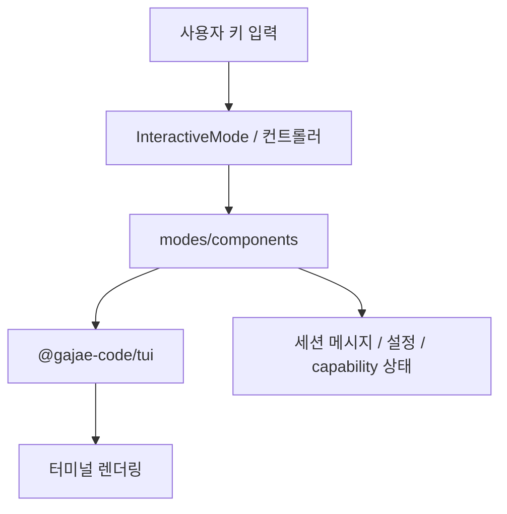
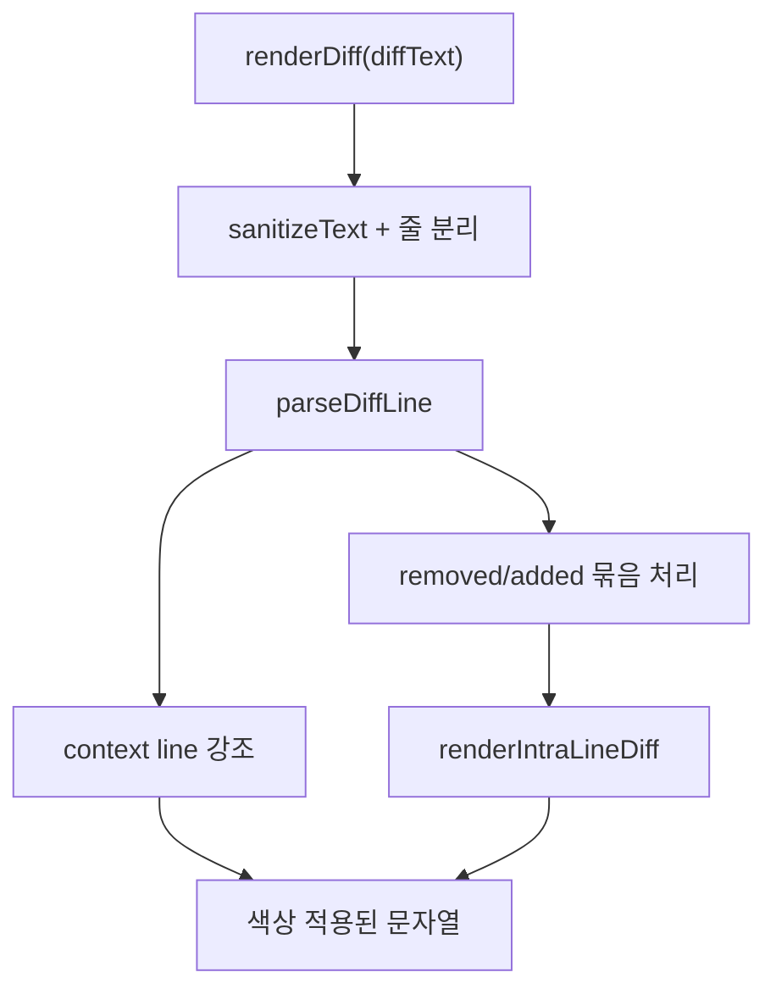

# Coding Agent — Interactive Modes and Terminal UI

## 개요

이 모듈은 `packages/coding-agent/src/modes/components/` 아래의 대화형 터미널 UI 컴포넌트 집합입니다. 사용자가 터미널에서 코딩 에이전트와 상호작용할 때 보게 되는 로더, 입력창, 선택창, 실행 출력, 히스토리 검색, 확장 대시보드, 요약 메시지, diff 렌더링을 담당합니다.

핵심 책임은 세 가지입니다.

1. `@gajae-code/tui`의 `Container`, `Box`, `Text`, `Markdown`, `Input`, `Editor`, `Loader`를 조합해 화면 구성 요소를 만든다.
2. `theme`, `getMarkdownTheme()`, `getEditorTheme()`, `getSymbolTheme()`를 통해 일관된 색상과 스타일을 적용한다.
3. 키 입력을 받아 선택, 취소, 제출, 확장, 검색, 외부 편집기 열기 같은 대화형 상태 전이를 처리한다.



## 공통 렌더링 구조

대부분의 컴포넌트는 `Container`를 상속하거나 `Component` 인터페이스를 구현합니다. `Container` 기반 컴포넌트는 생성자에서 자식 컴포넌트를 추가하고, 상태가 바뀔 때 `clear()`, `removeChild()`, `detachAll()` 등을 사용해 화면을 다시 구성합니다.

반복적으로 등장하는 패턴은 다음과 같습니다.

```ts
this.clear();
this.addChild(new DynamicBorder());
this.addChild(new Spacer(1));
this.addChild(new Text(theme.fg("accent", title), 1, 0));
this.addChild(content);
this.addChild(new DynamicBorder());
```

`DynamicBorder`는 터미널 폭에 맞춰 가로선을 렌더링하는 가장 작은 공통 프레임 컴포넌트입니다. `render(width)`에서 `theme.boxSharp.horizontal.repeat(Math.max(1, width))`를 사용하므로 부모 레이아웃의 실제 폭에 따라 매번 선 길이가 바뀝니다.

훅에서 로드되는 컴포넌트는 `jiti`의 별도 모듈 캐시 때문에 전역 `theme`가 달라질 수 있습니다. 그래서 `BorderedLoader`처럼 훅 UI에서 쓰이는 경우에는 `new DynamicBorder(borderColor)`처럼 명시적인 색상 함수를 전달합니다.

## 입력, 취소, 시간 제한

입력 계열 컴포넌트는 모두 `handleInput(keyData: string)`을 통해 터미널 키 이벤트를 받습니다. 키 매칭은 직접 문자열 비교보다 `matchesKey()`, `matchesAppInterrupt()`, `matchesAppExternalEditor()`, `matchesSelectCancel()` 같은 공통 매처를 우선 사용합니다.

### `CountdownTimer`

`CountdownTimer`는 훅 입력과 선택창에서 자동 취소 타이머를 제공하는 재사용 클래스입니다.

- 생성 시 `timeoutMs`를 기준으로 `#deadlineMs`를 계산합니다.
- `onTick(seconds)`로 남은 초를 전달합니다.
- `onExpire()`로 만료 콜백을 호출합니다.
- 매초 `tui?.requestRender()`를 호출해 타이틀의 남은 시간이 갱신되도록 합니다.
- `reset()`은 기존 interval과 timeout을 정리한 뒤 초기 시간으로 다시 시작합니다.
- `dispose()`는 interval과 timeout을 모두 해제합니다.

`HookInputComponent`는 사용자가 어떤 키든 누르면 `#countdown?.reset()`을 호출합니다. 따라서 자동 취소는 “마지막 상호작용 이후” 기준으로 다시 계산됩니다.

## 로더와 진행 상태

### `BorderedLoader`

`BorderedLoader`는 훅 UI용 취소 가능한 로더입니다. 내부적으로 `CancellableLoader`를 감싸고 위아래에 `DynamicBorder`를 배치합니다.

주요 API는 내부 로더를 그대로 노출합니다.

- `signal`: 취소 처리를 위한 `AbortSignal`
- `onAbort`: 취소 콜백 설정자
- `handleInput(data)`: `Esc` 등 취소 입력 전달
- `dispose()`: 로더 정리

이 컴포넌트는 `examples/hooks/handoff.ts` 같은 훅 실행 경로에서 사용될 수 있으며, 로더 본체는 `@gajae-code/tui`의 `CancellableLoader`가 담당합니다.

### `BtwPanelComponent`

`BtwPanelComponent`는 `/btw` 질의 응답 패널입니다. 상태는 `"running" | "complete" | "aborted" | "error"` 중 하나입니다.

상태 전이 메서드는 명확히 분리되어 있습니다.

- `appendText(delta)`: 스트리밍 응답을 누적합니다.
- `setAnswer(text)`: 전체 답변을 교체합니다.
- `markComplete()`: 완료 상태로 전환합니다.
- `markAborted()`: 취소 상태로 전환합니다.
- `markError(message)`: 오류 상태와 메시지를 설정합니다.
- `close()`: 이후 업데이트를 무시하도록 `#closed`를 설정합니다.

`#rebuild()`는 질문, 답변 영역, footer, border를 다시 구성하고 마지막에 `#tui.requestRender()`를 호출합니다. 오류 상태에서는 `Text`로 오류를 보여주고, 정상 응답은 `Markdown`으로 렌더링합니다. 답변이 아직 없으면 실행 중에는 `Waiting for response…`, 완료 후에는 `No text returned.`를 표시합니다.

## 훅 입력 UI

### `HookInputComponent`

`HookInputComponent`는 단일 줄 입력을 받는 훅용 컴포넌트입니다. 제목은 `Markdown`으로 렌더링되며, `CountdownTimer`가 설정된 경우 제목 뒤에 `(Ns)` 형태의 남은 시간이 붙습니다.

키 처리 규칙은 단순합니다.

- `Enter` / `Return` / `\n`: `onSubmit(inputValue)`
- 앱 interrupt 키: `onCancel()`
- 그 외 입력: 내부 `Input.handleInput(keyData)`

`dispose()`는 타이머를 반드시 정리합니다.

### `HookEditorComponent`

`HookEditorComponent`는 여러 줄 입력을 위한 편집기입니다. 훅 기본 모드와 ask 프롬프트 스타일 모드를 모두 지원합니다.

기본 훅 모드에서는 다음 키 바인딩을 사용합니다.

- `Enter`: 줄바꿈 삽입
- `Ctrl+Enter`: 제출
- `Esc`: 취소
- `Ctrl+G`: 외부 편집기 열기

`promptStyle`이 true이면 ask 프롬프트처럼 동작합니다.

- `Enter`: 제출
- 수정된 Enter 계열 입력: 내부 `Editor`에 위임
- `Esc`: 취소
- `Ctrl+G`: 외부 편집기 열기

외부 편집기는 `#openExternalEditor()`에서 처리합니다. 현재 TUI를 `stop()`한 뒤 `openInEditor(editorCmd, currentText)`를 실행하고, 결과가 있으면 `Editor.setText(result)`로 반영합니다. 마지막에는 항상 `tui.start()`와 `tui.requestRender(true)`를 호출합니다.

### `HookSelectorComponent`

`HookSelectorComponent`는 문자열 옵션 목록을 보여주는 범용 선택 UI입니다. 제공된 코드에서 확인되는 주요 보조 컴포넌트는 다음과 같습니다.

- `OutlinedList`: 옵션 목록을 테두리 안에 렌더링합니다.
- `ScrollableTitle`: 긴 제목을 제한된 행 수 안에서 스크롤 가능하게 렌더링합니다.
- `FocusAwareList`: `wrapFocused`가 켜진 경우 선택된 옵션만 여러 줄로 감싸 보여주고, 주변 옵션은 행 예산 안에서 조정합니다.

옵션 선택 UI는 긴 라벨, 작은 터미널 폭, 마우스 휠 제목 스크롤, 외부 편집기, inline custom input 같은 터미널 환경의 경계 조건을 고려합니다. `CountdownTimer`와도 연결될 수 있어 제한 시간 안에 선택하지 않으면 `onTimeout`을 실행할 수 있습니다.

## 메시지 렌더링

### `CustomMessageComponent`와 `HookMessageComponent`

`CustomMessageComponent`와 `HookMessageComponent`는 모두 `renderFramedMessage()`를 사용해 확장 메시지 또는 훅 메시지를 프레임 안에 렌더링합니다.

공통 구조는 다음과 같습니다.

- 상단에 `Spacer(1)`을 둡니다.
- 기본 렌더링용 `Box`를 `theme.bg("customMessageBg", t)` 배경으로 만듭니다.
- `setExpanded(expanded)`에서 상태가 바뀌면 `#rebuild()`를 호출합니다.
- `invalidate()`도 `#rebuild()`를 다시 호출합니다.
- 커스텀 렌더러가 컴포넌트를 반환하면 그 컴포넌트를 붙이고, 없으면 기본 `Box`를 붙입니다.

차이는 접기 정책입니다.

- `CustomMessageComponent`: 확장 메시지는 전체 내용을 렌더링하며 별도의 line collapse를 지정하지 않습니다.
- `HookMessageComponent`: `HOOK_COLLAPSED_LINES = 5`를 넘는 기본 Markdown 본문은 접힌 상태에서 생략됩니다.

### `BranchSummaryMessageComponent`

`BranchSummaryMessageComponent`는 세션 메시지 타입 `BranchSummaryMessage`를 렌더링합니다. 기본 상태에서는 `[branch]` 라벨과 `Branch summary (ctrl+o to expand)` 안내만 표시합니다. 확장 상태에서는 `**Branch Summary**` 헤더와 `message.summary`를 `Markdown`으로 렌더링합니다.

### `CompactionSummaryMessageComponent`

`CompactionSummaryMessageComponent`는 컨텍스트 압축 요약 메시지를 렌더링합니다.

- `tokensBefore`는 `toLocaleString()`으로 표시합니다.
- 접힌 상태에서는 `Compacted from N tokens (ctrl+o to expand)`를 표시합니다.
- `shortSummary`가 있으면 두 번째 줄에 추가합니다.
- 확장 상태에서는 `**Compacted from N tokens**` 헤더와 전체 `summary`를 Markdown으로 보여줍니다.

이 두 요약 컴포넌트는 훅 메시지와 같은 배경색(`customMessageBg`)을 사용해 시스템성 메시지로 일관되게 보이도록 합니다.

## 실행 출력 렌더링

### `execution-shared.ts`

`execution-shared.ts`는 bash 실행 컴포넌트와 eval 실행 컴포넌트가 공유하는 렌더링 도우미입니다.

`buildExecutionFrame(parent, ui, colorKey)`는 다음 구조를 만듭니다.

1. 위쪽 여백
2. `DynamicBorder`
3. 실행 내용용 `Container`
4. 실행 중 표시할 `Loader`
5. 아래쪽 `DynamicBorder`

반환값은 `{ contentContainer, loader }`입니다. 호출자는 `contentContainer`에 명령 헤더나 REPL 프롬프트를 먼저 붙이고, 실행 중일 때 `loader`를 붙입니다.

`createCollapsedPreview(previewText, previewLines)`는 렌더 시점의 실제 폭을 기준으로 `truncateToVisualLines()`를 호출합니다. 터미널 폭이 바뀌어도 접힌 출력의 줄 수가 다시 계산됩니다.

`buildStatusFooter()`는 실행 종료 후 표시할 footer를 만듭니다. 숨겨진 줄 수, 취소 상태, 비정상 exit code, truncation notice를 한 블록으로 조합합니다. 표시할 내용이 없으면 `undefined`를 반환해 불필요한 빈 `Text`가 생기지 않게 합니다.

`resolveExecutionStatus(exitCode, cancelled)`는 상태 우선순위를 통일합니다.

1. `cancelled`가 true이면 `"cancelled"`
2. exit code가 0이 아니면 `"error"`
3. 그 외에는 `"complete"`

### `EvalExecutionComponent`

`EvalExecutionComponent`는 사용자가 실행한 Python 또는 Node eval 코드를 스트리밍 출력과 함께 보여줍니다.

생성자 인자는 다음 의미를 갖습니다.

- `code`: 실행한 코드
- `ui`: 로더 애니메이션과 렌더 요청에 사용할 TUI
- `excludeFromContext`: true이면 dim 색상을 사용합니다.
- `language`: `"python"` 또는 `"js"`

헤더는 `#formatHeader()`에서 구성합니다. Python은 `python · >>>`, JS는 `node · >>>` 프롬프트를 사용하고, 코드는 `highlightCode()`로 구문 강조합니다. 여러 줄 코드는 첫 줄만 프롬프트를 붙이고 나머지는 `padding(visibleWidth(promptMarker))`로 정렬합니다.

출력 처리는 두 경로가 있습니다.

- `appendOutput(chunk)`: 스트리밍 chunk를 기존 마지막 줄에 이어 붙이거나 새 줄로 추가합니다.
- `setComplete(exitCode, cancelled, options)`: 상태를 계산하고, 필요하면 전체 출력과 truncation metadata를 반영한 뒤 loader를 멈춥니다.

출력 줄은 `MAX_DISPLAY_LINE_CHARS = 4000`으로 제한됩니다. 긴 줄은 앞부분만 보존하고 `… [N chars omitted]`를 붙입니다. 접힌 상태에서는 마지막 `PREVIEW_LINES = 20`줄만 보여주고, 확장 상태에서는 전체 줄을 보여줍니다.

중요한 구현 세부 사항은 `#contentContainer.detachAll()`입니다. `clear()`를 쓰면 실행 중인 loader의 animation timer가 중간에 멈출 수 있으므로, 헤더와 loader 인스턴스를 재사용하기 위해 detach만 수행합니다.

## Diff 렌더링

`diff.ts`는 도구 실행 결과나 코드 변경 미리보기에서 diff 문자열을 터미널 친화적으로 렌더링합니다.

공개 API는 `renderDiff(diffText, options)`입니다. 입력 diff는 먼저 `sanitizeText(diffText)`를 거친 뒤 줄 단위로 처리됩니다. 지원하는 diff line 형식은 두 가지입니다.

- canonical: `+123|content`
- legacy: `+123 content`

`parseDiffLine()`은 prefix, line number, content를 추출합니다. prefix는 `CodeFrameMarker` 타입의 `"+" | "-" | " "`입니다.

렌더링 특징은 다음과 같습니다.

- context line은 `toolDiffContext` 색상으로 표시합니다.
- removed line은 `toolDiffRemoved` 색상으로 표시합니다.
- added line은 `toolDiffAdded` 색상으로 표시합니다.
- 단일 줄 교체는 `renderIntraLineDiff()`로 단어 또는 단일 span 수준의 변경 위치를 inverse 처리합니다.
- 들여쓰기는 `visualizeIndent()`가 탭을 `→`, 공백을 `·`로 바꿔 dim 처리합니다.
- context line 묶음은 `highlightContextLines()`에서 파일 경로 기반 언어를 감지해 batch highlighting합니다.



성능 최적화도 포함되어 있습니다. `renderIntraLineDiffFastPath()`는 짧은 줄에서 공통 prefix/suffix를 계산해 단일 변경 span만 inverse 처리합니다. 공백만 바뀐 경우나 단어 경계가 맞지 않는 경우에는 `Diff.diffWords()` 경로로 내려갑니다.

## 히스토리 검색

`HistorySearchComponent`는 `Ctrl+R` 검색 UI입니다. 내부에는 검색 입력 `Input`과 결과 목록 `HistoryResultsList`가 있습니다.

초기화 시 현재 프로젝트 디렉터리는 `getProjectDir()`로 구하고, 검색이 비어 있으면 `historyStorage.getRecent(limit, cwd)`, 검색어가 있으면 `historyStorage.search(query, limit, cwd)`를 사용합니다.

키 처리 흐름은 다음과 같습니다.

- `Up`: 선택 인덱스 감소
- `Down`: 선택 인덱스 증가
- `Enter`: 선택된 `HistoryEntry.prompt`를 `onSelect(prompt)`로 전달
- interrupt 키: `onCancel()`
- 그 외: 검색 입력에 전달 후 결과 갱신

`HistoryResultsList.render(width)`는 선택 항목에 커서와 bold 스타일을 적용하고, 결과가 많으면 `(current/total)` 스크롤 표시를 붙입니다. 프롬프트는 공백을 정규화한 뒤 `truncateToWidth()`로 폭에 맞춥니다.

## 사용자 정의 Provider 설정 마법사

`CustomProviderWizardComponent`는 OpenAI 호환 또는 Anthropic 호환 커스텀 provider를 추가하는 단계형 UI입니다.

단계 타입은 `WizardStep`으로 정의됩니다.

- `"compatibility"`
- `"provider-id"`
- `"base-url"`
- `"credential-source"`
- `"credential"`
- `"models"`
- `"confirm"`
- `"force-confirm"`

입력 상태는 `WizardState`에 누적됩니다. 마지막 제출 결과는 `ProviderSetupInput` 형태의 `CustomProviderWizardSubmit`입니다.

`handleInput()`의 핵심 규칙은 다음과 같습니다.

- interrupt 키:
  - 첫 단계에서는 `onCancel()`
  - 그 외 단계에서는 `#goBack()`
- 입력 단계에서 Enter:
  - `#saveInputAndProceed()`
- 선택 단계에서 Up/Down:
  - `#moveSelection(delta)`
- 선택 단계에서 Enter:
  - `#selectCurrentOption()`

`setSubmitError(error)`는 제출 오류를 UI에 반영합니다. 오류 문자열에 `"already exists"`가 포함되면 `"force-confirm"` 단계로 이동하고, 기본 선택을 “Go back” 쪽에 둡니다. 사용자가 replace를 선택하면 `#buildInput(true)`가 호출되어 `force: true`가 포함됩니다.

`models` 입력은 쉼표로 나눈 뒤 trim하고 빈 문자열을 제거합니다. literal API key를 선택하면 `apiKey`에 값이 들어가고, 환경 변수 방식을 선택하면 `apiKeyEnv`에 값이 들어갑니다.

## Extension Control Center

Extension Control Center는 `components/extensions/` 아래에 분리되어 있습니다. 사용자가 설치된 extension, skill, tool, MCP, hook, prompt, context file 등을 provider별로 탐색하고 비활성화할 수 있는 터미널 대시보드입니다.

### 데이터 모델

`types.ts`는 dashboard가 사용하는 정규화된 타입을 정의합니다.

핵심 타입은 `Extension`입니다. 서로 다른 capability 타입을 다음 공통 필드로 맞춥니다.

- `id`
- `kind`
- `name`
- `displayName`
- `description`
- `trigger`
- `path`
- `source`
- `state`
- `disabledReason`
- `shadowedBy`
- `raw`

`makeExtensionId(kind, name)`은 `${kind}:${name}` 형식의 ID를 만듭니다. `parseExtensionId(id)`는 첫 번째 `:`를 기준으로 kind와 name을 되돌립니다. hook처럼 name 안에 `:`가 들어갈 수 있는 케이스를 고려해 첫 번째 colon만 사용합니다.

`sourceFromMeta(meta)`는 capability의 `SourceMeta`를 dashboard용 `source` shape로 변환합니다.

### 상태 생성과 갱신

`state-manager.ts`는 capability 로딩, 필터링, provider 탭 구성, 비활성화 상태 반영을 담당합니다.

`loadAllExtensions(cwd, disabledIds)`는 여러 capability를 순차적으로 로드합니다.

- `loadCapability<Skill>("skills", loadOpts)`
- `loadCapability<Rule>("rules", loadOpts)`
- `loadCapability<CustomTool>("tools", loadOpts)`
- `loadCapability<ExtensionModule>("extension-modules", loadOpts)`
- `loadCapability<MCPServer>("mcps", loadOpts)`
- `loadCapability<Prompt>("prompts", loadOpts)`
- `loadCapability<SlashCommand>("slash-commands", loadOpts)`
- `loadCapability<Hook>("hooks", loadOpts)`
- `loadCapability<ContextFile>("context-files", loadOpts)`

각 로딩 블록은 실패해도 전체 dashboard가 깨지지 않도록 `logger.warn()`만 남기고 계속 진행합니다.

상태 결정 우선순위는 다음과 같습니다.

1. `disabledIds`에 있으면 `"disabled"`와 `"item-disabled"`
2. `_shadowed`이면 `"shadowed"`와 `"shadowed"`
3. provider가 꺼져 있으면 `"disabled"`와 `"provider-disabled"`
4. 그 외에는 `"active"`

`createInitialState()`는 전체 extension 목록을 로드하고 `buildProviderTabs()`로 탭을 만든 뒤 `"all"` 탭 기준 상태를 반환합니다.

`refreshState(state, cwd, disabledIds)`는 provider toggle이나 item toggle 이후 capability를 다시 로드하고, 현재 provider 탭과 검색어를 다시 적용합니다. 가능한 경우 이전 `selected.id`를 기준으로 선택 항목을 보존합니다.

`applyDisabledExtensionsToState(state, disabledIds)`는 전체 reload 전에 UI를 즉시 갱신하기 위한 optimistic update입니다. item-disabled 상태를 먼저 반영하고, 해제된 항목은 provider disabled 또는 shadowed 상태를 다시 계산합니다.

### `ExtensionDashboard`

`ExtensionDashboard`는 전체 대시보드 컨테이너입니다. `static async create(cwd, settings, terminalHeight)`로 생성하며, 내부 `#init()`에서 설정과 capability 상태를 읽습니다.

레이아웃은 세 영역입니다.

1. 상단 border, 제목, provider tab bar
2. `TwoColumnBody`: 왼쪽 `ExtensionList`, 오른쪽 `InspectorPanel`
3. 도움말과 하단 border

`#renderTabBar()`는 `ProviderTab` 목록을 렌더링합니다. `"all"`은 항상 첫 탭이며, provider 탭은 enabled 여부와 count에 따라 active, disabled, empty 스타일이 달라집니다.

키 처리 규칙은 다음과 같습니다.

- `Ctrl+C`: 즉시 닫기
- interrupt 키:
  - 검색어가 있으면 검색어만 지움
  - 검색어가 없으면 닫기
- `Tab`: 다음 provider 탭
- `Shift+Tab`: 이전 provider 탭
- 그 외 입력: `ExtensionList.handleInput(data)`로 전달

provider toggle은 `toggleProvider(providerId)`를 호출한 뒤 `#refreshFromState()`로 전체 상태를 다시 읽습니다. item toggle은 `Settings`의 `disabledExtensions` 배열을 수정하고, `#applyDisabledExtensions()`로 즉시 반영한 뒤 refresh를 실행합니다.

### `ExtensionList`

`ExtensionList`는 왼쪽 inventory 목록입니다. 실제 렌더링 항목은 `ListItem`으로 평탄화됩니다.

- provider별 탭에서는 첫 줄에 `"master"` switch를 추가합니다.
- 검색 중이면 kind grouping 없이 extension만 보여줍니다.
- `"all"` 탭에서는 kind별 header와 extension row를 보여줍니다.

검색은 `applyFilter()`를 사용합니다. 검색 대상은 이름, displayName, description, trigger, providerName, kind를 합친 문자열입니다. 검색어는 공백 기준 token으로 나뉘며 모든 token이 포함되어야 매칭됩니다.

키 처리 규칙은 다음과 같습니다.

- `Up` 또는 `k`: 위로 이동
- `Down` 또는 `j`: 아래로 이동
- `Space`: master switch 또는 extension toggle
- `Enter`: Space와 동일
- `Backspace`: 검색어 한 글자 삭제
- printable ASCII: 검색어에 추가
- `j`, `k`는 이동 키로 예약되어 검색어에 들어가지 않습니다.

master provider가 꺼져 있으면 extension row는 dim 처리되고 개별 toggle이 막힙니다.

### `InspectorPanel`

`InspectorPanel`은 오른쪽 상세 패널입니다. 선택된 extension이 없으면 “Select an extension” 안내만 보여줍니다.

선택 항목이 있으면 다음 정보를 표시합니다.

- 이름
- kind badge
- description
- origin provider와 level
- source path
- status badge
- kind별 preview

kind별 preview 메서드는 다음과 같습니다.

- `#renderFilePreview()`: context file 내용을 최대 20줄 표시
- `#renderToolArgs()`: tool parameter와 required/default 정보를 표시
- `#renderSkillContent()`: skill instruction을 최대 15줄 표시
- `#renderMcpDetails()`: transport, command, args, env var 개수 표시
- `#renderDefaultPreview()`: trigger가 있으면 표시

경로는 `shortenPath(ext.path, os.homedir())`를 거치며, 너무 긴 경로는 마지막 세 segment만 보여줍니다.

## 터미널 폭과 안전한 출력

이 모듈은 터미널 UI 특성상 문자열 폭 처리를 반복적으로 수행합니다. 단순한 `string.length` 대신 다음 유틸리티를 사용합니다.

- `visibleWidth()`: ANSI escape가 포함된 문자열의 표시 폭 계산
- `truncateToWidth()`: 표시 폭 기준 truncation
- `padding()`: 표시 폭 기준 공백 채움
- `wrapTextWithAnsi()`: ANSI 스타일을 보존한 줄바꿈
- `replaceTabs()`: 탭을 안전한 공백으로 변환
- `sanitizeText()`: 제어 문자 등 출력 위험 요소 정리

이 패턴은 특히 `ExtensionList`, `InspectorPanel`, `HistoryResultsList`, `EvalExecutionComponent`, `renderDiff()`에서 중요합니다. 터미널 폭이 작거나 ANSI 색상이 섞인 상태에서도 커서, badge, gutter, preview가 깨지지 않도록 하기 위해서입니다.

## 코드베이스 연결 지점

이 컴포넌트들은 직접 실행 로직을 소유하지 않습니다. 대신 세션, 설정, capability discovery, tool output, controller 계층에서 전달한 데이터를 화면에 맞게 렌더링합니다.

주요 연결은 다음과 같습니다.

- `InteractiveMode`는 OAuth 수동 입력, 메시지 렌더링, 실행 출력 같은 대화형 흐름에서 이 컴포넌트들을 사용합니다.
- `modes/controllers/*` 테스트들은 `BtwPanelComponent`, hotkey markdown, selector behavior 등 사용자 입력 경로를 검증합니다.
- `Settings`는 `ExtensionDashboard`에서 `disabledExtensions`를 읽고 씁니다.
- `loadCapability()`와 provider enable/disable 함수들은 Extension Control Center의 inventory와 toggle 상태를 만듭니다.
- `renderFramedMessage()`는 hook/custom message의 공통 프레임 렌더링을 담당합니다.
- `highlightCode()`, `getMarkdownTheme()`, `getEditorTheme()`는 테마 모듈과 연결되어 코드, Markdown, editor 표시를 통일합니다.
- `formatTruncationMetaNotice()`는 실행 출력이 잘렸을 때 footer에 표시할 경고 문구를 만듭니다.

## 기여 시 주의할 점

새 컴포넌트를 추가하거나 기존 컴포넌트를 수정할 때는 다음 원칙을 지키는 것이 좋습니다.

- 상태 변경 후에는 필요한 범위만 다시 구성합니다. 실행 중 loader처럼 타이머가 있는 컴포넌트는 `clear()`로 dispose하지 말고 `detachAll()` 같은 방식을 고려해야 합니다.
- 렌더링 문자열은 항상 터미널 폭과 ANSI escape를 고려합니다. `truncateToWidth()`, `visibleWidth()`, `padding()`을 사용합니다.
- 사용자 입력은 직접 escape sequence를 파싱하기보다 `matchesKey()`와 앱 keybinding matcher를 우선 사용합니다.
- 훅 또는 확장 렌더러 경로에서 쓰이는 컴포넌트는 전역 `theme` 의존이 안전한지 확인합니다. 필요하면 `DynamicBorder`에 명시적인 색상 함수를 전달합니다.
- 긴 출력은 전체를 무조건 렌더링하지 말고 접힌 preview와 확장 상태를 분리합니다.
- capability 로딩처럼 외부 provider에 의존하는 경로는 한 capability 실패가 전체 dashboard 실패로 번지지 않게 처리합니다.
- `packages/coding-agent/` 안에서는 TUI를 깨뜨릴 수 있는 `console.log`, `console.warn`, `console.error` 대신 중앙 logger를 사용해야 합니다.