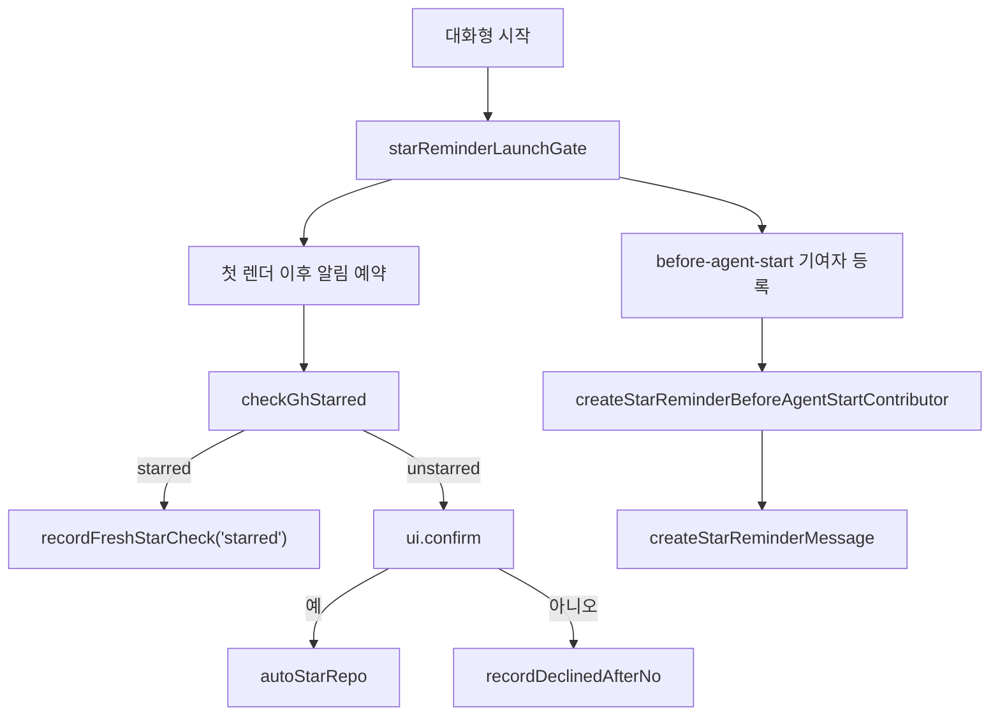

# Coding Agent — Miscellaneous Source and Assets

## GitHub Star Reminder

이 모듈은 대화형 GJC 실행 시 GitHub 저장소 `Yeachan-Heo/gajae-code`에 별을 눌렀는지 확인하고, 아직 별을 누르지 않은 사용자에게 한 번만 부드럽게 요청하는 기능을 담당합니다.

핵심 원칙은 “실패해도 사용자 흐름을 방해하지 않는다”입니다. `gh` CLI가 없거나, 인증되지 않았거나, 네트워크가 끊겼거나, GitHub API 호출이 404 외의 이유로 실패하면 기능은 완전히 조용히 종료됩니다.



## 저장 상태

상태는 사용자 전역 설정 루트 아래의 `star-reminder.json`에 저장됩니다.

```ts
export interface StarReminderState {
	declined: boolean;
	starred: boolean;
	starredCheckedAt: string;
}
```

각 필드의 의미는 다음과 같습니다.

- `declined`: 사용자가 실행 시작 프롬프트에서 “아니오”를 선택했는지 여부입니다.
- `starred`: 마지막으로 확인된 별 상태입니다.
- `starredCheckedAt`: `starred` 값을 확인한 ISO-8601 시각입니다. 한 번도 확인하지 않았다면 빈 문자열입니다.

기본값은 `defaultStarReminderState()`가 반환합니다.

```ts
{ declined: false, starred: false, starredCheckedAt: "" }
```

`getStarReminderStatePath()`는 상태 파일 경로를 `getConfigRootDir()` 아래의 `star-reminder.json`으로 결정합니다. 테스트나 특수 실행에서는 `StarReminderDeps.statePath`로 경로를 주입할 수 있습니다.

## 상태 읽기와 쓰기

`readStarReminderStateUnlocked()`는 잠금 없이 상태를 읽습니다. 파일이 없거나 JSON이 깨졌거나 스키마가 맞지 않으면 예외를 던지지 않고 기본 상태를 반환합니다. 이 모듈은 UI 시작 경로에서 동작하므로, 상태 파일 문제로 실행을 막지 않는 설계를 유지합니다.

상태 갱신은 `updateStarReminderStateLocked()`를 통해 이루어집니다. 이 함수는 다음 순서로 동작합니다.

1. 상태 파일의 부모 디렉터리를 만든다.
2. `withFileLock(statePath, ...)`로 파일 단위 잠금을 잡는다.
3. 잠금 안에서 상태를 다시 읽는다.
4. 호출자가 넘긴 `mutator`로 다음 상태를 만든다.
5. `writeStateAtomic()`으로 임시 파일에 쓴 뒤 `rename`한다.

중요한 점은 `mutator`가 잠금 안에서 새로 읽은 상태를 기준으로 판단해야 한다는 것입니다. 잠금 이전에 읽은 상태를 기준으로 병합하면 여러 GJC 프로세스가 동시에 실행될 때 오래된 “거절함” 또는 “별 없음” 상태가 더 최신의 “별 누름” 상태를 덮어쓸 수 있습니다.

## 별 상태 캐시

`isStarredCacheFresh()`는 저장된 `starred: true` 값이 아직 유효한지 확인합니다. 캐시 TTL은 `STARRED_CACHE_TTL_MS`이며 24시간입니다.

```ts
export const STARRED_CACHE_TTL_MS = 24 * 60 * 60 * 1000;
```

캐시가 신선하면 `refreshStarStateForSession()`은 `gh`를 호출하지 않고 `"starred"`를 반환합니다. 반대로 `unstarred`나 `declined` 상태는 다시 확인될 수 있습니다.

## 단조 병합 규칙

이 모듈의 상태 갱신 함수들은 “확인된 별 누름” 상태를 보존하는 방향으로 설계되어 있습니다.

### `recordStarredFromPut()`

`autoStarRepo()`의 `PUT` 요청이 성공했을 때 호출됩니다. 성공한 `PUT`은 권위 있는 결과로 간주하므로 항상 다음 상태를 기록합니다.

```ts
{ declined: false, starred: true, starredCheckedAt: checkedAt }
```

### `recordFreshStarCheck()`

`checkGhStarred()`로 새로 확인한 결과를 기록합니다.

- `"starred"`: `declined`를 지우고 `starred: true`를 기록합니다.
- `"unstarred"`: 기본적으로 `starred: false`를 기록하지만, 현재 저장된 `starred: true`가 아직 TTL 안에 있거나 이번 확인보다 더 나중에 기록된 값이면 그대로 둡니다.

이 규칙은 동시 실행 중 한 프로세스가 오래된 “별 없음” 관측값을 갖고 있다가, 다른 프로세스가 방금 기록한 “별 누름” 상태를 덮어쓰는 문제를 막습니다.

### `recordDeclinedAfterNo()`

사용자가 시작 프롬프트에서 거절했을 때 호출됩니다. 현재 상태가 이미 `starred: true`이면 아무것도 바꾸지 않습니다. 그렇지 않으면 `declined: true`를 기록합니다.

## GitHub CLI 연동

GitHub 상태 확인은 `gh` CLI만 사용합니다. 기본 실행 함수는 `runGhDefault()`입니다.

```ts
export type RunGh = (args: string[], options?: { timeoutMs?: number }) => Promise<GhResult>;
```

`runGhDefault()`는 `Bun.which("gh")`로 CLI 위치를 찾고, `Bun.spawn()`으로 명령을 실행합니다. 기본 타임아웃은 5초입니다.

`checkGhStarred()`는 다음 명령을 실행합니다.

```text
gh api user/starred/Yeachan-Heo/gajae-code
```

결과 분류는 보수적입니다.

- 종료 코드 `0`: `"starred"`
- stderr에 명확한 HTTP 404 패턴이 있음: `"unstarred"`
- 타임아웃, 인증 실패, 네트워크 실패, `gh` 없음, 기타 오류: `"unavailable"`

404만 “별을 누르지 않음”으로 인정하는 이유는 다른 실패 상황에서 사용자에게 잘못된 알림을 띄우지 않기 위해서입니다.

`autoStarRepo()`는 다음 명령을 실행합니다.

```text
gh api -X PUT user/starred/Yeachan-Heo/gajae-code
```

종료 코드가 `0`이고 타임아웃이 아니면 성공으로 간주합니다.

## 세션 시작 시 상태 갱신

`refreshStarStateForSession()`은 현재 세션에서 사용할 별 상태를 결정합니다.

1. 상태 파일을 읽는다.
2. `starred: true` 캐시가 신선하면 `"starred"`를 반환한다.
3. 캐시가 없거나 만료되었으면 `checkGhStarred()`를 호출한다.
4. 결과가 `"starred"` 또는 `"unstarred"`이면 `recordFreshStarCheck()`로 기록한다.
5. `"unavailable"`은 기록하지 않고 그대로 반환한다.

이 함수는 시작 프롬프트뿐 아니라 거절 이후 메시지 주입 경로에서도 사용됩니다.

## 실행 시작 프롬프트

`maybeShowLaunchStarReminder()`는 시작 시 사용자에게 GitHub star 요청을 보여줄지 결정하고 실행합니다. 호출자는 이미 `startup.quiet`, `starReminder.enabled`, 실제 대화형 실행 여부를 확인한 상태여야 합니다.

흐름은 다음과 같습니다.

1. 상태를 읽는다.
2. `declined: true`이면 시작 프롬프트를 띄우지 않는다.
3. 신선한 `starred: true` 캐시가 있으면 띄우지 않는다.
4. `checkGhStarred()`로 현재 상태를 확인한다.
5. `"starred"`이면 상태를 기록하고 종료한다.
6. `"unavailable"`이면 조용히 종료한다.
7. `"unstarred"`이면 먼저 `recordFreshStarCheck("unstarred")`를 기록한다.
8. `ui.isIdle()`이 있고 유휴 상태가 아니면 종료한다.
9. `ui.confirm()`으로 사용자에게 묻는다.
10. 사용자가 수락하면 `autoStarRepo()`를 호출하고, 성공 시 `recordStarredFromPut()`을 기록한다.
11. 사용자가 거절하면 `recordDeclinedAfterNo()`를 기록한다.

모든 예외는 내부에서 삼켜집니다. 이 함수는 실행 시작 경로를 깨면 안 됩니다.

`StarReminderPromptUI`는 UI 의존성을 추상화합니다.

```ts
export interface StarReminderPromptUI {
	confirm(title: string, message: string): Promise<boolean>;
	isIdle?: () => boolean;
}
```

## 첫 렌더 이후 예약

`scheduleLaunchStarReminderAfterFirstRender()`는 `setTimeout(..., 0)`으로 `maybeShowLaunchStarReminder()`를 예약합니다. 네트워크가 필요한 `gh` 확인이 첫 화면 렌더링을 막지 않도록 하는 역할입니다.

```ts
export function scheduleLaunchStarReminderAfterFirstRender(
	ui: StarReminderPromptUI,
	deps?: StarReminderDeps,
): void
```

## 대화형 모드 게이트

`starReminderLaunchGate()`는 대화형 모드에서 어떤 wiring을 등록할지 결정하는 순수 함수입니다.

```ts
export function starReminderLaunchGate(
	input: StarReminderLaunchGateInput,
): StarReminderLaunchGate
```

반환값은 두 가지입니다.

- `register`: before-agent-start 메시지 기여자를 등록할지 여부입니다. `enabled`가 true면 등록합니다.
- `schedule`: 시작 프롬프트를 예약할지 여부입니다. `enabled`가 true이고 `quiet`가 false일 때만 true입니다.

`interactive-mode.ts`의 `init` 흐름은 이 결정을 사용해 `createStarReminderBeforeAgentStartContributor()`와 `scheduleLaunchStarReminderAfterFirstRender()`를 연결합니다.

## 거절 이후 메시지 주입

사용자가 시작 프롬프트를 거절하면 이후 같은 기능은 시작 프롬프트 대신 숨겨진 커스텀 메시지를 통해 동작합니다.

`createStarReminderBeforeAgentStartContributor()`는 before-agent-start 단계에서 호출되는 contributor를 만듭니다.

```ts
export function createStarReminderBeforeAgentStartContributor(
	session: StarReminderSessionRef,
	deps?: StarReminderDeps,
): InternalBeforeAgentStartContributor
```

이 contributor는 다음 조건을 모두 만족할 때만 메시지를 반환합니다.

- 저장 상태가 `declined: true`이다.
- 안정적인 논리 세션 ID가 있다.
- 같은 세션 ID에 대해 아직 주입한 적이 없다.
- `refreshStarStateForSession()` 결과가 `"unstarred"`이다.

세션 ID가 없으면 주입하지 않습니다. 한 세션에서 한 번만 주입하기 위해 내부 `Set<string>`인 `injectedSessionIds`를 사용합니다. `gh`가 unavailable이어도 해당 세션은 처리 완료로 표시합니다. 이렇게 해야 같은 세션의 매 프롬프트마다 `gh` 확인이 반복되어 지연이 생기는 일을 막을 수 있습니다.

`createStarReminderMessage()`가 만드는 메시지는 `display: false`인 커스텀 메시지입니다.

```ts
export function createStarReminderMessage(): StarReminderCustomMessage
```

메시지의 `customType`은 `STAR_REMINDER_CUSTOM_TYPE`인 `"star-reminder"`이며, `attribution`은 `"agent"`입니다. 실제 사용자에게 바로 보이는 메시지가 아니라 모델 컨텍스트에 들어가는 설득 지시입니다.

## 의존성 주입과 테스트성

`StarReminderDeps`는 시간, 파일 경로, `gh` 실행, sleep을 주입할 수 있게 합니다.

```ts
export interface StarReminderDeps {
	statePath?: string;
	now?: () => Date;
	runGh?: RunGh;
	sleep?: (ms: number) => Promise<void>;
}
```

주요 테스트는 이 주입 지점을 사용해 파일 시스템 상태, 시간 흐름, `gh` 응답을 제어합니다. 이 모듈의 공개 함수들은 `star-reminder.test.ts`, `interactive-star-reminder.test.ts`, `session-star-reminder.test.ts`에서 직접 검증됩니다.

## 코드베이스 연결점

이 모듈은 `packages/coding-agent/src/modes/interactive-mode.ts`에서 대화형 실행 흐름에 연결됩니다.

- `starReminderLaunchGate()`로 기능 등록과 시작 프롬프트 예약 여부를 결정합니다.
- `scheduleLaunchStarReminderAfterFirstRender()`로 첫 렌더 이후 시작 프롬프트를 예약합니다.
- `createStarReminderBeforeAgentStartContributor()`로 거절 이후 세션당 한 번의 숨겨진 메시지 주입을 등록합니다.

파일 잠금은 `../config/file-lock`의 `withFileLock()`에 의존합니다. 상태 파일 경로는 `@gajae-code/utils`의 `getConfigRootDir()`를 사용합니다. 메시지 타입은 세션 메시지 계층의 `CustomMessage`와 AI 패키지의 `ImageContent`, `MessageAttribution` 타입에 맞춰져 있습니다.

## 변경 시 주의사항

이 모듈을 수정할 때는 다음 불변 조건을 유지해야 합니다.

- `gh`가 없거나 실패하면 사용자에게 아무것도 보여주지 않아야 합니다.
- 시작 경로에서 예외가 밖으로 새면 안 됩니다.
- `starred: true`의 최신 확인값이 오래된 `unstarred`나 `declined` 기록으로 덮이면 안 됩니다.
- 상태 갱신은 `updateStarReminderStateLocked()` 안에서 새로 읽은 상태를 기준으로 판단해야 합니다.
- `checkGhStarred()`는 명확한 HTTP 404만 `"unstarred"`로 분류해야 합니다.
- before-agent-start 주입은 안정적인 세션 ID가 있을 때만, 세션당 한 번만 일어나야 합니다.
- `display: false` 커스텀 메시지는 사용자 표시용 메시지가 아니라 모델 컨텍스트용 지시라는 전제를 유지해야 합니다.