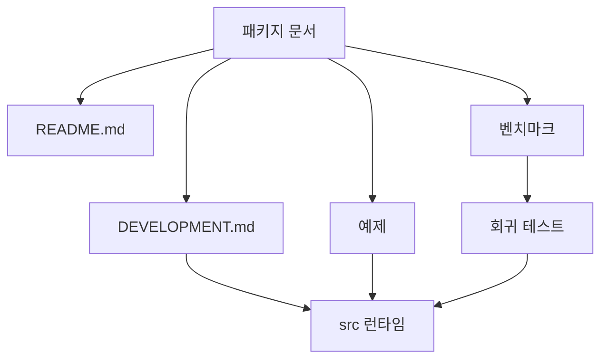

# Coding Agent — Package Docs, Build, Benchmarks, and Examples

# 패키지 문서, 빌드, 벤치마크, 예제

이 영역은 `packages/coding-agent` 패키지를 개발자가 이해하고 검증할 수 있게 만드는 주변 모듈입니다. 런타임 자체는 `src/` 아래에 있지만, 이 모듈은 다음 역할을 담당합니다.

- `README.md`: 패키지의 공개 진입점과 설정 안내
- `DEVELOPMENT.md`: `src/` 아키텍처, 확장 지점, 개발 절차 설명
- `bench/*.ts`: 성능, 메모리, 컨텍스트 최적화, 렌더링 회귀 측정
- `scripts/build-binary.ts`: `gjc` 실행 바이너리 빌드 경로
- `examples/*`: SDK, 훅, 확장 기능 사용 예시



## 문서 구조

`packages/coding-agent/README.md`는 패키지 수준의 얇은 안내 문서입니다. 설치, CLI 전체 참조, 모델 설정 같은 사용자 문서는 루트 `README.md`로 위임하고, 패키지 내부 개발자가 바로 봐야 할 파일만 연결합니다.

주요 연결 대상은 다음과 같습니다.

- `CHANGELOG.md`
- `DEVELOPMENT.md`
- `../../docs/render-mermaid.md`
- 루트 `../../README.md`
- GitHub README

`README.md`에서 직접 설명하는 패키지 고유 기능은 메모리 백엔드와 TUI 테마입니다. 메모리 설정은 `memory.backend` 값으로 분기하며, 현재 문서화된 값은 `off`, `local`, `hindsight`입니다. `hindsight` 백엔드는 `HINDSIGHT_API_URL`, `HINDSIGHT_API_TOKEN`, `HINDSIGHT_BANK_ID`, `HINDSIGHT_AUTO_RECALL` 같은 환경 변수 오버라이드를 지원합니다.

`DEVELOPMENT.md`는 실제 구현 구조를 설명하는 개발자용 문서입니다. `src/cli.ts`의 `runCli`, `src/main.ts`의 `runRootCommand`, `src/sdk.ts`의 `createAgentSession`, 모드 진입점인 `InteractiveMode`, `runPrintMode`, `runRpcMode`를 중심으로 실행 흐름을 정리합니다. 새 개발자는 이 파일을 통해 CLI 라우팅, 세션 생명주기, 도구 등록, MCP/LSP 경계, 웹 검색, 태스크 위임 구조를 빠르게 파악할 수 있습니다.

## 빌드와 개발 명령

패키지 개발 명령은 `packages/coding-agent/package.json`의 스크립트 이름을 기준으로 실행합니다. 문서에서 사용하는 대표 명령은 다음과 같습니다.

```bash
bun --cwd=packages/coding-agent run check
bun --cwd=packages/coding-agent run test
bun --cwd=packages/coding-agent run format-prompts
bun --cwd=packages/coding-agent run generate-docs-index
bun --cwd=packages/coding-agent run generate-template
bun --cwd=packages/coding-agent run build
```

빌드 경로는 `scripts/build-binary.ts`가 담당합니다. 워커 엔트리포인트를 추가할 때는 런타임 코드의 워커 생성 패턴과 함께 이 빌드 스크립트의 추가 컴파일 엔트리도 갱신해야 합니다. 그렇지 않으면 개발 환경에서는 동작하지만 컴파일된 `dist/gjc`에서는 워커 파일이 누락될 수 있습니다.

## 벤치마크 모듈

`bench/` 디렉터리는 단순 성능 측정 스크립트가 아니라, 실제 코드 경로를 사용하는 회귀 방지 장치입니다. 많은 벤치마크 함수가 테스트에서 직접 import되어 검증됩니다.

### 컨텍스트 최적화 벤치마크

`bench/context-optimization.bench.ts`는 컨텍스트 최적화 작업의 효과를 측정합니다. 외부 모델, 네트워크, provider 호출 없이 결정적 fixture와 실제 구현 함수를 사용합니다.

핵심 함수는 다음과 같습니다.

- `buildMixedEditingSession(options?)`
- `measurePruningGain(entries)`
- `measureCacheEpochDiscipline(entries, thresholdTokens)`
- `measureRollupCompression(childCount)`
- `measureIngestDigest(batchSize)`
- `measurePerf()`
- `runContextOptimizationBenchmark()`

`buildMixedEditingSession`은 `pushCallAndResult`를 반복 호출해 현실적인 편집 세션을 만듭니다. 이 세션에는 `read`, `search`, `edit`, `bash` 도구 호출과 결과가 섞여 있으며, 오래된 `read` 결과가 편집으로 무효화되는 상황을 재현합니다.

`measurePruningGain`은 `pruneToolOutputs`를 두 설정으로 실행합니다. 고전 설정은 `staleOverridableTools: []`로 보호된 `read` 결과를 계속 보존하고, 현재 설정은 `DEFAULT_PRUNE_CONFIG`를 사용해 오래된 결과를 회수합니다. 반환값인 `PruningGainReport`에는 `additionalTokensSaved`, `relativeGain`, `staleReadsPruned`가 포함됩니다.

`measureCacheEpochDiscipline`은 예전의 매 턴 pruning 정책과 현재 threshold 기반 pruning 정책을 비교합니다. 이 함수는 `perTurnRewrites`, `thresholdRewrites`, `recacheTokensSaved`를 계산해 프롬프트 캐시 prefix를 불필요하게 깨는 비용을 드러냅니다.

`measureRollupCompression`은 `buildPhaseRollupReceipt`와 `validateReceipt`를 사용해 여러 `TaskResultReceipt`를 phase-rollup receipt로 압축했을 때의 크기 비율과 유효성을 검증합니다.

`measureIngestDigest`는 `ingestReceipts`를 통해 정상 completion receipt와 변조된 receipt 묶음을 처리합니다. 이 경로는 digest 크기 제한(`RECEIPT_DIGEST_MAX_CHARS`)과 fail-closed 동작을 함께 확인합니다.

### 성능 코퍼스 스키마

`bench/perf-corpus-schema.ts`는 성능 증거를 구조화하는 타입과 검증기를 제공합니다.

핵심 타입은 다음과 같습니다.

- `EvidenceClass`
- `HotspotStatus`
- `FixtureClass`
- `PerfCorpusFixtureResult`
- `HotspotClassification`
- `PerfCorpusReport`

이 모듈의 중요한 정책은 wall-clock, process CPU, profiler self-time 증거를 섞지 않는 것입니다. `validateHotspotClassification`은 `CPU-self-time confirmed` 상태가 반드시 `evidenceClass: "profiler-self-time"`와 artifact reference를 갖도록 강제합니다. `validatePerfCorpusReport`는 더 나아가 classification의 `artifactRefs`가 실제 fixture의 profiler artifact path 또는 sample symbol에 연결되는지 확인합니다.

`hasProfilerSelfTimeEvidence`는 profiler가 `"none"`이면 artifact나 sample이 있어도 self-time 증거로 인정하지 않습니다. 이 규칙은 wall-clock proxy 데이터가 CPU self-time 확증으로 승격되는 것을 막는 핵심 가드입니다.

`V1_V3_RECLASSIFICATION`은 기존 hotspot 지도를 새 증거 체계로 재분류한 상수입니다. 여기에는 `covered-current`, `needs-trace-coverage`, `not-visible` 같은 상태가 사용되지만, 실제 profiler artifact가 없기 때문에 `CPU-self-time confirmed`는 포함되지 않습니다.

### 성능 코퍼스 실행기

`bench/perf-corpus.bench.ts`는 `PerfCorpusReport`를 생성합니다. 기본 실행은 profiler를 붙이지 않으므로 `profilerSelfTime.profiler`는 `"none"`입니다.

주요 함수는 다음과 같습니다.

- `measurePhase(work, advisoryOnly)`
- `measureRss(work)`
- `buildFixture(...)`
- `runPerfCorpusBenchmark()`

fixture workload는 세 가지입니다.

- `startupWorkload`: 세션 로드와 인덱싱에 가까운 작업
- `streamingWorkload`: 작은 chunk가 반복적으로 누적되는 TTFT 계열 작업
- `largeTranscriptWorkload`: 큰 transcript 배열을 만들고 스캔하는 작업

`runPerfCorpusBenchmark`는 fixture를 생성하고 `V1_V3_RECLASSIFICATION`, `APPLIED_PERF_THRESHOLDS`를 포함한 report를 만든 뒤 `validatePerfCorpusReport`로 자체 검증합니다. 이 함수는 `coding-agent/test/perf-corpus.test.ts`에서 호출되어 schema와 증거 정책 회귀를 막습니다.

### 임계값 ledger

`bench/perf-threshold.ledger.ts`는 성능 threshold를 코드화한 ledger입니다. `APPLIED_PERF_THRESHOLDS`는 현재 적용된 threshold이고, `HELD_PERF_THRESHOLDS`는 아직 보류 중인 후보입니다.

`validatePerfThresholdLedger`는 enforced threshold가 다음 증거를 모두 갖는지 확인합니다.

- `varianceCharacterized: true`
- `benchmarkEvidence.status === "passed"`
- `humanApprovalEvidence.approved === true`

현재 적용된 threshold는 advisory 중심입니다. wall-clock과 RSS 값은 GC, 스케줄러, CI 머신 차이에 민감하므로 기본 CI를 실패시키는 hard gate로 즉시 승격하지 않습니다.

### 렌더링 벤치마크

`bench/render-transcript.ts`는 TUI transcript 렌더링 비용을 측정합니다. `AssistantMessageComponent`와 `ToolExecutionComponent`를 실제로 생성하고 `render(WIDTH)`를 반복 호출합니다.

주요 흐름은 다음과 같습니다.

- `buildTranscript()`가 assistant 메시지와 tool 결과를 번갈아 생성합니다.
- `renderTranscript(components)`가 각 component를 갱신하고 렌더링 line 수를 누적합니다.
- `percentile(values, pct)`가 p50, p95 값을 계산합니다.

결과는 `coding-agent-render-transcript` 이름의 JSON으로 출력되며, `OUT` 인자가 있으면 파일로 저장하고 없으면 stdout으로 출력합니다.

`bench/rendering.ts`는 더 작은 렌더링 smoke benchmark입니다. `truncateToVisualLines`와 `WelcomeComponent.render`를 반복 실행해 기본 렌더링 비용을 확인합니다.

### 세션 비교와 secret obfuscator 벤치마크

`bench/session-equality-obfuscator.ts`는 메시지 동등성 비교와 `SecretObfuscator`의 비용을 측정합니다. 이 파일은 `normalizeMessage`, `oldDidMessagesChange`, `newDidMessagesChange` 패턴을 통해 JSON 문자열화 기반 비교와 `Bun.hash.xxHash64` 기반 캐시 비교를 대조합니다.

`SecretObfuscator` 경로는 1MiB payload 안에서 여러 secret을 스캔하고 치환하는 heavy workload로 구성됩니다. 이 벤치마크는 session equality 최적화와 secret obfuscation 비용을 같은 출력 구조 안에서 비교할 수 있게 합니다.

## 테스트와의 연결

벤치마크 파일 중 일부는 실행 스크립트인 동시에 테스트 fixture 공급원입니다.

대표적인 incoming call은 다음과 같습니다.

- `test/bench/context-optimization-effectiveness.test.ts`
  - `buildMixedEditingSession`
  - `measurePruningGain`
  - `measureCacheEpochDiscipline`
  - `measureRollupCompression`
  - `measureIngestDigest`
  - `runContextOptimizationBenchmark`
- `coding-agent/test/perf-corpus.test.ts`
  - `runPerfCorpusBenchmark`
  - `validatePerfCorpusReport`
  - `validateHotspotClassification`
  - `validatePerfThresholdLedger`
  - `hasProfilerSelfTimeEvidence`
  - `isHotspotStatus`
- `coding-agent/test/resident-materialization.test.ts`
  - `measureSessionMemory`

따라서 `bench/` 아래 코드는 임의로 출력 형식이나 타입을 바꾸면 안 됩니다. 특히 exported 함수와 report interface는 테스트와 문서, 성능 정책을 잇는 계약입니다.

## 예제 코드의 역할

`examples/` 디렉터리는 SDK, hook, extension 사용법을 실제 코드 패턴으로 보여줍니다. call graph 기준으로 이 영역은 런타임 API와 직접 연결됩니다.

예시 연결은 다음과 같습니다.

- `examples/sdk/11-sessions.ts`
  - `SessionManager.list`
  - `SessionManager.open`
  - `SessionManager.inMemory`
- `examples/sdk/06-extensions.ts`
  - `SessionManager.inMemory`
- `examples/sdk/09-api-keys-and-oauth.ts`
  - `create` from `ai/src/auth-storage.ts`
- `examples/hooks/dirty-repo-guard.ts`
  - 내부 함수 `checkDirtyRepo`
- `examples/hooks/git-checkpoint.ts`
  - hook API의 `exec`
- `examples/hooks/handoff.ts`
  - hook API의 `registerCommand`
- `examples/hooks/file-trigger.ts`
  - hook API의 `sendMessage`
- `examples/extensions/reload-runtime.ts`
  - `registerTool`
  - `sendUserMessage`
- `examples/extensions/tools.ts`
  - TUI `render`, `invalidate`
  - settings component `handleInput`

이 예제들은 문서보다 더 강한 성격의 사용 계약입니다. 새로운 SDK API나 hook API를 바꾸는 경우, 타입 체크뿐 아니라 예제 코드가 여전히 실제 사용 흐름을 보여주는지 확인해야 합니다.

## 변경 시 주의할 경계

문서와 벤치마크는 런타임 코드의 주변부처럼 보이지만, 다음 경계는 실제 제품 품질에 직접 영향을 줍니다.

`DEVELOPMENT.md`를 수정할 때는 `src/`의 실제 파일명과 함수명을 기준으로 확인해야 합니다. 예를 들어 CLI 진입은 `runCli`, 루트 실행은 `runRootCommand`, 세션 생성은 `createAgentSession`, RPC 서버는 `runRpcMode`입니다. 존재하지 않는 명령이나 추상 API를 문서에 추가하면 개발자가 잘못된 확장 경로를 따르게 됩니다.

`bench/context-optimization.bench.ts`를 수정할 때는 deterministic fixture 성격을 보존해야 합니다. `mulberry32` 기반 fixture, 네트워크 없는 실행, 실제 shipped code path 사용이라는 조건이 이 벤치마크의 신뢰도를 만듭니다.

`perf-corpus-schema.ts`와 `perf-threshold.ledger.ts`는 성능 주장에 대한 증거 정책입니다. `CPU-self-time confirmed`를 쉽게 만들거나 advisory threshold를 근거 없이 enforced로 바꾸면 성능 문서가 과장된 결론을 내게 됩니다.

렌더링 벤치마크는 TUI component의 실제 `render` 경로를 사용합니다. 단순 문자열 처리 벤치마크로 바꾸면 `AssistantMessageComponent`, `ToolExecutionComponent`, `WelcomeComponent`의 실제 비용을 놓치게 됩니다.

## 전체 개발 흐름에서의 위치

이 모듈은 `packages/coding-agent/src/`를 직접 실행하는 핵심 런타임은 아니지만, 개발자가 변경을 안전하게 판단하는 데 필요한 네 가지 표면을 제공합니다.

1. 문서: `README.md`, `DEVELOPMENT.md`가 구조와 개발 명령을 설명합니다.
2. 빌드: `scripts/build-binary.ts`와 package scripts가 컴파일된 `gjc` 산출물을 만듭니다.
3. 벤치마크: `bench/*.ts`가 성능, 메모리, 컨텍스트 최적화, 렌더링 비용을 측정합니다.
4. 예제: `examples/*`가 SDK, hook, extension API의 실제 호출 패턴을 보존합니다.

기여자는 기능 구현 후 `bun --cwd=packages/coding-agent run check`와 `bun --cwd=packages/coding-agent run test`를 우선 실행하고, 변경 영역에 따라 관련 벤치마크를 추가로 실행해야 합니다. 컨텍스트 최적화나 성능 정책을 건드렸다면 `runContextOptimizationBenchmark`, `runPerfCorpusBenchmark`, `validatePerfThresholdLedger` 경로가 여전히 같은 의미의 증거를 내는지 확인하는 것이 핵심입니다.