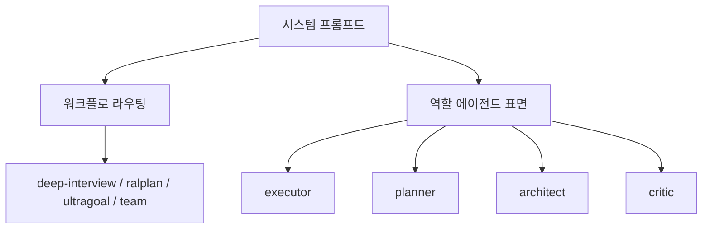

# Coding Agent — Prompt Library and Role Instructions

## 모듈 개요

`packages/coding-agent/src/prompts`는 GJC 실행 중 모델에 주입되는 정적 프롬프트와 역할 지침을 관리하는 프롬프트 라이브러리입니다. 핵심 역할은 세 가지입니다.

- `agents/*.md`: `executor`, `planner`, `architect`, `critic`, `explore` 같은 역할 에이전트 지침
- `system/*.md`: 기본 시스템 프롬프트, 플랜 모드, 서브에이전트 실행, 커스텀 시스템 구성
- `tools/*.md`, `goals/*.md`, `memories/*.md`: 도구 사용법, 목표 모드, 메모리 처리 프롬프트

이 모듈은 TypeScript 함수보다 Markdown 기반 지침 파일이 중심입니다. 실제 런타임은 이 파일들을 읽어 역할, 도구 허용 범위, 출력 계약, 검증 규칙을 구성합니다.

## 전체 구조



`system/system-prompt.md`가 가장 상위 계약입니다. 여기서 GJC의 정체성, 공개 워크플로 표면, 역할 에이전트 표면, 라우팅 규칙, 검증 계약이 정의됩니다. 역할별 상세 동작은 `agents/*.md`가 담당합니다.

## 역할 에이전트 프롬프트

### `executor.md`

`executor`는 제한된 구현, 수정, 리팩터링을 수행하는 쓰기 가능 역할입니다.

주요 책임:

- 관련 파일과 테스트를 먼저 읽고 최소 변경을 구현합니다.
- 부모 에이전트가 명시적으로 검증을 맡긴 경우 집중 검증을 수행합니다.
- 변경 파일, 중요한 결정, 수행한 검증 또는 부모에게 남긴 검증 권장을 보고합니다.
- `.gjc/plans/`는 명시적으로 요구되지 않는 한 수정하지 않습니다.

`executor`는 일반 구현 역할이지만, `ultragoal_red_team_mode` 블록이 별도로 있습니다. 이 모드는 assignment가 “Ultragoal completion QA/red-team” 또는 `executorQa` 증거를 명시할 때만 활성화됩니다. 활성화되면 단순 코드 검사가 아니라 실제 사용자 표면을 실행해 증거를 남겨야 합니다.

예를 들어 CLI 표면은 argv-only replay JSON을 요구하고, GUI 또는 웹 표면은 자동화 기록과 비균일 스크린샷 같은 구조적 증거를 요구합니다.

### `planner.md`

`planner`는 읽기 전용 계획 역할입니다. 실행하지 않고 범위, 단계, 수락 기준, 위험, 검증, 핸드오프 모양을 정리합니다.

중요한 제약:

- 제품 소스, 일반 파일, 임시 파일을 쓰지 않습니다.
- 예외적으로 `gjc ralplan --write`와 `gjc state`만 제한된 `bash`로 사용할 수 있습니다.
- 계획은 반드시 `gjc ralplan --write --stage planner ...`로 저장합니다.
- `--artifact`에는 파일 경로가 아니라 전체 마크다운 본문을 inline으로 전달해야 합니다.

출력 계약은 전체 계획을 직접 반환하지 않는다는 점이 중요합니다. `planner`는 저장 영수증인 `run_id`, `path`, `sha256`, `stage`, `stage_n`과 10줄 이하의 요약만 호출자에게 돌려줍니다.

### `architect.md`

`architect`는 읽기 전용 아키텍처 및 코드 리뷰 역할입니다. 설계 경계, 인터페이스, 장기 유지보수성, 보안, 성능, 정확성을 검토합니다.

핵심 산출물:

- `Architectural Status`: `CLEAR`, `WATCH`, `BLOCK`
- `Code Review Recommendation`: `APPROVE`, `COMMENT`, `REQUEST CHANGES`
- 심각도: `CRITICAL`, `HIGH`, `MEDIUM`, `LOW`

`architect`는 `root_cause_fallback_policy`를 포함합니다. 오류를 숨기는 fallback, 넓은 호환성 shim, 침묵하는 기본값, 진단 downgrade는 실제 결함을 가리는 경우 blocker로 취급합니다.

`planner`와 마찬가지로 전체 리뷰 본문은 `gjc ralplan --write --stage architect ...`로 저장하고, 호출자에게는 저장 영수증과 축약 verdict만 반환합니다.

### `critic.md`

`critic`은 실행 계획이 실제로 수행 가능한지 검토하는 읽기 전용 역할입니다.

검토 기준:

- 명확성
- 검증 가능성
- 완전성
- 큰 그림 적합성
- 원칙과 선택지의 일관성
- 대안의 깊이
- 위험과 검증의 엄밀성

판정은 `OKAY`, `ITERATE`, `REJECT` 중 하나입니다. YAML-only 계획은 사람이 읽을 수 있는 계획이 필요한 경우 invalid plan format으로 거절합니다.

`critic`도 `gjc ralplan --write --stage critic ...`를 통해 평가 본문을 저장하고, 호출자에게는 저장 영수증과 축약 판정만 반환합니다.

### `explore.md`

`explore`는 빠른 읽기 전용 코드베이스 정찰 역할입니다. 구조화된 결과 스키마를 갖고 있으며, 다른 에이전트가 재탐색 없이 사용할 수 있는 압축 문맥을 반환합니다.

출력 필드:

- `summary`: 조사 결과 요약
- `files`: 관련 파일과 코드 참조
- `architecture`: 구성 요소 연결 방식

`explore`는 search/find/read 중심으로 동작하며, 검색 결과가 비어 있으면 다른 패턴이나 더 넓은 경로로 최소 한 번 더 시도해야 합니다.

### `reviewer.md`

`reviewer`는 숨겨진 코드 리뷰 전문 역할입니다. `git diff` 또는 PR diff를 기준으로 패치가 도입한 실제 버그만 보고합니다.

중요한 특징:

- `report_finding`으로 이슈를 보고합니다.
- 최종 verdict는 `overall_correctness`, `explanation`, `confidence`를 포함합니다.
- finding은 반드시 diff와 겹치는 10줄 이하 범위에 anchor되어야 합니다.
- 새 타입, enum variant, IPC payload, command 같은 경계 통과 값은 소비 측 dispatch point까지 추적해야 합니다.

`reviewer`는 스타일이나 일반 개선 제안을 보고하는 역할이 아닙니다. “작성자가 merge 전에 고치고 싶을 버그”만 보고합니다.

### `task.md`

`task`는 일반 위임 작업용 워커 프롬프트입니다. 전체 도구 접근을 허용하지만, 할당된 작업에만 집중하고 최소한의 유용한 결과를 반환하도록 설계되어 있습니다.

특징:

- 필요한 경우 파일 수정과 명령 실행이 가능합니다.
- 명시 요청이 없으면 문서 파일을 만들지 않습니다.
- 좁은 검색 후 필요한 범위만 읽는 방식을 선호합니다.
- 최종 응답은 파일 시스템에 쓴 내용을 반복하지 않습니다.

## Frontmatter 템플릿

`agents/frontmatter.md`는 역할 에이전트 정의의 공통 frontmatter를 생성하는 템플릿입니다.

지원 필드:

- `name`
- `description`
- `spawns`
- `model`
- `thinking-level`
- `blocking`
- `hide`
- `autoloadSkills`
- `forkContext`
- `bashAllowedPrefixes`

역할 파일들은 이 frontmatter를 통해 런타임 메타데이터를 선언합니다. 예를 들어 `architect.md`와 `critic.md`는 `bashAllowedPrefixes`로 `gjc ralplan --write`, `gjc state`만 허용합니다.

## 시스템 프롬프트 계층

### `system/system-prompt.md`

GJC의 기본 정체성과 실행 규칙을 정의합니다.

핵심 내용:

- GJC는 `deep-interview`, `ralplan`, `ultragoal`, `team` 네 가지 기본 workflow skill만 공개합니다.
- 역할 에이전트는 `executor`, `planner`, `architect`, `critic` 네 가지를 기본 표면으로 설명합니다.
- 명확하고 낮은 위험의 구현 요청은 직접 실행합니다.
- 모호한 요구사항은 `deep-interview`, 계획 합의가 필요한 작업은 `ralplan`, 장기 목표 관리는 `ultragoal`, 병렬 실행은 `team`으로 라우팅합니다.
- 검증되지 않은 완료 보고, 가짜 fallback, 스텁 구현, 테스트 억제는 금지합니다.

### `system/custom-system-prompt.md`

사용자 커스텀 프롬프트, 프로젝트 context file, git snapshot, skills, rules를 합성하는 템플릿입니다.

주요 패턴:

- `systemPromptCustomization`, `customPrompt`, `appendPrompt`를 순서대로 삽입합니다.
- `contextFiles`가 있으면 `<project><context>`에 파일 내용을 포함합니다.
- git 저장소이면 현재 브랜치, main 브랜치, status, commit history snapshot을 포함합니다.
- skills와 rules가 있으면 읽어야 할 로컬 지침으로 노출합니다.

### `system/subagent-system-prompt.md`

서브에이전트 실행 환경을 구성합니다. `[ROLE]`, `[CONTEXT]`, `[COOP]`, `[COMPLETION]` 블록으로 역할, 협업 범위, 완료 방식을 분리합니다.

특히 서브에이전트는 일반 텍스트로 끝내지 않고 반드시 `yield`를 호출해야 합니다. `outputSchema`가 있으면 해당 TypeScript 인터페이스에 맞는 `result.data`를 반환해야 합니다.

### Plan mode 프롬프트

Plan mode 관련 파일은 읽기 전용 계획 수립과 승인 후 실행을 나눕니다.

- `plan-mode-active.md`: 읽기 전용 계획 작성 상태
- `plan-mode-approved.md`: 승인된 계획 실행 상태
- `plan-mode-compact-instructions.md`: 승인 전 대화 압축 지침
- `plan-mode-reference.md`: 기존 계획 참조
- `plan-mode-subagent.md`: 계획 모드에서 서브에이전트에게 읽기 전용 조사만 허용
- `plan-mode-tool-decision-reminder.md`: 계획 모드가 필수 도구 호출 없이 끝났을 때의 복구 지침

이 계층은 “계획”과 “구현”을 강하게 분리합니다. 구현은 `resolve`로 승인된 뒤에만 진행됩니다.

## 도구 프롬프트

`tools/*.md`는 각 도구의 사용 계약을 설명합니다. 런타임은 이 문서를 도구 설명으로 주입해 모델이 안전한 호출 형태를 선택하게 합니다.

대표 예:

- `bash.md`: 전용 read/search/find/edit/write 도구를 우선하고, shell은 터미널 작업에만 사용하도록 제한합니다.
- `apply-patch.md`: `*** Begin Patch` / `*** Update File` 형식의 패치 언어를 설명합니다.
- `ast-grep.md`, `ast-edit.md`: AST 패턴과 metavariable 규칙을 설명합니다.
- `browser.md`: Chromium tab을 열고 `observe`, `act`, `run`으로 상호작용하는 규칙을 설명합니다.
- `ask.md`: 사용자가 반드시 선택해야 하는 tradeoff가 있을 때만 질문하도록 제한합니다.
- `goal.md`: 활성 목표의 `create`, `get`, `resume`, `complete`, `drop` 조작을 정의합니다.

도구 프롬프트는 단순 도움말이 아니라 모델 행동을 제한하는 계약입니다. 예를 들어 `bash.md`는 `cat`, `grep`, `find`, `head`, `tail` 같은 coreutils 사용을 피하고 전용 도구를 쓰라고 명시합니다.

## 목표와 메모리 프롬프트

### 목표 모드

`goals/goal-mode-active.md`와 `goals/goal-continuation.md`는 장기 목표 실행 중 완료 판정을 엄격히 만듭니다.

완료 전에 요구되는 감사 절차:

1. 목표를 구체적 deliverable로 다시 적습니다.
2. 각 deliverable을 증명할 evidence source에 매핑합니다.
3. 현재 저장소 상태를 다시 검사합니다.
4. 검증 범위를 claim 범위에 맞춥니다.
5. 불확실하면 완료하지 않고 계속 작업합니다.

`goal({op:"complete"})`는 모든 deliverable이 현재 상태에서 직접 증명될 때만 호출할 수 있습니다.

### 메모리 처리

`memories/*.md`는 로컬 private runtime state 기반 메모리 처리에 사용됩니다.

- `stage_one_system.md`: rollout history에서 durable memory를 JSON으로 추출합니다.
- `stage_one_input.md`: 추출 대상 response item을 제공합니다.
- `consolidation.md`: raw memory와 rollout summary를 장기 `memory_md`, `memory_summary`, reusable skill로 통합합니다.
- `read-path.md`: 메모리를 휴리스틱으로만 사용하고 현재 repo 상태를 우선하도록 지시합니다.
- `unavailable.md`: 메모리 payload가 없을 때 저장되었다고 주장하지 않도록 제한합니다.

## 실행 흐름과 연결 지점

이 모듈은 직접 실행 flow가 거의 없는 정적 프롬프트 모듈입니다. 제공된 call graph에서도 이 모듈 자체에 감지된 execution flow는 없습니다. 대신 프롬프트 파일들은 설정, 모델 선택, 제목 생성, 커밋 메시지 생성, 역할 정보 테스트에서 간접적으로 검증됩니다.

관련 테스트 연결:

- `role-info.test.ts`는 `getRoleInfo`를 통해 역할 정보가 기대한 형태로 노출되는지 확인합니다.
- `role-info.test.ts`는 `isolated` 설정 헬퍼를 사용해 설정 환경을 분리합니다.
- `role-thinking-helper-propagation.test.ts`는 `createSettings`, `getModelOrThrow`를 통해 역할별 thinking/model 설정 전파를 확인합니다.
- 같은 테스트에서 `generateSessionTitle`, `generateCommitMessage`가 역할 thinking helper와 함께 정상 동작하는지 검증합니다.

즉, 이 모듈의 주요 품질 기준은 “함수가 실행된다”보다 “정적 프롬프트 계약이 런타임 설정과 역할 정보에 정확히 반영된다”입니다.

## 기여 시 주의사항

역할 프롬프트를 수정할 때는 공개 workflow surface와 역할 agent surface를 혼동하지 않아야 합니다. `deep-interview`, `ralplan`, `ultragoal`, `team`은 workflow skill이고, `executor`, `planner`, `architect`, `critic`은 역할 에이전트입니다.

변경 시 확인할 점:

- 새 기본 workflow skill을 추가하지 않습니다.
- 제품 표면에서는 `gjc`와 `.gjc` 용어를 사용합니다.
- `planner`, `architect`, `critic`의 읽기 전용 계약을 약화하지 않습니다.
- `gjc ralplan --write`는 artifact 파일 경로가 아니라 inline markdown을 받는다는 규칙을 유지합니다.
- 역할 출력 계약을 바꾸면 관련 테스트와 런타임 파서도 함께 확인해야 합니다.
- prompt body에 동적으로 조립해야 할 내용이 있으면 TypeScript inline 문자열보다 정적 `.md` 파일과 템플릿 패턴을 우선합니다.

## 변경 후 검증

프롬프트 또는 역할 정의를 바꾼 경우 다음 축의 검증이 중요합니다.

- 역할 정보 노출: `getRoleInfo` 기반 테스트
- 모델 및 thinking-level 전파: `getModelOrThrow`, `createSettings` 관련 테스트
- 기본 GJC 정의 표면: default GJC definitions 테스트
- workflow/default surface gate: visible definitions, rebrand inventory, G002 gates

워크플로 정의나 기본 표면이 바뀌는 변경이라면 저장소 규칙상 다음 검증이 요구됩니다.

```bash
bun scripts/check-visible-definitions.ts
bun scripts/verify-g002-gates.ts
bun scripts/rebrand-inventory.ts --strict
bun test packages/coding-agent/test/default-gjc-definitions.test.ts
```

프롬프트 문구만 바꾸는 작은 변경이라도 역할 출력 계약, 읽기 전용 경계, `.gjc` 경로, `gjc` 명령 이름을 건드렸다면 관련 테스트를 함께 확인해야 합니다.