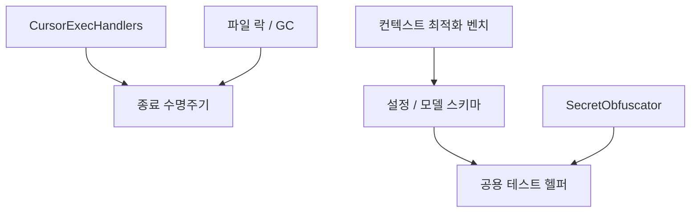

# Coding Agent — Remaining Tests and Fixtures

## 개요

이 모듈은 `packages/coding-agent/test/` 아래에 남아 있는 회귀 테스트와 공용 테스트 픽스처를 묶은 영역입니다. 단일 런타임 기능을 테스트한다기보다, 여러 하위 시스템의 “다시 깨지면 안 되는 계약”을 고정합니다.

주요 대상은 다음과 같습니다.

- 컨텍스트 최적화 벤치마크의 효과성 불변식
- Cursor 네이티브 실행 핸들러의 호출 안정성
- 파일 락과 GC의 TOCTOU 방어
- LSP, Cursor, 확장 훅의 종료/정리 수명주기
- Git subprocess 실행 옵션
- 모델 설정 스키마와 기본 모델 fallback
- secret obfuscation의 정규식, 치환, 캐시 동작
- ACP, AgentSession, SQLite, HOME 격리용 테스트 헬퍼

## 테스트 영역 구조



이 다이어그램은 실제 런타임 실행 흐름이 아니라 테스트 관심사의 묶음을 보여줍니다. 이 모듈에는 별도의 감지된 실행 플로우가 없고, 각 테스트가 대상 함수나 클래스를 직접 호출해 계약을 검증합니다.

## 컨텍스트 최적화 효과성 테스트

`test/bench/context-optimization-effectiveness.test.ts`는 `bench/context-optimization.bench.ts`의 측정 함수들을 deterministic fixture 위에서 실행합니다.

사용하는 주요 함수는 다음과 같습니다.

- `buildMixedEditingSession()`
- `measurePruningGain(session)`
- `measureCacheEpochDiscipline(session, threshold)`
- `measureRollupCompression(fanOut)`
- `measureIngestDigest(batchSize)`
- `runContextOptimizationBenchmark()`

이 테스트는 성능 수치를 “정확히 같은 값”으로 고정하지 않고, 최적화 방향과 최소 효과를 고정합니다.

예를 들어 `measurePruningGain()`은 classic selection보다 staleness-aware pruning이 더 많은 토큰을 회수해야 하며, mixed editing fixture에서는 최소 2배 이상의 절감 효과를 요구합니다. `measureRollupCompression(8)`은 hash-sealed rollup이 유효하고, 8개 child receipt를 inline으로 보관하는 경우보다 byte ratio가 0.5 이하가 되어야 합니다.

`runContextOptimizationBenchmark()`는 전체 리포트를 end-to-end로 실행하며 pruning, cache epoch, rollup, ingest digest, perf 항목이 모두 채워지는지 검증합니다. `ingestBatchMsPerOp`와 `rollupBuildMsPerOp`는 각각 50ms 미만이어야 합니다.

## 기본 축소값과 fork context cap

`test/config/default-reductions.test.ts`는 PR10 기본값 축소가 설정과 실제 계산 함수에 반영되어 있는지 확인합니다.

검증 대상은 두 가지입니다.

- `SETTINGS_SCHEMA["task.maxConcurrency"].default`
- `resolveForkContextMaxTokens(percentage, model)`

`MODEL_WITH_200K_WINDOW` fixture는 `contextWindow: 200_000`인 `Model` 객체입니다. `resolveForkContextMaxTokens(0, MODEL_WITH_200K_WINDOW)`는 15% 규칙에 따라 `30_000`을 반환해야 하고, 모델이 없으면 unknown-window fallback인 `15_000`을 반환해야 합니다.

이 테스트는 설정 문서나 ledger만 업데이트되고 실제 런타임 기본값이 어긋나는 회귀를 잡는 역할을 합니다.

## CursorExecHandlers 회귀 테스트

`test/cursor-exec-handlers.test.ts`는 `CursorExecHandlers`가 Cursor provider에서 안전하게 호출되는지 검증합니다.

### detached invocation

Cursor provider는 handler 메서드를 다음처럼 인스턴스에서 분리해 호출할 수 있습니다.

```ts
const read = handlers.read;
await read(args);
```

이 경우 `this`가 사라지므로, 생성자에서 메서드가 바인딩되어 있지 않으면 `#optionsForCall` 같은 private field 접근이 실패합니다. 테스트는 `read`, `ls`, `grep`, `shell`, `write`, `diagnostics`를 구조 분해한 뒤 직접 호출해 모두 `toolResult`를 반환하고 `isError`가 false인지 확인합니다.

`makeTool(name)`은 `AgentTool` 형태의 간단한 mock tool을 만들고, `makeHandlers()`는 `read`, `search`, `bash`, `write`, `lsp` tool map으로 `CursorExecHandlers`를 구성합니다.

### grep empty pattern guard

`grep()`은 빈 패턴과 glob-only 요청을 구분해야 합니다.

- `pattern: ""`, `glob` 없음: `search`를 호출하지 않고 actionable error를 반환합니다.
- 공백뿐인 pattern: `search`를 호출하지 않고 error를 반환합니다.
- `pattern: ""`, `glob: "**/*.ts"`: native Glob 요청으로 보고 `find`로 라우팅합니다.
- non-empty pattern: 기존 `search` 경로를 유지합니다.
- non-empty pattern + glob: `paths`를 `"/tmp/*.ts"`처럼 조합해 `search`에 전달합니다.

`makeRecordingHandlers(searchCalls, findCalls)`는 호출된 인자를 배열에 기록해 라우팅이 실제로 어디로 갔는지 검증합니다.

### shell timeout 변환

Cursor wire protocol의 timeout은 millisecond 단위이고, 내부 `bash` tool은 second 단위를 사용합니다. `shell()`은 다음 규칙을 지켜야 합니다.

- `timeout: 30000` → `{ timeout: 30 }`
- timeout unset 또는 `0` → timeout 필드 생략
- `timeout: 500` → `{ timeout: 1 }`

이 테스트는 긴 timeout이 실수로 `30000s`로 전달되는 회귀를 방지합니다.

## 파일 락과 GC TOCTOU 테스트

`test/file-lock-gc-toctou.test.ts`는 파일 락 소유권이 바뀌는 경합 상황에서 안전하게 실패하는지 확인합니다.

주요 대상은 다음과 같습니다.

- `withFileLock()`
- `removeFileLockDirForGc()`
- `fileLocksGcAdapter.prune()`

보조 fixture는 다음 역할을 합니다.

- `makeTemp()`: 테스트별 임시 디렉터리 생성
- `writeInfo(lockDir, info)`: lock dir의 `info` 파일에 `{ pid, timestamp }` 기록
- `ctxWith(spoolDir, probe)`: `GcContext` 구성
- `deadLockRecord(lockDir)`: 죽은 PID가 소유한 `GcRecord` 구성

`withFileLock()` 테스트는 `staleMs`를 매우 작게 설정해도 살아 있는 holder와 waiter가 겹치지 않아야 함을 검증합니다. holder가 락을 잡고 있는 동안 waiter는 진입하지 못하고, holder가 나간 뒤에만 `waiter-enter`가 기록됩니다.

`removeFileLockDirForGc()` 테스트는 owner token guard를 검증합니다. 디스크의 `{ pid, timestamp }`가 GC가 관찰한 token과 정확히 일치할 때만 lock dir을 제거합니다. PID가 다르거나 timestamp만 달라도 `owner_changed`를 반환하고, `info` 파일이 없으면 fresh acquirer가 `mkdir` 중일 수 있으므로 `missing`으로 실패합니다.

`fileLocksGcAdapter.prune()`은 probe와 unlink 사이의 TOCTOU 창을 시뮬레이션합니다. probe가 dead를 반환하는 순간 `info`를 live owner로 바꾸면, prune은 삭제하지 않고 `file_lock_owner_changed_before_delete`로 skip해야 합니다.

## 종료 수명주기와 listener 정리

`test/g007-teardown-redteam.test.ts`는 teardown 관련 red-team 테스트입니다.

`waitForProjectLoaded(client, signal)`은 `AbortSignal` listener를 추가한 뒤, 성공/실패/abort 모든 경로에서 listener를 제거해야 합니다. `trackedSignal()`은 실제 `AbortSignal`의 `{ once: true }` 동작을 흉내 내며 `added`, `removed`, `active` 카운터를 제공합니다.

검증 경로는 다음과 같습니다.

- `projectLoaded`가 먼저 resolve되면 listener 제거
- abort가 먼저 발생하면 reject하면서 listener 제거
- 이미 aborted인 signal은 listener를 추가하지 않음
- signal이 없으면 listener churn 없이 resolve
- 같은 signal에 반복 호출해도 listener 누수 없음
- `projectLoaded`가 reject되어도 listener 제거

같은 파일의 `disposeCursorConversation()` 테스트는 알 수 없는 conversation id에 대해 여러 번 호출해도 throw하지 않는 idempotent dispose 계약을 고정합니다.

## Git subprocess 설정 테스트

`test/git-process-config.test.ts`는 `src/utils/git`의 subprocess 실행 인자를 검증합니다.

`createSpawnMock(calls)`는 `Bun.spawn`을 mock으로 대체하고, 두 가지 overload 형태를 모두 기록합니다. `createFakeProcess()`는 stdout/stderr stream과 resolved exit code를 가진 `Subprocess` fixture를 반환하며, 내부에서 `createTextStream()`을 사용합니다.

검증 대상은 다음과 같습니다.

- `git.status.summary("/work/pi")`
- `git.stage.files("/work/pi", ["tracked.txt"])`

read-only 명령인 `status`는 다음 옵션을 포함해야 합니다.

```text
git -c core.fsmonitor=false -c core.untrackedCache=false --no-optional-locks status --porcelain
```

mutating 명령인 `add`도 `core.fsmonitor=false`, `core.untrackedCache=false`를 포함해야 합니다. 이 테스트는 macOS나 대형 repo에서 fsmonitor/untracked cache가 subprocess 안정성에 영향을 주는 회귀를 막습니다.

## 모델 설정과 기본 모델 fallback

`test/models-config-tool-choice-support.test.ts`는 `ModelsConfigSchema`가 provider와 model의 `compat.toolChoiceSupport`를 받아들이는지 확인합니다.

허용되는 값 중 테스트에 등장하는 값은 다음과 같습니다.

- `"auto"`
- `"named"`

`"forced"`는 reject되어야 합니다. 또한 `schemas/models.schema.json`을 import해 생성된 JSON schema에 `"toolChoiceSupport"`와 `"named"`가 포함되어 있는지도 확인합니다.

`test/repro-issue-1022-disabled-default-model.test.ts`는 path-scoped `enabledModels`와 `disabledProviders`가 default-model fallback에도 적용되는지 검증합니다.

테스트는 임시 `agentDir/config.yml`에 다음 형태의 설정을 씁니다.

```yaml
enabledModels:
  - path: <privatePath>
    models:
      - openai-codex
disabledProviders:
  - path: <privatePath>
    providers:
      - github-copilot
modelRoles:
  default: github-copilot/gpt-5.5
```

그 뒤 `Settings.init({ cwd, agentDir })`로 path-scoped 값을 확인하고, `AuthStorage`에는 anthropic credential만 저장합니다. `createAgentSession()`은 allow-list 밖의 anthropic 모델이나 disabled provider인 github-copilot을 선택하면 안 됩니다. allow-list 안의 OpenAI code provider credential도 없으므로 기대 결과는 `session.model === undefined`와 `modelFallbackMessage` 존재입니다.

## 확장 훅 shutdown 회귀 테스트

`test/repro-issue-1020-ctx-shutdown.test.ts`는 interactive mode에서 `ctx.shutdown()`이 no-op이 되던 회귀를 고정합니다.

대상 클래스는 `ExtensionUiController`입니다. 테스트는 fake `extensionRunner.initialize()`가 받은 `contextActions`를 캡처한 뒤, `contextActions.shutdown()`을 직접 호출합니다. 기대 결과는 `InteractiveModeContext.shutdownRequested`가 `true`로 바뀌는 것입니다.

두 경로를 모두 검증합니다.

- `initializeHookRunner(uiContext, false)`
- `initHooksAndCustomTools()`

즉, 낮은 수준의 hook runner 초기화와 실제 custom tool 초기화 경로 모두에서 shutdown wiring이 살아 있어야 합니다.

## SecretObfuscator 테스트

`test/secrets-obfuscator.test.ts`는 `compileSecretRegex()`와 `SecretObfuscator`의 핵심 계약을 넓게 검증합니다.

### 정규식 컴파일

`compileSecretRegex(pattern, flags?)`는 항상 global flag를 포함해야 합니다.

- `compileSecretRegex("...", "i")` → flags `"gi"`
- `compileSecretRegex("...")` → flags `"g"`
- 잘못된 pattern이나 flags는 throw

### 정규식 기반 obfuscation

`SecretObfuscator([{ type: "regex", content, flags }])`는 regex match를 placeholder로 치환하고, `deobfuscate()`로 원문을 복원해야 합니다. `deobfuscateObject()`는 객체 payload 안의 placeholder도 복원합니다.

### single-pass equivalence

`referenceObfuscate()`는 기대 동작을 설명하는 reference implementation입니다. replace mapping과 obfuscate mapping을 분리하고, 각각 longest-first 순서로 적용합니다. `placeholder(index)`는 `Bun.hash.xxHash32()` 기반의 deterministic placeholder를 만듭니다.

테스트는 seeded random input을 사용해 다음 계약을 검증합니다.

- plain secret set에서 `SecretObfuscator.obfuscate()`가 reference output과 일치
- replacement나 placeholder가 다른 secret을 포함하면 fallback 경로 사용
- replace phase와 obfuscate phase 사이의 substring overlap도 기존 동작 유지

### sorted mapping cache

`oldObfuscate()`는 이전 sorted-per-call 동작을 흉내 내는 비교 함수입니다. 새 구현이 내부 캐시를 사용하더라도 longest-first 출력과 regex-discovered obfuscation의 안정성, 복원 가능성은 유지되어야 합니다.

## 공용 테스트 헬퍼

### `expectAcpStructure()`와 `expectAcpStructureRejects()`

`test/helpers/acp-schema.ts`는 Zod schema 기반 ACP 구조 검증 헬퍼입니다.

- `expectAcpStructure(schema, value)`: `schema.safeParse(value)`가 성공해야 합니다.
- `expectAcpStructureRejects(schema, value)`: parse가 실패해야 합니다.
- `formatIssues(error)`: 실패 시 `path: message` 형태로 Zod issue를 읽기 쉽게 출력합니다.

이 헬퍼는 `acp-agent.test.ts`, `acp-event-mapper.test.ts`, `acp-initialize-conformance.test.ts` 등에서 재사용됩니다.

### `createAssistantMessage()`

`test/helpers/agent-session-setup.ts`의 `createAssistantMessage(text)`는 최소 `AssistantMessage` fixture를 만듭니다. `role`, `content`, `api`, `provider`, `model`, `usage`, `stopReason`, `timestamp`를 채워 AgentSession 테스트가 메시지 pipeline이나 goal reminder 동작에 집중할 수 있게 합니다.

사용자는 다음 테스트들입니다.

- `agent-session-goal-reminder.test.ts`
- `agent-session-eager-todo.test.ts`
- `agent-session-message-pipeline.test.ts`
- `agent-session-concurrent.test.ts`
- `memories-runtime.test.ts`

### `readTableSql()`

`test/helpers/sqlite-inspect.ts`의 `readTableSql(dbPath, tableName)`은 `bun:sqlite`를 readonly로 열고 `sqlite_master`에서 table DDL을 읽습니다. `agent-storage-sqlite-compat.test.ts`와 `history-storage-sqlite-compat.test.ts`가 SQLite 호환성 검증에 사용합니다.

함수는 `try/finally`로 `db.close()`를 보장합니다.

### `cleanupTempHome()`

`test/helpers/temp-home-cleanup.ts`는 HOME을 바꾸는 테스트의 정리 함수를 생성합니다.

`cleanupTempHome(getState)`는 다음을 수행하는 cleanup callback을 반환합니다.

- `tempDir` 삭제
- `tempHomeDir` 삭제
- `originalHome`이 없으면 `process.env.HOME` 삭제
- `originalHome`이 있으면 원래 값으로 복원

`system-prompt-dedup.test.ts`와 `sdk-skills.test.ts`처럼 사용자 홈 디렉터리 상태를 격리해야 하는 테스트에서 사용됩니다.

## 기여 시 주의할 점

이 모듈의 테스트는 대부분 구현 세부를 직접 고정하기보다, 과거 이슈 번호와 연결된 observable contract를 고정합니다. 새 테스트를 추가할 때는 “어떤 회귀를 막는지”가 코드에서 드러나야 합니다.

특히 다음 패턴을 유지하는 것이 좋습니다.

- 외부 API를 직접 추측하지 말고 실제 대상 함수나 클래스 이름을 호출합니다.
- concurrency, GC, abort listener처럼 race-prone한 코드는 성공 경로뿐 아니라 fail-closed 경로를 테스트합니다.
- schema 테스트는 runtime parse와 generated JSON schema를 함께 확인합니다.
- fixture는 deterministic하게 유지합니다. seeded random이나 고정 timestamp처럼 재현 가능한 입력을 사용합니다.
- helper는 assertion message를 개선하거나 반복 setup을 줄일 때만 추가합니다. 테스트 자체의 의도를 숨기는 과한 abstraction은 피합니다.