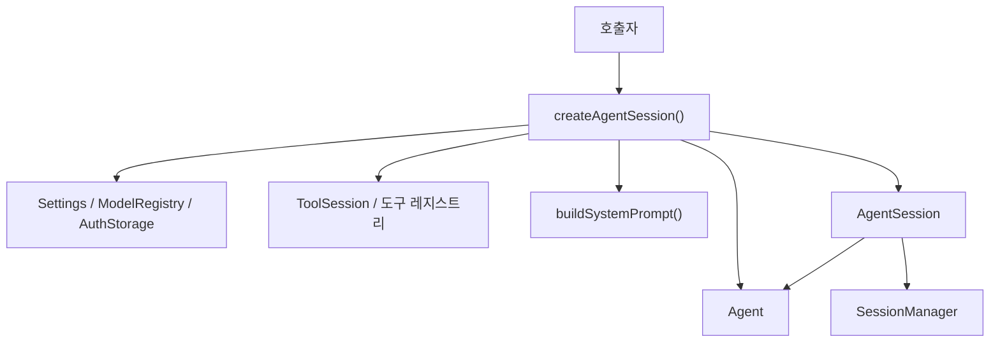

# Coding Agent Session Runtime

## 코딩 에이전트 세션 런타임

코딩 에이전트 세션 런타임은 `createAgentSession()`으로 시작해 `AgentSession`으로 동작을 관리하는 실행 계층입니다. 이 계층은 모델 선택, 세션 복원, 시스템 프롬프트 구성, 도구 등록, 확장 실행, 권한/비밀 처리, 비동기 작업 전달, 압축, 브랜치/핸드오프 같은 세션 생명주기를 하나의 런타임으로 묶습니다.

핵심 파일은 두 개입니다.

- `packages/coding-agent/src/sdk.ts`: 외부에서 호출하는 SDK 진입점입니다. `createAgentSession()`이 세션을 만들고 도구, 모델, 설정, 확장, 프롬프트, 레지스트리를 조립합니다.
- `packages/coding-agent/src/session/agent-session.ts`: 실제 세션 객체입니다. `AgentSession`은 에이전트 이벤트, 메시지 지속성, 모델 변경, 도구 실행, 압축, 세션 전환, 브랜칭, 목표/계획 모드 상태를 관리합니다.



### 런타임이 책임지는 범위

이 모듈은 단순히 `Agent`를 생성하는 래퍼가 아닙니다. `@gajae-code/agent-core`의 `Agent`가 모델 호출과 에이전트 루프를 담당한다면, 코딩 에이전트 세션 런타임은 그 주변에 필요한 제품 동작을 붙입니다.

주요 책임은 다음과 같습니다.

- `AuthStorage`, `ModelRegistry`, `Settings`를 초기화하고 모델을 선택합니다.
- 기존 세션이 있으면 모델, 사고 수준, 서비스 티어, 메시지 이력을 복원합니다.
- `AGENTS.md` 컨텍스트, 프롬프트 템플릿, 워크스페이스 트리, 스킬, 규칙을 로드합니다.
- `ToolSession`을 만들고 내장 도구, 커스텀 도구, 확장 도구, GJC 서브스킬 도구를 등록합니다.
- 시스템 프롬프트를 도구/스킬/규칙/메모리/MCP 지시문 기준으로 재생성합니다.
- `AgentSession`을 통해 세션 상태와 이벤트를 저장하고, UI/CLI/ACP 같은 실행 모드가 공유할 수 있는 추상화를 제공합니다.
- 세션 종료 시 SSH, Python 커널, JS VM, async job, 레지스트리 등록을 정리합니다.

### `createAgentSession()`의 생성 흐름

`createAgentSession(options)`는 세션 런타임의 조립 함수입니다. 반환 타입은 `CreateAgentSessionResult`이며, 주요 필드는 다음과 같습니다.

- `session`: 생성된 `AgentSession`
- `extensionsResult`: 로드된 확장과 확장 런타임
- `setToolUIContext`: UI가 생긴 뒤 도구 UI 컨텍스트를 갱신하는 함수
- `mcpManager`: 명시적으로 전달된 MCP 매니저
- `modelFallbackMessage`: 저장된 모델 복원 실패나 모델 선택 실패 안내
- `lspServers`: UI 모드에서 백그라운드 워밍업 대상 LSP 서버
- `eventBus`: 도구와 확장이 공유하는 이벤트 버스

초기화는 대부분 병렬화되어 있습니다. 예를 들어 워크스페이스 트리, 컨텍스트 파일, 프롬프트 템플릿은 독립적으로 시작되고 필요한 시점에 await됩니다.

```ts
const { session, setToolUIContext } = await createAgentSession({
	cwd,
	model,
	thinkingLevel: "high",
	hasUI: true,
});
```

위 호출은 다음 작업을 수행합니다.

1. `cwd`, `agentDir`, `eventBus`를 결정합니다.
2. SSH, Python, JS VM 정리 훅을 등록합니다.
3. `AuthStorage`와 `ModelRegistry`를 만들고 설정 바인딩을 적용합니다.
4. `Settings.init({ cwd, agentDir })`를 실행합니다.
5. 워크스페이스 트리, 컨텍스트 파일, 프롬프트 템플릿 로딩을 시작합니다.
6. 세션 저장소인 `SessionManager`를 만들고 논리 세션 ID를 가져옵니다.
7. 기존 세션이 있으면 `sessionManager.buildSessionContext()`로 메시지와 설정 이력을 복원합니다.
8. 모델과 `thinkingLevel`을 결정합니다.
9. 스킬, 규칙, TTSR 규칙, 도구, 확장을 로드합니다.
10. `Agent`를 생성하고 그 위에 `AgentSession`을 씌웁니다.

### 인증과 모델 선택

인증은 `discoverAuthStorage()`에서 시작합니다. 기본 경로는 로컬 SQLite 저장소입니다.

- 로컬 모드: `AuthStorage.create(getAgentDbPath(agentDir), ...)`
- 브로커 모드: `GJC_AUTH_BROKER_URL`이 있으면 `AuthBrokerClient`와 `RemoteAuthCredentialStore`를 사용합니다.

`resolveCredentialRankingMode()`는 `GJC_CREDENTIAL_RANKING_MODE`를 읽어 `"balanced"` 또는 `"earliest-reset"`만 허용합니다. 알 수 없는 값은 무시되어 `AuthStorage` 기본값을 사용합니다.

`createAgentSession()`은 `options.modelRegistry`가 없으면 `new ModelRegistry(authStorage)`를 만들고, `settings`의 모델 역할 설정을 적용합니다. 모델 선택 순서는 대략 다음과 같습니다.

1. `options.model` 또는 `options.modelPattern`이 있으면 명시 선택으로 취급합니다.
2. 기존 세션에 저장된 `existingSession.models.default`가 있고 API 키가 유효하면 복원합니다.
3. 설정의 기본 모델 역할인 `settings.getModelRole("default")`를 해석합니다.
4. 확장이 모델 공급자를 등록한 뒤에도 모델이 없으면 `resolveAllowedModels()` 후보 중 API 키가 있는 첫 모델을 선택합니다.
5. 아무 모델도 없으면 `formatNoModelsAvailableFallback()` 기반 안내를 `modelFallbackMessage`로 반환합니다.

모델이 선택되면 `resolveThinkingLevelForModel()`로 사고 수준을 모델 능력에 맞게 정규화하고, `preconnectModelHost()`로 모델 API 호스트에 best-effort preconnect를 시도합니다.

### 세션 ID와 공급자 세션 ID

런타임은 논리 세션과 공급자 캐시 세션을 분리합니다.

- `logicalSessionId`: `SessionManager.getSessionId()`가 반환하는 로컬 세션 ID
- `providerSessionId`: `options.providerSessionId`, `forkContextSeed.cacheIdentity`, 또는 `logicalSessionId`

이 분리는 로컬 세션 파일을 독립적으로 유지하면서도 공급자 측 프롬프트 캐시나 sticky credential 선택을 재사용하기 위한 구조입니다. OpenAI Codex Responses API를 사용하는 모델은 `getOpenAICodexTransportDetails()`와 `prewarmOpenAICodexResponses()`를 통해 websocket 선호 설정에 맞춰 백그라운드 prewarm을 수행합니다.

### 스킬과 규칙 로딩

GJC의 공개 워크플로 스킬은 제품 불변 조건으로 취급됩니다. `withEmbeddedDefaultGjcSkills()`는 호출자가 명시적으로 `options.skills`를 넘겨도 `getEmbeddedDefaultGjcSkills()`의 기본 스킬이 빠지지 않도록 보장합니다.

기본 스킬은 다음 계층에서 사용됩니다.

- 시스템 프롬프트 구성
- 활성 스킬 상태 표시
- GJC 서브스킬 도구 로딩
- 명령 라우팅과 워크플로 게이트

규칙은 `loadCapability<Rule>(ruleCapability.id, { cwd })`로 불러오고, `TtsrManager`가 조건부 TTSR 규칙과 일반 rulebook 규칙을 분리합니다.

- `alwaysApplyRules`: 항상 시스템 프롬프트에 포함되는 규칙
- `rulebookRules`: 설명이 있어 rulebook으로 노출되는 규칙
- TTSR 규칙: 스트림 중 조건이 맞으면 인터럽트/리마인더로 작동하는 규칙

### `ToolSession`: 도구가 세션에 접근하는 방식

`createAgentSession()` 내부의 `toolSession`은 도구와 세션 사이의 지연 바인딩 계층입니다. 세션 객체가 아직 생성되기 전부터 도구를 만들 수 있어야 하므로, 대부분의 필드는 getter나 함수로 되어 있습니다.

예를 들어 도구는 다음 정보를 `ToolSession`에서 가져옵니다.

- 현재 작업 디렉터리: `sessionManager.getCwd()`
- UI 사용 가능 여부: `hasUI`
- 현재 모델: `agent?.state.model ?? model`
- 세션 파일: `sessionManager.getSessionFile()`
- 활성 스킬 상태: `session.getActiveSkillState()`
- 계획/목표 모드 상태: `session.getPlanModeState()`, `session.getGoalModeState()`
- 도구 선택 큐: `session.toolChoiceQueue`
- 산출물 경로: `sessionManager.allocateArtifactPath(toolType)`
- fork 컨텍스트: `session.buildForkContextSeed(forkOptions)`

이 설계 덕분에 `createTools(toolSession, options.toolNames)`는 세션 생성 전에도 안전하게 실행되고, 실제 실행 시점에는 최신 세션 상태를 참조할 수 있습니다.

### 도구 레지스트리 구성

도구 구성은 여러 출처를 합쳐 `toolRegistry: Map<string, Tool>`에 등록하는 방식입니다.

1. `createTools()`가 내장 도구를 생성합니다.
2. `getImageGenTools()`가 현재 모델/설정 기준 이미지 생성 도구를 추가합니다.
3. `options.toolNames`에 `"web_search"`가 있으면 `getSearchTools()`를 추가합니다.
4. 활성 GJC 서브스킬이 있으면 `loadActiveSubskillTools()`로 플러그인 도구를 추가합니다.
5. `options.customTools`와 확장 등록 도구를 래핑합니다.
6. 확장 러너가 있으면 모든 도구를 `ExtensionToolWrapper`로 다시 감쌉니다.
7. deferrable 도구가 없으면 `resolve`를 제거하고, 있으면 hidden `resolve` 도구를 보장합니다.
8. 모델 provider가 `"cursor"`이면 `edit` 도구를 제거합니다.

커스텀 도구는 두 형태를 지원합니다.

- `CustomTool`: `customToolToDefinition()`으로 `ToolDefinition`으로 변환 가능
- `ToolDefinition`: 확장 러너가 있을 때 그대로 래핑 가능

`createCustomToolsExtension()`은 커스텀 도구의 `onSession` 훅을 확장 이벤트에 연결합니다. 연결되는 이벤트에는 `session_start`, `session_switch`, `session_branch`, `session_shutdown`, `auto_compaction_start`, `auto_retry_start`, `ttsr_triggered`, `todo_reminder` 등이 있습니다.

### 확장 런타임

GJC의 공개 SDK 경로에서는 파일시스템 기반 확장 발견이 격리되어 있습니다. `discoverExtensions()`는 빈 결과를 반환하고, `createAgentSession()`도 `additionalExtensionPaths`를 직접 탐색하지 않습니다.

대신 다음 확장만 로드됩니다.

- `options.preloadedExtensions`
- `options.extensions`로 전달된 인라인 확장 팩토리
- `createCustomToolsExtension(customTools)`
- 번들 Grok Build 확장: `getBundledGrokBuildExtensionFactory()`

확장 로딩 뒤에는 `extensionsResult.runtime.pendingProviderRegistrations`를 처리해 `ModelRegistry`에 공급자를 등록합니다. 이 순서가 중요합니다. `options.modelPattern`으로 지연된 모델 선택은 확장 모델 등록 이후에 다시 해석됩니다.

### 시스템 프롬프트 재구성

`rebuildSystemPrompt(toolNames, tools)`는 현재 활성 도구 목록과 런타임 상태를 기준으로 provider-facing 시스템 프롬프트 블록을 만듭니다.

이 함수는 다음 요소를 합칩니다.

- 활성 도구 메타데이터: `buildSystemPromptToolMetadata()`
- 검색 도구 설명: `renderSearchToolBm25Description()`
- 메모리 백엔드 지시문: `resolveMemoryBackend(settings).buildDeveloperInstructions(...)`
- MCP 서버 지시문: `mcpManager.getServerInstructions()`
- 스킬, 규칙, 항상 적용 규칙
- 컨텍스트 파일과 워크스페이스 트리
- 도구 발견 모드와 intent tracing 설정

`options.systemPrompt`가 배열이면 기본 프롬프트를 완전히 대체합니다. 함수이면 기본 블록을 받아 최종 블록을 반환합니다.

```ts
const { session } = await createAgentSession({
	systemPrompt(defaultPrompt) {
		return [
			...defaultPrompt,
			"이 세션에서는 변경 전 관련 테스트를 먼저 확인합니다.",
		];
	},
});
```

### 메시지 변환, 이미지 차단, 비밀 obfuscation

모델 호출 전 메시지는 `convertToLlmFinal()`을 거칩니다.

1. `convertToLlm()`으로 내부 `AgentMessage`를 provider 메시지로 변환합니다.
2. `settings.get("images.blockImages")`가 켜져 있으면 이미지 content를 `"Image reading is disabled."` 텍스트로 대체합니다.
3. 비밀 값이 로드되어 있으면 `obfuscateMessages()`로 provider에 나가는 메시지에서 비밀을 숨깁니다.

도구 인자에는 반대 방향 처리가 있습니다. `Agent` 생성 시 `transformToolCallArguments`는 `tools.maxTimeout`을 적용하고, obfuscator가 있으면 `obfuscator.deobfuscateObject(result)`로 도구 실행 전에 값을 복원합니다.

### `Agent` 생성과 스트림 실행

`createAgentSession()`은 최종적으로 `new Agent({...})`를 호출합니다. 중요한 설정은 다음과 같습니다.

- `initialState.systemPrompt`
- `initialState.model`
- `initialState.thinkingLevel`
- `initialState.tools`
- fork 컨텍스트가 있으면 `initialState.messages`
- `convertToLlm`
- `transformContext`
- `onPayload`, `onResponse`
- `streamFn`
- `cursorExecHandlers`
- `getToolContext`
- `getApiKey`
- `getAuthCredentialType`
- `transformToolCallArguments`
- `getToolChoice`
- `telemetry`
- `appendOnlyContext`

`streamFn`은 `streamSimple()`을 호출하면서 인증 오류를 특별 처리합니다. 인증 오류가 발생하면 `modelRegistry.authStorage.invalidateCredentialMatching()`으로 기존 credential을 무효화하고, 같은 세션 ID로 새 API 키를 다시 가져옵니다.

### `AgentSession`의 역할

`AgentSession`은 실행 모드 공통 세션 추상화입니다. interactive, print, rpc, ACP 같은 모드는 각자의 입출력 레이어를 얹지만, 세션 동작은 `AgentSession`이 공유합니다.

주요 기능은 다음과 같습니다.

- 에이전트 이벤트 구독과 세션 파일 저장
- 메시지 추가, 프롬프트 전송, synthetic 메시지 처리
- 모델 변경과 `thinkingLevel` 변경
- 도구 선택 큐와 discoverable 도구 활성화
- 자동/수동 compaction
- handoff 문서 생성
- 세션 전환, 브랜치, 트리 탐색
- 비동기 job 결과 전달
- 목표 모드와 계획 모드 상태 관리
- 커스텀 명령, 슬래시 명령, 프롬프트 템플릿 확장
- 권한 게이트와 ACP 클라이언트 연동
- Python/JS eval 커널 소유권과 정리
- GJC 런타임 sidecar 상태 저장

생성자는 `AgentSessionConfig`를 받아 `Agent`, `SessionManager`, `Settings`, `ModelRegistry`, 도구 레지스트리, 확장 러너, 스킬, 규칙 관리자, provider hook을 모두 묶습니다.

### 세션 저장과 복원

`SessionManager`는 세션 파일과 branch entry를 관리합니다. `AgentSession`은 이벤트를 받을 때 세션 파일에 메시지와 상태 변화를 반영합니다.

관련 호출 흐름은 다음과 같습니다.

- `createAgentSession()`은 `sessionManager.buildSessionContext()`로 기존 메시지를 읽습니다.
- 기존 branch가 있으면 `agent.replaceMessages(existingSession.messages)`로 `Agent` 상태를 복원합니다.
- 새 세션이면 `appendModelChange()`, `appendThinkingLevelChange()`, `appendServiceTierChange()`로 초기 상태를 저장합니다.
- `AgentSession`의 이벤트 발행 경로는 `#emitSessionEvent()`에서 `getSessionFile()`을 참조하고, GJC sidecar 상태는 `persistCoordinatorRuntimeStateFromEvent()`로 갱신됩니다.

이 구조에서 `Agent`는 현재 메모리 상태를 갖고, `SessionManager`는 지속 가능한 append-only 이력을 갖습니다.

### 비동기 작업 결과 전달

백그라운드 작업 지원이 켜져 있고 최상위 세션이면 `AsyncJobManager`가 생성됩니다. 서브에이전트는 부모의 전역 `AsyncJobManager.instance()`를 공유하며 직접 소유하지 않습니다.

작업 완료 흐름은 다음과 같습니다.

1. `AsyncJobManager`의 `onJobComplete(jobId, result, job)`이 호출됩니다.
2. 결과가 길면 `formatAsyncResultForFollowUp()`가 앞부분만 남기고 전체 출력은 artifact로 저장합니다.
3. `session.yieldQueue.enqueue("async-result", ...)`에 결과를 넣습니다.
4. `buildAsyncResultBatchMessage()`가 여러 결과를 하나의 `CustomMessage<AsyncResultDetails>`로 묶습니다.
5. 모델은 다음 턴에서 `async-result` 커스텀 메시지를 받습니다.

이때 `durationMs`, job type, label 같은 메타데이터는 `details.jobs`에 보존됩니다.

### MCP와 discoverable 도구

GJC 공개 표면에서는 MCP 런타임 discovery가 격리되어 있습니다.

- `enableMCP`는 deprecated이며 무시됩니다.
- `mcpDiscoveryEnabled`는 `false`로 고정됩니다.
- 명시적으로 전달된 `options.mcpManager`만 재사용됩니다.
- MCP 프롬프트는 `buildMCPPromptCommands()`로 slash command 형태로 노출할 수 있습니다.
- MCP resource 변경 알림은 `buildMcpNotificationBatchMessage()`로 user 메시지 형태로 전달됩니다.

일반 도구 discovery는 `settings.get("tools.discoveryMode") === "all"`일 때 내장 도구에 대해서만 적용됩니다. 이 경우 non-essential discoverable 도구는 초기 프롬프트에서 빠지고, 모델이 `search_tool_bm25`를 통해 찾아 활성화합니다.

### LSP 워밍업

`createAgentSession()`은 UI가 있고 `lsp.diagnosticsOnWrite`가 켜져 있을 때만 LSP 서버 워밍업을 백그라운드에서 시작합니다.

- 서버 탐색: `discoverStartupLspServers(cwd)`
- 워밍업: `warmupLspServers(cwd)`
- 이벤트 발행: `eventBus.emit(LSP_STARTUP_EVENT_CHANNEL, event)`

print/script 모드에서는 LSP 상태 표시가 렌더링되지 않고, 짧은 실행이 많으므로 워밍업을 생략합니다. LSP가 필요한 도구는 필요 시점에 자체적으로 서버를 시작합니다.

### AgentRegistry와 IRC 라우팅

세션은 `AgentRegistry`에 미리 등록됩니다. 이 등록은 시스템 프롬프트 생성 전에 일어나며, 같은 병렬 배치에서 시작된 서브에이전트들이 초기 `# IRC Peers` 블록에서 서로를 볼 수 있게 합니다.

흐름은 다음과 같습니다.

1. `agentRegistry.register({ id, displayName, kind, parentId, session: null, ... })`
2. `Agent`와 `AgentSession`을 생성합니다.
3. `agentRegistry.attachSession(resolvedAgentId, session, sessionFile)`로 실제 세션을 연결합니다.
4. `session.dispose()` 래퍼가 `agentRegistry.unregister(resolvedAgentId)`를 보장합니다.

`agent-session.ts`의 `dedupeIrcReply()`는 반복된 IRC ephemeral reply를 압축하고 4 KiB로 제한해 relay flood를 방지합니다.

### 권한 게이트와 ACP 클라이언트

`AgentSession`에는 ACP 클라이언트가 연결된 경우 도구 실행 전에 권한을 묻는 게이트가 있습니다. 권한 대상 도구는 다음입니다.

- `bash`
- `monitor`
- `edit`
- `delete`
- `move`

`getPermissionIntent()`는 도구 이름과 인자를 보고 사용자에게 보여줄 권한 의도를 구성합니다. 특히 `edit` 도구는 `getEditDestructiveIntent()`로 apply patch나 edit 배열을 분석해 delete/move 성격인지 판별합니다.

권한 옵션은 고정되어 있습니다.

- `allow_once`
- `allow_always`
- `reject_once`
- `reject_always`

`extractPermissionLocations()`는 ACP 클라이언트가 에디터에서 위치를 열 수 있도록 상대 경로를 `resolveToCwd()`로 절대 경로화합니다.

### Compaction과 handoff

`AgentSession`은 컨텍스트 사용량을 감시하고 필요하면 compaction을 수행합니다. 관련 함수는 `@gajae-code/agent-core/compaction`에서 가져옵니다.

- `shouldCompact()`
- `prepareCompaction()`
- `compact()`
- `generateHandoff()`
- `generateBranchSummary()`
- `calculateContextTokens()`
- `estimateTokens()`

자동 compaction 흐름은 call graph상 `#runAutoCompaction()`에서 시작해 `sessionManager.getBranch()`를 통해 현재 branch를 읽고, blob 참조가 있으면 `blob-store`의 `parseBlobRef()`, `getSync()` 등을 통해 resident blob을 해석합니다.

`handoff()`는 현재 branch를 요약해 다음 세션이 이어받을 수 있는 문서를 만들고, 필요한 경우 `appendCustomMessageEntry()`로 세션 이력에 기록합니다. `createHandoffContext()`는 handoff 문서를 `<handoff-context>` 블록으로 감싸 후속 세션에 주입할 수 있는 문자열을 만듭니다.

### Fork 컨텍스트와 서브에이전트

`ForkContextSeed`는 부모 세션의 일부 컨텍스트를 자식 세션으로 전달하는 구조입니다.

포함되는 필드는 다음과 같습니다.

- `messages`: provider-facing 메시지
- `agentMessages`: 내부 `AgentMessage`
- `metadata`: 포함/스킵 메시지 수, 토큰 근사치, 제한값, 스킵 이유
- `cacheIdentity`: 공급자 캐시를 공유할 선택적 ID
- `appendOnlyPrefixSnapshot`: append-only 컨텍스트 prefix snapshot

`createAgentSession()`은 fork seed가 있고 기존 세션이 없으면 `Agent` 초기 메시지에 `forkContextSeed.agentMessages`를 넣습니다. append-only 모드가 켜진 경우에는 `AppendOnlyContextManager`에 prefix snapshot과 정규화 메시지를 seed합니다.

### append-only 컨텍스트 모드

`resolveAppendOnlyMode(setting, provider)`는 append-only 컨텍스트 사용 여부를 결정합니다.

- `"on"`: 항상 사용
- `"off"`: 사용하지 않음
- `"auto"` 또는 undefined: provider가 `"deepseek"`일 때만 사용

append-only 모드는 prefix caching 성격의 provider에서 이전 prefix를 안정적으로 재사용하기 위한 최적화입니다. fork child는 부모의 `appendOnlyPrefixSnapshot`을 가져와 새 세션의 prefix 상태를 초기화할 수 있습니다.

### 메모리 백엔드와 시작 작업

세션 생성 후 `resolveMemoryBackend(settings).start(...)`가 호출됩니다. 이 작업은 세션, 설정, 모델 레지스트리, agentDir, taskDepth, 부모 hindsight 상태를 받아 메모리 백엔드의 시작 루틴을 실행합니다.

시스템 프롬프트 생성 시에도 같은 메모리 백엔드가 사용됩니다.

```ts
const memoryInstructions =
	await resolveMemoryBackend(settings).buildDeveloperInstructions(
		agentDir,
		settings,
		session,
	);
```

따라서 메모리 백엔드는 두 지점에서 관여합니다.

- 세션 시작 시 런타임 상태 초기화
- 시스템 프롬프트 재구성 시 developer instruction 주입

### 정리와 실패 처리

`createAgentSession()`은 초기화 도중 실패해도 가능한 리소스를 정리합니다.

정상 종료 시 `session.dispose()`가 처리하는 것:

- `AgentRegistry` 등록 해제
- credential disabled listener 해제
- `AgentSession` 내부 리소스 정리

생성 도중 실패 시 catch 블록이 처리하는 것:

- credential listener 해제
- 세션이 만들어졌으면 `session.dispose()`
- 세션 전이면 `agentRegistry.unregister(resolvedAgentId)`
- `disposeKernelSessionsByOwner(evalKernelOwnerId)`
- `disposeVmContextsByOwner(evalKernelOwnerId)`

프로세스 postmortem 훅으로는 다음 정리가 등록됩니다.

- `ssh-cleanup`: `closeAllConnections()`, `unmountAll()`
- `python-cleanup`: `disposeAllKernelSessions()`
- `js-vm-cleanup`: `disposeAllVmContexts()`

### 개발 시 주의할 점

`createAgentSession()`은 많은 시스템의 결합점이므로 변경 시 다음 경계를 유지해야 합니다.

- `AuthStorage`와 `ModelRegistry.authStorage`는 같은 인스턴스여야 합니다. 둘 다 전달됐는데 다르면 예외를 던집니다.
- GJC 기본 스킬은 `options.skills`가 주어져도 제거되면 안 됩니다. `withEmbeddedDefaultGjcSkills()`가 이 제품 불변 조건을 지킵니다.
- 파일시스템 기반 MCP/extension discovery는 GJC 공개 표면에서 격리되어 있습니다. 명시적 SDK 입력과 번들 확장만 허용됩니다.
- 서브에이전트는 부모의 `AsyncJobManager`와 MCP manager를 상속해야 하며, 전역 인스턴스를 새로 소유하거나 dispose하면 안 됩니다.
- `ToolSession`은 세션 생성 전에도 만들어지므로, 세션 의존 값은 직접 값보다 getter로 연결해야 합니다.
- 시스템 프롬프트는 도구 목록, MCP 지시문, 메모리 지시문, discovery mode에 따라 재생성될 수 있습니다. 도구 활성화 로직을 바꿀 때는 `rebuildSystemPrompt()` 경로도 함께 확인해야 합니다.
- provider로 나가는 메시지에는 이미지 차단과 secret obfuscation이 적용됩니다. 새 provider hook이나 메시지 변환을 추가할 때 이 순서를 보존해야 합니다.
- `AgentSession`의 이벤트는 세션 파일 저장과 GJC runtime sidecar 상태에 영향을 줍니다. 새 이벤트를 추가하면 persistence, UI 표시, extension hook 필요 여부를 함께 검토해야 합니다.

### 관련 타입 요약

`CreateAgentSessionOptions`는 SDK 호출자가 세션 조립을 제어하는 입력 타입입니다. 자주 쓰이는 필드는 다음과 같습니다.

- `cwd`, `agentDir`
- `authStorage`, `modelRegistry`
- `model`, `modelPattern`, `thinkingLevel`
- `systemPrompt`
- `customTools`, `extensions`, `preloadedExtensions`
- `skills`, `rules`, `contextFiles`, `workspaceTree`
- `mcpManager`
- `enableLsp`, `skipPythonPreflight`, `toolNames`
- `outputSchema`, `requireYieldTool`, `taskDepth`
- `agentId`, `agentDisplayName`, `agentRegistry`
- `sessionManager`
- `settings`
- `hasUI`
- `telemetry`
- `forkContextSeed`
- `providerSessionState`
- `shouldPause`

`AgentSessionConfig`는 이미 조립된 런타임 구성 요소를 `AgentSession` 생성자로 넘기는 내부 타입입니다. `createAgentSession()`이 대부분의 필드를 구성하므로 일반 SDK 사용자는 직접 만들 일이 적습니다.

`ForkContextSeed`는 서브세션 초기화를 위한 메시지 seed이고, `AsyncJobSnapshot`은 현재 async job 상태를 UI나 명령에서 표시할 때 사용하는 구조입니다.

### 코드베이스 연결 지점

이 모듈은 코딩 에이전트 패키지의 여러 하위 시스템을 연결합니다.

- 모델/인증: `config/model-registry`, `session/auth-storage`, `setup/model-onboarding-guidance`
- 설정: `config/settings`, `config/model-resolver`, `config/prompt-templates`
- 프롬프트: `system-prompt`, `prompts/system/*`, `prompts/tools/async-result.md`
- 도구: `tools`, `tools/context`, `tool-discovery/tool-index`
- 확장: `extensibility/extensions`, `extensibility/custom-tools`, `extensibility/gjc-plugins`
- 세션 저장: `session/session-manager`, `session/messages`, `session/yield-queue`, `session/tool-choice-queue`
- 런타임 상태: `gjc-runtime/session-state-sidecar`, `goals/runtime`, `plan-mode/state`
- 실행기: `exec/bash-executor`, `eval/py/executor`, `eval/js/context-manager`
- 외부 통합: `runtime-mcp`, `lsp`, `cursor`, `ssh`, `internal-urls`
- 관측/디버깅: `debug/raw-sse-buffer`, `AgentTelemetryConfig`, `logger.time()`

기여자가 이 모듈을 수정할 때는 단일 함수의 로컬 동작보다 세션 생성 순서와 소유권을 먼저 확인해야 합니다. 특히 `createAgentSession()`은 “무엇을 생성하는가”보다 “누가 소유하고 언제 정리하는가”가 더 중요한 함수입니다.