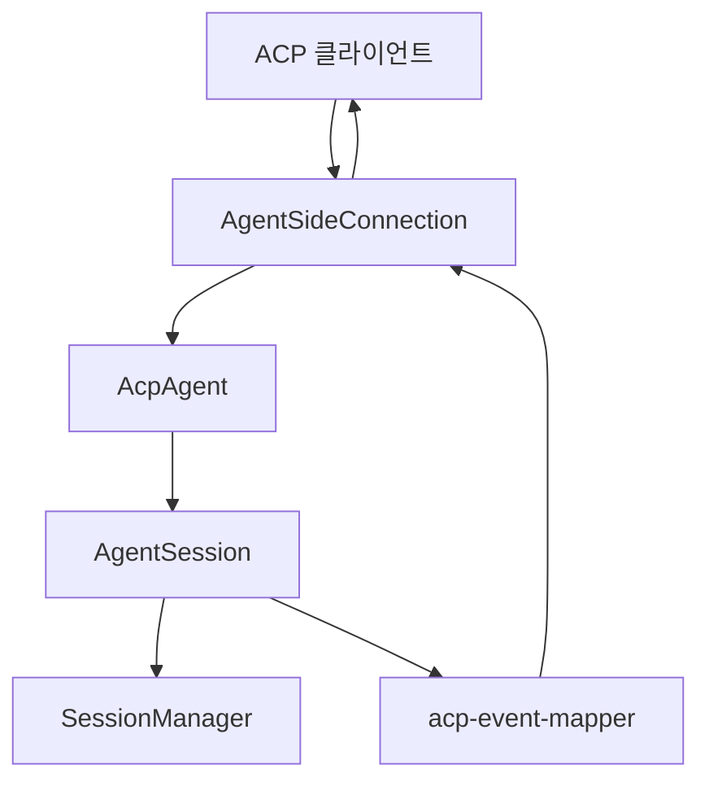

# Coding Agent — Session, SDK, Models, and Persistence

# 세션, SDK, 모델, 영속성 연동

이 모듈은 Gajae Code 코딩 에이전트를 외부 ACP 클라이언트와 연결하고, 세션 생성/로드/재개/분기, 프롬프트 실행, 모델/모드 설정, MCP 서버 연결, 확장 UI, 이벤트 재생, 파일 잠금 정리까지 묶어 관리합니다. 중심 구현은 `AcpAgent`이며, `@agentclientprotocol/sdk`의 `Agent` 인터페이스를 구현해 GJC의 `AgentSession`을 ACP 세션 표면으로 노출합니다.

## 주요 책임

- ACP 표준 메서드 구현: `initialize`, `authenticate`, `newSession`, `loadSession`, `listSessions`, `resumeSession`, `unstable_forkSession`, `prompt`, `cancel`, `closeSession`
- GJC 세션 영속성 연결: `SessionManager.list`, `SessionManager.listAll`, `session.sessionManager.ensureOnDisk()`, `switchSession()`, `fork()`, `flush()`
- 클라이언트 설정 동기화: 모드, 모델, thinking level을 ACP `configOptions`, `models`, `modes`로 노출
- 프롬프트 턴 직렬화와 취소 정리: `PromptTurnState`, `PromptQueueState`, `#queuePrompt`, `#beginCancelCleanup`
- 에이전트 이벤트를 ACP 알림으로 변환: `mapAgentWireEventPayloadToAcpSessionUpdates`, `buildToolCallStartUpdate`
- ACP 클라이언트 기능 위임: `createAcpClientBridge`가 파일 읽기/쓰기, 터미널, 권한 요청을 클라이언트로 라우팅
- MCP 서버 연결: ACP가 전달한 `McpServer`를 `MCPManager` 설정으로 변환하고 세션 도구를 갱신
- 세션 히스토리 재생: 저장된 메시지와 도구 결과를 ACP 클라이언트에 다시 전송
- 전역 설정 파일 잠금 GC: `fileLocksGcAdapter`가 죽은 프로세스의 `<file>.lock` 디렉터리를 안전하게 제거

## ACP 진입점

`packages/coding-agent/src/modes/acp/acp-mode.ts`가 프로세스 표면입니다.

- `createAcpConnection(transport, createSession, initialSession?)`는 `AgentSideConnection`을 만들고, 연결마다 `new AcpAgent(...)`를 생성합니다.
- `runAcpMode(createSession, initialSession?)`는 `stdin/stdout`을 Web Stream으로 바꾼 뒤 `ndJsonStream` transport를 붙입니다.
- 연결이 닫히면 `process.exit(0)`으로 ACP 모드를 종료합니다.

## `AcpAgent`의 세션 모델

`AcpAgent`는 `#sessions: Map<string, ManagedSessionRecord>`에 ACP 세션별 런타임 상태를 보관합니다. `ManagedSessionRecord`는 단순히 `AgentSession`만 감싸지 않고, 해당 세션이 ACP에서 안전하게 동작하는 데 필요한 주변 상태를 함께 들고 있습니다.

핵심 필드:

- `session`: 실제 GJC `AgentSession`
- `mcpManager`: ACP 요청으로 연결된 MCP 서버 관리자
- `promptTurn`: 현재 진행 중인 프롬프트 턴 상태
- `promptQueue`: 같은 세션의 프롬프트를 순서대로 실행하기 위한 큐
- `liveMessageId`, `liveMessageProgress`: 스트리밍 assistant 메시지 청크를 같은 ACP 메시지로 묶기 위한 상태
- `toolArgsById`: 도구 종료 이벤트에서 시작 인자를 복원하기 위한 임시 저장소
- `extensionsConfigured`: 확장 러너 초기화 여부
- `lifetimeUnsubscribe`: 세션 수명 동안 유지되는 이벤트 구독 해제 함수

세션 생성은 `#createNewSessionRecord`에서 시작합니다. 전달받은 `cwd`는 `#assertAbsoluteCwd`로 절대 경로인지 검증되고, `#createSession(path.resolve(cwd))`로 `AgentSession`을 만든 뒤 `session.sessionManager.ensureOnDisk()`로 디스크 영속성을 보장합니다. 준비된 세션은 `#registerPreparedSession`을 통해 확장, MCP, 클라이언트 브리지가 설정된 뒤 `#sessions`에 등록됩니다.

기존 세션 로드는 `#loadManagedSession`, 재개는 `#resumeManagedSession`이 담당합니다. 이미 메모리에 올라온 세션이면 `#assertMatchingCwd`로 같은 작업 디렉터리인지 확인하고 MCP 설정만 다시 적용합니다. 메모리에 없으면 `#findStoredSession`으로 `SessionManager`의 저장 세션 목록에서 찾고, `#openStoredSession`에서 `session.switchSession(sessionPath)`를 호출합니다.

분기는 `unstable_forkSession`과 `#forkManagedSession`이 처리합니다. 소스 세션이 메모리에 있는 경우 `#resolveForkSourceSessionPath`는 먼저 `isPromptTurnInFlight`로 프롬프트 실행 중인지 확인합니다. 실행 중인 턴이 있으면 분기를 거부합니다. 이후 `flush()`로 저장 상태를 확정하고 `session.fork()`를 호출합니다.

## 초기화와 인증

`initialize(params)`는 ACP 클라이언트에 에이전트 정보와 기능을 알립니다.

반환되는 주요 기능:

- `loadSession: true`
- MCP transport: `http`, `sse`
- 프롬프트 입력: `embeddedContext`, `image`
- 세션 작업: `list`, `fork`, `resume`, `close`

인증 방식은 기본적으로 `agent`를 제공합니다. 클라이언트가 `params.clientCapabilities?.auth?.terminal === true`를 광고하면 `terminal` 방식도 추가되며, 이때 `args`에는 `ACP_TERMINAL_AUTH_FLAG` 값인 `--acp-terminal-auth`가 들어갑니다.

`authenticate(params)`는 `initialize`에서 광고한 `methodId`만 허용합니다. 터미널 인증을 지원하지 않는 클라이언트에서 `terminal`을 보내거나 알 수 없는 값을 보내면 `Unknown ACP auth method` 오류를 던집니다.

`terminal-auth.ts`의 `prepareAcpTerminalAuthArgs(rawArgs)`는 터미널 인증 플래그를 감지하고, 터미널 인증 모드에서는 기존 `--mode` 인자를 제거합니다. 이는 사용자가 ACP 터미널 인증을 시작할 때 일반 실행 모드 설정이 인증 전용 실행을 방해하지 않게 하기 위한 전처리입니다.

## 프롬프트 실행과 턴 직렬화

`prompt(params)`는 ACP의 사용자 입력을 GJC 세션 프롬프트로 변환해 실행합니다. 같은 세션에서 프롬프트가 겹치지 않도록 `#queuePrompt`가 직렬화합니다.

흐름은 다음과 같습니다.

1. `#getSessionRecord(params.sessionId)`로 세션을 찾습니다.
2. 이전 `promptTurn`이 아직 정리 중이면 `previousTurn.promise`와 `previousTurn.cleanup`을 기다립니다.
3. `#convertPromptBlocks(params.prompt)`로 텍스트와 이미지를 분리합니다.
4. 새 `PromptTurnState`를 만들고 현재 usage baseline을 저장합니다.
5. `record.session.subscribe(...)`로 세션 이벤트를 구독합니다.
6. `#runPromptOrCommand(record, text, images)`를 비동기로 실행합니다.
7. 이벤트 스트림에서 `agent_end`가 오면 usage delta와 stop reason을 계산해 `#finishPrompt`로 응답을 완료합니다.

`#convertPromptBlocks`는 ACP prompt block을 다음처럼 변환합니다.

- `text`: 텍스트 배열에 추가
- `image`: `AgentImageContent`로 보존
- `resource` 중 텍스트 리소스: 텍스트에 추가
- `resource` 중 이미지 blob: 이미지 배열에 추가
- 그 외 리소스: `[embedded resource: <uri>]` 플레이스홀더로 표현
- `resource_link`: `title`, `name`, `uri` 순으로 텍스트화
- `audio`: `[audio omitted]`

## 슬래시 명령과 스킬 명령

`#runPromptOrCommand`는 일반 프롬프트 실행 전에 명령을 먼저 처리합니다.

처리 순서:

1. `/skill:`로 시작하는 namespaced skill 명령은 ACP builtin보다 먼저 `#tryRunSkillCommand`에서 처리합니다.
2. `executeAcpBuiltinSlashCommand`로 ACP builtin 명령을 실행합니다.
3. builtin 결과가 `{ prompt }`이면 변환된 프롬프트를 `record.session.prompt(...)`로 실행합니다.
4. builtin이 단순 출력 또는 상태 변경이면 `#finishPrompt`로 턴을 종료합니다.
5. builtin이 아니면 일반 skill 명령을 다시 시도합니다.
6. 어떤 명령도 아니면 `record.session.prompt(text, { images })`를 호출합니다.

`#tryRunSkillCommand`는 `parseSkillInvocations`, `resolveSubskillActivationForSkillInvocation`, `buildSkillPromptMessage`를 사용합니다. 여러 스킬 호출이 포함된 경우 마지막 호출은 `promptCustomMessage`, 앞선 호출은 `sendCustomMessage`로 넣어 마지막 스킬 프롬프트가 실제 턴을 시작하게 합니다.

직접 alias 충돌 방지는 `#directSkillAliasCollides`가 맡습니다. 세션의 `customCommands`나 `loadSlashCommands({ cwd })`에서 같은 이름이 발견되면 bare skill alias는 처리하지 않습니다. `/skill:<name>` 형태는 builtin 또는 파일 명령과 충돌하지 않도록 우선 처리됩니다.

## 취소와 정리

취소는 단순히 응답만 끝내지 않고, 세션 내부 abort가 끝날 때까지 정리 장벽을 유지합니다.

핵심 함수:

- `cancel(params)`
- `#beginCancelCleanup(record, promptTurn)`
- `#runCancelCleanup(record, promptTurn)`
- `#cancelPromptForClose(record)`
- `isPromptTurnInFlight(turn)`

`#beginCancelCleanup`은 `cancelRequested`를 표시하고 이벤트 구독을 해제한 뒤 `#runCancelCleanup`을 시작합니다. 동시에 ACP 클라이언트에는 `stopReason: "cancelled"`를 반환해 취소 요청이 받아들여졌음을 빠르게 알립니다.

`#runCancelCleanup`은 `record.session.abort()`와 timeout을 `Promise.race`로 묶습니다. 기본 timeout은 `ACP_CANCEL_CLEANUP_TIMEOUT_MS`입니다. timeout이 발생하면 `cancel`은 경고를 기록하고 `#closeManagedSession`으로 세션을 닫습니다.

중요한 불변식은 `PromptTurnState.cleanup`입니다. `#finishPrompt`가 먼저 호출되어도 cleanup이 남아 있으면 `record.promptTurn` 슬롯을 즉시 비우지 않습니다. 이 덕분에 분기, 큐잉, 늦은 이벤트 전달이 “정리 중인 턴”을 안전하지 않은 상태로 오인하지 않습니다.

## 모델, 모드, Thinking 설정

ACP 설정은 `#buildConfigOptions`에서 구성합니다.

노출되는 config option:

- `mode`: `default` 또는 `plan`
- `model`: `session.getAvailableModels()`에서 온 모델 목록
- `thinking`: `Off`와 `session.getAvailableThinkingLevels()` 값

모델 식별자는 `#toModelId(model)`이 만드는 `${model.provider}/${model.id}` 형식입니다. `#setModelById`는 이 문자열을 다시 사용해 `session.getAvailableModels()`에서 모델을 찾고, 존재하면 `session.setModel(model)`을 호출합니다.

모드는 `#getAvailableModes`와 `#applyModeChange`가 관리합니다.

- `default`: `session.setPlanModeState(undefined)`
- `plan`: `session.setPlanModeState({ enabled: true, planFilePath, workflow, reentry })`

`plan` 모드는 `session.settings.get("plan.enabled")`가 참일 때만 목록에 포함됩니다. 기본 plan 파일 URL은 `local://PLAN.md`입니다.

Thinking 설정은 `#setThinkingLevelById`가 `parseThinkingLevel(value)`로 검증한 뒤 `session.setThinkingLevel(thinkingLevel)`을 호출합니다. `inherit` 또는 비어 있는 값은 ACP config에서는 `off`로 표시됩니다.

## 부트스트랩 알림과 Zed race guard

세션 생성, 로드, 재개, 분기 응답 직후에는 `#scheduleBootstrapUpdates(sessionId)`가 호출됩니다. 이 함수는 `ACP_BOOTSTRAP_RACE_GUARD_MS`만큼 지연한 뒤 다음 알림을 보냅니다.

- `available_commands_update`
- `session_info_update`

이 지연은 ACP 응답보다 세션 알림이 먼저 도착해 클라이언트가 “알 수 없는 세션의 notification”으로 드롭하는 문제를 피하기 위한 장치입니다. 같은 지연 안에서 `lifetimeUnsubscribe`도 설치됩니다. 따라서 확장 또는 비동기 작업이 `thinking_level_changed`를 발생시켜도, 클라이언트가 아직 세션 ID를 등록하기 전에 `config_option_update`가 먼저 나가지 않습니다.

## 이벤트 매핑

`acp-event-mapper.ts`는 GJC 내부 `AgentSessionEvent`를 ACP `SessionNotification` 배열로 변환합니다.

진입 함수:

- `mapAgentWireEventPayloadToAcpSessionUpdates(payload, sessionId, options)`
- `mapAgentSessionEventToAcpSessionUpdates(event, sessionId, options)`

주요 매핑:

- `message_update`: assistant 텍스트 또는 thinking delta를 `agent_message_chunk`, `agent_thought_chunk`로 변환
- `message_end`: 스트리밍 중 텍스트가 한 번도 나가지 않은 경우 최종 assistant 텍스트를 보강 전송
- `tool_execution_start`: `buildToolCallStartUpdate`로 `tool_call` 생성
- `tool_execution_update`: `tool_call_update` 상태를 `in_progress`로 전송
- `tool_execution_end`: `tool_call_update` 상태를 `completed` 또는 `failed`로 전송
- `todo_reminder`, `todo_auto_clear`: ACP `plan` 업데이트로 전송
- `todo_write` 도구 성공 결과: `mapTodoWriteResultToPlanUpdate`로 plan entries 추출

`mapToolKind`는 도구 이름을 ACP tool kind로 분류합니다.

- `read` → `read`
- `write`, `edit` → `edit`
- `delete` → `delete`
- `move` → `move`
- `bash`, `shell`, `exec`, `eval` → `execute`
- `search`, `find`, `ast_grep` → `search`
- `web_search` → `fetch`
- `todo_write` → `think`
- 그 외 → `other`

도구 위치는 `extractToolLocations`와 `extractToolLocationsFromResult`가 추출합니다. `cwd`가 제공되면 `resolveToCwd`로 상대 경로를 절대 경로로 바꿉니다. ACP 클라이언트가 편집기에서 파일을 열 수 있어야 하므로, ACP 경로는 가능하면 절대 경로여야 합니다.

도구 출력은 `extractToolCallContent`가 정규화합니다. 구조화된 `content` 배열, 터미널 ID, 텍스트, 오류 메시지, JSON 직렬화 fallback을 순서대로 확인하며, 텍스트는 `ACP_TEXT_LIMIT`인 4000자까지 제한됩니다.

## 저장 세션 히스토리 재생

`loadSession`은 세션을 연 뒤 `#replaySessionHistory(record)`를 호출합니다. 이 함수는 `record.session.sessionManager.buildSessionContext().messages`를 순회하면서 저장된 메시지를 ACP 알림으로 다시 구성합니다.

역할별 처리:

- `assistant`: `#replayAssistantMessage`
- `user`, `developer`, `custom`, `hookMessage`: `user_message_chunk`
- `toolResult`: `#replayToolResult`
- `bashExecution`, `pythonExecution`, `compactionSummary`: `user_message_chunk`

assistant 메시지의 `content` 배열에서 `text`는 `agent_message_chunk`, `thinking`은 `agent_thought_chunk`로 재생됩니다. `toolCall` 또는 `tool_use` 항목은 `buildToolCallStartUpdate`로 완료 상태의 tool call을 재생하고, 이후 같은 `toolCallId`의 `toolResult`가 나오면 중복 start 이벤트를 생략할 수 있도록 `replayedToolCallIds`와 `replayedToolCallArgs`에 기록합니다.

`normalizeReplayToolArguments`는 저장된 tool arguments가 JSON 문자열이면 파싱하고, 실패하면 원문 문자열을 유지합니다.

## ACP 클라이언트 브리지

`createAcpClientBridge(connection, sessionId, clientCapabilities)`는 ACP 클라이언트 기능을 GJC `ClientBridge` 인터페이스로 감쌉니다. 이 브리지는 `AgentSession`의 파일 도구, 터미널 도구, 권한 게이트가 클라이언트 기능을 사용할 수 있게 해줍니다.

기능 매핑:

- `clientCapabilities.fs.readTextFile === true` → `bridge.readTextFile`
- `clientCapabilities.fs.writeTextFile === true` → `bridge.writeTextFile`
- `clientCapabilities.terminal === true` → `bridge.createTerminal`
- 권한 요청 → 항상 `bridge.requestPermission` 제공

`createTerminalHandle`은 ACP `connection.createTerminal` 결과를 `ClientBridgeTerminalHandle`로 감쌉니다. `currentOutput`, `waitForExit`, `kill`, `release`를 그대로 전달하되, exit code와 signal은 없을 경우 `null`로 정규화합니다.

`requestPermission`은 내부 `ClientBridgePermissionToolCall`을 ACP `ToolCallUpdate`로 변환하고, 선택 가능한 옵션을 `PermissionOption` 배열로 보냅니다. AbortSignal이 이미 취소된 경우에는 즉시 `{ outcome: "cancelled" }`를 반환합니다. ACP 응답이 선택이면 원래 옵션에서 `kind`를 복원해 반환합니다.

## 확장 UI와 elicitation

`createAcpExtensionUiContext`는 확장 또는 스킬이 요구하는 UI 상호작용을 ACP `unstable_createElicitation`으로 연결합니다.

지원되는 메서드:

- `select(title, options, dialogOptions)`
- `confirm(title, message, dialogOptions)`
- `input(title, placeholder, dialogOptions)`

세 메서드는 모두 내부적으로 `elicitFromAcpClient`를 사용합니다. ACP elicitation은 항상 `{ value: ... }` 하나의 프로퍼티를 가진 form schema로 생성됩니다. 클라이언트가 form elicitation을 지원하지 않으면 `select`와 `input`은 `undefined`, `confirm`은 `false`를 반환합니다.

`dialogOptions.signal`이 abort되면 로컬 promise가 `undefined`로 정리됩니다. ACP SDK에는 form-mode elicitation을 취소하는 별도 표면이 없으므로, 클라이언트 측 요청은 사용자가 닫을 때까지 남을 수 있지만 호출자는 즉시 진행할 수 있습니다. timeout이 있으면 `dialogOptions.onTimeout`을 호출한 뒤 fallback으로 정리합니다.

`#configureExtensions`는 `extensionRunner.initialize(...)`에 세 가지 종류의 컨텍스트를 전달합니다.

- 메시지/상태 조작: `sendMessage`, `sendUserMessage`, `appendEntry`, `setLabel`, `setModel`, `setThinkingLevel`, `setSessionName`
- 런타임 조회/제어: `getModel`, `isIdle`, `abort`, `hasPendingMessages`, `getContextUsage`, `compact`
- 세션 내비게이션: `newSession`, `branch`, `navigateTree`, `switchSession`, `reload`

마지막 인자로는 `createAcpExtensionUiContext(...)`가 전달됩니다. 여기서 sessionId는 고정 값이 아니라 `() => record.session.sessionId` getter로 읽습니다. 확장 명령이 `newSession` 또는 `switchSession`으로 세션 ID를 바꿀 수 있기 때문에, elicitation을 보낼 때마다 최신 ID를 읽어야 합니다.

## MCP 서버 설정과 스키마

ACP `newSession`, `loadSession`, `resumeSession`, `unstable_forkSession` 요청은 `mcpServers`를 받을 수 있습니다. `#configureMcpServers(record, servers)`는 기존 `record.mcpManager`가 있으면 먼저 `disconnectAll()`을 호출합니다.

서버가 없으면:

- `record.mcpManager = undefined`
- `record.session.refreshMCPTools([])`

서버가 있으면:

1. `new MCPManager(record.session.sessionManager.getCwd())` 생성
2. 각 ACP `McpServer`를 `#toMcpConfig`로 `MCPServerConfig`로 변환
3. source metadata를 `provider: "acp"`, `path: "acp://<server.name>"`로 구성
4. `manager.connectServers(configs, sources)` 호출
5. 오류가 있으면 서버별 메시지를 합쳐 예외 발생
6. 성공하면 `record.session.refreshMCPTools(result.tools)`

`mcp-schema.json`은 GJC가 읽는 MCP 설정 파일의 JSON Schema입니다. 적용 대상은 `mcp.json`, `.mcp.json`, `.gjc/mcp.json`, `~/.gjc/agent/mcp.json`입니다.

지원 transport:

- stdio 서버: `command`, 선택적 `args`, `env`, `cwd`
- http 서버: `type: "http"`, `url`, 선택적 `headers`
- sse 서버: `type: "sse"`, `url`, 선택적 `headers`

공통 필드:

- `enabled`
- `timeout`
- `auth`
- `oauth`

`auth.type`은 `oauth` 또는 `apikey`이며, OAuth 갱신에 필요한 `credentialId`, `tokenUrl`, `clientId`, `clientSecret`을 담을 수 있습니다. 서버 이름은 `^[a-zA-Z0-9_.-]{1,100}$` 패턴을 따라야 합니다.

## 세션 목록과 확장 메서드

`listSessions(params)`는 현재 메모리 세션을 먼저 `flush()`한 뒤 저장된 세션을 가져옵니다. `cwd`가 있으면 `SessionManager.list(cwd)`, 없으면 `SessionManager.listAll()`을 사용합니다. 결과는 수정 시간 내림차순이며, `SESSION_PAGE_SIZE`인 50개 단위로 cursor pagination을 적용합니다.

ACP 외부 확장 메서드는 `extMethod(method, params)`에서 처리합니다.

지원 메서드:

- `_gjc/sessions/listAll`: 전체 세션 목록
- `_gjc/projects/list`: cwd별 프로젝트 버킷과 최근 활동
- `_gjc/chats/byCwd`: 특정 cwd의 채팅 목록
- `_gjc/usage`: 현재 또는 초기 세션의 usage reports
- `_gjc/extensions`: 로드 가능한 확장 목록
- `_gjc/extensions/toggle`: provider 활성화/비활성화

알 수 없는 method는 `Unknown ACP ext method` 오류를 던집니다. `extNotification`은 현재 no-op입니다.

## 파일 잠금 GC

`file-lock-gc.ts`는 설정 파일 잠금 디렉터리 GC 어댑터입니다. 대상 잠금은 `<file>.lock` 형태의 디렉터리이며, 내부에는 `pid`, `timestamp` 정보가 들어 있습니다.

`fileLocksGcAdapter`는 `GcStoreAdapter`를 구현합니다.

### 수집

`collect(ctx)`는 다음 루트에서 잠금 디렉터리를 찾습니다.

- `getConfigRootDir()`
- `getAgentDir()`
- `resolveReceiptSpoolDir(ctx.env)`가 반환하는 receipt spool 디렉터리

이 목록은 `knownFileLockRoots(ctx)`에서 만들며, 모두 `path.resolve` 후 중복 제거됩니다. 의도적으로 현재 invocation cwd의 프로젝트 `.gjc`는 포함하지 않습니다.

탐색은 `walkForLockDirs`가 담당합니다.

제한:

- 최대 깊이: `MAX_WALK_DEPTH = 6`
- 최대 엔트리: `MAX_WALK_ENTRIES = 20_000`

다음 하위 트리는 내려가지 않습니다.

- `sessions`
- `node_modules`
- `.git`
- `blobs`
- `artifacts`
- `receipts`
- `events`

`.lock`으로 끝나는 디렉터리를 찾으면 `collectLockRecord(lockDir, ctx)`가 잠금 정보를 읽습니다. `readFileLockInfoForGc(lockDir)`가 실패하거나 malformed이면 `keptMalformedRecord(lockDir)`를 반환하고 제거 대상으로 삼지 않습니다.

정상 잠금이면 `ctx.probe(info.pid)`로 프로세스 상태를 확인합니다. `probeResult.status === "dead"`인 경우에만 `stale: true`, `removable: true`가 됩니다. 살아 있거나 알 수 없는 pid는 보존됩니다.

### 제거

`prune(record, ctx)`는 다시 `readFileLockInfoForGc(lockDir)`를 읽고, pid를 재검사합니다. 더 이상 dead가 아니면 제거하지 않습니다.

실제 삭제는 `removeFileLockDirForGc(lockDir, info)`가 수행합니다. 여기서 `info`는 관측한 `pid + timestamp` owner token입니다. 삭제 직전에 on-disk owner가 바뀌었으면 `"owner_changed"`가 반환되고, GC는 `file_lock_owner_changed_before_delete`로 skip합니다. 이 fail-closed 검사는 죽은 프로세스의 stale lock을 지우는 순간 같은 경로를 새 live owner가 재사용하는 TOCTOU 상황을 막기 위한 핵심 안전장치입니다.

## 종료와 리소스 해제

`#registerConnectionCleanup`은 ACP connection abort에 한 번만 listener를 붙이고, abort 시 `#disposeAllSessions()`를 호출합니다.

정리 단계:

- `#closeManagedSession`: 세션 map에서 제거, 진행 중 prompt 취소, record dispose
- `#disposeSessionRecord`: lifetime subscription 해제, MCP disconnect, `record.session.dispose()`
- `#disposeStandaloneSession`: 등록에 실패한 임시 세션 또는 초기 세션 dispose
- `#disposeAllSessions`: 모든 등록 세션을 병렬 정리하고 `#initialSession`도 해제

MCP disconnect, session dispose, prompt abort 실패는 `logger.warn`으로 기록하고 정리 흐름 자체는 계속 진행합니다.

## 기여 시 주의할 점

`AcpAgent`에서 세션 ID는 고정 필드처럼 보이지만 `AgentSession.sessionId`는 `sessionManager` 상태를 읽는 getter입니다. `switchSession`, `newSession`, 확장 명령이 세션 ID를 바꿀 수 있으므로, 알림을 보낼 때는 가능한 한 `record.session.sessionId`를 늦게 읽는 패턴을 유지해야 합니다.

프롬프트 턴 상태를 다룰 때는 `settled`만 확인하면 부족합니다. 취소 cleanup이 남아 있는 동안에는 `isPromptTurnInFlight`가 계속 true여야 하며, 이 상태에서는 분기와 다음 프롬프트 실행이 안전하지 않습니다.

ACP 이벤트 매핑을 확장할 때는 `mapAgentSessionEventToAcpSessionUpdates`에 새 이벤트를 추가하되, 클라이언트가 이해할 수 있는 ACP update로 변환할 수 없는 내부 이벤트는 명시적으로 빈 배열 처리해야 합니다. 새 도구 결과 content를 추가하는 경우 `extractToolCallContent`, `extractStructuredToolCallContent`, `extractToolLocationsFromResult`의 fallback 동작과 중복 텍스트 제거를 함께 확인해야 합니다.

MCP 설정을 바꿀 때는 `mcp-schema.json`과 `#toMcpConfig`의 런타임 변환이 같은 transport 모델을 공유해야 합니다. schema에 허용된 필드가 런타임에서 무시되거나, 런타임이 받는 필드가 schema에서 금지되면 ACP 클라이언트와 파일 기반 설정의 동작이 갈라질 수 있습니다.

파일 잠금 GC를 수정할 때는 `removeFileLockDirForGc(lockDir, info)`에 owner token을 넘기는 구조를 유지해야 합니다. dead pid 확인과 삭제 사이에는 경합이 존재하므로, pid만 보고 디렉터리를 삭제하는 구현은 안전하지 않습니다.