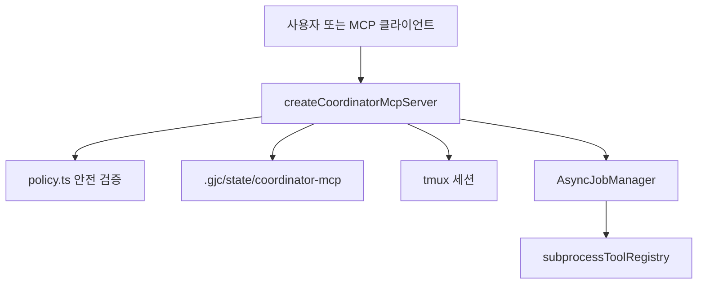

# Coding Agent — Tasks, Subagents, Async Jobs, and Coordination

## 모듈 개요

이 모듈은 GJC가 장시간 작업, 하위 에이전트, tmux 기반 세션, 외부 조정 도구를 안전하게 다루기 위한 실행 기반입니다. 핵심 축은 세 가지입니다.

1. `AsyncJobManager`가 백그라운드 작업의 생명주기, 출력 커서, 완료 전달, 취소, 보존 기간을 관리합니다.
2. `coordinator-mcp`가 MCP 도구 표면을 제공해 세션 등록, 프롬프트 전달, 질문 답변, 상태 보고, 이벤트 감시를 파일 기반 상태로 조정합니다.
3. `subprocessToolRegistry`와 harness control plane 어댑터가 하위 프로세스 도구 이벤트, lease 정리, 지원 harness 경계를 연결합니다.



## 공개 진입점

`packages/coding-agent/src/async/index.ts`는 비동기 작업 계층의 배럴 파일입니다.

```ts
export * from "./job-manager";
export * from "./support";
```

외부 패키지는 보통 `@gajae-code/coding-agent/async/job-manager` 또는 `@gajae-code/coding-agent/async` 경로로 `AsyncJobManager`를 사용합니다. 테스트에서는 다음 패턴이 계약처럼 사용됩니다.

```ts
const manager = new AsyncJobManager({
	onJobComplete: async (jobId, text) => {
		// 완료된 작업 결과를 상위 세션으로 전달합니다.
	},
});

const jobId = manager.register(
	"bash",
	"echo hi",
	async ({ reportProgress, signal }) => {
		await reportProgress("실행 중", { async: { state: "running" } });
		if (signal.aborted) return "취소됨";
		return "완료 결과";
	},
);
```

## AsyncJobManager의 작업 생명주기

`AsyncJobManager.register()`는 작업 종류, 표시용 설명, 실행 함수, 선택 옵션을 받아 작업을 등록합니다. 실행 함수는 `signal`과 `reportProgress`를 사용할 수 있습니다.

주요 상태는 테스트 기준으로 다음 흐름을 가집니다.

- `running`: 등록 직후 실행 중인 상태입니다.
- `completed`: 실행 함수가 문자열 결과를 반환한 상태입니다.
- `failed`: 실행 함수가 예외를 던진 상태입니다. `errorText`에 오류 문자열이 저장됩니다.
- `cancelled`: `cancel(jobId)` 또는 `cancelAll()`로 중단된 상태입니다.

완료된 작업은 `onJobComplete(jobId, text)`로 전달됩니다. 실패한 작업도 오류 텍스트를 완료 전달 경로로 보냅니다. 반면 취소된 작업은 완료 콜백을 호출하지 않습니다.

작업 수 제한은 `maxRunningJobs`로 제어됩니다. 제한을 넘으면 `register()`가 `Background job limit reached` 오류를 던집니다. 완료된 작업은 `retentionMs` 이후 제거되며, `retentionMs: 0`이면 터미널 상태 직후 바로 evict될 수 있습니다.

## 완료 전달과 재시도 제어

`AsyncJobManager`는 작업 실행과 완료 전달을 분리합니다. 실행이 끝나도 `onJobComplete`가 실패하면 pending delivery로 남을 수 있습니다.

관련 메서드는 다음 역할을 합니다.

- `waitForAll()`: 현재 작업 실행이 끝날 때까지 기다립니다.
- `drainDeliveries({ timeoutMs })`: pending delivery가 모두 처리될 때까지 기다립니다.
- `hasPendingDeliveries()`: 아직 전달되지 않은 완료 콜백이 있는지 확인합니다.
- `acknowledgeDeliveries([jobId])`: 특정 작업의 pending delivery를 제거해 재시도를 막습니다.
- `dispose({ timeoutMs })`: 작업, pending delivery, owner cleanup을 정리합니다.

`ownerId` 필터가 있는 경우 전달 대기와 취소는 특정 소유자 범위로 제한됩니다. 예를 들어 하위 에이전트 작업만 기다리고, 메인 작업의 긴 완료 콜백은 건드리지 않는 흐름이 가능합니다.

```ts
await manager.drainDeliveries({
	timeoutMs: 200,
	filter: { ownerId: "3-AuthLoader" },
});
```

## 출력 커서와 owner 격리

`AsyncJobManager`는 작업별 원시 출력 버퍼를 관리합니다.

- `appendOutput(jobId, chunk)`는 프로세스 원시 출력을 누적합니다.
- `readOutputSince(jobId, offset, { ownerId })`는 UTF-8 byte offset 기준으로 새 출력만 반환합니다.
- 반환값은 `text`, `startOffset`, `nextOffset`, `truncated`를 포함합니다.

이 커서는 멀티바이트 문자를 중간에서 깨지 않도록 조정합니다. `"안녕"`처럼 한 글자가 여러 바이트인 문자열도 offset이 코드포인트 중간을 가리키면 유효한 문자 경계로 보정됩니다.

`ownerId`가 맞지 않으면 `readOutputSince()`는 `undefined`를 반환합니다. 이 패턴은 하위 에이전트나 모니터 작업의 출력이 다른 owner에게 노출되지 않도록 하는 기본 격리 장치입니다.

## owner cleanup과 monitor tombstone

작업 소유자 단위 정리는 `registerOwnerCleanup(ownerId, callback)`와 `runOwnerCleanups({ ownerId })`로 처리합니다. cleanup 콜백은 한 번만 실행되며, 하나가 실패해도 같은 owner의 나머지 cleanup은 계속 실행됩니다.

모니터성 작업은 `metadata: { monitor: true }`와 lifecycle hook을 사용할 수 있습니다.

- `onCancel`: 취소 시점에 한 번 실행됩니다.
- `onTerminal`: 완료, 실패, 취소 등 터미널 상태에서 한 번 실행됩니다.
- `onEvict`: job snapshot이 제거될 때 실행됩니다.
- `onTombstonePurge`: tombstone 제거 시점에 실행됩니다.

evict된 모니터 작업은 `getMonitorTombstone(jobId, { ownerId })`로 조회할 수 있고, `purgeMonitorTombstone(jobId, { ownerId })`로 제거할 수 있습니다.

## 하위 프로세스 도구 이벤트 레지스트리

`packages/coding-agent/src/task/subprocess-tool-registry.ts`는 하위 에이전트나 subprocess가 발생시키는 tool event를 해석하는 확장 지점입니다.

핵심 타입은 `SubprocessToolEvent`와 `SubprocessToolHandler<TData>`입니다.

```ts
subprocessToolRegistry.register("example_tool", {
	extractData(event) {
		return event.result?.details;
	},
	shouldTerminate(event) {
		return event.isError !== true;
	},
	renderInline(data, theme) {
		// 스트리밍 중 한 번의 도구 실행 결과를 렌더링합니다.
	},
	renderFinal(allData, theme, expanded) {
		// 누적된 도구 결과를 최종 화면에 렌더링합니다.
	},
});
```

`render.ts`가 `register()`를 호출하는 쪽으로 연결되어 있습니다. 레지스트리는 싱글턴 `subprocessToolRegistry`로 제공되며, `getHandler()`, `hasHandler()`, `getRegisteredTools()`로 등록 상태를 조회합니다.

이 레이어의 목적은 subprocess JSONL 이벤트를 단순 텍스트가 아니라 구조화된 진행 상태와 최종 결과로 승격하는 것입니다. 도구별 종료 조건도 `shouldTerminate()`에 넣어 subprocess를 자동 종료할 수 있습니다.

## Coordinator MCP 정책 계층

`packages/coding-agent/src/coordinator-mcp/policy.ts`는 MCP 조정 서버의 안전 경계입니다. 모든 파일 경로, 작업 디렉터리, mutation 권한은 이 파일을 거쳐야 합니다.

`buildCoordinatorMcpConfig(env)`는 환경 변수에서 다음 설정을 구성합니다.

- `GJC_COORDINATOR_MCP_WORKDIR_ROOTS`: 허용 작업 루트 목록입니다.
- `GJC_COORDINATOR_MCP_MUTATIONS` 또는 `GJC_COORDINATOR_MCP_ENABLE_MUTATION_CLASSES`: 허용 mutation class 목록입니다.
- `GJC_COORDINATOR_MCP_ARTIFACT_BYTE_CAP` 또는 `GJC_COORDINATOR_MCP_ARTIFACT_MAX_BYTES`: artifact 읽기 최대 바이트입니다.
- `GJC_COORDINATOR_MCP_PROFILE`, `GJC_COORDINATOR_MCP_REPO`: 상태 namespace입니다.
- `GJC_COORDINATOR_MCP_STATE_ROOT`: 상태 루트입니다. 기본값은 `.gjc/state/coordinator-mcp`입니다.
- `GJC_COORDINATOR_MCP_SESSION_COMMAND`: 새 tmux 세션을 시작할 때 실행할 명령입니다.

허용 mutation class는 `"sessions"`, `"questions"`, `"reports"`입니다. `"all"`은 세 class를 모두 활성화합니다. 레거시 alias도 지원됩니다.

- `"session"`, `"prompt"` → `"sessions"`
- `"question"` → `"questions"`
- `"report"` → `"reports"`

`assertCoordinatorWorkdir()`와 `assertCoordinatorArtifactPath()`는 요청 경로를 `realpathIfExists()`로 정규화하고, 설정된 root 내부인지 `isInside()`로 확인합니다. 심볼릭 링크나 아직 생성되지 않은 파일 경로도 부모 realpath를 기준으로 검사합니다.

`requireCoordinatorMutation(config, mutationClass, request)`는 두 조건을 모두 요구합니다.

1. 해당 `mutationClass`가 설정에서 활성화되어 있어야 합니다.
2. 요청 인자에 `allow_mutation: true`가 있어야 합니다.

따라서 mutating MCP 도구는 환경 설정과 호출자 의도를 모두 만족해야 실행됩니다.

## Coordinator Safety API

`packages/coding-agent/src/coordinator-mcp/safety.ts`는 정책 계층을 외부에서 쓰기 쉬운 형태로 감싼 API입니다.

`createCoordinatorSafetyPolicy()`는 다음 인터페이스를 반환합니다.

- `config`: 허용 root, artifact byte cap, 활성 mutation class, repo/profile 정보를 담은 안전 설정입니다.
- `resolveWorkdir(input)`: 안전한 작업 디렉터리 문자열을 반환합니다.
- `resolveArtifactPath(input)`: 안전한 artifact 경로를 반환합니다.
- `assertMutationAllowed(mutationClass, args)`: 실패 시 예외를 던지지 않고 `{ ok: false, reason }` 형태로 반환합니다.

`toFailure()`는 `coordinator_mutation_class_disabled:sessions` 같은 오류 메시지를 `{ ok: false, reason: "mutation_class_disabled", detail: "sessions" }`로 변환합니다. 이 API는 CLI doctor, 통합 테스트, 외부 control plane이 예외 기반 정책을 값 기반 결과로 다룰 때 적합합니다.

## Coordinator MCP 서버

`packages/coding-agent/src/coordinator-mcp/server.ts`는 JSON-RPC MCP 서버를 구현합니다. 주요 생성 함수는 `createCoordinatorMcpServer(options)`입니다.

반환 객체는 다음을 제공합니다.

- `config`: `buildCoordinatorMcpConfig()` 결과입니다.
- `callTool(name, args)`: 테스트와 내부 호출용 직접 도구 실행 함수입니다.
- `handleJsonRpc(request)`: MCP JSON-RPC 요청 처리 함수입니다.
- `handle`: `handleJsonRpc` alias입니다.

`runCoordinatorMcpStdio()`는 stdin에서 newline-delimited JSON-RPC 요청을 읽고 stdout으로 응답을 씁니다. CLI 진입점은 `src/commands/mcp-serve.ts`에서 이 함수를 호출합니다.

지원 도구 이름은 `packages/coding-agent/src/coordinator/contract.ts`의 `COORDINATOR_MCP_TOOL_NAMES`에 고정되어 있습니다. 새 도구를 추가하려면 이 배열, `toolSchema()`, `callTool()` 분기를 함께 갱신해야 합니다.

## 세션, 턴, 질문, 보고서 모델

Coordinator MCP는 namespace별 파일 상태를 사용합니다. namespace 경로는 `coordinatorNamespacePath(config)`가 만듭니다.

```text
<stateRoot>/<profile 또는 unscoped-profile>/<repo 또는 unscoped-repo>/
```

주요 파일 그룹은 다음과 같습니다.

- `sessions/*.json`: 등록되거나 시작된 tmux 세션 정보입니다.
- `session-states/*.json`: 세션 상태와 현재/마지막 turn 포인터입니다.
- `turns/*.json`: 프롬프트 단위 durable turn입니다.
- `active-turns/*.json`: 세션별 active turn 포인터입니다.
- `questions/*.json`: 구조화 질문과 답변 상태입니다.
- `reports/*.json`: 완료, 실패, 진행 보고서입니다.
- `events/event-journal.jsonl`: coordinator event journal입니다.
- `events/latest-seq.json`: 마지막 event sequence입니다.

`TurnRecord`는 프롬프트 전달과 완료 상태를 함께 담습니다. `status`는 `"queued"`, `"active"`, `"waiting_for_answer"`, `"completed"`, `"failed"`, `"cancelled"`, `"superseded"` 등을 사용합니다. active 상태는 `ACTIVE_TURN_STATUSES`, 터미널 상태는 `TERMINAL_TURN_STATUSES`로 판정합니다.

## 프롬프트 전달 흐름

`gjc_coordinator_send_prompt`는 다음 순서로 동작합니다.

1. `requireCoordinatorMutation(config, "sessions", args)`로 mutation 권한을 확인합니다.
2. `safeExternalId("session", args.session_id)`로 세션 id를 검증합니다.
3. `sessionFile(sessionId)`에서 세션 JSON을 읽습니다.
4. active turn이 있고 `force`나 `queue`가 없으면 `active_turn_exists`를 반환합니다.
5. `force: true`이면 기존 active turn을 `"superseded"`로 종료합니다.
6. `queue: true`이면 `"queued"` turn을 기록합니다.
7. 즉시 실행이면 `activateTurn()`으로 tmux에 프롬프트를 전달합니다.

`activateTurn()`은 먼저 turn을 `"active"`로 쓰고, `writeActiveTurn()`과 `writeSessionState()`로 세션을 `"running"` 상태로 표시합니다. 이후 `sendTmuxPrompt()`가 `tmux send-keys`를 실행합니다. 성공하면 delivery state는 `"tmux_keys_sent"`, 실패하면 `"unavailable"`이 됩니다.

runtime이 별도 sidecar 파일에 `"completed"` 또는 `"errored"` 상태를 쓰면, `readTurnPayload()`가 이를 감지해 `markTurnTerminalFromSessionState()`로 turn을 터미널 상태로 승격합니다.

## 상태 읽기와 대기

`gjc_coordinator_read_turn`은 `readTurnPayload()`를 호출합니다. 이 함수는 단순 파일 읽기보다 더 많은 정합성 보정을 수행합니다.

- runtime session state가 완료 또는 오류이면 turn을 `"completed"` 또는 `"failed"`로 갱신합니다.
- session 파일이 없거나 tmux 세션이 사라진 active turn은 `markTurnFailedForUnavailableSession()`으로 실패 처리합니다.
- tmux tail을 읽어 `advisory_status`를 붙입니다.
- 완료 turn에 보고 가능한 `final_response.text`나 `artifact_path`가 없으면 `completion_missing_final_response` advisory를 추가합니다.

`gjc_coordinator_await_turn`은 `readTurnPayload()`를 반복 호출하되, 파일 watcher 기반 `waitForTurnStateChange()`로 turn, active-turn, session-state 변경을 기다립니다. timeout은 `boundedTimeoutMs()`로 최대 30초로 제한됩니다.

## 이벤트 저널

`appendCoordinatorEvent()`는 coordinator event를 JSONL에 append합니다. 같은 namespace에 대한 동시 append는 `eventAppendQueues`로 직렬화됩니다. event는 증가하는 `seq`, `event-000000000001` 형태의 id, timestamp, kind, summary를 가집니다.

`gjc_coordinator_watch_events`는 `readCoordinatorEvents()`로 event journal을 읽고, `filterCoordinatorEvents()`로 다음 조건을 적용합니다.

- `after_seq` 이후 event
- 선택적 `session_id`
- 선택적 `event_types`
- `limit`, 최대 100개

새 event가 없고 timeout이 있으면 `waitForCoordinatorEvents()`가 event journal 변경을 long-poll 방식으로 기다립니다.

## Artifact 읽기

`readCoordinatorArtifact(config, { path })`는 안전 root 내부 파일만 읽습니다. `assertCoordinatorArtifactPath()`로 경로를 검증하고, `artifactByteCap + 1` 바이트를 읽어 truncation 여부를 판단합니다.

UTF-8 경계는 `decodeUtf8WithinByteCap()`이 보정합니다. byte cap이 멀티바이트 문자 중간에서 끊기면 유효한 경계까지 뒤로 이동해 디코딩합니다.

반환값은 다음 구조입니다.

```ts
{
	ok: true,
	path: resolved.path,
	text,
	bytes: Buffer.byteLength(text),
	truncated: bytesRead > resolved.byteCap,
}
```

오류는 `{ ok: false, reason }` 형태로 반환됩니다.

## Harness control plane GC 어댑터

`packages/coding-agent/src/harness-control-plane/gc-adapter.ts`는 control plane의 garbage collection 저장소 어댑터입니다.

`harnessLeasesGcAdapter`는 harness session lease를 수집하고 정리합니다.

- `collect(ctx)`는 `listHarnessRootRegistriesForGc()`로 root registry를 읽고, 각 root의 `sessions` 디렉터리를 탐색합니다.
- `readLease()`로 lease를 읽고, `classifyLeaseStatus()`와 `ctx.probe(pid)`로 owner PID 상태를 판단합니다.
- lease owner PID가 죽었고 probe도 `"dead"`이면 `removable: true`로 기록합니다.
- `prune(record, ctx)`는 `reapDeadOwnerArtifacts()`를 호출해 죽은 owner의 artifact를 제거합니다.

`registryEntriesGcAdapter`는 root registry 안의 dangling root 항목을 정리합니다.

- `splitRegistryRoots()`는 registry root마다 `sessionPaths(entry.root, registry.sessionId).dir` 존재 여부를 확인합니다.
- live root가 없으면 `removeHarnessRootRegistryFileForGc()`로 registry 파일을 삭제합니다.
- 일부만 dangling이면 `rewriteHarnessRootRegistryForGc()`로 live root만 남깁니다.

이 어댑터들은 직접 session 실행을 제어하지 않고, 죽은 lease와 dangling registry를 정리하는 보조 계층입니다.

## 지원 harness와 닫힌 seam

`packages/coding-agent/src/harness-control-plane/seams.ts`는 v1에서 지원하는 harness와 아직 구현하지 않은 seam을 명시합니다.

현재 `SUPPORTED_HARNESSES`는 `"gajae-code"` 하나입니다. `isHarnessSupported(harness)`는 이 목록 기준 type guard로 동작합니다.

`unsupportedSeam(name)`은 다음 형태의 실패 결과를 반환합니다.

```ts
{
	ok: false,
	error: `seam_unsupported_in_v1:${name}`,
	evidence: {
		seam: true,
		name,
		supported: SUPPORTED_HARNESSES,
		deferred: DEFERRED_SEAMS,
	},
}
```

`codex-adapter`, `omx-adapter`, `remote-transport`, `global-daemon` 같은 값은 의도적으로 deferred 목록에만 있습니다. 호출자는 이 seam을 암묵적으로 fallback 처리하지 말고, `seam_unsupported_in_v1` 신호를 사용자나 상위 control plane에 명확히 전달해야 합니다.

## 개발 시 주의점

Coordinator MCP의 mutating tool을 추가하거나 수정할 때는 세 가지를 함께 확인해야 합니다.

1. `COORDINATOR_MCP_TOOL_NAMES`에 도구 이름이 포함되는지
2. `toolSchema()`의 입력 스키마가 `allow_mutation`과 필수 필드를 정확히 표현하는지
3. `callTool()`에서 `requireCoordinatorMutation()`과 safe id/path 검증을 먼저 수행하는지

파일 경로를 받는 도구는 직접 `path.resolve()`만 사용하면 안 됩니다. 작업 디렉터리는 `assertCoordinatorWorkdir()`, artifact는 `assertCoordinatorArtifactPath()`를 거쳐야 합니다.

작업 또는 하위 에이전트 출력 기능을 수정할 때는 `ownerId` 격리를 유지해야 합니다. `cancelAll({ ownerId })`, `getRunningJobs({ ownerId })`, `readOutputSince(id, offset, { ownerId })`, `drainDeliveries({ filter: { ownerId } })`는 같은 ownership 모델을 공유합니다.

subprocess 도구 렌더링을 추가할 때는 `SubprocessToolHandler`에 도구별 구조화 데이터를 넣고, UI 렌더링은 `renderInline()`과 `renderFinal()`로 제한하는 편이 좋습니다. JSONL event parsing, 종료 여부, 최종 렌더링을 한곳에 섞지 않는 것이 이 레지스트리의 의도입니다.