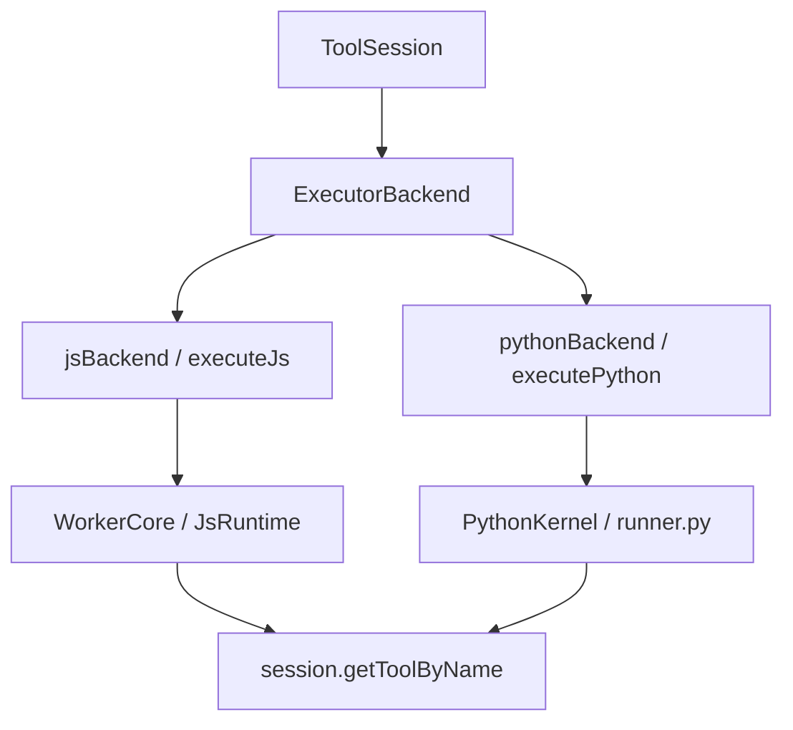

# Coding Agent — Tool Registry and Built-in Tool Backends

## 도구 레지스트리와 내장 도구 백엔드

이 모듈은 Coding Agent가 “도구를 실행한다”는 추상 동작을 여러 실행 백엔드로 연결하는 계층입니다. 핵심 표면은 `ExecutorBackend`이며, 현재 JavaScript와 Python 실행기를 같은 결과 형식으로 맞춥니다. 이 결과는 일반 텍스트 출력, 종료 코드, 취소 여부, 출력 잘림 여부, 아티팩트 ID, 구조화된 표시 출력까지 포함합니다.

주요 구성은 다음 세 축입니다.

- `eval/backend.ts`: 실행 백엔드 공통 인터페이스
- `eval/js/*`: JavaScript 셀 실행, 워커 격리, 도구 브리지, 전역 헬퍼
- `eval/py/*`: Python 커널 실행, 세션 재사용, 도구 브리지, Jupyter 스타일 표시 출력
- `dap/defaults.json`: 디버그 어댑터 기본 레지스트리
- `edit/modes/apply-patch.lark`: `apply_patch` 입력 형식 문법



## 공통 실행 백엔드 계약

`eval/backend.ts`의 `ExecutorBackend`는 언어별 실행기를 같은 형태로 다루기 위한 플러그형 계약입니다.

```ts
export interface ExecutorBackend {
	readonly id: EvalLanguage;
	readonly label: string;
	readonly highlightLang: string;
	isAvailable(session: ToolSession): Promise<boolean>;
	execute(code: string, opts: ExecutorBackendExecOptions): Promise<ExecutorBackendResult>;
}
```

`ExecutorBackendExecOptions`는 한 셀 실행에 필요한 런타임 문맥을 담습니다. 중요한 필드는 다음과 같습니다.

- `cwd`: 실행 기준 디렉터리
- `sessionId`: 커널 또는 VM 세션 재사용 키
- `session`: 실제 도구 레지스트리 접근에 쓰이는 `ToolSession`
- `deadlineMs`: 절대 시간 기준 실행 마감
- `reset`: 기존 세션 상태 초기화 여부
- `artifactPath`, `artifactId`: 큰 출력 저장 위치
- `onChunk`: 스트리밍 텍스트 출력 콜백

`ExecutorBackendResult`는 언어와 무관한 결과 포맷입니다. `output`, `exitCode`, `cancelled`, `truncated`, `displayOutputs`가 여기서 정규화됩니다. 따라서 상위 계층은 JavaScript 워커인지 Python 커널인지 몰라도 같은 방식으로 렌더링과 상태 처리를 할 수 있습니다.

## JavaScript 실행 백엔드

`eval/js/index.ts`는 `ExecutorBackend` 구현체를 내보냅니다. `id`는 `"js"`, `label`은 `"JavaScript"`이며 `isAvailable()`은 항상 `true`를 반환합니다. 실제 실행은 `executeJs()`로 위임됩니다.

`namespaceSessionId()`는 세션 ID 앞에 `js:`를 붙여 Python 세션과 충돌하지 않게 합니다.

### `executeJs()`

`eval/js/executor.ts`의 `executeJs()`는 JavaScript 실행의 입구입니다. 이 함수는 다음 일을 합니다.

1. `OutputSink`를 생성해 스트리밍 출력과 큰 출력 spill 처리를 통합합니다.
2. `deadlineMs` 또는 `timeoutMs`로 `AbortSignal.timeout()`을 구성합니다.
3. `executeInVmContext()`에 코드와 실행 문맥을 넘깁니다.
4. 성공, 취소, 오류를 모두 `JsResult`로 정규화합니다.

취소 또는 타임아웃은 `exitCode: undefined`, `cancelled: true`로 반환됩니다. 일반 실행 오류는 스택 또는 메시지를 출력에 넣고 `exitCode: 1`로 반환합니다.

### VM 세션 관리

`eval/js/context-manager.ts`는 JavaScript VM 세션의 수명과 큐를 관리합니다. 외부에서 쓰는 주요 함수는 다음과 같습니다.

- `executeInVmContext()`: 세션 획득, 큐잉, 단일 실행 처리
- `resetVmContext()`: 특정 세션 제거
- `disposeVmContextsByOwner()`: owner 기준 세션 정리
- `disposeAllVmContexts()`: 모든 VM 컨텍스트 정리
- `liveVmContextCount()`: 살아 있는 VM 수 조회

세션은 `sessions: Map<string, JsSession>`에 저장됩니다. 같은 `sessionKey`의 실행은 `runQueued()`를 통해 순차화됩니다. 동시 실행이 같은 워커 상태를 동시에 건드리지 않도록 하는 핵심 장치입니다.

중단 처리는 강하게 설계되어 있습니다. 실행 중 `AbortSignal`이 발생하면 `runOnce()`의 `onAbort`가 진행 중인 도구 호출을 모두 abort하고 `killSessionFor()`로 워커를 종료합니다. 이는 동기 무한 루프 같은 사용자 코드를 안전하게 끊기 위한 선택입니다.

### 워커와 런타임

`spawnJsWorker()`는 일반적으로 Bun `Worker`를 띄워 `worker-entry.ts`를 실행합니다. 컴파일 바이너리에서는 리터럴 경로를, 개발 환경에서는 `new URL("./worker-entry.ts", import.meta.url).href`를 사용합니다.

`WorkerCore`는 워커 내부 프로토콜 처리기입니다.

- `init`: `JsRuntime` 생성 또는 cwd 갱신
- `run`: 실행 큐에 코드 등록
- `tool-reply`: 호스트에서 돌아온 도구 결과 전달
- `close`: 런타임과 transport 종료

`JsRuntime`은 실제 사용자 코드를 실행합니다. `wrapCode()`로 소스를 변환한 뒤 `indirectEval()`로 실행하고, 반환값은 `displayValue()`로 텍스트, JSON, 이미지 출력으로 변환합니다.

## JavaScript 프렐류드와 헬퍼

`shared/prelude.txt`는 JavaScript 셀에 전역 편의 API를 설치합니다. 실제 구현은 `globalThis.__gjc_helpers__`와 `globalThis.__gjc_call_tool__`에 위임됩니다.

전역에 설치되는 주요 이름은 다음과 같습니다.

- `read(path, opts)`
- `write(path, data)`
- `append(path, content)`
- `sort(text, opts)`
- `uniq(text, opts)`
- `counter(items, opts)`
- `diff(a, b)`
- `tree(path, opts)`
- `env(key, value)`
- `tool.<name>(args)`
- `output(id, opts)`
- `display(value)`
- `print(...)`

`createHelpers()`는 이 함수들의 실제 구현을 만듭니다. 파일 경로는 `resolvePath()`로 현재 `cwd` 기준 절대 경로가 되며, `read()`는 URL 프로토콜 경로와 디렉터리 읽기를 거부합니다. 각 헬퍼는 `ctx.emitStatus()`로 `{ op: "...", ... }` 형태의 구조화 상태 이벤트를 냅니다. 이 이벤트는 `displayOutputs`의 `status`로 상위 렌더러에 전달됩니다.

`tool` 프록시는 임의의 속성 접근을 `globalThis.__gjc_call_tool__(prop, args)`로 바꿉니다. 이 호출은 워커에서 호스트로 `tool-call` 메시지를 보내고, 호스트 쪽 `callSessionTool()`이 `ToolSession.getToolByName()`으로 실제 도구를 찾아 실행합니다.

## JavaScript 소스 변환

`shared/rewrite-imports.ts`는 사용자 코드가 셀 환경에서 자연스럽게 동작하도록 소스를 변환합니다.

핵심 변환은 다음과 같습니다.

- 정적 `import` 선언을 `await __gjc_import__(...)` 호출로 변환
- 동적 `import(...)`를 `__gjc_import__(...)`로 변환
- 최상위 `const`, `let`, `class`를 `var` 또는 `var Foo = class ...` 형태로 낮춰 세션 전역에 유지
- 마지막 표현식을 `__gjc_set_final_expr__(...)`로 감싸 셀 결과로 표시
- 필요한 경우 코드를 async IIFE로 감싸 `await`와 최상위 `return`을 처리
- TypeScript처럼 보이는 문법은 Bun transpiler로 먼저 제거

`JsRuntime`의 `__gjc_import__`는 `resolveImportSpecifier()`를 사용해 import specifier를 현재 세션 `cwd` 기준으로 해석합니다. 로컬 파일 specifier는 `require.cache`를 지워 셀 사이의 파일 수정이 반영되게 합니다.

## Python 실행 백엔드

`eval/py/index.ts`는 Python용 `ExecutorBackend`입니다. `id`는 `"python"`, `label`은 `"Python"`입니다. `isAvailable()`은 `checkPythonKernelAvailability(session.cwd)`를 호출해 Python 런타임을 실제로 확인합니다.

`execute()`는 `PythonExecutorOptions`를 구성한 뒤 `executePython()`으로 위임합니다. 세션 ID에는 `python:` 접두사를 붙입니다. `python.kernelMode` 설정이 있으면 `session.settings.get("python.kernelMode")`로 읽어 `session` 또는 `per-call` 모드를 결정합니다.

### `executePython()`

`eval/py/executor.ts`의 `executePython()`은 Python 실행의 최상위 진입점입니다.

처리 순서는 다음과 같습니다.

1. `cwd`와 `deadlineMs`를 확정합니다.
2. 취소 신호와 남은 시간을 검사합니다.
3. `ensureKernelAvailable()`로 Python 실행 가능 여부를 확인합니다.
4. `ensureToolBridge()`로 Python에서 `tool.*` 호출을 사용할 수 있게 브리지 서버를 준비합니다.
5. `kernelMode`에 따라 `executePerCall()` 또는 `executeOnSession()`을 호출합니다.

`executeOnSession()`은 `sessions` 맵에 저장된 `PythonSession`을 재사용합니다. 세션별 실행은 `runQueued()`로 순차화됩니다. 커널이 죽은 경우 `replaceSessionKernel()`로 한 번 새 커널을 띄우고 재시도합니다.

`executePerCall()`은 매 호출마다 새 `PythonKernel`을 시작하고 실행 후 shutdown합니다. 상태 유지보다 격리가 중요한 상황에 적합합니다.

### Python 커널

`eval/py/kernel.ts`의 `PythonKernel`은 `runner.py`를 서브프로세스로 띄우고 NDJSON 프레임으로 통신합니다. `ensureRunnerScript()`는 번들된 `RUNNER_SCRIPT`를 해시 기반 임시 파일로 캐시해 Python이 일반 파일로 실행할 수 있게 합니다.

주요 흐름은 다음과 같습니다.

- `PythonKernel.start()`가 런타임과 환경을 구성해 subprocess를 시작합니다.
- `execute()`가 코드 실행 요청을 runner에 보냅니다.
- `stdout`, `stderr`, `display`, `result`, `error`, `done` 프레임을 읽어 결과를 누적합니다.
- 취소 시 SIGINT를 보내고, 응답하지 않으면 shutdown으로 escalate합니다.
- shutdown은 `{"type":"exit"}`를 보낸 뒤 필요하면 SIGTERM/SIGKILL로 정리합니다.

`checkPythonKernelAvailability()`는 설정의 shell env를 반영해 Python 경로를 찾고, `${runtime.pythonPath} -c "import sys;sys.exit(0)"`를 실행해 실제 사용 가능성을 확인합니다.

### Python 표시 출력

`eval/py/display.ts`의 `renderKernelDisplay()`는 Jupyter 스타일 MIME bundle을 텍스트와 구조화 출력으로 변환합니다.

지원하는 표시 형식은 다음과 같습니다.

- `application/x-gjc-status`: `{ type: "status", event }`
- `image/png`, `image/jpeg`: `{ type: "image", data, mimeType }`
- `application/json`: `{ type: "json", data }`
- `text/markdown`: Markdown 텍스트 우선
- `text/plain`: 일반 텍스트
- `text/html`: `htmlToBasicMarkdown()`로 기본 Markdown 변환

Python과 JavaScript 모두 `displayOutputs`에 구조화 출력을 싣기 때문에 상위 UI는 언어별 차이를 크게 의식하지 않아도 됩니다.

## 도구 브리지

JavaScript 쪽 브리지는 `eval/js/tool-bridge.ts`에 있습니다. `callSessionTool()`은 다음 단계를 수행합니다.

1. `getTool()`로 `ToolSession.getToolByName(name)`을 호출합니다.
2. 인자가 객체이면 `_i: "js prelude"`를 기본 주입합니다.
3. `tool.execute(toolCallId, normalizedArgs, signal)`을 호출합니다.
4. 텍스트와 이미지를 분리합니다.
5. `summarizeToolResult()`로 상태 이벤트를 생성합니다.
6. 단순 텍스트 결과 또는 `{ text, details, images, hasError }` 객체를 반환합니다.

`toolResultHasError()`는 `result.isError === true` 또는 `result.details.isError === true`를 오류로 간주합니다. 이 정보는 `hasError`와 상태 이벤트의 `error` 필드에 반영됩니다.

Python 쪽은 `executeWithKernel()`에서 `registerPyToolBridge()`를 호출해 실행 동안 브리지 세션을 등록합니다. 커널 환경에는 `PI_TOOL_BRIDGE_URL`, `PI_TOOL_BRIDGE_TOKEN`, `PI_TOOL_BRIDGE_SESSION`이 들어가며, Python 프렐류드의 도구 호출이 이 브리지로 호스트 도구에 접근합니다.

## DAP 기본 레지스트리

`dap/defaults.json`은 디버그 도구가 사용할 Debug Adapter Protocol 백엔드 기본값을 정의합니다. 각 항목은 어댑터 이름을 키로 하고 다음 정보를 가집니다.

- `command`: 실행할 어댑터 명령
- `args`: 기본 인자
- `languages`: 연결되는 언어 ID
- `fileTypes`: 파일 확장자
- `rootMarkers`: 프로젝트 루트 탐지 마커
- `launchDefaults`: launch 요청 기본값
- `attachDefaults`: attach 요청 기본값
- `connectMode`: 필요한 경우 소켓 연결 방식

예를 들어 `debugpy`는 Python 파일과 `pyproject.toml`, `setup.py`, `requirements.txt`, `Pipfile` 루트 마커를 사용하며, launch 기본값에 `justMyCode: false`와 `stopOnEntry: true`를 둡니다. `dlv`는 Go용이며 `connectMode: "socket"`을 지정합니다. `js-debug-adapter`는 JavaScript와 TypeScript용 `pwa-node` 타입을 기본으로 둡니다.

`dap/index.ts`는 `client`, `config`, `session`, `types`를 barrel export합니다. 디버그 실행 흐름에서는 `src/tools/debug.ts`의 `execute()`가 `dap/session.ts`의 `launch()`를 호출하고, `dap/client.ts`의 `initialize()`와 `sendRequest()`를 거쳐 `ToolAbortError`로 취소 경로가 이어집니다.

## `apply_patch` 문법

`edit/modes/apply-patch.lark`는 패치 입력의 문법을 정의합니다. 최상위 형식은 다음과 같습니다.

```text
*** Begin Patch
... 하나 이상의 hunk ...
*** End Patch
```

지원하는 hunk는 세 종류입니다.

- `*** Add File: <filename>`: `+`로 시작하는 라인들을 새 파일 내용으로 사용
- `*** Delete File: <filename>`: 파일 삭제
- `*** Update File: <filename>`: 변경 컨텍스트와 `+`, `-`, 공백 라인 기반 수정
- `*** Move to: <filename>`: update hunk 안에서 파일 이동 지정
- `*** End of File`: EOF 표시

이 문법은 자유 텍스트 패치를 구조화된 편집 입력으로 제한합니다. 덕분에 편집 도구는 명령형 shell patch보다 예측 가능한 파싱 경계를 가질 수 있습니다.

## 수명 관리와 정리

이 모듈은 장기 실행 리소스를 많이 다루므로 owner 기반 정리 API가 중요합니다.

JavaScript 쪽:

- `disposeVmContextsByOwner(ownerId)`
- `disposeAllVmContexts()`
- `resetVmContext(sessionKey)`

Python 쪽:

- `disposeKernelSessionsByOwner(ownerId)`
- `disposeAllKernelSessions()`
- `resetSession(sessionId)`

JavaScript VM은 `registerResourceOwner("js-vm-contexts", ...)`로 프로세스 수명 정리에 등록됩니다. Python 커널은 shutdown이 확인되지 않으면 경고를 남기고 세션 맵에 다시 보존합니다. 이는 정리 실패를 조용히 삼켜 커널 누수를 숨기지 않기 위한 설계입니다.

## 기여 시 주의할 점

새 실행 백엔드를 추가하려면 먼저 `ExecutorBackend` 계약을 맞춰야 합니다. 상위 계층은 `output`, `exitCode`, `cancelled`, `truncated`, `displayOutputs`에 의존하므로, 언어별 특수 결과를 이 형식으로 정규화해야 합니다.

JavaScript 전역 API를 바꿀 때는 `prelude.txt`, `createHelpers()`, `JsRuntime.#install()`, `callSessionTool()`의 역할을 분리해서 유지해야 합니다. 프렐류드는 얇은 별칭 계층이고, 파일 접근과 상태 이벤트는 helper 쪽 책임이며, 실제 도구 실행은 `ToolSession` 브리지 책임입니다.

Python 실행 변경은 세션 재사용, 취소, 커널 사망 복구를 함께 고려해야 합니다. `executeOnSession()`은 커널이 죽으면 한 번 교체 후 재시도하는 정책을 갖고 있고, 타임아웃은 커널 interrupt와 kill escalation을 구분합니다.

출력 처리에서는 `OutputSink`를 우회하지 않는 것이 중요합니다. 이 계층이 출력 길이 제한, head byte 설정, 아티팩트 spill, 스트리밍 콜백을 담당합니다. rich display는 텍스트 출력과 별도인 `displayOutputs`에 넣어야 합니다.