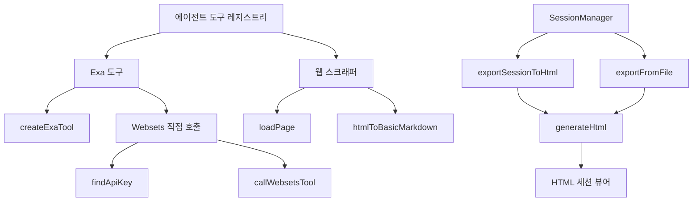
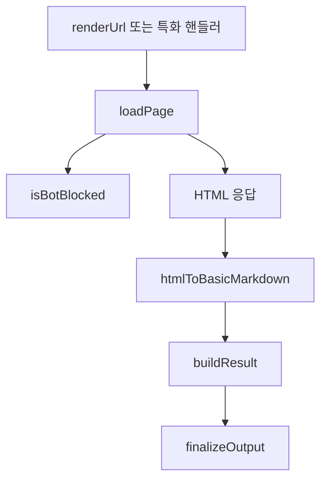

# Coding Agent — Web, Research, SSH, Export, and External Protocols

## 개요

이 모듈은 코딩 에이전트가 외부 세계와 상호작용하는 경계를 묶는다. 주요 표면은 Exa 기반 웹/리서치 도구, 웹 페이지 스크래퍼, 런타임 MCP/Smithery 연동, SSH 실행 지원, 세션 HTML 내보내기, 사용자 정의 공유 스크립트다.

핵심 설계는 두 가지다.

1. 외부 호출은 도구 단위로 감싼다. 예를 들어 `exa_search`, `exa_researcher_start`, `webset_create`는 모두 `CustomTool` 형태로 노출된다.
2. 세션 기록은 재생 가능한 데이터로 보존한다. `exportSessionToHtml()`과 `exportFromFile()`은 `SessionManager`에서 대화 트리, 메시지, 도구 호출 결과를 읽어 독립 실행형 HTML로 변환한다.



## Exa 도구 집합

`packages/coding-agent/src/exa/index.ts`는 Exa 관련 도구의 공개 진입점이다.

```ts
export const exaTools: CustomTool<any, ExaRenderDetails>[] = [
	...searchTools,
	...researcherTools,
	...websetsTools,
];
```

실제 노출 목록은 주석의 개수 설명이 아니라 `searchTools`, `researcherTools`, `websetsTools` 세 배열이 기준이다. 새 Exa 도구를 추가할 때는 개별 파일에 도구를 정의한 뒤 `index.ts`의 집계 배열에 포함되는지 확인해야 한다.

공개 export는 다음 역할을 한다.

| export | 역할 |
| --- | --- |
| `exaTools` | 전체 Exa 도구 배열. 기존 호출부와의 호환성을 위한 정적 export |
| `searchTools` | 기본 웹 검색 도구 |
| `researcherTools` | 비동기 리서치 시작/폴링 도구 |
| `websetsTools` | Websets CRUD, 검색, enrichment, monitor 도구 |
| `renderExaCall`, `renderExaResult` | Exa 도구 호출/결과 렌더링 |
| `ExaRenderDetails`, `ExaSearchResponse`, `ExaSearchResult`, `MCPToolWrapperConfig` | Exa 도구 렌더링과 응답 타입 |

## 검색 도구

`packages/coding-agent/src/exa/search.ts`는 현재 `exa_search` 하나를 정의한다.

```ts
const exaSearchTool = createExaTool(
	"exa_search",
	"Exa Search",
	"...",
	z.object({
		query: z.string().describe("search query"),
		type: z.enum(["keyword", "neural", "auto"]).optional(),
		include_domains: z.array(z.string()).optional(),
		exclude_domains: z.array(z.string()).optional(),
		start_published_date: z.string().optional(),
		end_published_date: z.string().optional(),
		use_autoprompt: z.boolean().optional(),
		text: z.boolean().optional(),
		highlights: z.boolean().optional(),
		num_results: z.number().int().min(1).max(100).optional(),
	}),
	"web_search_exa",
);
```

`createExaTool()`은 GJC 내부 도구 이름과 Exa MCP 서버의 실제 도구 이름을 연결한다. 여기서는 내부 이름 `exa_search`가 MCP 도구 `web_search_exa`로 매핑된다.

`exa_search`의 입력 스키마는 `zod/v4`로 정의된다. 검색 방식은 `keyword`, `neural`, `auto` 중 하나이며, 도메인 포함/제외, 발행일 범위, 본문 텍스트 포함 여부, 하이라이트 포함 여부, 결과 개수 제한을 지원한다.

개발자가 수정할 때 주의할 점은 `num_results`처럼 외부 API 제한이 있는 값은 스키마에서 먼저 제한해야 한다는 점이다. 이 도구는 모델이 직접 호출하는 표면이므로 런타임 오류보다 입력 검증 실패가 더 안전하다.

## 비동기 리서처 도구

`packages/coding-agent/src/exa/researcher.ts`는 긴 리서치 작업을 시작하고 나중에 조회하는 두 단계 프로토콜을 제공한다.

| 내부 도구 이름 | MCP 도구 이름 | 역할 |
| --- | --- | --- |
| `exa_researcher_start` | `deep_researcher_start` | 리서치 작업 시작, `task_id` 반환 |
| `exa_researcher_poll` | `deep_researcher_check` | `task_id`로 상태와 결과 조회 |

`exa_researcher_start`는 `query`, `depth`, `breadth`를 받는다. `depth`와 `breadth`는 각각 1에서 5 사이의 정수로 제한된다.

`exa_researcher_poll`은 `task_id`만 받는다. 설명 문자열 기준으로 상태는 `pending`, `running`, `completed`, `failed` 중 하나를 반환할 수 있으며, 완료된 경우 결과가 함께 온다.

두 도구 모두 `createExaTool(..., { formatResponse: false })`로 생성된다. 즉, 결과를 일반 검색 응답처럼 포맷하지 않고 Exa MCP 응답을 더 직접적으로 전달하는 흐름이다. 비동기 작업 상태나 원본 결과 구조를 보존해야 하므로 검색 도구와 같은 후처리를 적용하지 않는다.

## Websets 도구

`packages/coding-agent/src/exa/websets.ts`는 Exa Websets API를 직접 호출하는 도구들을 정의한다. 검색/리서처 도구와 달리 `createExaTool()`을 사용하지 않고, 파일 내부의 `createWebsetTool()` 헬퍼로 `CustomTool` 객체를 직접 만든다.

```ts
function createWebsetTool(
	name: string,
	label: string,
	description: string,
	parameters: TSchema,
	mcpToolName: string,
): CustomTool<TSchema, ExaRenderDetails> {
	return {
		name,
		label,
		description,
		parameters,
		async execute(_toolCallId, params, _onUpdate, _ctx, _signal) {
			const apiKey = findApiKey();
			if (!apiKey) {
				return {
					content: [{ type: "text", text: "Error: EXA_API_KEY not found" }],
					details: { error: "EXA_API_KEY not found", toolName: name },
				};
			}

			const result = await callWebsetsTool(apiKey, mcpToolName, params as Record<string, unknown>);
			return {
				content: [{ type: "text", text: JSON.stringify(result, null, 2) }],
				details: { raw: result, toolName: name },
			};
		},
	};
}
```

실행 흐름은 명확하다.

1. `findApiKey()`로 `EXA_API_KEY`를 찾는다.
2. 키가 없으면 텍스트 오류와 `details.error`를 반환한다.
3. 키가 있으면 `callWebsetsTool(apiKey, mcpToolName, params)`를 호출한다.
4. 성공 결과는 JSON 문자열로 `content`에 넣고 원본 객체는 `details.raw`에 보존한다.
5. 예외는 메시지로 변환해 `Error: ...` 형식으로 반환한다.

Websets 도구는 다음 범주로 나뉜다.

| 범주 | 도구 |
| --- | --- |
| Webset CRUD | `webset_create`, `webset_list`, `webset_get`, `webset_update`, `webset_delete` |
| Item 조회 | `webset_items_list`, `webset_item_get` |
| Search | `webset_search_create`, `webset_search_get`, `webset_search_cancel` |
| Enrichment | `webset_enrichment_create`, `webset_enrichment_get`, `webset_enrichment_update`, `webset_enrichment_delete`, `webset_enrichment_cancel` |
| Monitoring | `webset_monitor_create` |

새 Websets 작업을 추가할 때는 외부 MCP 도구 이름을 마지막 인자로 정확히 전달해야 한다. 예를 들어 `webset_search_cancel`은 내부 도구 이름이고, 실제 MCP 도구 이름은 `cancel_search`다.

## 웹 스크래퍼와 가져오기 흐름

웹 스크래퍼 계층은 URL별 특화 처리와 공통 HTML 변환을 분리한다. 호출 그래프상 `handleDevTo()`, `handleReadTheDocs()`, `renderGitLabMR()` 같은 핸들러는 `htmlToBasicMarkdown()`로 HTML을 Markdown에 가까운 텍스트로 바꾼다. `handleGoPkg()`와 `handleNpm()`은 `buildResult()`를 통해 공통 결과 형태를 만든다.

공통 페이지 로딩은 `loadPage()`가 담당한다. `loadPage()`는 `isBotBlocked()`를 호출해 차단 페이지 여부를 감지하며, 중단 가능한 도구 흐름에서는 `ToolAbortError`와 연결된다. `handleDiscourse()`, `handleTwitter()`, `fetchBinary()` 등은 이 중단 오류 경로를 사용한다.

대표 흐름은 다음과 같다.



특화 핸들러는 사이트 구조를 알고 있는 경우에만 추가하는 것이 좋다. 예를 들어 `renderGitHubRepo()`는 `fetchGitHubApi()`를 사용하고, `renderFile()`은 `formatRepoMarkdown()`을 사용한다. 단순 HTML 문서라면 기존 `loadPage()`와 `htmlToBasicMarkdown()` 경로를 재사용하는 편이 유지보수 비용이 낮다.

## 외부 프로토콜과 Runtime MCP

Runtime MCP 영역은 외부 MCP 서버 연결, Smithery 레지스트리 검색, 인증 상태를 다룬다. 제공된 호출 그래프에서 확인되는 주요 함수는 다음과 같다.

| 함수 | 역할 |
| --- | --- |
| `searchSmitheryRegistry()` | Smithery 레지스트리를 검색하고 실패 시 `SmitheryRegistryError` 사용 |
| `fetchServerDetailsFromEntry()` | 검색 엔트리에서 서버 상세 정보를 가져오기 위해 `fetchServerDetails()` 호출 |
| `toConfigName()` | 정규화된 이름을 설정 이름으로 변환하기 위해 `toConfigNameFromQualifiedName()` 호출 |
| `getSmitheryAuthPath()` | `getAgentDir()` 아래 Smithery 인증 저장 경로 계산 |
| `createSmitheryCliAuthSession()` | 브라우저 로그인 흐름 시작 |
| `pollSmitheryCliAuthSession()` | CLI 인증 세션 완료 여부 폴링 |
| `saveSmitheryApiKey()` | API 키 로그인 결과 저장 |
| `clearSmitheryApiKey()` | 로그아웃 시 저장된 키 제거 |

연결 생명주기는 `connectServers()`, `disconnectServer()`, `getConnectionStatus()`를 중심으로 검증된다. 테스트에서는 `StdioTransport`, `HttpTransport`, `startSSEListener()`, `close()`가 사용된다. 이 계층을 수정할 때는 연결 생성뿐 아니라 종료, 상태 조회, 재연결, 실패 후 정리까지 함께 봐야 한다.

## SSH 지원

SSH 관련 흐름은 `src/ssh/connection-manager.ts`의 함수들로 노출된다. 호출 그래프상 테스트는 다음 함수를 직접 검증한다.

| 함수 | 역할 |
| --- | --- |
| `supportsSshControlMaster()` | 현재 환경이나 대상 설정에서 SSH ControlMaster 사용 가능 여부 판단 |
| `buildRemoteCommand()` | 원격에서 실행할 명령 문자열 구성 |

SSH 코드는 외부 프로세스와 원격 쉘 경계를 다루므로 문자열 조합이 특히 중요하다. `buildRemoteCommand()`를 수정할 때는 명령 인자, 작업 디렉터리, 쉘 quoting, ControlMaster 옵션의 상호작용을 테스트해야 한다.

## HTML 세션 내보내기

`packages/coding-agent/src/export/html/index.ts`는 세션 JSONL을 브라우저에서 볼 수 있는 HTML 파일로 내보내는 서버 측 생성 로직이다.

주요 공개 함수는 두 개다.

| 함수 | 입력 | 용도 |
| --- | --- | --- |
| `exportSessionToHtml(sm, state?, options?)` | 열린 `SessionManager`, 선택적 `AgentState` | 현재 실행 중인 세션을 내보낸다 |
| `exportFromFile(inputPath, options?)` | 세션 JSONL 파일 경로 | 저장된 세션 파일을 독립적으로 내보낸다 |

`exportSessionToHtml()`은 `SessionManager`에서 `getSessionFile()`, `getHeader()`, `getEntries()`, `getLeafId()`를 호출한다. `AgentState`가 있으면 `systemPrompt`와 도구 목록도 HTML 데이터에 포함한다.

```ts
const sessionData: SessionData = {
	header: sm.getHeader(),
	entries: sm.getEntries(),
	leafId: sm.getLeafId(),
	systemPrompt: state?.systemPrompt.join("\n\n"),
	tools: state?.tools?.map(t => ({ name: t.name, description: t.description })),
};
```

`exportFromFile()`은 `SessionManager.open(inputPath)`로 파일을 열고, 작업이 끝나면 `finally`에서 `sm.close()`를 호출한다. 파일이 없을 때는 `isEnoent(err)`를 사용해 `File not found: ...` 오류로 매핑한다.

HTML 생성은 내부 함수 `generateHtml()`이 담당한다.

1. `generateThemeVars(themeName)`로 CSS custom properties를 만든다.
2. `sessionData`를 JSON 문자열로 만들고 Base64로 인코딩한다.
3. `TEMPLATE`에서 `<theme-vars/>`와 `{{SESSION_DATA}}`를 치환한다.
4. `Bun.write(outputPath, html)`로 파일을 쓴다.

치환은 문자열이 아니라 함수 replacement를 사용한다. 이는 CSS나 Base64 데이터 안에 `$`, `$n`, `{{SOURCE_CODE}}` 같은 문자열이 있어도 `String.replace()`의 치환 패턴으로 오해되지 않게 하기 위한 방어다.

## 테마 색상 계산

HTML export는 TUI 테마를 그대로 복사하지 않고, export 문서에 맞는 배경색을 파생한다.

| 함수 | 역할 |
| --- | --- |
| `parseColor()` | `#rrggbb` 또는 `rgb(r, g, b)` 문자열을 RGB 객체로 변환 |
| `getLuminance()` | 상대 휘도 계산 |
| `adjustBrightness()` | RGB 각 채널에 factor 적용 |
| `deriveExportColors()` | 기본 메시지 배경색에서 `pageBg`, `cardBg`, `infoBg` 파생 |
| `generateThemeVars()` | 테마 색상과 export 전용 색상을 CSS 변수 문자열로 생성 |

`generateThemeVars()`는 `getResolvedThemeColors(themeName)`와 `getThemeExportColors(themeName)`를 호출한다. 테마가 export 전용 색상 `pageBg`, `cardBg`, `infoBg`를 제공하면 그 값을 우선 사용하고, 없으면 `deriveExportColors()` 결과를 사용한다.

## HTML 템플릿 구조

`template.html`, `template.css`, `template.js`는 publish 시점에 `template.generated`로 묶이는 정적 템플릿이다. 서버 측 코드는 템플릿에 세션 데이터와 테마 변수만 주입하고, 실제 렌더링은 브라우저에서 수행된다.

`template.js`의 주요 책임은 다음과 같다.

| 영역 | 주요 함수/구조 |
| --- | --- |
| 데이터 로딩 | `atob()`, `TextDecoder`, `JSON.parse`로 Base64 세션 데이터 복원 |
| 트리 구성 | `buildTree()`, `buildActivePathIds()`, `getPath()`, `flattenTree()` |
| 필터링 | `filterNodes()`, `getSearchableText()`, `extractContent()` |
| 트리 표시 | `getTreeNodeDisplayHtml()`, `renderTree()`, `forceTreeRerender()` |
| 메시지 표시 | `renderEntry()` |
| 도구 호출 표시 | `renderToolCall()`, `TOOL_RENDERERS` |
| 공유 링크 | `buildShareUrl()`, `copyToClipboard()`, `renderCopyLinkButton()` |

브라우저 쪽 렌더러는 세션을 단순 리스트로 보여주지 않는다. `parentId`를 기반으로 대화 분기 트리를 구성하고, `leafId`와 `targetId` URL 파라미터로 특정 분기와 메시지에 직접 연결할 수 있다.

도구 호출 렌더링은 `TOOL_RENDERERS` 맵으로 분기한다. 예를 들어 `bash`는 `renderBash()`, `read`는 `renderRead()`, `edit`는 `renderEdit()`, `web_search`는 `renderWebSearch()`, `fetch`는 `renderFetch()`가 처리한다. 알 수 없는 도구는 `renderGenericTool()`로 JSON 인자와 결과 텍스트를 표시한다.

## 사용자 정의 공유 스크립트

`packages/coding-agent/src/export/custom-share.ts`는 기본 공유 방식 대신 사용자가 직접 정의한 공유 핸들러를 로드한다.

검색 경로는 `getAgentDir()` 아래의 다음 파일명이다.

1. `share.ts`
2. `share.js`
3. `share.mjs`

`getCustomSharePath()`는 이 순서대로 파일 존재 여부를 확인하고, 처음 발견한 경로를 반환한다. 없으면 `null`을 반환한다.

`loadCustomShare()`는 해당 파일을 동적 import하고 default export를 확인한다.

```ts
const module = await import(scriptPath);
const fn = module.default;

if (typeof fn !== "function") {
	throw new Error("share script must export a default function");
}

return { path: scriptPath, fn };
```

공유 함수 타입은 다음과 같다.

```ts
export type CustomShareFn = (
	htmlPath: string,
) => Promise<CustomShareResult | string | undefined>;
```

반환값은 URL 문자열, `{ url, message }` 객체, 또는 `undefined`가 될 수 있다. 스크립트가 모든 처리를 직접 수행하는 경우 `undefined`를 반환할 수 있도록 설계되어 있다.

## 기여 시 확인할 연결점

Exa 도구를 추가하거나 수정할 때는 `CustomTool<TSchema, ExaRenderDetails>` 형태를 유지해야 한다. 검색/리서처 도구는 `createExaTool()` 경로를 우선 사용하고, Websets처럼 별도 인증/호출 방식이 필요한 경우에만 직접 `execute()`를 구현한다.

웹 스크래퍼를 수정할 때는 `loadPage()`, `htmlToBasicMarkdown()`, `buildResult()`, `finalizeOutput()` 같은 공통 경로를 먼저 확인한다. 사이트별 핸들러를 추가하더라도 중단 처리와 bot-block 감지는 기존 공통 함수 흐름을 따르는 편이 안전하다.

HTML export를 수정할 때는 서버 측 `generateHtml()`과 브라우저 측 `template.js`를 분리해서 생각해야 한다. `exportSessionToHtml()`과 `exportFromFile()`은 데이터 수집과 파일 쓰기만 담당하고, 트리 렌더링, 필터링, 도구별 표시, 딥링크 복사는 템플릿 JavaScript가 담당한다.

Runtime MCP나 SSH 코드를 수정할 때는 외부 연결의 시작/종료/상태 조회가 모두 관찰 가능한 계약이다. `connectServers()`, `disconnectServer()`, `getConnectionStatus()`, `supportsSshControlMaster()`, `buildRemoteCommand()` 관련 테스트를 함께 확인해야 한다.