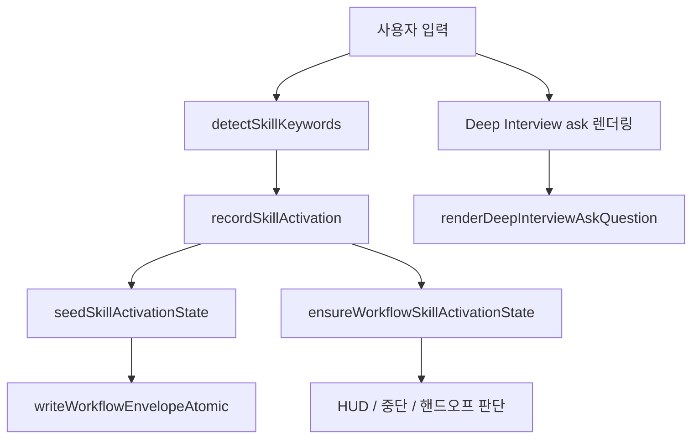

# Coding Agent — Workflow Skills and State Runtime

## 모듈 개요

이 모듈은 GJC의 기본 워크플로 스킬, 스킬 상태 런타임, Deep Interview 전용 렌더링, 그리고 번들된 Grok Build 확장을 연결합니다. 핵심 책임은 다음 네 가지입니다.

- 기본 워크플로 정의를 제품 표면에 고정합니다: `deep-interview`, `ralplan`, `team`, `ultragoal`
- `.gjc` 기반 워크플로 상태를 훅과 런타임이 추적할 수 있게 합니다
- Deep Interview 질문과 진행 보고를 일반 Markdown이 아니라 구조화된 TUI 컴포넌트로 렌더링합니다
- Grok Build 공급자를 번들 확장으로 등록하고 xAI Responses API에 맞게 요청 페이로드를 보정합니다



## 기본 GJC 워크플로 정의

`packages/coding-agent/src/defaults/gjc-defaults.ts`는 GJC가 기본으로 노출하는 워크플로 표면을 정의합니다.

```ts
export const DEFAULT_GJC_DEFINITION_NAMES = ["deep-interview", "ralplan", "team", "ultragoal"] as const;
```

이 배열은 제품 계약의 중심입니다. 기본 워크플로는 정확히 네 개이며, 다른 기본 스킬이나 기본 역할 에이전트는 여기서 노출하지 않습니다. `getDefaultGjcAgentDefinitions()`가 빈 배열을 반환하는 것도 의도된 동작입니다.

기본 정의는 `DEFAULT_GJC_DEFINITIONS`에 저장됩니다. 이 목록에는 공개 워크플로 스킬과 내부 프롬프트 조각이 함께 들어 있습니다.

- `kind: "skill"`: `/skill:deep-interview` 같은 공개 스킬 정의
- `kind: "skill-fragment"`: Deep Interview나 Ultragoal 내부에서만 로드되는 보조 프롬프트

예를 들어 Deep Interview는 다음 내부 조각을 갖습니다.

- `auto-research-greenfield.md`
- `auto-answer-uncertain.md`
- `lateral-review-panel.md`

Ultragoal은 다음 조각을 갖습니다.

- `ai-slop-cleaner.md`

이 조각들은 공개 스킬이 아닙니다. `getEmbeddedDefaultGjcSkills()`는 `kind === "skill"`인 항목만 필터링해 임베디드 스킬 목록으로 반환합니다. 반대로 `getEmbeddedDefaultGjcSkillFragments(parentSkillName)`은 특정 부모 스킬에 속한 내부 조각만 반환합니다.

## 기본 정의 설치 흐름

`installDefaultGjcDefinitions()`는 번들 정의를 실제 GJC 에이전트 디렉터리에 설치하거나 검사합니다.

```ts
export async function installDefaultGjcDefinitions(
	options: InstallDefaultGjcDefinitionsOptions = {},
): Promise<DefaultGjcDefinitionInstallResult>
```

기본 대상 루트는 `getAgentDir()`입니다. `targetRoot` 옵션이 있으면 해당 위치를 사용합니다.

동작은 옵션에 따라 달라집니다.

- `check: true`: 파일을 쓰지 않고 `missing`, `matching`, `different` 상태만 계산합니다
- `force: true`: 기존 파일이 있어도 번들 내용을 씁니다
- 기본 동작: 기존 파일이 있으면 `skipped`, 없으면 `written`

파일 비교는 `readExistingText()`가 담당합니다. 파일이 없을 때는 `isEnoent(error)`를 통해 `undefined`를 반환하고, 그 외 오류는 그대로 던집니다.

결과 요약은 `summarizeInstallResult()`와 `countStatus()`가 만듭니다. 반환값에는 전체 파일 수와 상태별 개수, 그리고 각 파일의 경로와 상태가 포함됩니다.

## 임베디드 스킬 메타데이터

`getEmbeddedDefaultGjcSkills()`는 Markdown frontmatter를 읽어 스킬 메타데이터를 구성합니다.

```ts
const { frontmatter } = parseFrontmatter(definition.content, {
	source: `embedded:gjc/${definition.relativePath}`,
	level: "warn",
});
```

반환되는 `EmbeddedDefaultGjcSkill`에는 다음 정보가 들어갑니다.

- `name`: `deep-interview`, `ralplan`, `team`, `ultragoal` 중 하나
- `description`: frontmatter의 `description` 또는 기본 설명
- `filePath`: `embedded:gjc/skills/<name>/SKILL.md` 형태의 가상 경로
- `baseDir`: 임베디드 스킬 기준 디렉터리
- `source`: 항상 `"bundled:default"`
- `hide`: frontmatter의 `hide: true` 여부
- `content`: 실제 스킬 Markdown 본문

이 함수는 `skills-cli.ts`의 `getEmbeddedSkill()`과 `listEmbeddedSkills()`, 그리고 SDK의 `withEmbeddedDefaultGjcSkills()`에서 사용됩니다. 즉 CLI와 SDK 모두 같은 번들 정의를 공유합니다.

## 스킬 상태 런타임과 훅 연결

워크플로 상태는 사용자 입력을 해석하는 훅에서 시작됩니다. 호출 그래프상 핵심 흐름은 다음과 같습니다.

1. `dispatchGjcNativeSkillHook()`가 네이티브 스킬 훅 진입점을 처리합니다.
2. `detectSkillKeywords()`가 명시적 스킬 호출을 찾습니다.
3. `parseExplicitSkillInvocations()`가 `/skill:<name>` 또는 관련 호출 형식을 분해합니다.
4. `recordSkillActivation()`이 활성 스킬을 기록합니다.
5. `seedSkillActivationState()`가 초기 상태 봉투를 만듭니다.
6. `writeWorkflowEnvelopeAtomic()`이 `.gjc` 상태를 원자적으로 기록합니다.
7. 이후 세션 동기화에서는 `ensureWorkflowSkillActivationState()`가 현재 컨텍스트와 상태를 맞춥니다.

이 설계의 핵심은 스킬 활성화가 단순 문자열 플래그가 아니라 워크플로 봉투로 저장된다는 점입니다. 그래서 HUD, 중단 처리, 핸드오프 요구 여부, stale 상태 해제 같은 후속 판단이 같은 상태 원천을 사용할 수 있습니다.

`buildSkillStopOutput()`은 스킬 종료 시 출력할 내용을 구성하며, `isHandoffRequiredSkill()`을 통해 핸드오프가 필요한 스킬인지 판단합니다. Deep Interview와 Ralplan처럼 승인 게이트가 있는 워크플로는 상태만 끝내는 것이 아니라 다음 단계로 넘길 수 있는지까지 확인해야 합니다.

## Deep Interview 렌더링 미들웨어

`packages/coding-agent/src/deep-interview/render-middleware.ts`는 Deep Interview의 텍스트 프로토콜을 TUI 컴포넌트로 바꾸는 계층입니다. 이 파일은 상태를 변경하지 않습니다. 입력 문자열을 파싱하고, 인식 가능한 Deep Interview 형식이면 `Container`, `Text`, `Markdown`, `Spacer`로 구성된 렌더 트리를 반환합니다.

주요 공개 함수는 네 개입니다.

```ts
export function renderDeepInterviewAssistantText(text: string, uiTheme: Theme): Component | null
export function renderDeepInterviewAskQuestion(question: string, uiTheme: Theme): Component | null
export function isDeepInterviewAskQuestion(question: string): boolean
export function formatDeepInterviewSelectorPrompt(question: string): string | null
```

### 파싱 모델

렌더러는 입력을 `DeepInterviewModel` 유니언으로 정규화합니다.

```ts
type DeepInterviewModel =
	| RoundQuestionModel
	| TopologyQuestionModel
	| ProgressModel
	| ThresholdModel;
```

각 모델은 Deep Interview 출력의 특정 종류에 대응합니다.

- `RoundQuestionModel`: `Round 1 | Component: ... | Targeting: ...` 형식의 질문
- `TopologyQuestionModel`: `Round 0 | Topology confirmation | Ambiguity: not scored yet` 형식의 토폴로지 확인
- `ProgressModel`: `Round N complete.`로 시작하는 진행 보고
- `ThresholdModel`: `Deep Interview threshold: ... (source: ...)` 시작 메시지

`parseDeepInterview()`는 이 네 파서를 순서대로 시도합니다.

```ts
return parseProgress(text) ?? parseTopologyQuestion(text) ?? parseRoundQuestion(text) ?? parseThreshold(text);
```

진행 보고를 먼저 파싱하는 이유는 `Round N complete.` 형식이 질문과 다른 렌더링 경로를 가져야 하기 때문입니다.

### 질문 렌더링

`renderDeepInterviewAskQuestion()`은 Round 0 토폴로지 질문이나 일반 라운드 질문만 렌더링합니다.

```ts
const model = parseTopologyQuestion(question) ?? parseRoundQuestion(question);
if (!model) return null;
return renderModel(model, uiTheme);
```

일반 라운드 질문은 다음 정보를 표시할 수 있습니다.

- 라운드 번호
- 현재 모호성
- 대상 컴포넌트
- 모드
- 타깃 차원
- 왜 지금 이 질문을 하는지
- 실제 질문 본문

`renderModel()`은 `addLabel()`을 반복 호출해 섹션을 구성합니다. 값이 없는 항목은 렌더링하지 않기 때문에, 과거 형식과 최신 형식을 모두 수용할 수 있습니다.

### 진행 보고 렌더링

`renderDeepInterviewAssistantText()`는 진행 보고와 threshold 메시지만 렌더링합니다.

```ts
const model = parseDeepInterview(text);
if (!model || model.kind === "round-question" || model.kind === "topology-question") return null;
return renderModel(model, uiTheme);
```

질문은 `ask` 도구 렌더 경로에서 처리되고, assistant 일반 텍스트에서는 중복 렌더링하지 않습니다.

`parseProgress()`는 Markdown 표를 해석합니다. 표 행은 `splitMarkdownTableRow()`로 나누며, `stripMarkdownEmphasis()`가 `**Ambiguity**` 같은 강조 문자를 제거합니다. 행 이름이 `Dimension`이거나 구분선이면 건너뜁니다. `Ambiguity` 행은 별도 필드로 저장하고, 나머지는 `dimensions` 배열에 넣습니다.

추가로 다음 Markdown 라벨도 인식합니다.

- `**Topology:**`
- `**Ontology:**`
- `**Next target:**`
- `Clarity threshold met!`
- `Focusing next question on:`

`renderPipeSummary()`는 `Topology: A | B | C` 형태의 값을 목록으로 바꿔 표시합니다.

## Deep Interview 질문 감지와 선택기 프롬프트

`isDeepInterviewAskQuestion()`은 `ask` 도구가 Deep Interview 전용 렌더링을 적용할지 판단할 때 사용됩니다. 먼저 구조화 파서를 시도하고, 실패하면 정규식으로 `Round N | ... Ambiguity ...` 패턴을 확인합니다.

```ts
return /(?:^|\n)\s*Round\s+\d+\s*\|.*?\bAmbiguity\b/i.test(normalized);
```

`formatDeepInterviewSelectorPrompt()`는 선택형 UI나 selector에 표시하기 쉬운 텍스트를 만듭니다. 이 함수는 TUI 컴포넌트가 아니라 순수 문자열을 반환합니다.

토폴로지 질문은 다음 구조로 정리됩니다.

```text
Deep Interview · Round 0 · Topology confirmation

Ambiguity: not scored yet

Reading:
...

Components:
1. 이름 — 설명

Question:
...
```

일반 라운드 질문은 라운드, 모호성, 컴포넌트, 모드, 타깃, 이유, 질문 본문을 순서대로 이어 붙입니다.

## Deep Interview 스킬 계약

`packages/coding-agent/src/defaults/gjc/skills/deep-interview/SKILL.md`는 Deep Interview의 실제 워크플로 계약입니다. 코드가 아니라 번들된 Markdown 프롬프트이지만, 런타임에서는 이 파일이 스킬 동작의 사양으로 사용됩니다.

중요한 상태 계약은 다음과 같습니다.

- threshold는 사용자 설정과 프로젝트 설정에서 해석합니다.
- 상태는 `gjc state write`로 기록합니다.
- 최종 스펙은 `.gjc/specs/deep-interview-{slug}.md`에 저장합니다.
- 직접 `.gjc/state`나 `.gjc/specs` 파일을 편집하지 않습니다.
- Round 0에서 토폴로지를 확정한 뒤에만 Round 1 이후 모호성 점수를 계산합니다.
- 실행은 직접 하지 않고, 명시적 선택 후 `ralplan`, `ultragoal`, `team` 중 하나로 브리지합니다.

이 스킬 파일의 출력 형식은 `render-middleware.ts`가 기대하는 파서와 맞물립니다. 예를 들어 Phase 0의 threshold 라인은 `parseThreshold()`가 인식하고, Phase 2d의 진행 표는 `parseProgress()`가 인식합니다. 즉 스킬 Markdown의 문구 형식은 UI 렌더링 계약이기도 합니다.

## Ultragoal, Team, Ralplan 상태 연결

제공된 호출 그래프에서 상태 런타임은 Deep Interview에만 한정되지 않습니다.

- `detectStaleModeStateRelease()`는 `getUltragoalRunCompletionState()`를 호출해 오래된 모드 상태를 해제할 수 있는지 판단합니다.
- `isUltragoalAskBlocked()`는 `readUltragoalPlan()`을 통해 Ultragoal이 현재 사용자 질문을 막아야 하는지 확인합니다.
- `validateCompletionReceipt()`는 `computeUltragoalPlanGeneration()`과 연결되어 완료 영수증의 유효성을 검사합니다.
- `readUltragoalVerificationState()`는 `readUltragoalLedger()`와 `getUltragoalRunCompletionState()`를 사용해 검증 상태를 읽습니다.
- `buildDeepInterviewHudSummary()`, `buildTeamHudSummary()`, `buildUltragoalHudSummary()`는 HUD 표시를 위한 요약을 만듭니다.

이 구조에서 스킬 상태는 단순히 “어떤 스킬이 켜져 있다”가 아니라, 워크플로별 중단 조건과 사용자 입력 차단 여부, HUD 표시, 핸드오프 가능성까지 결정하는 런타임 데이터입니다.

## Tmux 기반 Team 런타임

Team 워크플로는 tmux 세션을 통해 병렬 작업자를 관리합니다. 관련 호출 그래프는 다음 흐름을 보여줍니다.

- `startTmuxSession()`은 `applyGjcTmuxProfile()`을 호출해 프로필을 적용합니다.
- `run()` in `session.ts`는 `listGjcTmuxSessions()`와 `attachGjcTmuxSession()`으로 세션 목록 조회와 연결을 처리합니다.
- `createGjcTmuxSession()`은 실패 시 `tryKillSession()`을 사용해 세션 정리를 시도합니다.
- `buildGjcTmuxSessionName()`은 `buildGjcTmuxSessionSlug()`로 안정적인 세션 이름을 만듭니다.
- `buildGjcTmuxProfileCommands()`는 `buildGjcTmuxRequiredProfileCommands()`에서 필수 명령을 가져옵니다.

Team 런타임에서 중요한 점은 세션 식별자가 사람이 읽을 수 있으면서도 충돌을 줄여야 한다는 것입니다. 그래서 tmux 공통 유틸리티가 세션 slug, exact target, profile command를 분리해 관리합니다.

GC 경로도 분리되어 있습니다.

- `tmux-gc.ts`는 tmux 세션과 worktree의 제거 가능성을 재검증합니다.
- `team-gc.ts`는 `listTeamWorkerGcRecords()`와 `listHarnessRootRegistriesForGc()`를 통해 Team worker 관련 정리 대상을 수집합니다.
- `gc-runtime.ts`는 프로브 결과를 PID 상태 라벨로 바꾸는 데 사용됩니다.

## Grok Build 번들 확장

`packages/coding-agent/src/defaults/gjc-grok-cli.ts`는 Grok Build 공급자 확장을 번들로 노출합니다.

```ts
export const BUNDLED_GROK_BUILD_EXTENSION_ID = "bundled:grok-build";
```

주요 함수는 다음과 같습니다.

- `getBundledGrokBuildExtensionFactory()`
- `getBundledGrokCliModelDefaults()`
- `assertBundledGrokCliDefaults()`

`assertBundledGrokCliDefaults()`는 확장 factory가 함수인지, 모델 기본값에 `grok-composer-2.5-fast`가 포함되어 있는지 확인합니다. 이 검사는 번들 누락이나 잘못된 빌드 산출물을 빠르게 잡기 위한 방어 코드입니다.

SDK에서는 `createAgentSession()`이 `getBundledGrokBuildExtensionFactory()`를 통해 이 확장을 세션에 연결합니다.

## Grok Build 공급자 등록

`packages/coding-agent/src/defaults/gjc/extensions/grok-cli-vendor/src/provider/register.ts`의 기본 export는 `registerGrokCli(api)`입니다.

이 함수는 다음 일을 합니다.

1. `getBaseUrl()`로 사용할 base URL을 결정합니다.
2. `resolveModels()`로 모델 목록을 구성합니다.
3. `api.registerProvider("grok-build", ...)`로 공급자를 등록합니다.
4. OAuth 로그인, 토큰 갱신, API 키 추출 로직을 연결합니다.
5. `session_start` 이벤트에서 환경 변수 우회나 안전하지 않은 base URL override를 경고합니다.
6. `before_provider_request` 이벤트에서 `sanitizePayload()`를 호출합니다.
7. `registerUsageCommand(api)`로 `/grok-build-usage` 명령을 등록합니다.

공급자 등록 시 모델은 `GrokCliModelConfig`에서 `Model<Api>` 형태로 매핑됩니다. reasoning 모델은 `thinking: { minLevel: Effort.Low, maxLevel: Effort.XHigh, mode: "effort" }`를 갖고, non-reasoning 모델은 `thinking`을 생략합니다.

## Grok 모델 카탈로그와 reasoning effort

`models/catalog.ts`는 fallback 모델 목록과 환경 변수 기반 override를 제공합니다.

```ts
export function resolveModels(): GrokCliModelConfig[]
```

`GJC_GROK_CLI_MODELS`가 없으면 `FALLBACK_MODELS`를 그대로 사용합니다. 환경 변수가 있으면 쉼표로 분리한 모델 ID 순서대로 목록을 재구성합니다. 알 수 없는 ID는 보수적인 기본값으로 reasoning 가능 모델처럼 등록합니다.

`supportsReasoningEffort(modelId)`는 특정 모델이 `reasoning.effort`를 받을 수 있는지 판단합니다. 이 함수는 먼저 모델 ID의 마지막 segment를 소문자로 정규화하고, `EFFORT_CAPABLE_PREFIXES`에 맞는지 확인합니다. fallback 목록에 모델이 있으면 `reasoning`과 `thinkingLevelMap`을 함께 확인합니다.

이 판단은 `sanitizePayload()`에서 중요합니다. effort를 지원하지 않는 모델에 `reasoning` 필드를 보내면 xAI endpoint가 400을 반환할 수 있기 때문입니다.

## Grok 요청 페이로드 보정

`payload/sanitize.ts`의 `sanitizePayload()`는 xAI의 cli-chat-proxy가 OpenAI Responses API와 다르게 처리하는 부분을 보정합니다.

```ts
export function sanitizePayload(
	params: Record<string, unknown>,
	modelId: string,
	sessionId: string | undefined,
	cwd: string,
): Record<string, unknown>
```

이 함수는 입력 객체를 효율을 위해 제자리에서 수정합니다.

주요 보정은 다음과 같습니다.

- 재생된 `reasoning`, `encrypted_content`, `item_reference` 입력을 제거합니다.
- 빈 메시지 항목을 제거합니다.
- `role: "developer"`와 `role: "system"` 메시지를 top-level `instructions`로 이동합니다.
- `image_url`과 로컬 이미지 경로를 `input_image` data URI로 정규화합니다.
- 이미지가 포함된 `function_call_output.output`을 텍스트 출력과 별도 사용자 메시지로 재작성합니다.
- `response_format`을 `text.format`으로 이동합니다.
- 모델이 reasoning effort를 지원하지 않으면 `reasoning`과 `reasoningEffort`를 제거합니다.
- `include`에서 `reasoning.encrypted_content`를 제거합니다.
- 지원하지 않는 top-level 필드를 삭제합니다.
- `sessionId`가 있으면 `prompt_cache_key`를 설정합니다.

로컬 이미지 경로는 `ensurePathWithinWorkspace()`로 현재 작업 디렉터리 안에 있는지 확인합니다. 이는 모델 요청에 임의의 로컬 파일이 첨부되는 것을 막는 안전 장치입니다.

## Grok 스트리밍과 사용량 명령

`stream.ts`의 `streamGrokCli()`는 GJC 모델을 OpenAI Responses 호환 모델로 변환해 `streamOpenAIResponses()`에 위임합니다.

```ts
const responsesModel = {
	...model,
	api: "openai-responses",
} as Model<"openai-responses">;
```

요청 헤더에는 Grok CLI 식별자가 추가됩니다.

- `x-grok-client-identifier`
- `x-grok-client-version`
- `x-xai-token-auth`
- `x-grok-model-override`
- `x-grok-conv-id`

`usage.ts`의 `registerUsageCommand()`는 `grok-build-usage` 명령을 등록합니다. 명령은 등록된 `grok-build` 모델을 찾고, 환경 변수 토큰 또는 저장된 OAuth credential을 사용해 `fetchBillingUsage()`를 호출합니다.

`billing.ts`의 `parseBillingUsage()`는 응답 JSON이 예상 구조인지 엄격히 검사합니다. `monthlyLimit`, `used`, `billingPeriodEnd`가 모두 유효해야 `BillingUsage`로 반환합니다. `formatQuota()`는 사용량이 없을 때와 있을 때의 메시지를 분리해 만듭니다.

## Base URL 안전장치

`shared/base-url.ts`는 Grok Build base URL override를 제한합니다.

```ts
export function getBaseUrl(): string
```

기본값은 `https://cli-chat-proxy.grok.com/v1`입니다. 환경 변수 `GJC_GROK_CLI_BASE_URL` 또는 `GROK_CLI_BASE_URL`이 있으면 정규화 후 검사합니다.

허용 조건은 다음과 같습니다.

- protocol이 `https:`
- host가 `cli-chat-proxy.grok.com`

그 외 URL은 `GJC_GROK_CLI_ALLOW_UNSAFE_BASE_URL=1`이 설정되어 있을 때만 사용됩니다. 그렇지 않으면 기본 URL로 되돌아갑니다.

`isGrokBuildBaseUrlOverrideIgnored()`는 override가 있었지만 안전 조건 때문에 무시되었는지 알려줍니다. `registerGrokCli()`는 이 값을 보고 세션 시작 시 경고를 표시합니다.

## 기여 시 주의할 점

이 모듈은 코드와 Markdown 프롬프트가 강하게 결합되어 있습니다. 특히 Deep Interview는 `SKILL.md`의 출력 형식을 `render-middleware.ts`가 파싱합니다. 문구를 바꿀 때는 다음 패턴을 깨지 않도록 확인해야 합니다.

- `Deep Interview threshold: ... (source: ...)`
- `Round 0 | Topology confirmation | Ambiguity: not scored yet`
- `Round N | Component: ... | Targeting: ... | Why now: ... | Ambiguity: ...`
- `Round N complete.`
- 진행 보고의 Markdown 표 열: `Dimension`, `Score`, `Weight`, `Weighted`, `Gap`

기본 워크플로 표면을 바꿀 때는 `DEFAULT_GJC_DEFINITION_NAMES`, `DEFAULT_GJC_DEFINITIONS`, 번들 스킬 파일, 기본 정의 테스트, rebrand gate가 함께 영향을 받습니다. 새 공개 스킬을 추가하는 것은 단순 파일 추가가 아니라 제품 표면 변경입니다.

Grok Build 확장을 수정할 때는 `sanitizePayload()`의 방어 로직을 우회하지 않아야 합니다. xAI endpoint는 OpenAI Responses API와 비슷하지만 동일하지 않으며, unsupported field나 replayed reasoning item이 그대로 전달되면 400 오류가 발생할 수 있습니다.