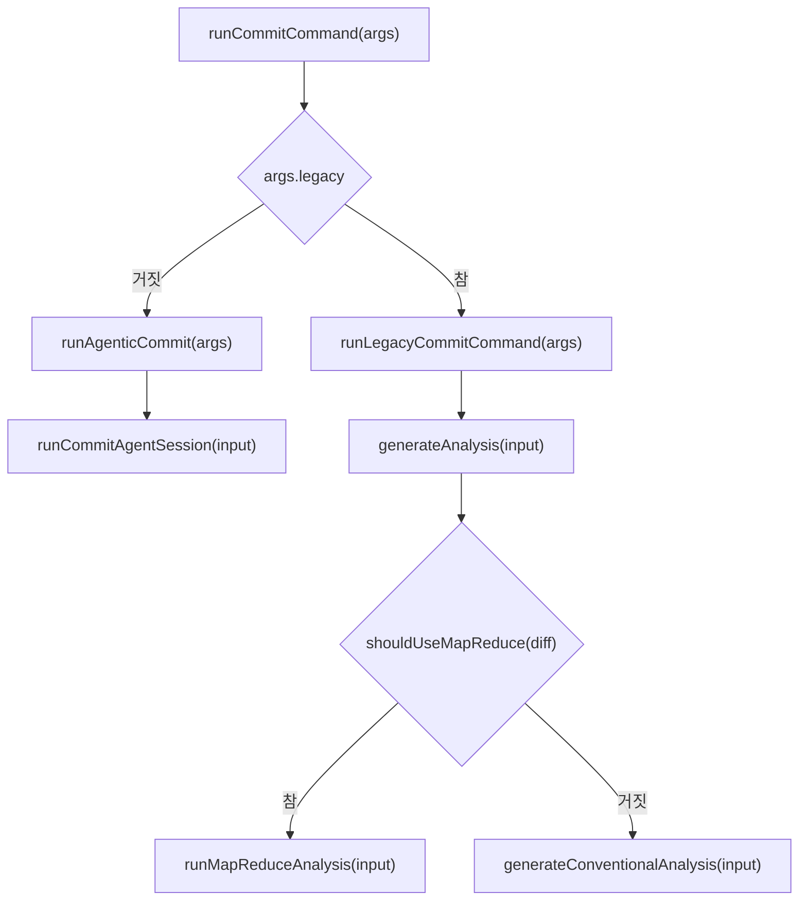
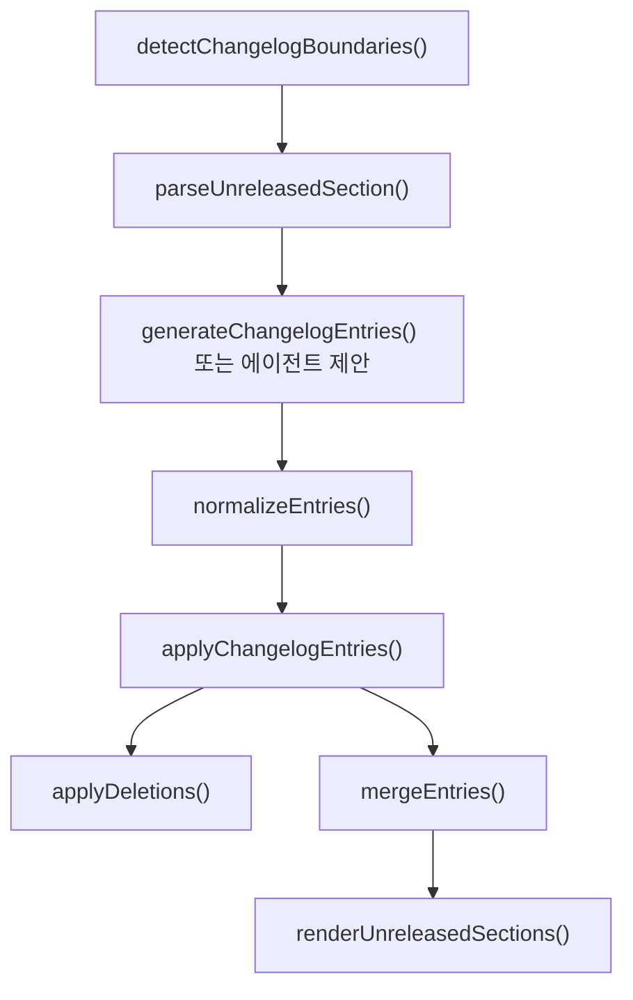

# Commit and Changelog

## 개요

Commit and Changelog 모듈은 `gjc commit` 명령의 커밋 메시지 생성, 변경 이력 갱신, 분할 커밋 실행을 담당합니다. 기본 경로는 에이전트 기반 파이프라인인 `runAgenticCommit()`이며, `--legacy` 플래그가 지정되면 기존 LLM 분석 파이프라인인 `runLegacyCommitCommand()`를 사용합니다.

이 모듈은 다음 책임을 함께 다룹니다.

- 스테이징된 변경사항 수집 및 필요 시 전체 변경사항 자동 스테이징
- 변경 파일 기준 `CHANGELOG.md` 대상 탐지
- 에이전트 또는 LLM 호출을 통한 Conventional Commit 분석 생성
- 커밋 요약과 본문 포맷팅
- Keep a Changelog 형식의 `[Unreleased]` 섹션 갱신
- 대형 diff에 대한 map-reduce 분석
- 에이전트 실패 또는 단순 변경사항에 대한 빠른 fallback 처리
- 단일 커밋 또는 hunk 기반 분할 커밋 실행

## 진입점

CLI 인자는 `parseCommitArgs()`가 해석합니다.

```ts
parseCommitArgs(args: string[]): CommitCommandArgs | undefined
```

지원하는 옵션은 `--push`, `--dry-run`, `--no-changelog`, `--legacy`, `--context`, `--model`입니다. `-c`는 `--context`, `-m`은 `--model`의 별칭입니다.

실제 실행 진입점은 `runCommitCommand()`입니다.

```ts
export async function runCommitCommand(args: CommitCommandArgs): Promise<void> {
	if (args.legacy) {
		return runLegacyCommitCommand(args);
	}
	return runAgenticCommit(args);
}
```

기본값은 agentic 경로입니다. legacy 경로는 `--legacy`를 명시했을 때만 사용됩니다.



## Agentic 커밋 흐름

`runAgenticCommit()`은 현재 기본 커밋 실행 경로입니다. 이 함수는 모델과 설정을 준비하고, staged diff를 수집한 뒤, 커밋 에이전트 세션을 실행합니다.

주요 단계는 다음과 같습니다.

1. `getProjectDir()`로 작업 디렉터리를 결정합니다.
2. `Settings.init({ cwd })`와 `discoverAuthStorage()`를 병렬로 실행합니다.
3. `ModelRegistry`를 생성하고 `refresh()` 및 `applyConfiguredModelBindings()`를 호출합니다.
4. staged 파일이 없으면 `git.stage.files(cwd)`로 전체 변경사항을 스테이징합니다.
5. `detectChangelogBoundaries()`로 변경 이력 대상 파일을 찾습니다.
6. `discoverContextFiles()`로 `AGENTS.md` 같은 컨텍스트 파일을 수집합니다.
7. fallback 강제, trivial change, agentic 세션 순서로 커밋 제안을 만듭니다.
8. 변경 이력 제안이 있으면 `applyChangelogProposals()`로 적용합니다.
9. `CommitAgentState`에 따라 `runSingleCommit()` 또는 `runSplitCommit()`을 실행합니다.

`PI_COMMIT_TEST_FALLBACK=true`가 설정되면 에이전트를 호출하지 않고 `generateFallbackProposal()`을 사용합니다. 반대로 에이전트가 제안을 만들지 못했을 때 `PI_COMMIT_NO_FALLBACK=true`가 아니면 fallback 제안으로 계속 진행합니다.

## 커밋 에이전트 세션

`runCommitAgentSession()`은 `createAgentSession()`으로 전용 에이전트 세션을 만들고, 커밋 도구를 주입한 뒤, 에이전트가 반드시 필요한 도구 호출을 하도록 유도합니다.

입력 타입은 `CommitAgentInput`입니다. 중요한 필드는 다음과 같습니다.

- `cwd`: Git 작업 디렉터리
- `model`, `thinkingLevel`: 에이전트 실행 모델과 추론 수준
- `settings`, `modelRegistry`, `authStorage`: 세션과 도구 생성에 필요한 런타임 설정
- `contextFiles`: 에이전트에 전달할 컨텍스트 파일
- `changelogTargets`: 갱신 가능한 changelog 파일 목록
- `requireChangelog`: changelog 제안 필수 여부
- `diffText`: staged diff 원문
- `existingChangelogEntries`: 기존 `[Unreleased]` 항목

세션 생성 시 `enableLsp`, `enableMCP`는 모두 꺼져 있고, `disableExtensionDiscovery`가 켜져 있습니다. 즉 이 경로는 커밋 생성을 위한 좁은 도구 환경으로 실행됩니다.

```ts
const tools = createCommitTools({
	cwd: input.cwd,
	authStorage: input.authStorage,
	modelRegistry: input.modelRegistry,
	settings: input.settings,
	spawns,
	state,
	changelogTargets: input.changelogTargets,
	enableAnalyzeFiles: true,
});
```

에이전트는 `CommitAgentState`를 직접 채우는 도구를 호출해야 합니다.

- `proposal`: 단일 커밋 제안
- `splitProposal`: 분할 커밋 계획
- `changelogProposal`: changelog 갱신 제안
- `overview`, `diffCache`, `diffText`: 분석 보조 상태

`isProposalComplete()`는 커밋 제안과 changelog 제안이 모두 충족되었는지 확인합니다. 필수 도구 호출이 빠진 경우 `buildReminderMessage()`가 `<system-reminder>`를 만들어 최대 3회까지 다시 프롬프트합니다.

## 단일 커밋과 분할 커밋

단일 커밋은 `runSingleCommit()`이 처리합니다.

```ts
async function runSingleCommit(proposal: CommitProposal, ctx: CommitExecutionContext): Promise<void>
```

`formatCommitMessage()`로 Conventional Commit 메시지를 만들고, `--dry-run`이면 메시지만 출력합니다. 실제 실행에서는 `git.commit(ctx.cwd, commitMessage)`를 호출하고, `--push`가 있으면 `git.push(ctx.cwd)`를 이어서 실행합니다.

커밋 메시지 포맷은 단순합니다.

```ts
export function formatCommitMessage(analysis: ConventionalAnalysis, summary: string): string {
	const scopePart = analysis.scope ? `(${analysis.scope})` : "";
	const header = `${analysis.type}${scopePart}: ${summary}`;
	const bodyLines = analysis.details.map(detail => `- ${detail.text.trim()}`);
	if (bodyLines.length === 0) {
		return header;
	}
	return `${header}\n\n${bodyLines.join("\n")}`;
}
```

분할 커밋은 `runSplitCommit()`이 처리합니다. `SplitCommitPlan`의 각 `SplitCommitGroup`은 변경 파일, commit type, scope, summary, details, issueRefs, dependencies를 갖습니다.

실행 전 검증은 두 단계입니다.

- 현재 staged 파일이 분할 계획에 모두 포함되어야 합니다.
- `computeDependencyOrder()`가 dependency graph를 위상 정렬할 수 있어야 합니다.

`--dry-run`이 아니고 TTY 환경이면 `confirmSplitCommitPlan()`이 사용자 확인을 받습니다. 비TTY 환경에서는 자동으로 true를 반환합니다.

실제 분할 실행은 다음 순서로 진행됩니다.

1. 현재 staged diff를 저장합니다.
2. `git.stage.reset(ctx.cwd)`로 스테이지를 비웁니다.
3. dependency order 순서대로 hunk를 선택해 다시 스테이징합니다.
4. 각 그룹을 `formatCommitMessage()`로 커밋합니다.
5. 커밋마다 스테이지를 reset합니다.

변경 이력 파일이 agentic 흐름에서 먼저 수정되었고 split commit이 선택된 경우, `appendFilesToLastCommit()`이 changelog 파일을 마지막 커밋 그룹에 추가합니다.

## Fallback과 trivial change 처리

에이전트 호출이 실패하거나 제안을 반환하지 못하면 `generateFallbackProposal()`이 최소 커밋 제안을 만듭니다.

```ts
export function generateFallbackProposal(numstat: NumstatEntry[]): CommitProposal
```

fallback 분석은 파일 종류를 기준으로 type을 추론합니다.

- 테스트 파일만 있으면 `test`
- 문서 파일만 있으면 `docs`
- 스타일 파일만 있으면 `style`
- 설정 파일만 있으면 `chore`
- 그 외에는 `refactor`

요약은 `generateFallbackSummary()`가 첫 파일명과 파일 수를 이용해 만듭니다. fallback 제안에는 `"Commit generated using fallback due to agent failure"` 경고가 포함됩니다.

단순 변경은 `detectTrivialChange()`가 diff 원문을 검사해 빠르게 처리합니다.

- 공백만 바뀐 경우: `style: formatted code`
- import/export/require 라인만 바뀐 경우: `style: reorganized imports`

이 경로는 에이전트를 호출하지 않고 바로 `runSingleCommit()`으로 이어집니다.

## Changelog 대상 탐지

`detectChangelogBoundaries()`는 staged 파일별로 가장 가까운 `CHANGELOG.md`를 찾습니다.

```ts
export async function detectChangelogBoundaries(
	cwd: string,
	stagedFiles: string[],
): Promise<ChangelogBoundary[]>
```

각 staged 파일에 대해 `findNearestChangelog()`가 파일의 디렉터리에서 시작해 repository root까지 올라가며 `CHANGELOG.md`를 찾습니다. 이미 changelog 파일인 staged 파일은 대상 탐지에서 제외합니다.

반환되는 `ChangelogBoundary`는 changelog 파일과 그 changelog에 속하는 변경 파일 목록을 묶습니다.

```ts
export interface ChangelogBoundary {
	changelogPath: string;
	files: string[];
}
```

이 설계 때문에 monorepo 안에서 패키지별 `CHANGELOG.md`가 있으면 해당 패키지 changelog가 우선됩니다. 루트에만 `CHANGELOG.md`가 있으면 루트 changelog가 대상이 됩니다.

## Changelog 생성과 적용

legacy 경로에서는 `runChangelogFlow()`가 changelog 생성부터 파일 갱신까지 직접 처리합니다.

```ts
export async function runChangelogFlow(input: ChangelogFlowInput): Promise<string[]>
```

흐름은 다음과 같습니다.

1. `detectChangelogBoundaries()`로 대상 changelog를 찾습니다.
2. boundary별 staged diff와 stat을 가져옵니다.
3. diff를 `truncateDiff()`로 제한합니다. 기본 제한은 `120_000`자입니다.
4. changelog 파일을 읽고 `parseUnreleasedSection()`으로 `[Unreleased]` 범위를 파싱합니다.
5. 기존 항목을 `formatExistingEntries()`로 프롬프트에 넣습니다.
6. `generateChangelogEntries()`가 LLM으로 항목을 생성합니다.
7. `applyChangelogEntries()`로 문서 내용을 갱신합니다.
8. dry run이 아니면 `Bun.write()`로 저장하고 changelog 파일을 스테이징합니다.

agentic 경로에서는 에이전트가 `changelogProposal`을 만든 뒤 `applyChangelogProposals()`가 적용합니다.

```ts
export async function applyChangelogProposals({
	cwd,
	proposals,
	dryRun,
	onProgress,
}: ChangelogProposalInput): Promise<string[]>
```

`applyChangelogProposals()`는 항목 추가뿐 아니라 `deletions`도 처리합니다. 삭제 요청이 있으면 `applyDeletions()`가 기존 항목에서 대소문자 무시 기준으로 항목을 제거하고, 이후 `mergeEntries()`가 새 항목을 병합합니다.

`normalizeEntries()`는 항목 앞뒤 공백을 제거하고 마지막 마침표를 제거합니다. 중복 제거는 같은 문자열 기준으로 수행됩니다.



## `[Unreleased]` 파싱 규칙

`parseUnreleasedSection()`은 changelog 본문에서 `## [Unreleased]` 또는 `## Unreleased`를 찾습니다.

```ts
export function parseUnreleasedSection(content: string): UnreleasedSection
```

파싱 규칙은 다음과 같습니다.

- 시작 라인은 `/^##\s+\[?Unreleased\]?/i`와 일치해야 합니다.
- 다음 `## ` 제목 전까지가 Unreleased 영역입니다.
- `### 섹션명` 아래의 `- 항목` 또는 `* 항목`만 entries로 수집합니다.
- 섹션이 없는 bullet은 무시합니다.
- Unreleased 섹션이 없으면 오류를 던집니다.

반환되는 `UnreleasedSection`은 시작 줄, 끝 줄, 섹션별 항목을 포함합니다.

```ts
export interface UnreleasedSection {
	startLine: number;
	endLine: number;
	entries: Record<string, string[]>;
}
```

렌더링 순서는 `CHANGELOG_CATEGORIES`를 따릅니다.

```ts
[
	"Breaking Changes",
	"Added",
	"Changed",
	"Deprecated",
	"Removed",
	"Fixed",
	"Security",
]
```

## Conventional Commit 분석

legacy 경로의 Conventional Commit 분석은 `generateAnalysis()`가 담당합니다. diff 크기와 파일 수에 따라 단일 LLM 분석 또는 map-reduce 분석을 선택합니다.

단일 분석은 `generateConventionalAnalysis()`가 수행합니다.

```ts
export async function generateConventionalAnalysis(input: ConventionalAnalysisInput): Promise<ConventionalAnalysis>
```

이 함수는 다음 데이터를 프롬프트에 넣습니다.

- context files
- user context
- commit type 설명
- recent commits
- scope candidates
- git stat
- staged diff

LLM 응답은 `create_conventional_analysis` 도구 호출을 우선 사용하고, 도구 호출이 없으면 텍스트 안의 JSON payload를 파싱합니다. 실제 파싱 로직은 `parseConventionalAnalysisResponse()`와 `normalizeAnalysis()`에 공유되어 있습니다.

공유 도구 스키마는 `conventionalAnalysisParameters`입니다. type은 다음 Conventional Commit type 중 하나여야 합니다.

```ts
"feat" | "fix" | "refactor" | "docs" | "test" | "chore" | "style" | "perf" | "build" | "ci" | "revert"
```

## Scope 후보 추출

`extractScopeCandidates()`는 `git diff --numstat` 결과를 기반으로 commit scope 후보를 만듭니다.

```ts
export function extractScopeCandidates(numstat: NumstatEntry[]): ScopeCandidatesResult
```

주요 동작은 다음과 같습니다.

- rename path를 `normalizePathForScope()`로 새 경로 중심으로 정규화합니다.
- `isExcludedFile()`에 해당하는 파일은 제외합니다.
- `src`, `lib`, `packages`, `tests`, `docs` 같은 placeholder 디렉터리는 scope 후보에서 낮은 우선순위를 갖거나 제외됩니다.
- 의미 있는 디렉터리 컴포넌트별 변경 라인 수를 집계합니다.
- 상위 후보가 전체 변경량의 60% 미만이거나 의미 있는 root가 3개 이상이면 wide change로 판단합니다.
- wide change일 때는 `analyzeWideChange()`가 `deps`, `docs`, `tests`, `error-handling`, `type-refactor`, `config` 같은 패턴을 반환할 수 있습니다.

반환값은 사람이 읽을 수 있는 문자열입니다. 예를 들어 한 컴포넌트가 지배적이면 `component/subcomponent (75%, high confidence)` 같은 후보를 제공합니다.

## 대형 diff map-reduce 분석

`shouldUseMapReduce()`는 대형 변경에 대해 map-reduce 경로를 사용할지 결정합니다.

```ts
export function shouldUseMapReduce(diff: string, settings?: MapReduceSettings): boolean
```

기본 조건은 다음과 같습니다.

- `PI_COMMIT_MAP_REDUCE=false`이면 비활성화
- `settings.enabled === false`이면 비활성화
- 제외 파일을 뺀 파일 수가 기본 4개 이상이면 활성화
- 단일 파일 diff가 기본 50,000 token 추정치를 넘으면 활성화

`runMapReduceAnalysis()`는 `parseFileDiffs()`로 파일별 diff를 나누고, `runMapPhase()`와 `runReducePhase()`를 순서대로 실행합니다.

map 단계의 `runMapPhase()`는 파일별 관찰을 병렬로 생성합니다. 기본 동시성은 5이고, 파일별 timeout은 120초입니다. binary 파일은 LLM 호출 없이 `"Binary file changed."` 관찰로 처리됩니다.

reduce 단계의 `runReducePhase()`는 파일별 관찰을 하나의 Conventional Commit 분석으로 합성합니다. 이때도 `create_conventional_analysis` 도구 스키마와 `parseConventionalAnalysisResponse()`를 재사용합니다.

## 요약 생성과 검증

legacy 경로에서 분석이 끝나면 `generateSummaryWithRetry()`가 commit header summary를 생성합니다.

```ts
async function generateSummaryWithRetry(input): Promise<{ summary: string }>
```

내부에서 `generateSummary()`를 최대 3회 호출합니다. 각 결과는 `validateSummary()`로 검증됩니다.

`validateSummary()`의 기본 규칙은 다음과 같습니다.

- 비어 있으면 안 됩니다.
- 지정된 최대 길이를 넘으면 안 됩니다. legacy 경로의 최대값은 72자입니다.
- 마침표로 끝나면 안 됩니다.
- 한 줄이어야 합니다.

agentic 도구 경로에서는 더 강한 규칙인 `validateSummaryRules()`도 사용됩니다. 이 함수는 `validateSummary()`에 더해 summary 첫 단어가 과거형 동사인지 확인하고, `comprehensive`, `various`, `several`, `improved`, `enhanced`, `better` 같은 filler word와 `this commit`, `this change`, `updated code`, `modified files` 같은 meta phrase를 경고합니다.

`normalizeSummary()`는 `stripTypePrefix()`로 `feat:`, `fix(scope):` 같은 prefix를 제거하고, `normalizeUnicode()`와 공백 정리를 적용합니다.

## 분석 검증과 detail 제한

`validateAnalysis()`는 `ConventionalAnalysis` 전체를 검증합니다.

- `validateScope()`로 scope 형식을 검사합니다.
- detail text는 비어 있으면 안 됩니다.
- detail은 마침표로 끝나야 합니다.
- detail 길이는 120자를 넘으면 안 됩니다.

`validateScope()`는 scope에 최대 두 segment만 허용하고, 각 segment는 소문자이며 `/^[a-z0-9][a-z0-9-_]*$/` 형식을 만족해야 합니다.

agentic 도구 경로에서는 `validateTypeConsistency()`가 type과 파일 목록의 일관성도 검사합니다.

예를 들어:

- `docs` type은 문서 파일 변경을 포함해야 합니다.
- `test` type은 테스트 파일 변경을 포함해야 합니다.
- `ci` type은 CI 설정 변경을 포함해야 합니다.
- `build` type은 `Cargo.toml`, `package.json`, `Makefile` 같은 빌드 관련 파일을 포함해야 합니다.
- `refactor`가 새 파일을 추가하면 `feat` 가능성을 경고합니다.
- `perf`가 benchmark 파일이나 성능 키워드 없이 사용되면 경고합니다.

`capDetails()`는 detail이 6개를 넘으면 `scoreDetail()` 점수로 우선순위를 매겨 상위 항목만 유지합니다. 보안, breaking change, 성능, 버그, public API, 사용자 영향, 제거/폐기 관련 detail이 높은 점수를 받습니다.

## Git diff 파싱 유틸리티

`commit/git/diff.ts`는 git 출력 파싱을 담당합니다.

- `parseNumstat()`은 `git diff --numstat` 출력을 `NumstatEntry[]`로 변환합니다.
- `parseFileDiffs()`는 unified diff를 파일별 `FileDiff[]`로 분리합니다.
- `parseDiffHunks()`는 전체 diff를 파일별 hunk 목록으로 변환합니다.
- `parseFileHunks()`는 단일 `FileDiff`에서 `DiffHunk[]`를 추출합니다.
- `parseHunkHeader()`는 `@@ -old,+new @@` 헤더에서 old/new line 정보를 파싱합니다.

이 파서는 split commit 도구와 git stage hunk 흐름의 기반입니다. 특히 `runSplitCommit()`은 에이전트가 만든 `HunkSelector`를 `git.stage.hunks()`에 전달하며, git 유틸리티 쪽에서 이 hunk 정보가 사용됩니다.

rename path는 `extractPathFromRename()`에서 새 경로 중심으로 정규화됩니다. `{old => new}` 형식과 `old => new` 형식을 모두 처리합니다.

## 모델 선택

`resolvePrimaryModel()`은 사용자가 `--model`을 지정했는지에 따라 모델 선택 방식을 바꿉니다.

- override가 있으면 `resolveModelRoleValue()`로 해당 모델 또는 role 값을 해석합니다.
- override가 없으면 `resolveRoleSelection(["default"], ...)`로 기본 role 모델을 찾습니다.
- 모델을 찾지 못하면 `"No model available for commit generation"` 오류를 던집니다.
- API key가 없으면 `"No API key available for model provider/id"` 오류를 던집니다.

`resolveSecondaryCommitModel()`은 보조 모델을 선택합니다. 기본 role 모델과 API key가 있으면 그것을 사용하고, 없으면 primary model과 primary API key로 fallback합니다.

agentic 경로에서는 primary model을 먼저 표시한 뒤, secondary model을 commit agent model로 사용합니다. legacy 경로에서는 primary model이 분석과 요약에 사용되고, secondary model은 map phase의 작은 모델 역할로 사용됩니다.

## 상태 타입

이 모듈의 주요 데이터 구조는 `commit/types.ts`와 `commit/agentic/state.ts`에 정의되어 있습니다.

`ConventionalAnalysis`는 commit type, scope, detail, issue reference를 담습니다.

```ts
export interface ConventionalAnalysis {
	type: CommitType;
	scope: string | null;
	details: ConventionalDetail[];
	issueRefs: string[];
}
```

`ConventionalDetail`은 changelog와 연결될 수 있습니다.

```ts
export interface ConventionalDetail {
	text: string;
	changelogCategory?: ChangelogCategory;
	userVisible: boolean;
}
```

agentic 경로의 `CommitAgentState`는 에이전트 도구 호출 결과를 누적하는 공유 상태입니다.

```ts
export interface CommitAgentState {
	overview?: GitOverviewSnapshot;
	proposal?: CommitProposal;
	splitProposal?: SplitCommitPlan;
	changelogProposal?: ChangelogProposal;
	diffCache?: Map<string, string>;
	diffText?: string;
}
```

`CommitProposal`은 단일 커밋을, `SplitCommitPlan`은 여러 커밋을 표현합니다. `ChangelogProposal`은 changelog 파일별 추가 항목과 선택적 삭제 항목을 표현합니다.

## 외부 모듈과의 연결

이 모듈은 repository 안의 여러 하위 시스템과 연결됩니다.

- `src/commands/commit.ts`는 CLI command 실행 시 `runCommitCommand()`를 호출합니다.
- `src/utils/git.ts`는 diff, numstat, staged files, commit, push, hunk staging을 제공합니다.
- `src/config/model-registry.ts`와 `src/config/model-resolver.ts`는 모델 목록, role binding, API key resolution을 제공합니다.
- `src/sdk.ts`의 `createAgentSession()`, `discoverAuthStorage()`, `discoverContextFiles()`는 agentic commit 경로의 세션과 컨텍스트 discovery를 제공합니다.
- `src/system-prompt.ts`의 `loadProjectContextFiles()`는 legacy 경로에서 프로젝트 컨텍스트 파일을 불러옵니다.
- `src/thinking.ts`의 `toReasoningEffort()`는 `ThinkingLevel`을 provider 요청 옵션으로 변환합니다.
- `src/edit/normalize.ts`의 `normalizeUnicode()`는 summary 정규화에 사용됩니다.
- `@gajae-code/tui`의 `Markdown`과 `getMarkdownTheme()`는 agentic 세션의 assistant message 렌더링에 사용됩니다.

## 실패 처리와 출력 정책

agentic 경로는 실패를 가능한 한 커밋 가능 상태로 수렴시키도록 설계되어 있습니다.

- 에이전트 실행 중 오류가 발생하면 stderr에 `"Agent error: ..."`를 쓰고 fallback 제안으로 전환합니다.
- 에이전트가 proposal을 반환하지 않으면 `PI_COMMIT_NO_FALLBACK=true`가 아닌 한 fallback 제안을 사용합니다.
- changelog가 필요한데 agent가 `changelogProposal`을 만들지 않으면 `"Commit agent did not provide changelog entries."`를 출력하고 종료합니다.
- split plan이 staged 파일을 모두 포함하지 않으면 `"Split commit plan missing staged files: ..."`를 출력하고 종료합니다.
- split dependency에 잘못된 index나 cycle이 있으면 `computeDependencyOrder()`가 오류를 반환하고 실행을 중단합니다.

출력은 대부분 `process.stdout.write()`와 `process.stderr.write()`를 직접 사용합니다. `packages/coding-agent/`의 일반 TUI 경로에서는 중앙 logger 사용이 중요하지만, 이 모듈의 commit 실행 경로는 CLI 진행 상황을 명시적으로 출력합니다. changelog parse skip 같은 내부 경고는 `logger.warn()`을 사용합니다.

## 기여 시 주의할 점

커밋 메시지 생성 로직을 바꿀 때는 agentic 경로와 legacy 경로를 분리해서 생각해야 합니다. 기본 사용자는 `runAgenticCommit()`을 타며, `generateConventionalAnalysis()`와 `generateSummary()`는 `--legacy` 경로에서 주로 사용됩니다.

changelog 동작을 바꿀 때는 두 적용 경로를 모두 확인해야 합니다.

- legacy 생성 경로: `runChangelogFlow()` → `generateChangelogEntries()` → `applyChangelogEntries()`
- agentic 적용 경로: `runAgenticCommit()` → `applyChangelogProposals()` → `applyChangelogEntries()`

Conventional Commit 스키마를 바꾸려면 `CommitType`, `conventionalAnalysisParameters`, 프롬프트, validation, 테스트를 함께 맞춰야 합니다. changelog category를 바꾸려면 `CHANGELOG_CATEGORIES`, `changelogCategoryLiteral`, changelog render 순서, 생성 프롬프트를 함께 확인해야 합니다.

분할 커밋을 수정할 때는 `SplitCommitPlan`, `computeDependencyOrder()`, `git.stage.hunks()` 호출 계약을 함께 확인해야 합니다. split plan의 `dependencies`는 commit index를 기준으로 하며, 순환 dependency는 허용되지 않습니다.