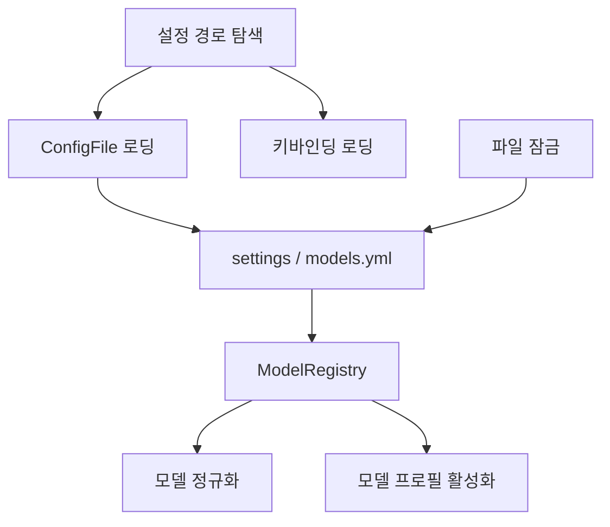

# Configuration and Discovery

## 구성과 탐색 모듈

이 모듈은 GJC가 사용자 설정, 프로젝트 설정, 키바인딩, 모델 목록, 모델 프로필, 파일 잠금, 확장/프로젝트 탐색 경로를 찾고 해석하는 기반 계층입니다. 중심 진입점은 `packages/coding-agent/src/config.ts`이며, 실제 설정 파일 로딩은 `ConfigFile<T>`, 모델 관련 런타임 상태는 `ModelRegistry`, 단축키 관리는 `KeybindingsManager`가 담당합니다.



## 설정 디렉터리 우선순위

`config.ts`는 사용자 레벨과 프로젝트 레벨 설정 위치를 같은 방식으로 다루기 위해 `getConfigDirs()`와 `getConfigDirPaths()`를 제공합니다.

우선순위는 항상 높은 것부터 낮은 것 순서입니다.

1. 사용자 설정: `~/.gjc/agent/<subpath>`
2. 사용자 호환 설정: `~/.gemini/<subpath>`
3. 프로젝트 설정: `<cwd>/.gjc/<subpath>`
4. 프로젝트 호환 설정: `<cwd>/.gemini/<subpath>`

`getConfigDirs(subpath, options)`는 각 항목을 `{ path, source, level }` 형태로 반환합니다. `source`는 `.gjc` 또는 `.gemini`이고, `level`은 `"user"` 또는 `"project"`입니다. `existingOnly: true`를 주면 실제 존재하는 디렉터리만 반환합니다.

```ts
const commandDirs = getConfigDirs("commands", { existingOnly: true });
const projectSkillDirs = getConfigDirPaths("skills", { user: false });
```

단일 파일을 찾을 때는 `findConfigFile()` 또는 `findConfigFileWithMeta()`를 사용합니다. 두 함수 모두 `getConfigDirs("", ...)`의 우선순위를 그대로 따르며, 첫 번째로 발견한 파일만 반환합니다. 메타데이터가 필요한 호출자는 `findConfigFileWithMeta()`를 사용해 `source`와 `level`까지 확인할 수 있습니다.

모노레포처럼 하위 디렉터리에서 실행되는 경우에는 `findAllNearestProjectConfigDirs(subpath, cwd)`가 프로젝트 설정을 위쪽 디렉터리로 거슬러 올라가며 찾습니다. 각 설정 베이스(`.gjc`, `.gemini`)마다 가장 가까운 디렉터리 하나만 선택한 뒤, 설정 베이스 우선순위에 맞춰 정렬합니다.

## 패키지 자산 경로

`getPackageDir()`는 선택적 문서나 예제 같은 패키지 자산을 찾기 위한 기준 디렉터리를 반환합니다.

동작 순서는 다음과 같습니다.

1. `GJC_PACKAGE_DIR` 또는 `PI_PACKAGE_DIR` 환경 변수가 있으면 `expandTilde()`로 확장해 사용합니다.
2. `import.meta.dir`부터 상위 디렉터리로 올라가며 `package.json`을 찾습니다.
3. 찾지 못하면 `getProjectDir()`를 반환합니다.

`getChangelogPath()`는 이 기준 디렉터리 아래의 `CHANGELOG.md` 경로를 반환합니다. 바이너리 배포처럼 파일이 없을 수 있으므로, 호출자는 존재 여부를 별도로 처리해야 합니다.

## `ConfigFile<T>`: 스키마 기반 설정 파일 로더

`ConfigFile<T>`는 설정 파일 하나를 Zod 스키마와 함께 다루는 일반 로더입니다. 기본 경로는 `path.join(getAgentDir(), `${id}.yml`)`이고, 명시 경로를 넘기면 해당 파일을 사용합니다.

지원 확장자는 `.yml`, `.yaml`, `.json`, `.jsonc`입니다. `.yml` 또는 `.yaml` 경로를 사용할 때 같은 이름의 `.json` 파일이 있고 YAML 파일이 아직 없으면 `migrateJsonToYml()`이 JSON 내용을 YAML로 변환해 저장합니다. 기존 YAML이 있으면 덮어쓰지 않습니다.

핵심 메서드는 다음과 같습니다.

- `tryLoad()`: 파일을 읽고 파싱한 뒤 `{ status, value, error }` 형태의 `LoadResult<T>`를 반환합니다.
- `load()`: 성공 시 값, 실패 또는 미존재 시 `null`을 반환합니다.
- `loadOrDefault()`: 로드 실패 또는 파일 미존재 시 `createDefault()` 결과를 반환합니다.
- `createDefault()`: 스키마가 `{}` 또는 `undefined`에서 기본값을 만들 수 있는지 확인합니다.
- `withValidation(name, validate)`: Zod 검증 이후 실행할 추가 검증을 체인으로 등록합니다.
- `relocate(configPath)`: 같은 스키마와 검증을 유지하면서 다른 파일 경로를 바라보는 새 `ConfigFile<T>`를 만듭니다.
- `invalidate()`: 내부 캐시를 비워 다음 호출에서 파일을 다시 읽게 합니다.
- `getMtimeMs()`: 파일 수정 시각을 반환하고, 파일이 없으면 `null`을 반환합니다.

`tryLoad()`는 첫 호출 결과를 캐시합니다. 따라서 파일 변경을 반영해야 하는 호출자는 `invalidate()`를 먼저 호출해야 합니다. `ModelRegistry.#reloadStaticModels()`는 이 패턴을 사용해 `models.yml`의 수정 시각이 바뀐 경우에만 정적 모델 구성을 다시 읽습니다.

오류는 `ConfigError`로 감싸집니다. Zod 오류는 최대 50개까지 `instancePath`와 메시지를 보존하고, 파싱/검증 중 예외는 `stage` 값을 포함한 `"Unexpected"`, `"Validate(...)"`, `"AuxValidate"` 같은 단계 정보로 표시합니다.

## 파일 잠금

`file-lock.ts`는 `<file>.lock` 디렉터리를 이용한 비동기 파일 잠금을 제공합니다. 공개 API는 `withFileLock(filePath, fn, options)`입니다.

```ts
await withFileLock(modelsPath, async () => {
	// 같은 파일을 대상으로 하는 경쟁 쓰기를 직렬화합니다.
	await Bun.write(modelsPath, nextContent);
});
```

잠금 획득은 `acquireLock()`이 수행합니다. 내부적으로 `tryAcquireLock()`이 잠금 디렉터리를 만들고, 성공하면 `<file>.lock/info`에 `{ pid, timestamp }`를 기록합니다. 이미 잠금이 있으면 `isLockStale()`로 회수 가능 여부를 확인하고, 아니면 `retryDelayMs`만큼 대기한 뒤 재시도합니다.

스테일 판단은 단순 시간 초과만 보지 않습니다. `ownerLiveness(pid)`가 `process.kill(pid, 0)`으로 소유 프로세스 생존 여부를 확인합니다.

- 소유자가 죽었으면 즉시 스테일로 봅니다.
- 소유자가 살아 있으면 `staleMs`가 지나도 회수하지 않습니다.
- 생존 여부를 알 수 없을 때만 `timestamp`와 `staleMs`를 비교합니다.

GC 경로에서는 `readFileLockInfoForGc()`와 `removeFileLockDirForGc()`를 사용합니다. `removeFileLockDirForGc()`는 삭제 직전에 잠금 소유자 토큰을 다시 읽고, 관측한 `{ pid, timestamp }`와 정확히 같을 때만 제거합니다. 이 방식은 죽은 잠금을 회수하는 동안 다른 프로세스가 같은 경로에 새 잠금을 만든 경우를 보호합니다.

## 키바인딩 구성

`keybindings.ts`는 TUI 기본 키바인딩과 앱 전용 키바인딩을 합쳐 `KEYBINDINGS`로 선언합니다. 앱 전용 ID는 `"app.interrupt"`, `"app.model.select"`, `"app.session.observe"`처럼 네임스페이스를 가진 문자열입니다.

`KeybindingsManager`는 `@gajae-code/tui`의 `KeybindingsManager`를 확장합니다.

주요 생성 경로는 두 가지입니다.

- `KeybindingsManager.create(agentDir)`: `agentDir/keybindings.json`을 읽고 전역 키바인딩으로 등록합니다.
- `KeybindingsManager.inMemory(userBindings)`: 파일 없이 메모리 설정만 사용합니다.

기존 설정과의 호환성은 `KEYBINDING_NAME_MIGRATIONS`가 담당합니다. 예를 들어 `interrupt`는 `app.interrupt`로, `cursorUp`은 `tui.editor.cursorUp`으로 변환됩니다. `loadKeybindingsConfig(filePath, true)`는 마이그레이션이 발생하면 `orderKeybindingsConfig()`로 `KEYBINDINGS` 순서에 맞춰 정렬한 뒤 파일에 다시 씁니다.

화면 표시용 문자열은 `formatKeyHint()`와 `formatKeyHints()`가 만듭니다. 예를 들어 `"ctrl+enter"`는 `"Ctrl+Enter"`로, 여러 키는 `"Ctrl+C/Esc"`처럼 `/`로 연결됩니다.

## 모델 정규화와 동등성

`model-equivalence.ts`는 여러 공급자나 래퍼가 노출하는 모델 ID를 하나의 canonical 모델로 묶습니다. 공개 진입점은 `buildCanonicalModelIndex(models, equivalence?)`입니다.

반환되는 `CanonicalModelIndex`는 세 가지 조회 구조를 가집니다.

- `records`: canonical 모델 목록
- `byId`: canonical ID 기준 조회 맵
- `bySelector`: `"provider/model"` selector에서 canonical ID로 가는 맵

정규화 과정은 다음 순서로 진행됩니다.

1. `equivalence.overrides`가 selector에 매칭되면 그 값을 canonical ID로 사용합니다.
2. `equivalence.exclude`에 있으면 정규화를 건너뛰고 원래 모델 ID를 사용합니다.
3. Anthropic 계열 별칭은 `getAnthropicAliasOfficial()`과 `getClaudeFamilyAliasOfficial()`로 공식 번들 ID에 맞춥니다.
4. `getHeuristicCanonicalCandidates()`가 후보를 확장합니다.
5. 번들 모델 ID와 매칭되는 후보 중 `selectBestOfficialCandidate()`가 가장 선호되는 항목을 고릅니다.
6. 매칭이 없으면 fallback으로 원래 모델 ID를 사용합니다.

후보 확장은 가벼운 변환과 무거운 변환으로 나뉩니다. `expandCheapCanonicalCandidates()`는 소문자화, 경로 세그먼트 제거, 네임스페이스 접미어 추출을 수행합니다. `expandHeavyCanonicalCandidates()`는 `-latest`, 날짜 접미어, provider version 접미어, trailing marker, `duo-chat-` 래퍼, Claude family 순서 등을 처리합니다.

캐시는 두 곳에 있습니다.

- `QUALIFIED_NAMESPACE_SUFFIX_CACHE`: 네임스페이스 접미어 후보 캐시
- `HEURISTIC_CANDIDATES_CACHE`: 모델 ID별 휴리스틱 후보 캐시

둘 다 최대 256개 항목만 유지하는 bounded FIFO 캐시입니다.

## 모델 프로필

`model-profiles.ts`는 역할별 모델 배치를 하나의 이름으로 묶는 프로필을 정의합니다. 기본 프로필은 `BUILTIN_MODEL_PROFILES`에 있으며, `codex-medium`, `claude-opus`, `glm-pro`, `opus-codex` 같은 이름을 사용합니다.

각 `ModelProfileDefinition`은 다음 필드를 가집니다.

- `name`: 프로필 이름
- `requiredProviders`: 필요한 인증 공급자 목록
- `modelMapping`: `default`, `executor`, `architect`, `planner`, `critic` 역할별 selector
- `source`: `"builtin"` 또는 `"user"`

`mergeModelProfiles(userProfiles)`는 내장 프로필을 먼저 넣고, `models.yml`의 사용자 프로필을 같은 맵에 병합합니다. 같은 이름의 사용자 프로필은 내장 프로필을 덮어쓸 수 있습니다.

`resolveProfileBindings()`는 프로필을 런타임 적용 형태로 바꿉니다. `default`는 세션 기본 모델 selector로, `executor`, `architect`, `planner`, `critic`은 `task.agentModelOverrides`에 들어갈 역할별 override로 분리됩니다.

`aggregateModelProfileRequiredProviders()`는 명시된 `requiredProviders`와 `modelMapping` 안의 `"provider/model"` selector에서 추출한 provider를 합칩니다. 따라서 프로필 작성자가 `required_providers`를 일부 빠뜨려도 selector에 드러난 provider는 인증 요구 목록에 포함됩니다.

## 모델 프로필 활성화

`model-profile-activation.ts`는 프로필 적용을 준비 단계와 적용 단계로 분리합니다.

`prepareModelProfileActivation(options)`는 다음을 검증하고 `PreparedModelProfileActivation`을 만듭니다.

1. 프로필 이름을 찾습니다. `codex-standard`는 기존 이름 호환을 위해 `codex-medium`으로 fallback 됩니다.
2. `aggregateModelProfileRequiredProviders()` 결과를 기준으로 `modelRegistry.getApiKeyForProvider()`를 호출해 인증 상태를 확인합니다.
3. 기본 selector와 역할별 selector를 `resolveModelRoleValue()`로 실제 모델에 해석합니다.
4. 적용 실패 시 롤백할 수 있도록 이전 모델, thinking level, 역할 override, 활성 프로필 이름을 저장합니다.

`applyPreparedModelProfileActivation(prepared, options)`는 준비된 값을 실제 세션과 설정에 반영합니다. 기본 모델은 `session.setModelTemporary()`, 역할 override는 `settings.override("task.agentModelOverrides", ...)`, 기본 프로필 영속화는 `settings.set("modelProfile.default", ...)`와 `settings.flush()`로 처리합니다.

적용 중 오류가 발생하면 이미 바뀐 값만 되돌립니다. 이 롤백은 이전 persisted default, 역할 override, 활성 프로필 이름, 세션 모델을 대상으로 합니다.

`activateModelProfile()`은 준비와 적용을 한 번에 수행하는 편의 함수입니다.

## `ModelRegistry`: 모델 구성과 런타임 발견의 중심

`model-registry.ts`의 `ModelRegistry`는 번들 모델, 사용자 모델 설정, OAuth/API 키, provider discovery, runtime extension overlay, canonical model index를 한곳에서 관리합니다.

생성자는 `AuthStorage`와 선택적 `modelsPath`를 받습니다. 내부적으로 `ModelsConfigFile.relocate(modelsPath)`를 사용해 `models.yml` 위치를 정하고, `authStorage.setFallbackResolver()`로 사용자 정의 provider API key를 조회할 수 있게 연결합니다. 생성 시점에 `#loadModels()`가 동기적으로 실행됩니다.

사용자 모델 설정은 `ModelsConfigFile`로 읽습니다. 이 파일은 `ConfigFile<ModelsConfig>`이며 `ModelsConfigSchema` 검증 뒤 `validateProviderConfiguration()` 추가 검증을 수행합니다. 검증은 provider 수준 `api`, `baseUrl`, 인증 방식, custom model 정의, discovery 설정, `requestTransform` 지원 API 등을 확인합니다.

`refresh(strategy)`는 정적 설정을 다시 읽고 discovery를 갱신합니다.

- `#reloadStaticModels()`는 `models.yml` 수정 시각이 변하지 않았으면 불필요한 재빌드를 피합니다.
- 정적 설정을 다시 읽기 전 config-sourced API key와 provider override를 초기화합니다.
- runtime overlay와 runtime API key는 refresh 사이클을 넘어 유지됩니다.
- `#refreshRuntimeDiscoveries(strategy)`가 discoverable provider 모델을 갱신합니다.
- 마지막에 `#applyConfiguredModelBindingsToTarget()`가 설정 기반 모델 바인딩을 반영합니다.

`refreshInBackground()`는 이미 실행 중인 백그라운드 refresh가 있으면 새 작업을 만들지 않습니다. 실패는 `logger.warn()`으로 기록하고, 완료 후 내부 Promise 참조를 비웁니다.

`refreshProvider(providerId, strategy)`는 특정 provider만 다시 discovery하기 위해 suppression selector 중 해당 provider 항목을 지우고 제한된 refresh를 수행합니다.

## 사용자 정의 provider와 discovery

사용자 정의 모델은 provider 설정과 model 정의를 조합해 `CustomModelOverlay`로 만들어집니다. `buildCustomModelOverlay()`는 provider-level 값과 model-level 값을 합칩니다.

중요한 병합 규칙은 다음과 같습니다.

- `api`는 model 설정이 우선이고, 없으면 provider 설정을 사용합니다.
- `baseUrl`은 model 설정이 우선이고, 없으면 provider 설정을 사용합니다.
- headers는 provider headers와 model headers를 합친 뒤 `authHeader`가 켜져 있으면 `Authorization: Bearer ...`를 추가합니다.
- `compat`은 `mergeCompat()`로 깊게 병합합니다.
- `requestTransform`은 `mergeRequestTransform()`으로 `stripHeaders`, `setHeaders`, `extraBody`를 안전하게 합칩니다.
- Anthropic messages custom endpoint는 명시 `auth`가 없으면 OAuth 형태 요청으로 처리될 수 있도록 `resolveCustomModelIsOAuth()`가 기본값을 정합니다.

Discovery로 가져온 모델은 `mergeDiscoveredModel()`이 기존 번들 모델 또는 provider override와 합칩니다. `baseUrl` 우선순위는 사용자 override, discovery 결과, 기존 번들 값 순서입니다. 이 순서는 discovery가 반환한 실제 endpoint를 번들 endpoint가 덮어쓰지 않도록 하기 위한 핵심 계약입니다.

## 모델 override와 역할 정보

`applyModelOverride()`는 모델별 override를 실제 `Model<Api>`에 반영합니다. 이름, reasoning, thinking, input/output, context window, max tokens, wire model ID, request transform, cost, headers, compat, cache retention 등을 병합한 뒤 `enrichModelThinking()`으로 thinking 정보를 보강합니다.

역할 정보는 두 층으로 나뉩니다.

- `MODEL_ROLES`와 `MODEL_ROLE_IDS`: 기본 역할인 `"default"`
- `GJC_MODEL_ASSIGNMENT_TARGETS`: `"default"`, `"executor"`, `"architect"`, `"planner"`, `"critic"`

`getKnownRoleIds(settings)`는 기본 역할에 더해 `cycleOrder`, `modelRoles`, `modelTags`에서 발견한 사용자 정의 역할을 추가합니다. `getRoleInfo(role, settings)`는 `settings.get("modelTags")`가 있으면 표시 이름과 색상을 덮어쓰고, 색상은 `isValidThemeColor()`로 검증합니다.

## 설정 모듈이 연결되는 곳

이 모듈은 직접 UI를 렌더링하지 않지만, CLI와 세션의 여러 실행 경로에 영향을 줍니다.

- `settings.get()`은 context breakdown, auto compaction, TUI 컴포넌트, SDK 테스트, ACP agent 등에서 호출됩니다.
- `ModelRegistry`는 모델 선택 UI, provider refresh, OAuth 상태 표시, `/login` 이후 인증 모델 확인에 연결됩니다.
- `prepareModelProfileActivation()`은 세션 모델 변경과 `task.agentModelOverrides`를 동시에 다룹니다.
- `KeybindingsManager.create()`는 앱 시작 시 단축키 설정을 전역 TUI keybinding manager로 등록합니다.
- `findConfigFile()`과 `findAllNearestProjectConfigDirs()`는 commands, hooks, agents, skills 같은 설정 기반 discovery 표면에서 사용됩니다.
- `withFileLock()`와 GC 보조 함수는 설정/상태 파일을 여러 프로세스가 동시에 만질 때 손상을 막는 하위 유틸리티입니다.

## 변경할 때 주의할 점

설정 탐색 우선순위는 사용자 경험에 직접 영향을 줍니다. `getConfigDirs()`, `findConfigFile()`, `findAllNearestProjectConfigDirs()`를 바꿀 때는 `.gjc`와 `.gemini` 호환 경로의 상대적 우선순위가 유지되는지 확인해야 합니다.

`ConfigFile<T>`는 로드 결과를 캐시합니다. 파일 변경을 반영하는 코드에서는 반드시 `invalidate()`나 수정 시각 비교를 함께 고려해야 합니다.

모델 설정 검증은 `ModelsConfigSchema`만으로 끝나지 않습니다. provider/model 조합의 의미 검증은 `validateProviderConfiguration()`에 있으므로, 새 provider 옵션이나 request transform 기능을 추가할 때 이 함수의 `"models-config"`와 `"runtime-register"` 경로를 모두 확인해야 합니다.

모델 ID 정규화는 휴리스틱이 많습니다. `model-equivalence.ts`를 수정할 때는 새 규칙이 기존 official match를 더 나쁜 fallback으로 바꾸지 않는지 확인해야 합니다. 특히 Claude 계열, `-latest`, 날짜 접미어, provider namespace가 있는 selector는 회귀 가능성이 높습니다.

키바인딩 ID를 추가하거나 이름을 바꿀 때는 `KEYBINDINGS`, `AppKeybindings`, 필요한 경우 `KEYBINDING_NAME_MIGRATIONS`를 함께 갱신해야 합니다. 기존 사용자 `keybindings.json`을 깨뜨리지 않으려면 legacy 이름에서 새 namespaced ID로의 이동 경로를 남겨야 합니다.