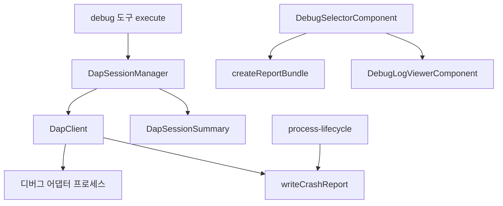

# Debugging and Diagnostics

## 디버깅 및 진단

이 모듈은 GJC에서 두 가지 개발자 진단 흐름을 담당합니다.

1. `DebugSelectorComponent` 기반의 대화형 진단 메뉴
2. `DapClient`와 `DapSessionManager` 기반의 Debug Adapter Protocol(DAP) 세션 관리

대화형 진단 메뉴는 성능 리포트, 메모리 리포트, 로그 뷰어, 시스템 정보, 원시 SSE 스트림, 세션 아티팩트 관리를 제공합니다. DAP 계층은 `src/tools/debug.ts`에서 호출되는 디버거 도구의 실행 기반이며, 외부 디버그 어댑터를 실행하고 DAP 메시지를 주고받으며 브레이크포인트, 스택, 변수, 메모리, 모듈 정보를 세션 상태로 정리합니다.

## DAP 계층

DAP 구현은 `packages/coding-agent/src/dap/` 아래에 있습니다.

- `client.ts`: DAP 프로토콜 전송, 요청/응답 매칭, 이벤트 디스패치, 어댑터 프로세스 생명주기 처리
- `config.ts`: 기본 디버그 어댑터 설정 정규화, 실행 파일/작업 디렉터리 기준 어댑터 선택
- `session.ts`: 디버그 세션 상태, 브레이크포인트, 실행 제어, 스택/변수/메모리 조회 관리
- `types.ts`: DAP 메시지, 세션 요약, 브레이크포인트, 어댑터 설정, 실행/첨부 인자 타입 정의

### `DapClient`

`DapClient`는 디버그 어댑터와 직접 통신하는 낮은 수준의 클라이언트입니다. 외부 어댑터 프로세스를 `spawnOwnedProcess()`로 실행하고, DAP의 `Content-Length` 헤더 기반 메시지를 읽고 씁니다.

핵심 흐름은 다음과 같습니다.

1. `DapClient.spawn({ adapter, cwd })`가 어댑터의 `connectMode`를 확인합니다.
2. `stdio` 모드면 어댑터의 stdin/stdout을 DAP 전송 채널로 사용합니다.
3. `socket` 모드면 플랫폼별 소켓 연결을 준비합니다.
   - Linux: `#spawnSocketUnix()`가 Unix domain socket을 기다린 뒤 `connectSocket()`으로 연결합니다.
   - macOS 및 기타 플랫폼: `#spawnSocketClientAddr()`가 로컬 TCP 리스너를 열고 어댑터의 `--client-addr` 접속을 기다립니다.
4. `#startMessageReader()`가 스트림을 계속 읽으며 `parseMessage()`로 완성된 DAP 메시지를 분리합니다.
5. 메시지 종류에 따라 `#handleResponse()`, `#dispatchEvent()`, `#handleAdapterRequest()`로 전달됩니다.

`sendRequest()`는 요청 번호를 증가시키고 `#pendingRequests`에 resolver를 등록한 뒤 `writeMessage()`로 전송합니다. 응답이 도착하면 `request_seq`로 대기 중인 요청을 찾아 성공 응답은 body로 resolve하고, 실패 응답은 `message`를 사용해 reject합니다. 요청에는 기본 30초 타임아웃이 있으며, `AbortSignal`이 전달되면 취소 시 `ToolAbortError` 또는 signal reason으로 실패합니다.

`onEvent()`, `onAnyEvent()`, `waitForEvent()`는 DAP 이벤트 구독 API입니다. `waitForEvent()`는 특정 이벤트가 조건에 맞을 때까지 기다리는 고수준 유틸리티이며, `DapSessionManager`가 `stopped`, `terminated`, `exited`, `initialized` 이벤트를 기다릴 때 사용합니다.

어댑터가 역방향 요청을 보낼 수도 있습니다. `onReverseRequest()`로 등록된 핸들러가 있으면 `#handleAdapterRequest()`가 `sendResponse()`로 성공/실패 응답을 돌려줍니다. 현재 세션 계층에서는 `runInTerminal`과 `startDebugging`을 등록합니다.

### DAP 메시지 파싱

DAP는 HTTP처럼 `Content-Length` 헤더와 빈 줄(`\r\n\r\n`) 뒤에 JSON payload가 오는 형식입니다. 이 모듈은 다음 작은 함수들로 메시지를 처리합니다.

- `findHeaderEnd(buffer)`: 헤더 종료 위치를 찾습니다.
- `parseMessage(buffer)`: 헤더와 body 길이를 확인하고 완성된 메시지 하나와 남은 버퍼를 반환합니다.
- `writeMessage(sink, message)`: JSON 직렬화 후 `Content-Length` 헤더와 body를 순서대로 씁니다.

`#startMessageReader()`는 partial read를 고려해 `#messageBuffer`에 누적하고, 한 번의 read 안에 여러 메시지가 들어온 경우에도 반복해서 파싱합니다.

### 프로세스 종료와 충돌 진단

`DapClient`는 어댑터 프로세스가 종료되면 `#handleProcessExit()`를 실행합니다. 이 함수는 stderr, exit code, command, protocol 정보를 `writeCrashReport()`에 넘기고, 결과를 `formatCrashDiagnosticNotice()`로 사용자에게 보여줄 수 있는 문장으로 변환합니다.

충돌 진단은 환경 변수로 켜집니다.

- `GJC_CRASH_DIAGNOSTICS=1|true|yes`: 충돌 리포트 파일 쓰기 활성화
- `GJC_CRASH_DIAGNOSTICS_DIR`: 리포트 저장 디렉터리 지정
- 기본 저장 위치: `${os.tmpdir()}/gjc-crash-diagnostics`

리포트 디렉터리는 `0o700`, 파일은 `0o600` 권한으로 생성됩니다. `writeCrashReport()`는 정상 종료나 진단 비활성 상태에서는 파일을 쓰지 않고 분류 결과만 반환합니다.

`classifyProcessCrash()`는 프로세스 종료를 다음 class로 분류합니다.

- `clean_exit`
- `non_zero_exit`
- `signal_exit`
- `timeout`
- `cancelled`
- `spawn_error`
- `protocol_exit`
- `native_panic`
- `unknown`

현재 분기에서는 timeout, cancelled, spawn error, signal, exit code, protocol completion 실패를 직접 판정합니다.

## 어댑터 설정과 선택

`config.ts`는 `defaults.json`에서 기본 어댑터 설정을 읽고 `DapAdapterConfig`로 정규화합니다. 외부 입력은 `normalizeAdapterConfig()`에서 한 번 정리됩니다.

정규화 규칙은 보수적입니다.

- `command`가 비어 있거나 문자열이 아니면 해당 어댑터는 무시됩니다.
- `args`, `languages`, `fileTypes`, `rootMarkers`는 문자열 배열만 남깁니다.
- `fileTypes`는 소문자로 변환합니다.
- `launchDefaults`, `attachDefaults`는 plain object일 때만 복사합니다.
- `connectMode`는 `"socket"`일 때만 명시하고, 나머지는 `stdio`로 처리됩니다.

주요 함수는 다음과 같습니다.

- `getAdapterConfigs()`: 기본 어댑터 설정 복사본을 반환합니다.
- `resolveAdapter(adapterName, cwd)`: `resolveCommand()`로 실행 가능한 command를 찾아 `DapResolvedAdapter`를 만듭니다.
- `getAvailableAdapters(cwd)`: 현재 작업 디렉터리에서 실행 가능한 어댑터 목록을 반환합니다.
- `selectLaunchAdapter(program, cwd, adapterName?)`: 프로그램 경로와 확장자, root marker를 기준으로 launch 어댑터를 고릅니다.
- `selectAttachAdapter(cwd, adapterName?, port?)`: attach 용 어댑터를 고릅니다.

확장자가 없는 실행 파일은 특별히 다룹니다. `getMatchingAdapters()`는 확장자가 없을 때 `gdb`, `lldb-dap` 같은 네이티브 디버거 또는 root marker가 맞는 어댑터만 후보로 둡니다. 이 처리는 C/C++ 바이너리에 `debugpy` 같은 무관한 어댑터가 자동 선택되는 문제를 막습니다.

## `DapSessionManager`

`DapSessionManager`는 하나의 활성 디버그 세션을 관리하는 고수준 API입니다. `dapSessionManager` 싱글턴으로 export되며, `src/tools/debug.ts`가 launch, attach, continue, step, stack trace, variable lookup 같은 도구 명령을 이 객체로 위임합니다.

세션 내부 상태는 `DapSession` 인터페이스로 관리됩니다. 이 타입은 외부로 export되지 않고, 외부에는 `DapSessionSummary` 형태의 스냅샷만 반환합니다.

세션이 추적하는 핵심 상태는 다음과 같습니다.

- `id`, `adapter`, `cwd`, `program`
- 현재 `status`: `"launching"`, `"configuring"`, `"stopped"`, `"running"`, `"terminated"`
- source/function/instruction/data 브레이크포인트
- DAP output 누적 버퍼
- 현재 stop 위치: thread, frame, source, line, column, instruction pointer
- thread 목록과 마지막 stack frame 목록
- adapter capabilities
- `configurationDone` 필요 여부와 전송 여부
- `runInTerminal`로 만든 하위 프로세스들

`buildSummary(session)`는 이 내부 상태를 `DapSessionSummary`로 변환합니다. 도구 호출자는 내부 Map이나 클라이언트 객체 대신 이 요약을 받습니다.

### launch와 attach

`launch()`와 `attach()`는 구조가 거의 같습니다.

1. `#ensureLaunchSlot()`으로 기존 활성 세션이 없는지 확인합니다.
2. `DapClient.spawn()`으로 어댑터를 실행합니다.
3. `#registerSession()`으로 세션을 등록하고 이벤트 핸들러를 설치합니다.
4. `client.initialize()`로 DAP initialize 요청을 보냅니다.
5. 어댑터 capability에서 `supportsConfigurationDoneRequest`를 확인합니다.
6. `launch` 또는 `attach` 요청을 보냅니다.
7. `#completeConfigurationHandshake()`로 `initialized` 이벤트와 `configurationDone` 흐름을 처리합니다.
8. `stopOnEntry` 같은 초기 정지 이벤트가 있으면 `#fetchTopFrame()`으로 top frame을 채웁니다.

중요한 구현 포인트는 launch/attach 요청과 `configurationDone` 순서입니다. 일부 어댑터는 `configurationDone`이 오기 전까지 launch/attach 응답을 보내지 않습니다. 그래서 `launch()`와 `attach()`는 요청 Promise를 먼저 만들고, configuration handshake를 완료한 뒤 launch/attach 응답을 기다립니다.

또한 `trackDapStartRequest()`와 `throwPreferredDapStartError()`가 launch/attach 실패와 `configurationDone` 실패를 조합합니다. 둘 다 실패한 경우에는 두 에러 메시지를 함께 보여주고, 동일 메시지면 원래 에러를 유지합니다.

### 세션 등록과 이벤트 처리

`#registerSession()`은 새 `DapSession`을 만들고 DAP 이벤트 핸들러를 등록합니다.

등록되는 주요 이벤트는 다음과 같습니다.

- `output`: `truncateOutput()`으로 세션 output 버퍼에 누적합니다.
- `initialized`: `initializedSeen`을 true로 바꾸고 상태를 `configuring`으로 전환합니다.
- `stopped`: `#handleStoppedEvent()`로 stop reason과 thread id를 저장합니다.
- `continued`: 상태를 `running`으로 바꾸고 stop/frame 정보를 초기화합니다.
- `exited`: exit code를 저장합니다.
- `terminated`: 상태를 `terminated`로 바꿉니다.

역방향 요청도 여기서 등록됩니다.

`runInTerminal` 요청은 어댑터가 디버깅 대상 프로세스를 별도 터미널에서 실행하고 싶을 때 사용합니다. 이 구현은 실제 터미널을 열지 않고 `spawnOwnedProcess()`로 non-interactive 환경에서 실행한 뒤 stdout/stderr를 drain합니다. 생성된 프로세스는 `runInTerminalProcesses`에 넣어 세션 dispose 시 함께 정리합니다.

`startDebugging` 요청은 child debug session 요청입니다. 현재 구현은 요청 내용을 debug 로그에 남기고 빈 객체를 반환합니다. 실제 child session을 생성하지는 않습니다.

### 실행 제어

실행 제어 메서드는 DAP 요청을 보내기 전에 stop 이벤트를 먼저 구독합니다. 이 순서가 중요합니다. 어댑터가 continue/step 응답과 같은 버퍼 안에 `stopped` 이벤트를 바로 보낼 수 있기 때문입니다.

- `continue()`: thread id를 결정하고 `continue` 요청을 보낸 뒤 stop/terminate/exit 결과를 기다립니다.
- `pause()`: 실행 중인 세션에 `pause`를 보내고 가능한 경우 `stopped` 이벤트를 기다립니다.
- `stepIn()`: `#step("stepIn")`
- `stepOut()`: `#step("stepOut")`
- `stepOver()`: `#step("next")`

`#prepareStopOutcome()`은 `stopped`, `terminated`, `exited` 이벤트를 `Promise.race()`로 묶습니다. losing promise의 timeout이 나중에 unhandled rejection이 되지 않도록 각 promise에 `.catch(() => {})`를 붙입니다.

`#awaitStopOutcome()`은 이벤트를 받으면 stopped 상태일 때 `#fetchTopFrame()`을 호출합니다. timeout이 발생해도 signal abort가 아니라면 오류를 던지지 않고 `{ state: "running", timedOut: true }` 형태로 현재 상태를 반환합니다.

### 브레이크포인트

브레이크포인트 API는 DAP의 “전체 목록 재전송” 모델에 맞춰 구현되어 있습니다. 하나를 추가하거나 제거할 때도 해당 종류의 전체 목록을 다시 보냅니다.

- `setBreakpoint(file, line, condition?)`
- `removeBreakpoint(file, line)`
- `setFunctionBreakpoint(name, condition?)`
- `removeFunctionBreakpoint(name)`
- `setInstructionBreakpoint(instructionReference, offset?, condition?, hitCondition?)`
- `removeInstructionBreakpoint(instructionReference, offset?)`
- `dataBreakpointInfo(name, variablesReference?, frameId?)`
- `setDataBreakpoint(dataId, accessType?, condition?, hitCondition?)`
- `removeDataBreakpoint(dataId)`

source 브레이크포인트는 `normalizePath()`로 절대 경로를 만든 뒤 line 기준으로 중복 제거하고 정렬합니다. 응답 매핑은 `#mapSourceBreakpoints()`, `#mapFunctionBreakpoints()`, `#mapInstructionBreakpoints()`, `#mapDataBreakpoints()`가 담당합니다. 이 함수들은 입력 순서와 어댑터 응답 배열 순서를 맞춰 `id`, `verified`, `message` 같은 adapter 결과를 세션 record에 반영합니다.

### 스택, 스코프, 변수, 평가

정지 상태의 디버깅 정보 조회는 다음 메서드들이 담당합니다.

- `threads()`: thread 목록을 갱신합니다.
- `stackTrace(frameCount?)`: 현재 thread의 stack frame을 가져오고 top frame을 stop 위치에 반영합니다.
- `scopes(frameId?)`: frame id가 없으면 현재 stop frame을 사용합니다.
- `variables(variableReference)`: scope나 variable에서 받은 reference로 하위 변수를 조회합니다.
- `evaluate(expression, context, frameId?)`: frame id가 없으면 현재 top stopped frame을 사용합니다.

`scopes()`는 frame id를 찾을 수 없으면 `"No active stack frame. Run stack_trace first or supply frame_id."` 오류를 던집니다. 이 메시지는 호출자가 먼저 `stackTrace()`를 호출해야 하는 상태를 명확히 알려줍니다.

### 메모리와 모듈 조회

DAP capability에 따라 다음 요청도 지원됩니다.

- `disassemble(memoryReference, instructionCount, offset?, instructionOffset?, resolveSymbols?)`
- `readMemory(memoryReference, count, offset?)`
- `writeMemory(memoryReference, data, offset?, allowPartial?)`
- `modules(startModule?, moduleCount?)`
- `loadedSources()`
- `customRequest(command, args?)`

이 메서드들은 모두 `#sendRequestWithConfig()`를 통해 `configurationDone`이 필요한 세션인지 확인한 뒤 DAP 요청을 보냅니다.

### output 버퍼와 세션 정리

`truncateOutput()`은 `output` 이벤트 내용을 세션에 누적하되 최대 `MAX_OUTPUT_BYTES`인 128 KiB를 넘으면 앞부분을 잘라냅니다. `getOutput(limitBytes?)`는 전체 output 또는 뒤쪽 일부만 반환합니다.

세션 정리는 세 가지 경로로 일어납니다.

- 사용자가 `terminate()`를 호출합니다.
- cleanup loop가 idle session을 발견합니다.
- 어댑터 프로세스가 종료되어 `client.isAlive()`가 false가 됩니다.

`#runCleanupLoop()`는 30초 간격으로 `#cleanupIdleSessions()`를 실행합니다. 10분 이상 사용되지 않았거나 종료된 세션은 `#disposeSession()`으로 제거됩니다. dispose 시 `runInTerminal` 하위 프로세스도 함께 종료합니다.

## 대화형 진단 메뉴

`packages/coding-agent/src/debug/index.ts`는 TUI 안에서 여는 디버그 메뉴를 제공합니다. 진입점은 `showDebugSelector(ctx, done)`이고, 반환되는 컴포넌트는 `DebugSelectorComponent`입니다.

`DEBUG_MENU_ITEMS`에는 다음 항목이 있습니다.

- `open-artifacts`: 현재 세션 아티팩트 폴더 열기
- `performance`: CPU profiling 후 리포트 번들 생성
- `work`: 최근 30초 work scheduling flamegraph 열기
- `dump`: 현재 세션 덤프 리포트 즉시 생성
- `memory`: heap snapshot과 리포트 번들 생성
- `logs`: 최근 로그 뷰어 열기
- `system`: 시스템 정보 표시
- `raw-sse`: provider SSE frame 보기
- `transcript`: 현재 TUI transcript export
- `clear-cache`: 오래된 artifact cache 정리

`DebugSelectorComponent`는 `SelectList`를 사용해 메뉴를 그리고, 선택된 value를 `#handleSelection()`에서 각 handler로 라우팅합니다.

### 리포트 생성

성능, 덤프, 메모리 리포트는 모두 `createReportBundle()`로 끝납니다.

`#handlePerformanceReport()`는 `startCpuProfile()`로 CPU profiling을 시작한 뒤 사용자가 Enter 또는 Escape를 누를 때까지 기다립니다. 이후 `session.stop()`으로 CPU profile을 얻고 `getWorkProfile(30)` 결과와 함께 리포트 번들을 만듭니다.

`#handleDumpReport()`는 별도 profile 없이 현재 session file과 설정 정보를 번들링합니다.

`#handleMemoryReport()`는 `generateHeapSnapshotData()`로 heap snapshot을 만들고 이를 리포트에 포함합니다.

세 handler 모두 `#getResolvedSettings()`로 현재 모델, thinking level, plan mode, tool output 표시 상태 같은 세션 설정을 같이 넣습니다.

### 로그 뷰어

로그 뷰어는 `DebugLogViewerComponent`와 `DebugLogViewerModel`로 나뉩니다.

`DebugLogViewerModel`은 순수 상태 모델에 가깝습니다. 로그 문자열을 `splitLogText()`로 줄 단위로 나누고, 각 줄에서 `parseDebugLogTimestampMs()`와 `parseDebugLogPid()`를 사용해 timestamp와 pid를 추출합니다. 이후 필터, 선택, 확장, older log loading, current process 필터링을 모두 모델 내부에서 처리합니다.

주요 동작은 다음과 같습니다.

- 초기에는 마지막 50개 로그만 표시합니다.
- `loadOlder()`는 메모리에 이미 있는 과거 로그를 더 보여주거나, `DebugLogSource.loadOlderLogs()`로 외부 로그를 prepend합니다.
- `setFilterQuery()`는 문자열 포함 기준으로 표시 로그를 필터링합니다.
- `toggleProcessFilter()`는 현재 process pid와 일치하는 로그만 표시하도록 전환합니다.
- `expandSelected()`와 `collapseSelected()`는 선택된 로그의 줄바꿈 표시 방식을 바꿉니다.
- `selectAllVisible()`과 range selection은 현재 표시된 로그만 대상으로 합니다.

`SESSION_BOUNDARY_WARNING`은 현재 프로세스 시작 이전 로그와 이후 로그가 함께 보일 때 경계 표시로 삽입됩니다. 이로써 사용자는 “현재 세션 로그”와 “이전 세션에서 남은 로그”를 구분할 수 있습니다.

표시용 포맷은 `log-formatting.ts`가 담당합니다.

- `formatDebugLogLine(line, maxWidth)`: sanitize, tab 치환, 단일 줄 truncate
- `formatDebugLogExpandedLines(line, maxWidth)`: sanitize, tab 치환, 줄바꿈 segment별 wrap
- `parseDebugLogTimestampMs(line)`: JSON 로그의 `timestamp`를 millisecond로 변환
- `parseDebugLogPid(line)`: JSON 로그의 `pid`를 추출

`buildLogCopyPayload()`는 선택된 로그를 클립보드로 복사할 때 텍스트를 sanitize하고 빈 줄을 제거합니다.

### Raw SSE와 시스템 정보

`#handleViewRawSse()`는 `resolveRawSseDebugBuffer(this.ctx.session)`로 현재 세션의 SSE 디버그 버퍼를 찾고 `RawSseViewerComponent`로 표시합니다. 관련 실행 흐름에서 `AgentSession`은 `RawSseDebugBuffer`를 만들고 provider response를 기록합니다.

`#handleViewSystemInfo()`는 `collectSystemInfo()`와 `formatSystemInfo()`를 사용해 환경 정보를 TUI에 표시합니다.

## 코드베이스 연결점

이 모듈은 독립적인 디버깅 UI가 아니라 여러 런타임 계층과 맞물립니다.

`src/tools/debug.ts`는 DAP 세션 API의 주 호출자입니다. 실행 흐름은 보통 `execute()`에서 시작해 `DapSessionManager.launch()` 또는 `attach()`로 들어가고, 이어서 `DapClient.initialize()`와 `sendRequest()`가 호출됩니다. 취소는 `ToolAbortError` 흐름으로 전파됩니다.

`src/runtime/process-lifecycle.ts`는 DAP 어댑터와 `runInTerminal` 프로세스의 소유권을 관리합니다. `spawnOwnedProcess()`로 만든 프로세스는 `dispose()`와 `awaitExit()`로 정리되며, 비정상 종료 시 postmortem 경로와도 연결됩니다.

`src/exec/non-interactive-env.ts`의 `NON_INTERACTIVE_ENV`는 DAP 어댑터와 debuggee 프로세스가 shell job control이나 `/dev/tty`에 의존하지 않도록 주입됩니다. `DapClient.spawn()` 주석에도 있듯이, 일부 debuggee child가 controlling terminal을 잡으면 `SIGTTIN`으로 parent harness가 멈출 수 있으므로 non-interactive 실행 환경이 중요합니다.

`src/modes/controllers/selector-controller.ts`는 `showDebugSelector()`를 호출해 TUI 안에서 디버그 메뉴를 엽니다.

`src/session/agent-session.ts`는 raw SSE 디버그 버퍼와 연결됩니다. provider 응답은 `RawSseDebugBuffer.recordResponse()` 쪽으로 기록되고, 디버그 메뉴의 raw SSE viewer가 이를 표시합니다.

`src/eval/py/executor.ts` 같은 실행기 계층은 `writeCrashReport()`를 직접 호출할 수 있습니다. 즉 충돌 진단은 DAP 전용이 아니라 bash, python, lsp, dap, mcp, browser, worker, native 같은 여러 process kind를 공통 형식으로 기록하는 기반 기능입니다.

## 변경 시 주의할 점

DAP 메시지 reader 안에서 추가 요청을 보내는 구조는 조심해야 합니다. `#fetchTopFrame()` 주석처럼, 이벤트 dispatch loop 안에서 stackTrace 요청을 보내면 reader가 응답을 처리하지 못해 deadlock이 날 수 있습니다. 그래서 stopped 이벤트에서는 stop 위치만 저장하고, top frame 조회는 command 처리 흐름 바깥에서 수행합니다.

continue/step 계열은 요청 전에 이벤트 구독을 먼저 해야 합니다. 어댑터에 따라 command response와 stop event가 같은 read buffer에 들어올 수 있으므로, 순서를 바꾸면 stop 이벤트를 놓칠 수 있습니다.

브레이크포인트는 단건 patch가 아니라 전체 목록 재전송입니다. `setBreakpoint()`나 `removeBreakpoint()`를 수정할 때는 세션에 저장된 기존 목록을 유지한 채 DAP `setBreakpoints` 요청 payload를 다시 구성해야 합니다.

로그 뷰어는 표시 모델과 TUI 컴포넌트가 분리되어 있습니다. 필터링, 선택, older log loading 같은 규칙은 `DebugLogViewerModel`에 두고, 렌더링과 입력 처리는 `DebugLogViewerComponent`에 두는 구조를 유지하는 편이 안전합니다.

충돌 리포트는 민감한 정보를 담을 수 있으므로 권한 설정이 중요합니다. `ensurePrivateDiagnosticsDirectory()`와 `writePrivateCrashReport()`가 각각 `0o700`, `0o600`을 강제하는 이유가 여기에 있습니다.