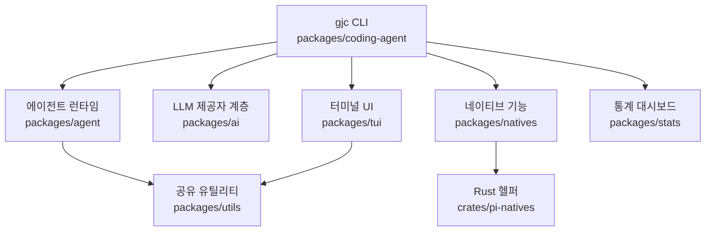

# Dependency and Support Boundary

## 개요

이 모듈은 Gajae-Code 저장소의 “제품 코드”와 “지원 코드” 사이의 경계를 설명합니다. 런타임 함수나 클래스가 있는 실행 모듈이라기보다, 워크스페이스 구성, 패키지 역할, 공개 CLI 표면, 설정 스키마, 검증 명령을 통해 코드베이스의 의존 방향을 정리하는 경계 문서입니다.

이 모듈의 핵심 원칙은 `packages/coding-agent/`를 주 제품 표면으로 두고, 나머지 패키지를 지원 계층으로 분리하는 것입니다. 사용자가 `gjc`를 실행할 때 경험하는 CLI, 워크플로우, 기본 스킬, 역할 에이전트는 `packages/coding-agent/`가 소유하고, LLM 호출, 도구 실행, TUI 렌더링, 네이티브 바인딩, 통계 대시보드는 별도 패키지가 담당합니다.

## 패키지 경계

저장소는 Bun 워크스페이스로 구성됩니다. 루트 `package.json`의 `workspaces.packages`는 다음 범위를 포함합니다.

```json
{
  "packages": [
    "packages/*",
    "python/robogjc/web"
  ]
}
```

주요 TypeScript 패키지는 `packages/*` 아래에 있고, `python/robogjc/web`은 Python 기반 RoboGJC 웹 프런트엔드가 워크스페이스에 함께 포함되는 예외적인 지원 표면입니다.

| 패키지 | 역할 |
| --- | --- |
| `packages/coding-agent` | `gjc` CLI의 주 제품 표면입니다. 세션 실행, 워크플로우 스킬, 역할 에이전트, 설정, TUI 통합을 조립합니다. |
| `packages/ai` | 여러 LLM 제공자와 모델 설정을 다루는 AI 클라이언트 계층입니다. |
| `packages/agent` | 도구 호출과 상태 관리를 포함한 에이전트 런타임 계층입니다. |
| `packages/tui` | 터미널 UI 렌더링과 차등 갱신을 담당합니다. |
| `packages/natives` | 텍스트, 이미지, grep류 작업에 쓰이는 네이티브 바인딩을 제공합니다. |
| `packages/stats` | `gjc stats`용 로컬 관측 대시보드입니다. |
| `packages/utils` | 여러 패키지에서 공유하는 유틸리티입니다. |
| `crates/pi-natives` | Rust 기반 네이티브 헬퍼입니다. |

문서화나 코드 변경을 할 때 기본 분석 대상은 `packages/coding-agent/`입니다. 다른 패키지는 `coding-agent`를 보조하는 의존 또는 지원 경계로 설명하는 것이 기본입니다.

## 의존 방향



`packages/coding-agent`는 사용자가 직접 접하는 명령과 워크플로우를 조립하는 상위 계층입니다. 하위 패키지는 구체적인 기능을 제공합니다. 예를 들어 AI 제공자 통합은 `packages/ai`, 화면 출력은 `packages/tui`, 네이티브 성능 작업은 `packages/natives`가 맡습니다.

이 경계가 중요한 이유는 다음과 같습니다.

- CLI 정책과 제품 표면 변경은 `packages/coding-agent`에서 시작해야 합니다.
- LLM 제공자, 모델 호환성, 비용, 컨텍스트 창 같은 변경은 `packages/ai` 쪽에서 다루어야 합니다.
- 터미널 표시 문제는 `packages/tui` 또는 `packages/coding-agent`의 렌더러 연결부에서 확인해야 합니다.
- 네이티브 바인딩이나 Rust 빌드 문제는 `packages/natives`와 `crates/pi-natives` 경계를 함께 봐야 합니다.

## 공개 워크플로우 표면

Gajae-Code는 기본 워크플로우 스킬을 네 개로 제한합니다.

| 스킬 | 목적 | 소스 |
| --- | --- | --- |
| `deep-interview` | 모호한 요구사항을 구현 전에 구체화합니다. | `packages/coding-agent/src/defaults/gjc/skills/deep-interview/SKILL.md` |
| `ralplan` | 변경 전 계획과 검토 게이트를 제공합니다. | `packages/coding-agent/src/defaults/gjc/skills/ralplan/SKILL.md` |
| `ultragoal` | 목표, 수정, 검증, 증거를 지속 장부로 관리합니다. | `packages/coding-agent/src/defaults/gjc/skills/ultragoal/SKILL.md` |
| `team` | tmux 기반 병렬 작업자를 조율합니다. | `packages/coding-agent/src/defaults/gjc/skills/team/SKILL.md` |

역할 에이전트도 네 개로 제한됩니다.

| 역할 | 목적 | 소스 |
| --- | --- | --- |
| `executor` | 제한된 구현, 수정, 리팩터링을 수행합니다. | `packages/coding-agent/src/prompts/agents/executor.md` |
| `architect` | 읽기 전용 아키텍처 분석과 코드 리뷰를 수행합니다. | `packages/coding-agent/src/prompts/agents/architect.md` |
| `planner` | 읽기 전용 실행 순서와 수용 기준을 정리합니다. | `packages/coding-agent/src/prompts/agents/planner.md` |
| `critic` | 계획의 실행 가능성과 위험을 비판적으로 검토합니다. | `packages/coding-agent/src/prompts/agents/critic.md` |

기본 스킬이나 역할 에이전트를 추가하면 단순 문서 변경이 아니라 제품 표면 변경입니다. 따라서 관련 테스트와 게이트도 함께 갱신해야 합니다.

## 설정 스키마 경계

`schemas/config.schema.json`과 `schemas/models.schema.json`은 사용자가 작성하는 설정 파일의 공개 계약입니다.

`schemas/config.schema.json`은 `packages/coding-agent/src/config/settings-schema.ts`에서 생성되는 `config.yml` 스키마입니다. 주요 영역은 다음과 같습니다.

- `auth`: 브로커 URL과 토큰 같은 인증 설정
- `autoResume`: 현재 디렉터리의 최근 세션 자동 재개 여부
- `power`: `caffeinate` 기반 절전 방지 동작
- `theme`, `symbolPreset`, `statusLine`, `display`: TUI 표시 설정
- `retry`: 요청 재시도와 스트림 재시도 예산
- `task`: 하위 에이전트 격리, 병렬성, 모델 오버라이드 설정
- `tools`: 도구 출력 제한, 아티팩트 저장, 타임아웃, 디스커버리 모드
- `skills`, `commands`, `mcp`, `browser`, `web_search`: 확장 표면 활성화 설정
- `hindsight`, `memory`, `memories`: 기억 시스템 설정

`schemas/models.schema.json`은 `packages/coding-agent/src/config/models-config-schema.ts`에서 생성되는 `models.yml` 스키마입니다. 이 스키마는 제공자별 모델 정의와 호환성 플래그를 다룹니다.

주요 패턴은 다음과 같습니다.

```yaml
providers:
  my-provider:
    baseUrl: "https://example.invalid/v1"
    apiKeyEnv: "MY_PROVIDER_API_KEY"
    api: "openai-responses"
    models:
      - id: "my-model"
        name: "My Model"
        contextWindow: 128000
```

모델 호환성은 `compat` 아래에 명시됩니다. 예를 들어 `supportsReasoningEffort`, `requiresToolResultName`, `toolChoiceSupport`, `thinkingFormat`, `supportsStrictMode` 같은 필드는 제공자별 요청 변환과 도구 호출 처리에 영향을 줍니다.

스키마 파일은 생성물입니다. 설정 계약을 바꾸려면 스키마 JSON을 직접 편집하지 말고, 소스 스키마를 수정한 뒤 `bun scripts/generate-json-schemas.ts` 또는 `bun run check:schemas` 흐름으로 갱신해야 합니다.

## TypeScript와 빌드 경계

루트 `tsconfig.base.json`은 전체 TypeScript 워크스페이스의 공통 컴파일 계약입니다.

중요한 설정은 다음과 같습니다.

- `strict: true`: 모든 패키지에 엄격한 타입 검사를 적용합니다.
- `moduleResolution: "Bundler"`: Bun과 번들러 기반 ESM 해석을 전제로 합니다.
- `verbatimModuleSyntax: true`: import/export 문법을 TypeScript가 임의로 바꾸지 않습니다.
- `allowArbitraryExtensions: true`: 텍스트 프롬프트나 자산 import 같은 패턴을 허용합니다.
- `types: ["bun", "assets"]`: Bun 런타임과 자산 타입을 전역 타입 환경에 포함합니다.

`tsconfig.json`은 직접 파일을 포함하지 않고 두 프로젝트를 참조합니다.

- `packages/tsconfig.workspace.json`: `packages/*`의 `src`, `test`, `tests`, `scripts`, `bench`, `bin`, `native`를 포함합니다.
- `tsconfig.tools.json`: 루트 `scripts`를 포함합니다.

이 구조는 제품 패키지와 루트 도구 스크립트를 분리하면서 같은 기본 타입 정책을 공유하게 합니다.

## 개발 명령과 검증 경계

루트 `package.json`의 scripts는 저장소 전체 검증 흐름을 정의합니다.

일반 개발 흐름은 다음과 같습니다.

```sh
bun install
bun run build:native
bun run install:defaults
```

개발 중 전역 `gjc`를 현재 체크아웃의 TypeScript 소스로 연결하려면 다음 명령을 사용합니다.

```sh
bun run dev:link
```

검증 명령은 범위별로 나뉩니다.

| 명령 | 목적 |
| --- | --- |
| `bun run check` | TypeScript와 Rust 검사를 병렬 실행합니다. |
| `bun run check:ts` | 도구, Node 20 기준선, 스키마, UI 게이트, 워크스페이스 타입 검사를 실행합니다. |
| `bun run test` | TypeScript 테스트와 Rust 테스트를 실행합니다. |
| `bun run ci:test:smoke` | `gjc --version`, `gjc --help`, `gjc stats --help`, `gjc --smoke-test`를 실행합니다. |
| `bun run generate-schemas` | JSON 스키마를 생성합니다. |
| `bun run check:schemas` | 생성된 JSON 스키마가 최신인지 확인합니다. |

워크플로우 정의나 리브랜딩 표면을 바꾸면 다음 게이트를 함께 실행해야 합니다.

```sh
bun scripts/check-visible-definitions.ts
bun scripts/verify-g002-gates.ts
bun scripts/rebrand-inventory.ts --strict
bun test packages/coding-agent/test/default-gjc-definitions.test.ts
```

## 외부 도구와의 경계

Gajae-Code는 Codex CLI, Claude Code, OpenCode, Claw Code의 플러그인이 아니라 외부 실행 하네스입니다. README의 권장 사용 방식도 이 경계를 유지합니다.

- Codex CLI 옆에서 실행할 때는 `gjc --tmux --worktree <name>` 또는 `gjc`를 사용합니다.
- Claude Code 옆에서도 `gjc --tmux` 또는 `gjc --tmux --worktree <name>`를 사용합니다.
- 기존 worktree 디렉터리를 직접 지정하지 않고, 해당 디렉터리로 `cd`한 뒤 `gjc --tmux`를 실행합니다.
- 외부 컨트롤러나 봇은 `gjc mcp-serve coordinator`, `gjc setup hermes`, `gjc --mode rpc` 같은 일반 MCP/RPC 표면을 통해 연결합니다.

즉, GJC는 다른 에이전트 런타임 내부로 숨어 들어가지 않습니다. 저장소 또는 worktree 옆에서 별도의 계획, 실행, 검증 레이어로 동작합니다.

## 기여 시 확인할 점

이 모듈의 변경은 대부분 경계 변경입니다. 따라서 “어느 패키지가 무엇을 소유하는가”를 먼저 확인해야 합니다.

- CLI 동작, 기본 스킬, 역할 에이전트, 런타임 상태 경로는 `packages/coding-agent/` 관점에서 봅니다.
- 모델 제공자나 요청 호환성은 `schemas/models.schema.json`의 공개 계약과 `packages/ai` 쪽 소스 계약을 함께 봅니다.
- 사용자 설정은 `schemas/config.schema.json`과 `packages/coding-agent/src/config/settings-schema.ts`의 생성 관계를 유지해야 합니다.
- 새 워커를 추가할 때는 `packages/coding-agent/scripts/build-binary.ts`의 추가 컴파일 엔트리도 함께 확인해야 합니다.
- `packages/coding-agent/`에서는 `console.log`, `console.warn`, `console.error`를 쓰지 않고 중앙 로거를 사용해야 합니다.
- TUI에 표시되는 텍스트는 `replaceTabs()`, `truncateToWidth()` 또는 `ui.truncate()`, `shortenPath()` 같은 기존 유틸리티로 폭과 경로를 정리해야 합니다.

이 모듈 자체에는 내부 호출, 외부 호출, 감지된 실행 흐름이 없습니다. 대신 저장소의 패키지 구조, 설정 스키마, 개발 명령, 공개 워크플로우 표면을 통해 다른 모듈이 어디까지 책임져야 하는지를 정합니다.