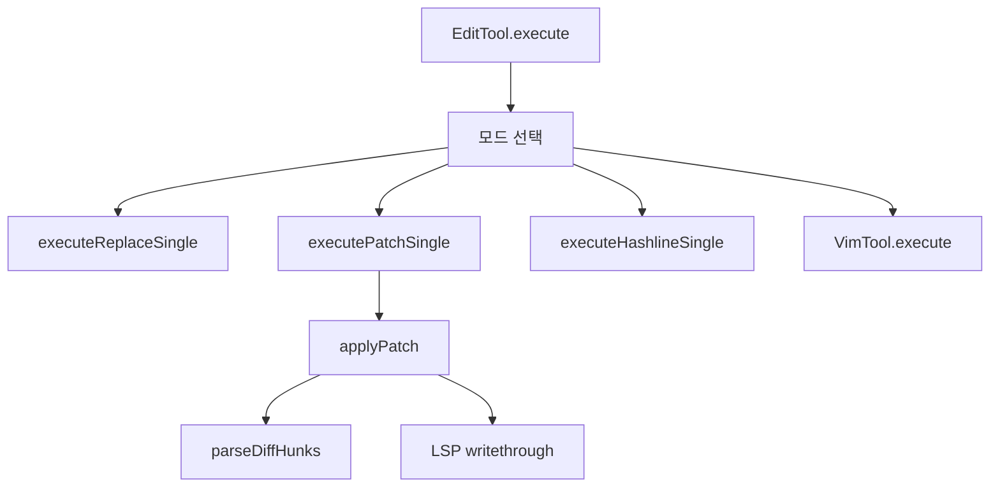

# Editing and Vim

## Editing and Vim 모듈

이 모듈은 `edit` 도구가 파일 변경을 안전하게 적용하고, Vim 스타일 편집을 같은 도구 표면에서 실행하도록 묶는 계층입니다. 중심 진입점은 `EditTool`이며, 현재 세션 설정과 환경 변수에 따라 `replace`, `patch`, `apply_patch`, `hashline`, `vim` 모드 중 하나를 선택합니다.



## 역할

`Editing and Vim`은 단순 파일 쓰기 유틸이 아니라, 에이전트가 생성한 변경 의도를 실제 파일 시스템 변경으로 변환하는 실행 경계입니다.

주요 책임은 다음과 같습니다.

- 편집 모드별 스키마와 설명 프롬프트 제공
- 파일 변경 전 plan-mode와 자동 생성 파일 보호 정책 적용
- diff, patch, replace, hashline, Vim 입력을 실제 쓰기로 변환
- LSP format/diagnostics writethrough 연결
- 변경 후 diff, 진단, 메타데이터를 렌더러가 사용할 수 있는 `EditToolDetails`로 반환
- 파일 스캔 캐시 무효화와 지연 LSP 진단 주입

## `EditTool`

`packages/coding-agent/src/edit/index.ts`의 `EditTool`이 모듈의 공개 도구 클래스입니다.

```ts
export class EditTool implements AgentTool<TInput> {
	readonly name = "edit";
	readonly label = "Edit";
	readonly nonAbortable = true;
	readonly concurrency = "exclusive";
	readonly strict = true;
}
```

`EditTool`은 생성 시 다음 값을 결정합니다.

- `PI_EDIT_VARIANT`: 강제 편집 모드. `auto`이면 `resolveEditMode(session)`을 사용합니다.
- `PI_EDIT_FUZZY`: fuzzy match 허용 여부. `auto`이면 `session.settings.get("edit.fuzzyMatch")`를 사용합니다.
- `PI_EDIT_FUZZY_THRESHOLD`: fuzzy match 임계값. `auto`이면 `session.settings.get("edit.fuzzyThreshold")`를 사용합니다.
- LSP writethrough: `createEditWritethrough()`가 `lsp.diagnosticsOnEdit`, `lsp.formatOnWrite`, `session.enableLsp`를 기준으로 `createLspWritethrough()` 또는 `writethroughNoop`을 선택합니다.
- Vim 실행기: 내부적으로 `new VimTool(session)`을 보유합니다.

`description`, `parameters`, `customFormat`, `customWireName`은 현재 `mode`에 따라 달라집니다. 특히 `apply_patch` 모드에서는 OpenAI 코드 백엔드 호환을 위해 Lark grammar와 wire-level 이름 `apply_patch`를 노출합니다.

## 편집 모드

### `replace`

`replace` 모드는 특정 `oldText`를 `newText`로 바꾸는 텍스트 치환 모드입니다.

실행 경로는 다음과 같습니다.

1. `EditTool.execute()`
2. `#getModeDefinition().replace.execute`
3. `executeSinglePathEntries()`
4. `executeReplaceSingle()`
5. `replaceText()`
6. `generateDiffString()`

`replaceText()`는 먼저 정확한 문자열 일치를 찾고, 필요하면 `findMatch()` 기반 fuzzy matching을 사용합니다. `all` 옵션이 켜져 있으면 모든 정확 일치를 한 번에 바꾸고, 정확 일치가 없을 때 fuzzy match를 반복 적용합니다.

단일 치환에서는 중복 매치를 오류로 처리합니다. 이때 `formatOccurrenceMatchError()`가 후보 위치 프리뷰를 만들어 “더 많은 문맥을 추가하라”는 오류를 반환합니다.

### `patch`

`patch` 모드는 단일 파일에 대한 create/delete/update 작업을 수행합니다. 중심 함수는 `executePatchSingle()`과 `applyPatch()`입니다.

`executePatchSingle()`은 도구 실행 계층에 가까운 함수입니다.

- `enforcePlanModeWrite()`로 plan-mode 쓰기 정책을 확인합니다.
- `resolvePlanPath()`로 실제 쓰기 경로를 확정합니다.
- `assertEditableFile()`로 자동 생성 파일 보호를 적용합니다.
- `LspFileSystem`을 통해 쓰기를 LSP writethrough와 연결합니다.
- 적용 후 파일 내용이 실제로 바뀌었는지 재확인합니다.
- `invalidateFsScanAfterWrite()`, `invalidateFsScanAfterDelete()`, `invalidateFsScanAfterRename()`으로 파일 스캔 캐시를 무효화합니다.
- 결과 diff와 diagnostics를 `EditToolDetails`에 담아 반환합니다.

`applyPatch()`는 순수 패치 적용 로직입니다. `PatchInput`은 다음 구조를 갖습니다.

```ts
export interface PatchInput {
	path: string;
	op: "create" | "delete" | "update";
	rename?: string;
	diff?: string;
}
```

작업별 동작은 다음과 같습니다.

- `create`: `normalizeCreateContent()`로 `+` 접두어를 제거할 수 있고, 최종 개행을 보장한 뒤 파일을 씁니다.
- `delete`: 기존 파일을 읽어 `oldContent`로 보관한 뒤 삭제합니다.
- `update`: 기존 내용을 읽고 BOM, 줄바꿈 형식을 보존한 채 diff hunk를 적용합니다. `rename`이 있으면 새 경로에 쓰고 원본을 삭제합니다.

### `apply_patch`

`apply_patch` 모드는 OpenAI 코드 백엔드의 `*** Begin Patch ... *** End Patch` envelope를 받는 모드입니다.

두 계층이 있습니다.

- `packages/coding-agent/src/edit/apply-patch/parser.ts`: envelope를 `PatchInput[]`으로 파싱합니다.
- `packages/coding-agent/src/edit/modes/apply-patch.ts`: `PatchInput`을 `PatchEditEntry & { path: string }` 형태로 낮춰 `executePatchSingle()`로 보냅니다.

`parseApplyPatch()`는 엄격한 적용용 파서입니다. 시작 줄은 `*** Begin Patch`, 마지막 줄은 `*** End Patch`여야 합니다. `parseApplyPatchStreaming()`은 TUI 프리뷰용이며, 누락된 종료 마커나 덜 끝난 hunk를 일부 허용합니다.

지원하는 파일 작업 헤더는 다음과 같습니다.

```text
*** Add File: <path>
*** Delete File: <path>
*** Update File: <path>
*** Move to: <newpath>
```

`applyCodexPatch()`는 raw envelope를 직접 받아 여러 hunk를 순서대로 적용하는 오케스트레이터입니다. 이 적용은 원자적이지 않습니다. 앞 hunk가 성공하고 뒤 hunk가 실패하면 앞 변경은 이미 디스크에 반영되어 있습니다. 성공 시 `formatApplyCodexPatchSummary()`가 `A`, `M`, `D` 요약을 생성합니다.

### `hashline`

`hashline` 모드는 `executeHashlineSingle()`로 위임됩니다. 이 모드는 줄 해시 기반 앵커를 사용하며, `file-read-cache.ts`의 `FileReadCache`와 연결됩니다.

`FileReadCache`는 현재 `ToolSession`이 `read` 또는 `search` 도구로 본 파일 스냅샷을 저장합니다. hashline 편집 시 디스크 내용이 앵커 작성 당시와 달라졌다면, 캐시된 pre-edit snapshot을 기준으로 편집을 재생하고 live file에 3-way merge하는 복구 흐름에 사용됩니다.

캐시는 세션 단위이며, 경로 30개까지 LRU로 유지합니다.

주요 API는 다음과 같습니다.

- `get(absPath)`
- `recordContiguous(absPath, startLine, lines)`
- `recordSparse(absPath, entries)`
- `invalidate(absPath)`
- `clear()`
- `getFileReadCache(session)`

### `vim`

`vim` 모드는 `EditTool` 내부의 `VimTool`로 위임됩니다.

```ts
return await tool.#vimTool.execute("edit", params as VimParams, signal, handleUpdate);
```

Vim 실행 자체는 `src/tools/vim.ts`, `src/vim/engine.ts`, `src/vim/buffer.ts` 쪽에서 처리합니다. 이 모듈에서 중요한 점은 Vim이 별도 도구가 아니라 `edit` 모드 중 하나로 노출된다는 것입니다. 따라서 UI 업데이트, tool result shape, 세션 연결은 다른 편집 모드와 같은 표면을 공유합니다.

콜 그래프상 Vim 흐름은 다음 구조를 가집니다.

- `VimTool.execute()`가 `VimEngine`을 생성하거나 사용합니다.
- `#executeNormal`, `#executeInsert`, `#executeVisual`, `#executeEx`가 모드별 명령을 처리합니다.
- `src/vim/buffer.ts`의 `setCursor()`, `replaceOffsets()`, `deleteLines()`, `insertLines()`, `getText()` 등이 실제 버퍼 변경을 수행합니다.
- 렌더링은 `renderVimDetails()`와 `buildToolDetailsFromEngine()`을 통해 도구 결과로 변환됩니다.

## diff와 patch 파싱

`packages/coding-agent/src/edit/diff.ts`는 diff 생성, patch hunk 파싱, replace preview 계산을 담당합니다.

주요 함수는 다음과 같습니다.

- `generateDiffString(oldContent, newContent, contextLines)`
- `generateUnifiedDiffString(oldContent, newContent, contextLines)`
- `normalizeDiff(diff)`
- `parseDiffHunks(diff)`
- `replaceText(content, oldText, newText, options)`
- `computeEditDiff(path, oldText, newText, cwd, fuzzy, all, threshold)`

`generateDiffString()`은 native `@gajae-code/natives.diffLines`를 먼저 사용하고, 실패하면 `diff` 패키지의 `Diff.diffLines()`로 fallback합니다. 테스트에서는 `__setDiffLinesForTest()`, `__clearDiffLinesForTest()`, `__getNativeDiffLinesForTest()`로 native diff 경로를 제어할 수 있습니다.

`parseDiffHunks()`는 단일 파일 patch만 허용합니다. `*** Update File:`, `*** Add File:`, `*** Delete File:`, `diff --git` 같은 multi-file marker가 여러 파일을 가리키면 `ApplyPatchError`를 던집니다.

hunk 파서는 다음 입력을 처리합니다.

- 표준 unified hunk header: `@@ -1,2 +1,3 @@`
- 빈 context marker: `@@`
- 설명형 context marker: `@@ functionName`
- line hint: `@@ lines 10-12 @@`
- top-of-file hint: `@@ top of file`
- EOF marker: `*** End of File`

## fuzzy matching과 문맥 기반 적용

`patch` 모드는 단순 문자열 교체보다 강한 복구 전략을 갖습니다. 핵심은 `computeReplacements()`입니다.

적용 과정은 대략 다음과 같습니다.

1. hunk의 `changeContext`, line hint, EOF 여부를 해석합니다.
2. `findHierarchicalContext()`로 함수, 클래스, 중첩 anchor 문맥을 찾습니다.
3. `seekSequence()`로 제거 대상 old lines를 찾습니다.
4. 실패하면 `buildFallbackVariants()`가 만든 축약 hunk를 시도합니다.
5. 중복 매치가 있으면 preview와 함께 오류를 냅니다.
6. `adjustLinesIndentation()`으로 실제 파일의 indentation에 맞게 new lines를 보정합니다.
7. 겹치는 replacement를 검출한 뒤 `applyReplacements()`로 뒤에서부터 적용합니다.

fallback variant는 다음 유형을 사용합니다.

- `trim-common`: 앞뒤 공통 문맥 제거
- `dedupe-shared`: 연속 중복 공유 라인 축약
- `collapse-repeated`: 반복 블록 축약
- `single-line`: 한 줄만 바뀐 hunk로 축약

공격적인 fallback인 `collapse-repeated`, `single-line`은 hunk에 `changeContext`, line hint, EOF marker 같은 추가 위치 정보가 있을 때만 허용됩니다.

## 줄바꿈, BOM, indentation 보존

파일 쓰기 전후 정규화는 `normalize.ts` 계층을 통해 처리됩니다.

`applyPatch()`의 update 흐름은 다음 보존 정책을 따릅니다.

- `stripBom()`으로 BOM을 분리하고, 필요하면 binary read로 BOM 존재 여부를 재확인합니다.
- `detectLineEnding()`으로 기존 줄바꿈 형식을 감지합니다.
- 내부 적용은 `normalizeToLF()` 기준으로 수행합니다.
- 결과는 `restoreLineEndings()`로 원래 줄바꿈 형식에 맞춥니다.
- 기존 파일이 final newline을 가지고 있으면 유지하고, 없으면 trailing newline을 제거합니다.

indentation 보정은 `adjustLinesIndentation()`이 담당합니다. 이 함수는 다음 경우를 별도로 처리합니다.

- 패턴과 실제 매치가 이미 완전히 같으면 모델이 의도한 new lines를 그대로 둡니다.
- 변경이 indentation 자체인 경우 지정된 diff를 그대로 적용합니다.
- 패턴은 tab, 실제 파일은 space인 경우 tab width를 추론해 변환합니다.
- 반대로 패턴은 space, 실제 파일은 tab인 경우 `(tabs, spaces)` 샘플로 tab width와 offset을 추론합니다.
- 같은 trimmed content가 실제 파일에 있으면 context line은 실제 파일의 indentation을 우선합니다.

## LSP writethrough와 diagnostics

편집 쓰기는 직접 `Bun.write()`만 호출하지 않습니다. 도구 실행 경로에서는 `LspFileSystem`이 `WritethroughCallback`을 감싸서 사용합니다.

```ts
class LspFileSystem implements FileSystem {
	async write(path: string, content: string): Promise<void> {
		const result = await this.writethrough(path, finalContent, this.signal, file, this.batchRequest, deferred);
		if (result) this.#lastDiagnostics = result;
	}
}
```

이 구조 덕분에 파일 쓰기와 동시에 LSP format, diagnostics를 실행할 수 있습니다. diagnostics가 edit tool 반환 이후 늦게 도착하면 `#beginDeferredDiagnosticsForPath()`와 `#injectLateDiagnostics()`가 세션의 deferred message queue에 숨김 메시지로 추가합니다.

삭제 작업에서는 batch flush가 필요한 경우 `flushLspWritethroughBatch()`를 호출해 남은 diagnostics를 회수합니다.

patch warning은 `mergeDiagnosticsWithWarnings()`에서 diagnostics 메시지 앞에 `patch:` 접두어로 합쳐집니다.

## 다중 편집 집계

`executeSinglePathEntries()`는 한 파일에 여러 replace/patch entry를 순차 적용합니다. 각 entry는 같은 batch id를 공유하되, 마지막 entry에서만 `flush`를 유지합니다. 중간 결과는 `onUpdate`로 emit되어 UI가 진행 중 diff를 표시할 수 있습니다.

`executeApplyPatchPerFile()`은 `apply_patch` envelope가 여러 파일을 건드릴 때 사용됩니다. 파일별 결과를 `perFileResults`에 누적하고, 성공한 diff를 합쳐 반환합니다. 특정 파일에서 오류가 나도 이전 파일 결과는 유지되며, 해당 파일 항목에는 `isError`, `errorText`, `displayErrorText`가 들어갑니다.

이 설계는 `apply_patch`의 비원자적 의미와 맞닿아 있습니다. 여러 hunk 또는 여러 파일 변경은 순차 실행되며, 실패 시 이미 성공한 변경을 자동 롤백하지 않습니다.

## 렌더러와 세션 연결

편집 결과는 `EditToolDetails` 또는 `VimToolDetails`로 반환됩니다. 렌더러는 이 details를 사용해 diff, diagnostics, operation title, per-file result, Vim 상태를 표시합니다.

주요 연결점은 다음과 같습니다.

- `renderCall()`은 `getOperationTitle()`로 작업 제목을 정합니다.
- `render()`는 `formatDiagnostics()`, `formatStatusIcon()`, `renderStatusLine()` 등을 사용합니다.
- `renderStreamingFallback()`은 streaming 중인 입력을 preview 형태로 보여줍니다.
- `getLspBatchRequest()`는 tool call context에서 LSP batch 정보를 추출합니다.

## 안전 장치

이 모듈은 파일 쓰기 전에 여러 안전 장치를 통과합니다.

- `enforcePlanModeWrite()`: 현재 plan-mode에서 허용된 파일인지 검사합니다.
- `resolvePlanPath()`: plan-mode 기준 경로를 실제 경로로 변환합니다.
- `assertEditableFile()`: 자동 생성 파일 등 편집 금지 대상을 막습니다.
- post-write verification: update 후 파일이 byte-identical이면 `ToolError`를 던집니다.
- multi-file marker check: 단일 파일 patch에 여러 파일 marker가 섞이면 거부합니다.
- ambiguous match detection: 중복 매치가 있으면 적용하지 않고 문맥 추가를 요구합니다.
- overlapping hunk detection: replacement 범위가 겹치면 오류를 반환합니다.

## 기여 시 주의점

새 편집 모드를 추가하려면 `EditTool.#getModeDefinition()`에 description, zod schema, execute 함수를 추가해야 합니다. mode 선택은 `resolveEditMode()`와 `normalizeEditMode()` 경로도 함께 확인해야 합니다.

patch 적용 로직을 바꿀 때는 `applyPatch()`와 `executePatchSingle()`의 책임을 분리해서 유지하는 것이 중요합니다. `applyPatch()`는 파일 시스템 추상화 위에서 동작하는 적용 엔진이고, `executePatchSingle()`은 세션 정책, LSP, 캐시 무효화, 결과 렌더링 메타데이터를 붙이는 도구 실행 계층입니다.

Vim 동작을 바꿀 때는 `src/vim/engine.ts`와 `src/vim/buffer.ts`의 상태 전이를 먼저 확인해야 합니다. `edit/index.ts`는 Vim을 실행 모드로 연결할 뿐, normal/insert/visual/ex 명령의 세부 의미를 구현하지 않습니다.

fuzzy matching이나 hunk fallback을 수정할 때는 모호한 매치를 성공으로 처리하지 않도록 주의해야 합니다. 이 모듈은 “적당히 맞는 위치에 적용”보다 “문맥 부족이면 실패”를 더 안전한 기본값으로 둡니다.