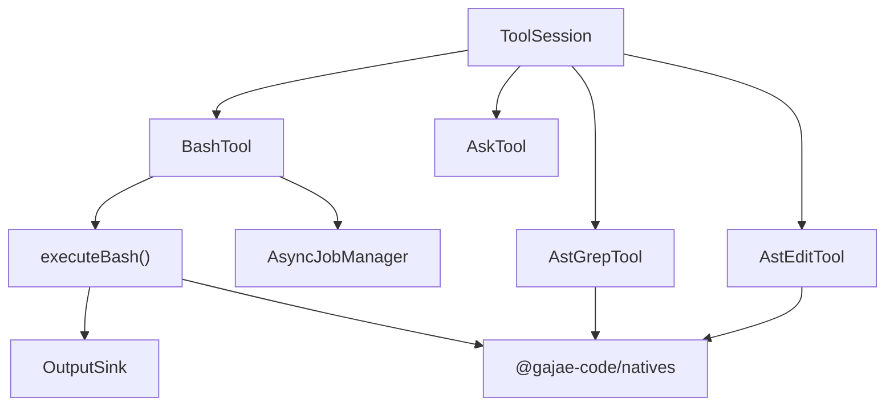

# Execution and Tools

## 실행 및 도구 모듈

이 모듈은 GJC 에이전트가 외부 명령을 실행하고, 사용자에게 질문하며, 코드 검색/수정을 구조적으로 수행하는 도구 계층입니다. 핵심 책임은 세 가지입니다.

- `executeBash()`와 `BashTool`을 통한 셸 명령 실행
- `AskTool`을 통한 대화형 또는 워크플로 게이트 기반 사용자 입력 수집
- `AstGrepTool`, `AstEditTool`을 통한 AST 기반 검색과 변경 제안

도구 구현은 `AgentTool` 인터페이스를 따르며, 각 도구는 입력 스키마, 실행 로직, 결과 메타데이터, TUI 렌더러를 함께 제공합니다.



## 셸 실행 계층

### `executeBash()`

`packages/coding-agent/src/exec/bash-executor.ts`의 `executeBash(command, options)`는 실제 셸 실행을 담당하는 저수준 함수입니다. 도구 UI나 세션 권한 정책을 직접 다루지 않고, 명령 실행과 출력 수집, 취소, 타임아웃, 세션 재사용만 처리합니다.

주요 흐름은 다음과 같습니다.

1. `Settings.init()`으로 셸 설정을 읽습니다.
2. `settings.getShellConfig()`에서 `shell`, `env`, `prefix`를 가져옵니다.
3. bash 계열 셸이면 `getOrCreateSnapshot()`으로 셸 스냅샷을 준비합니다.
4. `buildMinimizerOptions()`로 출력 minimizer 설정을 구성합니다.
5. `OutputSink`를 만들어 출력 청크, 원본 청크, artifact 저장, 잘림 정보를 관리합니다.
6. persistent `Shell` 또는 one-shot `executeShell()`을 선택해 실행합니다.
7. 완료, 취소, 타임아웃, minimizer 적용, crash diagnostic notice를 정리해 `BashResult`를 반환합니다.

`BashExecutorOptions`는 실행의 동작을 세밀하게 조정합니다.

- `cwd`: 명령 실행 디렉터리입니다. `resolveShellCwd()`가 가능한 경우 실경로로 정규화합니다.
- `timeout`: 밀리초 단위 타임아웃입니다. `null`이면 실행 타임아웃을 비활성화합니다.
- `onChunk`: UI나 진행 표시용으로 throttle된 출력 콜백입니다.
- `onRawChunk`: 모든 sanitize된 stdout/stderr 청크를 빠짐없이 받는 콜백입니다. 백그라운드 작업과 Monitor 도구가 전체 스트림을 보존할 때 사용합니다.
- `signal`: 외부 취소 신호입니다.
- `sessionKey`: persistent shell 세션을 에이전트별로 분리하는 키 일부입니다.
- `env`: 명령별 추가 환경 변수입니다. 내부적으로 `NON_INTERACTIVE_ENV`와 병합됩니다.
- `artifactPath`, `artifactId`: 전체 출력 저장 위치입니다.
- `oneShot`: persistent `Shell`을 세션 레지스트리에 보존하지 않고 실행합니다.
- `onMinimizedSave`: minimizer가 출력을 줄였을 때 원본 텍스트를 artifact로 저장하는 콜백입니다.

### persistent shell 세션

`executeBash()`는 기본적으로 같은 설정 조합에 대해 native `Shell` 인스턴스를 재사용합니다. 세션 키는 `buildSessionKey()`에서 구성되며 다음 값이 포함됩니다.

- 에이전트 세션 키
- 셸 경로
- 명령 prefix
- 셸 snapshot 경로
- 정렬된 환경 변수
- minimizer 설정

취소나 타임아웃이 발생하면 해당 세션은 재사용하지 않습니다. 이때 `brokenShellSessions`와 `retiringShellSessions`가 사용됩니다.

- `brokenShellSessions`: 현재 안전하게 재사용할 수 없는 세션 키
- `retiringShellSessions`: JS 호출은 반환됐지만 native 실행 unwind가 끝나지 않았을 수 있는 셸
- `CANCEL_CLEANUP_WAIT_MS`: 취소 후 정리를 기다리는 짧은 유예 시간

`disposeAllShellSessions()`는 모든 persistent shell과 retiring shell을 abort하고 레지스트리를 비웁니다. 이 함수는 `postmortem.register("bash-executor:shell-sessions", ...)`로 등록되어 프로세스 종료나 owner teardown 시 native 리소스를 해제합니다.

### 출력 minimizer와 artifact

`buildMinimizerOptions(group)`는 `ShellMinimizerSettings`를 native `MinimizerOptions`로 변환합니다. minimizer가 실제 출력을 줄이면 `winner.result.minimized`가 반환됩니다.

이 경우 `executeBash()`는 다음 순서로 처리합니다.

1. `sink.replace(minimized.text)`로 표시 출력을 minimized 텍스트로 교체합니다.
2. `options.onMinimizedSave(minimized.originalText, info)`가 있으면 원본을 저장합니다.
3. 저장된 artifact id가 있으면 출력 끝에 `[raw output: artifact://<id>]`를 추가합니다.

이 구조 덕분에 에이전트 UI는 짧은 출력을 보여주면서도 원본 바이트를 나중에 복구할 수 있습니다.

## `BashTool`

`packages/coding-agent/src/tools/bash.ts`의 `BashTool`은 사용자에게 노출되는 `bash` 도구입니다. `executeBash()`보다 상위 계층에 있으며, 세션 정책과 도구 UX를 담당합니다.

`BashTool`의 공개 도구 속성은 다음과 같습니다.

- `name = "bash"`
- `label = "Bash"`
- `loadMode = "essential"`
- `concurrency = "exclusive"`
- `strict = true`

입력 스키마는 `bashSchemaBase`와 `bashSchemaWithAsync`로 나뉩니다. `async.enabled` 설정이 켜져 있으면 `async` 필드가 포함됩니다.

```ts
{
	command: string;
	env?: Record<string, string>;
	timeout?: number; // 초 단위
	cwd?: string;
	async?: boolean;
	pty?: boolean;
}
```

### 실행 준비: `#prepareBashExecution()`

`#prepareBashExecution()`은 `BashTool.execute()`와 `startMonitorJob()`이 공유하는 준비 단계입니다. 이 함수는 Bash 도구의 정책을 한곳에 모아 Monitor 경로도 동일한 검증과 확장을 거치도록 합니다.

주요 처리 순서는 다음과 같습니다.

1. `normalizeBashEnv()`로 환경 변수 이름을 검증합니다.
2. `applyBashFixups()`로 설정에 따라 trailing `head`/`tail` 패턴을 정리합니다.
3. `cd <dir> && <command>` 형태를 감지해 `cwd`와 실제 명령을 분리합니다.
4. restricted role-agent 환경이면 `checkBashAllowedPrefixes()`로 허용 prefix를 확인합니다.
5. bash interceptor가 켜져 있으면 `checkBashInterception()`으로 전용 도구 사용을 유도하거나 차단합니다.
6. `expandInternalUrls()`로 명령, 환경 변수, cwd 내부 URL을 로컬 경로로 확장합니다.
7. `buildGjcRuntimeSessionEnv()`로 GJC 런타임 세션 환경을 주입합니다.
8. `resolveToCwd()`와 `fs.promises.stat()`으로 작업 디렉터리를 검증합니다.
9. `clampTimeout("bash", requestedTimeoutSec)`로 타임아웃을 허용 범위 안으로 제한합니다.

이 함수에서 만들어진 값은 다음 실행 경로가 공유합니다.

- 일반 foreground bash
- 명시적 async bash
- 자동 background bash
- client bridge terminal 실행
- Monitor 도구용 background job

### 실행 경로

`BashTool.execute()`는 입력과 세션 기능에 따라 여러 경로 중 하나를 선택합니다.

- `async: true`: `#startManagedBashJob()`로 즉시 백그라운드 작업을 등록합니다.
- 자동 background 활성화: 일정 시간 안에 끝나면 foreground 결과를 반환하고, 넘기면 job id와 preview를 반환합니다.
- client bridge terminal 사용 가능: 에디터/클라이언트가 제공하는 terminal capability로 명령을 실행합니다.
- `pty: true`: 로컬 PTY 경로인 `runInteractiveBashPty()`를 사용합니다.
- 기본 경로: `executeBash()`를 직접 호출합니다.

`#buildCompletedResult()`는 `BashResult` 또는 `BashInteractiveResult`를 `AgentToolResult<BashToolDetails>`로 변환합니다. `#buildResultText()`는 실패 처리를 강하게 합니다.

- `cancelled`이면 `ToolError`
- interactive 결과가 `timedOut`이면 `ToolError`
- `exitCode`가 없으면 `ToolError`
- `exitCode !== 0`이면 출력과 exit code를 포함한 `ToolError`

즉, `bash` 도구는 성공 exit code만 정상 결과로 반환하고, 실패는 도구 오류로 표면화합니다.

### 백그라운드 작업과 Monitor 연결

`#startManagedBashJob()`은 `AsyncJobManager`에 bash 작업을 등록합니다. 실행 중에는 다음 두 출력 경로를 동시에 유지합니다.

- `onChunk`: `TailBuffer`에 누적하고 진행 업데이트를 보냅니다.
- `onRawChunk`: `manager.appendOutput(jobId, chunk)`로 전체 스트림을 저장합니다.

`startMonitorJob()`은 Monitor 도구가 bash 실행을 사용할 수 있게 하는 공개 helper입니다. 이 함수도 `#prepareBashExecution()`을 거치므로 bash interceptor, internal URL, env, cwd, timeout 정책을 동일하게 적용합니다.

Monitor 경로는 `onRawChunk`에서 `manager.readOutputSince()`를 호출하고, newline 단위로 `onRawLine(line, jobId)`를 호출합니다. trailing line은 프로세스 종료 시 `flushTrailingLine()`으로 전달됩니다.

## 간단한 명령 실행: `execCommand()`

`packages/coding-agent/src/exec/exec.ts`의 `execCommand(command, args, cwd, options)`는 hooks와 custom tools가 사용하는 작은 실행 wrapper입니다. `ptree.exec()`를 호출하고 `ExecResult`로 정규화합니다.

반환값은 다음 필드를 가집니다.

- `stdout`
- `stderr`
- `code`
- `killed`

`allowNonZero: true`, `allowAbort: true`를 사용하므로 non-zero exit 자체를 예외로 다루지 않습니다. 호출자는 `code`와 `killed`를 보고 후속 처리를 결정해야 합니다.

## idle timeout 감시

`packages/coding-agent/src/exec/idle-timeout-watchdog.ts`의 `IdleTimeoutWatchdog`은 출력이 없는 실행을 감시하는 유틸리티입니다. 일반 wall-clock timeout과 달리 `touch()`가 호출될 때마다 idle timer를 갱신합니다.

핵심 상태는 다음과 같습니다.

- `signal`: 내부 `AbortController.signal`
- `timedOut`: idle timeout으로 abort됐는지 여부
- `abortedBySignal`: 외부 signal로 abort됐는지 여부
- `hardTimeoutPromise`: abort 후 hard timeout grace가 끝났음을 알리는 promise

사용 패턴은 다음과 같습니다.

```ts
const watchdog = new IdleTimeoutWatchdog({
	timeoutMs,
	signal,
	hardTimeoutGraceMs,
	onAbort: reason => {
		// 한국어 주석: idle-timeout 또는 signal 원인을 기록한다.
	},
});

watchdog.touch(); // 한국어 주석: 출력이나 진행 이벤트가 있을 때 호출한다.
```

`formatIdleTimeoutMessage(timeoutMs)`는 사용자에게 보여줄 메시지를 만듭니다. `timeoutMs`가 없으면 `"Command timed out without output"`, 있으면 초 단위 메시지를 반환합니다.

## 사용자 입력 도구: `AskTool`

`packages/coding-agent/src/tools/ask.ts`의 `AskTool`은 실행 중 사용자에게 질문하는 도구입니다. TUI가 있는 세션에서는 selector/editor UI를 사용하고, unattended workflow gate가 있는 세션에서는 gate emitter를 통해 외부 응답을 받습니다.

도구 생성은 `AskTool.createIf(session)`에서 제한됩니다.

- `session.hasUI`가 true이거나
- `session.getWorkflowGateEmitter?.()`가 있으면 생성됩니다.

그 외 headless 환경에서 gate도 없으면 `ToolAbortError("Ask tool requires interactive mode")`가 발생합니다.

### 입력 스키마

`askSchema`는 하나 이상의 질문을 받습니다.

```ts
{
	questions: [
		{
			id: string;
			question: string;
			options: [{ label: string }];
			multi?: boolean;
			recommended?: number;
			deepInterview?: {
				round_id?: string;
				round: number;
				component: string;
				dimension: string;
				ambiguity: number;
			};
		}
	]
}
```

`recommended`는 option index입니다. 표시 단계에서는 해당 option에 `" (Recommended)"`가 붙고, 결과에서는 `stripRecommendedSuffix()`로 제거됩니다.

### 선택 처리

실제 선택 로직은 `askSingleQuestion()`에 있습니다.

- 단일 선택: option 하나 또는 `Other (type your own)` 입력
- 다중 선택: checkbox 형태로 option을 토글하고 `Done selecting`으로 완료
- timeout: 추천 option이 있으면 추천 option, 없으면 첫 option 자동 선택
- navigation: 여러 질문에서는 좌/우 방향으로 이전/다음 질문 이동
- custom input: selector 안에서 inline 입력을 우선 사용하고, 지원하지 않는 UI에서는 editor fallback 사용

deep-interview 질문은 `isDeepInterviewAskQuestion()`과 `formatDeepInterviewSelectorPrompt()`를 통해 별도 표시 형식을 적용합니다. 이 경우 option label은 `numberOptionLabels()`로 번호가 붙어 표시되고, 결과는 원래 raw label로 다시 매핑됩니다.

### deep-interview 기록

질문에 `deepInterview` 메타데이터가 있으면 `#recordDeepInterviewRound()`가 실행됩니다. 이 메서드는 다음 값을 `appendOrMergeDeepInterviewRound()`에 전달합니다.

- `round`, `round_id`
- `questionId`, `questionText`
- `component`, `dimension`, `ambiguity`
- `selectedOptions`, `customInput`
- 세션 id와 state path

기록 실패는 `logger.warn()`으로 남기고 사용자 입력 흐름은 중단하지 않습니다.

### unattended workflow gate

`gateEmitter?.isUnattended() === true`이면 interactive UI 대신 gate 흐름을 사용합니다.

1. `questionToGate()`로 질문을 gate payload로 변환합니다.
2. `gateEmitter.emitGate()`로 외부 응답을 받습니다.
3. `gateAnswerToResult()`로 `selectedOptions`와 `customInput`을 복원합니다.

이 경로는 unattended 세션에서도 `AskTool`을 사용할 수 있게 해줍니다.

## AST 검색: `AstGrepTool`

`packages/coding-agent/src/tools/ast-grep.ts`의 `AstGrepTool`은 native `astGrep()`를 감싼 구조적 검색 도구입니다. 문자열 grep이 아니라 AST pattern 기반 검색을 수행합니다.

도구 속성은 다음과 같습니다.

- `name = "ast_grep"`
- `label = "AST Grep"`
- `summary = "Search code with AST patterns (structural grep)"`
- `strict = true`
- `loadMode = "discoverable"`

입력 스키마는 다음 필드를 받습니다.

- `pat`: AST pattern
- `paths`: 검색할 파일, 디렉터리, glob, internal URL
- `skip`: pagination용 offset

### 검색 범위 해석

`execute()`는 먼저 `resolveToolSearchScope()`를 호출합니다. 이 함수는 다음을 해결합니다.

- internal URL
- artifact path
- cwd 기준 상대 경로
- directory/file 여부
- glob filter
- multi-target 검색 범위

multi-target이면 `runMultiTargetAstGrep()`를 사용합니다. 이 함수는 각 target에 대해 `astGrep()`를 호출한 뒤, match path를 공통 base path 기준으로 rebasing하고 정렬합니다.

정렬 기준은 다음 순서입니다.

1. path
2. startLine
3. startColumn
4. byteStart
5. byteEnd

### 결과 구성

검색 결과는 `AstGrepToolDetails`에 저장됩니다.

- `matchCount`: 전체 match 수
- `fileCount`: match가 있는 파일 수
- `filesSearched`: 검색한 파일 수
- `limitReached`: 결과 제한 도달 여부
- `parseErrors`, `parseErrorsTotal`: 파싱 오류
- `files`: 표시용 파일 목록
- `fileMatches`: 파일별 match 수
- `displayContent`: TUI 전용 표시 텍스트
- `searchPath`: hyperlink 계산용 base path

모델-facing 출력과 TUI-facing 출력은 분리됩니다.

- 모델 출력: `formatMatchLine()`과 hashline 설정을 사용합니다.
- TUI 출력: `formatCodeFrameLine()`으로 gutter와 match marker를 표시합니다.

parse error가 있으면 검색 부재를 단정하지 않도록 `"Query may be mis-scoped; narrow paths before concluding absence"` 계열 메시지를 함께 표시합니다.

## AST 수정: `AstEditTool`

`packages/coding-agent/src/tools/ast-edit.ts`의 `AstEditTool`은 native `astEdit()`를 감싼 구조적 rewrite 도구입니다. 중요한 특징은 즉시 파일을 수정하지 않고, 먼저 dry-run preview를 만든 뒤 `resolve` 도구가 apply하도록 pending action을 등록한다는 점입니다.

도구 속성은 다음과 같습니다.

- `name = "ast_edit"`
- `label = "AST Edit"`
- `summary = "Perform AST-aware code edits (structural refactoring)"`
- `strict = true`
- `deferrable = true`
- `loadMode = "discoverable"`

입력 스키마는 다음과 같습니다.

- `ops`: `{ pat, out }` rewrite 목록
- `paths`: 수정할 파일, 디렉터리, glob, internal URL

### dry-run 우선 실행

`execute()`는 pattern을 검증한 뒤 `runAstEditOnce()`를 `dryRun: true`로 호출합니다.

검증 규칙은 다음과 같습니다.

- `ops`는 최소 1개여야 합니다.
- 각 `pat`는 비어 있으면 안 됩니다.
- 같은 `pat`가 중복되면 `ToolError`가 발생합니다.
- 최대 파일 수는 `PI_MAX_AST_FILES` 환경 변수 또는 기본값 `1000`입니다.

dry-run 결과는 `AstEditToolDetails`에 담깁니다.

- `totalReplacements`
- `filesTouched`
- `filesSearched`
- `applied`
- `limitReached`
- `parseErrors`, `parseErrorsTotal`
- `files`
- `fileReplacements`
- `displayContent`
- `searchPath`

### 변경 적용은 `resolve` 경유

dry-run에서 replacement가 발견되면 `queueResolveHandler()`로 pending action을 등록합니다. 사용자가 resolve apply를 선택하면 등록된 `apply()` 함수가 실행됩니다.

`apply()`는 다음을 수행합니다.

1. `assertDeepInterviewMutationRawPathsAllowed()`로 deep-interview 상태에서의 mutation 허용 여부를 확인합니다.
2. 같은 rewrite를 `dryRun: false`로 다시 실행합니다.
3. preview와 실제 적용 결과를 비교해 stale preview인지 검사합니다.
4. 적용 결과가 preview와 다르면 error result를 반환합니다.
5. 일치하면 `"Applied N replacements in M files."`를 반환합니다.

stale preview 검사는 다음 조건을 비교합니다.

- replacement 총 수
- touched file 수
- preview 파일별 replacement 수
- apply 파일별 replacement 수

이 구조는 preview 이후 파일이 바뀌었을 때 잘못된 변경이 조용히 적용되는 것을 막습니다.

## 렌더러 구조

`AskTool`, `AstGrepTool`, `AstEditTool`, `BashTool`은 실행 결과뿐 아니라 TUI 렌더러도 함께 제공합니다. 렌더러는 모델에게 반환되는 텍스트를 그대로 파싱하지 않고, 가능하면 `details.displayContent` 같은 별도 표시용 데이터를 사용합니다.

공통 패턴은 다음과 같습니다.

- `renderCall()`: 도구 호출 중 상태를 간단히 표시합니다.
- `renderResult()`: 성공, warning, error, collapsed/expanded 상태를 렌더링합니다.
- `renderStatusLine()`: 도구명, 상태 icon, description, meta, badge를 일관되게 표시합니다.
- `truncateToWidth()`, `replaceTabs()`, `formatCodeFrameLine()` 등으로 터미널 표시 안전성을 유지합니다.

AST 도구 렌더러는 `fileHyperlink()`를 사용해 표시 경로를 OSC 8 hyperlink로 연결합니다. `searchPath`와 grouped output의 디렉터리 context를 조합해 상대 경로를 절대 경로로 복원합니다.

## 다른 모듈과의 연결

이 모듈은 여러 하위 시스템과 직접 연결됩니다.

- `@gajae-code/natives`: `Shell`, `executeShell`, `astGrep`, `astEdit` 실행을 담당합니다.
- `Settings`: 셸 설정, minimizer, bash auto background, interceptor, tool availability를 제공합니다.
- `OutputSink`: bash 출력 수집, preview throttle, artifact 저장, truncate summary를 담당합니다.
- `AsyncJobManager`: async bash, auto background, Monitor 출력 스트림 저장을 담당합니다.
- `InternalUrlRouter`와 `expandInternalUrls()`: command/env/cwd/path 안의 internal URL을 로컬 경로로 변환합니다.
- `AgentSession`: 도구 권한, UI context, workflow gate, artifact manager, client bridge를 제공합니다.
- `deep-interview` runtime: `AskTool`의 structured round 기록과 `AstEditTool`의 mutation guard에 연결됩니다.
- `resolve` 도구: `AstEditTool`의 previewed rewrite를 실제 적용하는 승인 경로입니다.

## 기여 시 주의할 점

이 모듈을 수정할 때는 실행 경로가 여러 표면에서 공유된다는 점을 먼저 확인해야 합니다. 특히 `BashTool.#prepareBashExecution()`은 일반 bash뿐 아니라 Monitor 경로도 사용하므로, 여기서 정책을 바꾸면 백그라운드 작업과 terminal bridge 동작도 같이 바뀝니다.

`executeBash()`를 수정할 때는 persistent shell lifecycle을 함께 봐야 합니다. 취소와 타임아웃에서 `brokenShellSessions`, `retiringShellSessions`, `disposeAllShellSessions()`가 native 리소스 누수와 세션 재사용 오류를 막고 있습니다.

`AstEditTool`은 preview와 apply를 분리한 안전 모델을 갖고 있습니다. 즉시 파일을 수정하는 방향으로 바꾸면 `queueResolveHandler()`와 stale preview 검사라는 현재 계약을 깨게 됩니다.

`AskTool`은 interactive UI와 unattended workflow gate를 모두 지원합니다. 질문 표시 로직을 바꿀 때는 `askSingleQuestion()`, deep-interview 번호 매핑, `gateAnswerToResult()` 경로가 같은 결과 shape을 유지하는지 확인해야 합니다.