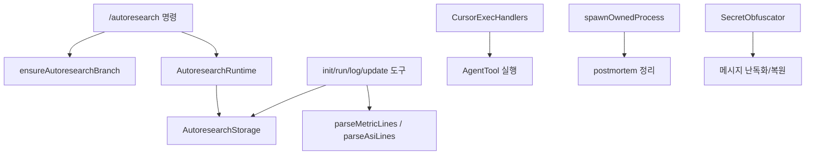

# General Utilities

## General Utilities

이 모듈은 `packages/coding-agent` 내부에서 여러 기능이 공통으로 의존하는 실행 보조 계층입니다. 단일 유틸리티 파일 하나가 아니라, 자동 연구(`autoresearch`), Cursor 실행 브리지, 에이전트 레지스트리, 런타임 프로세스 생명주기, 비밀값 처리처럼 서로 다른 하위 시스템의 기반 코드를 포함합니다.

핵심 책임은 다음과 같습니다.

- 자동 연구 세션의 Git 격리, 상태 재구성, SQLite 저장소, 지표 파싱
- Cursor 네이티브 실행 프로토콜을 GJC 도구 호출로 변환
- 실행 중인 메인 에이전트와 서브에이전트 등록 및 조회
- 자식 프로세스와 비프로세스 리소스의 안전한 종료 보장
- `secrets.yml` 및 환경 변수 기반 비밀값 수집, 난독화, 복원



## 자동 연구 유틸리티

`src/autoresearch` 아래의 유틸리티들은 `/autoresearch` 워크플로의 상태, Git 안전장치, 실험 지표, 저장소를 담당합니다. 실제 확장 진입점은 `createAutoresearchExtension`이며, 이 함수가 명령, 단축키, 세션 이벤트, 실험 도구를 등록합니다.

### Git 격리

`ensureAutoresearchBranch(api, workDir, goal)`은 자동 연구 세션을 가능한 한 `autoresearch/*` 브랜치에서 실행하도록 보장합니다.

동작 순서는 다음과 같습니다.

1. `git.repo.root(workDir)`로 저장소 루트를 찾습니다.
2. 저장소가 아니면 브랜치 격리 없이 진행할 수 있도록 `warning`을 포함한 성공 결과를 반환합니다.
3. `git.status(..., { porcelainV1: true, untrackedFiles: "all", z: true })`로 작업 트리 변경사항을 검사합니다.
4. 현재 브랜치가 이미 `autoresearch/`로 시작하면 그대로 사용합니다.
5. 작업 트리가 더럽다면 새 브랜치를 만들지 않고 실패를 반환합니다.
6. 작업 트리가 깨끗하면 `allocateBranchName`으로 브랜치명을 만들고 `git.branch.checkoutNew`로 체크아웃합니다.

반환 타입은 `EnsureAutoresearchBranchResult`입니다. 성공 시 `branchName`, `created`, 선택적 `warning`을 제공하고, 실패 시 `error`를 제공합니다.

```ts
const branchResult = await ensureAutoresearchBranch(api, ctx.cwd, goalArg);
if (!branchResult.ok) {
	ctx.ui.notify(branchResult.error, "error");
	return;
}
```

브랜치명은 `autoresearch/${slug}-${YYYYMMDD}` 형식입니다. `slugifyGoal`은 목표 문자열을 소문자 영숫자와 `-`만 남기고 최대 48자로 자릅니다. 같은 브랜치가 이미 있으면 `-2`, `-3`처럼 접미사를 붙입니다.

### 변경 경로 파싱

Git 상태 출력은 일반 줄 기반 포맷과 NUL 구분 포맷을 모두 지원합니다.

- `parseDirtyPaths(statusOutput)`
- `parseDirtyPathsWithStatus(statusOutput)`
- `parseWorkDirDirtyPaths(statusOutput, workDirPrefix)`
- `parseWorkDirDirtyPathsWithStatus(statusOutput, workDirPrefix)`
- `computeRunModifiedPaths(preRunDirtyPaths, currentStatusOutput, workDirPrefix)`

`parseDirtyPaths`는 `git status --porcelain` 출력에서 변경된 경로만 추출합니다. NUL 문자가 포함되어 있으면 `parseDirtyPathsNul`, 아니면 `parseDirtyPathsLines`를 사용합니다. rename/copy 상태는 `isRenameOrCopy`로 감지하며, 이전 경로와 새 경로를 모두 결과에 포함합니다.

`relativizeGitPathToWorkDir(repoRelativePath, workDirPrefix)`는 저장소 기준 경로를 현재 작업 디렉터리 기준 경로로 변환합니다. 작업 디렉터리 밖의 경로는 `null`을 반환합니다.

`computeRunModifiedPaths`는 실험 실행 전 변경 경로와 현재 Git 상태를 비교해, 이번 실행에서 새로 수정된 파일을 `tracked`와 `untracked`로 분리합니다. `log_experiment discard`가 전체 reset 대신 실행 중 수정된 경로만 되돌릴 때 사용됩니다.

## 자동 연구 지표와 값 정규화

`src/autoresearch/helpers.ts`는 실험 출력과 사용자 입력을 안전하게 정규화합니다.

### 지표 파싱

`parseMetricLines(output)`은 실험 명령 출력에서 `METRIC name=value` 형식의 숫자 지표를 읽어 `Map<string, number>`로 반환합니다.

```text
METRIC latency_ms=123.45
METRIC tokens=2048
```

`parseAsiLines(output)`은 `ASI key=value` 형식의 부가 정보를 읽어 `ASIData | null`을 반환합니다. 값은 `parseAsiValue`를 통해 다음 순서로 해석됩니다.

- `true`, `false`, `null`
- 정수 또는 소수
- JSON 객체, 배열, 문자열
- 그 외 일반 문자열

두 파서 모두 `__proto__`, `constructor`, `prototype` 키를 거부합니다. 이는 파싱된 값이 객체로 병합될 때 prototype pollution을 막기 위한 방어입니다.

### 숫자와 시간 포맷

- `commas(value)`는 정수부에 쉼표를 넣습니다.
- `fmtNum(value, decimals)`는 지정 소수점 자리수로 숫자를 포맷합니다.
- `formatNum(value, unit)`은 `null`을 `-`로 표시하고 단위를 붙입니다.
- `formatElapsed(milliseconds)`는 밀리초를 `1m 05s` 또는 `5s` 형식으로 표시합니다.

대시보드는 `formatNum`을 사용해 기준 지표, 최고 지표, 최근 실행 결과를 같은 형식으로 렌더링합니다.

### 경로와 배열 정규화

`normalizePathSpec(value)`는 경로 구분자를 `/`로 통일하고, 앞의 `./`와 뒤의 `/`를 제거합니다. 빈 값, `.`, `./`는 모두 `.`로 정규화됩니다.

`pathMatchesSpec(pathValue, specValue)`는 정규화된 경로가 지정된 scope 안에 있는지 판단합니다. `specValue`가 `.`이면 모든 경로를 매칭합니다.

`dedupeStrings(values)`는 공백을 제거한 뒤 빈 문자열과 중복 값을 제외합니다. `init_experiment`에서 scope, off-limits, constraints 같은 사용자 입력 목록을 정리할 때 사용됩니다.

### ASI와 메트릭 안전화

`ensureNumericMetricMap(value)`는 유한한 숫자 값만 남긴 `NumericMetricMap`을 반환합니다. `sanitizeAsi(value)`는 문자열, 숫자, 불리언, `null`, 배열, 객체만 허용하며, 재귀적으로 위험한 키를 제거합니다.

이 함수들은 도구 입력 또는 실험 출력이 저장소와 프롬프트 컨텍스트로 들어가기 전에 값의 형태를 좁혀 줍니다.

## 자동 연구 상태 모델

`src/autoresearch/state.ts`는 런타임 상태와 저장소 행을 UI와 프롬프트에서 쓰기 쉬운 구조로 변환합니다.

주요 타입은 `types.ts`에 정의되어 있습니다.

- `ExperimentState`: 현재 자동 연구 세션의 누적 결과, 지표 설정, scope, notes, branch, baseline commit
- `ExperimentResult`: 하나의 logged run
- `AutoresearchRuntime`: 세션별 메모리 상태, 대시보드 상태, pending run 요약
- `PendingRunSummary`: 완료됐지만 아직 `log_experiment`로 기록되지 않은 실행
- `MetricDirection`: `"lower"` 또는 `"higher"`
- `ExperimentStatus`: `"keep"`, `"discard"`, `"crash"`, `"checks_failed"`

`createExperimentState()`는 빈 실험 상태를 만듭니다. 기본 지표명은 `"metric"`, 기본 방향은 `"lower"`입니다.

`createSessionRuntime()`은 자동 연구 모드가 꺼진 기본 런타임을 만듭니다. `createRuntimeStore()`는 세션 ID별 `AutoresearchRuntime`을 보관하며, `ensure(sessionKey)`로 없으면 새 런타임을 생성합니다.

### 결과 계산

- `currentResults(results, segment)`는 현재 segment의 결과만 반환합니다.
- `findBaselineResult`는 현재 segment에서 첫 번째 `keep`이면서 `flagged`가 아닌 결과를 기준값으로 선택합니다.
- `findBaselineMetric`은 기준 결과의 primary metric을 반환합니다.
- `findBestKeptMetric`은 방향에 따라 가장 좋은 kept metric을 계산합니다.
- `findBaselineRunNumber`는 기준 실행 번호를 반환합니다.
- `findBaselineSecondary`는 secondary metric의 기준값을 보완합니다.
- `computeConfidence`는 median absolute deviation 기반으로 개선 신뢰도를 계산합니다.

`buildExperimentState(session, loggedRuns)`는 `SessionRow`와 저장된 `RunRow[]`를 `ExperimentState`로 재구성합니다. 이 과정에서 `inferMetricUnitFromName`으로 secondary metric 단위를 추론하고, 현재 segment의 confidence를 다시 계산합니다.

### 세션 로그 기반 모드 복원

`reconstructControlState(entries)`는 세션 트리의 `autoresearch-control` 커스텀 엔트리를 순회해 마지막 모드를 복원합니다.

`createAutoresearchExtension`은 `session_start`, `session_switch`, `session_branch`, `session_tree` 이벤트에서 이 값을 사용합니다. 현재 Git 브랜치와 저장소의 active session branch가 맞을 때만 자동 연구 도구와 시스템 프롬프트를 다시 활성화합니다.

## 자동 연구 저장소

`AutoresearchStorage`는 Bun SQLite 기반 저장소입니다. 프로젝트별 DB는 `resolveAutoresearchPaths(cwd)`로 결정되며, 기본적으로 저장소 루트를 `encodeProjectKey(repoRoot)`로 파일 시스템 안전한 이름으로 바꿔 `~/.gjc/autoresearch/` 아래에 둡니다. `GJC_AUTORESEARCH_DB_DIR` 환경 변수가 있으면 해당 디렉터리를 사용합니다.

저장소는 두 테이블을 관리합니다.

- `sessions`: 자동 연구 세션 메타데이터
- `runs`: 개별 실험 실행과 로그 결과

`SCHEMA_VERSION`은 `PRAGMA user_version`으로 기록됩니다. 현재 스키마 버전은 `1`입니다.

### 세션 API

- `getActiveSession()`
- `getActiveSessionForBranch(branch)`
- `getSessionById(sessionId)`
- `openSession(params)`
- `updateSession(sessionId, updates)`
- `bumpSegment(sessionId)`
- `closeSession(sessionId)`

`getActiveSessionForBranch`는 현재 브랜치와 저장된 세션 브랜치가 일치하는 active session만 반환합니다. 자동 연구 브랜치에서 벗어나면 위젯과 도구가 비활성화되고, 다시 같은 브랜치로 돌아오면 세션을 이어갈 수 있습니다.

### 실행 API

- `insertRun(params)`
- `updateRunLogPath(runId, logPath)`
- `markRunCompleted(params)`
- `markRunLogged(params)`
- `flagRun(runId, reason)`
- `abandonPendingRuns(sessionId)`
- `getPendingRun(sessionId)`
- `getRunById(runId)`
- `listRuns(sessionId)`
- `listLoggedRuns(sessionId)`

`markRunCompleted`는 명령 종료 정보와 파싱된 지표를 저장합니다. `markRunLogged`는 사용자가 실행을 `keep`, `discard`, `crash`, `checks_failed` 중 하나로 평가한 뒤 최종 실험 결과를 저장합니다.

`rowToSession`과 `rowToRun`은 DB 행을 런타임 타입으로 변환합니다. JSON 컬럼은 `parseStringArray`, `parseNumericMetricMap`, `parseAsiData`로 안전하게 파싱하며, 잘못된 값은 빈 배열 또는 `null`로 처리합니다.

`openAutoresearchStorage`는 DB가 없어도 생성합니다. `openAutoresearchStorageIfExists`는 DB 파일이 있을 때만 열고, 없으면 `null`을 반환합니다. 일반 세션 시작 시 불필요한 SQLite 파일 생성을 피하기 위해 `rehydrate`는 먼저 `openAutoresearchStorageIfExists`를 사용합니다.

## Cursor 실행 브리지

`src/cursor.ts`의 `CursorExecHandlers`는 Cursor 제공자의 실행 요청을 GJC의 `AgentTool` 호출로 변환합니다. 구현은 `ICursorExecHandlers` 인터페이스를 따릅니다.

생성자는 모든 메서드를 bind합니다. Cursor provider가 `const read = handlers.read`처럼 메서드를 분리해 호출해도 `this.#optionsForCall()`이 안전하게 동작하도록 하기 위한 패턴입니다.

### 공통 도구 실행

`executeTool(options, toolName, toolCallId, args)`는 다음 일을 합니다.

1. `options.tools`에서 도구를 찾습니다.
2. `tool_execution_start` 이벤트를 보냅니다.
3. 도구의 `execute`를 호출합니다.
4. 중간 업데이트와 최종 결과의 텍스트를 `sanitizeText`로 정리합니다.
5. `tool_execution_end` 이벤트를 보냅니다.
6. `ToolResultMessage`로 감싸 반환합니다.

도구가 없거나 실행 중 예외가 발생하면 `buildToolErrorResult`로 텍스트 오류 결과를 만듭니다.

`createToolResultMessage`는 GJC 도구 결과를 AI 레이어가 기대하는 `role: "toolResult"` 메시지로 변환합니다.

### 핸들러 매핑

- `read` → `"read"` 도구
- `ls` → `"read"` 도구에 디렉터리 경로 전달
- `grep` → `"search"` 도구, 빈 패턴과 glob만 있으면 `"find"` 도구
- `write` → `"write"` 도구
- `delete` → `executeDelete`
- `shell` → `"bash"` 도구
- `shellStream` → `"bash"` 도구와 stdout 콜백
- `diagnostics` → `"lsp"` 도구의 `diagnostics` 액션
- `mcp` → `mcp__` 도구 직접 실행

`decodeToolCallId`는 Cursor 요청에 ID가 없을 때 `randomUUID()`를 생성합니다. `decodeMcpArgs`는 `Uint8Array` raw args를 문자열로 디코딩한 뒤 JSON 파싱을 시도합니다.

`shellTimeoutSeconds(timeout)`는 Cursor의 밀리초 단위 timeout을 bash 도구의 초 단위 timeout으로 변환합니다. 예를 들어 `30000`은 `30`초가 됩니다. 이 변환이 없으면 30초 요청이 30000초로 전달되어 긴 블로킹 명령이 될 수 있습니다.

`shellStream`은 append-only stdout 콜백 제약을 고려합니다. sanitize된 새 출력이 기존 출력의 prefix 확장이면 delta만 `callbacks.onStdout`으로 보냅니다. sanitize 결과가 prefix 관계를 깨면 이후 stdout delta 스트리밍은 중단하고, 대신 `tool_execution_update` 이벤트로 전체 sanitize snapshot만 보냅니다.

## 에이전트 레지스트리

`src/registry/agent-registry.ts`의 `AgentRegistry`는 실행 중인 메인 에이전트와 서브에이전트를 프로세스 전역에서 추적합니다. `irc` 같은 도구가 peer agent를 ID로 찾을 수 있도록 하는 단순한 in-memory registry입니다.

`MAIN_AGENT_ID`는 `"0-Main"`입니다.

주요 타입은 다음과 같습니다.

- `AgentStatus`: `"running"`, `"idle"`, `"completed"`, `"aborted"`
- `AgentKind`: `"main"`, `"sub"`
- `AgentRef`: ID, 표시명, parent ID, 상태, 세션 객체, 세션 파일, 생성/활동 시각
- `RegistryEvent`: 등록, 상태 변경, 제거 이벤트

`AgentRegistry.global()`은 singleton 인스턴스를 반환합니다. 테스트는 `resetGlobalForTests()`로 전역 레지스트리를 초기화할 수 있습니다.

주요 메서드:

- `register(input)`은 새 `AgentRef`를 등록하고 `registered` 이벤트를 발생시킵니다.
- `setStatus(id, status)`는 상태가 바뀔 때만 `status_changed` 이벤트를 발생시킵니다.
- `attachSession(id, session, sessionFile)`은 지연 생성된 `AgentSession`을 연결합니다.
- `detachSession(id)`은 세션 참조를 끊습니다.
- `unregister(id)`은 레지스트리에서 제거하고 `removed` 이벤트를 발생시킵니다.
- `listVisibleTo(id)`는 호출자 자신을 제외한 `running` 또는 `idle` 에이전트만 반환합니다.
- `onChange(listener)`는 변경 이벤트 구독 해제 함수를 반환합니다.

리스너 예외는 `#emit` 내부에서 삼켜집니다. 레지스트리 변경 루프가 UI나 도구 구독자 하나의 실패로 중단되지 않도록 하기 위한 설계입니다.

## 런타임 프로세스 생명주기

`src/runtime/process-lifecycle.ts`는 자식 프로세스와 비프로세스 리소스가 소유자보다 오래 살아남지 않도록 하는 공통 기반입니다.

### `spawnOwnedProcess`

`spawnOwnedProcess(cmd, opts)`는 `ptree.spawn`을 감싸 `OwnedProcess`를 반환합니다. POSIX 환경에서는 기본적으로 `detached: true`로 실행해 자식이 자기 process group leader가 되도록 합니다. 이후 종료는 루트 PID가 아니라 process group ID 기준으로 수행됩니다.

`OwnedProcess`는 다음 인터페이스를 제공합니다.

- `child`: 실제 `ptree.ChildProcess`
- `pid`: 루트 child pid
- `exited`: 루트 child 종료 Promise
- `disposed`: dispose 시작 여부
- `awaitExit({ timeoutMs })`
- `dispose()`

`dispose()`는 멱등적입니다. 먼저 `SIGTERM`을 보낸 뒤 `gracefulMs` 동안 기다리고, group이 살아 있으면 `SIGKILL`을 보낸 뒤 `SIGKILL_REAP_CAP_MS`까지만 추가로 기다립니다. 종료가 완료되면 postmortem live owner set에서 제거합니다.

루트 프로세스가 먼저 종료된 경우에도 즉시 소유권을 해제하지 않습니다. `ROOT_EXIT_DRAIN_MS` 동안 process group이 비는지 확인하고, 백그라운드 descendant가 남아 있으면 `dispose()`로 전체 group을 정리합니다.

주의할 점은 `spawnOwnedProcess`가 stdout/stderr를 자동으로 drain하지 않는다는 점입니다. DAP, LSP, MCP stdio 서버처럼 출력이 많은 프로세스를 붙이는 호출자는 `owner.child.stdout`을 직접 소비해야 합니다.

### 리소스 소유자

`registerResourceOwner(name, disposer)`는 Worker, VM context, timer, socket 같은 비프로세스 리소스를 postmortem 정리 대상으로 등록합니다.

- 같은 `name`으로 다시 등록하면 새 disposer가 이전 disposer를 대체합니다.
- 반환된 unregister 함수는 아직 같은 disposer가 active일 때만 등록을 제거합니다.
- `disposeAllResourceOwners()`는 모든 disposer를 실행하고, 실패가 있으면 `AggregateError`를 던집니다.
- postmortem 경로에서는 실패를 logger warning으로 기록하고 shutdown을 계속합니다.

테스트나 소유자 단위 정리에는 다음 함수가 사용됩니다.

- `liveOwnedProcessCount()`
- `disposeAllOwnedProcesses()`
- `resourceOwnerCount()`
- `disposeAllResourceOwners()`

## 비밀값 로딩과 난독화

`src/secrets`는 프로젝트 로컬 및 전역 `secrets.yml`, 환경 변수, 메시지 난독화를 담당합니다.

### 비밀값 로딩

`loadSecrets(cwd, agentDir)`는 두 파일을 읽습니다.

- 프로젝트 로컬: `${cwd}/.gjc/secrets.yml`
- 전역: `${agentDir}/secrets.yml`

두 파일 모두 YAML 배열이어야 합니다. 프로젝트 항목과 전역 항목의 `content`가 같으면 프로젝트 항목이 우선합니다.

각 항목은 `validateEntry`로 검증됩니다.

- `type`: `"plain"` 또는 `"regex"`
- `content`: 비어 있지 않은 문자열
- `mode`: 생략 가능, `"obfuscate"` 또는 `"replace"`
- `replacement`: 생략 가능 문자열
- `flags`: 생략 가능 문자열
- regex 항목은 `compileSecretRegex`로 실제 컴파일 가능해야 함

잘못된 파일이나 항목은 예외를 던지지 않고 `logger.warn` 후 무시합니다. 파일이 없으면 빈 배열을 반환합니다.

`collectEnvSecrets()`는 환경 변수 이름이 `KEY`, `SECRET`, `TOKEN`, `PASSWORD`, `PASS`, `AUTH`, `CREDENTIAL`, `PRIVATE`, `OAUTH` 패턴을 포함하고 값 길이가 8 이상인 경우 plain secret으로 수집합니다. 같은 값은 한 번만 포함합니다.

### `SecretObfuscator`

`SecretObfuscator`는 메시지와 세션 컨텍스트 안의 비밀값을 모델 호출 전 난독화하고, 필요한 경우 결과를 다시 복원합니다.

`SecretEntry`는 다음 형태입니다.

```ts
interface SecretEntry {
	type: "plain" | "regex";
	content: string;
	mode?: "obfuscate" | "replace";
	replacement?: string;
	flags?: string;
}
```

`mode: "obfuscate"`는 양방향 placeholder를 사용합니다. placeholder는 `#AB12#` 같은 형식이며 `buildPlaceholder(index)`로 deterministic하게 생성됩니다. `deobfuscate(text)`는 이 placeholder를 원래 secret으로 되돌릴 수 있습니다.

`mode: "replace"`는 단방향 치환입니다. `replacement`가 없으면 `generateDeterministicReplacement(secret)`로 같은 길이의 deterministic 문자열을 생성합니다. 이 값은 복원되지 않습니다.

주요 메서드:

- `hasSecrets()`
- `obfuscate(text)`
- `deobfuscate(text)`
- `deobfuscateObject(obj)`

plain secret은 길이가 긴 항목부터 처리됩니다. 겹치는 secret 또는 replacement가 다른 secret을 포함하는 경우에는 combined regex 대신 순차 치환 경로를 사용해 결정성을 유지합니다.

regex secret은 `obfuscate(text)` 실행 중 실제 매치를 발견할 때 mapping을 생성합니다. obfuscate 모드 regex 매치는 이후 같은 `SecretObfuscator` 인스턴스에서 동일 placeholder로 재사용됩니다.

## 연결 지점

이 모듈의 함수들은 대부분 직접 사용자 기능의 하위 레이어로 쓰입니다.

자동 연구 흐름에서는 `/autoresearch` 명령 핸들러가 `ensureAutoresearchBranch`로 Git baseline을 확보하고, `openAutoresearchStorageIfExists`로 기존 세션을 찾은 뒤, `buildExperimentState`로 런타임 상태를 복원합니다. `init_experiment`, `run_experiment`, `log_experiment`, `update_notes` 도구는 같은 저장소와 상태 유틸리티를 공유합니다.

Cursor 흐름에서는 AI provider가 보낸 read, grep, shell, MCP 요청이 `CursorExecHandlers`를 거쳐 GJC의 기존 도구 실행 표면으로 들어옵니다. 따라서 Cursor 전용 실행 경로도 일반 도구 이벤트, sanitize, timeout 변환, tool result message 형식을 동일하게 사용합니다.

런타임 MCP, LSP, DAP 같은 stdio 기반 하위 시스템은 `spawnOwnedProcess`를 통해 자식 프로세스를 실행할 수 있습니다. 실행 흐름 데이터상 MCP test connection은 transport 생성 후 `spawnOwnedProcess`를 사용하고, 종료 시 `dispose`로 process group을 정리합니다.

서브에이전트 기능은 `AgentRegistry`를 통해 살아 있는 세션을 추적합니다. 레지스트리는 세션 생성과 종료의 소유권을 갖지는 않고, 다른 도구가 조회할 수 있는 현재 상태 색인 역할만 합니다.

비밀값 처리는 모델 메시지와 세션 컨텍스트 경계에 붙습니다. `loadSecrets`와 `collectEnvSecrets`로 항목을 모으고, `SecretObfuscator`가 텍스트 및 객체를 변환합니다. regex 컴파일은 `compileSecretRegex`를 통해 별도 모듈에 위임됩니다.

## 기여 시 주의사항

자동 연구 Git 유틸리티를 바꿀 때는 dirty worktree, rename/copy status, NUL 구분 porcelain 출력, workDir prefix 처리를 함께 고려해야 합니다. `computeRunModifiedPaths`는 discard 안전성과 직접 연결되므로 pre-run dirty path를 보존하는 현재 계약을 깨면 안 됩니다.

저장소 스키마를 바꿀 때는 `SCHEMA_VERSION`, `rowToSession`, `rowToRun`, JSON 파서, 기존 on-disk DB 호환성을 같이 검토해야 합니다. `encodeProjectKey`의 `--...--` 형식은 기존 저장 상태와 연결되어 있으므로 단순 정리 대상으로 보면 안 됩니다.

Cursor 브리지는 외부 프로토콜 단위를 내부 도구 단위로 변환합니다. timeout 단위, sanitize된 스트리밍 delta, MCP raw args 디코딩처럼 경계 변환이 핵심이므로, 도구 호출만 맞는지보다 provider가 기대하는 반환 메시지 형태까지 확인해야 합니다.

`process-lifecycle`은 shutdown 안정성 코드입니다. `dispose()`의 멱등성, abort listener 제거, postmortem 등록, process group 기준 종료는 모두 누수 방지와 직결됩니다. 새 프로세스 실행 경로를 추가할 때는 루트 프로세스만 kill하는 방식 대신 `spawnOwnedProcess` 채택을 우선 검토해야 합니다.

비밀값 코드는 보안 경계입니다. `replace`와 `obfuscate`의 복원 가능성 차이, regex match의 동적 mapping, prototype pollution 방어 키, longest-first 치환 순서를 유지해야 합니다.