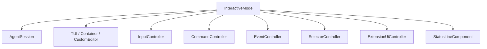

# Interactive UI

# 인터랙티브 UI 모듈

인터랙티브 UI 모듈은 `packages/coding-agent/src/modes/interactive-mode.ts`를 중심으로, 코딩 에이전트의 터미널 UI 렌더링, 사용자 입력, 세션 상태 표시, 명령 실행, 플랜/골 모드, 확장 UI, 서브에이전트 대시보드를 연결합니다. 핵심 비즈니스 로직은 `AgentSession`에 두고, `InteractiveMode`는 TUI와 세션 사이의 조정자 역할을 합니다.

## 핵심 구조

`InteractiveMode`는 `InteractiveModeContext`를 구현하며, 대부분의 UI 동작을 컨트롤러에 위임합니다.

`InteractiveMode`가 직접 보유하는 주요 상태는 다음과 같습니다.

- `session`, `sessionManager`, `agent`: 현재 에이전트 세션과 저장소 연결
- `ui`, `chatContainer`, `statusContainer`, `todoContainer`, `editor`: 화면 구성 요소
- `planModeEnabled`, `goalModeEnabled`, `goalModePaused`: 실행 모드 상태
- `pendingTools`, `pendingBashComponents`, `streamingComponent`: 진행 중인 출력/도구 UI
- `skillCommands`, `fileSlashCommands`: 자동완성 가능한 슬래시 명령 상태
- `loadingAnimation`, `#pendingWorkingMessage`: 에이전트 작업 중 표시되는 로더 상태

## 초기화 흐름

`init()`은 인터랙티브 세션의 전체 화면을 구성합니다.

1. `KeybindingsManager.create()`로 키바인딩을 불러옵니다.
2. `refreshSlashCommandState()`로 파일 기반 명령과 스킬 명령을 로드합니다.
3. 최근 세션, 모델 정보, LSP 서버 상태를 기반으로 `WelcomeComponent`를 구성합니다.
4. `chatContainer`, `pendingMessagesContainer`, `statusLine`, `editorContainer`를 `TUI`에 추가합니다.
5. `InputController.setupKeyHandlers()`와 `setupEditorSubmitHandler()`로 입력 처리를 연결합니다.
6. `SessionObserverRegistry`, `JobsObserver`, todo 목록, 테마 감시, 브랜치 감시를 초기화합니다.
7. `#restoreModeFromSession()`으로 이전 세션의 plan/goal 모드를 복원합니다.
8. `#subscribeToAgent()`로 `AgentSessionEvent`를 UI 이벤트 처리로 연결합니다.

초기화 이후 화면 업데이트는 `ui.requestRender()`를 통해 요청됩니다. 테마 변경 시에는 `clearRenderCache()`, `configureDefaultComposerChrome()`, `ui.invalidate()`가 함께 호출되어 렌더 캐시와 입력창 스타일을 갱신합니다.

## 입력창과 제출 상태

사용자 입력은 `CustomEditor`가 담당하고, 제출 흐름은 `InputController`와 `InteractiveMode`가 나누어 처리합니다.

`getUserInput()`은 외부 루프가 다음 입력을 기다릴 때 호출됩니다. 내부적으로 `Promise.withResolvers<SubmittedUserInput>()`를 만들고, `onInputCallback`에 resolve 함수를 보관합니다.

입력이 제출되면 `startPendingSubmission()`이 실행됩니다.

- `#pendingSubmittedInput`에 제출 객체를 저장합니다.
- 일반 사용자 입력이면 `recordLocalSubmission()`으로 로컬 제출 시그니처를 기록합니다.
- 낙관적 사용자 메시지를 `addMessageToChat()`으로 즉시 렌더링합니다.
- 에디터를 비우고 `ensureLoadingAnimation()`으로 작업 로더를 표시합니다.

취소 가능한 제출은 `cancelPendingSubmission()`에서 되돌립니다. 아직 `started`가 아닌 제출만 취소할 수 있으며, 일반 입력의 경우 원래 텍스트와 이미지를 에디터로 복원합니다.

`markPendingSubmissionStarted()`와 `finishPendingSubmission()`은 세션 실행 루프가 제출 처리 시작/종료를 UI에 반영할 때 사용합니다.

## 에디터 크롬과 작업 표시

기본 입력창 스타일은 `configureDefaultComposerChrome()`이 설정합니다.

- 날카로운 테두리(`sharp`)
- 닫힌 테두리 박스
- 기본 프롬프트 접두사 `getDefaultInputPrefix()`
- 플레이스홀더 `"Type your message..."`
- 좌우 패딩 1

`updateEditorChrome()`은 현재 모드에 따라 테두리 색과 입력 접두사를 바꿉니다.

- Bash 모드: `theme.getBashModeBorderColor()` 또는 경고색
- Python 모드: `theme.getPythonModeBorderColor()`
- 일반 모드: 세션 이름 기반 accent 색 또는 thinking level 색

작업 중 표시되는 로더는 `ensureLoadingAnimation()`이 만들고, 메시지 렌더링은 `renderWorkingMessage()`가 담당합니다. `interruptHint()`가 포함된 메시지는 본문과 중단 힌트를 서로 다른 shimmer 팔레트로 표시합니다.

## 슬래시 명령과 스킬 명령

`refreshSlashCommandState(cwd?)`는 현재 작업 디렉터리 기준으로 명령 자동완성을 다시 구성합니다.

- `loadSlashCommands()`로 파일 기반 명령을 읽습니다.
- `#rebuildSkillSlashCommands()`로 스킬 기반 명령을 만듭니다.
- `InputController.createAutocompleteProvider()`를 통해 에디터 자동완성 공급자를 설정합니다.
- `session.setSlashCommands()`로 세션에도 파일 명령을 전달합니다.

`#rebuildSkillSlashCommands()`는 `settings.get("skills.enableSkillCommands")`가 꺼져 있으면 빈 목록을 반환합니다. 켜져 있으면 `resolveSkillSlashCommands()`를 호출하고, 기본 GJC 워크플로 스킬(`DEFAULT_GJC_DEFINITION_NAMES`)은 자동완성 우선순위 `100`을 부여합니다.

## Plan 모드

Plan 모드는 사용자가 실행 전에 계획을 만들고 승인하는 흐름입니다.

`handlePlanModeCommand()`는 `/plan` 진입/종료를 처리합니다. 내부적으로 `#enterPlanMode()`가 실행되면 다음 작업을 수행합니다.

- 기존 활성 도구 목록을 `#planModePreviousTools`에 저장합니다.
- 가능하면 `resolve` 도구를 활성 도구에 추가합니다.
- `session.setPlanModeState()`로 plan 상태를 세션에 기록합니다.
- `session.setStandingResolveHandler()`에 `#runPlanApprovalResolve()`를 등록합니다.
- plan 역할 모델이 있으면 `#applyPlanModeModel()`로 임시 모델 전환을 시도합니다.
- `sessionManager.appendModeChange("plan", { planFilePath })`로 모드 변경을 기록합니다.

승인 요청은 에이전트가 `resolve` 도구를 호출하면서 시작됩니다. `#runPlanApprovalResolve()`는 계획 파일을 읽고, `resolvePlanTitle()`로 제목과 최종 파일명을 정규화한 뒤 `PlanApprovalDetails`를 반환합니다.

`handlePlanApproval()`은 승인 팝업을 띄우기 전에 `session.abort()`로 현재 에이전트 생성을 중단합니다. 이후 `showHookSelector()`로 다음 선택지를 제공합니다.

- `Approve and execute`
- `Approve and compact context`
- `Approve and keep context`
- `Refine plan`

승인되면 `#approvePlan()`이 계획 파일을 최종 경로로 옮기고, 필요 시 `handleClearCommand()` 또는 `handleCompactCommand()`를 실행한 뒤 `planModeApprovedPrompt`를 synthetic prompt로 `session.prompt()`에 전달합니다.

## Goal 모드

Goal 모드는 인터랙티브 세션에서 장기 목표를 유지하고 자동 이어가기 입력을 만드는 기능입니다.

`handleGoalModeCommand(rest?)`는 `/goal` 명령을 처리합니다. 인자는 `parseGoalSubcommand()`로 해석되며 지원되는 하위 명령은 다음과 같습니다.

- `set`
- `show`
- `pause`
- `resume`
- `drop`

`#enterGoalMode()`는 `goal` 도구를 활성 도구에 추가하고, `session.goalRuntime.createGoal()` 또는 `resumeGoal()`을 호출합니다. 상태는 `session.setGoalModeState()`와 `#updateGoalModeStatus()`로 반영됩니다.

자동 이어가기는 `#scheduleGoalContinuation()`이 담당합니다. 다음 조건을 모두 만족할 때만 800ms 뒤 goal continuation prompt를 제출합니다.

- `goal.continuationModes`에 `interactive`가 포함됨
- plan 모드가 아님
- goal 모드가 활성 상태이고 pause 상태가 아님
- 에디터와 pending 이미지가 비어 있음
- 세션이 streaming/compacting 중이 아님
- goal 상태가 `active`

세션이 바쁠 때는 바로 제출하지 않고 다시 예약합니다. 이는 `AgentBusyError`가 반복적으로 화면에 표시되는 상황을 막기 위한 방어 로직입니다.

## Todo 표시

Todo 상태는 `session.getTodoPhases()`에서 읽고 `#renderTodoList()`가 렌더링합니다.

접힌 상태에서는 활성 phase 하나와 최대 5개 task만 표시합니다. 펼친 상태(`todoExpanded`)에서는 모든 phase와 task를 표시합니다. 각 줄은 `#formatTodoLine()`에서 상태별 색상과 체크박스를 적용합니다.

- `completed`: 성공색과 취소선
- `in_progress`: accent 색
- `abandoned`: 오류색과 취소선
- 그 외: 흐린 색

`formatHudNoteMarker()`는 todo에 note가 있을 때 위첨자 형태의 마커를 덧붙입니다.

## 이벤트 처리와 세션 표시

`InteractiveMode`는 세션 이벤트 처리를 대부분 `EventController`에 위임합니다. `handleBackgroundEvent()`는 백그라운드 이벤트를 `#eventController.handleBackgroundEvent()`로 넘깁니다.

Goal 모드 관련 이벤트는 `#handleGoalSessionEvent()`가 직접 처리합니다.

- `agent_start`: goal continuation 타이머 취소
- `tool_execution_start`: 현재 turn에서 도구 호출이 있었음을 기록
- `message_start`: 실제 사용자 메시지면 continuation suppression 해제
- `goal_updated`: goal 상태와 status line 갱신
- `agent_end`: 완료/이어가기 여부 판단

LSP 시작 이벤트는 생성자에서 `EventBus`의 `LSP_STARTUP_EVENT_CHANNEL`에 구독합니다. `#handleLspStartupEvent()`는 welcome 화면 LSP 상태를 갱신하고, 실패한 서버가 있으면 `showWarning()`으로 표시합니다.

## 확장 UI 연결

확장과 커스텀 도구 UI는 `ExtensionUiController`가 담당하며, `InteractiveMode`는 컨텍스트 메서드를 노출합니다.

주요 메서드는 다음과 같습니다.

- `initializeHookRunner()`
- `createBackgroundUiContext()`
- `setHookWidget()`
- `setHookStatus()`
- `showHookSelector()`
- `showHookInput()`
- `showHookEditor()`
- `showHookNotify()`
- `showHookCustom()`
- `showExtensionError()`
- `showToolError()`

이 구조 덕분에 확장은 TUI 컴포넌트를 직접 만들 수 있지만, 렌더 위치와 생명주기는 `ExtensionUiController`가 관리합니다. `stop()`에서는 `clearExtensionTerminalInputListeners()`와 `clearHookWidgets()`를 호출해 남은 확장 UI를 정리합니다.

## 명령 컨트롤러와 선택기 컨트롤러

대부분의 슬래시 명령은 `CommandController`로 위임됩니다.

예를 들어 `handleExportCommand()`, `handleDumpCommand()`, `handleShareCommand()`, `handleUsageCommand()`, `handleCompactCommand()`, `executeCompaction()`은 모두 `#commandController`를 호출합니다.

선택형 UI는 `SelectorController`가 담당합니다.

- `showSettingsSelector()`
- `showThemeSelector()`
- `showHistorySearch()`
- `showAgentsDashboard()`
- `showModelSelector()`
- `showProviderOnboarding()`
- `showSessionSelector()`
- `handleResumeSession()`

세션 전환 전에는 `#prepareSessionSwitch()`가 `BtwController`와 확장 터미널 입력 리스너를 정리하고, plan review 컨테이너를 초기화합니다.

## 음성 입력 상태

`handleSTTToggle()`은 `settings.get("stt.enabled")`가 켜져 있을 때만 `STTController`를 생성하고 토글합니다.

상태별 UI 동작은 다음과 같습니다.

- `recording`: 하드웨어 커서와 터미널 커서를 숨기고 `#startMicAnimation()` 실행
- `transcribing`: 마이크 애니메이션을 멈추고 회색 커서 표시
- 그 외: `#cleanupMicAnimation()`으로 원래 커서 상태 복원

마이크 커서는 `#setMicCursor()`에서 `theme.icon.mic`과 RGB ANSI 색상으로 구성합니다. 너비 계산은 `visibleWidth()`를 사용해 와이드 심볼도 안전하게 처리합니다.

## 종료와 정리

`shutdown()`은 사용자가 세션을 종료할 때 호출되는 비동기 종료 절차입니다.

1. 현재 에디터 텍스트를 스냅샷합니다.
2. `sessionManager.flush()`로 세션 기록을 저장합니다.
3. `sessionManager.saveDraft()`로 미전송 draft를 저장합니다.
4. `session.dispose()`로 hook shutdown 이벤트를 발생시킵니다.
5. pending render를 한 tick 기다립니다.
6. `ui.terminal.drainInput(1000)`으로 남은 키 입력 escape sequence를 비웁니다.
7. `popTerminalTitle()` 후 `stop()`을 호출합니다.
8. resume 가능한 세션이면 stderr에 `APP_NAME --resume <sessionId>` 힌트를 출력합니다.
9. `postmortem.quit(0)`으로 프로세스 종료를 마무리합니다.

`stop()`은 동기 정리 메서드입니다. 로더, 음성 입력, 확장 UI, 이벤트 구독, observer, status line, jobs observer, editor, resize handler, session 구독, postmortem cleanup을 모두 해제한 뒤 `ui.stop()`을 호출합니다.

## AgentDashboard

`packages/coding-agent/src/modes/components/agent-dashboard.ts`의 `AgentDashboard`는 Task 서브에이전트 설정을 관리하는 TUI 대시보드입니다. `SelectorController.showAgentsDashboard()`를 통해 열리는 제어 센터이며, 프로젝트/사용자/번들 에이전트를 탐색하고 설정을 저장합니다.

대시보드는 세 부분으로 구성됩니다.

- `AgentListPane`: 검색어, 에이전트 목록, 선택 상태, 활성/비활성 상태 표시
- `AgentInspectorPane`: 선택한 에이전트의 source, description, path, 모델 해석 결과 표시
- `TwoColumnBody`: 목록과 inspector를 좌우 2열로 렌더링

데이터 로딩은 `#reloadData()`가 담당합니다.

- `discoverAgents(this.cwd)`로 에이전트를 찾습니다.
- `filterVisibleAgents()`로 표시 가능한 항목만 남깁니다.
- `task.disabledAgents` 설정을 읽어 비활성 상태를 적용합니다.
- `task.agentModelOverrides` 설정을 읽어 모델 override를 적용합니다.
- source 순서(`project`, `user`, `bundled`)와 이름순으로 정렬합니다.

모델 표시에는 `resolveAgentModelPatterns()`, `resolveConfiguredModelPatterns()`, `resolveModelOverride()`, `formatModelString()`이 사용됩니다. `#defaultPatternsFor()`는 기본 모델 패턴을, `#effectivePatternsFor()`는 override까지 반영한 최종 패턴을 계산합니다.

## 에이전트 생성 흐름

`AgentDashboard`는 새 에이전트 생성도 지원합니다.

`#beginCreateFlow()`가 입력 UI를 열고, 사용자가 설명을 제출하면 `#generateAgentFromDescription()`이 실행됩니다. 실제 생성 스펙은 `#runAgentCreationArchitect()`에서 별도 `AgentSession`을 만들어 얻습니다.

이 세션은 UI 없이 실행됩니다.

- `hasUI: false`
- `enableLsp: false`
- `enableMCP: false`
- `disableExtensionDiscovery: true`
- `toolNames: ["__none__"]`

시스템 프롬프트는 `agentCreationArchitectPrompt`, 사용자 프롬프트는 `agentCreationUserPrompt`를 `prompt.render()`로 구성합니다. 응답은 `extractAssistantText()`로 마지막 assistant text를 찾고, `parseGeneratedAgentSpec()`이 JSON 객체로 파싱합니다.

생성 결과는 다음 필드를 가져야 합니다.

- `identifier`
- `whenToUse`
- `systemPrompt`

`identifier`는 `IDENTIFIER_PATTERN`에 따라 소문자 kebab-case 2단어 이상이어야 하고, `whenToUse`는 `"Use this agent when"`으로 시작해야 합니다.

저장은 `#saveGeneratedAgent()`가 수행합니다. `getConfigDirs("agents", ...)`로 project 또는 user agents 디렉터리를 찾고, `${identifier}.md` 파일을 생성합니다. frontmatter는 `YAML.stringify()`로 만들며, 파일 본문에는 `systemPrompt`를 기록합니다.

## 코드 작성 시 주의점

이 모듈은 TUI 렌더링 경로이므로 화면에 표시되는 문자열은 폭과 제어문자를 고려해야 합니다. `AgentDashboard`는 `replaceTabs()`, `truncateToWidth()`, `wrapTextWithAnsi()`, `visibleWidth()`, `shortenPath()`를 사용해 목록, 설명, 경로, 스트리밍 미리보기를 안전하게 표시합니다.

`packages/coding-agent/`에서는 `console.log` 계열을 사용하지 않아야 합니다. 이 파일도 실패 기록에는 `logger.warn()`을 사용하고, 사용자 표시에는 `showStatus()`, `showWarning()`, `showError()`를 사용합니다.

세션 상태를 바꾸는 메서드는 UI 상태와 세션 상태를 함께 갱신해야 합니다. 예를 들어 plan 모드는 `planModeEnabled`, `session.setPlanModeState()`, `sessionManager.appendModeChange()`, `statusLine.setPlanModeStatus()`가 함께 움직이고, goal 모드는 `goalModeEnabled`, `session.setGoalModeState()`, `session.goalRuntime`, `statusLine.setGoalModeStatus()`가 함께 움직입니다.