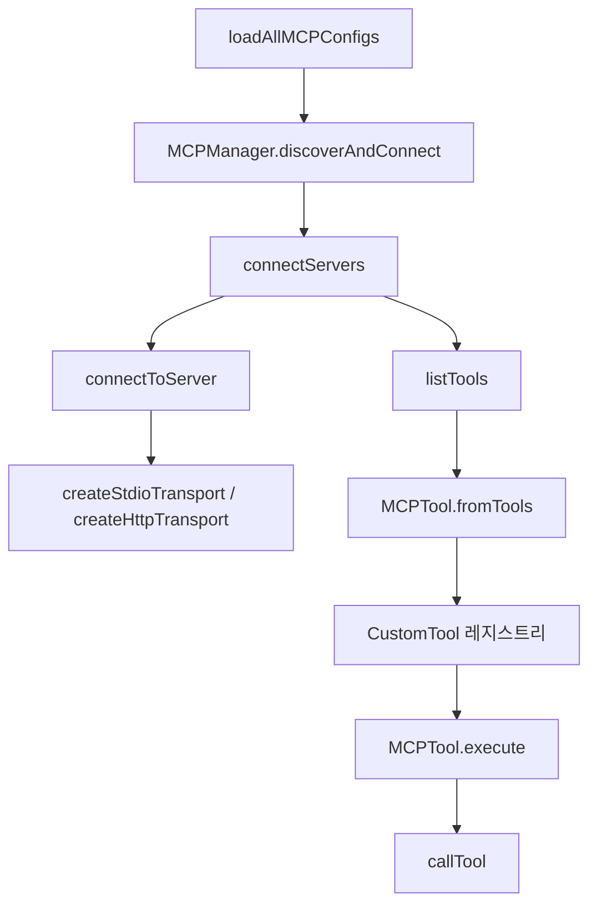

# MCP and External Protocols

## 개요

`runtime-mcp` 모듈은 GJC가 외부 MCP(Model Context Protocol) 서버와 연결하고, 서버가 제공하는 도구·리소스·프롬프트를 에이전트 런타임의 `CustomTool` 표면으로 통합하는 계층입니다.

이 모듈은 다음 책임을 가집니다.

- `.gjc/mcp.json` 및 capability discovery를 통해 MCP 서버 설정을 로드합니다.
- `stdio`, `http`, `sse` 전송 방식으로 MCP 서버에 연결합니다.
- MCP `initialize` 핸드셰이크, `tools/list`, `tools/call`, `resources/*`, `prompts/*` 요청을 처리합니다.
- MCP 도구 정의를 `CustomTool<TSchema, MCPToolDetails>`로 변환합니다.
- 연결 지연, 캐시된 도구, 재연결, OAuth 토큰 갱신, 리소스 구독 알림을 관리합니다.
- TUI에서 MCP 호출과 결과를 읽기 쉬운 JSON 트리 또는 텍스트로 렌더링합니다.



## 설정 로딩

MCP 설정의 진입점은 `loadAllMCPConfigs(cwd, options)`입니다. 이 함수는 `mcpCapability`를 통해 여러 출처의 MCP 서버 정의를 읽고, 실행에 필요한 `MCPServerConfig` 형태로 변환합니다.

핵심 흐름은 다음과 같습니다.

1. `loadCapability<MCPServer>(mcpCapability.id, { cwd })`로 서버 목록을 로드합니다.
2. `enableProjectConfig`가 `false`이면 project-level 설정을 제외합니다.
3. 사용자 설정 파일의 `disabledServers`를 `readDisabledServers(getMCPConfigPath("user", cwd))`로 읽어 비활성 서버를 제외합니다.
4. `convertToLegacyConfig()`가 canonical `MCPServer`를 기존 런타임에서 쓰는 `MCPServerConfig`로 변환합니다.
5. 기본적으로 `filterExaMCPServers()`가 Exa MCP 서버를 제거하고 API 키만 추출합니다.
6. `filterBrowser`가 켜진 경우 `filterBrowserMCPServers()`가 브라우저 자동화 MCP 서버를 제거합니다.

`validateServerConfig(name, config)`는 연결 전에 설정의 필수 필드를 검증합니다. `stdio` 서버는 `command`가 필요하고, `http` 또는 `sse` 서버는 `url`이 필요합니다. `command`와 `url`이 동시에 있는 설정은 한 서버가 두 전송 방식을 동시에 선언한 것으로 보고 오류 처리합니다.

## 설정 파일 쓰기

`config-writer.ts`는 MCP 설정 파일을 직접 읽고 수정하는 유틸리티입니다. 주요 함수는 다음과 같습니다.

- `readMCPConfigFile(filePath)`: 파일이 없으면 `{ mcpServers: {} }`를 반환합니다.
- `writeMCPConfigFile(filePath, config)`: 부모 디렉터리를 만들고, 임시 파일에 쓴 뒤 `rename`으로 원자적 저장을 수행합니다.
- `addMCPServer(filePath, name, config)`: 서버 이름과 설정을 검증한 뒤 새 서버를 추가합니다.
- `updateMCPServer(filePath, name, config)`: 기존 서버를 갱신하거나 없으면 추가합니다.
- `removeMCPServer(filePath, name)`: 등록된 서버를 제거합니다.
- `setServerDisabled(filePath, name, disabled)`: `disabledServers` 목록을 갱신합니다.

`writeMCPConfigFile()`은 저장 후 `invalidateFsCache(filePath)`를 호출합니다. capability filesystem cache가 오래된 설정을 계속 읽지 않도록 하기 위한 처리입니다.

서버 이름은 `validateServerName()`에서 제한합니다. 빈 문자열, 100자를 넘는 이름, 영문자·숫자·대시·언더스코어·점 이외 문자를 포함한 이름은 거부됩니다.

## 연결 클라이언트

`client.ts`는 MCP 서버와 직접 통신하는 얇은 클라이언트 계층입니다.

`connectToServer(name, config, options)`는 다음 순서로 연결을 준비합니다.

1. `createTransport(config)`로 전송 객체를 만듭니다.
2. `transport.onNotification`과 `transport.onRequest`를 연결합니다.
3. `initializeConnection()`으로 MCP `initialize` 요청을 보냅니다.
4. HTTP/SSE 전송에서 `startSSEListener()`가 있으면 `notifications/initialized` 전에 SSE listener를 시작합니다.
5. 초기화가 끝나면 `MCPServerConnection`을 반환합니다.

`initializeConnection()`은 `PROTOCOL_VERSION` 값인 `2025-03-26`을 사용하고, 클라이언트 capability로 `roots: { listChanged: false }`를 선언합니다. 이 선언 때문에 서버가 `roots/list`를 요청할 수 있으며, 기본 핸들러인 `defaultRequestHandler()`는 현재 project root를 file URL로 변환해 반환합니다.

`connectToServer()`는 `withTimeout()`으로 연결 시간을 제한합니다. 기본값은 `CONNECTION_TIMEOUT_MS`인 30초이며, 서버 설정의 `timeout`으로 덮어쓸 수 있습니다. 연결 중 오류가 발생하면 transport를 닫아 좀비 프로세스나 열린 HTTP 세션이 남지 않도록 합니다.

도구·리소스·프롬프트 조회 함수들은 capability를 먼저 확인하고, 결과를 `connection` 객체에 캐시합니다.

- `listTools(connection)`
- `listResources(connection)`
- `listResourceTemplates(connection)`
- `listPrompts(connection)`

실제 실행 함수는 다음과 같습니다.

- `callTool(connection, toolName, args, options)`: `tools/call`
- `readResource(connection, uri, options)`: `resources/read`
- `getPrompt(connection, name, args, options)`: `prompts/get`
- `subscribeToResources(connection, uris, options)`: `resources/subscribe`
- `unsubscribeFromResources(connection, uris, options)`: `resources/unsubscribe`

## MCPManager

`MCPManager`는 이 모듈의 중심 클래스입니다. 서버 검색, 연결, 도구 등록, 리소스/프롬프트 갱신, 재연결, 알림 구독 상태를 모두 관리합니다.

주요 상태는 다음과 같습니다.

- `#connections`: 연결된 서버의 `MCPServerConnection`
- `#tools`: 에이전트에 노출할 `CustomTool` 목록
- `#pendingConnections`: 아직 완료되지 않은 서버 연결
- `#pendingToolLoads`: 연결 후 `tools/list`가 진행 중인 작업
- `#pendingReconnections`: 서버별 진행 중인 재연결
- `#sources`: capability discovery에서 온 source metadata
- `#serverConfigs`: 재연결에 사용할 원본 서버 설정
- `#subscribedResources`: 리소스 구독 상태
- `#notificationsEpoch`, `#epoch`, `#disconnectEpochs`: 오래된 비동기 작업이 현재 상태를 덮어쓰지 못하게 하는 세대값

`discoverAndConnect(options)`는 `loadAllMCPConfigs()`로 설정을 로드한 뒤 `connectServers()`에 넘깁니다.

`connectServers(configs, sources, onConnecting)`는 여러 MCP 서버에 병렬로 연결합니다. 시작 시 긴 서버 연결이 전체 에이전트 부팅을 막지 않도록 짧은 startup timeout을 사용합니다. 서버별 설정 timeout이 있으면 `resolveStartupTimeoutMs()`가 최대 1.5초 안에서 grace를 더해 startup 대기 시간을 조정합니다.

연결이 startup window 안에 완료되면 즉시 `MCPTool.fromTools()`로 도구를 만듭니다. 연결이 아직 pending이지만 `MCPToolCache`에 이전 도구 정의가 있으면 `DeferredMCPTool.fromTools()`를 사용해 도구를 먼저 노출합니다. 이 경우 실제 실행 시점에 `waitForConnection(name)`으로 연결 완료를 기다립니다.

도구 목록은 `sortMCPToolsByName()`으로 항상 이름순 정렬됩니다. MCP 서버 연결 완료 순서는 비결정적이므로, 정렬하지 않으면 동일한 도구 집합도 매번 다른 byte sequence가 될 수 있습니다. 이 정렬은 Anthropic prompt caching에서 도구 정의 prefix가 불필요하게 무효화되는 것을 줄이는 역할을 합니다.

## 도구 브리지

`tool-bridge.ts`는 MCP 도구 정의를 GJC의 `CustomTool` 인터페이스로 변환합니다.

`createMCPToolName(serverName, toolName)`은 MCP 도구 이름을 에이전트 도구 이름으로 정규화합니다.

예를 들어 서버 이름이 `puppeteer`이고 MCP 도구 이름이 `puppeteer_screenshot`이면 중복 prefix를 제거해 `mcp__puppeteer_screenshot` 형태로 만듭니다. 정규화 과정에서는 소문자, 언더스코어 기반 이름만 남깁니다.

`MCPTool`은 이미 연결된 서버의 도구를 감쌉니다.

- `name`: 에이전트 도구 이름
- `label`: TUI 표시용 `server/tool`
- `description`: MCP tool description 또는 기본 설명
- `parameters`: `normalizeSchemaForMCP(tool.inputSchema)` 결과
- `mcpToolName`: 원본 MCP 도구 이름
- `mcpServerName`: 서버 이름

`MCPTool.execute()`는 `callTool()`을 호출하고, MCP 응답을 `CustomToolResult<MCPToolDetails>`로 변환합니다. `text`, `image`, `resource` 타입 content는 `formatMCPContent()`에서 LLM이 읽을 수 있는 텍스트로 합쳐집니다. MCP 응답의 `isError`가 참이면 결과 텍스트 앞에 `Error:`를 붙이고 details에도 `isError`를 기록합니다.

연결 오류는 `isRetriableConnectionError()`로 분류합니다. `ECONNREFUSED`, `ECONNRESET`, `EPIPE`, `fetch failed`, `transport closed`, HTTP `404`, `502`, `503` 같은 stale connection 가능성이 큰 오류는 재연결 후 한 번만 재시도합니다. abort 계열 오류는 `rethrowIfAborted()`가 `ToolAbortError`로 다시 던져 일반 MCP 오류 결과로 삼키지 않게 합니다.

`DeferredMCPTool`은 startup 시점에 캐시된 도구 정의만 있고 실제 연결이 아직 완료되지 않았을 때 사용됩니다. 사용자에게 도구 표면은 즉시 제공하되, 실행 시점에는 연결이 준비될 때까지 기다린 뒤 동일한 MCP 호출 흐름을 사용합니다.

## 리소스, 프롬프트, 알림

`MCPManager`는 서버가 지원하는 capability에 따라 리소스와 프롬프트를 best-effort로 로드합니다.

`#loadServerResourcesAndPrompts(name, connection)`은 다음을 수행합니다.

- `serverSupportsResources()`가 참이면 `listResources()`와 `listResourceTemplates()`를 호출합니다.
- 알림이 켜져 있고 서버가 `resources.subscribe`를 지원하면 모든 리소스 URI를 구독합니다.
- `serverSupportsPrompts()`가 참이면 `listPrompts()`를 호출하고 `#onPromptsChanged` 콜백을 호출합니다.

`setNotificationsEnabled(enabled)`는 리소스 구독을 전체적으로 켜거나 끕니다. 켤 때는 이미 연결된 서버의 리소스를 구독하고, 끌 때는 기존 구독을 해제합니다. `resolveSubscriptionPostAction()`은 구독 요청이 완료되는 동안 알림 상태나 epoch가 바뀐 경우 결과를 적용할지, 무시할지, rollback할지 결정합니다.

서버 notification은 `#handleServerNotification()`에서 처리합니다.

- `TOOLS_LIST_CHANGED`: `refreshServerTools(serverName)`
- `RESOURCES_LIST_CHANGED`: `refreshServerResources(serverName)`
- `RESOURCES_UPDATED`: 구독 중인 URI이면 `#onResourcesChanged` 호출
- `PROMPTS_LIST_CHANGED`: `refreshServerPrompts(serverName)`

리소스 refresh는 서버별로 중복 실행을 막기 위해 `#pendingResourceRefresh`를 사용합니다.

## 재연결과 수명 주기

transport가 닫히면 `connection.transport.onClose`가 `reconnectServer(name)`을 호출합니다. 재연결은 서버별로 하나만 진행되며, 이미 진행 중이면 같은 promise를 공유합니다.

`#doReconnect(name)`은 기존 connection을 닫고, 저장된 원본 config와 source metadata로 다시 연결합니다. 재시도 backoff는 `500ms`, `1000ms`, `2000ms`, `4000ms` 순서입니다. 재연결에 실패해도 기존 stale tool 목록은 즉시 제거하지 않습니다. 사용자가 선택한 도구가 registry에서 사라지는 것을 피하고, 다음 실행 또는 수동 reconnect에서 복구할 수 있게 하기 위한 선택입니다.

`disconnectServer(name)`은 특정 서버를 명시적으로 제거합니다.

- pending 연결과 재연결을 abort합니다.
- source와 config를 제거합니다.
- 리소스 구독을 해제합니다.
- transport의 `onClose`를 먼저 제거해 닫는 과정에서 재연결이 발생하지 않게 합니다.
- 해당 서버에서 온 `mcp__${name}_` 도구를 제거하고 변경 콜백을 호출합니다.

`disconnectAll()`은 전체 manager를 종료합니다. `#epoch`를 증가시켜 오래된 연결·재연결 작업이 이후 상태를 덮어쓰지 못하게 만들고, 모든 pending 작업과 연결을 정리합니다.

## OAuth 처리

OAuth 관련 코드는 두 파일로 나뉩니다.

`oauth-discovery.ts`는 인증 필요 여부와 OAuth endpoint를 탐지합니다.

- `detectAuthError(error)`: 401, 403, unauthorized, forbidden 등 인증 오류 패턴을 감지합니다.
- `extractMcpAuthServerUrl(error)`: 오류 메시지의 `Mcp-Auth-Server:` 값을 URL로 추출합니다.
- `extractOAuthEndpoints(error)`: JSON 오류 본문, challenge key-value, `WWW-Authenticate` 스타일 문자열에서 authorization/token endpoint를 추출합니다.
- `analyzeAuthError(error)`: 인증 필요 여부, 인증 종류, OAuth endpoint, 사용자 메시지를 구조화합니다.
- `discoverOAuthEndpoints(serverUrl, authServerUrl)`: well-known endpoint를 순회하며 OAuth metadata를 찾습니다.

`oauth-flow.ts`는 실제 OAuth authorization code + PKCE 흐름을 구현합니다.

`MCPOAuthFlow`는 `OAuthCallbackFlow`를 상속하며, `MCPOAuthConfig`의 `authorizationUrl`, `tokenUrl`, `clientId`, `clientSecret`, `scopes`, `redirectUri`, `callbackPort`, `callbackPath`를 사용합니다.

`generateAuthUrl(state, redirectUri)`는 authorization URL을 만들고 다음 값을 보장합니다.

- `response_type=code`
- `client_id`
- `scope`
- `redirect_uri`
- `state`
- PKCE `code_challenge`
- `code_challenge_method=S256`

client id가 없으면 `#tryRegisterClient()`가 OAuth authorization server metadata의 `registration_endpoint`를 사용해 dynamic client registration을 시도합니다.

`exchangeToken(code, state, redirectUri)`는 token endpoint에 `authorization_code` grant를 보내고 `OAuthCredentials`를 반환합니다. `refreshMCPOAuthToken()`은 `refresh_token` grant로 access token을 갱신하며, 서버가 새 refresh token을 주지 않으면 기존 refresh token을 유지합니다.

`MCPManager.#resolveAuthConfig()`는 연결 직전에 OAuth credential과 shell-command style config value를 해석합니다. HTTP/SSE 서버에는 `Authorization: Bearer ...` 헤더를 넣고, stdio 서버에는 `OAUTH_ACCESS_TOKEN` 환경 변수를 넣습니다. HTTP transport에서 401 계열 auth error가 나면 `HttpTransport.onAuthError`가 강제 refresh 후 새 헤더를 반환합니다.

## JSON-RPC 직접 호출

`json-rpc.ts`는 persistent transport 없이 HTTP POST로 MCP JSON-RPC 요청을 보내는 경량 유틸리티입니다.

`callMCP(url, method, params)`는 다음 형태의 JSON-RPC 2.0 body를 전송합니다.

```json
{
  "jsonrpc": "2.0",
  "id": "무작위 문자열",
  "method": "tools/list",
  "params": {}
}
```

응답은 `Accept: application/json, text/event-stream`으로 요청합니다. 서버가 SSE 형식으로 응답하면 `parseSSE(text)`가 `data: ` 라인을 찾아 JSON을 파싱합니다. SSE 데이터가 없으면 전체 응답을 JSON으로 파싱하는 fallback을 사용합니다.

이 유틸리티는 장기 연결, session lifecycle, server-to-client request 처리가 필요 없는 단발성 호출에 적합합니다. 일반적인 에이전트 도구 통합은 `MCPManager`와 transport 계층을 사용해야 합니다.

## TUI 렌더링

`render.ts`는 MCP 도구 호출과 결과를 TUI 컴포넌트로 변환합니다.

`renderMCPCall(args, theme, label)`은 pending 상태 라인과 인자 preview를 표시합니다. 인자는 `formatArgsInline(args, 70)`로 한 줄 요약됩니다.

`renderMCPResult(result, options, theme, args)`는 expanded 상태에 따라 다르게 렌더링합니다.

- expanded이면 먼저 `Args` 섹션을 JSON tree로 표시합니다.
- 결과 content의 첫 번째 text 값을 읽습니다.
- 출력이 JSON object 또는 array로 보이면 `renderJsonTreeLines()`로 구조화해 표시합니다.
- JSON 파싱에 실패하면 raw text를 표시합니다.
- collapsed 상태에서는 줄 수와 scalar 길이를 제한하고 `formatExpandHint()`를 붙입니다.

이 경로는 `MCPTool.renderCall()`과 `MCPTool.renderResult()`에서 호출됩니다.

## 로더와 에이전트 통합

`discoverAndLoadMCPTools(cwd, options)`는 MCP 모듈을 custom tools 시스템에 붙이는 공개 진입점입니다.

흐름은 다음과 같습니다.

1. `resolveToolCache(options.cacheStorage)`로 `MCPToolCache`를 준비합니다.
2. `new MCPManager(cwd, toolCache)`를 생성합니다.
3. `authStorage`가 있으면 `manager.setAuthStorage()`로 연결합니다.
4. `manager.discoverAndConnect()`로 서버를 찾고 연결합니다.
5. 반환된 MCP 도구들을 `LoadedCustomTool` 형태로 변환합니다.
6. 오류 map을 `{ path, error }` 배열로 변환합니다.

`LoadedCustomTool.path`는 source metadata가 있으면 `mcp:${serverName} via ${providerName}` 형식을 사용합니다. provider 정보가 없으면 `mcp:${tool.name}`으로 표시합니다. `resolvedPath`는 항상 `mcp:${tool.name}` 형태입니다.

이 함수의 반환값인 `MCPToolsLoadResult`는 에이전트 세션 생성 경로에서 사용됩니다. call graph상 `createAgentSession()`은 `setOnToolsChanged()`, `setOnPromptsChanged()`, `getServerInstructions()`를 통해 MCP manager와 연결됩니다. MCP 서버 instructions는 system prompt 주입에 사용될 수 있습니다.

## 내부 URL 프로토콜과의 연결

이 모듈은 `internal-urls` 계층과도 연결됩니다. 특히 `mcp-protocol.ts`는 MCP 리소스를 내부 URL처럼 다루기 위해 `MCPManager`를 조회합니다.

- `resolveTargetServer()`는 `getConnectedServers()`를 사용해 대상 서버를 찾습니다.
- `formatAvailableResources()`는 `getServerResources()`를 사용해 서버별 리소스와 템플릿을 표시합니다.
- `resolve()`는 MCP resource URI를 해석해 실제 resource read 경로로 넘깁니다.

이 구조 덕분에 MCP는 단순한 tool provider만이 아니라, 에이전트가 읽을 수 있는 외부 resource namespace로도 동작합니다. `local-protocol`, `memory-protocol`, `agent-protocol` 같은 다른 내부 프로토콜과 함께 `router.ts`에서 라우팅되는 외부/내부 참조 체계의 일부입니다.

## 확장할 때 주의할 점

MCP 전송 방식을 추가하려면 `createTransport(config)`와 `MCPServerConfig` 타입 계층을 함께 확장해야 합니다. transport는 최소한 `request`, `notify`, `close`, notification handler, server-to-client request handler를 지원해야 합니다.

도구 목록을 변경하는 코드는 반드시 `sortMCPToolsByName()` 이후의 안정적인 순서를 유지해야 합니다. 연결 완료 순서에 의존하면 prompt cache 효율이 떨어지고 테스트도 불안정해집니다.

연결·재연결·disconnect 경로를 수정할 때는 epoch 검사를 유지해야 합니다. `#epoch`, `#disconnectEpochs`, `#isCurrentConnection()`은 오래된 async 작업이 이미 닫힌 서버의 도구를 다시 등록하는 문제를 막는 핵심 안전장치입니다.

OAuth 토큰은 원본 config에 저장하지 않습니다. `#resolveAuthConfig()`는 연결 직전에만 access token을 주입하고, connection의 `config`는 다시 원본 config로 되돌립니다. 이는 캐시 키 안정성과 credential 노출 방지를 위한 의도적인 패턴입니다.

TUI 출력 경로에서는 raw MCP 결과가 길거나 구조가 깊을 수 있으므로 `renderJsonTreeLines()`, `truncateToWidth()`, shared JSON tree limit 상수를 사용해야 합니다. MCP 서버 출력은 외부 입력으로 취급하고, 표시 폭과 깊이를 제한하는 기존 패턴을 따라야 합니다.