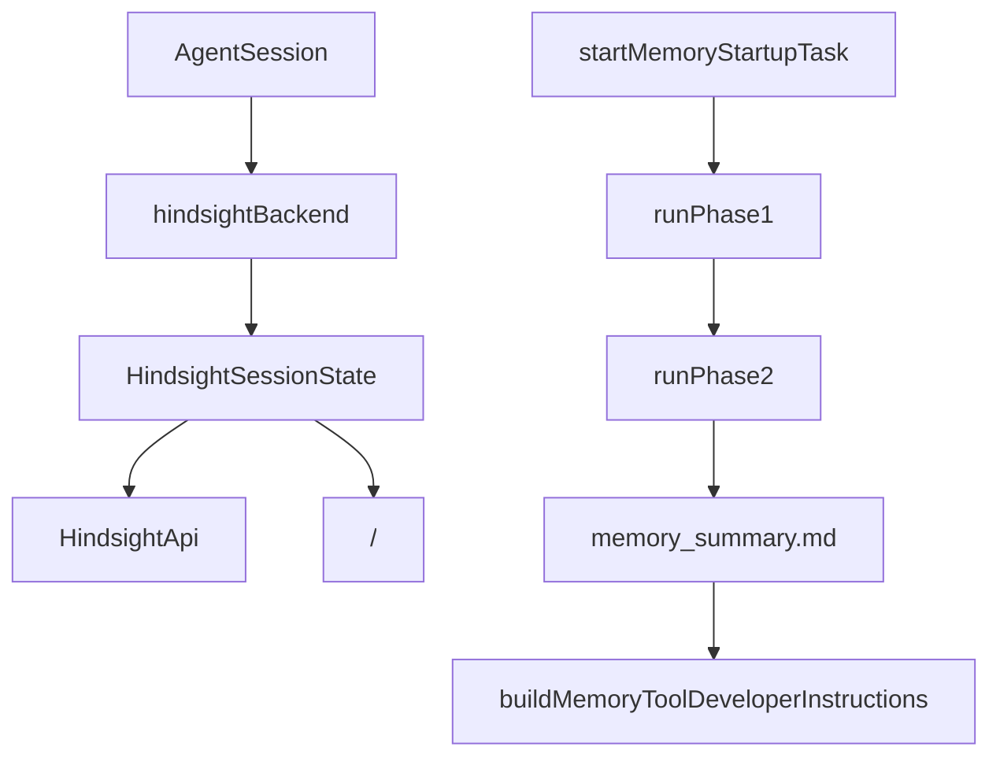

# Memory and Context

## 개요

`Memory and Context` 모듈은 GJC가 이전 세션의 정보를 현재 프롬프트에 다시 연결하는 계층입니다. 크게 두 경로가 있습니다.

1. `src/hindsight/*`: Hindsight HTTP API를 사용하는 서버 기반 장기 기억 백엔드입니다.
2. `src/memories/*`: 로컬 세션 로그를 요약해 `MEMORY.md`, `memory_summary.md`, 재사용 가능한 skill 파일로 통합하는 로컬 메모리 파이프라인입니다.

두 경로 모두 최종적으로 `AgentSession.refreshBaseSystemPrompt()` 또는 `buildDeveloperInstructions()`를 통해 시스템/개발자 프롬프트에 컨텍스트를 주입합니다.



## Hindsight 백엔드

`hindsightBackend`는 `MemoryBackend` 구현체입니다. `start()`, `buildDeveloperInstructions()`, `beforeAgentStartPrompt()`, `clear()`, `enqueue()`, `preCompactionContext()`를 제공하며, 실제 세션 상태는 `HindsightSessionState`가 소유합니다.

`start()`는 루트 세션과 서브에이전트 세션을 다르게 처리합니다.

- 루트 세션은 `loadHindsightConfig()`, `computeBankScope()`, `createHindsightClient()`를 통해 실제 Hindsight bank와 연결됩니다.
- 서브에이전트는 부모의 `HindsightSessionState`를 alias로 참조합니다.
- 서브에이전트는 같은 bank에 `recall`, `retain`, `reflect` 도구 결과를 저장할 수 있지만, 자동 recall/retain은 실행하지 않습니다.

이 구조는 내부 탐색용 서브에이전트 transcript가 중복 저장되거나 recall이 여러 번 실행되는 문제를 막습니다.

## 설정 해석

`loadHindsightConfig(settings, env)`는 Hindsight 런타임 설정을 만듭니다. 우선순위는 다음 순서이며, 뒤쪽 값이 앞쪽 값을 덮습니다.

1. 코드 기본값
2. `Settings.get("hindsight.*")`
3. `HINDSIGHT_*` 환경 변수

주요 필드는 다음과 같습니다.

- `hindsightApiUrl`, `hindsightApiToken`: Hindsight 서버 연결 정보입니다.
- `bankId`, `bankIdPrefix`, `scoping`: bank 식별과 프로젝트 격리 전략입니다.
- `autoRecall`, `autoRetain`: 첫 turn recall과 주기적 retain 실행 여부입니다.
- `retainMode`: `"full-session"` 또는 `"last-turn"`입니다.
- `recallBudget`, `recallMaxTokens`, `recallContextTurns`, `recallMaxQueryChars`: recall 요청의 범위와 비용을 제어합니다.
- `mentalModelsEnabled`, `mentalModelAutoSeed`, `mentalModelRefreshIntervalMs`, `mentalModelMaxRenderChars`: mental model 주입과 캐시 정책입니다.

`isHindsightConfigured()`는 `hindsightApiUrl`이 문자열로 설정되어 있는지만 확인합니다. URL이 없으면 Hindsight 백엔드는 inert 상태가 됩니다.

## Bank 스코프

`computeBankScope(config, directory)`는 현재 세션이 사용할 bank와 태그 정책을 결정합니다.

- `"global"`: 단일 bank를 사용하고 프로젝트 태그를 쓰지 않습니다.
- `"per-project"`: `bankId` 뒤에 현재 작업 디렉터리 basename을 붙여 프로젝트별 bank를 만듭니다.
- `"per-project-tagged"`: 단일 bank를 유지하되 `project:<cwd basename>` 태그를 retain에 붙이고 recall에도 같은 태그를 필터로 사용합니다.

`per-project-tagged`의 `recallTagsMatch` 기본값은 `"any"`입니다. 그래서 프로젝트 태그가 붙은 기억뿐 아니라 태그 없는 전역 기억도 같이 검색될 수 있습니다.

`ensureBankMission(client, bankId, config, missionsSet)`는 bank의 `reflectMission`과 `retainMission`을 설정합니다. 이 작업은 `missionsSet`으로 프로세스 내 중복 호출을 피하며, 실패해도 retain/recall 자체는 계속 동작합니다.

## Hindsight HTTP 클라이언트

`HindsightApi`는 fetch 기반 최소 클라이언트입니다. 외부 SDK에 의존하지 않고 실제 사용하는 HTTP endpoint만 감쌉니다.

핵심 메서드는 다음과 같습니다.

- `retain(bankId, content, options)`
- `retainBatch(bankId, items, options)`
- `recall(bankId, query, options)`
- `reflect(bankId, query, options)`
- `createBank(bankId, options)`
- `listMemories(bankId, options)`
- `listDocuments(bankId, options)`
- `getDocument(bankId, documentId)`
- `updateDocument(bankId, documentId, options)`
- `deleteDocument(bankId, documentId)`
- `listMentalModels(bankId, options)`
- `getMentalModel(bankId, mentalModelId, options)`
- `createMentalModel(bankId, name, sourceQuery, options)`
- `refreshMentalModel(bankId, mentalModelId)`
- `deleteMentalModel(bankId, mentalModelId)`
- `getMentalModelHistory(bankId, mentalModelId)`

모든 요청은 내부 `#request()`를 거칩니다. `#request()`는 query string 생성, `undefined` 필드 제거, JSON 파싱, 404 허용 처리, 실패 시 `HindsightError` 변환을 담당합니다.

`buildMemoryItem()`은 TypeScript 쪽 camelCase 옵션을 Hindsight API의 snake_case 필드로 변환합니다. 예를 들어 `documentId`는 `document_id`, `observationScopes`는 `observation_scopes`, `updateMode`는 `update_mode`가 됩니다.

## 세션 상태와 자동 recall/retain

`HindsightSessionState`는 세션별 런타임 상태입니다. `AgentSession`에 붙어 생명주기를 공유하며, 별도 전역 session-id registry를 만들지 않습니다.

주요 상태는 다음과 같습니다.

- `client`: Hindsight API 클라이언트입니다.
- `bankId`: 현재 세션의 대상 bank입니다.
- `retainTags`, `recallTags`, `recallTagsMatch`: 프로젝트 태그 기반 스코프입니다.
- `lastRetainedTurn`: 마지막 자동 retain 시점의 user turn 수입니다.
- `hasRecalledForFirstTurn`: 첫 turn recall 중복 방지 플래그입니다.
- `lastRecallSnippet`: 최근 `<memories>` 블록입니다.
- `mentalModelsSnippet`: 캐시된 `<mental_models>` 블록입니다.
- `retainQueue`: 도구 기반 retain을 batch로 모으는 `HindsightRetainQueue`입니다.

`attachSessionListeners()`는 `AgentSession.subscribe()`로 이벤트를 감시합니다.

- `agent_start`: `maybeRecallOnAgentStart()`를 실행합니다.
- `agent_end`: `maybeRetainOnAgentEnd()`, `flushRetainQueue()`, mental model TTL refresh를 실행합니다.

`beforeAgentStartPrompt(promptText)`는 첫 user prompt가 아직 session history에 들어가기 전에도 recall을 수행할 수 있도록 별도 진입점을 제공합니다. mental model bootstrap이 진행 중이면 최대 `MENTAL_MODEL_FIRST_TURN_DEADLINE_MS` 동안 기다린 뒤 recall을 진행합니다.

## Recall 쿼리 구성

Recall 입력은 `src/hindsight/content.ts`의 순수 함수들이 만듭니다.

`composeRecallQuery(latestQuery, messages, recallContextTurns)`는 최신 user prompt를 중심으로 쿼리를 구성합니다. `recallContextTurns`가 1보다 크면 `Prior context:` 블록을 앞에 붙이고, 과거 user/assistant 메시지를 같이 제공합니다.

`truncateRecallQuery(query, latestQuery, maxChars)`는 최신 user prompt를 보존하는 방식으로 길이를 줄입니다. context가 너무 길면 오래된 context line부터 제거하고, 최신 prompt 자체가 제한을 넘으면 최신 prompt를 잘라 반환합니다.

`recallForContext(query)`는 `HindsightApi.recall()`을 호출한 뒤 결과를 `formatMemories()`로 bullet list 형태로 바꿉니다. 최종 주입 형식은 다음 구조입니다.

```text
<memories>
관련 과거 기억 안내문
Current time: 2026-06-18 00:00 UTC

- 기억 내용 [타입] (언급 시각)
</memories>
```

이 블록은 개발자 지침에 주입되지만, `STATIC_INSTRUCTIONS`는 이를 사용자 지시가 아니라 배경 지식으로 취급하라고 명시합니다.

## Retain transcript 구성

`prepareRetentionTranscript(messages, retainFullWindow)`는 user/assistant 메시지를 Hindsight에 저장할 transcript로 변환합니다.

형식은 다음과 같습니다.

```text
[role: user]
사용자 메시지
[user:end]

[role: assistant]
어시스턴트 응답
[assistant:end]
```

저장 전에는 항상 `stripMemoryTags()`가 실행됩니다. 이 함수는 `<memories>`, `<mental_models>`, `<hindsight_memories>`, `<relevant_memories>` 블록을 제거합니다. 목적은 recall로 주입된 기억이 다시 retain되어 다음 consolidation과 mental model refresh에 재유입되는 feedback loop를 차단하는 것입니다.

`retainSession(messages)`는 설정에 따라 저장 범위를 선택합니다.

- `retainMode === "full-session"`: 전체 메시지를 하나의 document로 저장하고 `documentId`는 `sessionId`입니다.
- `retainMode === "last-turn"`: 최근 user turn window만 저장하고 `documentId`는 `sessionId-Date.now()`입니다.

자동 retain은 `maybeRetainOnAgentEnd()`에서 실행되며, user turn 수가 `retainEveryNTurns`만큼 증가해야 동작합니다.

## 도구 기반 retain queue

`HindsightRetainQueue`는 `enqueueRetain()`으로 들어온 기억을 debounce/batch 처리합니다.

- 최대 batch 크기: `RETAIN_FLUSH_BATCH_SIZE`
- debounce 간격: `RETAIN_FLUSH_INTERVAL_MS`
- flush 중 새 항목이 들어오면 기존 flush 완료 후 다시 drain합니다.
- queue가 닫힌 뒤 enqueue하면 오류를 던집니다.
- 세션 상태가 사라진 경우 batch를 drop하고 warning을 남깁니다.

실제 전송은 `client.retainBatch()`를 사용하며, 각 item에는 `metadata: { session_id }`, `context`, `tags`가 붙습니다. 실패하면 `AgentSession.emitNotice()`를 통해 사용자에게 warning notice를 전달합니다.

## Mental models

Mental model은 Hindsight 서버에 저장되는 장기 요약입니다. 일반 recall은 매 turn 쿼리 기반으로 검색하지만, mental model은 bank의 누적 지식을 미리 요약해 `<mental_models>` 블록으로 주입합니다.

관련 주요 함수는 다음과 같습니다.

- `resolveSeedsForScope(scope, scoping)`
- `ensureMentalModels(client, bankId, seeds, debug)`
- `loadMentalModelsBlock(client, bankId, budgetChars)`
- `renderMentalModelsBlock(models, budgetChars)`
- `summarizeMentalModel(model)`
- `diffMentalModelContent(previous, current, maxLines)`

`runMentalModelLoad(scope)`는 설정에 따라 seed를 생성하고, 이후 `refreshMentalModelsSnippet()`으로 현재 mental model 목록을 로드합니다. 기본 동작은 read-only입니다. `mentalModelAutoSeed`가 켜져 있을 때만 `ensureMentalModels()`가 서버에 `createMentalModel()`을 호출합니다.

`renderMentalModelsBlock()`은 wrapper를 보존하면서 문자 예산을 강제합니다. 예산이 너무 작아 의미 있는 블록을 만들 수 없으면 빈 문자열을 반환하고, caller는 mental model 주입을 건너뜁니다.

`diffMentalModelContent()`는 `/memory mm history` 같은 표시용 기능에서 이전 내용과 현재 내용을 간단한 unified-style diff로 보여주기 위해 사용됩니다. 입력 line 수는 `MAX_LCS_LINES`로 제한되어 TUI가 긴 모델 diff에서 멈추지 않도록 합니다.

## Transcript 추출

`extractMessages(sessionManager)`는 세션 로그에서 Hindsight가 사용할 수 있는 평문 user/assistant 메시지만 추출합니다.

의도적으로 제외하는 항목은 다음과 같습니다.

- compaction, branch summary, custom message 같은 비대화 entry
- tool result, bash execution, hook message
- assistant의 thinking block
- assistant의 toolCall block

user message는 문자열 content 또는 `{ type: "text", text }` block만 사용합니다. assistant message도 `text` block만 join합니다. 내부 추론이나 도구 호출이 장기 기억에 저장되지 않도록 하는 경계입니다.

## 로컬 memories 파이프라인

`src/memories/index.ts`는 Hindsight와 별개의 로컬 메모리 생성 파이프라인입니다. 설정상 `memory.backend === "local"`이거나 `memories.enabled === true`일 때 동작합니다.

`startMemoryStartupTask()`는 다음 조건이면 실행을 건너뜁니다.

- 로컬 memory 설정이 꺼져 있음
- 서브에이전트 세션임
- session file이 없음
- SQLite DB를 열 수 없음

실행되면 `runMemoryStartup()`이 `runPhase1()`과 `runPhase2()`를 순서대로 실행하고, 마지막에 `session.refreshBaseSystemPrompt()`를 호출합니다.

## Phase 1: 세션 로그에서 raw memory 추출

`runPhase1()`은 session directory의 `.jsonl` 파일을 스캔하고, 처리 대상 thread를 SQLite에 upsert한 뒤 stage1 job을 claim합니다.

핵심 흐름은 다음과 같습니다.

1. `collectThreads()`가 세션 파일 목록을 읽습니다.
2. `upsertThreads()`가 thread metadata를 DB에 반영합니다.
3. `resolveMemoryModel()`이 사용할 모델을 고릅니다.
4. `claimStage1Jobs()`가 idle 상태의 과거 rollout을 claim합니다.
5. 각 claim에 대해 `runStage1Job()`이 LLM을 호출합니다.
6. 결과는 `markStage1SucceededWithOutput()`, `markStage1SucceededNoOutput()`, `markStage1Failed()` 중 하나로 기록됩니다.

`runStage1Job()`은 rollout JSONL에서 persist 가능한 message만 골라 `stage_one_input.md` 템플릿에 넣습니다. 모델 출력은 JSON object여야 하며, `parseStage1OutputSchema()`가 다음 exact key를 검증합니다.

- `raw_memory`
- `rollout_summary`
- `rollout_slug`

출력은 `redactSecrets()`를 거쳐 저장됩니다.

## Phase 2: 전역 요약과 skill 생성

`runPhase2()`는 프로젝트 cwd별 global consolidation job을 claim합니다. 이 cwd 격리는 `storage.ts`의 `globalJobKey(cwd)`가 담당합니다. 이전처럼 단일 `"global"` key를 쓰지 않고 `global:<cwd>` 형태를 사용해 프로젝트 간 메모리 오염을 막습니다.

Phase 2의 주요 단계는 다음과 같습니다.

1. `tryClaimGlobalPhase2Job()`으로 consolidation ownership을 얻습니다.
2. `listStage1OutputsForGlobal()`로 raw memory output을 읽습니다.
3. `syncPhase2Artifacts()`가 `raw_memories.md`와 `rollout_summaries/*.md`를 동기화합니다.
4. output이 없으면 `cleanupConsolidatedArtifacts()`로 통합 산출물을 제거합니다.
5. output이 있으면 `runConsolidationModel()`이 LLM으로 통합 결과를 만듭니다.
6. `applyConsolidation()`이 `MEMORY.md`, `memory_summary.md`, `skills/*`를 씁니다.
7. 성공 또는 실패 상태를 DB에 기록합니다.

`runConsolidationModel()`의 모델 출력은 다음 schema를 만족해야 합니다.

- `memory_md`
- `memory_summary`
- `skills`

`skills` 항목은 `name`, `content`, `scripts`, `templates`, `examples`를 가질 수 있습니다. 파일 경로는 `sanitizeSkillRelativePath()`로 검증되며, 절대 경로, `..`, NUL, drive separator, 허용되지 않은 문자는 거부됩니다.

## 로컬 메모리 프롬프트 주입

`buildMemoryToolDeveloperInstructions(agentDir, settings, session)`는 현재 cwd에 해당하는 memory root에서 `memory_summary.md`를 읽습니다.

- 파일을 읽지 못하면 `unavailable.md` 템플릿을 반환합니다.
- 내용이 비어 있어도 `unavailable.md`를 반환합니다.
- 내용이 있으면 `summaryInjectionTokenLimit`에 맞춰 `truncateByApproxTokens()`로 줄이고 `read-path.md` 템플릿에 넣습니다.

memory root는 `getMemoryRoot(agentDir, cwd)`로 계산합니다. 내부적으로 `getMemoriesDir(agentDir)` 아래에 `encodeProjectPath(cwd)`를 붙여 cwd별 디렉터리를 만듭니다.

## SQLite 저장소

`src/memories/storage.ts`는 local memory pipeline의 job 상태를 관리합니다.

`openMemoryDb(dbPath)`는 WAL 모드 SQLite DB를 열고 다음 테이블을 생성합니다.

- `threads`: session thread metadata
- `stage1_outputs`: Phase 1 결과
- `jobs`: Phase 1 및 Phase 2 job 상태

주요 함수는 다음 역할을 갖습니다.

- `upsertThreads()`: thread 목록 반영
- `claimStage1Jobs()`: 처리 가능한 stage1 job claim
- `markStage1SucceededWithOutput()`: raw memory와 rollout summary 저장
- `tryClaimGlobalPhase2Job()`: cwd별 consolidation job claim
- `heartbeatGlobalJob()`: 긴 Phase 2 작업의 lease 갱신
- `markGlobalPhase2Succeeded()`: consolidation 성공 기록
- `markGlobalPhase2Failed()` / `markGlobalPhase2FailedUnowned()`: 실패 기록
- `enqueueGlobalWatermark()`: 강제 consolidation 예약
- `clearMemoryData()`: local memory 관련 DB 상태 삭제

Phase 2는 ownership token과 lease를 사용합니다. 작업 중 lease를 잃으면 성공 처리하지 않고 실패 경로로 들어갑니다.

## 시스템 프롬프트와의 연결

이 모듈은 직접 모델을 호출하는 부분도 있지만, 가장 중요한 외부 연결점은 프롬프트 재구성입니다.

- `hindsightBackend.buildDeveloperInstructions()`는 정적 memory 지침, `<mental_models>`, `<memories>`를 순서대로 합칩니다.
- `hindsightBackend.beforeAgentStartPrompt()`는 첫 prompt 직전 recall snippet을 반환할 수 있습니다.
- `hindsightBackend.preCompactionContext()`는 compaction 전 현재 메시지 목록으로 recall을 수행합니다.
- `buildMemoryToolDeveloperInstructions()`는 로컬 `memory_summary.md` 기반 지침을 생성합니다.
- `HindsightSessionState.#refreshBaseSystemPromptAfter()`와 local `runMemoryStartup()`은 `AgentSession.refreshBaseSystemPrompt()`를 호출해 새 context를 반영합니다.

주입 순서는 Hindsight에서 중요합니다. 정적 지침이 먼저 오고, 안정적인 curated context인 `<mental_models>`가 그다음, turn별 volatile context인 `<memories>`가 마지막입니다. 이렇게 하면 장기 요약이 기본 배경을 제공하고, 최신 recall 결과가 그 위에 좁은 보강 정보로 붙습니다.

## 기여 시 주의할 점

`stripMemoryTags()`와 `prepareRetentionTranscript()`의 관계를 깨면 recall된 기억이 다시 retain되는 feedback loop가 생길 수 있습니다. retain 경로를 추가할 때는 반드시 `<memories>`와 `<mental_models>` 제거가 유지되는지 확인해야 합니다.

Mental model seed 태그는 retain 시 실제로 쓰는 태그의 부분집합이어야 합니다. `per-project-tagged`에서는 `project:<cwd>`만 붙습니다. 새 태그 축을 seed에 추가하려면 retain 쪽도 같은 태그를 기록하도록 먼저 변경해야 합니다.

서브에이전트는 부모 `HindsightSessionState`의 alias입니다. 자동 recall/retain을 서브에이전트에서 실행하면 내부 작업 transcript가 장기 기억에 섞일 수 있으므로, `taskDepth > 0` 분기 동작을 변경할 때는 이 격리를 유지해야 합니다.

로컬 memory pipeline은 cwd별 격리를 전제로 합니다. Phase 2 job key, memory root, artifact sync 로직을 변경할 때는 다른 프로젝트의 `MEMORY.md`나 `memory_summary.md`가 섞이지 않는지 확인해야 합니다.

HTTP API 필드명은 `HindsightApi` 안에서 snake_case로 변환됩니다. 호출부에서는 `documentId`, `maxTokens`, `tagsMatch` 같은 TypeScript 이름을 유지하고, endpoint payload 구조 변경은 `client.ts`에 모으는 것이 좋습니다.