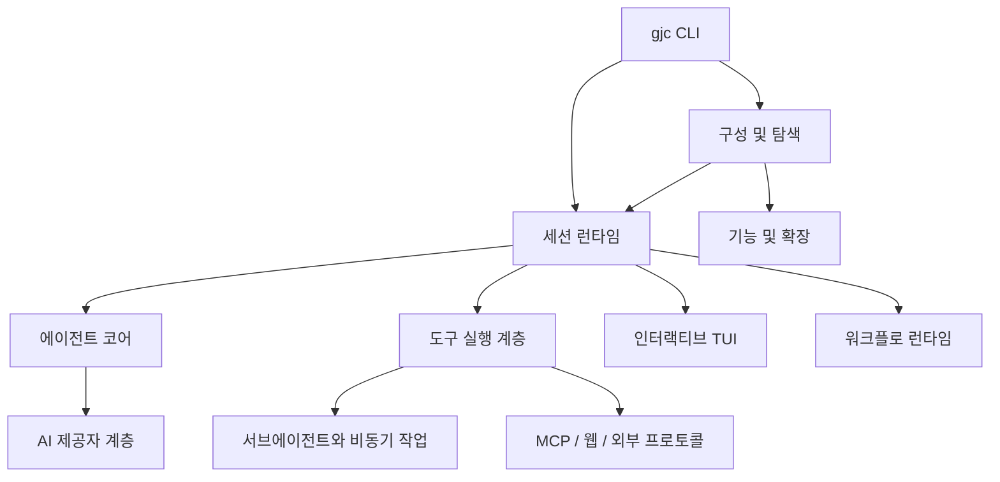

# gajae-code — Wiki

# gajae-code

`gajae-code`는 `gjc` CLI를 중심으로 동작하는 코딩 에이전트 러너입니다. 새 기능 구현, 요구사항 인터뷰, 검토된 계획 수립, tmux 기반 병렬 실행, 도구 호출, 세션 복원, 장기 메모리, 검증 기록까지 하나의 개발자 워크플로로 묶습니다.

이 저장소의 주 제품 표면은 `packages/coding-agent/`입니다. `gjc`를 실행하면 [Coding Agent CLI and Commands](coding-agent-cli-and-commands.md)가 명령을 해석하고, [Coding Agent Session Runtime](coding-agent-session-runtime.md)이 모델, 프롬프트, 도구, UI, 확장, 상태를 조립해 실제 에이전트 세션을 시작합니다. 나머지 패키지는 LLM 제공자, 터미널 UI, 네이티브 검색/편집, 통계, Python 자동화 같은 지원 경계로 분리되어 있습니다.



## 이 저장소가 해결하는 문제

Gajae-Code는 “LLM에게 코드 변경을 맡긴다”에서 끝나지 않고, 개발 작업에 필요한 운영 표면을 함께 제공합니다. 사용자는 `gjc`를 통해 대화형 세션을 열거나, 계획 기반 워크플로를 실행하거나, 서브에이전트와 백그라운드 작업을 붙여 더 긴 작업을 관리할 수 있습니다.

핵심 사용 흐름은 세 가지입니다.

첫째, 일반 코딩 세션입니다. [Coding Agent CLI and Commands](coding-agent-cli-and-commands.md)의 `runCli()`가 명령을 받고, [Configuration and Discovery](configuration-and-discovery.md)가 설정과 모델 프로필을 로드한 뒤, [Coding Agent Session Runtime](coding-agent-session-runtime.md)의 `createAgentSession()`이 세션을 구성합니다. 이후 실제 모델 호출과 도구 호출 루프는 [Support Boundary — Agent Core Runtime](support-boundary-agent-core-runtime.md)과 [Support Boundary — AI Provider Layer](support-boundary-ai-provider-layer.md)에 위임됩니다.

둘째, 도구 기반 실행입니다. 파일 편집, 셸 명령, AST 검색, 디버깅, 웹 검색, MCP 도구 호출은 [Execution and Tools](execution-and-tools.md)와 [Coding Agent — Tool Registry and Built-in Tool Backends](coding-agent-tool-registry-and-built-in-tool-backends.md)를 통해 공통 도구 표면으로 정규화됩니다. 실제 파일 변경은 [Editing and Vim](editing-and-vim.md), 장시간 실행과 하위 에이전트 관리는 [Subagents and Async Jobs](subagents-and-async-jobs.md)가 담당합니다.

셋째, 구조화된 워크플로입니다. GJC의 기본 워크플로는 `deep-interview`, `ralplan`, `team`, `ultragoal` 네 가지로 제한됩니다. 키워드 감지와 상태 기록은 [Coding Agent — Workflow Skills and State Runtime](coding-agent-workflow-skills-and-state-runtime.md)이 맡고, `.gjc/` 아래의 상태·계획·원장은 [Workflow Runtime](workflow-runtime.md)이 원자적으로 갱신합니다.

## 큰 아키텍처

`packages/coding-agent/`는 사용자에게 보이는 CLI, 세션 정책, 워크플로, 도구 연결, 인터랙티브 UI를 소유합니다. 그 아래에서 [Capabilities and Extensibility](capabilities-and-extensibility.md)는 `.gjc`, 플러그인, 사용자 홈, 프로젝트 설정에서 스킬·명령·MCP·훅·확장 모듈을 발견하고 병합합니다. [MCP and External Protocols](mcp-and-external-protocols.md)는 외부 MCP 서버를 GJC 도구로 연결하고, [Web Search and Research](web-search-and-research.md)는 최신 웹 검색 결과를 공통 응답 형식으로 정규화합니다.

UI는 별도 경계로 관리됩니다. [Interactive UI](interactive-ui.md)는 `AgentSession`과 터미널 화면 사이의 조정자이고, 실제 렌더링 구성 요소는 [Coding Agent — Interactive Modes and Terminal UI](coding-agent-interactive-modes-and-terminal-ui.md)와 [Support Boundary — Terminal UI](support-boundary-terminal-ui.md)에 분리되어 있습니다. 이 구조 덕분에 세션 로직은 UI 세부사항과 느슨하게 결합되고, TUI는 폭 계산, 마크다운, 입력 처리, diff 렌더링 같은 화면 책임에 집중합니다.

저장소 바깥 경계도 명확합니다. [Support Boundary — Native Bindings and Rust Helpers](support-boundary-native-bindings-and-rust-helpers.md)는 검색·AST·퍼지 매칭 같은 고비용 작업을 Rust/N-API로 내리고, [Support Boundary — Python RPC and RoboGJC](support-boundary-python-rpc-and-robogjc.md)는 GitHub 자동화 호스트가 `gjc --mode rpc`를 통해 코딩 에이전트를 실행하게 합니다. 통계와 벤치마크는 [Support Boundary — Stats and Benchmarks](support-boundary-stats-and-benchmarks.md)에서 핵심 런타임을 관찰하되 직접 변경하지 않는 지원 계층으로 유지됩니다.

## 주요 실행 흐름

일반 실행 흐름은 `gjc` 명령에서 시작합니다. CLI가 인자와 모드를 해석하면 설정 탐색, 모델 선택, capability discovery, 시스템 프롬프트 조립이 이어지고, `AgentSession`이 이벤트·메시지·도구·모델 상태를 관리합니다. 모델 스트림은 AI 제공자 계층에서 공통 이벤트로 정규화되어 세션과 TUI에 전달됩니다.

도구 호출 흐름은 세션이 도구 레지스트리에서 실행 대상을 찾는 것으로 시작합니다. 셸 실행은 `BashTool`과 `executeBash()`를 지나 출력 싱크와 비동기 작업 관리자로 연결되고, 구조적 편집은 `EditTool`이 적용 모드를 선택한 뒤 patch, replace, Vim 엔진, LSP writethrough 같은 하위 경로로 내려갑니다. 디버깅 도구는 DAP 계층으로, 웹 검색은 검색 provider 체인으로, MCP 호출은 런타임 MCP 클라이언트로 분기합니다.

워크플로 흐름은 일반 대화와 다르게 `.gjc/` 상태를 중심에 둡니다. 예를 들어 `gjc ralplan`은 계획 승인 상태와 산출물을 기록하고, `gjc team`은 tmux 기반 작업자와 팀 상태를 연결합니다. 워크플로 스킬은 사고 루프와 출력 계약을 제공하고, 런타임은 상태 파일, 감사 로그, HUD 캐시, 원자적 쓰기를 책임집니다.

## 개발 시작하기

이 저장소는 Bun 워크스페이스와 Rust/Python 지원 경계를 함께 사용합니다. 처음에는 의존성을 설치한 뒤 개발용 링크와 진단 명령으로 로컬 환경을 확인합니다.

```bash
bun install
bun run install:dev
bun run dev:doctor
```

일반 개발 루프에서는 다음 명령을 자주 사용합니다.

```bash
bun run check
bun run test
bun run lint
bun run build
```

TypeScript 검사는 `bun run check:ts` 또는 패키지별 `bun check` 경로를 사용합니다. Rust 쪽은 `bun run check:rs`, `bun run test:rs`, `bun run lint:rs`로 확인합니다. 네이티브 바인딩이나 배포 바이너리를 다룰 때는 `bun run build:native`와 release 계열 스크립트를 함께 봅니다.

## 어디서부터 읽을까

새 개발자는 먼저 [Coding Agent CLI and Commands](coding-agent-cli-and-commands.md)에서 공개 명령 표면을 확인한 뒤, [Coding Agent Session Runtime](coding-agent-session-runtime.md)으로 세션 조립 방식을 따라가면 전체 흐름을 빠르게 잡을 수 있습니다. 도구 실행을 바꾸려면 [Execution and Tools](execution-and-tools.md)와 [Editing and Vim](editing-and-vim.md)을, 워크플로를 바꾸려면 [Workflow Runtime](workflow-runtime.md)과 [Coding Agent — Workflow Skills and State Runtime](coding-agent-workflow-skills-and-state-runtime.md)을 먼저 읽는 것이 좋습니다.

패키지 경계가 헷갈릴 때는 [Dependency and Support Boundary](dependency-and-support-boundary.md)를 기준으로 보세요. 이 문서는 `packages/coding-agent/`가 소유하는 제품 동작과, `packages/ai`, `packages/agent`, `packages/tui`, `packages/natives`, `packages/stats`, `python/robogjc` 같은 지원 계층의 책임을 나누어 설명합니다.